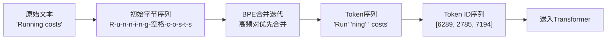
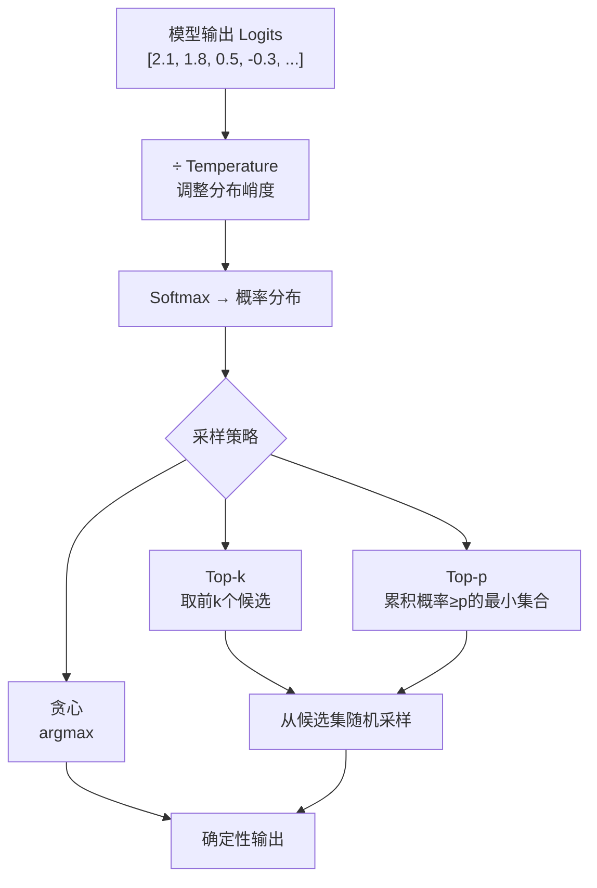
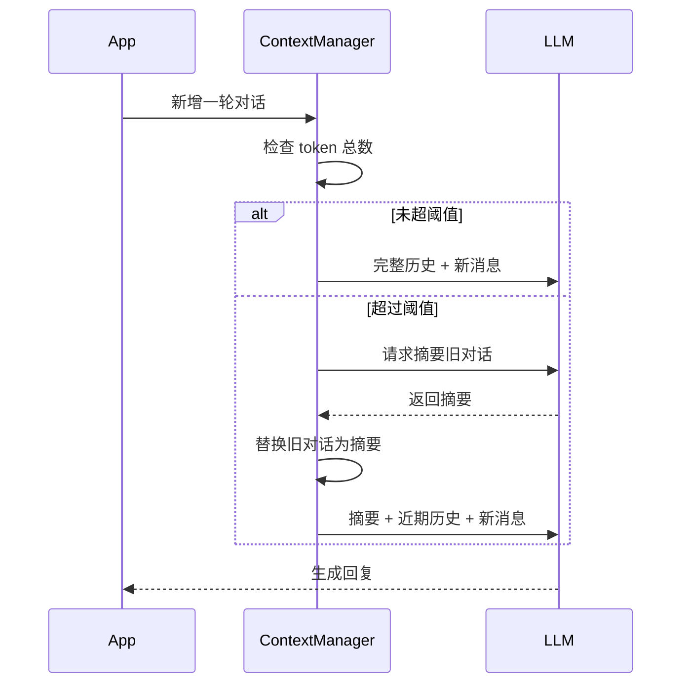

# 1.1 LLM 核心概念（Token、Temperature、上下文窗口）

---

## 一、核心概念

调用一次 LLM API，本质上是在做什么？你把一段文字发出去，模型返回一段文字——看起来像 HTTP 请求，但计费方式、延迟表现、输出行为，和传统 API 完全不同。理解这一切的起点，是搞清楚三个基础概念：**Token 是模型看到的最小单元**，**采样参数决定模型的"创造力"**，**上下文窗口是模型的工作记忆上限**。

这三个概念不是纯理论，它们直接影响你的工程决策：一个提示词写得太冗余，成本可能翻倍；Temperature 设错，客服机器人开始胡说八道；上下文窗口管理不当，长对话系统会在关键时刻"失忆"。

---

## 二、原理深讲

### 2.1 Tokenization：模型看到的不是字符，也不是单词

#### 工程动机

神经网络只处理数字。要让模型处理文字，必须先把文字映射成整数序列。最朴素的做法是"一个字符一个 ID"——但这会让序列太长、词汇表太小，模型难以学到语义关联。另一个极端是"一个单词一个 ID"——词汇表会爆炸，罕见词直接 OOV。**BPE（Byte Pair Encoding）** 是在这两个极端之间找到的工程平衡点。

#### BPE 核心机制

BPE 是一种**数据驱动的子词切分算法**，训练过程如下：

1. 初始词汇表：所有单字节字符（UTF-8 编码下约 256 个）
2. 统计语料中所有相邻 Token 对的出现频次
3. 把频次最高的 Token 对合并为一个新 Token
4. 重复步骤 2–3，直到词汇表达到目标大小（GPT-4 约 10 万）

结果是高频词（"the"、"is"）会被保留为单个 Token，低频词被拆成子词（"unbelievable" → "un" + "believ" + "able"），中文通常 1.5–2 个 Token 对应一个汉字。



**工程关键点**：

- **Token ≠ 字符 ≠ 单词**。"Hello" 是 1 个 Token，"你好" 是 2 个 Token，一段 1000 字的中文大约消耗 700–900 个 Token。
- 不同模型用不同的 Tokenizer，**Token 数不可跨模型直接对比**。GPT-4 和 Claude 对同一段文字的 Token 计数可能相差 10–20%。
- 用 `tiktoken`（OpenAI）或 `transformers`（HuggingFace）做成本预估时，**务必使用对应模型的 Tokenizer**。

```python
import tiktoken

enc = tiktoken.encoding_for_model("gpt-4o")
text = "Tokenization 是理解 LLM 成本的第一步。"
tokens = enc.encode(text)
print(f"Token 数: {len(tokens)}")   # 约 18-22
print(f"Token IDs: {tokens[:5]}…")
```

---

### 2.2 采样策略：控制模型的"随机性"

#### 工程动机

LLM 的输出本质上是一个**概率分布**：给定当前上下文，模型对词汇表中每个 Token 计算一个 logit 分数，再转化为概率。问题是：每次都选概率最高的词（贪心解码），输出会僵硬且重复；完全随机采样，输出会胡言乱语。采样参数就是在这两个极端之间的调节旋钮。

#### Temperature

Temperature $T$ 在 softmax 前对 logits 做缩放：

$$P(x_i) = \frac{\exp(z_i / T)}{\sum_j \exp(z_j / T)}$$

- $T \to 0$：等价于贪心解码，每次选最高概率 Token，输出确定性强
- $T = 1$：保持模型原始概率分布
- $T > 1$：分布变平坦，低概率词获得更多机会，输出更"发散"

**工程建议**：

| 场景 | 推荐 Temperature | 理由 |
|------|-----------------|------|
| 代码生成 / SQL / 结构化提取 | 0–0.2 | 要确定性输出，不要"创意" |
| 摘要 / 翻译 | 0.3–0.6 | 准确为主，允许少量语言变体 |
| 对话 / 客服 | 0.5–0.8 | 自然流畅，不能太机械 |
| 创意写作 / 头脑风暴 | 0.8–1.2 | 需要多样性 |
| 超过 1.5 | ❌ 慎用 | 大多数场景下输出质量下降明显 |

#### Top-p（核采样）

不直接限制 Temperature，而是**动态限制候选词集合**：按概率从高到低累加，直到累计概率达到 $p$，只在这个集合里采样。

- `top_p=0.9`：始终从覆盖 90% 概率质量的最小词集中采样
- 优势：自适应地处理概率分布的"形状"——分布尖锐时词集小，分布扁平时词集大

#### Top-k

直接限制候选词数量为 $k$ 个，只考虑概率最高的 $k$ 个 Token。相比 Top-p，Top-k 是硬截断，在某些场景下过于粗暴。



**工程建议**：大多数生产场景，**只调 Temperature 就够了**。同时调节 Temperature + Top-p + Top-k 会让行为变得难以预测，调试成本高。如果 API 支持，优先用 Temperature；需要更精细控制时再引入 Top-p。

---

### 2.3 上下文窗口：模型的"工作记忆"

#### 工程动机

Transformer 的注意力机制需要对输入序列中的所有 Token 两两计算关注度，这决定了**模型能"看到"的文本长度是有上限的**。超过这个上限，旧内容被截断，模型就"忘了"它。

这在单次问答中问题不大，但在以下场景会造成严重工程问题：

- 多轮对话积累到一定长度后，早期的用户信息丢失
- RAG 场景下塞入过多检索片段，超出窗口
- Agent 执行长任务，中间过程记录撑爆上下文

#### 主流模型上下文长度与价格对比（2026）

| 模型 | 上下文窗口 | 输入价格 | 输出价格 | 备注 |
|------|-----------|---------|---------|------|
| GPT-4o | 128K | $2.5 / 1M tokens | $10 / 1M tokens | 支持 Prompt Cache |
| GPT-4o mini | 128K | $0.15 / 1M tokens | $0.6 / 1M tokens | 性价比首选 |
| Claude Sonnet 4.6 | 200K | $3 / 1M tokens | $15 / 1M tokens | 长文档强 |
| Claude Haiku 4.5 | 200K | $0.8 / 1M tokens | $4 / 1M tokens | 低成本长上下文 |
| Gemini 2.5 Pro | 1M | $1.25 / 1M tokens（<200K） | $10 / 1M tokens | 超长上下文 |
| DeepSeek V3 | 128K | $0.27 / 1M tokens | $1.1 / 1M tokens | 成本极低 |
| Qwen3-235B | 128K | $0.6 / 1M tokens | $2.4 / 1M tokens | 国内首选 |

> ⚠️ 以上价格为参考基准，以各厂商官网为准，且长上下文通常有阶梯定价。

#### 滑动窗口策略

最简单的截断策略：始终保留最新的 $N$ 个 Token，丢弃最早的内容。

```
[系统提示] + [最近 K 轮对话] + [当前问题]
              ↑
         滑动保留这部分
```

**优点**：实现简单，延迟稳定  
**缺点**：早期关键信息（如用户偏好、任务目标）被丢弃

#### 摘要压缩策略

当对话积累到阈值时，用 LLM 对历史对话生成摘要，用摘要替代原始内容继续携带。

```
原始对话（2000 tokens）
      ↓ LLM 摘要
摘要（300 tokens）+ 最近 3 轮对话（600 tokens）
```

**优点**：信息损失少，可保留关键语义  
**缺点**：额外 LLM 调用增加延迟和成本；摘要本身可能丢失细节



**工程建议**：两种策略可以组合使用——先用滑动窗口处理短期内容，定期触发摘要压缩保留长期信息。实际上，大多数生产系统不需要极长上下文，**合理的 RAG + 短窗口对话** 往往比无脑堆上下文更可靠、更便宜。

---

## 三、工程视角：常见误区与最佳实践

**误区 1：用字数估算 Token 数，导致成本计算偏差**  
→ **正确做法**：中文约 1 字 = 1.5–2 Token，英文约 1 词 = 1.3 Token，但这只是粗估。成本敏感的系统必须在发送前用对应模型的 Tokenizer 精确计算，并在监控层按实际账单 Token 数校验估算误差。

**误区 2：所有场景用同一个 Temperature（通常是默认的 1.0）**  
→ **正确做法**：按任务类型分配 Temperature。尤其是结构化提取（JSON 输出、实体识别）务必设为 0–0.2，否则输出格式随机漂移，下游解析会持续报错。建议在配置文件中按任务类型维护一张 Temperature 映射表。

**误区 3：上下文窗口很大，所以把所有信息都塞进去**  
→ **正确做法**：注意力机制对长距离信息有"Lost in the Middle"问题——中间位置的内容注意力权重会衰减，模型可能忽略关键信息。重要内容应放在**提示词开头或结尾**。此外，超长 Prompt 在首次请求时延迟显著上升，影响用户体验。

**误区 4：以为 Prompt Cache 是自动生效的**  
→ **正确做法**：OpenAI 的 Prompt Cache 要求相同前缀超过 1024 Token 才触发，且 Cache 有 TTL。Claude 需要显式标记 `cache_control`。需要在架构层刻意设计"稳定前缀"（系统提示 + 固定上下文），把变化部分放在后面，才能有效命中缓存、降低成本。

**误区 5：忽视 Tokenizer 对特殊字符的处理**  
→ **正确做法**：代码、表格、JSON 这类结构化文本 Token 效率低——一个 `{` 就是一个 Token。做 RAG 或 Function Calling 时，如果检索片段包含大量代码，Token 消耗会远超预期。可以在入库阶段对代码块做精简压缩，或换用对代码更友好的 Tokenizer 模型（如 DeepSeek Coder 系列）。

---

## 四、延伸思考

> 🤔 **思考题 1**：上下文窗口已经从 4K 扩展到 1M Token，理论上 RAG 的价值会被削弱——直接把所有文档塞进 Prompt 不就够了？这个判断在什么条件下成立，在什么条件下依然需要 RAG？（提示：考虑成本、延迟、知识更新频率三个维度）

> 🤔 **思考题 2**：BPE 算法在多语言场景下有天然的"不公平性"——英文 Token 效率远高于中文和阿拉伯语，同样的语义内容，中文消耗的 Token 数是英文的 1.5–3 倍。这对全球化 AI 产品的成本结构和公平性有什么影响？有哪些已知的解决方向？