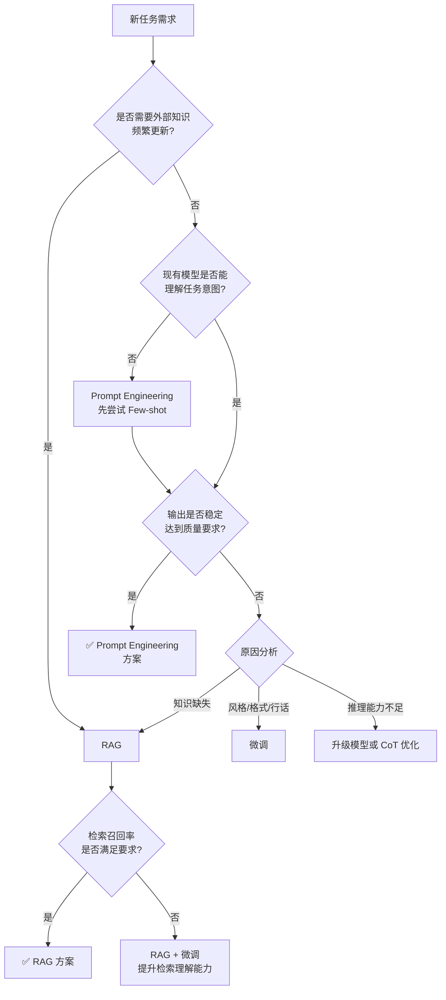
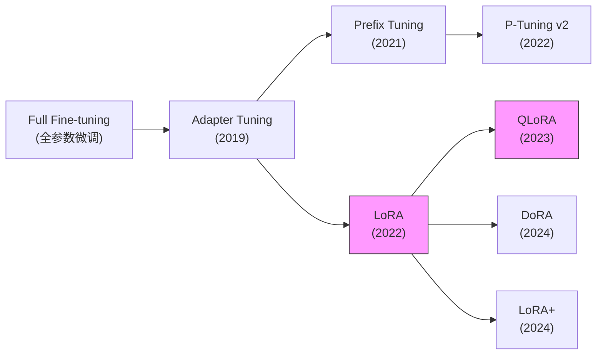
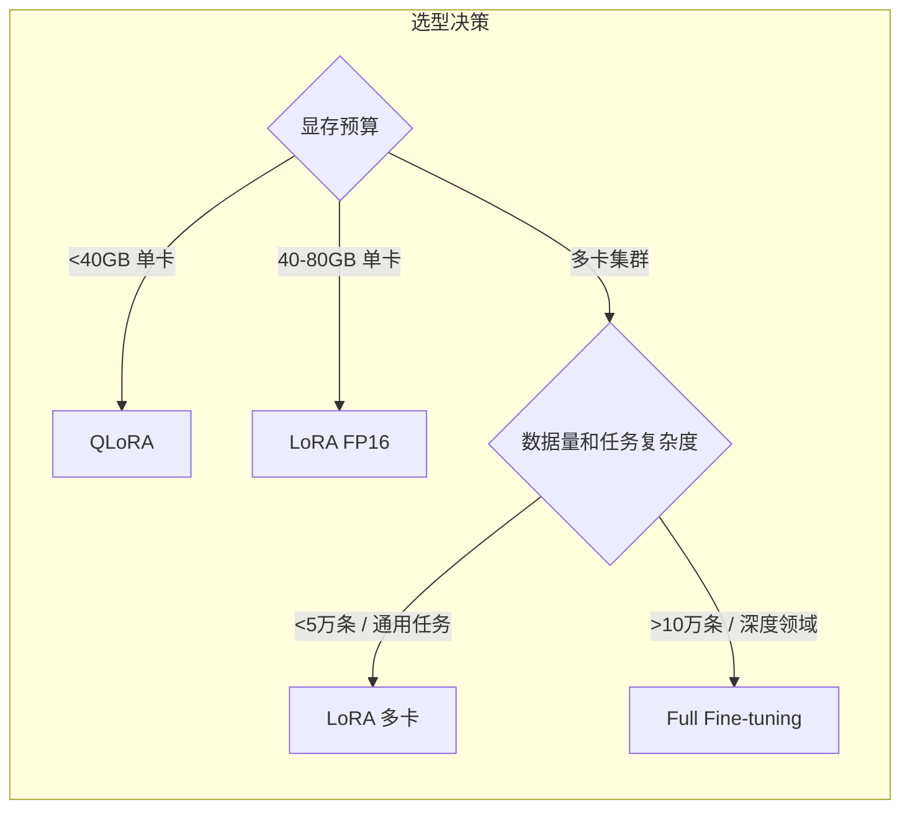

## 1.2.1 微调技术全景与选型决策

---

### 一、核心概念

假设你在做一个法律合同审查助手。开箱即用的 GPT-4 能读懂合同，但它不熟悉你公司的审查标准，也不知道如何输出特定格式的审查报告。此时你面临三条路：写更好的 Prompt 来描述要求、把公司的审查规范和合同库塞进 RAG、或者直接在模型上进行微调。

这三条路并非优劣之别，而是**不同约束条件下的最优解**。大量工程项目失败的根源，恰恰是在错误的场景选了错误的路线——用 Prompt Engineering 处理需要模型内化领域知识的任务，或者用昂贵的微调解决一个精心设计的 RAG 就能搞定的问题。

微调的本质是**改变模型的参数分布**，使其更适配某类任务的输入输出模式。它解决的是 Prompt 和 RAG 解决不了的问题：当目标行为需要深度内化而非运行时注入时，当输出格式要求极度一致时，当推理链路必须足够短以控制延迟和成本时。理解这个前提，才能在选型时做出正确判断。

---

### 二、原理深讲

#### 2.1 三路线适用边界对比

先建立一个决策框架。以下四个维度是最关键的选型依据：

| 决策维度 | Prompt Engineering | RAG | 微调 |
|---------|-------------------|-----|------|
| **任务数据量** | 无需数据（0-shot）或极少示例 | 需要知识文档库，无需标注数据 | 需要高质量标注数据（百条起步） |
| **知识更新频率** | 即改即用 | 索引更新，实时性强 | 重新训练，更新代价高 |
| **推理成本** | 长 Prompt 消耗大量 Token | 检索+生成，有额外延迟 | 短 Prompt 即可触发行为，最省 Token |
| **隐私要求** | 数据不离开调用方（纯本地除外） | 文档存本地可控 | 训练数据可能经过第三方（API 微调服务） |
| **核心优势** | 灵活、零成本试验 | 知识可追溯、实时更新 | 行为稳定、输出格式一致、延迟低 |
| **核心劣势** | 行为不稳定、易被越狱 | 检索失败时效果崩塌 | 数据工程成本高、知识难更新 |

**工程建议**：三路线有明确的决策顺序——先尝试 Prompt Engineering，如果效果到达瓶颈再考虑 RAG，当 RAG 仍无法满足需求（如输出风格、领域行话、推理模式）时才上微调。微调应该是最后的选择，不是第一反应。

以下决策树梳理了典型场景的选路逻辑：

#### 2.2 参数高效微调（PEFT）演进路线

全参数微调（Full Fine-tuning）在 7B 参数模型上需要约 112GB 显存（FP16 + 优化器状态），这在大多数工程场景下不现实。PEFT 的出发点是：**大模型的预训练知识大部分应该被保留，只需要调整很小一部分参数来适配新任务**。

各方法的演进路线如下：

**Adapter Tuning**：在 Transformer 的每一层中插入小型瓶颈结构（bottleneck），训练时只更新这些 Adapter 层，原模型参数冻结。缺点是推理时引入了额外的串行计算，增加了 latency。

**Prefix Tuning / P-Tuning v2**：不修改网络结构，而是在输入或每层的 Key/Value 前面插入可训练的"软提示"（soft prompt）向量。P-Tuning v2 将可训练前缀延伸到所有 Transformer 层，效果接近全参数微调。但这类方法的可训练向量对任务泛化性较弱，工程中采用率不高。

**LoRA（Low-Rank Adaptation）**：目前工程实践中最主流的方法。核心思想是：对需要微调的权重矩阵 $W$，不直接修改它，而是在旁边并联一个低秩分解 $\Delta W = BA$（其中 $B \in \mathbb{R}^{d \times r}$，$A \in \mathbb{R}^{r \times k}$，$r \ll \min(d,k)$）。推理时可以将 $\Delta W$ 合并回 $W$，实现零额外延迟。

| 方法 | 核心创新 | 可训练参数比例 | 推理开销 | 工程成熟度 |
|------|---------|------------|--------|----------|
| Full FT | 基线 | 100% | 无额外开销 | ⭐⭐⭐⭐⭐ |
| Adapter | 插入瓶颈层 | ~3-5% | +串行层延迟 | ⭐⭐⭐ |
| Prefix Tuning | 软提示前缀 | <1% | 占用上下文长度 | ⭐⭐ |
| LoRA | 低秩旁路 | ~0.1-1% | 可合并，零开销 | ⭐⭐⭐⭐⭐ |
| QLoRA | LoRA + 4bit 量化 | ~0.1-1% | 量化推理略慢 | ⭐⭐⭐⭐⭐ |
| DoRA | 权重分解为幅度+方向 | ~0.1-1% | 可合并，零开销 | ⭐⭐⭐ |
| LoRA+ | 对 A/B 矩阵用不同学习率 | ~0.1-1% | 可合并，零开销 | ⭐⭐⭐ |

**QLoRA**：在 LoRA 基础上，将基座模型量化为 NF4（4-bit Normal Float），使 70B 模型可以在单张 A100（80GB）上训练，显存需求从 160GB+ 降至约 48GB。代价是训练速度略慢于纯 FP16 LoRA。

**DoRA**：将权重矩阵分解为幅度（magnitude）和方向（direction）两个分量，只对方向部分应用 LoRA 更新。论文报告在多数任务上略优于 LoRA，但工程中差异通常在误差范围内，不必刻意追新。

**LoRA+**：发现 LoRA 中矩阵 A 和 B 使用相同学习率是次优的，为 B 矩阵设置更高学习率（建议比值 $\lambda = 16$）可以提升收敛速度。实现成本极低，是一个值得默认开启的小优化。

#### 2.3 全参数微调 vs PEFT 的权衡

**什么时候必须上全参数微调？**

显存是首要约束，但效果天花板同样重要。PEFT 方法在以下场景中往往不够用：

- **领域知识极度专业**：如蛋白质结构预测、法律条文精确适用，模型需要从根本上重塑内部表示
- **数据量充足（10万+）**：此时全参数微调的效果提升能覆盖额外的计算成本
- **需要改变模型"世界观"**：如让模型完全使用不同的输出语言习惯或推理范式

**PEFT 的实际效果天花板**：在大多数指令跟随和格式化任务上，LoRA（r=16~64）的效果与全参数微调的差距在 1-3% 以内。对于典型的企业应用场景（客服、文档处理、格式转换），这个差距完全可以接受。

---

### 三、工程视角：常见误区与最佳实践

**误区一：把微调当"万能药"，跳过 Prompt Engineering 直接开始收集数据**
→ **正确做法**：先用 GPT-4 或 Claude 加精心设计的 Prompt 跑通任务，确认任务是可完成的，再用这些高质量输出作为微调数据。很多时候 Prompt Engineering 本身就够了，或者它的输出可以直接作为微调数据集的基础。

**误区二：LoRA rank 越大越好**
→ **正确做法**：rank（r）是容量与过拟合风险的权衡。对于数据量 <1000 条的小任务，r=8 甚至 r=4 通常已经足够；数据量 >1万条的任务可以尝试 r=32 或 r=64。blindly 使用 r=128 在小数据集上几乎必然过拟合。Alpha 的设置通常取 `alpha = 2 * rank`，这是经验上较稳定的起点。

**误区三：忽略 target_modules，只在 q_proj/v_proj 上加 LoRA**
→ **正确做法**：默认只在 Q/V 矩阵加 LoRA 是 LoRA 原论文的设置，但工程实践表明，在所有线性层（q/k/v/o projections + FFN 的 up/down/gate projections）上加 LoRA 通常能获得更好的效果，代价是可训练参数量增加约 4 倍，但仍远小于全参数微调。如果效果不理想，先检查 target_modules 的覆盖范围。

**误区四：用 QLoRA 微调后直接拿量化模型做推理**
→ **正确做法**：QLoRA 的量化是为了训练时节省显存，不代表推理也应该用 NF4 量化模型。训练结束后，应该将 LoRA 权重合并（merge）回 BF16 的基座模型，再按推理需求决定是否量化（GPTQ/AWQ）。混淆"训练量化"和"推理量化"会导致效果损失叠加。

**误区五：微调数据集不做质量过滤，直接用原始数据**
→ **正确做法**：数据质量对微调效果的影响远大于数据量。100 条高质量标注的效果通常好于 1000 条噪声数据。最低限度的清洗流程：去除重复样本、过滤掉过短/过长的输入输出、用 LLM 对输出质量打分后过滤低分样本。

---

### 四、延伸思考

> 🤔 **思考题一**：LoRA 选择在 Attention 的 Q/K/V 矩阵上加适配器，是否意味着 FFN 层不重要？随着模型规模增大（如 70B vs 7B），这个设计选择是否需要调整？可以参考 [LongLoRA](https://arxiv.org/abs/2309.12307) 和 [MoLoRA](https://arxiv.org/abs/2402.00433) 等工作来思考这个问题。

> 🤔 **思考题二**：随着模型的上下文窗口越来越长（128K+），Prefix Tuning 这类"占用上下文长度"的方法是否会迎来复兴？当推理成本大幅下降时，"参数效率"和"计算效率"的权衡曲线会如何变化？