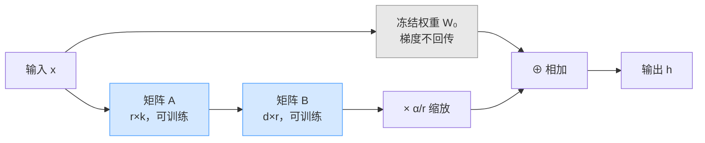

## 1.2.2 LoRA 原理精讲

### 一、核心概念

全参数微调（Full Fine-tuning）的问题不是"能不能用"，而是"用不起"。以 LLaMA-3-70B 为例，模型参数量 700 亿，FP16 存储需要 140GB 显存，梯度和优化器状态再乘以 3，合计接近 500GB——四张 A100 80G 才勉强装得下，普通团队根本碰不了。

LoRA（Low-Rank Adaptation）的工程动机很直接：**既然我们不需要从头训练一个新模型，只是要让模型学会新的"风格"或"领域知识"，那么更新矩阵本身是否存在冗余？** 论文作者的假设是：模型在下游任务上的参数变化量 ΔW 本质上是低秩的（intrinsic low rank），即它可以用两个小矩阵的乘积来近似。这一假设已被大量实验验证——在多数微调任务中，秩只需 4 到 16 就能恢复接近全参数微调的效果。

这个想法将一个 175B 参数模型的微调成本压缩到了消费级显卡可接受的范围，是当前工业界最主流的 PEFT 方案。

---

### 二、原理深讲

#### 2.1 低秩分解：ΔW = BA 的数学直觉

设原始权重矩阵为 $W_0 \in \mathbb{R}^{d \times k}$，全参数微调等价于找到一个更新量 $\Delta W$，使得：

$$W = W_0 + \Delta W$$

LoRA 的核心约束是：**不直接训练 $\Delta W$，而是将其参数化为两个低秩矩阵的乘积**：

$$\Delta W = BA, \quad B \in \mathbb{R}^{d \times r},\ A \in \mathbb{R}^{r \times k},\ r \ll \min(d, k)$$

以 GPT-3 的某个注意力投影层为例：$d = k = 12288$，原始参数量约 1.5 亿；若取秩 $r = 8$，则 $B$ 和 $A$ 合计只有 $12288 \times 8 \times 2 \approx 20$ 万参数，压缩比超过 700 倍。

**初始化策略很关键**：训练开始时，$A$ 用高斯随机初始化，$B$ 初始化为全零。这保证了 $\Delta W = BA = 0$，即微调起点完全等同于预训练模型，不会破坏模型原有能力。

**前向传播**中，冻结 $W_0$ 不参与梯度计算，只训练 $B$ 和 $A$：

$$h = W_0 x + \Delta W x = W_0 x + B A x$$

加上缩放因子 $\frac{\alpha}{r}$（后面会讲），完整公式为：

$$h = W_0 x + \frac{\alpha}{r} B A x$$



**为什么低秩假设成立？** 直觉上，从一个通用语言模型适配到特定垂直任务，本质是在已有表征空间中做线性组合，而不是学全新特征。实验表明，即便是 GPT-3 这种超大模型，下游任务的适配矩阵的有效秩（effective rank）往往不超过几十。

---

#### 2.2 关键超参解析

| 超参 | 作用 | 推荐起点 | 常见坑 |
|---|---|---|---|
| `r`（rank） | 低秩矩阵秩，决定参数量与表达能力 | 8–16 | 盲目调大，显存爆炸收益递减 |
| `lora_alpha` | 缩放系数，实际学习率倍数 ≈ alpha/r | 16–32 | 改 r 忘了同比调 alpha |
| `lora_dropout` | A 矩阵输出的 dropout 概率 | 0.05–0.1 | 数据量少时建议开启 |
| `target_modules` | 注入 LoRA 的目标层名称 | q_proj, v_proj | 太少效果差，全注入显存翻倍 |
| `bias` | 是否训练 bias 参数 | "none" | 改为 "all" 效果提升有限 |

**关于 `r` 的选择经验**：

不同任务对秩的需求差异显著：

| 任务类型 | 推荐 r | 原因 |
|---|---|---|
| 风格迁移 / 角色扮演 | 4–8 | 变化集中在输出分布，低秩够用 |
| 指令跟随（SFT） | 8–16 | 主流选择，效果与开销平衡 |
| 代码生成 / 领域问答 | 16–32 | 需要学习新知识结构，秩稍大 |
| 复杂推理 / 数学 | 32–64 | 任务分布偏移大，低秩不够用 |

实验数据（来自 LoRA 原论文及社区复现）：在 E2E NLG 任务上，r=4 与 r=64 的 ROUGE-L 差距不超过 1 个点；但在 GSM8K 数学任务上，r=4 比 r=32 低 3–5 个点。**盲目用大秩不是好工程习惯，应从 r=8 开始，用小实验集快速验证。**

**`lora_alpha` 与 `r` 的联动**：缩放系数 $\frac{\alpha}{r}$ 相当于给 LoRA 分支设置了一个独立的"学习率倍率"。约定俗成的做法是保持 `alpha = 2 * r`（即倍率固定为 2），修改 r 时同步修改 alpha。如果只改 r 不改 alpha，相当于隐式改变了学习率，效果不稳定。

**`target_modules` 的选择**：LoRA 原论文建议只在 Self-Attention 的 Q 和 V 矩阵上注入，原因是 K 矩阵决定注意力分布，修改容易破坏模型原有对齐；而 FFN 层参数量大但对下游任务的贡献相对分散。实际工程中，若任务需要较强的知识注入（如领域 QA），可以加上 `k_proj` 和 `o_proj`，效果会略有提升但参数量翻倍。

---

#### 2.3 LoRA 权重合并：零推理开销的关键

训练结束后，模型有两部分权重：冻结的 $W_0$ 和可训练的 $B, A$。如果以"双分支"方式部署，每次推理需要多一次矩阵乘法，引入额外延迟。

**合并（Merge）操作**非常简单：

$$W_{merged} = W_0 + \frac{\alpha}{r} \cdot B A$$

合并后的模型与原始架构完全相同，无需任何框架支持，推理开销为零。这是 LoRA 相比 Adapter Tuning 的核心工程优势——后者的 Adapter 层是串行插入，推理时永远存在额外计算。

```python
# 概念示意（非完整代码）
# 使用 peft 库合并权重
model = AutoModelForCausalLM.from_pretrained(base_model_name)
model = PeftModel.from_pretrained(model, lora_adapter_path)

# merge_and_unload() 将 LoRA 权重合并进基座，返回标准 HuggingFace 模型
merged_model = model.merge_and_unload()

# 此后 merged_model 可直接保存/推理，无任何 LoRA 相关依赖
merged_model.save_pretrained("./merged_model")
```

**多 LoRA 场景**：如果需要同时服务多个任务（比如 10 个不同客户的定制模型），可以保持基座模型不动态加载不同 LoRA 适配器，避免维护 10 份完整模型副本，显著节省存储和显存（vLLM 支持 LoRA 热切换，详见 6.6 节生产级服务构建）。

---

### 三、工程视角：常见误区与最佳实践

**误区 1：rank 越大效果越好，直接用 r=64**
→ **正确做法**：r 增大导致参数量线性增加，但收益往往在 r=16 之后明显递减。先用 r=8 在 10% 数据上做快速实验，确认基本效果后再做消融。多数指令微调任务 r=8 已足够。

**误区 2：只给 q_proj 注入 LoRA，觉得省参数省显存**
→ **正确做法**：只注入 Q 会导致 QK^T 注意力分布偏移但 V 没有对应调整，容易出现生成质量下降。标准做法是至少覆盖 `q_proj` + `v_proj`，这也是原论文的推荐配置。

**误区 3：改了 r 但忘记同步调整 lora_alpha**
→ **正确做法**：保持 `lora_alpha = 2 * r` 的约定（或至少保持 alpha/r 的比值不变）。建议封装一个配置函数，输入 r 自动计算 alpha，避免手工遗漏。

**误区 4：训练完直接用带 LoRA 的模型推理，没有 merge**
→ **正确做法**：生产环境务必调用 `merge_and_unload()` 合并权重。不合并不仅有额外延迟，还依赖 peft 库，增加部署复杂度。唯一不 merge 的场景是需要动态切换多个 LoRA 适配器。

**误区 5：用全量训练集直接跑，没有验证集监控**
→ **正确做法**：LoRA 参数量小，比全参数微调更容易在小数据集上过拟合。务必切出 10–20% 作为验证集，用验证 Loss 做 Early Stopping。数据量少于 500 条时，推荐开启 `lora_dropout=0.05`。

---

### 四、延伸思考

> 🤔 **思考题 1**：LoRA 假设 ΔW 是低秩的，这个假设在所有任务上都成立吗？对于"让模型学会全新领域知识"（如医疗术语）和"改变模型输出风格"（如变得更简洁）这两类任务，低秩假设的合理性有何本质区别？

> 🤔 **思考题 2**：LoRA 合并后的权重 $W_0 + BA$ 与从头全参数微调得到的权重在数学结构上有何不同？这种结构差异是否会导致某些任务上 LoRA 存在"效果天花板"，即无论 r 多大都无法赶上全参数微调？这个天花板在哪类任务上最可能显现？
