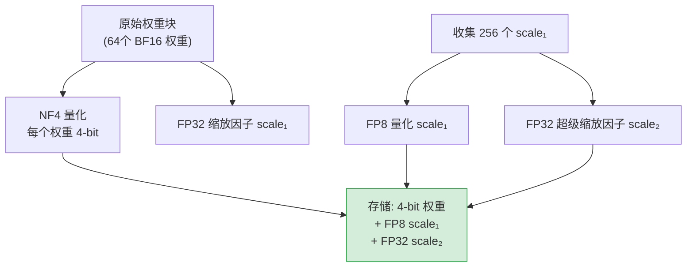

## 1.2.3 QLoRA 原理精讲

### 一、核心概念

微调 7B 以上的模型，显存是第一道墙。以 LLaMA-2 70B 为例，用 BF16 精度加载权重就需要约 140GB 显存，这意味着至少需要两张 A100 80GB，光是租机器的成本就足以让大多数团队放弃微调。

LoRA 通过低秩分解大幅减少了可训练参数量，但基座模型本身的权重仍然需要完整加载。QLoRA（Quantized LoRA）的思路是：**既然大部分权重只是被"用来读"而不需要被更新，能不能把它们压缩存储？** 答案是可以——用 4-bit 量化冻结基座模型权重，然后在其上套 LoRA 适配器进行训练。这样 70B 模型的显存占用从 140GB 压缩到约 35GB，单张 A100 80GB 就能跑通，同时微调效果接近全精度 LoRA。

QLoRA 的三个核心创新——NF4 量化、双重量化（Double Quantization）、分页优化器——分别解决了"如何量化得更准"、"量化本身有没有额外开销"、"显存峰值能否进一步压平"三个问题。

---

### 二、原理深讲

#### 2.1 NF4 量化：为何不用 INT4？

**工程动机**

INT4 量化的逻辑是把浮点数映射到 $[-8, 7]$ 这 16 个整数上，均匀分桶。但神经网络权重的分布不是均匀的——它近似服从**零均值正态分布**，绝大多数权重集中在 0 附近，极端值很少。均匀分桶意味着把大量桶浪费在几乎不会出现的极端区域，而靠近 0 的高密度区域却分辨率不足。

**核心机制：信息理论最优量化**

NF4（Normal Float 4-bit）的设计出发点是：对于服从标准正态分布的数据，如何用 16 个量化点使量化误差最小化？答案是让每个量化区间包含**相同的概率质量**（equiprobable bins），而不是相同的数值范围。

具体做法：对标准正态分布 $\mathcal{N}(0,1)$ 的分位数（quantile function）做均匀采样，得到 16 个分位点作为码字（codebook）。直觉上就是：**出现概率高的区域分配更多的量化精度，出现概率低的区域分配较少精度**——这是信息论意义上的最优编码。

实际使用时，每个量化块（如 64 个权重为一组）先归一化到 $[-1, 1]$ 区间，再映射到这 16 个 NF4 码字上。

```
# 示意：NF4 量化流程（非完整实现）
def quantize_nf4(weight_block):
    # 1. 计算块内绝对值最大值作为缩放因子
    scale = max(abs(weight_block))
    # 2. 归一化到 [-1, 1]
    normalized = weight_block / scale
    # 3. 查 NF4 码字表，找最近邻（16个非均匀分布的码字）
    quantized = lookup_nearest(normalized, NF4_CODEBOOK)
    return quantized, scale  # 存储量化值 + 缩放因子
```

**工程建议**：NF4 的精度优势建立在权重近似正态分布这个假设上。对于经过特殊初始化或高度稀疏化的权重，理论上 NF4 的收益可能打折扣——但在实践中几乎所有主流模型都满足此假设，不用特别担心。

---

#### 2.2 双重量化（Double Quantization）

**工程动机**

量化每个权重块时，需要存储一个 FP32 的缩放因子（scale）。假设每 64 个权重共享一个 scale，那么每个权重额外需要 $32/64 = 0.5$ bits 的存储。对于一个 70B 参数的模型，这部分开销是 $70 \times 10^9 \times 0.5 / 8 \approx 4.4\text{GB}$——相当于额外多了一张 4GB 的显存需求。

**核心机制**

双重量化的思路是：**对量化常数（scale）再做一次量化**。

- 第一层量化：NF4 量化权重主体，每 64 个权重共享一个 FP32 scale。
- 第二层量化：将这些 FP32 的 scale 再用 FP8 量化，每 256 个 scale 共享一个 FP32 的"super scale"。

经过双重量化，每个权重的额外存储开销从 0.5 bits 降低到约 0.127 bits，70B 模型可额外节省约 3.3GB 显存。



反量化时按相反顺序展开：先用 scale₂ 还原 scale₁，再用 scale₁ 还原原始权重——计算发生在 GPU 上，推理/训练中自动处理，开发者无需关心。

---

#### 2.3 分页优化器（Paged Optimizer）

**工程动机**

即使权重本身被压缩了，训练过程的显存峰值依然可能爆炸。原因在于优化器状态（Optimizer States）：AdamW 需要为每个可训练参数维护两个动量向量（m 和 v），这部分占用与参数量成正比。LoRA 的可训练参数本身不多，但在处理特别长的序列时，反向传播的**中间激活值**可能突然占用大量显存，导致 OOM（Out of Memory）崩溃。

**核心机制**

QLoRA 借鉴了 CPU 虚拟内存的分页（Paging）思想：当 GPU 显存不足时，**将优化器状态临时换页到 CPU 内存**，需要时再换回 GPU。NVIDIA 的统一内存（Unified Memory）机制提供了这种能力，但需要主动触发。

这个机制的代价是 CPU-GPU 数据传输的延迟，但相比 OOM 崩溃、损失整个训练进度，这个代价完全可以接受——它把显存"硬墙"变成了"软墙"。

**工程建议**：分页优化器是 bitsandbytes 库的内置功能，通过 `optim="paged_adamw_32bit"` 或 `"paged_adamw_8bit"` 启用。后者进一步量化优化器状态本身，显存节省更多，但在极少数情况下可能轻微影响收敛稳定性，建议先用 32bit 版本验证效果。

---

#### 2.4 显存节省全景：70B 单卡 A100 可训练的原理

将上述三个技术叠加，来看 70B 模型的显存构成变化：

| 组件 | 全精度 BF16 LoRA | QLoRA（NF4 + DQ） | 备注 |
|---|---|---|---|
| 基座模型权重 | ~140 GB | ~35 GB | NF4 + 双重量化 |
| LoRA 可训练参数（BF16） | ~1 GB | ~1 GB | LoRA 权重不量化 |
| 优化器状态（AdamW） | ~8 GB | ~8 GB | 仅针对 LoRA 参数 |
| 激活值（batch=1, seq=512） | ~4 GB | ~4 GB | 与量化策略无关 |
| **合计（估算）** | **~153 GB** | **~48 GB** | 单张 A100 80GB 不够 vs 够用 |

> **注意**：上表数值为工程估算，实际显存占用受 batch size、序列长度、LoRA rank 等多因素影响，以实测为准。

关键结论：QLoRA 使 70B 模型的显存需求从 "需要 2× A100" 降至 "单张 A100 80GB 可训练"，这是 QLoRA 的核心工程价值。

---

#### 2.5 QLoRA vs LoRA：效果与速度对比

| 维度 | LoRA（BF16 基座） | QLoRA（NF4 基座） |
|---|---|---|
| 微调效果（指令跟随） | 基准参考 | 接近，差距通常 < 1–2% |
| 训练速度 | 更快 | 较慢（NF4 反量化开销），约慢 30% |
| 推理速度（合并后） | 原速 | 原速（权重可合并回 BF16） |
| 显存需求（7B） | ~16 GB | ~8 GB |
| 显存需求（70B） | ~140 GB+ | ~35–48 GB |
| 适用场景 | 显存充足、追求速度 | 显存受限、大模型微调 |

**速度损失从何而来**：每次前向传播，冻结的 NF4 权重需要实时反量化为 BF16 再做矩阵乘法（compute-bound），这个开销在较小模型上感知明显，在 70B 这类大模型上由于传输带宽成为瓶颈，相对开销反而没那么突出。

---

### 三、工程视角：常见误区与最佳实践

**误区 1**：LoRA 适配器也应该用 NF4 量化以节省更多显存。
→ **正确做法**：LoRA 的适配器矩阵（A 和 B）必须保持高精度（BF16 或 FP16），因为它们需要接受梯度更新。量化梯度流会导致训练不稳定或无法收敛。bitsandbytes 默认行为已经正确处理了这一点——LoRA 参数自动保持 BF16，不需要手动干预。

**误区 2**：量化 bit 数越低显存越省，应该优先尝试 2-bit 或 1-bit 量化。
→ **正确做法**：4-bit（NF4）是目前效果与压缩率的最优平衡点。低于 4-bit 的量化（如 2-bit）在大多数任务上会导致明显的精度下降，特别是对代码生成、逻辑推理等对精度敏感的任务。除非是极端资源受限场景（如端侧部署），否则坚持 NF4。

**误区 3**：QLoRA 微调后可以直接部署量化后的模型。
→ **正确做法**：QLoRA 训练的是附加在量化基座上的 LoRA 权重。部署时有两种路径：① 保持量化基座 + LoRA 适配器分离，推理时实时反量化（适合多 LoRA 热切换场景）；② 将 LoRA 合并回去后，对合并后的 BF16 权重做 GGUF/AWQ 等面向推理优化的量化，获得更好的推理效率。**不要把训练用的 NF4 bitsandbytes 量化直接用于生产推理**，它的吞吐量不如推理专用量化格式。

**误区 4**：在 A100 以外的 GPU（如 RTX 3090）上用相同配置运行 QLoRA，出现 OOM 后调小 batch size 就够了。
→ **正确做法**：消费级 GPU（Ampere 以下）不支持 bfloat16，需要将计算精度切换为 FP16（`bnb_4bit_compute_dtype=torch.float16`）；同时 RTX 系列没有 NVLink，多卡训练效率较低，建议优先单卡 + gradient checkpointing 的组合而不是多卡。另外确认 CUDA 和 bitsandbytes 版本兼容性，这是新手最常见的环境配置坑。

**误区 5**：`load_in_4bit=True` 等同于 NF4 量化。
→ **正确做法**：`load_in_4bit=True` 默认使用的量化类型取决于 bitsandbytes 版本，需要显式指定 `bnb_4bit_quant_type="nf4"` 才能确保使用 NF4。同样，`bnb_4bit_use_double_quant=True` 需要显式开启双重量化。不要依赖默认值，训练配置应当完整声明。

---

### 四、延伸思考

> 🤔 **思考题 1**：NF4 的量化质量建立在"权重服从正态分布"的假设上。随着模型越来越多地采用 Mixture-of-Experts（MoE）架构，专家层的权重分布可能偏离正态——这是否会削弱 NF4 相对 INT4 的优势？有没有可能针对不同层的权重分布自适应地选择量化方案？

> 🤔 **思考题 2**：QLoRA 的训练速度比全精度 LoRA 慢约 30%，但它解锁了"单卡训练 70B"的可能。在算力租赁成本持续下降的今天（2025 年 A100 每小时约 $2–3），"时间换显存"的策略在什么条件下仍然合算？随着 H100/H200 的普及和显存容量的提升，QLoRA 的工程价值会如何演变？
