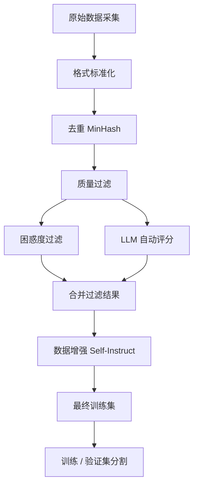
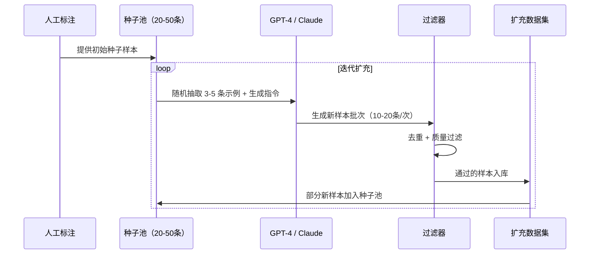

## 1.2.4 数据工程：微调数据的准备与质量控制

---

### 一、核心概念

微调效果差，90% 的问题出在数据上，而不是模型或训练配置。

这个结论听起来像老生常谈，但很多工程师在实际项目里仍然走相反的路：先花大量时间调 LoRA 的 rank、alpha、学习率，跑了十几组实验发现效果还是上不去，最后回头一看数据，格式错了一半，重复样本占 30%，剩下的里面还有大量低质量噪声。

微调的本质是让模型从示范样本里学习一种"行为风格"或"知识模式"。如果示范样本本身前后矛盾、格式混乱、内容平庸，模型学到的就是这些坏习惯——而且它学得非常认真。与预训练不同，微调数据量小，每条样本的权重都很高，一批坏数据的破坏力远超预训练阶段。

数据工程的核心目标只有两个：**让模型看到正确的示范**，**让每条样本都物有所值**。围绕这两个目标，格式规范、质量过滤、去重、数据增强，每个环节都有明确的工程动机。

---

### 二、原理深讲

#### 2.1 数据格式规范：Alpaca / ShareGPT / ChatML

不同的训练框架和模型对输入格式有不同期望。格式不对，轻则训练时出现莫名其妙的 loss 异常，重则模型学会在错误位置截断或插入特殊 token。

三种主流格式对比如下：

| 格式                | 结构                                                | 适用场景                       | 常见支持框架                                |
| ----------------- | ------------------------------------------------- | -------------------------- | ------------------------------------- |
| Alpaca            | `instruction` + `input`（可选）+ `output`             | 单轮指令微调、任务导向数据              | LLaMA-Factory、TRL、Axolotl             |
| ShareGPT / Vicuna | `conversations` 列表；每轮通常包含 `from` 和 `value`        | 多轮对话、角色扮演、聊天助手训练           | LLaMA-Factory、Axolotl、FastChat 系生态    |
| ChatML            | `<\|im_start\|>role\ncontent<\|im_end\|>` 形式的消息模板 | Chat 模型训练、对齐 OpenAI 风格消息格式 | Transformers chat template、TRL、部分微调框架 |


```
# Alpaca 格式示例
{
  "instruction": "将以下代码重构为更 Pythonic 的写法",
  "input": "for i in range(len(lst)):\n    print(lst[i])",
  "output": "for item in lst:\n    print(item)"
}

# ShareGPT 格式示例
{
  "conversations": [
    {"from": "human", "value": "帮我解释一下什么是 LoRA"},
    {"from": "gpt", "value": "LoRA（Low-Rank Adaptation）是一种参数高效微调方法..."}
  ]
}

# ChatML 格式示例（直接是训练文本）
<|im_start|>system
你是一名专业的代码审查工程师。<|im_end|>
<|im_start|>user
请审查这段 Python 代码...<|im_end|>
<|im_start|>assistant
这段代码存在以下问题...<|im_end|>
```

**工程建议**：优先看你用的基座模型原生支持哪种格式——Qwen2.5 用 ChatML，Llama-3 用其自定义的 `<|begin_of_text|>` 格式。强行转换格式会引入格式学习的额外噪声。绝大多数现代训练框架（LLaMA-Factory、Axolotl）都支持在配置文件里声明格式，不需要手动转换。

---

#### 2.2 数据量经验法则：质量 vs 数量

这是微调项目里最常见的决策困境。没有放之四海皆准的答案，但有几个经验规律可以作为决策框架：

| 场景 | 推荐策略 | 典型数据量 | 核心风险 |
|------|----------|------------|----------|
| 风格/格式对齐（如固定输出 JSON）| 精标为主 | 200–500 条 | 过拟合 |
| 领域知识注入（如法律术语使用习惯）| 精标为主，辅以合成数据 | 500–2000 条 | 知识覆盖不足 |
| 通用能力提升（如客服多场景覆盖）| 弱标为主，精标做验证集 | 5000–50000 条 | 数据质量参差不齐 |
| 从头构建特定风格模型 | 合成数据 + 精标 | 10000 条以上 | 合成数据分布偏差 |

**直觉**：如果你的任务是"让模型始终按固定 JSON Schema 输出"，200 条高质量示例往往比 2000 条混杂样本效果好——因为模型只需要学一种行为模式，数量不是瓶颈。但如果任务是"覆盖医疗问诊的各种细分场景"，数据的覆盖广度本身就是质量的一部分，此时数量确实重要。

一个实用的分界点：**如果你的验证集 loss 在 epoch 2 就开始反弹，大概率是数据太少或质量太差，而不是模型架构问题**。

---

#### 2.3 数据清洗流水线



**去重：MinHash 近似去重**

重复数据是过拟合的直接推手。如果你的数据集里有 20% 的样本是同一条记录的轻微变体（比如爬虫去了三个网站，但它们引用了同一篇文章），模型会把这个内容"记住"而不是"理解"。

精确去重（逐条比对字符串）在大规模数据集上复杂度是 O(n²)，不可行。MinHash 用局部敏感哈希把文本映射为一组签名，两条文本的 Jaccard 相似度可以通过签名的碰撞概率近似，复杂度降为 O(n)。

```python
# 示意代码：MinHash 去重核心逻辑
from datasketch import MinHash, MinHashLSH

def build_minhash(text, num_perm=128):
    m = MinHash(num_perm=num_perm)
    for word in text.split():
        m.update(word.encode('utf8'))
    return m

lsh = MinHashLSH(threshold=0.85, num_perm=128)  # 相似度 > 85% 视为重复
for idx, sample in enumerate(dataset):
    mh = build_minhash(sample['instruction'] + sample['output'])
    if not lsh.query(mh):  # 没有近似重复
        lsh.insert(str(idx), mh)
        clean_dataset.append(sample)
```

**工程建议**：threshold 设 0.8–0.9 是常见选择，太低会误删语义相近但确实有价值的多样性样本。对于指令数据，建议分别对 `instruction` 和 `output` 做去重，因为相同指令但不同答案的样本往往是有价值的（但相同答案不同指令则价值可疑）。

---

**质量过滤：困惑度过滤 + LLM 评分**

两种方法针对不同维度的质量问题：

- **困惑度（Perplexity）过滤**：用一个小型参考模型（如 GPT-2 或 Qwen-1.5B）计算每条样本的困惑度。困惑度极高的样本往往是乱码、语言混杂或格式破损；困惑度极低的样本往往是重复性套话或模板堆砌。两个极端都应该过滤。

```python
# 示意代码：困惑度过滤
def compute_perplexity(text, model, tokenizer):
    inputs = tokenizer(text, return_tensors='pt', truncation=True, max_length=512)
    with torch.no_grad():
        loss = model(**inputs, labels=inputs['input_ids']).loss
    return torch.exp(loss).item()

# 过滤掉困惑度 < 5 或 > 1000 的样本（阈值需根据语料调整）
filtered = [s for s in dataset
            if 5 < compute_perplexity(s['output'], ref_model, tokenizer) < 1000]
```

- **LLM 自动评分**：把样本发给 GPT-4 或 Claude，让其按照你定义的标准打分（1–5 分），过滤掉低分样本。这个方法可以捕获困惑度无法检测的语义问题，比如答案逻辑错误、指令与回答不匹配、内容有害。

```python
# 示意代码：LLM 评分提示词
scoring_prompt = """
请评估以下训练样本的质量，从 1（极差）到 5（优秀）打分。
评估维度：
1. 指令与回答的相关性
2. 回答的准确性和逻辑性
3. 语言表达清晰度

指令：{instruction}
回答：{output}

只返回 JSON：{{"score": <1-5>, "reason": "<简短理由>"}}
"""
```

**工程建议**：LLM 评分成本较高，不适合全量过滤。推荐的流程是：先用困惑度快速过滤掉明显噪声（通常可过滤 20–30%），再对剩余数据的随机样本用 LLM 评分做质量校验，确认数据整体质量可接受后才进入训练。

---

**数据增强：Self-Instruct 范式**

当精标数据不够时，最高效的扩充方式是让 LLM 帮你生成新样本，即 Self-Instruct 范式。核心思路是：给 LLM 几条种子示例，让它生成更多格式一致、语义多样的新样本。



Self-Instruct 的关键在于**生成提示词的设计**，需要明确告诉 LLM：目标任务类型、输出格式、多样性要求（"不要重复前面例子的句式结构"）、以及哪些内容是不需要的。

---

#### 2.4 合成数据：用强模型生成训练对

合成数据现在已经是工业界主流实践，而不是"没办法时的权宜之计"。Phi 系列、Qwen 等模型大量使用合成数据，效果验证了这条路的可行性。

最佳实践清单：

1. **用强模型生成，弱模型验证**：用 GPT-4o 或 Claude Sonnet 生成候选样本，再用一个较弱的模型（或规则过滤器）做初步筛选，人工只审核边界样本。不要让生成模型自我评审，会产生自我确认偏差。

2. **明确任务边界，避免过度泛化**：合成数据最容易犯的错误是"生成了很多样本，但没有覆盖真实业务中的长尾场景"。先整理真实用户的查询日志或业务文档，从中提炼出需要覆盖的意图列表，再针对性地生成。

3. **多样性控制**：在生成提示词里加入明确的多样性指令，如"每次生成的示例在句式结构、场景背景和难度级别上都要与前面的示例不同"。同时定期统计数据集的 n-gram 分布，防止"看起来不同但实质上千篇一律"。

4. **合成数据与真实数据的比例**：合成数据不应完全替代真实数据。一个经验比例是 70–80% 合成 + 20–30% 真实精标，真实数据主要覆盖最高频、最核心的场景，合成数据负责扩充覆盖面。

5. **注意版权与数据安全**：用竞争对手或第三方 API 生成的数据可能涉及服务条款限制。OpenAI 的服务条款明确禁止用其输出训练竞争模型（尽管执行力度存疑）。企业项目中需法务确认。

---

### 三、工程视角：常见误区与最佳实践

**误区一：用全量数据不做任何清洗直接训练**
→ **正确做法**：至少做一次去重和基本格式校验。训练前在 10% 的样本上随机抽查，看看有没有明显的格式错误、截断、中英文混杂等问题。30 分钟的人工抽样审查可以避免浪费数小时的 GPU 训练时间。

**误区二：验证集从训练集里随机划分，不做去重**
→ **正确做法**：先去重再划分，且验证集应在去重之后单独构建，确保它与训练集没有内容重叠。用带有泄漏的验证集得出的评估结果是虚高的，会导致你误判模型效果并过早停止数据改进工作。

**误区三：LLM 自动评分直接设置门槛过滤，不做人工校准**
→ **正确做法**：在使用 LLM 评分过滤器前，先用 100 条人工标注的样本校准评分一致性（计算 LLM 评分与人工评分的 Spearman 相关系数），确认 LLM 的评分标准与你的业务预期对齐。不同任务的"好样本"标准差异很大，通用提示词未必适配你的场景。

**误区四：Self-Instruct 生成完就入库，不做二次过滤**
→ **正确做法**：合成数据必须经过与真实数据相同的清洗流水线。LLM 生成的样本尤其容易出现以下问题：指令与输出语义错位（LLM 忘记了原始指令要求）、输出中包含"作为 AI 我..."类的元评论、JSON 格式不合规。这些问题用简单的规则过滤器就能解决，但不做的话会严重污染训练集。

**误区五：认为合成数据越多越好，无限堆量**
→ **正确做法**：合成数据存在"收益递减"效应。当数据量超过某个阈值后，继续增加相似分布的合成数据对效果提升几乎没有帮助，反而会增加训练时间。更有效的策略是：先训练一版，分析模型在验证集上的失败案例，针对性地补充这些失败类型的训练样本。

---

### 四、延伸思考

> 🤔 **思考题一**：如果你的真实业务数据涉及用户隐私（如医疗记录、金融流水），无法直接用于训练，但又需要让模型理解这个领域的语言习惯，你会如何设计一套合成数据生成策略，在不暴露真实数据的前提下保留领域特征？

> 🤔 **思考题二**：困惑度过滤假设"语言流畅度是质量的代理指标"，但高质量的专业数据（如代码、数学推导、法律条文）往往困惑度很高。如何设计一个对不同数据类型自适应的过滤策略，而不是对所有数据用同一套阈值？
