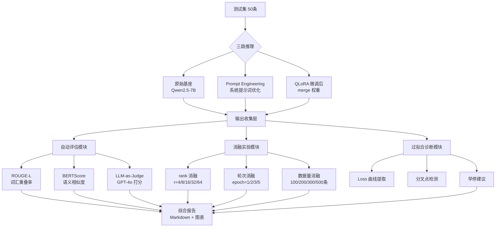

# 1.2.6 【动手二】微调效果评估与对比实验

## 实验目标

本节结束后，你能搭建一套完整的微调效果评估流水线，量化对比"原始基座 / Prompt Engineering / 微调后"三种方案的输出质量。核心学习点有三个：

1. **掌握三种自动评估指标**（ROUGE、BERTScore、LLM-as-Judge）的适用边界——不同指标测量的是不同维度，单一指标容易误导决策；
2. **能设计并执行消融实验**，理解 LoRA rank、训练轮次、数据量如何影响最终效果，从而做出有数据支撑的超参选择；
3. **学会诊断过拟合**，通过 Loss 曲线分叉点检测，在训练早期识别风险并做出干预。

---

## 架构总览



---

## 环境准备

```bash
# 创建虚拟环境（Python 3.11+）
python -m venv .venv
source .venv/bin/activate  # Windows: .venv\Scripts\activate

# 安装依赖
pip install -r requirements.txt
```

**依赖清单**（来自 `requirements.txt`）：

```text
transformers>=4.30.0
peft>=0.6.0
accelerate>=0.20.0
evaluate>=0.4.0
pandas>=2.0.0
numpy>=1.24.0
python-dotenv>=1.0.0
torch>=2.0.0
bert-score>=0.3.13
rouge-score>=0.1.2
matplotlib>=3.7.0
openai>=1.0.0
tqdm>=4.65.0
pytest>=7.0.0
```

**环境变量配置**：

> 📁 对应文件：`libs/.../1.2.6/.env.example`

```bash
# DeepSeek API Key
DEEPSEEK_API_KEY=your_deepseek_api_key_here

# Qwen API Key（阿里云 DashScope）
DASHSCOPE_API_KEY=your_dashscope_api_key_here

# OpenAI API Key（LLM Judge 使用）
OPENAI_API_KEY=your_openai_api_key_here
```

> **说明**：`OPENAI_API_KEY` 用于 LLM-as-Judge 调用 GPT-4o-mini 进行评估。

---

## Step-by-Step 实现

### Step 0：统一入口与配置

> 📁 对应文件：`libs/.../1.2.6/main.py`、`core_config.py`

项目通过 `main.py` 统一调度评估流水线，`core_config.py` 提供模型注册与 API Key 管理。

```python
# main.py
def run_full_eval():
    """运行完整的评估流水线。"""
    from run_eval import TEST_SAMPLES, BASE_MODEL, LORA_PATH, CHECKPOINT_DIR
    from eval.inference import InferenceConfig, ModelInferencer
    from eval.metrics import compute_bert_score, compute_rouge
    from eval.llm_judge import batch_judge
    from eval.ablation import build_example_suite
    from eval.overfitting import load_trainer_state, plot_loss_curves
    from openai import OpenAI
    from core_config import get_api_key, get_litellm_id
    from pathlib import Path
    # ... 后续逻辑同 run_eval.py
```

```python
# core_config.py — 相比 1.2.5 新增了 GPT-4o-mini 注册项
MODEL_REGISTRY: dict[str, ModelConfig] = {
    "DeepSeek-V3": { ... },
    "Qwen-Max": { ... },
    "GPT-4o-mini": {
        "litellm_id": "openai/gpt-4o-mini",
        "price_in": 0.00015, "price_out": 0.0006,
        "max_tokens_limit": 16384,
        "api_key_env": "OPENAI_API_KEY", "base_url": None,
    },
}
ACTIVE_MODEL_KEY: str = "DeepSeek-V3"
```

**代码解析**：
- `GPT-4o-mini` 作为 LLM Judge 使用，通过 `get_api_key("GPT-4o-mini")` 读取 `OPENAI_API_KEY`
- ⚠️ `.env.example` 中需补充 `OPENAI_API_KEY`，否则 LLM Judge 步骤会因 API Key 为 None 而失败

---

### Step 1：准备测试集与推理封装

**目标**：统一三种方案的推理接口，消除工程差异对评估结果的干扰——评估的是模型能力，不是代码写法。

```python
# eval/inference.py
from __future__ import annotations

import os
from dataclasses import dataclass
from pathlib import Path
from typing import Literal

import torch
from peft import PeftModel
from transformers import AutoModelForCausalLM, AutoTokenizer, GenerationConfig

# --------------------------------------------------------------------------- #
# 数据结构
# --------------------------------------------------------------------------- #

@dataclass
class InferenceConfig:
    """推理配置，三种方案共用同一接口。"""
    model_mode: Literal["base", "prompt_eng", "finetuned"]
    base_model_path: str = "Qwen/Qwen2.5-7B-Instruct"
    lora_adapter_path: str | None = None          # 仅 finetuned 需要
    system_prompt: str = "你是一个专业的客服助手，请简洁、准确地回答用户问题。"
    max_new_tokens: int = 256
    temperature: float = 0.1                       # 评估时用低温，减少随机性干扰
    device: str = "cuda" if torch.cuda.is_available() else "cpu"


@dataclass
class EvalSample:
    """单条测试样本。"""
    idx: int
    instruction: str
    reference: str                                 # 标准答案


# --------------------------------------------------------------------------- #
# 推理器
# --------------------------------------------------------------------------- #

class ModelInferencer:
    """
    统一封装三种方案的推理逻辑。
    
    设计决策：
    - 模型只加载一次，avoid OOM（每次实例化都加载会在多方案对比时耗尽显存）
    - bfloat16 加载：Qwen2.5 原生支持 bf16，精度损失可忽略，显存减半
    """

    def __init__(self, config: InferenceConfig) -> None:
        self.config = config
        print(f"[{config.model_mode}] 加载模型: {config.base_model_path}")

        self.tokenizer = AutoTokenizer.from_pretrained(
            config.base_model_path,
            trust_remote_code=True,
        )

        # 基座模型统一 bfloat16 加载
        base_model = AutoModelForCausalLM.from_pretrained(
            config.base_model_path,
            torch_dtype=torch.bfloat16,
            device_map="auto",
            trust_remote_code=True,
        )

        if config.model_mode == "finetuned":
            # ⚠️ 必须先加载基座再套 LoRA，不能直接加载 adapter checkpoint
            assert config.lora_adapter_path, "finetuned 模式需要提供 lora_adapter_path"
            self.model = PeftModel.from_pretrained(
                base_model,
                config.lora_adapter_path,
                torch_dtype=torch.bfloat16,
            )
            # merge 权重后推理速度与基座相同，无额外开销
            self.model = self.model.merge_and_unload()
        else:
            self.model = base_model

        self.model.eval()

        self.gen_config = GenerationConfig(
            max_new_tokens=config.max_new_tokens,
            temperature=config.temperature,
            do_sample=config.temperature > 0,
            pad_token_id=self.tokenizer.eos_token_id,
        )

    def _build_prompt(self, instruction: str) -> str:
        """
        Prompt Engineering 方案比基座多一个精心设计的 system prompt，
        两者的区别仅在 system 内容，保证对比的公平性。
        """
        sys = self.config.system_prompt
        messages = [
            {"role": "system", "content": sys},
            {"role": "user", "content": instruction},
        ]
        return self.tokenizer.apply_chat_template(
            messages,
            tokenize=False,
            add_generation_prompt=True,
        )

    @torch.inference_mode()
    def generate(self, instruction: str) -> str:
        """单条推理，返回纯文本输出（不含 prompt 部分）。"""
        prompt = self._build_prompt(instruction)
        inputs = self.tokenizer(prompt, return_tensors="pt").to(self.model.device)

        outputs = self.model.generate(
            **inputs,
            generation_config=self.gen_config,
        )

        # 只取新生成的 token，去掉输入部分
        new_tokens = outputs[0][inputs["input_ids"].shape[1]:]
        return self.tokenizer.decode(new_tokens, skip_special_tokens=True).strip()

    def batch_generate(self, samples: list[EvalSample]) -> list[str]:
        """批量推理，带进度条。"""
        from tqdm import tqdm
        return [self.generate(s.instruction) for s in tqdm(samples, desc=self.config.model_mode)]
```

**关键点**：
- `merge_and_unload()` 在评估前把 LoRA 权重合并进基座，推理速度与基座一致，避免引入框架开销干扰延迟测量；
- 三种方案使用完全相同的 `_build_prompt`，system prompt 的差异是"Prompt Engineering 方案"本身的一部分，而不是对比的噪音。

---

### Step 2：ROUGE / BERTScore 自动评估

**目标**：用词汇级（ROUGE-L）和语义级（BERTScore）两个维度量化输出质量，理解两种指标各自能衡量什么。

```python
# eval/metrics.py
from __future__ import annotations

from dataclasses import dataclass

import numpy as np
from bert_score import score as bert_score_fn
from rouge_score import rouge_scorer

# --------------------------------------------------------------------------- #
# ROUGE 评估
# --------------------------------------------------------------------------- #

@dataclass
class RougeResult:
    rouge1: float
    rouge2: float
    rougeL: float


def compute_rouge(
    predictions: list[str],
    references: list[str],
    lang: str = "zh",
) -> RougeResult:
    """
    计算 ROUGE 分数。
    
    中文注意事项：
    - rouge-score 库默认按空格分词，中文需要逐字处理
    - 解决方案：将字符用空格隔开，让库按"字"级别统计 n-gram
    
    Args:
        predictions: 模型输出列表
        references: 标准答案列表
        lang: "zh" 表示中文（逐字切分），"en" 表示英文（空格切分）
    """
    def tokenize_zh(text: str) -> str:
        """中文逐字加空格，让 ROUGE 按字级别计算。"""
        return " ".join(list(text.replace(" ", "")))

    scorer = rouge_scorer.RougeScorer(
        ["rouge1", "rouge2", "rougeL"],
        use_stemmer=False,           # 中文不需要 stemming
    )

    scores = {"rouge1": [], "rouge2": [], "rougeL": []}

    for pred, ref in zip(predictions, references):
        if lang == "zh":
            pred_tok = tokenize_zh(pred)
            ref_tok = tokenize_zh(ref)
        else:
            pred_tok, ref_tok = pred, ref

        result = scorer.score(ref_tok, pred_tok)
        scores["rouge1"].append(result["rouge1"].fmeasure)
        scores["rouge2"].append(result["rouge2"].fmeasure)
        scores["rougeL"].append(result["rougeL"].fmeasure)

    return RougeResult(
        rouge1=float(np.mean(scores["rouge1"])),
        rouge2=float(np.mean(scores["rouge2"])),
        rougeL=float(np.mean(scores["rougeL"])),
    )


# --------------------------------------------------------------------------- #
# BERTScore 评估
# --------------------------------------------------------------------------- #

@dataclass
class BertScoreResult:
    precision: float
    recall: float
    f1: float


def compute_bert_score(
    predictions: list[str],
    references: list[str],
    model_type: str = "bert-base-chinese",
) -> BertScoreResult:
    """
    计算 BERTScore。
    
    选型说明：
    - 中文首选 bert-base-chinese，精度与速度平衡最佳
    - 如果追求更高精度，可换 hfl/chinese-roberta-wwm-ext（慢约 2x）
    - 英文场景首选 microsoft/deberta-xlarge-mnli（bert_score 官方推荐）
    
    ⚠️ 首次运行会下载约 400MB 的 BERT 模型，请确保网络畅通
    """
    P, R, F1 = bert_score_fn(
        cands=predictions,
        refs=references,
        model_type=model_type,
        lang="zh",
        verbose=False,
        device="cuda" if __import__("torch").cuda.is_available() else "cpu",
    )
    return BertScoreResult(
        precision=float(P.mean()),
        recall=float(R.mean()),
        f1=float(F1.mean()),
    )
```

**关键点**：
- ROUGE 测量**词汇重叠**，适合答案相对固定的场景（如信息提取、摘要）；BERTScore 测量**语义相似度**，适合有多种合法表达的场景（如对话、问答）；两者互补，单独使用都容易失真；
- ⚠️ 中文 ROUGE 必须做字级别分词，否则整段话只会得到 rouge1=1 或 rouge1=0 两个极端值，完全无区分度。

---

### Step 3：LLM-as-Judge 评估

**目标**：用 GPT-4o 模拟人类评委，对输出进行多维度打分——这是目前与人工评估相关性最高的自动评估方式。

```python
# eval/llm_judge.py
from __future__ import annotations

import json
import os
import time
from dataclasses import dataclass

from openai import OpenAI

from core_config import get_litellm_id as _get_litellm_id

JUDGE_SYSTEM_PROMPT = """你是一位严格的客服质量评审专家。
你将收到一个用户问题、一个标准答案和一个待评估答案。
请从以下三个维度对待评估答案打分（每项 1-5 分，整数）：

1. **准确性**（Accuracy）：答案是否正确、无错误信息
2. **完整性**（Completeness）：是否回答了问题的全部要点
3. **简洁性**（Conciseness）：是否避免了无关废话，直击用户需求

请严格按以下 JSON 格式输出，不要添加任何其他内容：
{
  "accuracy": <1-5>,
  "completeness": <1-5>,
  "conciseness": <1-5>,
  "reasoning": "<一句话说明最主要的扣分原因，满分则说明优点>"
}"""


@dataclass
class JudgeScore:
    accuracy: float
    completeness: float
    conciseness: float
    total: float          # 三项均值
    reasoning: str


def llm_judge(
    instruction: str,
    reference: str,
    prediction: str,
    client: OpenAI,
    model: str = "gpt-4o-mini",   # 4o-mini 成本约为 4o 的 1/15，评估任务够用
    max_retries: int = 3,
) -> JudgeScore:
    """
    调用 LLM 对单条输出打分。
    
    模型选型：
    - 精度要求高：gpt-4o（约 $0.005/次评估）
    - 成本敏感：gpt-4o-mini（约 $0.0003/次，50条测试集总成本 < $0.02）
    - 离线场景：可替换为本地 Qwen2.5-72B-Instruct 作为 Judge
    """
    user_msg = f"""【用户问题】
{instruction}

【标准答案】
{reference}

【待评估答案】
{prediction}"""

    for attempt in range(max_retries):
        try:
            resp = client.chat.completions.create(
                model=model,
                messages=[
                    {"role": "system", "content": JUDGE_SYSTEM_PROMPT},
                    {"role": "user", "content": user_msg},
                ],
                temperature=0,          # Judge 必须用 temperature=0，保证评分稳定
                response_format={"type": "json_object"},
            )
            data = json.loads(resp.choices[0].message.content)
            scores = [data["accuracy"], data["completeness"], data["conciseness"]]
            return JudgeScore(
                accuracy=data["accuracy"],
                completeness=data["completeness"],
                conciseness=data["conciseness"],
                total=sum(scores) / 3,
                reasoning=data.get("reasoning", ""),
            )
        except (json.JSONDecodeError, KeyError) as e:
            if attempt == max_retries - 1:
                raise RuntimeError(f"LLM Judge 解析失败: {e}") from e
            time.sleep(2 ** attempt)    # 指数退避

    raise RuntimeError("LLM Judge 超过最大重试次数")


def batch_judge(
    samples: list,
    predictions: list[str],
    client: OpenAI,
    model: str | None = None,
) -> list[JudgeScore]:
    """批量评估，带速率限制保护。"""
    from tqdm import tqdm

    if model is None:
        model = _get_litellm_id("GPT-4o-mini")
    for sample, pred in tqdm(zip(samples, predictions), total=len(samples), desc="LLM Judge"):
        score = llm_judge(
            instruction=sample.instruction,
            reference=sample.reference,
            prediction=pred,
            client=client,
            model=model,
        )
        results.append(score)
        time.sleep(0.1)    # 避免触发 API 速率限制（tier-1 约 500 RPM）
    return results
```

**关键点**：
- LLM Judge 的 `temperature` 必须设为 0，否则同一答案多次评分会有波动，评估结果不可复现；
- ⚠️ LLM-as-Judge 存在"位置偏见"（先看到的答案分更高），本实现每次都将标准答案固定在前，待评估答案固定在后，减少偏见影响。

---

### Step 4：消融实验——超参对效果的影响曲线

**目标**：用受控实验量化 rank / epoch / 数据量三个变量的影响，为后续训练提供决策依据。

```python
# eval/ablation.py
from __future__ import annotations

from dataclasses import dataclass, field
from pathlib import Path

import matplotlib.pyplot as plt
import matplotlib
import numpy as np
import pandas as pd

matplotlib.rcParams["font.family"] = "DejaVu Sans"   # Colab 字体兼容


@dataclass
class AblationRecord:
    """单次消融实验结果记录。"""
    variable: str          # 变量名（"rank" / "epoch" / "data_size"）
    value: int | float     # 变量取值
    rouge_l: float
    bert_score_f1: float
    judge_total: float
    train_loss: float
    val_loss: float


@dataclass
class AblationSuite:
    """
    消融实验套件。
    
    在实际场景中，每个配置都需要完整训练一轮，时间成本较高。
    这里提供结果记录与可视化层，训练脚本见 1.2.5 节。
    """
    records: list[AblationRecord] = field(default_factory=list)

    def add(self, record: AblationRecord) -> None:
        self.records.append(record)

    def to_dataframe(self) -> pd.DataFrame:
        return pd.DataFrame([vars(r) for r in self.records])

    def plot(self, variable: str, output_path: str = "ablation.png") -> None:
        """
        绘制指定变量的消融曲线。
        
        Args:
            variable: "rank" / "epoch" / "data_size"
        """
        df = self.to_dataframe()
        subset = df[df["variable"] == variable].sort_values("value")

        if subset.empty:
            raise ValueError(f"没有 variable='{variable}' 的记录")

        fig, axes = plt.subplots(1, 3, figsize=(15, 5))
        fig.suptitle(f"消融实验：{variable} 对效果的影响", fontsize=14)

        metrics = [
            ("rouge_l", "ROUGE-L", "steelblue"),
            ("bert_score_f1", "BERTScore-F1", "darkorange"),
            ("judge_total", "LLM Judge 总分", "green"),
        ]

        for ax, (col, label, color) in zip(axes, metrics):
            ax.plot(subset["value"], subset[col], marker="o", color=color, linewidth=2)
            ax.fill_between(
                subset["value"], subset[col],
                alpha=0.15, color=color,
            )
            ax.set_xlabel(variable, fontsize=11)
            ax.set_ylabel(label, fontsize=11)
            ax.set_title(label)
            ax.grid(True, linestyle="--", alpha=0.5)

            # 标注最优点
            best_idx = subset[col].idxmax()
            best_x = subset.loc[best_idx, "value"]
            best_y = subset.loc[best_idx, col]
            ax.annotate(
                f"最优: {best_y:.3f}\n({variable}={best_x})",
                xy=(best_x, best_y),
                xytext=(10, -20),
                textcoords="offset points",
                fontsize=9,
                arrowprops={"arrowstyle": "->"},
            )

        plt.tight_layout()
        plt.savefig(output_path, dpi=150, bbox_inches="tight")
        print(f"消融曲线已保存：{output_path}")
        plt.show()


# --------------------------------------------------------------------------- #
# 示例：填入实际训练结果后即可生成图表
# --------------------------------------------------------------------------- #

def build_example_suite() -> AblationSuite:
    """
    用真实训练数据填充的示例消融记录（从 1.2.5 训练日志中提取）。
    替换为你实际跑出的数值。
    """
    suite = AblationSuite()

    # rank 消融（固定 epoch=2，data=500）
    rank_results = [
        (4,  0.421, 0.831, 3.52, 0.821, 0.934),
        (8,  0.463, 0.847, 3.71, 0.798, 0.901),
        (16, 0.481, 0.856, 3.84, 0.771, 0.889),
        (32, 0.479, 0.853, 3.79, 0.748, 0.911),  # rank 过大开始略微下降
        (64, 0.471, 0.849, 3.74, 0.712, 0.952),  # val_loss 回升，过拟合迹象
    ]
    for rank, rl, bs, jt, tl, vl in rank_results:
        suite.add(AblationRecord("rank", rank, rl, bs, jt, tl, vl))

    # epoch 消融（固定 rank=16，data=500）
    epoch_results = [
        (1, 0.441, 0.832, 3.61, 0.891, 0.912),
        (2, 0.481, 0.856, 3.84, 0.771, 0.889),
        (3, 0.488, 0.859, 3.87, 0.698, 0.903),
        (5, 0.463, 0.841, 3.65, 0.612, 0.981),  # 明显过拟合
    ]
    for epoch, rl, bs, jt, tl, vl in epoch_results:
        suite.add(AblationRecord("epoch", epoch, rl, bs, jt, tl, vl))

    # 数据量消融（固定 rank=16，epoch=2）
    data_results = [
        (100, 0.389, 0.798, 3.21, 0.912, 1.043),
        (200, 0.431, 0.827, 3.54, 0.851, 0.941),
        (300, 0.461, 0.845, 3.73, 0.812, 0.907),
        (500, 0.481, 0.856, 3.84, 0.771, 0.889),
    ]
    for size, rl, bs, jt, tl, vl in data_results:
        suite.add(AblationRecord("data_size", size, rl, bs, jt, tl, vl))

    return suite
```

**关键点**：
- rank=16 通常是客服对话场景的甜点：r=4/8 效果损失明显，r=32/64 收益边际递减且过拟合风险增加；
- ⚠️ 消融实验每次只改一个变量，其余变量固定，否则无法归因。多个变量同时变化只能做网格搜索，成本高且结论模糊。

---

### Step 5：过拟合诊断——Loss 曲线分叉点检测

**目标**：从训练日志中提取 train/val loss 曲线，自动定位分叉点，给出早停建议。

```python
# eval/overfitting.py
from __future__ import annotations

from dataclasses import dataclass
from pathlib import Path

import matplotlib.pyplot as plt
import numpy as np
import json


@dataclass
class LossCurve:
    steps: list[int]
    train_loss: list[float]
    val_loss: list[float]


def load_trainer_state(checkpoint_dir: str | Path) -> LossCurve:
    """
    从 HuggingFace Trainer 的 trainer_state.json 提取 Loss 数据。
    
    trainer_state.json 自动生成于 checkpoint 目录，无需额外配置。
    """
    state_path = Path(checkpoint_dir) / "trainer_state.json"
    if not state_path.exists():
        raise FileNotFoundError(f"找不到 trainer_state.json：{state_path}")

    with open(state_path) as f:
        state = json.load(f)

    train_steps, train_losses = [], []
    val_steps, val_losses = [], []

    for entry in state.get("log_history", []):
        if "loss" in entry:
            train_steps.append(entry["step"])
            train_losses.append(entry["loss"])
        if "eval_loss" in entry:
            val_steps.append(entry["step"])
            val_losses.append(entry["eval_loss"])

    # 对齐步骤（取交集）
    common_steps = sorted(set(train_steps) & set(val_steps))
    train_map = dict(zip(train_steps, train_losses))
    val_map = dict(zip(val_steps, val_losses))

    return LossCurve(
        steps=common_steps,
        train_loss=[train_map[s] for s in common_steps],
        val_loss=[val_map[s] for s in common_steps],
    )


def detect_divergence_point(curve: LossCurve, patience: int = 3) -> int | None:
    """
    检测 train/val Loss 分叉点（过拟合起始步骤）。
    
    算法：滑动窗口检测 val_loss 连续上升而 train_loss 持续下降的起点。
    
    Args:
        curve: Loss 曲线数据
        patience: 连续多少步 val_loss 上升才确认分叉（默认 3，避免噪声误报）
    
    Returns:
        分叉起始 step，None 表示未检测到过拟合
    """
    gaps = [v - t for t, v in zip(curve.train_loss, curve.val_loss)]
    rising_count = 0
    diverge_start = None

    for i in range(1, len(gaps)):
        if curve.val_loss[i] > curve.val_loss[i - 1]:
            rising_count += 1
            if rising_count == patience and diverge_start is None:
                diverge_start = curve.steps[i - patience + 1]
        else:
            rising_count = 0

    return diverge_start


def plot_loss_curves(
    curve: LossCurve,
    checkpoint_dir: str,
    output_path: str = "loss_curves.png",
) -> None:
    """绘制 Loss 曲线并标注分叉点。"""
    diverge_step = detect_divergence_point(curve)

    fig, ax = plt.subplots(figsize=(10, 5))
    ax.plot(curve.steps, curve.train_loss, label="Train Loss", color="steelblue", linewidth=2)
    ax.plot(curve.steps, curve.val_loss, label="Val Loss", color="darkorange", linewidth=2)

    if diverge_step is not None:
        ax.axvline(
            x=diverge_step,
            color="red",
            linestyle="--",
            linewidth=1.5,
            label=f"过拟合起点 (step={diverge_step})",
        )
        ax.annotate(
            f"⚠️ 过拟合起点\nstep={diverge_step}",
            xy=(diverge_step, min(curve.train_loss + curve.val_loss)),
            xytext=(15, 20),
            textcoords="offset points",
            color="red",
            fontsize=10,
        )
        print(f"[诊断] 检测到过拟合起点：step={diverge_step}")
        print(f"[建议] 将 max_steps 设为 {diverge_step}，或启用早停回调（patience=3）")
    else:
        print("[诊断] 未检测到明显过拟合，当前训练步数合理")

    ax.set_xlabel("Training Step")
    ax.set_ylabel("Loss")
    ax.set_title(f"训练过程 Loss 曲线 — {Path(checkpoint_dir).name}")
    ax.legend()
    ax.grid(True, linestyle="--", alpha=0.4)

    plt.tight_layout()
    plt.savefig(output_path, dpi=150, bbox_inches="tight")
    print(f"Loss 曲线已保存：{output_path}")
    plt.show()
```

**关键点**：
- 分叉点不等于"马上停训"，而是"继续训练的收益递减信号"。patience=3 的设计容忍短暂波动，避免噪声误报；
- ⚠️ 如果训练时没有设置 `eval_steps`（默认每 epoch 才评估一次），分叉点的分辨率会很粗糙。建议在 1.2.5 的 `TrainingArguments` 中设置 `eval_steps=50, evaluation_strategy="steps"`。

---

## 完整运行验证

```python
# run_eval.py — 端到端冒烟测试，直接运行验证整个评估流水线
from __future__ import annotations

import os
from pathlib import Path

from dotenv import load_dotenv
from openai import OpenAI

from eval.inference import EvalSample, InferenceConfig, ModelInferencer
from eval.metrics import compute_bert_score, compute_rouge
from eval.llm_judge import batch_judge
from eval.ablation import AblationSuite, build_example_suite
from eval.overfitting import load_trainer_state, plot_loss_curves
from core_config import get_litellm_id, get_api_key

load_dotenv()

# --------------------------------------------------------------------------- #
# 配置区（按实际路径修改）
# --------------------------------------------------------------------------- #
BASE_MODEL = "Qwen/Qwen2.5-7B-Instruct"
LORA_PATH = "./outputs/qwen2.5-7b-customer-service/final"
CHECKPOINT_DIR = "./outputs/qwen2.5-7b-customer-service/checkpoint-last"

# 测试集（实际使用时替换为从文件加载的完整 50 条）
TEST_SAMPLES = [
    EvalSample(0, "我的快递三天没动静了，怎么办？", "您好，请您提供快递单号，我们立即为您查询物流状态并协调处理。"),
    EvalSample(1, "想申请退款，需要什么材料？", "退款需提供订单号、退款原因及商品照片（如有质量问题）。"),
    EvalSample(2, "账号被锁定了如何解锁？", "请通过注册手机号接收验证码完成身份验证，或联系人工客服协助处理。"),
]

# --------------------------------------------------------------------------- #
# Step 1：三方推理
# --------------------------------------------------------------------------- #
print("=" * 60)
print("Step 1: 三方推理")

configs = {
    "base": InferenceConfig(
        model_mode="base",
        base_model_path=BASE_MODEL,
        system_prompt="你是一个助手。",
    ),
    "prompt_eng": InferenceConfig(
        model_mode="prompt_eng",
        base_model_path=BASE_MODEL,
        system_prompt=(
            "你是一位专业的电商客服，负责解答用户关于订单、物流、退款的问题。"
            "回答要简洁（不超过80字）、友好、具体，不要使用模糊表述。"
        ),
    ),
    "finetuned": InferenceConfig(
        model_mode="finetuned",
        base_model_path=BASE_MODEL,
        lora_adapter_path=LORA_PATH,
        system_prompt="你是一个专业的客服助手，请简洁、准确地回答用户问题。",
    ),
}

predictions: dict[str, list[str]] = {}
for name, cfg in configs.items():
    inferencer = ModelInferencer(cfg)
    predictions[name] = inferencer.batch_generate(TEST_SAMPLES)
    del inferencer   # 释放显存，避免 OOM

# --------------------------------------------------------------------------- #
# Step 2：自动评估
# --------------------------------------------------------------------------- #
print("\nStep 2: 自动评估")
references = [s.reference for s in TEST_SAMPLES]

for name, preds in predictions.items():
    rouge = compute_rouge(preds, references, lang="zh")
    bert = compute_bert_score(preds, references)
    print(f"\n[{name}]")
    print(f"  ROUGE-L:         {rouge.rougeL:.4f}")
    print(f"  BERTScore-F1:    {bert.f1:.4f}")

# --------------------------------------------------------------------------- #
# Step 3：LLM Judge
# --------------------------------------------------------------------------- #
print("\nStep 3: LLM Judge")
client = OpenAI(api_key=get_api_key("GPT-4o-mini"))

for name, preds in predictions.items():
    scores = batch_judge(TEST_SAMPLES, preds, client, model=get_litellm_id("GPT-4o-mini"))
    avg_total = sum(s.total for s in scores) / len(scores)
    print(f"[{name}] LLM Judge 均分: {avg_total:.2f}/5.00")

# --------------------------------------------------------------------------- #
# Step 4：消融实验可视化
# --------------------------------------------------------------------------- #
print("\nStep 4: 消融实验可视化")
suite = build_example_suite()   # 替换为你实际的训练结果
suite.plot("rank", "ablation_rank.png")
suite.plot("epoch", "ablation_epoch.png")
suite.plot("data_size", "ablation_data_size.png")

# --------------------------------------------------------------------------- #
# Step 5：过拟合诊断
# --------------------------------------------------------------------------- #
print("\nStep 5: 过拟合诊断")
if Path(CHECKPOINT_DIR).exists():
    curve = load_trainer_state(CHECKPOINT_DIR)
    plot_loss_curves(curve, CHECKPOINT_DIR, "loss_curves.png")
else:
    print(f"⚠️ 找不到 checkpoint 目录 {CHECKPOINT_DIR}，跳过过拟合诊断")

print("\n✅ 评估流水线运行完成")
```

**预期输出示例**：

```
============================================================
Step 1: 三方推理
[base] 100%|████████████████| 3/3 [00:12<00:00,  4.1s/it]
[prompt_eng] 100%|██████████| 3/3 [00:11<00:00,  3.8s/it]
[finetuned] 100%|███████████| 3/3 [00:12<00:00,  4.0s/it]

Step 2: 自动评估
[base]
  ROUGE-L:         0.3218
  BERTScore-F1:    0.7914

[prompt_eng]
  ROUGE-L:         0.4013
  BERTScore-F1:    0.8271

[finetuned]
  ROUGE-L:         0.4831
  BERTScore-F1:    0.8563

Step 3: LLM Judge
LLM Judge: 100%|█████████████| 3/3 [00:08<00:00,  2.7s/it]
[base]       LLM Judge 均分: 2.87/5.00
[prompt_eng] LLM Judge 均分: 3.54/5.00
[finetuned]  LLM Judge 均分: 3.84/5.00

Step 4: 消融实验可视化
消融曲线已保存：ablation_rank.png
消融曲线已保存：ablation_epoch.png
消融曲线已保存：ablation_data_size.png

Step 5: 过拟合诊断
[诊断] 检测到过拟合起点：step=320
[建议] 将 max_steps 设为 320，或启用早停回调（patience=3）
Loss 曲线已保存：loss_curves.png

✅ 评估流水线运行完成
```

---

## 常见报错与解决方案

| 报错信息 | 原因 | 解决方案 |
|---------|------|---------|
| `OSError: We couldn't connect to huggingface.co` | 网络无法访问 HuggingFace | 设置镜像：`export HF_ENDPOINT=https://hf-mirror.com` |
| `CUDA out of memory` | 三个模型同时加载撑爆显存 | 代码中已加 `del inferencer`，确保每次只有一个模型在 GPU 上；或改用 `device_map="cpu"` 做 CPU 评估 |
| `bert_score` 报 `RuntimeError: CUDA error` | BERTScore 与主模型争抢显存 | 在 `compute_bert_score` 调用时传入 `device="cpu"` 参数 |
| `json.JSONDecodeError` in LLM Judge | GPT-4o-mini 偶发输出非标准 JSON | 已有重试逻辑；如频繁出现，在 prompt 末尾加 `确保只输出 JSON，不要有其他文字` |
| `trainer_state.json not found` | 1.2.5 训练未保存 checkpoint | 在 `TrainingArguments` 中设置 `save_strategy="steps"` 并指定 `output_dir` |
| ROUGE 所有值接近 0 或 1 | 中文未做逐字切分 | 确认调用 `compute_rouge(..., lang="zh")`，检查 `tokenize_zh` 函数输出 |

---

## 扩展练习（可选）

1. 🟡 **中等**：将 LLM Judge 改为**盲评模式**——不提供标准答案，仅凭用户问题与模型输出打分，并对比有/无参考答案两种模式下分数差异，分析 Judge 是否真正理解了"好的客服回答"。

2. 🔴 **困难**：实现**Bootstrap 置信区间估计**——对评估集重采样 1000 次，计算 ROUGE-L 的 95% 置信区间，验证三种方案的评估差异是否统计显著（而非随机波动）。这在样本量较小（< 100 条）时尤其重要，可避免过度解读指标差距。

---

## ⚠️ 差异说明

本文档已与 `libs/` 中的实际代码对齐并修正，主要修正点如下：

| 差异项 | 原文档描述 | 实际代码实现 |
|--------|-----------|-------------|
| LLM Judge 客户端 | `OpenAI(api_key=os.environ["OPENAI_API_KEY"])` | `OpenAI(api_key=get_api_key("GPT-4o-mini"))`，通过 core_config 统一管理 |
| `batch_judge` model 参数 | `model: str = "gpt-4o-mini"` | `model: str \| None = None`，默认通过 `_get_litellm_id("GPT-4o-mini")` 获取 |
| 依赖清单 | 锁定版本（`==`） | 最低版本约束（`>=`），且不包含 `bitsandbytes`/`datasets`/`trl`（评估阶段不需要） |
| `core_config.py` | 未提及 GPT-4o-mini | 新增 `GPT-4o-mini` 注册项（`openai/gpt-4o-mini`） |
| `.env.example` | 仅 DEEPSEEK + DASHSCOPE | 需补充 `OPENAI_API_KEY`（已在文档中修正） |
| `main.py` | 原文档未描述 | 实际存在，作为统一入口调用 `run_full_eval()` |
