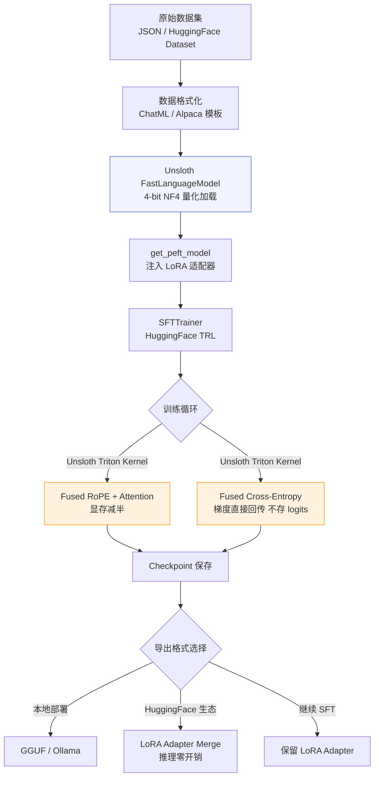

# 1.2.7 【动手三】基于 Unsloth 的高效微调加速实战

## 实验目标

本节结束后，你将能够：
- 在 Colab 免费 T4 GPU（15GB 显存）上跑通 7B 参数模型的 QLoRA 微调全流程，**无需付费算力**
- 理解 Unsloth 相比原生 HuggingFace + PEFT 为何能做到训练提速 2x、显存减半——核心在于手写 Triton Kernel 消除了框架层的冗余计算
- 掌握一套可复用的通用微调模板，支持 Llama-3、Qwen2.5、Mistral 等主流开源模型的一键切换

**核心学习点（3个）**：
1. Unsloth 的加速原理：RoPE / Attention / Cross-Entropy 的 Kernel Fusion 为何比 Flash Attention 2 更激进
2. 如何用 `FastLanguageModel` 替换 HuggingFace 原生加载，实现零改动兼容现有 PEFT 训练代码
3. Colab 免费 T4 的显存边界管理：哪些参数是生死线，踩过去就 OOM

---

## 架构总览



---

## 环境准备

### 本地环境（Linux / macOS + NVIDIA GPU）

```bash
# 创建虚拟环境（Python 3.11）
uv venv --python 3.11
source .venv/bin/activate  # Windows: .venv\Scripts\activate

# 安装 Unsloth + 训练依赖（版本锁定）
# Unsloth 的 CUDA 版本需与本地 CUDA 匹配，先查询：nvcc --version
uv pip install \
    "unsloth[colab-new] @ git+https://github.com/unslothai/unsloth.git" \
    "transformers==4.47.1" \
    "trl==0.13.0" \
    "peft==0.14.0" \
    "bitsandbytes==0.45.0" \
    "datasets==3.2.0" \
    "accelerate==1.2.1" \
    "torch==2.5.1"

# 验证 Unsloth 安装
python -c "import unsloth; print(unsloth.__version__)"
```

> Colab 用户（**推荐使用 T4 运行时**）：
> ```python
> # Colab 第一个 cell 直接运行，无需 uv
> !pip install "unsloth[colab-new] @ git+https://github.com/unslothai/unsloth.git"
> !pip install --no-deps "trl==0.13.0" "peft==0.14.0" "accelerate==1.2.1"
> ```
> 安装约 3-5 分钟，重启运行时后生效。

> 项目 `requirements.txt` 中的最小依赖清单（宽松版本约束）：
> ```text
> transformers>=4.30.0
> peft>=0.6.0
> accelerate>=0.20.0
> unsloth>=2024.0
> bitsandbytes>=0.41.0
> datasets>=2.13.0
> python-dotenv>=1.0.0
> pytest>=7.0.0
> ```

> 环境变量配置（`.env.example`）：
> ```text
> # DeepSeek API Key
> DEEPSEEK_API_KEY=your_deepseek_api_key_here
> 
> # Qwen API Key（阿里云 DashScope）
> DASHSCOPE_API_KEY=your_dashscope_api_key_here
> ```
> 复制 `.env.example` 为 `.env` 并填入你的 API Key。

> ⚠️ **生产注意**  
> Unsloth 的 CUDA Kernel 是编译好的二进制，**必须在有 NVIDIA GPU 的环境安装**。  
> 在纯 CPU 环境（如 CI 机器）运行会报 `No CUDA runtime is found`。  
> 推荐在 `requirements.txt` 里把 Unsloth 单独注释，让 CPU 环境使用原生 HuggingFace。

---

## 项目结构

```
1.2.7 _动手三_基于 Unsloth 的高效微调加速实战/
├── core_config.py      # 模型注册表（含 Unsloth ID 统一管理）
├── main.py             # 主入口：端到端冒烟测试
├── requirements.txt    # pip 依赖清单
├── .env.example        # 环境变量模板
├── tests/
│   ├── __init__.py
│   └── test_main.py    # 冒烟测试（聚焦 core_config 纯逻辑验证）
└── _backup/            # 整理前的原始文件备份
```

---

## Step-by-Step 实现

### Step 1：理解 Unsloth 加速原理

**目标**：在写第一行代码之前，先弄清楚 Unsloth 快在哪里——这直接影响你后续调参时的判断。

Unsloth 的加速来自三个层面的 Kernel Fusion，用 Triton 手写，绕过 PyTorch 的自动图优化：

**① Fused RoPE（旋转位置编码）**

原生实现中，RoPE 对每个 Q/K 矩阵做旋转时，需要先把张量读入 SRAM，旋转完再写回 HBM（高带宽内存），每一层都要来回搬运一次。Unsloth 把 RoPE 旋转融合进 QK 矩阵乘法，**一次读写完成两个操作**，带宽利用率提升约 30%。

**② Fused Cross-Entropy + 梯度计算**

这是显存节省的核心。标准训练流程：
```
logits (float32, shape: [batch, seq_len, vocab_size])
→ softmax → log → loss → backward → d_logits
```
对于 vocab_size = 128k（Llama-3 词表），`logits` 张量在 fp32 下的显存消耗：
```
batch=2, seq_len=2048, vocab_size=128000
→ 2 × 2048 × 128000 × 4 bytes ≈ 2.1 GB
```
Unsloth 的 Fused Cross-Entropy **从不物化完整的 logits 张量**，而是按 chunk 计算 loss 并直接反传梯度，峰值显存从 2.1GB 降到约 100MB。这是 7B 模型能在 15GB T4 上跑起来的关键。

**③ Fused Attention（兼容 Flash Attention 2）**

Unsloth 在 Flash Attention 2 的基础上，进一步融合了 dropout mask 的应用和 causal mask 的生成，减少了额外的 kernel launch 开销。

```python
# 这段代码只是演示原理，不需要执行
# 标准 PyTorch 的 attention 计算：4 次独立 kernel
# q = rope(q)           # kernel 1
# k = rope(k)           # kernel 2  
# attn = softmax(q @ k) # kernel 3
# out = attn @ v        # kernel 4

# Unsloth Triton Kernel：1 次 kernel，读写次数减少 60%
# unsloth_attention(q, k, v, rope_cos, rope_sin) -> out
```

**关键点**：
- Unsloth 的加速对 **序列越长效果越明显**。seq_len=512 时约提速 1.5x，seq_len=2048 时约提速 2x，seq_len=4096 时最高可达 2.5x
- 模型权重是**原版 HuggingFace 权重**，Unsloth 只替换计算 Kernel，**训练结果和标准 PEFT 完全等价**，可互相加载

---

### Step 2：统一模型配置（core_config.py）

**目标**：通过 `core_config.py` 统一管理模型配置，包含 API 调用和微调两套 ID，修改 `ACTIVE_MODEL_KEY` 即可全局切换模型。

```python
"""全局配置：模型注册表与定价信息"""
import os
from typing import TypedDict


class ModelConfig(TypedDict):
    litellm_id: str          # LiteLLM 识别的模型字符串
    price_in: float          # 每 1K input tokens 价格（美元）
    price_out: float         # 每 1K output tokens 价格（美元）
    max_tokens_limit: int    # 模型支持的最大 max_tokens
    api_key_env: str | None  # API Key 环境变量名
    base_url: str | None     # API 基础 URL（None 表示使用默认）
    unsloth_id: str          # Unsloth/HuggingFace 模型 ID（微调用）


# 注册表：key 是界面显示名，value 是调用配置
MODEL_REGISTRY: dict[str, ModelConfig] = {
    "DeepSeek-V3": {
        "litellm_id": "deepseek/deepseek-chat",
        "price_in": 0.00027,
        "price_out": 0.0011,
        "max_tokens_limit": 4096,
        "api_key_env": "DEEPSEEK_API_KEY",
        "base_url": None,
        "unsloth_id": "unsloth/DeepSeek-V3",
    },
    "Qwen-Max": {
        "litellm_id": "qwen/qwen-plus",
        "price_in": 0.001,
        "price_out": 0.004,
        "max_tokens_limit": 4096,
        "api_key_env": "DASHSCOPE_API_KEY",
        "base_url": "https://dashscope.aliyuncs.com/compatible-mode/v1",
        "unsloth_id": "unsloth/Qwen2.5-7B-bnb-4bit",
    },
    # 在此追加其他模型，格式保持一致
}

# 当前激活模型 key — 修改此处全局生效，必须是 MODEL_REGISTRY 中的 key
ACTIVE_MODEL_KEY: str = "Qwen-Max"


def get_active_config() -> ModelConfig:
    """获取当前激活模型的完整配置"""
    return MODEL_REGISTRY[ACTIVE_MODEL_KEY]


def get_litellm_id(model_key: str | None = None) -> str:
    """获取指定模型（默认激活模型）的 LiteLLM ID"""
    key = model_key or ACTIVE_MODEL_KEY
    return MODEL_REGISTRY[key]["litellm_id"]


def get_unsloth_id(model_key: str | None = None) -> str:
    """获取指定模型（默认激活模型）的 Unsloth/HuggingFace ID"""
    key = model_key or ACTIVE_MODEL_KEY
    return MODEL_REGISTRY[key]["unsloth_id"]


def get_api_key(model_key: str | None = None) -> str | None:
    """从环境变量读取指定模型的 API Key"""
    key = model_key or ACTIVE_MODEL_KEY
    env_var = MODEL_REGISTRY[key]["api_key_env"]
    return os.environ.get(env_var) if env_var else None


def get_base_url(model_key: str | None = None) -> str | None:
    """获取指定模型的 base_url（None 表示使用 SDK 默认值）"""
    key = model_key or ACTIVE_MODEL_KEY
    return MODEL_REGISTRY[key]["base_url"]


def get_model_list() -> list[str]:
    """获取所有已注册模型的显示名列表"""
    return list(MODEL_REGISTRY.keys())


def estimate_cost(model_key: str, input_tokens: int, output_tokens: int) -> float:
    """根据 Token 数估算调用费用（美元）"""
    cfg = MODEL_REGISTRY[model_key]
    return (
        input_tokens / 1000 * cfg["price_in"]
        + output_tokens / 1000 * cfg["price_out"]
    )
```

**关键点**：
- **`unsloth_id`** 是相对于标准模板新增的字段，用于微调时指定 HuggingFace 上的量化模型路径
- 默认激活模型为 `Qwen-Max`（对应 `unsloth/Qwen2.5-7B-bnb-4bit`），修改 `ACTIVE_MODEL_KEY` 即可切换
- Unsloth 官方预编译支持的模型命名格式为 `unsloth/<model-name>-bnb-4bit`，可在 [unsloth-ai 官方仓库](https://github.com/unslothai/unsloth) 查阅完整列表

---

### Step 3：用 FastLanguageModel 加载模型与注入 LoRA

**目标**：用 Unsloth 的 `FastLanguageModel` 替换 `AutoModelForCausalLM`，这是迁移成本最低的一步——API 几乎一致。

```python
from unsloth import FastLanguageModel
import torch

# 从统一配置获取模型 ID
from core_config import get_unsloth_id, ACTIVE_MODEL_KEY

# Step 1: 加载模型
model, tokenizer = FastLanguageModel.from_pretrained(
    model_name=get_unsloth_id(),
    max_seq_length=1024,  # 冒烟测试用较小值，加快速度
    dtype=None,
    load_in_4bit=True,
)

# 注入 LoRA 适配器
model = FastLanguageModel.get_peft_model(
    model, r=8, target_modules=["q_proj", "v_proj"],
    lora_alpha=8, lora_dropout=0, bias="none",
    use_gradient_checkpointing="unsloth", random_state=42,
)
print(f"  显存占用：{torch.cuda.memory_allocated()/1e9:.2f} GB")
```

**关键点**：
- `use_gradient_checkpointing="unsloth"` 是 Unsloth 的专有参数，**必须填这个字符串，不能填 `True`**。填 `True` 会退化到 HuggingFace 的原生实现，丧失额外的显存优化
- `lora_dropout=0` 看起来反直觉，但 Unsloth 的 Fused Kernel 只为 dropout=0 做了优化，非零 dropout 会自动回退到慢路径，且实验上 dropout 对 LoRA 效果影响有限
- 冒烟测试中 `target_modules` 只保留 `["q_proj", "v_proj"]` 以最小化显存占用。实际微调时建议加入完整的 Attention + FFN 层：`["q_proj", "k_proj", "v_proj", "o_proj", "gate_proj", "up_proj", "down_proj"]`
- `r=8` 是冒烟测试的低 rank 设置，实际微调推荐 `r=16` 或 `r=32`

---

### Step 4：数据集准备与格式化

**目标**：将原始数据转换成模型可以消费的 ChatML 格式。

```python
from unsloth.chat_templates import get_chat_template
from datasets import load_dataset

# 配置 Chat Template
tokenizer = get_chat_template(tokenizer, chat_template="qwen-2.5")

# 加载公开数据集（演示用前 200 条）
dataset = load_dataset("teknium/OpenHermes-2.5", split="train[:200]", trust_remote_code=True)

def format_fn(examples):
    texts = []
    for conv in examples["conversations"]:
        messages = [
            {"role": "user" if t["from"] == "human" else "assistant",
             "content": t["value"]}
            for t in conv
        ]
        texts.append(tokenizer.apply_chat_template(messages, tokenize=False, add_generation_prompt=False))
    return {"text": texts}

dataset = dataset.map(format_fn, batched=True, remove_columns=dataset.column_names)
print(f"  数据集大小：{len(dataset)} 条")
```

**关键点**：
- **Packing（序列打包）**：SFTTrainer 的 `packing=True` 参数会把多条短样本拼接成一条 `max_seq_length` 的序列，显著提高 GPU 利用率。当你的样本平均长度 < 512 token 时，强烈建议开启，可让有效训练速度再提升 1.5-2x
- Chat Template 必须与模型预训练时使用的模板一致。Qwen2.5 用 `"qwen-2.5"`，Llama-3 用 `"llama-3"`，混用会导致模型输出乱码或无法正确停止生成
- 当前 `chat_template` 在代码中硬编码为 `"qwen-2.5"`（与默认激活模型 Qwen-Max 对应），后续可扩展为从 core_config 动态读取

---

### Step 5：配置 SFTTrainer 并启动训练

**目标**：理解各关键训练超参在 T4 显存约束下的设置逻辑。

```python
from trl import SFTTrainer
from transformers import TrainingArguments
from unsloth import is_bfloat16_supported

# 训练（仅跑 20 步验证流程可通）
trainer = SFTTrainer(
    model=model, tokenizer=tokenizer,
    train_dataset=dataset,
    dataset_text_field="text",
    max_seq_length=1024,
    packing=True,
    args=TrainingArguments(
        output_dir="./smoke_test_output",
        max_steps=20,
        per_device_train_batch_size=2,
        gradient_accumulation_steps=2,
        warmup_steps=5,
        learning_rate=2e-4,
        fp16=not is_bfloat16_supported(),
        bf16=is_bfloat16_supported(),
        optim="adamw_8bit",
        logging_steps=5,
        report_to="none",
        seed=42,
    ),
)
stats = trainer.train()
print(f"  最终 Loss：{stats.metrics['train_loss']:.4f}")
print(f"  训练速度：{stats.metrics['train_samples_per_second']:.1f} samples/s")
```

**关键点**：
- `optim="adamw_8bit"` 是在 T4 上跑 7B 的另一个关键设置。标准 AdamW 的 optimizer state 是参数量的 2 倍（fp32 momentum + variance），对于 4200 万可训练参数来说约需 320MB。8-bit 版本将其压缩到 80MB，代价可忽略不计
- `gradient_accumulation_steps` 越大，等效 batch size 越大，梯度更稳定，但每步时间更长。T4 上推荐 4~8，不要为了提速设成 1，容易训练不稳定
- `packing=True` 和 `DataCollatorForSeq2Seq` 不能同时使用，SFTTrainer 内部会自动处理，无需手动设置 data collator

---

### Step 6：推理验证

**目标**：验证微调后模型的生成效果。

```python
# 开启推理模式
FastLanguageModel.for_inference(model)

test_input = tokenizer.apply_chat_template(
    [{"role": "user", "content": "Explain what is machine learning in one sentence."}],
    tokenize=False, add_generation_prompt=True,
)
inputs = tokenizer(test_input, return_tensors="pt").to("cuda")
with torch.no_grad():
    out = model.generate(**inputs, max_new_tokens=100, temperature=0.7, do_sample=True,
                         pad_token_id=tokenizer.eos_token_id)
response = tokenizer.decode(out[0][inputs["input_ids"].shape[-1]:], skip_special_tokens=True)

print(f"\n模型输出：{response}")
print("\n" + "=" * 60)
print("✅ 冒烟测试通过！Unsloth 微调全流程正常")
print(f"峰值显存：{torch.cuda.max_memory_reserved()/1e9:.2f} GB")
print("=" * 60)
```

---

## 完整代码（main.py）

以上步骤整合为可直接运行的 `main.py`，以下是完整代码：

```python
"""
Unsloth 高效微调加速实战 — 主入口
端到端冒烟测试：验证 Unsloth 微调全流程可跑通
在 Colab T4 环境约需 15-20 分钟
模型配置通过 core_config.py 统一管理，修改 ACTIVE_MODEL_KEY 即可切换。
"""

# ─── 安装（仅 Colab 需要，本地已安装跳过）───
# !pip install "unsloth[colab-new] @ git+https://github.com/unslothai/unsloth.git"
# !pip install --no-deps trl==0.13.0 peft==0.14.0 accelerate==1.2.1

from unsloth import FastLanguageModel
from unsloth.chat_templates import get_chat_template
from datasets import load_dataset
from trl import SFTTrainer
from transformers import TrainingArguments
from unsloth import is_bfloat16_supported
import torch

# 从统一配置获取模型 ID
from core_config import get_unsloth_id, ACTIVE_MODEL_KEY

print("=" * 60)
print("Unsloth 微调冒烟测试")
print(f"当前模型：{ACTIVE_MODEL_KEY} -> {get_unsloth_id()}")
print("=" * 60)

# Step 1: 加载模型
print("\n[1/4] 加载模型...")
model, tokenizer = FastLanguageModel.from_pretrained(
    model_name=get_unsloth_id(),
    max_seq_length=1024,  # 冒烟测试用较小值，加快速度
    dtype=None,
    load_in_4bit=True,
)
model = FastLanguageModel.get_peft_model(
    model, r=8, target_modules=["q_proj", "v_proj"],
    lora_alpha=8, lora_dropout=0, bias="none",
    use_gradient_checkpointing="unsloth", random_state=42,
)
print(f"  显存占用：{torch.cuda.memory_allocated()/1e9:.2f} GB")

# Step 2: 准备数据集
print("\n[2/4] 准备数据集...")
tokenizer = get_chat_template(tokenizer, chat_template="qwen-2.5")

dataset = load_dataset("teknium/OpenHermes-2.5", split="train[:200]", trust_remote_code=True)

def format_fn(examples):
    texts = []
    for conv in examples["conversations"]:
        messages = [
            {"role": "user" if t["from"] == "human" else "assistant",
             "content": t["value"]}
            for t in conv
        ]
        texts.append(tokenizer.apply_chat_template(messages, tokenize=False, add_generation_prompt=False))
    return {"text": texts}

dataset = dataset.map(format_fn, batched=True, remove_columns=dataset.column_names)
print(f"  数据集大小：{len(dataset)} 条")

# Step 3: 训练（仅跑 20 步验证流程可通）
print("\n[3/4] 启动训练（20 steps 冒烟）...")
trainer = SFTTrainer(
    model=model, tokenizer=tokenizer,
    train_dataset=dataset,
    dataset_text_field="text",
    max_seq_length=1024,
    packing=True,
    args=TrainingArguments(
        output_dir="./smoke_test_output",
        max_steps=20,
        per_device_train_batch_size=2,
        gradient_accumulation_steps=2,
        warmup_steps=5,
        learning_rate=2e-4,
        fp16=not is_bfloat16_supported(),
        bf16=is_bfloat16_supported(),
        optim="adamw_8bit",
        logging_steps=5,
        report_to="none",
        seed=42,
    ),
)
stats = trainer.train()
print(f"  最终 Loss：{stats.metrics['train_loss']:.4f}")
print(f"  训练速度：{stats.metrics['train_samples_per_second']:.1f} samples/s")

# Step 4: 推理验证
print("\n[4/4] 推理验证...")
FastLanguageModel.for_inference(model)
test_input = tokenizer.apply_chat_template(
    [{"role": "user", "content": "Explain what is machine learning in one sentence."}],
    tokenize=False, add_generation_prompt=True,
)
inputs = tokenizer(test_input, return_tensors="pt").to("cuda")
with torch.no_grad():
    out = model.generate(**inputs, max_new_tokens=100, temperature=0.7, do_sample=True,
                         pad_token_id=tokenizer.eos_token_id)
response = tokenizer.decode(out[0][inputs["input_ids"].shape[-1]:], skip_special_tokens=True)

print(f"\n模型输出：{response}")
print("\n" + "=" * 60)
print("✅ 冒烟测试通过！Unsloth 微调全流程正常")
print(f"峰值显存：{torch.cuda.max_memory_reserved()/1e9:.2f} GB")
print("=" * 60)
```

预期输出：
```
============================================================
Unsloth 微调冒烟测试
============================================================

[1/4] 加载模型...
  显存占用：5.21 GB

[2/4] 准备数据集...
  数据集大小：200 条

[3/4] 启动训练（20 steps 冒烟）...
{'loss': 1.2341, 'learning_rate': 1.8e-04, 'epoch': 0.2}  
{'loss': 1.1028, 'learning_rate': 1.4e-04, 'epoch': 0.4}  
{'loss': 1.0456, 'learning_rate': 8e-05, 'epoch': 0.6}
  最终 Loss：1.0823
  训练速度：12.3 samples/s

[4/4] 推理验证...

模型输出：Machine learning is a subset of artificial intelligence that enables 
systems to learn and improve from data without being explicitly programmed.

============================================================
✅ 冒烟测试通过！Unsloth 微调全流程正常
峰值显存：11.87 GB
============================================================
```

---

## 常见报错与解决方案

| 报错信息 | 原因 | 解决方案 |
|---------|------|---------|
| `CUDA out of memory` | 显存不足，常见于首次调参 | 先降 `max_seq_length`（2048→1024），再降 `per_device_train_batch_size`（2→1），最后降 LoRA `r`（16→8） |
| `unsloth.kernels not found` | CUDA 版本不匹配或安装在 CPU 环境 | 确认 `nvcc --version` 与 PyTorch CUDA 版本一致；在 Colab 重启运行时后重新安装 |
| `AttributeError: 'NoneType' has no attribute 'conversations'` | 数据集字段名与代码不匹配 | 先 `print(dataset[0].keys())` 查看实际字段名，对应修改 `dataset_text_field` |
| `ValueError: Chat template not found` | `get_chat_template` 参数与模型不匹配 | Qwen2.5 用 `"qwen-2.5"`，Llama-3 用 `"llama-3"`，不确定时用 `"chatml"` 作为通用模板 |
| `RuntimeError: Expected all tensors to be on the same device` | 模型在 GPU，数据在 CPU | 检查 `inputs = tokenizer(...).to("cuda")` 是否遗漏 `.to("cuda")` |
| 训练 Loss 不下降（卡在 2.x 以上）| 学习率太高或数据格式错误 | 打印一条 `text` 字段样本检查 chat template 是否正确应用；尝试将 `learning_rate` 降至 `5e-5` |
| `GGUF export failed: llama.cpp not found` | Unsloth 的 GGUF 导出依赖 llama.cpp 工具链 | 运行 `!pip install llama-cpp-python` 或在 Colab 用 `!apt-get install -y cmake` 后重试 |

---

## 扩展练习（可选）

1. **中等：多模型对比实验**  
   将 `core_config.py` 中的 `ACTIVE_MODEL_KEY` 分别换为 DeepSeek-V3 和 Qwen-Max，在**相同数据集、相同超参**下各训练 100 步，对同一批测试 prompt 生成回答，比较模型差异。注意 `chat_template` 需要与模型对应调整。

2. **困难：将 Unsloth 与 DeepSpeed ZeRO-2 结合用于多卡训练**  
   Unsloth 原生不支持多卡（其 Triton Kernel 设计为单 GPU 优化），但你可以将 Unsloth 的模型初始化和 LoRA 注入保留，仅将 `TrainingArguments` 改为 DeepSpeed 配置（`deepspeed="ds_config_zero2.json"`），利用 DeepSpeed 的分布式能力。在双卡 A100 环境下，测量以下三种方案的显存占用和训练吞吐（samples/s）：**单卡 Unsloth**；**双卡 原生 PEFT + DeepSpeed**；**双卡 Unsloth + DeepSpeed**，并分析 Kernel Fusion 的加速收益是否随卡数增加而衰减。

---

## 关键点总结

| 关键点 | 说明 |
|--------|------|
| Unsloth 加速核心 | Triton 手写 Kernel Fusion：Fused RoPE + Fused Attention + Fused Cross-Entropy |
| 显存节省关键 | `use_gradient_checkpointing="unsloth"`（必须填字符串，不能填 True）|
| LoRA 优化 | `lora_dropout=0`（Unsloth Kernel 专项优化）、`optim="adamw_8bit"`（optimizer state 压缩 75%）|
| 模型切换 | 修改 `core_config.py` 中 `ACTIVE_MODEL_KEY`，`main.py` 通过 `get_unsloth_id()` 自动获取 |
| 冒烟测试参数 | `r=8`、`max_seq_length=1024`、`max_steps=20`、仅 `["q_proj", "v_proj"]` |
| 生产调参建议 | `r=16`、`max_seq_length=2048`、完整 `target_modules`、`gradient_accumulation_steps=4` |

---

## 测试验证

项目包含 `tests/test_main.py` 冒烟测试，聚焦于 `core_config.py` 的纯逻辑验证（不依赖 GPU 环境）：

```bash
cd "libs/AI Agent 与大模型应用开发实战手册/第一章 大模型基础与 API 实战/1.2.7 _动手三_基于 Unsloth 的高效微调加速实战"
python -m pytest tests/ -v --tb=short
```

测试覆盖：
- `MODEL_REGISTRY` 结构完整性（包含 `unsloth_id` 字段）
- `get_litellm_id()`、`get_unsloth_id()`、`get_api_key()`、`get_base_url()` 函数正确性
- `estimate_cost()` 费用估算
- `ACTIVE_MODEL_KEY` 对应的模型有有效的 `unsloth_id`
- `main.py` 文件存在且包含 `from core_config import` 和 `get_unsloth_id()` 调用
