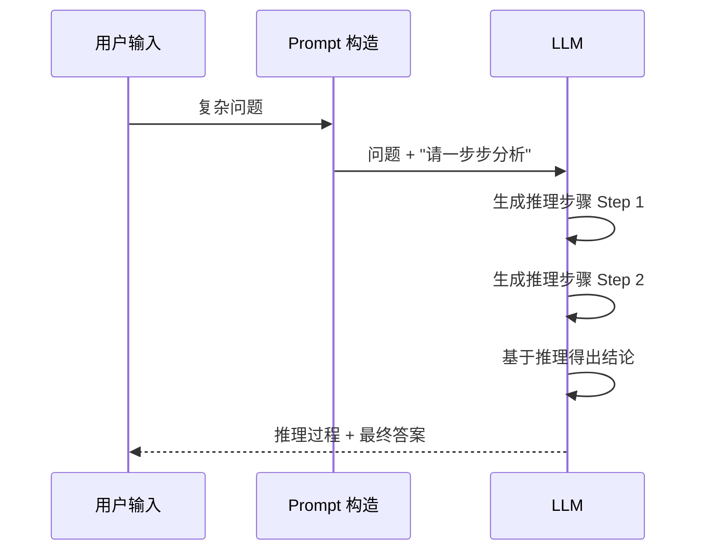
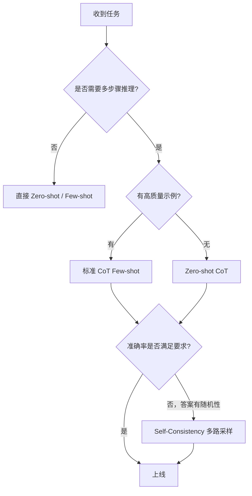

## 1.3 Prompt Engineering 实战

---

### 一、核心概念

很多工程师第一次接触 LLM 时，习惯性地把它当成搜索引擎——输入问题，期待答案。结果不是输出格式乱掉，就是内容偏离预期，或者对同一个问题反复给出质量参差不齐的回答。问题不在于模型能力，而在于你和模型"沟通"的方式。

**Prompt Engineering 本质上是在管理模型的概率分布**。LLM 在生成每个 Token 时，都是在做一次条件概率采样。你提供的 Prompt 就是这个条件——它决定了模型在整个"回答空间"中采样的位置。写得好的 Prompt 能把概率质量集中在你想要的输出区域；写得差的 Prompt 则会让模型在模糊的高熵区域乱转。

这也解释了为什么同一个任务，不同的写法效果天差地别。零样本（Zero-shot）告诉模型"做什么"，少样本（Few-shot）通过示例告诉模型"输出应该长什么样"，而 CoT（Chain of Thought）则引导模型在给出答案之前先"想清楚"。三者不是替代关系，而是根据任务复杂度递进选用的工具。

---

### 二、原理深讲

#### 2.1 零样本（Zero-shot）：角色 + 任务 + 格式三件套

**直觉**：你让一个新来的实习生帮你整理会议纪要，如果只说"帮我整理一下"，大概率拿回来的格式、粒度、重点都不对。但如果你说"你是一名专业的项目经理，把这段会议录音整理成结构化的行动项清单，每条包含：负责人、截止日期、任务描述"，结果就会好很多。模型也是一样。

**核心机制**：零样本 Prompt 的黄金结构是**角色设定 + 任务描述 + 输出格式**三件套，缺一不可：

```
[角色设定]
你是一名资深 Python 工程师，擅长代码审查和性能优化。

[任务描述]
请审查以下代码片段，找出潜在的性能问题和 bug。

[输出格式]
以 JSON 格式输出，结构如下：
{
  "issues": [
    {"type": "bug|performance|style", "line": <行号>, "description": "...", "suggestion": "..."}
  ],
  "severity": "low|medium|high"
}

[待处理内容]
<code>
...
</code>
```

三个部分缺哪个都会影响质量：
- **缺角色设定**：模型以通用助手视角回答，专业深度不够
- **缺任务描述**：模型可能按字面理解，而非你真正的意图
- **缺输出格式**：模型会用它认为"合适"的格式，往往不符合下游代码解析需求

**工程建议**：输出格式的约束越具体越好。如果需要结构化输出，明确声明 JSON Schema；如果需要纯文本，声明最大字数或段落结构。对于生产环境，应配合模型的 Structured Output / JSON Mode 功能双重约束，避免格式漂移。

---

#### 2.2 少样本（Few-shot）：多样性 vs 相似性的权衡

**直觉**：示例的作用是告诉模型"我期望的输出风格和质量水平是这样的"。但如果你给的示例都是同一类问题，模型碰到边缘情况就容易翻车。

**核心机制**：Few-shot 示例的选择有两个对立的策略：

| 策略 | 原理 | 适用场景 | 风险 |
|------|------|----------|------|
| **相似性优先** | 选和当前输入最接近的示例，In-context 迁移更精准 | 任务分布窄、风格一致性要求高（如特定格式的文档生成） | 示例覆盖面窄，泛化差 |
| **多样性优先** | 示例覆盖不同类型、边界情况，提升鲁棒性 | 任务输入多样（如通用问答、多类别分类） | 单个示例相关性低，可能引入噪声 |

实践中常用的策略是**动态少样本**（Dynamic Few-shot）：预先准备一个高质量的示例库，在运行时根据用户输入的语义相似度检索 Top-K 个示例拼入 Prompt。这是 RAG 思想在 Prompt 层的应用。

```
示例库 (向量化存储)
    ↓ 用户输入 → Embedding → 检索相似示例
    ↓ 拼装 Prompt：示例1 + 示例2 + 用户输入
    ↓ LLM 生成
```

**工程建议**：
- 示例数量：通常 3-5 个足够，超过 8 个边际收益递减，且消耗 Token
- 示例质量 > 示例数量：一个精心构造的高质量示例，胜过十个马虎的示例
- 示例顺序：最相关的示例放最后（离实际输入最近），模型对近端内容注意力更强

---

#### 2.3 CoT（Chain of Thought）：让模型"先想后答"

**直觉**：对于复杂任务，直接问答就像让人心算多位数乘法——有些模型能做到，但稳定性差。CoT 本质上是**把工作记忆（Working Memory）外化到 Token 流中**，让模型在生成答案之前，先"写出"推理步骤，用中间输出辅助后续输出。

##### 标准 CoT vs Zero-shot CoT

| 方式 | 写法 | 原理 | 适用场景 |
|------|------|------|----------|
| **标准 CoT** | 在示例中提供完整推理步骤 | 示范推理格式，引导模型模仿 | 有高质量标注示例时首选 |
| **Zero-shot CoT** | 末尾加 "Let's think step by step" 或 "请一步步思考" | 激活模型预训练时习得的推理模式 | 快速测试，无示例场景 |

Zero-shot CoT 的有效性看起来像魔法，但背后有合理解释：模型在预训练时见过大量"先推理后结论"的文本（如教材、解题过程），这个 Trigger Phrase 相当于把模型切换到了"解题模式"的条件分布上。



##### Self-Consistency：多路 CoT 投票

单次 CoT 存在随机性——Temperature > 0 时，每次运行可能走不同的推理路径，得出不同的答案。**Self-Consistency** 的思路是：用较高的 Temperature 采样 N 条独立的推理路径，对最终答案做多数投票。

```
问题 Q
  ├─ 推理路径 A → 答案：42
  ├─ 推理路径 B → 答案：42  
  ├─ 推理路径 C → 答案：41
  └─ 推理路径 D → 答案：42
            ↓
     多数投票 → 最终答案：42（3/4）
```

实验数据（Wang et al., 2022）显示，在 GSM8K 数学题上，Self-Consistency 相比单次 CoT 能稳定提升 5-15% 准确率，在逻辑推理任务上提升更明显。

**工程建议**：N=5 到 10 是性价比较好的区间。N 太小投票置信度低，N 太大成本线性增加。如果答案是数值或枚举类型，Self-Consistency 效果最好；如果是开放式生成，"多数投票"语义模糊，价值有限。

##### CoT 在不同任务上的适用性

以下是在实际工程中 CoT 的效果横评，基于常见任务类型：

| 任务类型 | CoT 收益 | 原因分析 |
|----------|----------|----------|
| 数学推理 / 逻辑推断 | ⭐⭐⭐⭐⭐ 显著 | 多步骤依赖关系强，中间步骤防止跳跃错误 |
| 代码生成（复杂功能） | ⭐⭐⭐⭐ 明显 | 先分析需求边界再写代码，减少遗漏 |
| 代码生成（简单片段） | ⭐⭐ 微弱 | 复杂度不足以触发推理链优势，徒增 Token |
| 知识问答 | ⭐⭐⭐ 适中 | 帮助模型检索和组织相关知识点 |
| 简单分类 / 信息提取 | ⭐ 几乎无 | 任务不需要多步推理，CoT 是过度设计 |
| 创意写作 | ⭐ 可能有害 | 强制推理步骤会破坏生成的流畅性和创意性 |

**核心判断**：任务是否需要 CoT，取决于**是否存在多步骤依赖推理**。如果答案可以从输入直接推断，CoT 只是浪费 Token；如果答案需要几个中间结论才能得出，CoT 就是必要的。



---

### 三、工程视角：常见误区与最佳实践

**误区一：Prompt 靠"感觉"调，没有版本管理**
→ **正确做法**：把 Prompt 当代码管理。建立 Prompt 模板文件（如 `prompts/code_review_v2.txt`），记录每次修改的动机和效果变化。每次改 Prompt 都应跑一遍评估集（哪怕只有 20 条），用数据决策而非直觉。没有版本管理的 Prompt 迭代，是在盲飞。

---

**误区二：Zero-shot CoT 对所有任务都有用**
→ **正确做法**：如上表所示，简单任务加 CoT 只会增加延迟和成本。生产环境中，对于意图分类、关键词提取等简单任务，直接 Zero-shot 即可。只在任务涉及推理链时才开启 CoT，并通过 A/B 测试量化收益后再推全量。

---

**误区三：Few-shot 示例从训练集里随便选几条**
→ **正确做法**：示例应该精心挑选，覆盖任务的典型子类和边界情况。坏示例会把模型引向错误方向。建议专门维护一个"黄金示例集"，每条示例经过人工标注确认，并定期审查是否过时。动态 Few-shot（基于语义检索）比静态示例有更好的泛化性。

---

**误区四：输出格式约束只靠 Prompt，不做后处理校验**
→ **正确做法**：即便 Prompt 里明确要求 JSON 输出，模型有时仍会输出 Markdown 代码块包裹的 JSON，或在 JSON 前加解释性文字。生产代码必须做鲁棒的输出解析，包括：提取 JSON 块、容错修复（如用 `json_repair` 库）、Pydantic 结构验证。同时推荐优先使用模型官方的 JSON Mode / Structured Output API，而非完全依赖 Prompt 约束。

---

**误区五：Self-Consistency 的 N 次采样用相同的 Prompt**
→ **正确做法**：Self-Consistency 要求各路推理路径尽可能**独立**。除了设置较高的 Temperature（0.7–1.0），也可以在 Prompt 层引入轻微扰动（如改变示例顺序、措辞变体），增加路径多样性。如果 N 条路径都用 Temperature=0，采样出的路径几乎相同，投票毫无意义。

---

### 四、延伸思考

> 🤔 **思考题一**：随着 LLM 上下文窗口越来越长（从 8K 到 1M Token），"把所有文档塞进 Prompt"似乎可以替代 RAG。那 Prompt Engineering 中的上下文管理技巧，是否会因此变得不再重要？还是会演化出新的形式？

> 🤔 **思考题二**：CoT 的有效性依赖于模型"在推理过程中忠实地展示其真实思考"。但有研究（Turpin et al., 2023）指出，模型的 CoT 输出有时与其实际的"决策依据"并不一致——即 CoT 可能是事后合理化，而非真正的推理过程。如果这个观点成立，Self-Consistency 的理论基础是否会动摇？这对你在生产中使用 CoT 的信心有什么影响？
