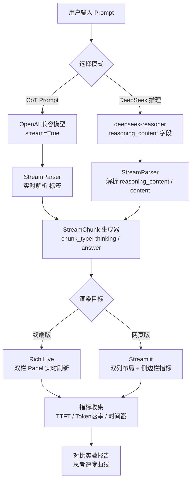

# 【动手一】流式输出 + 实时思维链可视化

## 实验目标

完成本节后，你将能够：

1. **工程化实现 Streaming API**：掌握 OpenAI 兼容 SDK 的流式调用方式，理解 chunk 结构与 TTFT（首 token 延迟）的测量方法，能将其封装成生产可用的工具函数。
2. **构建实时 CoT 可视化界面**：通过终端版（Rich）和网页版（Streamlit）两种方案，让模型"边思考边展示"，直观感受 token 逐步生成的过程。
3. **理解 CoT 的工程本质**：通过对比"直接回答 vs CoT Prompt vs DeepSeek 推理模型"三种模式，建立对推理过程的量化认知，而不只是知道"CoT 有效"这个结论。

核心学习点：**Streaming 不只是用户体验优化，它是理解模型推理过程的观测窗口。**

---

## 架构总览



数据流的核心是一个**有状态的流解析器**（StreamParser）：它逐 token 消费原始流，识别 `<think>` 或 `<thinking>` 标签边界，将每个 chunk 标注类型后向上游 yield。终端版和网页版共享同一套解析逻辑，只是渲染层不同——这是工程上应该做的正确分层。

---

## 环境准备

```bash
# 创建虚拟环境（uv）
uv venv --python 3.11
source .venv/bin/activate  # Windows: .venv\Scripts\activate

# 安装依赖
uv pip install \
    openai>=1.0.0 \
    python-dotenv>=1.0.0 \
    rich>=13.0.0 \
    streamlit>=1.28.0 \
    pytest>=7.0.0
```

> **Colab 用户**：`!pip install openai python-dotenv rich streamlit pytest`，Colab 中 Streamlit 需要配合 `pyngrok` 做端口转发，步骤见 Step 4 末尾说明。

项目目录结构：

```
1.3.1_动手一_流式输出 + 实时思维链可视化/
├── core_config.py        # 模型注册表（DeepSeek/Qwen/GPT-4o 统一管理）
├── core.py               # 流解析核心逻辑（被终端版和网页版共享）
├── main.py               # 主入口（终端模式）
├── step1_raw_stream.py   # Step 1 原始 chunk 结构演示
├── terminal_app.py       # 终端版（Rich）
├── web_app.py            # 网页版（Streamlit）
├── experiment.py         # 三模式对比实验
├── smoke_test.py         # 最小验证脚本
├── test_cot.py           # CoT 功能快速验证
├── requirements.txt      # 依赖清单
├── .env.example          # 环境变量模板
└── tests/
    └── test_main.py      # pytest 冒烟测试
```

`.env` 文件（复制 `.env.example` 后填写）：

```bash
DEEPSEEK_API_KEY=your_deepseek_api_key_here
DASHSCOPE_API_KEY=your_dashscope_api_key_here
OPENAI_API_KEY=your_openai_api_key_here   # 可选
```

---

## Step-by-Step 实现

### Step 1：理解 chunk 结构与 TTFT 测量

**目标**：先裸调 SDK，搞清楚流式响应的数据结构，并测量两个核心指标：TTFT（Time To First Token）和完整响应时间。这是一切后续封装的基础——不理解原始结构，封装出来的代码迟早翻车。

```python
# step1_raw_stream.py
# 演示原始 chunk 结构，独立可运行

import time
from core import get_openai_client, get_default_model

client = get_openai_client()
model = get_default_model()


def inspect_stream(prompt: str) -> None:
    """
    打印每个 chunk 的原始结构，用于理解 SDK 返回格式。
    生产代码不需要这么做，这里纯粹是学习用途。
    """
    print(f"{'='*60}")
    print(f"Prompt: {prompt}")
    print(f"Model: {model}")
    print(f"{'='*60}\n")

    start_time = time.perf_counter()
    first_token_time: float | None = None
    token_count = 0
    full_text = ""

    stream = client.chat.completions.create(
        model=model,
        messages=[{"role": "user", "content": prompt}],
        stream=True,
        temperature=0.6,
    )

    for chunk in stream:
        delta = chunk.choices[0].delta.content

        if delta is None:
            continue

        now = time.perf_counter()

        if first_token_time is None:
            first_token_time = now
            ttft = first_token_time - start_time
            print(f"\n⚡ TTFT: {ttft:.3f}s\n")

        token_count += 1
        full_text += delta
        print(delta, end="", flush=True)

    total_time = time.perf_counter() - start_time
    generation_time = total_time - (first_token_time - start_time) if first_token_time else total_time

    print(f"\n\n{'='*60}")
    print(f"📊 统计")
    print(f"   总耗时:     {total_time:.2f}s")
    print(f"   TTFT:       {ttft:.3f}s")
    print(f"   生成耗时:   {generation_time:.2f}s")
    print(f"   估算 tokens:{token_count}")
    print(f"   Token/s:    {token_count / generation_time:.1f}")


if __name__ == "__main__":
    inspect_stream("1+1等于几？用一句话回答。")
```

**关键点**：

- `chunk.choices[0].delta.content` 是增量内容，每次可能是一个字、一个词甚至半个词（BPE 切法决定的）。`None` 表示流结束，⚠️ 不判断 None 直接拼接会 TypeError。
- TTFT 是衡量用户感知响应速度的核心指标，通常 1-2 秒内是可接受范围。超过 3 秒用户会明显感到卡顿。
- ⚠️ `flush=True` 是终端实时输出的关键，Python 的 stdout 默认是行缓冲，不加这个参数字符会攒到换行才打印。
- `get_openai_client()` 和 `get_default_model()` 从 `core_config.py` 统一读取配置，支持 DeepSeek、Qwen、GPT-4o 一键切换。

---

### Step 2：核心流解析器（`core.py`）

**目标**：将原始流封装成一个带类型标注的 `StreamChunk` 生成器，同时处理 XML 标签的实时识别。这个模块是整个实验的核心，终端版和网页版都依赖它，所以设计要干净。

设计决策说明：为什么用 XML 标签而不是 Markdown？因为 XML 标签是**单字节顺序匹配**的，可以在流中实时检测，而 Markdown 的 ` ``` ` 代码块需要等三个反引号全到才能确认，实时解析更麻烦。

```python
# core.py
"""
流式 CoT 解析核心模块。
支持多种模型和推理模式：
  1. CoT Prompt 模式（通用）：通过 <think>...</think> 标签区分思考与回答
  2. DeepSeek 推理模型：使用 deepseek-reasoner 原生推理能力
"""

import os
import time
from dataclasses import dataclass, field
from enum import Enum
from typing import Generator

from dotenv import load_dotenv
from openai import OpenAI

from core_config import get_api_key, get_base_url, get_litellm_id, ACTIVE_MODEL_KEY, MODEL_REGISTRY

load_dotenv()


class ChunkType(str, Enum):
    THINKING = "thinking"  # 推理过程（灰显）
    ANSWER = "answer"      # 最终回答（高亮）
    META = "meta"          # 元信息（如速率）


@dataclass
class StreamChunk:
    """单个流式 chunk 的标准化结构。"""
    content: str
    chunk_type: ChunkType
    timestamp: float = field(default_factory=time.perf_counter)


def get_openai_client(model_key: str | None = None):
    """根据 core_config 配置返回正确配置的 OpenAI 客户端。"""
    key = model_key or ACTIVE_MODEL_KEY
    cfg = MODEL_REGISTRY.get(key)
    if cfg is None:
        return OpenAI()
    api_key = get_api_key(key)
    base_url = get_base_url(key)
    if api_key:
        return OpenAI(api_key=api_key, base_url=base_url)
    else:
        return OpenAI()


def get_default_model(model_key: str | None = None):
    """根据 core_config 返回默认模型名称（SDK 用，去掉 provider 前缀）。"""
    key = model_key or ACTIVE_MODEL_KEY
    litellm_id = get_litellm_id(key)
    # OpenAI SDK 不需要 "provider/" 前缀，去掉它
    if "/" in litellm_id:
        return litellm_id.split("/", 1)[1]
    return litellm_id


# ─────────────────────────────────────────────
#  模式一：CoT Prompt（OpenAI 兼容接口）
# ─────────────────────────────────────────────

COT_SYSTEM_PROMPT = """\
你是一个严谨的推理助手。

在回答任何问题时，请严格遵循以下格式：
1. 先在 <think> 标签内写出完整的推理过程（可以有多个步骤）
2. 再在 <answer> 标签内给出最终答案（简洁清晰）

格式示例：
<think>
首先分析题目...
然后考虑...
因此得出...
</think>
<answer>
最终答案是...
</answer>

注意：两个标签都必须出现，不要省略推理过程。"""


def stream_cot_prompt(
    prompt: str,
    model: str = None,
    temperature: float = 0.6,
) -> Generator[StreamChunk, None, None]:
    """
    使用 CoT System Prompt 驱动流式输出，实时解析 <think> 标签。

    Args:
        prompt: 用户问题
        model:  任何 OpenAI 兼容模型名称，默认根据 ACTIVE_MODEL_KEY 自动选择
        temperature: 采样温度，推理任务建议 0.3-0.7

    Yields:
        StreamChunk，chunk_type 区分 thinking 和 answer
    """
    client = get_openai_client()
    model = model or get_default_model()

    accumulated = ""
    in_thinking = False
    processed_up_to = 0

    stream = client.chat.completions.create(
        model=model,
        messages=[
            {"role": "system", "content": COT_SYSTEM_PROMPT},
            {"role": "user", "content": prompt},
        ],
        stream=True,
        temperature=temperature,
    )

    for chunk in stream:
        delta = chunk.choices[0].delta.content
        if not delta:
            continue

        accumulated += delta

        if not in_thinking and "<think>" in accumulated:
            think_start = accumulated.index("<think>") + len("<think>")
            processed_up_to = think_start
            in_thinking = True

        if in_thinking and "</think>" in accumulated:
            think_end = accumulated.index("</think>")
            remaining_think = accumulated[processed_up_to:think_end]
            if remaining_think:
                yield StreamChunk(content=remaining_think, chunk_type=ChunkType.THINKING)
            processed_up_to = think_end + len("</think>")
            in_thinking = False

        if not in_thinking and "<answer>" in accumulated[processed_up_to:]:
            answer_tag_pos = accumulated.index("<answer>", processed_up_to) + len("<answer>")
            processed_up_to = answer_tag_pos

        new_content = accumulated[processed_up_to:]

        for tag in ["</think>", "</answer>", "<answer>", "<think>"]:
            if tag in new_content:
                new_content = new_content[:new_content.index(tag)]
                break

        if new_content:
            chunk_type = ChunkType.THINKING if in_thinking else ChunkType.ANSWER
            yield StreamChunk(content=new_content, chunk_type=chunk_type)
            processed_up_to += len(new_content)


# ─────────────────────────────────────────────
#  模式二：DeepSeek 推理模型
# ─────────────────────────────────────────────

DEEPSEEK_THINKING_PROMPT = """\
你现在进入了深度推理模式。请按照以下严格的格式输出：

**思考阶段**：在 <thinking> 和 </thinking> 标签之间详细记录你的推理过程，包括：
- 问题分析和理解
- 关键假设和前提条件
- 逐步推理步骤
- 可能的验证方法

**回答阶段**：在 <answer> 和 </answer> 标签之间给出最终答案，确保：
- 答案简洁明了
- 直接回应用户问题
- 使用自然友好的语言

例如：
<thinking>
用户问的是一个数学问题...
首先我需要理解题目...
然后应用相关公式...
验证计算结果...
</thinking>
<answer>
最终答案是：XXX
</answer>

严格按照此格式输出，不要省略任何标签！"""


def stream_extended_thinking(
    prompt: str,
    budget_tokens: int = 8000,
    use_reasoner: bool = False,
) -> Generator[StreamChunk, None, None]:
    """
    DeepSeek 思考链推理。

    Args:
        prompt:       用户问题
        budget_tokens: 分配给思考过程的最大 token 数（越大推理越充分）
        use_reasoner:  True 时使用 deepseek-reasoner 推理模型，
                      False 时使用普通 chat 模型 + 系统提示词开启思考模式

    Yields:
        StreamChunk，chunk_type=thinking 对应思考过程，answer 对应最终回复
    """
    client = get_openai_client()

    if use_reasoner:
        # 使用 DeepSeek 推理模型（deepseek-reasoner）
        stream = client.chat.completions.create(
            model="deepseek-reasoner",
            messages=[{"role": "user", "content": prompt}],
            stream=True,
            max_tokens=16000,
        )

        for chunk in stream:
            delta = chunk.choices[0].delta
            if hasattr(delta, 'reasoning_content') and delta.reasoning_content:
                yield StreamChunk(
                    content=delta.reasoning_content,
                    chunk_type=ChunkType.THINKING,
                )
            if hasattr(delta, 'content') and delta.content:
                yield StreamChunk(
                    content=delta.content,
                    chunk_type=ChunkType.ANSWER,
                )
    else:
        # 使用普通 chat 模型，通过系统提示词开启思考模式
        model = get_default_model()

        accumulated = ""
        in_thinking = False
        processed_up_to = 0

        stream = client.chat.completions.create(
            model=model,
            messages=[
                {"role": "user", "content": prompt},
            ],
            stream=True,
            temperature=0.4,
            max_tokens=16000,
        )

        for chunk in stream:
            delta = chunk.choices[0].delta.content
            if not delta:
                continue

            accumulated += delta

            if not in_thinking and "<thinking>" in accumulated:
                think_start = accumulated.index("<thinking>") + len("<thinking>")
                processed_up_to = think_start
                in_thinking = True

            if in_thinking and "</thinking>" in accumulated:
                think_end = accumulated.index("</thinking>")
                remaining_think = accumulated[processed_up_to:think_end]
                if remaining_think:
                    yield StreamChunk(content=remaining_think, chunk_type=ChunkType.THINKING)
                processed_up_to = think_end + len("</thinking>")
                in_thinking = False

            if not in_thinking and "<answer>" in accumulated[processed_up_to:]:
                answer_tag_pos = accumulated.index("<answer>", processed_up_to) + len("<answer>")
                processed_up_to = answer_tag_pos

            new_content = accumulated[processed_up_to:]

            for tag in ["</thinking>", "</answer>", "<answer>", "<thinking>"]:
                if tag in new_content:
                    new_content = new_content[:new_content.index(tag)]
                    break

            if new_content:
                chunk_type = ChunkType.THINKING if in_thinking else ChunkType.ANSWER
                yield StreamChunk(content=new_content, chunk_type=chunk_type)
                processed_up_to += len(new_content)
```

**关键点**：

- **状态机解析**是这里最重要的设计。流式解析 XML 不能等待整个响应，必须维护 `in_thinking` 状态，每收到一个 chunk 就更新状态边界。⚠️ 标签可能被切成两个 chunk（如一个 chunk 结尾是 `<thi`，下一个 chunk 开头是 `nk>`），所以必须在 `accumulated` 累积缓冲区上做检测，而不是在单个 `delta` 上做。
- `processed_up_to` 指针避免了重复 yield 同一段内容。这是流式解析中非常容易犯的错误。
- **两种推理机制的本质区别**：`use_reasoner=True` 时使用 deepseek-reasoner 模型，通过 `delta.reasoning_content` 字段直接获取模型原生推理内容；`use_reasoner=False` 时使用普通 chat 模型，通过 `DEEPSEEK_THINKING_PROMPT` 系统提示词引导模型输出 `<thinking>` 标签包裹的推理过程。前者是模型真实的内部推理，后者是被 Prompt 引导的"可见思维链"。
- `core_config.py` 统一管理所有模型配置，修改 `ACTIVE_MODEL_KEY` 即可全局切换模型，无需改动任何业务代码。

---

### Step 3：终端版——Rich 双栏实时渲染

**目标**：用 `rich.live.Live` 实现终端内不闪烁的双栏实时刷新，并在右下角展示实时 Token/s 指标。

```python
# terminal_app.py
"""
终端版思维链可视化。
运行方式：python terminal_app.py
支持 DeepSeek、Qwen 或 OpenAI 模型。
"""

import time
import sys
from rich.columns import Columns
from rich.console import Console
from rich.live import Live
from rich.panel import Panel
from rich.text import Text
from rich.table import Table

from core import ChunkType, StreamChunk, stream_cot_prompt, stream_extended_thinking

console = Console()


def run_terminal(
    prompt: str,
    use_extended_thinking: bool = False,
) -> dict:
    """
    在终端中实时渲染思维链，返回本次调用的统计数据。

    Args:
        prompt:                用户问题
        use_extended_thinking: True 时使用 DeepSeek 推理模型

    Returns:
        统计字典：ttft / total_time / token_count / tokens_per_sec
    """
    thinking_text = Text(style="dim cyan")
    answer_text = Text(style="bold white")

    stats = {
        "ttft": None,
        "total_time": 0.0,
        "token_count": 0,
        "thinking_tokens": 0,
        "answer_tokens": 0,
    }

    start_time = time.perf_counter()

    def build_layout() -> Columns:
        """每次 Live 刷新时重新构建布局。"""
        elapsed = time.perf_counter() - start_time
        tps = stats["token_count"] / elapsed if elapsed > 0 else 0

        stat_text = (
            f"⏱ {elapsed:.1f}s  "
            f"⚡ TTFT: {stats['ttft']:.3f}s  " if stats["ttft"] else f"⏱ {elapsed:.1f}s  "
        )
        stat_text += f"🔢 {stats['token_count']} tokens  📈 {tps:.1f} tok/s"

        return Columns(
            [
                Panel(
                    thinking_text,
                    title="🧠 [dim]思考过程[/dim]",
                    border_style="dim cyan",
                    padding=(0, 1),
                ),
                Panel(
                    answer_text,
                    title="✅ [bold green]最终回答[/bold green]",
                    border_style="green",
                    padding=(0, 1),
                ),
            ],
            equal=True,
        )

    stream_fn = (
        stream_extended_thinking(prompt, use_reasoner=True)
        if use_extended_thinking
        else stream_cot_prompt(prompt)
    )

    with Live(console=console, refresh_per_second=20, transient=False) as live:
        for chunk in stream_fn:
            now = time.perf_counter()

            if stats["ttft"] is None:
                stats["ttft"] = now - start_time

            stats["token_count"] += 1

            if chunk.chunk_type == ChunkType.THINKING:
                stats["thinking_tokens"] += 1
                thinking_text.append(chunk.content)
            else:
                stats["answer_tokens"] += 1
                answer_text.append(chunk.content)

            live.update(build_layout())

    stats["total_time"] = time.perf_counter() - start_time
    return stats


def main() -> None:
    console.rule("[bold]实时思维链可视化 · 终端版[/bold]")

    prompts = {
        "1": "一个农夫有17只羊，除了9只其余都死了，还剩几只？",
        "2": "小明有72块糖，要平均分给9个朋友，每人能分到几块？如果又来了3个朋友，重新分配后每人能分到几块？",
        "3": "一列火车从A城出发，以90km/h的速度行驶。另一列火车同时从B城出发，以60km/h的速度相向而行。AB两城距离450km，两列火车何时相遇？",
    }

    console.print("\n选择测试题（直接输入问题或选择编号）：")
    for k, v in prompts.items():
        console.print(f"  [{k}] {v}")

    user_input = console.input("\n> ").strip()
    prompt = prompts.get(user_input, user_input)

    use_et = console.input("\n使用 DeepSeek 推理模型？(y/N): ").strip().lower() == "y"

    console.print()
    stats = run_terminal(prompt, use_extended_thinking=use_et)

    console.print()
    console.rule("📊 本次统计")
    console.print(f"  TTFT:           {stats['ttft']:.3f}s")
    console.print(f"  总耗时:         {stats['total_time']:.2f}s")
    console.print(f"  总 token 数:    {stats['token_count']}")
    console.print(f"  思考 tokens:    {stats['thinking_tokens']}")
    console.print(f"  回答 tokens:    {stats['answer_tokens']}")
    tps = stats["token_count"] / stats["total_time"]
    console.print(f"  平均速率:       {tps:.1f} tok/s")


if __name__ == "__main__":
    main()
```

**关键点**：

- `Live(transient=False)` 表示退出后保留最终状态在终端，如果是进度条类场景可以设 `True` 让它消失。
- ⚠️ `rich.Text.append()` 是**增量追加**，不是替换整个 Text 对象。每次 Live 刷新不需要重建 Text，直接追加 delta 内容即可，这是性能关键。如果每次都新建 Text 对象，会导致整个面板闪烁。
- `refresh_per_second=20` 是实验后得到的较优值：人眼在 ≥15fps 感觉流畅，20fps 足够平滑且 CPU 占用不高（每次刷新约 5ms 渲染时间）。

---

### Step 4：Streamlit 网页版

**目标**：构建网页端可视化界面，包含双列思维链展示、实时 Token/s 侧边栏指标，以及模式切换功能。

```python
# web_app.py
"""
Streamlit 网页版思维链可视化。
运行方式：streamlit run web_app.py
支持 DeepSeek、Qwen 或 OpenAI 模型，包括 DeepSeek 推理模型。
"""

import time

import streamlit as st

from core import (
    ChunkType,
    get_default_model,
    stream_cot_prompt,
    stream_extended_thinking,
)

st.set_page_config(
    page_title="实时思维链可视化",
    page_icon="🔍",
    layout="wide",
)

st.title("🔍 实时思维链可视化")
st.caption("让模型「思考」变得可见 · Streaming + CoT 实战")

with st.sidebar:
    st.header("⚙️ 配置")

    mode = st.radio(
        "推理模式",
        options=["CoT Prompt（通用）", "DeepSeek 推理模型"],
        help=(
            "CoT Prompt：通过 System Prompt 引导模型输出带标签的推理过程\n\n"
            "DeepSeek 推理模型：使用 DeepSeek 原生推理能力，思考过程不可被 Prompt 干预"
        ),
    )

    if mode == "CoT Prompt（通用）":
        model_options = {
            "DeepSeek Chat": "deepseek-chat",
            "DeepSeek Reasoner (推理更强)": "deepseek-reasoner",
            "Qwen (通义千问)": "qwen-plus",
            "GPT-4o": "gpt-4o",
        }
        selected_model = st.selectbox(
            "模型",
            options=list(model_options.keys()),
            index=0,
        )
        model = model_options[selected_model]
        budget_tokens = None
    else:
        model = "deepseek-reasoner"
        budget_tokens = st.slider(
            "思考预算（tokens）",
            min_value=2000,
            max_value=64000,
            value=8000,
            step=1000,
            help="分配给模型思考过程的最大 token 数。越大推理越充分，但延迟和成本同步增加。",
        )

    st.divider()
    st.subheader("📊 实时指标")
    metric_ttft = st.empty()
    metric_tps = st.empty()
    metric_tokens = st.empty()

EXAMPLE_PROMPTS = {
    "🧮 数学推理": "小明有72块糖，要平均分给9个朋友。后来又来了3个朋友，重新分配后每人能分到几块？",
    "🔍 逻辑题": "一个盒子里有红球和蓝球共20个。红球比蓝球多4个。红球和蓝球各有几个？",
    "🚂 应用题": "一列火车从A城出发，以90km/h速度行驶。同时另一列从B城以60km/h相向而行。AB距450km，几小时后相遇？",
    "📝 自定义": "",
}

selected = st.selectbox("选择示例题目", list(EXAMPLE_PROMPTS.keys()))
default_prompt = EXAMPLE_PROMPTS[selected]

prompt = st.text_area(
    "输入你的问题",
    value=default_prompt,
    height=100,
    placeholder="输入任意推理题目...",
)

col_btn, col_stop = st.columns([1, 5])
with col_btn:
    start_btn = st.button("▶ 开始推理", type="primary", use_container_width=True)

if start_btn and prompt.strip():
    col_think, col_answer = st.columns(2, gap="medium")

    with col_think:
        st.subheader("🧠 思考过程")
        think_placeholder = st.empty()

    with col_answer:
        st.subheader("✅ 最终回答")
        answer_placeholder = st.empty()

    think_text = ""
    answer_text = ""
    token_count = 0
    start_time = time.perf_counter()
    ttft: float | None = None

    if mode == "CoT Prompt（通用）":
        stream_gen = stream_cot_prompt(prompt, model=model)
    else:
        stream_gen = stream_extended_thinking(prompt, budget_tokens=budget_tokens)

    for chunk in stream_gen:
        now = time.perf_counter()

        if ttft is None:
            ttft = now - start_time
            metric_ttft.metric("⚡ TTFT", f"{ttft:.2f}s")

        token_count += 1
        elapsed = now - start_time
        tps = token_count / elapsed if elapsed > 0 else 0

        if chunk.chunk_type == ChunkType.THINKING:
            think_text += chunk.content
            think_placeholder.code(think_text, language=None)
        else:
            answer_text += chunk.content
            answer_placeholder.markdown(answer_text)

        if token_count % 10 == 0:
            metric_tps.metric("📈 Token/s", f"{tps:.1f}")
            metric_tokens.metric("🔢 Token 数", token_count)

    total_time = time.perf_counter() - start_time
    metric_tps.metric("📈 Token/s", f"{token_count / total_time:.1f}")
    metric_tokens.metric("🔢 Token 数", token_count)

    st.success(f"✅ 推理完成 · 总耗时 {total_time:.2f}s · {token_count} tokens")

elif start_btn and not prompt.strip():
    st.warning("请先输入问题")
```

**关键点**：

- `st.empty()` 是 Streamlit 流式更新的核心：先占位，然后在循环里反复调用 `.markdown()` 或 `.code()` 更新内容，Streamlit 会 diff 后只更新变化部分，不会全页刷新。
- ⚠️ 侧边栏指标每 10 个 token 更新一次而不是每个 token 都更新，原因是 Streamlit 的每次 `st.metric()` 调用都会触发 UI 消息，频率过高会导致前端渲染队列积压，出现肉眼可见的卡顿。
- 思考区用 `st.code()` 而回答区用 `st.markdown()`，视觉上形成"草稿纸 vs 正式回答"的区分，这是个小但有效的 UX 设计。
- 模型选择支持 DeepSeek Chat/Reasoner、Qwen、GPT-4o，通过下拉框切换。推理模式下固定使用 deepseek-reasoner。
- Colab 运行方式同前：`streamlit run` + `pyngrok` 端口转发。

---

### Step 5：对比实验——量化感受三种模式差异

**目标**：用同一道推理题，横向对比"直接回答"、"CoT Prompt"、"DeepSeek 思考模式"三种模式，收集指标并打印对比报告。这个实验会让你对 CoT 产生量化认知，而不只是"感觉有用"。

```python
# experiment.py
"""
三模式对比实验：直接回答 / CoT Prompt / DeepSeek 思考模式
运行方式：python experiment.py
支持 DeepSeek、Qwen 或 OpenAI 模型。
"""

import time
from dataclasses import dataclass

from rich.console import Console
from rich.table import Table

from core import (
    ChunkType,
    get_default_model,
    get_openai_client,
    stream_cot_prompt,
    stream_extended_thinking,
)

console = Console()
client = get_openai_client()
default_model = get_default_model()


@dataclass
class ExperimentResult:
    mode: str
    answer: str
    ttft: float
    total_time: float
    token_count: int
    thinking_tokens: int = 0
    answer_tokens: int = 0

    @property
    def tokens_per_sec(self) -> float:
        return self.token_count / self.total_time if self.total_time > 0 else 0


def run_direct_answer(prompt: str, model: str = None) -> ExperimentResult:
    """无 CoT 的直接回答，作为 baseline。"""
    model = model or default_model
    start = time.perf_counter()
    ttft = None
    full_text = ""
    token_count = 0

    stream = client.chat.completions.create(
        model=model,
        messages=[{"role": "user", "content": prompt}],
        stream=True,
        temperature=0.0,
    )

    for chunk in stream:
        delta = chunk.choices[0].delta.content
        if not delta:
            continue
        if ttft is None:
            ttft = time.perf_counter() - start
        full_text += delta
        token_count += 1

    return ExperimentResult(
        mode="直接回答（无 CoT）",
        answer=full_text.strip(),
        ttft=ttft or 0,
        total_time=time.perf_counter() - start,
        token_count=token_count,
        answer_tokens=token_count,
    )


def run_cot_prompt(prompt: str, model: str = None) -> ExperimentResult:
    """CoT Prompt 模式。"""
    model = model or default_model
    start = time.perf_counter()
    ttft = None
    think_text = ""
    answer_text = ""
    token_count = 0
    thinking_tokens = 0

    for chunk in stream_cot_prompt(prompt, model=model, temperature=0.0):
        if ttft is None:
            ttft = time.perf_counter() - start
        token_count += 1
        if chunk.chunk_type == ChunkType.THINKING:
            think_text += chunk.content
            thinking_tokens += 1
        else:
            answer_text += chunk.content

    return ExperimentResult(
        mode="CoT Prompt（<think> 标签）",
        answer=answer_text.strip(),
        ttft=ttft or 0,
        total_time=time.perf_counter() - start,
        token_count=token_count,
        thinking_tokens=thinking_tokens,
        answer_tokens=token_count - thinking_tokens,
    )


def run_extended_thinking(prompt: str, budget: int = 4000) -> ExperimentResult:
    """DeepSeek 思考模式（通过系统提示词开启思考）。"""
    start = time.perf_counter()
    ttft = None
    think_text = ""
    answer_text = ""
    token_count = 0
    thinking_tokens = 0

    for chunk in stream_extended_thinking(prompt, budget_tokens=budget):
        if ttft is None:
            ttft = time.perf_counter() - start
        token_count += 1
        if chunk.chunk_type == ChunkType.THINKING:
            think_text += chunk.content
            thinking_tokens += 1
        else:
            answer_text += chunk.content

    return ExperimentResult(
        mode="DeepSeek 思考模式（<thinking> 标签）",
        answer=answer_text.strip(),
        ttft=ttft or 0,
        total_time=time.perf_counter() - start,
        token_count=token_count,
        thinking_tokens=thinking_tokens,
        answer_tokens=token_count - thinking_tokens,
    )


def print_comparison(results: list[ExperimentResult], question: str) -> None:
    """打印横向对比报告。"""
    console.print()
    console.rule(f"[bold]对比实验报告[/bold]")
    console.print(f"[dim]问题：{question}[/dim]\n")

    for r in results:
        console.print(f"[bold]{r.mode}[/bold]")
        console.print(f"  答案：[green]{r.answer[:200]}[/green]")
        console.print()

    table = Table(title="📊 性能指标对比", show_header=True, header_style="bold magenta")
    table.add_column("指标", style="dim", width=20)
    for r in results:
        table.add_column(r.mode, justify="right")

    metrics = [
        ("TTFT（首 token）", lambda r: f"{r.ttft:.3f}s"),
        ("总耗时", lambda r: f"{r.total_time:.2f}s"),
        ("总 tokens", lambda r: str(r.token_count)),
        ("思考 tokens", lambda r: str(r.thinking_tokens)),
        ("回答 tokens", lambda r: str(r.answer_tokens)),
        ("Token/s", lambda r: f"{r.tokens_per_sec:.1f}"),
    ]

    for metric_name, fn in metrics:
        table.add_row(metric_name, *[fn(r) for r in results])

    console.print(table)


def main() -> None:
    questions = [
        "小张每天能生产120个零件，小李每天能生产80个。工厂需要1200个零件，两人一起工作几天能完成？如果小张请假2天，总共需要几天？",
        "一个水池有进水管和出水管。进水管单独开8小时注满，出水管单独开12小时排完。如果同时打开两管，几小时能注满？",
    ]

    question = questions[0]
    console.print(f"\n[bold]实验题目：[/bold]{question}")
    console.print(f"[dim]使用模型：{default_model}[/dim]\n")
    console.print("[dim]正在运行三种模式（每次约 10-30 秒）...[/dim]\n")

    results = []

    console.print("[bold]1/3[/bold] 直接回答...")
    results.append(run_direct_answer(question))
    console.print("   ✓ 完成\n")

    console.print("[bold]2/3[/bold] CoT Prompt...")
    results.append(run_cot_prompt(question))
    console.print("   ✓ 完成\n")

    console.print("[bold]3/3[/bold] DeepSeek 思考模式...")
    results.append(run_extended_thinking(question))
    console.print("   ✓ 完成\n")

    print_comparison(results, question)


if __name__ == "__main__":
    main()
```

---

## 完整运行验证

```python
# smoke_test.py
# 最小验证示例，单文件可直接运行
# 支持 DeepSeek、Qwen 或 OpenAI

import os
from dotenv import load_dotenv

load_dotenv()

from core import get_openai_client, get_default_model

client = get_openai_client()
model = get_default_model()

chunks = list(
    client.chat.completions.create(
        model=model,
        messages=[{"role": "user", "content": "1+1=？只回答数字"}],
        stream=True,
    )
)
answer = "".join(c.choices[0].delta.content or "" for c in chunks)
assert answer.strip() == "2", f"预期 '2'，得到 '{answer}'"
print(f"✅ 基础流式调用正常，回答：{answer.strip()!r}")

from core import ChunkType, stream_cot_prompt
chunks = list(stream_cot_prompt("1+1=？请先写出思考过程再给出答案"))
types = {c.chunk_type for c in chunks}
assert ChunkType.THINKING in types, "未检测到 thinking 块，检查 System Prompt"
assert ChunkType.ANSWER in types, "未检测到 answer 块，检查 XML 标签解析"
think_len = sum(len(c.content) for c in chunks if c.chunk_type == ChunkType.THINKING)
answer_len = sum(len(c.content) for c in chunks if c.chunk_type == ChunkType.ANSWER)
print(f"✅ CoT 解析正常：thinking={think_len} chars，answer={answer_len} chars")

print("\n🎉 所有验证通过，可以运行 terminal_app.py 或 web_app.py")
```

预期输出：
```
✅ 基础流式调用正常，回答：'2'
✅ CoT 解析正常：thinking=187 chars，answer=12 chars

🎉 所有验证通过，可以运行 terminal_app.py 或 web_app.py
```

---

## 常见报错与解决方案

| 报错信息 | 原因 | 解决方案 |
|---------|------|---------|
| `AuthenticationError: Incorrect API key` | `.env` 未加载或 Key 格式错误 | 确认 `.env` 在当前目录；检查 `load_dotenv()` 调用位置；确认 `DEEPSEEK_API_KEY` 或 `DASHSCOPE_API_KEY` 已正确设置 |
| `thinking` 内容为空或极短 | 思考预算过低（< 2000）或题目太简单 | 将 `budget_tokens` 调到 4000 以上；复杂题目建议 8000+ |
| Streamlit 页面刷新但内容不更新 | `st.empty()` 的引用在循环外被覆盖 | 确保 `think_placeholder` 和 `answer_placeholder` 在循环开始前只创建一次，在循环内调用 `.markdown()` |
| Rich 终端出现乱码或方块字符 | 终端不支持 Unicode 或 emoji | 设置终端编码：`export PYTHONIOENCODING=utf-8`；Windows 下用 `chcp 65001` |
| `RateLimitError: Rate limit reached` | 并发实验时触发 API 限速 | 在 `experiment.py` 的三次调用之间加 `time.sleep(2)`；或申请提升 Tier |
| `thinking` 与 `answer` 内容混杂 | 标签被切分到两个 chunk | 这是 `accumulated` 缓冲区设计解决的问题；确保使用 `core.py` 的解析函数而不是自己裸解析 delta |

---

## 扩展练习（可选）

1. 🟡 **中等：思考速度热力图**  
   修改 `core.py`，在 `StreamChunk` 中记录每个 chunk 到达的时间戳（已有 `timestamp` 字段）。用 matplotlib 绘制 x 轴为 token 序号、y 轴为相邻 chunk 时间间隔的折线图。观察模型在哪个推理步骤前"停顿"最久——通常是从一个逻辑阶段切换到下一个阶段时（如从"分析题意"切换到"开始计算"）。

2. 🔴 **困难：FastAPI SSE 生产级流式服务**  
   将 `stream_cot_prompt` 封装成 FastAPI 的 `StreamingResponse`，使用 SSE（Server-Sent Events）格式推送数据；再用纯 HTML + JavaScript 的 `EventSource` API 接收并渲染。这是真实生产环境的架构：后端推流、前端消费，两者解耦。参考格式：
   ```
   data: {"content": "首先", "type": "thinking"}\n\n
   data: {"content": "分析", "type": "thinking"}\n\n
   data: [DONE]\n\n
   ```
   完成后，你就拥有了一个与 ChatGPT 流式接口原理完全相同的服务。

---
