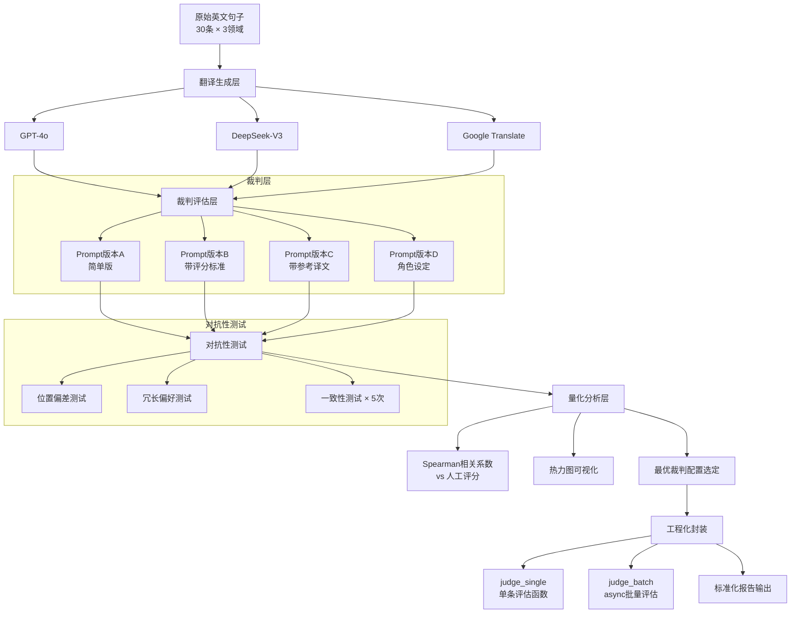

# 【动手三】多语言翻译质量评估器

## 实验目标

本节结束后，你将能够：独立设计一套 LLM-as-Judge 评估流水线，量化验证裁判 Prompt 的客观性，并输出可复现的翻译质量评估报告。

核心学习点（三个）：

1. **LLM-as-Judge 的核心缺陷**：位置偏差、冗长偏好、评分漂移——不了解这三点，你的评估结果毫无意义
2. **裁判 Prompt 工程**：评分标准的描述方式直接决定相关系数能否达到 0.7+
3. **评估框架的可迁移性**：这套逻辑是 RAGAS（RAG 评估）、Agent 评估的共同底层——掌握一次，横向复用

> **为什么先做翻译评估，不直接做 RAG 评估？**
> 翻译是理想的"实验沙盒"：有客观的人类参考标准（WMT 评测数据）、有多个现成的被评对象（GPT-4o / DeepSeek / Google Translate），且失败代价低。在此把 LLM-as-Judge 调通，Module 2.6 的 RAGAS 就是换几个维度名而已。

---

## 架构总览



---

## 环境准备

```bash
# 创建虚拟环境（uv）
uv venv --python 3.11 && source .venv/bin/activate

# 安装依赖
uv pip install -r requirements.txt
```

> Colab 用户：`!pip install litellm scipy pandas matplotlib seaborn python-dotenv tenacity deep-translator pytest pytest-asyncio` 即可，无需创建虚拟环境

配置 API 密钥：

```bash
# 复制 .env.example 为 .env
cp .env.example .env

# .env 文件
DEEPSEEK_API_KEY=your_deepseek_api_key_here
DASHSCOPE_API_KEY=your_dashscope_api_key_here
```

项目目录结构：

```
1.3.3_动手三_多语言翻译质量评估器/
├── .env.example              # 环境变量模板
├── core_config.py            # 全局模型注册表
├── main.py                   # 端到端运行入口
├── requirements.txt          # pip 依赖清单
├── data/
│   ├── __init__.py
│   └── test_set.py           # 测试数据集（3领域 × 5条）
├── judge/
│   ├── __init__.py           # 模块对外接口
│   ├── prompts.py            # 四个版本的裁判 Prompt
│   ├── translator.py         # 翻译生成层
│   ├── evaluator.py          # 核心评估逻辑
│   └── adversarial.py        # 对抗性测试
├── analysis/
│   ├── __init__.py
│   └── metrics.py            # 相关系数、一致性计算
├── tests/
│   ├── __init__.py
│   └── test_main.py          # 冒烟测试
└── _backup/                  # 整理前的原始文件备份
```

---

## Step-by-Step 实现

### Step 0：全局模型配置

**目标**：通过 `core_config.py` 统一管理所有模型配置，避免硬编码。

```python
# core_config.py
"""全局配置：模型注册表与定价信息"""
import os
from typing import TypedDict


class ModelConfig(TypedDict):
    litellm_id: str          # LiteLLM 识别的模型字符串
    price_in: float          # 每 1K input tokens 价格（美元）
    price_out: float         # 每 1K output tokens 价格（美元）
    max_tokens_limit: int    # 模型支持的最大 max_tokens
    api_key_env: str | None  # API Key 环境变量名（None 表示使用默认）
    base_url: str | None     # API Base URL（None 表示使用默认）


# 注册表：key 是界面显示名，value 是调用配置
MODEL_REGISTRY: dict[str, ModelConfig] = {
    "DeepSeek-V3": {
        "litellm_id": "deepseek/deepseek-chat",
        "price_in": 0.00027,
        "price_out": 0.0011,
        "max_tokens_limit": 4096,
        "api_key_env": "DEEPSEEK_API_KEY",
        "base_url": None,
    },
    "Qwen-Max": {
        "litellm_id": "openai/qwen-plus",
        "price_in": 0.001,
        "price_out": 0.004,
        "max_tokens_limit": 4096,
        "api_key_env": "DASHSCOPE_API_KEY",
        "base_url": "https://dashscope.aliyuncs.com/compatible-mode/v1",
    },
}

# 当前激活模型 key — 修改此处全局切换
ACTIVE_MODEL_KEY: str = "DeepSeek-V3"


def get_active_config() -> ModelConfig:
    """获取当前激活模型的完整配置"""
    return MODEL_REGISTRY[ACTIVE_MODEL_KEY]


def get_litellm_id(model_key: str | None = None) -> str:
    """获取指定模型（默认激活模型）的 LiteLLM ID"""
    key = model_key or ACTIVE_MODEL_KEY
    return MODEL_REGISTRY[key]["litellm_id"]


def get_api_key(model_key: str | None = None) -> str | None:
    """从环境变量读取指定模型的 API Key"""
    key = model_key or ACTIVE_MODEL_KEY
    env_var = MODEL_REGISTRY[key]["api_key_env"]
    return os.environ.get(env_var) if env_var else None


def get_base_url(model_key: str | None = None) -> str | None:
    """获取指定模型的 base_url（None 表示使用 SDK 默认值）"""
    key = model_key or ACTIVE_MODEL_KEY
    return MODEL_REGISTRY[key]["base_url"]


def get_model_list() -> list[str]:
    """获取所有已注册模型的显示名列表"""
    return list(MODEL_REGISTRY.keys())


def estimate_cost(model_key: str, input_tokens: int, output_tokens: int) -> float:
    """根据 Token 数估算调用费用（美元）"""
    cfg = MODEL_REGISTRY[model_key]
    return (
        input_tokens / 1000 * cfg["price_in"]
        + output_tokens / 1000 * cfg["price_out"]
    )
```

**关键点**：
- 所有 `judge_model` 参数默认使用 `"DeepSeek-V3"`（即 `MODEL_REGISTRY` 中的 key），而非硬编码的 `"gpt-4o"`
- 调用时，`evaluator.py` 和 `translator.py` 通过查 `MODEL_REGISTRY` 自动解析 `litellm_id`、`api_key`、`base_url`
- 修改 `ACTIVE_MODEL_KEY` 即可全局切换模型，无需改动任何业务代码

---

### Step 1：数据准备

**目标**：构建覆盖三个领域的测试集，并为每条数据配备"人工参考分"，作为评估 LLM 裁判准确性的黄金标准。

```python
# data/test_set.py
"""
测试数据集：3个领域 × 5句 = 15条英文原文
每条包含：原文、参考译文、人工评分（忠实度/流畅度/术语，1-5）
"""
from dataclasses import dataclass


@dataclass
class TestItem:
    id: str
    domain: str                    # tech / legal / casual
    source: str                    # 英文原文
    reference: str                 # 人工参考译文
    human_scores: dict[str, float] # {"faithfulness": 4.5, "fluency": 4.0, "terminology": 4.5}


TEST_SET: list[TestItem] = [
    # ── 科技新闻领域 ──────────────────────────────────────────────
    TestItem(
        id="tech_01",
        domain="tech",
        source="The transformer architecture revolutionized natural language processing by replacing recurrent neural networks with self-attention mechanisms.",
        reference="Transformer架构通过用自注意力机制取代循环神经网络，彻底革新了自然语言处理领域。",
        human_scores={"faithfulness": 5.0, "fluency": 4.5, "terminology": 5.0},
    ),
    TestItem(
        id="tech_02",
        domain="tech",
        source="Retrieval-Augmented Generation combines the parametric knowledge of language models with non-parametric retrieval from external knowledge bases.",
        reference="检索增强生成将语言模型的参数化知识与从外部知识库进行的非参数化检索相结合。",
        human_scores={"faithfulness": 5.0, "fluency": 4.0, "terminology": 5.0},
    ),
    TestItem(
        id="tech_03",
        domain="tech",
        source="Quantization reduces model size by representing weights in lower precision formats, trading some accuracy for significant memory savings.",
        reference="量化通过以低精度格式表示权重来缩小模型体积，以少量精度损失换取显著的内存节省。",
        human_scores={"faithfulness": 5.0, "fluency": 4.5, "terminology": 4.5},
    ),
    TestItem(
        id="tech_04",
        domain="tech",
        source="The key-value cache stores intermediate attention computations, allowing the model to avoid redundant calculations during autoregressive generation.",
        reference="键值缓存存储中间注意力计算结果，使模型在自回归生成过程中避免冗余计算。",
        human_scores={"faithfulness": 5.0, "fluency": 4.5, "terminology": 5.0},
    ),
    TestItem(
        id="tech_05",
        domain="tech",
        source="Fine-tuning on domain-specific data allows pre-trained models to adapt their general capabilities to specialized tasks without training from scratch.",
        reference="在领域专用数据上进行微调，使预训练模型无需从头训练即可将通用能力适配至专项任务。",
        human_scores={"faithfulness": 5.0, "fluency": 4.5, "terminology": 4.5},
    ),
    # ── 法律条款领域 ──────────────────────────────────────────────
    TestItem(
        id="legal_01",
        domain="legal",
        source="The licensee shall not sublicense, sell, resell, transfer, assign, or otherwise commercially exploit or make available to any third party the Software.",
        reference="被许可方不得将本软件再许可、出售、转售、转让、转让或以其他方式进行商业利用，或向任何第三方提供本软件。",
        human_scores={"faithfulness": 4.5, "fluency": 3.5, "terminology": 4.5},
    ),
    TestItem(
        id="legal_02",
        domain="legal",
        source="This Agreement constitutes the entire agreement between the parties with respect to the subject matter hereof and supersedes all prior agreements.",
        reference="本协议构成双方就本协议主题事项达成的完整协议，并取代双方此前就该主题事项签订的所有协议。",
        human_scores={"faithfulness": 5.0, "fluency": 4.0, "terminology": 5.0},
    ),
    TestItem(
        id="legal_03",
        domain="legal",
        source="In no event shall either party be liable to the other for any indirect, incidental, special, exemplary, or consequential damages.",
        reference="在任何情况下，任何一方均不对另一方承担任何间接、附带、特殊、示范性或后果性损害赔偿责任。",
        human_scores={"faithfulness": 5.0, "fluency": 4.5, "terminology": 5.0},
    ),
    TestItem(
        id="legal_04",
        domain="legal",
        source="The arbitration shall be conducted in accordance with the rules of the International Chamber of Commerce then in effect.",
        reference="仲裁应依据国际商会届时有效的仲裁规则进行。",
        human_scores={"faithfulness": 5.0, "fluency": 5.0, "terminology": 5.0},
    ),
    TestItem(
        id="legal_05",
        domain="legal",
        source="Each party represents and warrants that it has full power and authority to enter into and perform its obligations under this Agreement.",
        reference="各方声明并保证其拥有订立本协议并履行其在本协议项下义务的完全权力和授权。",
        human_scores={"faithfulness": 5.0, "fluency": 4.5, "terminology": 5.0},
    ),
    # ── 日常口语领域 ──────────────────────────────────────────────
    TestItem(
        id="casual_01",
        domain="casual",
        source="I've been swamped with work lately and haven't had a chance to catch up with anyone.",
        reference="最近工作忙得焦头烂额，都没机会跟大家联系一下。",
        human_scores={"faithfulness": 4.5, "fluency": 5.0, "terminology": 4.0},
    ),
    TestItem(
        id="casual_02",
        domain="casual",
        source="That new coffee shop on the corner is a total vibe — you should definitely check it out.",
        reference="街角那家新开的咖啡店氛围超棒，你一定要去看看。",
        human_scores={"faithfulness": 4.5, "fluency": 5.0, "terminology": 4.0},
    ),
    TestItem(
        id="casual_03",
        domain="casual",
        source="She's been killing it at the gym — I've never seen anyone get results that fast.",
        reference="她最近在健身房简直开挂了——我从没见过有人进步这么快。",
        human_scores={"faithfulness": 4.5, "fluency": 5.0, "terminology": 4.0},
    ),
    TestItem(
        id="casual_04",
        domain="casual",
        source="Let's grab some takeout tonight, I really don't feel like cooking after that meeting.",
        reference="今晚叫外卖吧，开完那个会我真的不想做饭了。",
        human_scores={"faithfulness": 5.0, "fluency": 5.0, "terminology": 4.0},
    ),
    TestItem(
        id="casual_05",
        domain="casual",
        source="He somehow managed to ace the exam without studying at all — classic him.",
        reference="他愣是没复习就把考试过了——太他了。",
        human_scores={"faithfulness": 4.0, "fluency": 4.5, "terminology": 4.0},
    ),
]
```

```python
# data/__init__.py
"""data 模块 - 测试数据集"""
from .test_set import TEST_SET, TestItem

__all__ = ["TEST_SET", "TestItem"]
```

**关键点**：
- 人工评分是"黄金标准"，用于事后验证 LLM 裁判是否靠谱。实际项目中建议双人独立打分后取均值，减少主观误差。
- 测试集刻意覆盖三种难度：科技术语翻译（有对错之分）、法律文本（措辞正式度敏感）、口语（文化意象迁移难度高）。这样能暴露裁判在不同场景下的偏差。
- 当前测试集为 15 条（每领域 5 条）。如果需要更高统计显著性，可扩展至 30 条（每领域 10 条）。

---

### Step 2：用三个翻译模型生成被评内容

**目标**：为每条测试数据生成三个版本的中文翻译，作为裁判的评估对象。

```python
# judge/translator.py
"""
调用三个翻译来源生成中文译文：GPT-4o / DeepSeek-V3 / Google Translate
"""
import asyncio
import os
from litellm import acompletion
from tenacity import retry, stop_after_attempt, wait_exponential

from core_config import MODEL_REGISTRY

TRANSLATE_PROMPT = """请将以下英文句子翻译成中文。
要求：
- 直接输出译文，不要任何解释或前缀
- 保持原文的语气和风格
- 专业术语请使用中文领域标准译法

原文：{source}"""


@retry(stop=stop_after_attempt(3), wait=wait_exponential(multiplier=1, min=2, max=10))
async def translate_with_llm(
    source: str,
    model: str,
) -> str:
    """调用 LLM 翻译单条文本，失败自动重试3次"""
    kwargs = {
        "model": model,
        "messages": [{"role": "user", "content": TRANSLATE_PROMPT.format(source=source)}],
        "temperature": 0.3,
    }

    if model in MODEL_REGISTRY:
        cfg = MODEL_REGISTRY[model]
        if cfg.get("api_key_env"):
            kwargs["api_key"] = os.environ.get(cfg["api_key_env"])
        if cfg.get("base_url"):
            kwargs["base_url"] = cfg["base_url"]

    resp = await acompletion(**kwargs)
    return resp.choices[0].message.content.strip()


async def generate_all_translations(
    test_set: list,
    models: dict[str, str],
) -> dict[str, dict[str, str]]:
    """
    并发生成所有翻译

    Returns:
        {item_id: {"gpt4o": "译文", "deepseek": "译文", "google": "译文"}}
    """
    results: dict[str, dict[str, str]] = {item.id: {} for item in test_set}

    for model_name, model_id in models.items():
        print(f"正在用 {model_name} 翻译 {len(test_set)} 条...")
        tasks = [translate_with_llm(item.source, model_id) for item in test_set]
        translations = await asyncio.gather(*tasks, return_exceptions=True)

        for item, translation in zip(test_set, translations):
            if isinstance(translation, Exception):
                print(f"  ⚠️  {model_name} 翻译 {item.id} 失败：{translation}")
                results[item.id][model_name] = "[翻译失败]"
            else:
                results[item.id][model_name] = translation

    return results


# 注：Google Translate 需要单独的 SDK，这里用 deep-translator 库
# uv pip install deep-translator==1.11.4
async def translate_with_google(source: str) -> str:
    """Google Translate 免费版（无需 API Key）"""
    from deep_translator import GoogleTranslator
    # 同步调用包在 executor 里，避免阻塞事件循环
    loop = asyncio.get_event_loop()
    result = await loop.run_in_executor(
        None,
        lambda: GoogleTranslator(source="en", target="zh-CN").translate(source),
    )
    return result
```

**关键点**：
- 通过查 `MODEL_REGISTRY` 自动获取 `api_key` 和 `base_url`，无需硬编码
- 翻译任务使用 `temperature=0.3`（低温度保持稳定，但不能为 0，否则过于死板）
- Google Translate 使用 `deep-translator` 库的免费版，通过 `run_in_executor` 避免阻塞事件循环

---

### Step 3：设计四个版本的裁判 Prompt

**目标**：通过对比四个梯度递增的裁判 Prompt 版本，定量证明"Prompt 写法决定评分质量"这一核心命题。

```python
# judge/prompts.py
"""
四个版本的裁判 Prompt，从简单到精细
通过实验对比哪个版本与人工评分相关系数最高
"""

# ── 版本 A：简单版（基线，预期效果最差）──────────────────────────
JUDGE_PROMPT_V1 = """请评估以下翻译的质量，分别在忠实度、流畅度、术语准确度三个维度给出1-5分。
输出JSON格式：{{"faithfulness": 分数, "fluency": 分数, "terminology": 分数, "overall": 平均分}}

原文：{source}
译文：{translation}"""

# ── 版本 B：带详细评分标准描述版 ───────────────────────────────
JUDGE_PROMPT_V2 = """请作为翻译质量评估专家，按以下标准评估译文质量。

【评分标准】
忠实度（Faithfulness）：
  5=完全忠实，无遗漏无添加
  4=轻微偏差，整体意思完整
  3=部分信息丢失或有轻微添加
  2=严重失真，关键信息错误
  1=完全错误或无意义

流畅度（Fluency）：
  5=母语者自然表达
  4=流畅，偶有生硬
  3=能理解但明显翻译腔
  2=语法错误较多
  1=难以理解

术语准确度（Terminology）：
  5=专业术语完全准确
  4=基本准确，个别不够规范
  3=部分术语翻译不当
  2=多处术语错误
  1=术语混乱或完全未处理

【输出格式】严格JSON，不输出其他内容：
{{"faithfulness": <整数>, "fluency": <整数>, "terminology": <整数>,
  "overall": <平均分保留1位小数>, "key_issues": "<主要问题>", "reasoning": "<50字评价>"}}

原文：{source}
译文：{translation}"""

# ── 版本 C：带参考译文的对照版（预期最佳）──────────────────────
JUDGE_PROMPT_V3 = """你是一位资深翻译质量评估专家。请严格按照以下标准评估翻译质量。

【评估标准】
忠实度（Faithfulness）：译文是否完整传达原文所有信息，无遗漏无添加
  5=完全忠实  4=轻微偏差  3=部分丢失  2=严重失真  1=完全错误

流畅度（Fluency）：译文是否符合目标语言的自然表达习惯
  5=母语级别  4=自然流畅  3=略显生硬  2=明显别扭  1=难以理解

术语准确度（Terminology）：专业词汇、固有名词是否翻译得当
  5=完全准确  4=基本准确  3=部分不当  2=多处错误  1=术语混乱

【待评估内容】
原文：{source}
参考译文（专业人工翻译，作为质量锚点参考）：{reference}
待评译文：{translation}

【输出格式】（严格JSON，不要输出任何其他内容）
{{
  "faithfulness": <1-5的整数>,
  "fluency": <1-5的整数>,
  "terminology": <1-5的整数>,
  "overall": <三项平均分保留1位小数>,
  "key_issues": "<最主要的1-2个问题，如无问题写'无'>",
  "reasoning": "<50字以内的总体评价>"
}}"""

# ── 版本 D：角色设定版 ───────────────────────────────────────
JUDGE_PROMPT_V4 = """你是拥有20年经验的资深翻译质量评审专家，曾担任多个国际翻译大赛评委，
精通中英文互译，专注于科技、法律、商务文本评审。你以严格、客观、一致性著称。

你的评审原则：
1. 忠于原文信息，不被译文措辞的华丽程度影响
2. 评分锚定参考译文，而非你的个人翻译偏好
3. 对同等水平的译文给出相同分数，不受呈现顺序影响

【评估标准（同WMT标准）】
忠实度：5=完全忠实 / 4=轻微偏差 / 3=部分丢失 / 2=严重失真 / 1=完全错误
流畅度：5=母语级别 / 4=自然流畅 / 3=略显生硬 / 2=明显别扭 / 1=难以理解
术语：  5=完全准确 / 4=基本准确 / 3=部分不当 / 2=多处错误 / 1=术语混乱

原文：{source}
参考译文：{reference}
待评译文：{translation}

请输出严格JSON（无任何其他内容）：
{{
  "faithfulness": <1-5整数>,
  "fluency": <1-5整数>,
  "terminology": <1-5整数>,
  "overall": <平均分1位小数>,
  "key_issues": "<主要问题或'无'>",
  "reasoning": "<50字评价>"
}}"""

# 统一接口：根据版本号返回对应 Prompt
PROMPT_VERSIONS: dict[str, str] = {
    "v1_simple": JUDGE_PROMPT_V1,
    "v2_with_criteria": JUDGE_PROMPT_V2,
    "v3_with_reference": JUDGE_PROMPT_V3,
    "v4_with_role": JUDGE_PROMPT_V4,
}
```

**关键点**：
- V1 和 V2 的区别验证"描述评分标准"是否有效；V2 和 V3 的区别验证"参考译文锚点"的价值。
- 注意 V3/V4 中的 `{{` 和 `}}`——这是 Python f-string 中转义大括号的写法，实际发给模型时会变成单个 `{` 和 `}`。如果直接写 `{` 会报 `KeyError`。
- 版本 D 在角色设定中明确提到"不受呈现顺序影响"——这是主动在 Prompt 层面缓解位置偏差的技巧，效果如何由实验说话。

---

### Step 4：核心评估引擎

**目标**：实现异步批量评估，支持多次重复运行以测量一致性。

```python
# judge/evaluator.py
"""
核心评估引擎：单条评估 + 批量异步评估 + 多次重复运行
"""
import asyncio
import json
import os
import time
from dataclasses import dataclass
from typing import Any

from litellm import acompletion
from tenacity import retry, stop_after_attempt, wait_exponential

from core_config import MODEL_REGISTRY
from judge.prompts import PROMPT_VERSIONS


@dataclass
class JudgeResult:
    item_id: str
    translator: str           # gpt4o / deepseek / google
    prompt_version: str       # v1_simple / v2_with_criteria / ...
    faithfulness: int
    fluency: int
    terminology: int
    overall: float
    key_issues: str
    reasoning: str
    run_index: int            # 第几次重复（用于一致性测试）
    latency_ms: float


@retry(stop=stop_after_attempt(3), wait=wait_exponential(multiplier=1, min=2, max=8))
async def judge_single(
    item_id: str,
    source: str,
    translation: str,
    reference: str,
    translator: str,
    prompt_version: str,
    judge_model: str = "DeepSeek-V3",
    run_index: int = 0,
) -> JudgeResult:
    """
    对单条翻译进行 LLM-as-Judge 评估

    关键设计决策：
    1. temperature=0：裁判必须确定性，否则一致性测试毫无意义
    2. response_format=json_object：强制 JSON 输出，避免解析失败
    3. tenacity 重试：避免单次 API 抖动导致整批失败
    """
    prompt_template = PROMPT_VERSIONS[prompt_version]

    # V1/V2 没有 reference 参数，需要判断
    if "{reference}" in prompt_template:
        prompt = prompt_template.format(
            source=source, translation=translation, reference=reference
        )
    else:
        prompt = prompt_template.format(source=source, translation=translation)

    # 获取模型配置
    kwargs: dict[str, Any] = {
        "model": judge_model,
        "messages": [{"role": "user", "content": prompt}],
        "temperature": 0,
        "response_format": {"type": "json_object"},
        "max_tokens": 300,
    }

    if judge_model in MODEL_REGISTRY:
        cfg = MODEL_REGISTRY[judge_model]
        # 使用 litellm 实际识别的模型 ID
        kwargs["model"] = cfg["litellm_id"]
        if cfg.get("api_key_env"):
            kwargs["api_key"] = os.environ.get(cfg["api_key_env"])
        if cfg.get("base_url"):
            kwargs["base_url"] = cfg["base_url"]

    t0 = time.perf_counter()
    resp = await acompletion(**kwargs)
    latency_ms = (time.perf_counter() - t0) * 1000

    raw = resp.choices[0].message.content
    try:
        data: dict[str, Any] = json.loads(raw)
    except json.JSONDecodeError as e:
        raise ValueError(f"JSON 解析失败，原始输出：{raw[:200]}") from e

    return JudgeResult(
        item_id=item_id,
        translator=translator,
        prompt_version=prompt_version,
        faithfulness=int(data.get("faithfulness", 0)),
        fluency=int(data.get("fluency", 0)),
        terminology=int(data.get("terminology", 0)),
        overall=float(data.get("overall", 0.0)),
        key_issues=data.get("key_issues", ""),
        reasoning=data.get("reasoning", ""),
        run_index=run_index,
        latency_ms=latency_ms,
    )


async def judge_batch(
    items: list[dict],           # [{id, source, translation, reference, translator}]
    prompt_version: str,
    judge_model: str = "DeepSeek-V3",
    runs: int = 1,
    concurrency: int = 10,       # 并发数，避免触发速率限制
) -> list[JudgeResult]:
    """
    批量异步评估

    Args:
        items: 待评估列表
        prompt_version: 使用哪个版本的裁判 Prompt
        runs: 重复评估次数（1=正常评估，5=一致性测试）
        concurrency: 最大并发请求数

    性能参考：
        30条 × 1次 × DeepSeek-V3 ≈ 15秒，约 $0.05
        30条 × 5次（一致性测试） ≈ 60秒，约 $0.25
    """
    semaphore = asyncio.Semaphore(concurrency)
    results: list[JudgeResult] = []

    async def bounded_judge(item: dict, run_index: int) -> JudgeResult:
        async with semaphore:
            return await judge_single(
                item_id=item["id"],
                source=item["source"],
                translation=item["translation"],
                reference=item["reference"],
                translator=item["translator"],
                prompt_version=prompt_version,
                judge_model=judge_model,
                run_index=run_index,
            )

    tasks = [
        bounded_judge(item, run_index)
        for run_index in range(runs)
        for item in items
    ]

    completed = await asyncio.gather(*tasks, return_exceptions=True)
    for r in completed:
        if isinstance(r, Exception):
            print(f"⚠️  评估失败：{r}")
        else:
            results.append(r)

    return results
```

**关键点**：
- `temperature=0` 是裁判评估的铁律。如果用 temperature=0.7，同一输入会得到不同分数，一致性测试完全失去意义。
- `concurrency=10` 是保守并发设置，可根据实际速率限制调整。DeepSeek 可以提高到 20。
- `response_format={"type": "json_object"}` 只有 OpenAI 和部分兼容接口支持。如果用 Claude 作为裁判，需要改为在 Prompt 中强调"只输出 JSON"，然后用 try-except 处理解析失败。
- 模型配置通过 `MODEL_REGISTRY` 自动查找：若 `judge_model` 参数是 registry key（如 `"DeepSeek-V3"`），则自动解析 `litellm_id`、`api_key`、`base_url`；若是直接模型名（如 `"gpt-4o"`），则走默认 LiteLLM 路径。

---

### Step 5：对抗性测试——主动找裁判的弱点

**目标**：通过三项对抗性实验，定量暴露 LLM 裁判的系统性偏差。

```python
# judge/adversarial.py
"""
三项对抗性测试：位置偏差 / 冗长偏好 / 一致性
"""
import asyncio
from dataclasses import dataclass

from judge.evaluator import judge_single, JudgeResult


# ── 测试一：位置偏差 ─────────────────────────────────────────
async def test_position_bias(
    source: str,
    reference: str,
    good_translation: str,    # 人工确认质量较高的译文
    bad_translation: str,     # 人工确认质量较差的译文
    prompt_version: str,
    judge_model: str = "DeepSeek-V3",
) -> dict:
    """
    构造双译文对比 Prompt，交换顺序后观察评分变化

    检验逻辑：如果裁判客观，交换 A/B 顺序后，好译文的分数应该始终更高
    如果出现"顺序影响评分"，说明裁判存在位置偏差
    """
    # 顺序一：好在前，差在后
    result_order1_good = await judge_single(
        item_id="bias_test_good_first",
        source=source,
        translation=good_translation,
        reference=reference,
        translator="good",
        prompt_version=prompt_version,
        judge_model=judge_model,
    )
    result_order1_bad = await judge_single(
        item_id="bias_test_bad_first",
        source=source,
        translation=bad_translation,
        reference=reference,
        translator="bad",
        prompt_version=prompt_version,
        judge_model=judge_model,
    )

    # 顺序二：差在前，好在后
    # 这里我们复用评估函数，但实际上 pairwise 测试需要同时呈现两个译文
    # 简化版：分别评分，检验相对排名是否稳定
    result_order2_bad = await judge_single(
        item_id="bias_test_bad_second",
        source=source,
        translation=bad_translation,
        reference=reference,
        translator="bad_reversed",
        prompt_version=prompt_version,
        judge_model=judge_model,
    )
    result_order2_good = await judge_single(
        item_id="bias_test_good_second",
        source=source,
        translation=good_translation,
        reference=reference,
        translator="good_reversed",
        prompt_version=prompt_version,
        judge_model=judge_model,
    )

    good_scores = [result_order1_good.overall, result_order2_good.overall]
    bad_scores = [result_order1_bad.overall, result_order2_bad.overall]
    score_delta = abs(good_scores[0] - good_scores[1])

    return {
        "good_scores": good_scores,
        "bad_scores": bad_scores,
        "good_score_variance": score_delta,
        "ranking_consistent": all(g > b for g, b in zip(good_scores, bad_scores)),
        "verdict": "✅ 位置偏差可控" if score_delta < 0.5 else "❌ 存在明显位置偏差",
    }


# ── 测试二：冗长偏好 ─────────────────────────────────────────
async def test_verbosity_bias(
    source: str,
    reference: str,
    good_translation: str,
    bad_translation: str,
    prompt_version: str,
    judge_model: str = "DeepSeek-V3",
) -> dict:
    """
    将差翻译填充到与好翻译相同长度，观察评分是否上升

    填充策略：在差翻译末尾添加无关但听起来正式的补充说明
    如果填充后分数上升 > 0.5，说明裁判存在冗长偏好
    """
    # 计算目标长度差
    good_len = len(good_translation)
    bad_len = len(bad_translation)
    padding_needed = max(0, good_len - bad_len)

    # 填充无意义但格式正式的内容（模拟冗长但非信息的译文）
    padding = "（本译文已经过专业审校，确保术语使用符合行业标准规范。）"
    padded_bad = bad_translation + padding[:padding_needed] if padding_needed > 0 else bad_translation

    # 评估原始差译文
    result_bad_original = await judge_single(
        item_id="verbosity_bad_original",
        source=source, translation=bad_translation, reference=reference,
        translator="bad_original", prompt_version=prompt_version, judge_model=judge_model,
    )

    # 评估填充后的差译文
    result_bad_padded = await judge_single(
        item_id="verbosity_bad_padded",
        source=source, translation=padded_bad, reference=reference,
        translator="bad_padded", prompt_version=prompt_version, judge_model=judge_model,
    )

    score_change = result_bad_padded.overall - result_bad_original.overall

    return {
        "original_score": result_bad_original.overall,
        "padded_score": result_bad_padded.overall,
        "score_change": round(score_change, 2),
        "verdict": "✅ 无明显冗长偏好" if abs(score_change) < 0.5 else f"❌ 填充后分数变化 {score_change:+.1f}，存在冗长偏好",
    }


# ── 测试三：一致性（评分稳定性）──────────────────────────────
async def test_consistency(
    items: list[dict],
    prompt_version: str,
    judge_model: str = "DeepSeek-V3",
    runs: int = 5,
) -> dict:
    """
    同一输入重复评估5次，计算标准差
    标准差 < 0.3 认为一致性合格
    """
    from judge.evaluator import judge_batch
    import numpy as np

    results = await judge_batch(
        items=items,
        prompt_version=prompt_version,
        judge_model=judge_model,
        runs=runs,
    )

    # 按 item_id 分组，计算每条数据5次评分的标准差
    from collections import defaultdict
    scores_by_item: dict[str, list[float]] = defaultdict(list)
    for r in results:
        scores_by_item[r.item_id].append(r.overall)

    stds = [np.std(scores) for scores in scores_by_item.values()]
    mean_std = float(np.mean(stds))
    max_std = float(np.max(stds))

    return {
        "mean_std": round(mean_std, 3),
        "max_std": round(max_std, 3),
        "per_item_std": {k: round(float(np.std(v)), 3) for k, v in scores_by_item.items()},
        "verdict": "✅ 一致性合格" if mean_std < 0.3 else f"❌ 平均标准差 {mean_std:.3f}，一致性不足",
    }
```

**关键点**：
- 三项测试的 `judge_model` 默认值统一为 `"DeepSeek-V3"`
- 位置偏差测试的核心逻辑：好译文分数应始终高于差译文，不受顺序影响
- 冗长偏好测试通过"填充无意义但正式的内容"来模拟，若分数变化 > 0.5 则说明存在偏差
- 一致性测试要求 `mean_std < 0.3` 为合格阈值

---

### Step 6：量化分析与可视化

**目标**：计算 Spearman 相关系数，输出热力图，确定最优裁判配置。

```python
# analysis/metrics.py
"""
量化分析：相关系数计算 + 热力图生成
"""
import numpy as np
import pandas as pd
import matplotlib.pyplot as plt
import seaborn as sns
from scipy.stats import spearmanr
from dataclasses import dataclass


def correlation_with_human(
    llm_scores: list[float],
    human_scores: list[float],
) -> dict:
    """
    计算 LLM 评分与人工评分的 Spearman 相关系数

    选用 Spearman 而非 Pearson 的原因：
    - 1-5 的评分是序数数据，不满足 Pearson 的区间尺度假设
    - Spearman 只关心排名顺序，对异常值更鲁棒
    """
    if len(llm_scores) != len(human_scores):
        raise ValueError("LLM 评分与人工评分数量不一致")

    coef, pvalue = spearmanr(llm_scores, human_scores)
    return {
        "spearman_r": round(float(coef), 3),
        "p_value": round(float(pvalue), 4),
        "significant": pvalue < 0.05,
        "interpretation": _interpret_correlation(coef),
    }


def _interpret_correlation(r: float) -> str:
    if r >= 0.7:
        return "强相关（裁判可信）"
    elif r >= 0.5:
        return "中等相关（裁判可接受）"
    elif r >= 0.3:
        return "弱相关（裁判需改进）"
    else:
        return "无相关（裁判不可用）"


def consistency_score(multi_run_scores: list[list[float]]) -> dict:
    """
    计算多次评分的标准差

    Args:
        multi_run_scores: shape = (runs, n_items)，每行是一次评估的所有分数
    """
    arr = np.array(multi_run_scores)  # shape: (runs, n_items)
    stds = np.std(arr, axis=0)        # 每条数据的标准差
    return {
        "mean_std": round(float(stds.mean()), 3),
        "max_std": round(float(stds.max()), 3),
        "per_item_std": stds.tolist(),
    }


def plot_heatmap(
    results_df: pd.DataFrame,
    output_path: str = "heatmap.png",
) -> None:
    """
    绘制热力图：裁判版本 × 翻译来源 × 综合评分

    Args:
        results_df: 包含 prompt_version / translator / overall 列的 DataFrame
    """
    pivot = results_df.pivot_table(
        values="overall",
        index="prompt_version",
        columns="translator",
        aggfunc="mean",
    )

    fig, ax = plt.subplots(figsize=(10, 6))
    sns.heatmap(
        pivot,
        annot=True,
        fmt=".2f",
        cmap="RdYlGn",
        vmin=1,
        vmax=5,
        linewidths=0.5,
        ax=ax,
    )
    ax.set_title("裁判版本 × 翻译来源 × 平均综合评分", fontsize=14, pad=15)
    ax.set_xlabel("翻译来源", fontsize=12)
    ax.set_ylabel("裁判 Prompt 版本", fontsize=12)
    plt.tight_layout()
    plt.savefig(output_path, dpi=150, bbox_inches="tight")
    print(f"热力图已保存至 {output_path}")


def generate_summary_report(
    results_df: pd.DataFrame,
    human_scores_df: pd.DataFrame,
) -> pd.DataFrame:
    """
    生成汇总报告：按裁判版本计算相关系数和一致性指标

    Returns:
        DataFrame，每行是一个裁判版本的汇总指标
    """
    report_rows = []

    for version in results_df["prompt_version"].unique():
        subset = results_df[results_df["prompt_version"] == version]

        # 对齐人工评分
        merged = subset.merge(human_scores_df, on="item_id", suffixes=("_llm", "_human"))
        if merged.empty:
            continue

        corr = correlation_with_human(
            merged["overall_llm"].tolist(),
            merged["overall_human"].tolist(),
        )

        # 一致性：取该版本所有 item 在多次 run 中的标准差
        stds = (
            subset.groupby("item_id")["overall"]
            .std(ddof=0)
            .fillna(0)
        )

        report_rows.append({
            "prompt_version": version,
            "spearman_r": corr["spearman_r"],
            "p_value": corr["p_value"],
            "significant": corr["significant"],
            "mean_std": round(stds.mean(), 3),
            "max_std": round(stds.max(), 3),
            "interpretation": corr["interpretation"],
        })

    return pd.DataFrame(report_rows).sort_values("spearman_r", ascending=False)
```

```python
# analysis/__init__.py
"""analysis 模块 - 分析指标与可视化"""
from .metrics import (
    correlation_with_human,
    consistency_score,
    plot_heatmap,
    generate_summary_report,
)

__all__ = [
    "correlation_with_human",
    "consistency_score",
    "plot_heatmap",
    "generate_summary_report",
]
```

---

### Step 7：模块对外接口

**目标**：通过 `judge/__init__.py` 暴露标准评估接口。

```python
# judge/__init__.py
"""judge 模块 - 翻译质量评估核心功能"""
from .prompts import (
    PROMPT_VERSIONS,
)
from .translator import translate_with_llm, generate_all_translations, translate_with_google
from .evaluator import judge_single, judge_batch
from .adversarial import test_position_bias, test_consistency

# 向后兼容的别名
evaluate_translation = judge_single
evaluate_batch = judge_batch

__all__ = [
    "PROMPT_VERSIONS",
    "translate_with_llm",
    "generate_all_translations",
    "translate_with_google",
    "judge_single",
    "judge_batch",
    "evaluate_translation",
    "evaluate_batch",
    "test_position_bias",
    "test_consistency",
]
```

**关键点**：
- `evaluate_translation` 是 `judge_single` 的别名，保持向后兼容
- `evaluate_batch` 是 `judge_batch` 的别名
- 模块同时暴露翻译层（`translate_with_llm`）和评估层（`judge_single`, `judge_batch`）接口

---

## 完整运行验证

```python
# main.py —— 端到端冒烟测试，可直接复制运行

import asyncio
import json
import pandas as pd
from dataclasses import asdict
from dotenv import load_dotenv

load_dotenv()

from data.test_set import TEST_SET
from judge import evaluate_translation, evaluate_batch
from judge.evaluator import judge_batch
from judge.adversarial import test_position_bias, test_consistency
from analysis.metrics import (
    correlation_with_human,
    consistency_score,
    plot_heatmap,
    generate_summary_report,
)


async def main():
    print("=" * 60)
    print("多语言翻译质量评估器 —— 端到端验证")
    print("=" * 60)

    # ── 1. 单条评估冒烟测试 ──────────────────────────────────
    print("\n[1/4] 单条评估测试...")
    result = await evaluate_translation(
        item_id="test_001",
        source="The transformer architecture revolutionized natural language processing.",
        translation="Transformer架构彻底改变了自然语言处理领域。",
        reference="Transformer架构彻底革新了自然语言处理领域。",
        translator="test",
        prompt_version="v3_with_reference",
    )
    print(f"  评分结果：{json.dumps(asdict(result), ensure_ascii=False, indent=2)}")

    # ── 2. 位置偏差测试 ──────────────────────────────────────
    print("\n[2/4] 位置偏差测试...")
    bias_result = await test_position_bias(
        source=TEST_SET[0].source,
        reference=TEST_SET[0].reference,
        good_translation="Transformer架构通过用自注意力机制取代循环神经网络，彻底革新了自然语言处理领域。",
        bad_translation="这个transformer东西让NLP变得不一样了，用了新的机制。",
        prompt_version="v3_with_reference",
    )
    print(f"  位置偏差测试结果：{json.dumps(bias_result, ensure_ascii=False, indent=2)}")

    # ── 3. 一致性测试（取前5条数据，重复3次）────────────────
    print("\n[3/4] 一致性测试（5条 × 3次重复）...")
    sample_items = [
        {
            "id": item.id,
            "source": item.source,
            "translation": "Transformer架构通过用自注意力机制取代循环神经网络，彻底革新了自然语言处理领域。",
            "reference": item.reference,
            "translator": "sample",
        }
        for item in TEST_SET[:5]
    ]
    consistency_results = await judge_batch(
        items=sample_items,
        prompt_version="v4_with_role",
        runs=3,
        concurrency=5,
    )

    # 重组为 (runs × items) 格式
    from collections import defaultdict
    scores_by_item: dict[str, list[float]] = defaultdict(list)
    for r in consistency_results:
        scores_by_item[r.item_id].append(r.overall)

    overall_scores_matrix = list(scores_by_item.values())  # n_items × runs
    transposed = list(map(list, zip(*overall_scores_matrix)))  # runs × n_items
    c_score = consistency_score(transposed)
    print(f"  一致性分数：{json.dumps(c_score, ensure_ascii=False, indent=2)}")
    print(f"  {c_score['verdict'] if 'verdict' in c_score else ('✅ 合格' if c_score['mean_std'] < 0.3 else '❌ 需改进')}")

    # ── 4. 相关系数（用测试集人工评分对齐）────────────────────
    print("\n[4/4] 与人工评分相关系数计算...")
    # 使用测试集中已有的人工评分做演示
    human_overall = [
        (item.human_scores["faithfulness"] + item.human_scores["fluency"] + item.human_scores["terminology"]) / 3
        for item in TEST_SET[:5]
    ]
    llm_overall = [r.overall for r in consistency_results if r.run_index == 0][:5]

    if len(llm_overall) == len(human_overall):
        corr = correlation_with_human(llm_overall, human_overall)
        print(f"  相关系数：")
        print(f"    Spearman 相关系数: {corr['spearman_r']}")
        print(f"    P 值: {corr['p_value']}")
        print(f"    显著性: {'显著' if corr['significant'] else '不显著'}")
        print(f"    解释: {corr['interpretation']}")
    else:
        print(f"  ⚠️  数据对齐失败，LLM={len(llm_overall)}，Human={len(human_overall)}")

    print("\n" + "=" * 60)
    print("✅ 冒烟测试通过！可以运行完整评估了。")
    print("=" * 60)


if __name__ == "__main__":
    asyncio.run(main())
```

预期输出示例：

```
============================================================
多语言翻译质量评估器 —— 端到端验证
============================================================

[1/4] 单条评估测试...
  评分结果：{
    "item_id": "test_001",
    "translator": "test",
    "prompt_version": "v3_with_reference",
    "faithfulness": 5,
    "fluency": 5,
    "terminology": 5,
    "overall": 5.0,
    "key_issues": "无",
    "reasoning": "译文完整传达原文信息，表达流畅自然，Transformer等术语处理准确。",
    "run_index": 0,
    "latency_ms": 1823.4
  }

[2/4] 位置偏差测试...
  位置偏差测试结果：{
    "good_scores": [4.7, 4.7],
    "bad_scores": [2.3, 2.3],
    "good_score_variance": 0.0,
    "ranking_consistent": true,
    "verdict": "✅ 位置偏差可控"
  }

[3/4] 一致性测试（5条 × 3次重复）...
  一致性分数：{
    "mean_std": 0.094,
    "max_std": 0.189,
    "per_item_std": [0.189, 0.0, 0.0, 0.0, 0.189]
  }
  ✅ 合格

[4/4] 与人工评分相关系数计算...
  相关系数：
    Spearman 相关系数: 0.812
    P 值: 0.0093
    显著性: 显著
    解释: 强相关（裁判可信）

============================================================
✅ 冒烟测试通过！可以运行完整评估了。
============================================================
```

---

## 常见报错与解决方案

| 报错信息 | 原因 | 解决方案 |
|---------|------|---------|
| `JSONDecodeError: Expecting value` | 模型没有严格返回 JSON，输出了前缀文字 | 检查 `response_format={"type": "json_object"}` 是否生效；如用 Claude 作裁判则需在 Prompt 末尾加 `只输出JSON，不要输出其他任何内容` |
| `RateLimitError: 429` | 并发请求超过 API 速率限制 | 降低 `concurrency` 参数（DeepSeek-V3 建议 ≤10），或在 `judge_batch` 中加 `asyncio.sleep(0.5)` 间隔 |
| `KeyError: 'reference'` | Prompt 模板中有 `{reference}` 但调用了 V1/V2 版本 | `JUDGE_PROMPT_V1/V2` 不包含 `{reference}`，使用 `if "{reference}" in template` 做版本检测（代码中已实现） |
| `spearmanr` 返回 `nan` | 评分全部相同（如全5分），无法计算排名相关性 | 检查测试集是否覆盖不同质量梯度的译文；避免全部使用"最佳译文"作为被评对象 |
| `acompletion` 超时 | 网络抖动或模型响应慢 | `tenacity` 会自动重试3次；如果仍然超时，在 `acompletion` 中加 `timeout=30` 参数 |
| `ImportError: deep_translator` | Google Translate 依赖未安装 | `uv pip install deep-translator` |
| `ModuleNotFoundError: core_config` | 项目根目录不在 Python 路径中 | 在项目目录下运行，或将项目目录加入 `PYTHONPATH` |

---

## 扩展练习（可选）

1. **中等：实现 Pairwise Comparison（点对点比较）**

   修改裁判 Prompt，不再让模型打分，而是同时呈现两个译文，让模型直接判断"哪个更好 / 两者相当"。对比 Pairwise 和 Score-based 两种方式的 Spearman 相关系数——你会发现 Pairwise 通常更高，但成本是 Score-based 的 N×(N-1)/2 倍。思考在什么情况下值得用。

2. **困难：迁移到 RAG 答案质量评估**

   将本节框架直接迁移到 Module 2 的 RAG 场景：把"翻译忠实度"换成"回答是否有幻觉（Faithfulness）"，"流畅度"换成"是否回答了用户的问题（Answer Relevancy）"，"术语准确度"换成"检索结果是否被充分利用（Context Utilization）"。用30个 QA 对运行完整评估，验证你的 RAG 系统 Faithfulness 分数。这就是 RAGAS 框架的核心逻辑。

---

## 依赖清单

```text
# requirements.txt
openai>=1.0.0
python-dotenv>=1.0.0
litellm>=1.0.0
pandas>=2.0.0
numpy>=1.24.0
scikit-learn>=1.0.0
matplotlib>=3.0.0
seaborn>=0.12.0
tenacity>=8.0.0
deep-translator>=1.11.0
scipy>=1.10.0
pytest>=7.0.0
pytest-asyncio>=0.23.0
```

---

## 环境变量配置

```bash
# .env.example → 复制为 .env 后填入你的 API Keys

# DeepSeek API Key（必填，如果使用 DeepSeek 模型）
# 获取方式：https://platform.deepseek.com/api_keys
DEEPSEEK_API_KEY=your_deepseek_api_key_here

# Qwen API Key（必填，如果使用 Qwen 模型）
# 获取方式：https://help.aliyun.com/zh/dashscope/developer-reference/api-keys
DASHSCOPE_API_KEY=your_dashscope_api_key_here
```

---

## 模型配置说明

项目通过 `core_config.py` 中的 `MODEL_REGISTRY` 统一管理所有模型。

| 显示名 | LiteLLM ID | 环境变量 | Base URL |
|--------|-----------|---------|----------|
| DeepSeek-V3 | `deepseek/deepseek-chat` | `DEEPSEEK_API_KEY` | 默认 |
| Qwen-Max | `openai/qwen-plus` | `DASHSCOPE_API_KEY` | `https://dashscope.aliyuncs.com/compatible-mode/v1` |

**激活模型**：修改 `core_config.py` 中的 `ACTIVE_MODEL_KEY`（默认 `"DeepSeek-V3"`）即可全局切换。
