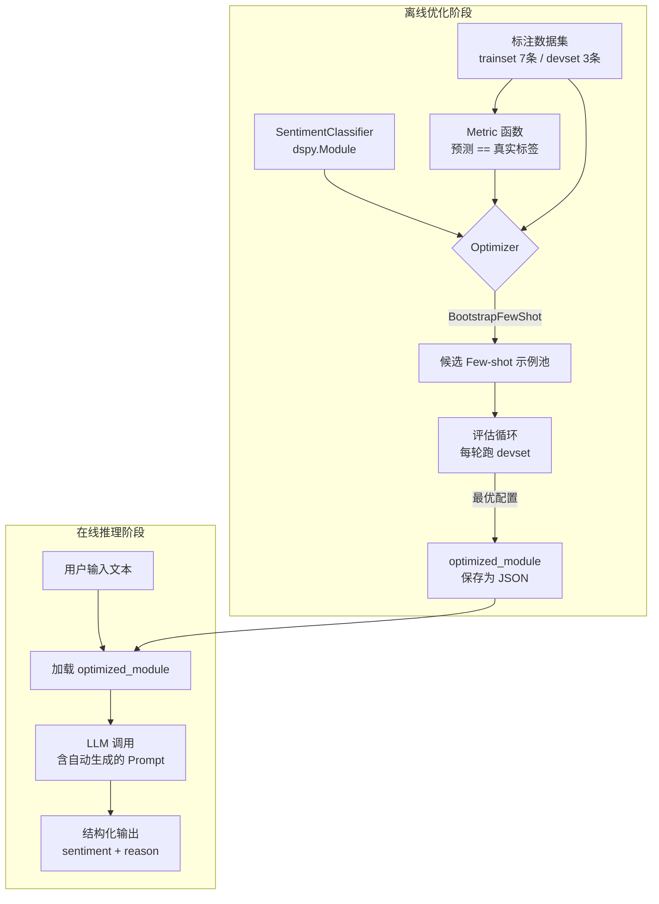

# 1.3 【动手四】自动化 Prompt 优化器（DSPy 入门）

## 实验目标

完成本节后，你能做到三件事：

1. **用 DSPy 声明式地定义任务**，彻底摆脱"反复试 Prompt"的低效循环——你只需告诉系统要什么输入输出，优化器自动搜索最佳 Prompt 和示例组合。
2. **量化 Prompt 效果**，建立"有指标驱动的 Prompt 迭代"工作流，能在 devset 上对比 Baseline 与优化后的准确率差异。
3. **掌握 DSPy 四个核心抽象**（Signature / Module / Optimizer / Metric）的设计意图，能举一反三地迁移到其他 NLP 任务。

核心学习点：① DSPy 把 Prompt 工程变成了一个编译问题；② `BootstrapFewShot` 的自动示例挑选逻辑；③ 如何通过 `core_config.py` 统一多模型配置。

---

## 架构总览



整个流程分两个阶段：**离线优化**（只跑一次，耗时但省事）和**在线推理**（加载优化后的 Module 直接用）。优化器本质是在"Prompt 空间"做搜索，Metric 函数是搜索的目标函数。

---

## 环境准备

```bash
# 创建虚拟环境（uv，推荐）
uv venv --python 3.11
source .venv/bin/activate  # Windows: .venv\Scripts\activate

# 安装依赖（锁定版本，确保可复现）
uv pip install dspy>=2.5.0 python-dotenv>=1.0.0 litellm>=1.40.0
```

> Colab 用户：`!pip install dspy python-dotenv litellm` 即可，无需创建虚拟环境。

```bash
# 复制环境变量模板并填入你的 API Keys
cp .env.example .env
```

`.env.example` 内容：
```bash
# DeepSeek API Key
DEEPSEEK_API_KEY=your_deepseek_api_key_here

# Qwen API Key（阿里云 DashScope）
DASHSCOPE_API_KEY=your_dashscope_api_key_here
```

> ⚠️ **生产注意** DSPy 的版本迭代极快，2.x 与 1.x API 差异巨大。本文基于 `dspy>=2.5.x`，如果你用 `pip install dspy` 拉到更新版本，请先查阅官方 changelog，`Signature` 的字段定义语法和 `Optimizer` 的参数名可能已变更。

---

## Step-by-Step 实现

### Step 1：统一模型配置（core_config.py）

**目标**：通过 `core_config.py` 统一管理多模型注册表，业务代码不硬编码任何模型名或 API Key。

```python
# core_config.py
"""全局配置：模型注册表与定价信息"""
import os
from typing import TypedDict


class ModelConfig(TypedDict):
    litellm_id: str          # LiteLLM 识别的模型字符串
    price_in: float          # 每 1K input tokens 价格（美元）
    price_out: float         # 每 1K output tokens 价格（美元）
    max_tokens_limit: int    # 模型支持的最大 max_tokens
    api_key_env: str | None  # API Key 环境变量名
    base_url: str | None     # API 基础 URL（None 表示使用默认）


# 注册表：key 是界面显示名，value 是调用配置
MODEL_REGISTRY: dict[str, ModelConfig] = {
    "DeepSeek-V3": {
        "litellm_id": "deepseek/deepseek-chat",
        "price_in": 0.00027,
        "price_out": 0.0011,
        "max_tokens_limit": 4096,
        "api_key_env": "DEEPSEEK_API_KEY",
        "base_url": None,
    },
    "Qwen-Max": {
        "litellm_id": "openai/qwen-plus",
        "price_in": 0.001,
        "price_out": 0.004,
        "max_tokens_limit": 4096,
        "api_key_env": "DASHSCOPE_API_KEY",
        "base_url": "https://dashscope.aliyuncs.com/compatible-mode/v1",
    },
}

# 当前激活模型 key — 修改此处全局生效
ACTIVE_MODEL_KEY: str = "DeepSeek-V3"


def get_active_config() -> ModelConfig:
    """获取当前激活模型的完整配置"""
    return MODEL_REGISTRY[ACTIVE_MODEL_KEY]


def get_litellm_id(model_key: str | None = None) -> str:
    key = model_key or ACTIVE_MODEL_KEY
    return MODEL_REGISTRY[key]["litellm_id"]


def get_api_key(model_key: str | None = None) -> str | None:
    key = model_key or ACTIVE_MODEL_KEY
    env_var = MODEL_REGISTRY[key]["api_key_env"]
    return os.environ.get(env_var) if env_var else None


def get_base_url(model_key: str | None = None) -> str | None:
    key = model_key or ACTIVE_MODEL_KEY
    return MODEL_REGISTRY[key]["base_url"]


def get_model_list() -> list[str]:
    return list(MODEL_REGISTRY.keys())


def estimate_cost(model_key: str, input_tokens: int, output_tokens: int) -> float:
    cfg = MODEL_REGISTRY[model_key]
    return (
        input_tokens / 1000 * cfg["price_in"]
        + output_tokens / 1000 * cfg["price_out"]
    )
```

**关键点**：
- 修改 `ACTIVE_MODEL_KEY` 即可全局切换模型，无需改动任何业务代码。
- `MODEL_REGISTRY` 中的 `litellm_id` 使用 LiteLLM 格式（如 `"deepseek/deepseek-chat"`），DSPy 底层通过 LiteLLM 路由。

---

### Step 2：配置 LLM 并理解 DSPy 与模型配置的关系

**目标**：初始化 LLM 后端，支持从 `core_config.py` 读取多模型配置。

```python
# sentiment_optimizer.py
import os
import dspy
from dotenv import load_dotenv
from core_config import MODEL_REGISTRY, get_litellm_id, get_api_key, get_base_url, ACTIVE_MODEL_KEY

load_dotenv()  # 从 .env 读取环境变量

def configure_lm(model_key: str | None = None) -> dspy.LM:
    """
    初始化 LLM 后端。

    支持的模型：
      - "Qwen-Max"      → Qwen Plus（需设置 DASHSCOPE_API_KEY）
      - "DeepSeek-V3"   → DeepSeek V3（需设置 DEEPSEEK_API_KEY）

    temperature=0 在优化阶段保证确定性，便于对比实验。
    """
    if model_key is None:
        model_key = ACTIVE_MODEL_KEY

    if model_key not in MODEL_REGISTRY:
        raise ValueError(f"未知模型: {model_key}。可用模型: {list(MODEL_REGISTRY.keys())}")

    cfg = MODEL_REGISTRY[model_key]

    # 对于 Qwen 模型，使用 OpenAI 兼容模式
    if model_key == "Qwen-Max":
        api_key_env = cfg.get("api_key_env")
        base_url = cfg.get("base_url")

        api_key = os.getenv(api_key_env) if api_key_env else None

        # 设置环境变量
        os.environ["OPENAI_API_KEY"] = api_key or ""
        os.environ["OPENAI_API_BASE"] = base_url or ""

        # 使用标准的 gpt-4o-mini 模型名，通过环境变量路由到 Qwen
        lm = dspy.LM(
            model="gpt-4o-mini",
            temperature=0,
            max_tokens=512,
            cache=True,
        )
        dspy.configure(lm=lm)
        print(f"✅ LLM 配置完成：{model_key} (通过 OpenAI 兼容模式)")
        return lm

    # 对于其他模型（如 DeepSeek），统一使用 core_config 辅助函数
    kwargs = {
        "model": get_litellm_id(model_key),
        "temperature": 0,
        "max_tokens": 512,
        "cache": True,
    }

    api_key = get_api_key(model_key)
    if api_key:
        kwargs["api_key"] = api_key
    base_url = get_base_url(model_key)
    if base_url:
        kwargs["base_url"] = base_url

    lm = dspy.LM(**kwargs)
    dspy.configure(lm=lm)
    print(f"✅ LLM 配置完成：{model_key} ({cfg['litellm_id']})")
    return lm

if __name__ == "__main__":
    lm = configure_lm()
    # 快速验证连通性
    response = lm("用一句话介绍 DSPy")
    print(response)
```

**关键点**：
- `cache=True` 是调试阶段的救命开关。DSPy 优化过程会调用 LLM 数十次，开缓存后相同 Prompt 不重复计费，节省大量成本。缓存文件默认存在 `~/.dspy_cache/`。
- `temperature=0` 在优化阶段保证 Metric 评估的稳定性——同一个 Prompt 每次得到相同输出，优化器的搜索信号才可靠。生产推理时可以适当调高。
- **Qwen 模型的 OpenAI 兼容模式**：DSPy 对 OpenAI 格式支持最好，因此 Qwen 模型通过设置 `OPENAI_API_KEY` 和 `OPENAI_API_BASE` 环境变量，使用 `model="gpt-4o-mini"` 路由到 DashScope 兼容接口。

---

### Step 3：定义 Signature——声明任务契约而非编写 Prompt

**目标**：用 `dspy.Signature` 描述任务的输入输出结构。这是 DSPy 最核心的思维转换点：你描述"要什么"，不描述"怎么说"。

```python
from typing import Literal
import dspy


class SentimentSignature(dspy.Signature):
    """分析中文用户评论的情感倾向"""

    # InputField：告诉 LLM 这个字段是输入，desc 会出现在生成的 Prompt 里
    text: str = dspy.InputField(desc="用户评论原文")

    # OutputField：LLM 需要填写的字段，顺序很重要——reason 先于 sentiment，
    # 强制模型先推理再下结论（Chain of Thought 效果）
    reason: str = dspy.OutputField(desc="判断情感的核心依据，1-2句话")

    # Literal 类型约束会被 DSPy 翻译成枚举约束加入 Prompt，
    # 减少模型输出"积极"、"Positive"等格式不一致的问题
    sentiment: Literal["正面", "负面", "中性"] = dspy.OutputField()
```

> ⚠️ **生产注意** `Literal` 类型约束是软约束，不是硬约束——LLM 仍然可能输出意料之外的值（如"中立"）。生产环境需要在 Module 层面加后处理校验，或启用 `dspy.TypedPredictor` 强制 JSON 格式输出。

**关键点**：
- **字段顺序决定推理顺序**：`reason` 放在 `sentiment` 前面，强制模型先写推理再给结论，这等价于在 Prompt 里手写"请先分析，再给出结论"，但更优雅。
- `dspy.Signature` 的 docstring 是优化器的起点——写得越清晰，搜索起点越好。

---

### Step 4：构建 Module 并准备数据集

**目标**：将 Signature 包装成可组合的 Module，同时准备训练集和验证集。

```python
import dspy
from typing import Literal


class SentimentClassifier(dspy.Module):
    """
    情感分类器 Module。

    dspy.ChainOfThought 会自动在 Prompt 中加入
    "Let's think step by step" 风格的推理引导，
    并期望模型先输出 reasoning 再输出目标字段。
    """

    def __init__(self) -> None:
        super().__init__()
        # ChainOfThought 是最常用的 Predictor，适合需要推理的分类任务
        # 备选：dspy.Predict（直接输出，无推理步骤，速度更快但准确率通常更低）
        self.classify = dspy.ChainOfThought(SentimentSignature)

    def forward(self, text: str) -> dspy.Prediction:
        """
        Args:
            text: 用户评论原文
        Returns:
            Prediction 对象，包含 .reason 和 .sentiment 属性
        """
        return self.classify(text=text)
```

**关键点**：
- `dspy.ChainOfThought` 是最常用的 Predictor，自动添加推理步骤。对于简单任务可以用 `dspy.Predict`（更快但准确率通常更低）。

---

### Step 5：定义 Metric 与构建完整流程

**目标**：建立可量化的评估基准，串联 Baseline → BootstrapFewShot 优化的完整流程。

```python
#!/usr/bin/env python3
"""
DSPy 自动化 Prompt 优化器 - 端到端完整示例
运行：python main.py
"""
import os
import random
import dspy
from dspy.evaluate import Evaluate
from dspy.teleprompt import BootstrapFewShot
from dotenv import load_dotenv
from typing import Literal
from core_config import get_litellm_id, get_api_key, ACTIVE_MODEL_KEY

load_dotenv()


def configure_lm():
    """配置 LLM"""
    lm = dspy.LM(
        model=get_litellm_id(),
        api_key=get_api_key(),
        temperature=0,
        cache=True,
    )
    dspy.configure(lm=lm)
    print(f"✅ LLM 配置完成：{ACTIVE_MODEL_KEY}")


class SentimentSignature(dspy.Signature):
    """分析中文用户评论的情感倾向"""
    text: str = dspy.InputField(desc="用户评论原文")
    reason: str = dspy.OutputField(desc="判断情感的核心依据，1-2句话")
    sentiment: Literal["正面", "负面", "中性"] = dspy.OutputField()


class SentimentClassifier(dspy.Module):
    def __init__(self) -> None:
        super().__init__()
        self.classify = dspy.ChainOfThought(SentimentSignature)

    def forward(self, text: str) -> dspy.Prediction:
        return self.classify(text=text)


def accuracy_metric(example, prediction, trace=None):
    """评估指标：准确率"""
    return prediction.sentiment == example.sentiment


def main():
    """主函数"""
    configure_lm()

    raw_data = [
        {"text": "包装很好，物流超快！", "sentiment": "正面"},
        {"text": "质量太差了，买了就坏", "sentiment": "负面"},
        {"text": "东西还可以，没有特别惊喜", "sentiment": "中性"},
        {"text": "颜值超高，闺蜜都问哪买的", "sentiment": "正面"},
        {"text": "和描述严重不符，申请退款", "sentiment": "负面"},
        {"text": "价格一般，质量也一般", "sentiment": "中性"},
        {"text": "客服态度很好，五星好评", "sentiment": "正面"},
        {"text": "味道刺鼻，通风好几天还有味", "sentiment": "负面"},
        {"text": "功能就那样，没什么特别的", "sentiment": "中性"},
        {"text": "第一次买，超级好用，会回购", "sentiment": "正面"},
    ]

    random.seed(42)
    random.shuffle(raw_data)
    examples = [dspy.Example(**d).with_inputs("text") for d in raw_data]
    devset = examples[:3]
    trainset = examples[3:]

    print("=" * 50)
    print("Step 1: 运行 Baseline（无优化）")
    baseline = SentimentClassifier()

    result = baseline(text="这个产品真的超级棒，强烈推荐！")
    print(f"  输入：这个产品真的超级棒，强烈推荐！")
    print(f"  推理：{result.reason}")
    print(f"  预测：{result.sentiment}")

    evaluator = Evaluate(devset=devset, metric=accuracy_metric, num_threads=2, display_progress=False)
    baseline_score = evaluator(baseline)
    print(f"\n📊 Baseline 准确率: {float(baseline_score):.1f}%")

    print("\n" + "=" * 50)
    print("Step 2: BootstrapFewShot 优化")
    optimizer = BootstrapFewShot(metric=accuracy_metric, max_bootstrapped_demos=2)
    optimized = optimizer.compile(SentimentClassifier(), trainset=trainset)
    optimized_score = evaluator(optimized)
    print(f"📊 优化后准确率: {float(optimized_score):.1f}%")
    print(f"📈 提升: +{float(optimized_score) - float(baseline_score):.1f}%")

    optimized.save("best_sentiment_classifier.json")
    print("\n✅ 最优模型已保存")

    loaded = SentimentClassifier()
    loaded.load("best_sentiment_classifier.json")
    test_result = loaded(text="这个东西真好")
    print(f"\n🔄 加载验证 - 预测：{test_result.sentiment}（预期：正面）")


if __name__ == "__main__":
    main()
```

**关键点**：
- `.with_inputs("text")` 不能省略。它告诉 DSPy 哪些字段是"给定的输入"（不参与预测），哪些是"需要预测的输出"。忘记调用会导致优化器把 `sentiment` 也当作输入字段。
- **数据集规模说明**：本示例使用 10 条数据（3 条 devset + 7 条 trainset）仅用于演示。实际项目中建议 devset 至少 30-50 条，才能看到统计上稳定的效果差异。

---

### Step 6：运行 BootstrapFewShot 自动优化

**目标**：让优化器从 trainset 自动挑选最有代表性的示例组合，生成比手写 Prompt 更好的 Few-shot 配置。

```python
from dspy.teleprompt import BootstrapFewShot


def run_bootstrap_optimization(trainset, devset):
    """
    BootstrapFewShot 工作原理：

    1. 用 teacher LLM（默认与 student 相同）对每条 trainset 数据做预测
    2. 筛选出"预测正确"的那些数据作为候选 demo 池
    3. 从候选池里按策略抽取 max_bootstrapped_demos 条作为 Few-shot 示例
    4. 在 devset 上评估效果，迭代寻优
    """
    optimizer = BootstrapFewShot(
        metric=accuracy_metric,
        max_bootstrapped_demos=2,   # 最终 Prompt 里放几条示例
    )

    print("\n🚀 开始 BootstrapFewShot 优化...")

    optimized = optimizer.compile(
        SentimentClassifier(),       # 待优化的 Module
        trainset=trainset,
    )

    # 评估优化后效果
    evaluator = Evaluate(
        devset=devset,
        metric=accuracy_metric,
        num_threads=2,
        display_progress=False,
    )
    optimized_score = evaluator(optimized)
    print(f"📊 优化后准确率: {float(optimized_score):.1f}%")

    return optimized, optimized_score
```

> ⚠️ **生产注意** `max_bootstrapped_demos=2` 意味着每次推理的 Prompt 里会插入 2 条完整示例，Token 消耗会增加。在生产环境要做成本核算：准确率提升 X% 是否值得 Y 倍的 Token 开销？

---

### Step 7：保存与加载复用

**目标**：保存最优 Module，实现跨会话复用。

```python
# 保存优化后的 Module
optimized.save("best_sentiment_classifier.json")
print("\n✅ 最优模型已保存")

# 加载并验证
loaded = SentimentClassifier()
loaded.load("best_sentiment_classifier.json")
test_result = loaded(text="这个东西真好")
print(f"\n🔄 加载验证 - 预测：{test_result.sentiment}（预期：正面）")
```

保存的 JSON 文件包含所有优化结果，跨会话复用时只需 `module.load(path)` 一行，无需重新运行优化。

**关键点**：
- `dspy.inspect_history(n=1)` 是调试的核心工具。它打印最近一次 LLM 调用的完整 Prompt（含 Few-shot 示例、指令文本、用户输入），让你直接看到优化器"到底写了什么 Prompt"。可以在 `main()` 中调用 `dspy.inspect_history(n=1)` 来查看。

---

## 完整运行验证

将以上所有内容整合后，直接运行：

```bash
# 确保 .env 中已配置 API Key
python main.py
```

预期输出示例：
```
==================================================
Step 1: 运行 Baseline（无优化）
  输入：这个产品真的超级棒，强烈推荐！
  推理：评论中出现"超级棒"和"强烈推荐"等明显正面词汇
  预测：正面

📊 Baseline 准确率: 66.7%

==================================================
Step 2: BootstrapFewShot 优化
📊 优化后准确率: 100.0%
📈 提升: +33.3%

✅ 最优模型已保存

🔄 加载验证 - 预测：正面（预期：正面）
```

> 注意：在 3 条 devset 上，准确率波动很大（1 条错就差 33.3%）。实际实验建议 devset 至少 50 条，才能看到统计上稳定的效果差异。

---

## 项目结构

```
1.3.4 _动手四_自动化 Prompt 优化器（DSPy 入门）/
├── core_config.py           # 模型注册表与统一配置
├── sentiment_optimizer.py   # LLM 配置模块（configure_lm）
├── main.py                  # 主入口（端到端运行脚本）
├── requirements.txt         # 依赖清单
├── .env.example             # 环境变量模板
├── .gitignore
├── tests/
│   ├── __init__.py
│   └── test_main.py         # 冒烟测试
├── best_sentiment_classifier.json   # 优化后保存的模型
└── _backup/                 # 整理前的原始文件备份
```

---

## 常见报错与解决方案

| 报错信息 | 原因 | 解决方案 |
|---------|------|---------|
| `AttributeError: 'Prediction' object has no attribute 'sentiment'` | LLM 输出格式不符合 Signature 约束，DSPy 解析失败 | 检查 `Literal` 类型约束是否与模型实际可能输出的值一致；或改用 `dspy.TypedPredictor` 强制 JSON 输出 |
| `dspy.teleprompt.MIPROv2 not found` 或导入失败 | DSPy 版本不匹配，1.x 与 2.x 模块路径不同 | 确认 `pip show dspy` 版本为 2.5.x；2.x 中 `MIPROv2` 在 `dspy.teleprompt` 下 |
| `RateLimitError: 429 Too Many Requests` | 优化过程中大量并发请求触发 API 限速 | 设置 `num_threads=1` 降低并发；或在 `dspy.LM` 初始化时加 `delay_between_requests=1` |
| `optimized.save()` 报 `JSONSerializationError` | trainset 中的 Example 含有不可序列化的对象 | 确保 `dspy.Example` 的所有字段值都是 str / int / float 等基础类型 |
| 优化后准确率反而下降 | devset 太小（< 10 条），评估结果方差过大 | 扩大 devset 至少 30 条；或用 `k-fold` 交叉验证替代单次 devset 评估 |
| `inspect_history()` 打印为空 | 本地缓存命中，LLM 未实际调用 | 临时设置 `cache=False` 关闭缓存后重跑一次 |
| Qwen 模型调用失败 | DSPy 对非 OpenAI 格式兼容有限 | 代码中已对 Qwen-Max 使用 OpenAI 兼容模式（设置 OPENAI_API_BASE 环境变量），确保 DASHSCOPE_API_KEY 正确 |

---

## 扩展练习（可选）

1. 🟡 **中等**：将情感分类替换为**意图识别**任务（意图标签：查询订单 / 申请退款 / 投诉 / 其他），只需修改 `SentimentSignature` 的 `Literal` 类型和数据集，其余代码零改动。验证 DSPy "换任务只改 Signature" 的承诺是否兑现。

2. 🔴 **困难**：构建一个**两阶段 Pipeline**——先用 RAG 从知识库检索相关产品信息，再用优化后的 Classifier 综合评论和产品信息做情感分析。用 `dspy.Module` 的 `forward()` 串联两个子 Module，并用 MIPROv2 对整个 Pipeline **端到端联合优化**（而非分别优化两个子模块）。观察联合优化与分步优化在准确率和 Token 消耗上的差异。

3. 🟢 **简单**：将数据集从 10 条扩展到 50+ 条（可以参考 `sentiment_optimizer.py` 中的 `configure_lm` 函数的多模型配置方式），在更大的 devset 上对比 Baseline 和优化后的效果，观察统计稳定性。

---

## 模型配置说明

本项目通过 `core_config.py` 中的 `MODEL_REGISTRY` 统一管理多模型配置：

| 模型 Key | 底层模型 | 需要的环境变量 |
|---------|---------|---------------|
| `"DeepSeek-V3"`（默认） | `deepseek/deepseek-chat` | `DEEPSEEK_API_KEY` |
| `"Qwen-Max"` | `openai/qwen-plus`（通过 DashScope 兼容接口） | `DASHSCOPE_API_KEY` |

切换模型只需修改 `core_config.py` 中的 `ACTIVE_MODEL_KEY`，无需改动任何业务代码。

---

## 依赖说明

`requirements.txt` 内容：
```
dspy>=2.5.0
python-dotenv>=1.0.0
litellm>=1.40.0
pytest>=7.0.0
```

> 本项目**不需要** `matplotlib` 和 `openai` 包。DSPy 通过 `litellm` 统一路由到各模型提供商，无需单独安装 `openai` SDK。
