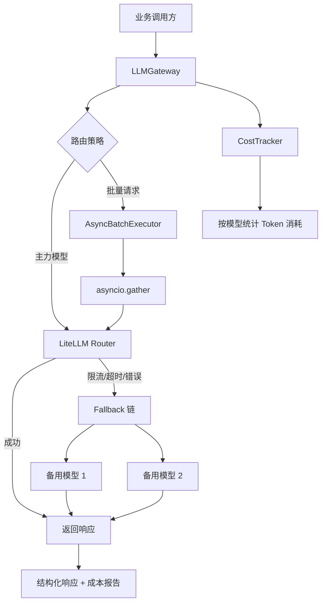

# 1.4 【动手】统一封装多模型调用层

## 实验目标

本节结束后，你将拥有一个可直接用于生产的多模型统一调用层：支持 OpenAI、Claude、Gemini、DeepSeek 等主流 API 的统一接口调用；当主力模型限流或宕机时自动 Fallback 到备用模型；支持异步并发批量推理，吞吐量相比串行调用提升 5–10 倍。

核心学习点：
1. **LiteLLM 的核心价值**：用一套接口抹平各家 API 差异，而不是手写 N 个适配器
2. **Fallback 路由设计**：如何在不改业务代码的情况下实现多模型容灾
3. **异步并发模式**：`asyncio` + `httpx` 在 LLM 调用场景下的正确用法与陷阱

## 主流大模型 API 对比报告

> 数据截至 2025 年末 / 2026 年初，价格以美元计，部分通义千问价格为人民币折算约值。

---

### 一、价格对比（每百万 Token）

| 提供商 | 旗舰模型 | 输入价格 | 输出价格 | 缓存折扣 | 批处理折扣 | 上下文窗口 | 免费层 |
|--------|----------|----------|----------|----------|------------|------------|--------|
| **OpenAI** | GPT-4o / GPT-4.1 | $2.50（mini: $0.15） | $10.00（mini: $0.60） | 75% off | 50% off | 128K – 1M | 有限 |
| **Claude** | Sonnet 4.6 / Opus 4.6 / Haiku 4.5 | $3.00（Haiku: $1.00） | $15.00（Haiku: $5.00） | 90% off | 50% off | 1M | 无 |
| **Gemini** | 2.5 Pro / 2.5 Flash / Flash-Lite | $1.25（Flash: $0.15） | $7.50（Flash: $0.60） | 部分支持 | 支持 | 1M – 2M | 较慷慨 |
| **DeepSeek** | V3.2 / R1（推理） | $0.28（R1: $0.55） | $0.42（R1: $2.19） | 90% off（$0.028） | — | 128K | 500万 Token |
| **通义千问** | Qwen3-Max / Plus / Flash / Long | ~$0.35（Long: ~$0.07） | ~$1.40（Plus: ~$0.44） | 支持 | 50% off | 1M – 10M | 7000万 Token |

#### 旗舰输入价格排行（从高到低）

```
Claude Opus 4.6   ████████████████████  $5.00
OpenAI GPT-4o     ██████████            $2.50
Gemini 2.5 Pro    █████                 $1.25
通义千问 Max       █▍                    ~$0.35
DeepSeek V3.2     █▏                    $0.28
```

> **价格差距约 18×**：旗舰 Claude Opus 与 DeepSeek V3.2 之间。DeepSeek 缓存命中价格 $0.028/M，几乎可忽略不计。

---

### 二、速率限制对比

| 提供商 | 计量方式 | 免费层限制 | 入门付费层 | 高级/企业层 | 扩容方式 |
|--------|----------|------------|------------|-------------|----------|
| **OpenAI** | RPM + TPM | 5 RPM | Tier 1: 500 RPM / 200K TPM | Tier 5: 4,000+ RPM | Scale Tier 可按天购买 |
| **Claude** | RPM + ITPM + OTPM（分开计量） | 5 RPM | Tier 1: 50 RPM / 40K ITPM | Tier 4: 4,000 RPM / 400K+ ITPM | Priority Tier 可预购容量 |
| **Gemini** | RPM + TPM + RPD（按 Cloud 项目计） | Pro: 5 RPM / Flash: 10 / Lite: 15 | Tier 1: Pro 150 RPM / Flash 300 RPM | Tier 2: 1,000+ RPM（累计消费 $250 解锁） | 可申请提升 |
| **DeepSeek** | 无严格 RPM 限制 | 500万 Token 免费额度 | 直接按量付费 | 弹性扩展（服务器在中国） | 联系商务 |
| **通义千问** | RPM + TPM（按工作空间计） | 7000万 Token（新用户/新加坡限定） | 按量付费，默认中低 RPM | 企业版定制限额 | 联系阿里云 |

**关键差异说明：**

- **Claude**：缓存命中 Token 不计入 ITPM 限额，实际可用吞吐量远高于表面数字，是大上下文应用的优势。
- **Gemini**：速率限制按 Cloud Project 而非 API Key 计，多个 Key 共享同一配额，需注意架构设计。
- **DeepSeek**：无明确 RPM 上限，但高峰期（中国白天工作时段）服务器压力大，延迟波动剧烈。
- **OpenAI Scale Tier**：可按天购买专属吞吐量，例如 GPT-4.1 每天 $110 对应 3 万输入 TPM，适合高并发生产。

---

### 三、能力对比

| 能力维度 | OpenAI | Claude | Gemini | DeepSeek | 通义千问 |
|----------|--------|--------|--------|----------|----------|
| **综合推理** | 强 | 强 | 强 | 强（R1 尤其） | 中高 |
| **代码生成** | 强 | ⭐ 顶级（SWE-bench 80.9%） | 强 | 强（Codeforces 2121） | 中高（Coder 系列专优） |
| **数学推理** | 强 | 强 | 强 | ⭐ 顶级（AIME 89.3%） | 中高 |
| **长文档处理** | 中（128K 为主） | 优（1M ctx） | ⭐ 最优（1–2M） | 有限（128K） | ⭐ 最优（Long 10M） |
| **指令遵循** | 强 | ⭐ 顶级 | 强 | 中高 | 中高 |
| **中文理解** | 良好 | 良好 | 良好 | 优秀 | ⭐ 顶级（母语优化） |
| **Tool Use / 函数调用** | ✅ 完善 | ✅ 完善 + MCP | ✅ 完善 | ⚠️ 支持（有限） | ✅ 完善 |
| **安全性 / 合规** | 高 | ⭐ 最高（安全优先设计） | 高 | 中等（数据过中国服务器） | 中等（阿里云标准） |
| **知识截止日期** | 2024 年 10 月 | 2025 年 8 月 | 2024 年底 – 2025 | 2025 年初 | 2024 – 2025 |
| **开源可自部署** | ❌ 不支持 | ❌ 不支持 | ⚠️ 部分（Gemma） | ✅ MIT 开源 | ✅ 开源权重可用 |

---

### 四、多模态支持对比

| 模态 / 能力 | OpenAI | Claude | Gemini | DeepSeek | 通义千问 |
|-------------|--------|--------|--------|----------|----------|
| **文本输入** | ✅ | ✅ | ✅ | ✅ | ✅ |
| **图像理解（输入）** | ✅ GPT-4o 系列 | ✅ 所有版本 | ✅ 所有版本 | ❌ 官方 API 无 | ✅ Qwen-VL 系列 |
| **视频理解** | ⚠️ 有限 | ❌ 暂不支持 | ✅ 原生支持 | ❌ 不支持 | ✅ Qwen-VL |
| **音频输入** | ✅ Whisper + GPT-4o | ❌ 不支持 | ✅ 原生支持 | ❌ 不支持 | ✅ Qwen-Audio |
| **图像生成（输出）** | ✅ DALL·E / GPT-Image | ❌ 不支持 | ✅ Imagen 3 | ❌ 不支持 | ✅ Wanx 系列 |
| **PDF / 文档解析** | ✅ Assistant API | ✅ 原生支持 | ✅ 支持 | ❌ 不支持 | ✅ 支持 |
| **实时语音对话** | ✅ Realtime API | ❌ 不支持 | ✅ Live API | ❌ 不支持 | ⚠️ 有限 |
| **嵌入向量（Embedding）** | ✅ text-embedding 系列 | ❌ 不支持 | ✅ text-embedding | ❌ 不支持 | ✅ text-embedding-v3 |
| **多模态综合评分** | ⭐⭐⭐⭐½ | ⭐⭐⭐ | ⭐⭐⭐⭐⭐ | ⭐ | ⭐⭐⭐⭐ |

> **Gemini** 是多模态覆盖最全的平台，原生支持文本、图像、视频、音频同步处理。**DeepSeek** 官方 API 仅限纯文本，视觉能力需自行部署开源权重。

---

### 五、延迟 & 吞吐对比

| 提供商 | 首 Token 延迟（TTFT） | 输出速率（约） | 稳定性 / SLA | 中国大陆访问 | 全球节点 |
|--------|----------------------|----------------|--------------|--------------|----------|
| **OpenAI** | 旗舰 1–3s / mini 0.5–1s | 60–100 t/s（Scale Tier 更高） | 99.9% SLA（Scale Tier 保障） | ❌ 需 VPN | 美国为主，Azure 全球 |
| **Claude** | 旗舰 2–5s / Haiku <1s | 50–80 t/s（快速模式更高） | 99.5% SLA（Priority Tier） | ❌ 需 VPN | 美国 / 欧洲 |
| **Gemini** | Pro 1–3s / Flash <0.5s | 100–200 t/s（Flash 系列极快） | Google 级别 SLA | ❌ 需 VPN | 全球多区域 |
| **DeepSeek** | 低峰 0.5–2s / 高峰 5–30s+ | 30–80 t/s（波动较大） | ⚠️ 无明确 SLA | ✅ 原生支持 | 中国 / 部分海外 |
| **通义千问** | 国内 <1s / 海外 1–3s | 50–120 t/s（Flash 较快） | 阿里云 SLA（企业可定制） | ✅ 最佳（本土优化） | 中国 / 新加坡 / 美国 |

> **TTFT** = Time to First Token（首 Token 延迟）。DeepSeek 高峰期延迟极不稳定，生产环境建议通过 Together AI、Fireworks 等第三方平台接入。

---

### 六、选型建议

| 场景 | 推荐选择 | 理由 |
|------|----------|------|
| **追求最低成本** | DeepSeek V3.2 | 旗舰中最低价，可自部署 |
| **复杂推理 / 高质量代码** | Claude Sonnet/Opus | SWE-bench 领先，指令遵循最优 |
| **多模态 / 视频音频处理** | Gemini 2.5 Pro/Flash | 唯一完整覆盖文图音视频 |
| **超长文档（>200K Token）** | Gemini / Claude / 通义千问 Long | 1M–10M 上下文 |
| **数学 / 科学推理** | DeepSeek R1 | AIME 89.3%，成本远低于西方竞品 |
| **中国大陆低延迟产品** | 通义千问 | 本土优化，合规性最好 |
| **快速原型 / 零成本测试** | Gemini Flash-Lite | 免费层最慷慨，无需信用卡 |
| **企业合规 / 数据安全** | Claude / OpenAI（Azure） | 安全设计领先，有 SOC2/HIPAA |

---

*数据来源：各厂商官方文档及第三方跟踪服务，价格随时可能调整，以官方最新公告为准。*


## 架构总览



整个系统分三层：**Gateway 层**对外暴露统一接口；**Router 层**由 LiteLLM 负责协议翻译和 Fallback；**Executor 层**处理并发批量场景。

## 环境准备

```bash
# 创建虚拟环境（uv，推荐）
uv venv --python 3.11
source .venv/bin/activate  # Windows: .venv\Scripts\activate

# 安装依赖
uv pip install -r requirements.txt
```

`requirements.txt` 内容：
```
litellm>=1.40.0
python-dotenv>=1.0.0
pydantic>=2.0.0
pytest>=7.0.0
pytest-asyncio>=0.23.0
```

> Colab 用户：`!pip install litellm python-dotenv pydantic pytest pytest-asyncio` 即可，无需创建虚拟环境

项目采用扁平结构（非 Python 包模式），文件清单：

```
1.4 _动手_统一封装多模型调用层/
├── core_config.py                    # 全局配置：模型注册表 + Router 别名映射
├── llm_gateway_config_models.py       # LiteLLM Router 模型列表 + Fallback 策略
├── llm_gateway_cost_tracker.py        # Token 消耗与成本追踪器
├── llm_gateway_gateway.py             # LLMGateway 核心网关类
├── llm_gateway_benchmark.py           # 串行 vs 并发性能对比
├── llm_gateway_tests_test_gateway.py  # 单元测试（Mock）
├── tests/test_main.py                 # 冒烟测试
├── main.py                            # 端到端冒烟测试入口
├── requirement.txt                    # 原始依赖清单
├── requirements.txt                   # 标准化依赖清单
└── .env.example                       # 环境变量模板
```

`.env.example` 文件（复制为 `.env` 后填入实际 key）：

```bash
# .env
# DeepSeek API Key
DEEPSEEK_API_KEY=your_deepseek_api_key_here

# Qwen API Key（阿里云 DashScope）
DASHSCOPE_API_KEY=your_dashscope_api_key_here
```

## Step-by-Step 实现

### Step 1：理解 LiteLLM 的核心抽象

**目标**：搞清楚 LiteLLM 解决了什么问题，以及它的 Router 和裸调用有什么区别——这决定后续所有设计决策。

LiteLLM 做了两件事：**协议翻译**（把各家 API 的请求/响应格式统一成 OpenAI 格式）和**路由管理**（Router 对象，支持负载均衡、Fallback、重试）。

直接调用 `litellm.completion` 适合快速验证，但生产环境要用 `Router`，原因是 Router 维护了每个模型的健康状态，避免每次请求都从头计算 Fallback。

**首先创建 `core_config.py`——全局模型注册表**：

```python
# core_config.py
"""全局配置：模型注册表与定价信息"""
import os
from typing import TypedDict


class ModelConfig(TypedDict):
    litellm_id: str          # LiteLLM 识别的模型字符串
    price_in: float          # 每 1K input tokens 价格（美元）
    price_out: float         # 每 1K output tokens 价格（美元）
    max_tokens_limit: int    # 模型支持的最大 max_tokens
    api_key_env: str | None  # API Key 环境变量名
    base_url: str | None     # API 基础 URL（None 表示使用默认）


# 注册表：key 是界面显示名，value 是调用配置
MODEL_REGISTRY: dict[str, ModelConfig] = {
    "GPT-4o": {
        "litellm_id": "openai/gpt-4o",
        "price_in": 0.0025,
        "price_out": 0.01,
        "max_tokens_limit": 4096,
        "api_key_env": "OPENAI_API_KEY",
        "base_url": None,
    },
    "Claude-Sonnet": {
        "litellm_id": "anthropic/claude-sonnet-4-20250514",
        "price_in": 0.003,
        "price_out": 0.015,
        "max_tokens_limit": 4096,
        "api_key_env": "ANTHROPIC_API_KEY",
        "base_url": None,
    },
    "DeepSeek-V3": {
        "litellm_id": "deepseek/deepseek-chat",
        "price_in": 0.00027,
        "price_out": 0.0011,
        "max_tokens_limit": 4096,
        "api_key_env": "DEEPSEEK_API_KEY",
        "base_url": None,
    },
    "Qwen-Max": {
        "litellm_id": "qwen/qwen-plus",
        "price_in": 0.001,
        "price_out": 0.004,
        "max_tokens_limit": 4096,
        "api_key_env": "DASHSCOPE_API_KEY",
        "base_url": "https://dashscope.aliyuncs.com/compatible-mode/v1",
    },
}

# 当前激活模型 key — 修改此处全局生效，必须是 MODEL_REGISTRY 中的 key
ACTIVE_MODEL_KEY: str = "DeepSeek-V3"


def get_active_config() -> ModelConfig:
    """获取当前激活模型的完整配置"""
    return MODEL_REGISTRY[ACTIVE_MODEL_KEY]


def get_litellm_id(model_key: str | None = None) -> str:
    """获取指定模型（默认激活模型）的 LiteLLM ID"""
    key = model_key or ACTIVE_MODEL_KEY
    return MODEL_REGISTRY[key]["litellm_id"]


def get_api_key(model_key: str | None = None) -> str | None:
    """从环境变量读取指定模型的 API Key"""
    key = model_key or ACTIVE_MODEL_KEY
    env_var = MODEL_REGISTRY[key]["api_key_env"]
    return os.environ.get(env_var) if env_var else None


def get_base_url(model_key: str | None = None) -> str | None:
    """获取指定模型的 base_url（None 表示使用 SDK 默认值）"""
    key = model_key or ACTIVE_MODEL_KEY
    return MODEL_REGISTRY[key]["base_url"]


def get_model_list() -> list[str]:
    """获取所有已注册模型的显示名列表"""
    return list(MODEL_REGISTRY.keys())


def estimate_cost(model_key: str, input_tokens: int, output_tokens: int) -> float:
    """根据 Token 数估算调用费用（美元）"""
    cfg = MODEL_REGISTRY[model_key]
    return (
        input_tokens / 1000 * cfg["price_in"]
        + output_tokens / 1000 * cfg["price_out"]
    )


# Router model_name 别名映射（对应 llm_gateway_config_models.py 中的 model_name）
ROUTER_MODEL_ALIAS: dict[str, str] = {
    "GPT-4o": "gpt-4o",
    "Claude-Sonnet": "claude-sonnet",
    "DeepSeek-V3": "deepseek-chat",
    "Qwen-Max": "qwen-max",
}


def get_router_model_name(model_key: str | None = None) -> str:
    """获取激活模型对应的 Router model_name 别名"""
    key = model_key or ACTIVE_MODEL_KEY
    return ROUTER_MODEL_ALIAS.get(key, key)
```

**关键点**：
- `MODEL_REGISTRY` 统一管理所有模型的 LiteLLM ID、定价、API Key 环境变量名
- `ACTIVE_MODEL_KEY` 是全局切换开关，修改一处即可更换整个项目的默认模型
- `ROUTER_MODEL_ALIAS` 将注册表的显示名（如 `"DeepSeek-V3"`）映射为 Router 的 `model_name`（如 `"deepseek-chat"`），实现两层解耦
- `get_router_model_name()` 是 Gateway 层获取模型别名的桥梁函数

**然后创建 `llm_gateway_config_models.py`——Router 模型列表与 Fallback 策略**：

```python
# llm_gateway_config_models.py
"""
模型配置：定义模型列表与 Fallback 策略。
将配置与代码解耦，方便在不改业务代码的情况下切换模型。
"""
from typing import Any

# LiteLLM Router 接受的模型配置格式
# model_name 是业务层使用的"别名"，litellm_params.model 才是实际调用的模型标识
MODEL_LIST: list[dict[str, Any]] = [
    {
        "model_name": "gpt-4o",           # 业务层调用名
        "litellm_params": {
            "model": "openai/gpt-4o",      # LiteLLM 标识：provider/model
            "api_key": "os.environ/OPENAI_API_KEY",   # 从环境变量读取
        },
        "model_info": {"id": "openai-gpt4o-primary"},
    },
    {
        "model_name": "claude-sonnet",
        "litellm_params": {
            "model": "anthropic/claude-sonnet-4-20250514",
            "api_key": "os.environ/ANTHROPIC_API_KEY",
        },
        "model_info": {"id": "anthropic-sonnet-primary"},
    },
    {
        "model_name": "deepseek-chat",
        "litellm_params": {
            "model": "deepseek/deepseek-chat",
            "api_key": "os.environ/DEEPSEEK_API_KEY",
        },
        "model_info": {"id": "deepseek-primary"},
    },
]

# Fallback 策略：gpt-4o 失败时，依次尝试 claude-sonnet、deepseek-chat
# 这里用的是"别名"，而非具体模型 ID
FALLBACKS: list[dict[str, list[str]]] = [
    {"gpt-4o": ["claude-sonnet", "deepseek-chat"]},
    {"claude-sonnet": ["gpt-4o", "deepseek-chat"]},
]
```

**关键点**：
- `"api_key": "os.environ/OPENAI_API_KEY"` 是 LiteLLM 的特殊语法，Router 初始化时会从环境变量读取，**不会把 key 硬编码到配置对象里**，安全审计友好
- `model_name` 是业务层的"虚拟模型名"，同一个 `model_name` 可以挂多个 `litellm_params` 实现负载均衡

---

### Step 2：构建 CostTracker——按维度统计 Token 消耗

**目标**：生产环境必须知道每个模型、每个 feature 花了多少钱，否则成本失控后根本不知道从哪里优化。

```python
# llm_gateway_cost_tracker.py
"""
Token 消耗与成本追踪器。
线程安全（使用 dataclass + 字典，单线程 asyncio 环境下无需加锁）。
"""
from dataclasses import dataclass, field
from collections import defaultdict
import litellm


@dataclass
class ModelUsage:
    """单个模型的累计用量"""
    prompt_tokens: int = 0
    completion_tokens: int = 0
    total_cost_usd: float = 0.0

    @property
    def total_tokens(self) -> int:
        return self.prompt_tokens + self.completion_tokens


class CostTracker:
    """
    按 (feature, model) 两个维度追踪 LLM 调用成本。

    使用方式：
        tracker = CostTracker()
        tracker.record(response, feature="rag_query")
        print(tracker.report())
    """

    def __init__(self) -> None:
        # defaultdict 避免每次判断 key 是否存在
        self._usage: dict[tuple[str, str], ModelUsage] = defaultdict(ModelUsage)

    def record(self, response: litellm.ModelResponse, feature: str = "default") -> None:
        """
        从 LiteLLM 响应对象中提取用量并累计。

        Args:
            response: LiteLLM 返回的 ModelResponse 对象
            feature:  业务功能标识，如 "rag_query"、"summarize"
        """
        usage = response.usage
        model = response.model or "unknown"
        key = (feature, model)

        self._usage[key].prompt_tokens += usage.prompt_tokens
        self._usage[key].completion_tokens += usage.completion_tokens

        # litellm.completion_cost 根据模型名查表计算费用
        # 支持 500+ 模型的定价，每周从官方更新
        try:
            cost = litellm.completion_cost(completion_response=response)
            self._usage[key].total_cost_usd += cost
        except Exception:
            # 部分自托管模型无定价数据，静默跳过
            pass

    def report(self) -> dict:
        """返回结构化消费报告，便于序列化为 JSON 打日志"""
        result = {}
        for (feature, model), usage in self._usage.items():
            result.setdefault(feature, {})[model] = {
                "prompt_tokens": usage.prompt_tokens,
                "completion_tokens": usage.completion_tokens,
                "total_tokens": usage.total_tokens,
                "cost_usd": round(usage.total_cost_usd, 6),
            }
        return result

    def total_cost(self) -> float:
        """返回所有维度的总成本（美元）"""
        return sum(u.total_cost_usd for u in self._usage.values())

    def reset(self) -> None:
        """重置统计（通常在测试或定时汇报后调用）"""
        self._usage.clear()
```

**关键点**：
- `litellm.completion_cost()` 内置了主流模型的 Token 定价表，不需要手动维护价格，但自建模型（如 Ollama）无法计算，需 `try/except` 保护
- ⚠️ 多进程场景下 `defaultdict` 不是进程安全的，需要换成 Redis 计数器

---

### Step 3：核心 Gateway 类——同步调用 + Fallback 路由

**目标**：把 LiteLLM Router 包一层，对业务代码暴露干净的接口，同时集成 CostTracker。

```python
# llm_gateway_gateway.py
"""
LLMGateway：统一多模型调用入口。
对业务层屏蔽底层模型切换、重试、Fallback 细节。
"""
import os
import asyncio
import sys
from typing import Any
from dotenv import load_dotenv
import litellm
from litellm import Router
from pydantic import BaseModel

# 将当前目录加入 Python 路径
sys.path.insert(0, os.path.dirname(os.path.abspath(__file__)))

from core_config import ACTIVE_MODEL_KEY, get_litellm_id, get_api_key, get_base_url, get_router_model_name
from llm_gateway_cost_tracker import CostTracker
from llm_gateway_config_models import MODEL_LIST, FALLBACKS

load_dotenv()

# 关闭 LiteLLM 的 verbose 日志，生产环境用自己的日志体系
litellm.set_verbose = False


class LLMResponse(BaseModel):
    """
    统一响应结构。
    不直接返回 litellm.ModelResponse，原因：
    1. 避免业务代码依赖 litellm 内部类型，便于未来换底层库
    2. Pydantic 模型可直接序列化为 JSON，便于 API 返回
    """
    content: str
    model: str               # 实际使用的模型（可能是 Fallback 后的）
    prompt_tokens: int
    completion_tokens: int
    cost_usd: float


class LLMGateway:
    """
    多模型统一调用网关。

    示例：
        gateway = LLMGateway()
        resp = await gateway.chat("你好", feature="demo")  # 使用 core_config 中的激活模型
        print(resp.content, resp.cost_usd)
    """

    def __init__(
        self,
        model_list: list[dict] | None = None,
        fallbacks: list[dict] | None = None,
        num_retries: int = 2,
        timeout: float = 30.0,
    ) -> None:
        """
        Args:
            model_list:   模型配置列表，默认使用 llm_gateway_config_models.py 中的配置
            fallbacks:    Fallback 策略，默认使用预设策略
            num_retries:  同一模型最大重试次数（不含 Fallback 切换）
            timeout:      单次请求超时秒数
        """
        self.router = Router(
            model_list=model_list or MODEL_LIST,
            fallbacks=fallbacks or FALLBACKS,
            num_retries=num_retries,
            timeout=timeout,
            # retry_after：遇到限流（429）时等待的秒数
            retry_after=5,
            # allowed_fails：某模型连续失败多少次后标记为不健康
            allowed_fails=3,
            # cooldown_time：不健康模型的冷却时间（秒），冷却后重新尝试
            cooldown_time=60,
        )
        self.tracker = CostTracker()

    async def chat(
        self,
        prompt: str,
        model: str | None = None,
        system: str | None = None,
        temperature: float = 0.7,
        max_tokens: int = 1024,
        feature: str = "default",
        **kwargs: Any,
    ) -> LLMResponse:
        """
        单轮对话调用（异步）。

        Args:
            prompt:      用户消息
            model:       模型别名，对应 MODEL_LIST 中的 model_name；
                         None 时使用 core_config 中激活的模型
            system:      系统提示词，None 则不传
            temperature: 采样温度
            max_tokens:  最大生成 Token 数
            feature:     业务功能标识，用于成本分组统计
            **kwargs:    透传给 litellm 的其他参数（如 response_format）

        Returns:
            LLMResponse 对象
        """
        messages: list[dict[str, str]] = []
        if system:
            messages.append({"role": "system", "content": system})
        messages.append({"role": "user", "content": prompt})

        # 若未指定模型，使用 core_config 中配置的激活模型
        if model is None:
            model = get_router_model_name()

        # Router.acompletion 是异步版本，内部自动处理 Fallback
        raw: litellm.ModelResponse = await self.router.acompletion(
            model=model,
            messages=messages,
            temperature=temperature,
            max_tokens=max_tokens,
            **kwargs,
        )

        # 记录本次消耗
        self.tracker.record(raw, feature=feature)

        # 计算成本（处理模型未映射的情况）
        try:
            cost_usd = round(litellm.completion_cost(completion_response=raw), 6)
        except Exception:
            cost_usd = 0.0

        return LLMResponse(
            content=raw.choices[0].message.content or "",
            model=raw.model or model,
            prompt_tokens=raw.usage.prompt_tokens,
            completion_tokens=raw.usage.completion_tokens,
            cost_usd=cost_usd,
        )

    async def chat_batch(
        self,
        prompts: list[str],
        model: str | None = None,
        system: str | None = None,
        max_concurrent: int = 10,
        feature: str = "default",
        **kwargs: Any,
    ) -> list[LLMResponse]:
        """
        批量并发调用：自动控制并发数，避免触发限流。

        Args:
            prompts:        待处理的 prompt 列表
            max_concurrent: 最大并发数。建议：
                            - OpenAI Tier 1：5–10
                            - OpenAI Tier 3+：20–50
                            - Claude：5–10（更严格的限流策略）
            feature:        成本追踪标识

        Returns:
            与 prompts 等长的 LLMResponse 列表，顺序一致
        """
        # 若未指定模型，使用 core_config 中配置的激活模型
        if model is None:
            model = get_router_model_name()

        # Semaphore 控制并发上限，防止同时发出几百个请求触发 429
        semaphore = asyncio.Semaphore(max_concurrent)

        async def _call_with_limit(p: str) -> LLMResponse:
            async with semaphore:
                return await self.chat(p, model=model, system=system, feature=feature, **kwargs)

        # asyncio.gather 保序：返回结果与 prompts 下标一一对应
        results = await asyncio.gather(
            *[_call_with_limit(p) for p in prompts],
            return_exceptions=True,  # 单个失败不中断整批
        )

        # 将异常转换为带错误信息的占位响应，而非直接抛出
        final: list[LLMResponse] = []
        for i, r in enumerate(results):
            if isinstance(r, Exception):
                # 生产中这里应该打 error log + 上报 metrics
                final.append(LLMResponse(
                    content=f"[ERROR] prompt[{i}] failed: {type(r).__name__}: {r}",
                    model="error",
                    prompt_tokens=0,
                    completion_tokens=0,
                    cost_usd=0.0,
                ))
            else:
                final.append(r)

        return final

    def cost_report(self) -> dict:
        """返回当前 Gateway 实例的成本汇总"""
        return self.tracker.report()
```

**关键点**：
- `return_exceptions=True` 是批量调用的必选项。不加这个参数，任意一个子请求异常都会让整个 `gather` 抛出，其他已完成的结果全部丢失
- `Semaphore(max_concurrent)` 的值要根据你的 API 限额实际测试，不同 Tier 差异很大。**先从 5 开始，观察 429 错误率再逐步调高**
- ⚠️ 生产注意：`Router` 维护了内部的模型健康状态，同一个 `LLMGateway` 实例应在应用生命周期内复用（单例），而不是每次请求都 `new` 一个

---

### Step 4：异步并发性能对比验证

**目标**：用数据说明并发调用相比串行的实际加速比，同时演示正确的 `asyncio` 使用姿势。

```python
# llm_gateway_benchmark.py
"""
串行 vs 并发调用性能对比。
运行前确保 .env 中至少有一个有效的 API Key。
"""
import asyncio
import time
import sys
import os

# 将当前目录加入 Python 路径
sys.path.insert(0, os.path.dirname(os.path.abspath(__file__)))

from core_config import ACTIVE_MODEL_KEY, get_router_model_name
from llm_gateway_gateway import LLMGateway


async def benchmark_serial_vs_concurrent(n_requests: int = 5) -> None:
    """对比串行和并发调用 n_requests 次的总耗时"""
    gateway = LLMGateway()
    prompts = [f"用一句话解释什么是机器学习（第{i+1}次）" for i in range(n_requests)]

    model_name = get_router_model_name(ACTIVE_MODEL_KEY)
    print(f"\n{'='*50}")
    print(f"测试 {n_requests} 次请求，模型：{model_name}")
    print(f"{'='*50}")

    # --- 串行调用 ---
    start = time.perf_counter()
    serial_results = []
    for p in prompts:
        r = await gateway.chat(p, model=model_name, feature="benchmark_serial")
        serial_results.append(r)
    serial_time = time.perf_counter() - start
    print(f"\n[串行]  总耗时：{serial_time:.2f}s  |  均摊：{serial_time/n_requests:.2f}s/req")

    # 重置统计，区分两次测试
    gateway.tracker.reset()

    # --- 并发调用 ---
    start = time.perf_counter()
    concurrent_results = await gateway.chat_batch(
        prompts, model=model_name, max_concurrent=n_requests, feature="benchmark_concurrent"
    )
    concurrent_time = time.perf_counter() - start
    speedup = serial_time / concurrent_time
    print(f"[并发]  总耗时：{concurrent_time:.2f}s  |  加速比：{speedup:.1f}x")

    # 打印成本报告
    print("\n--- 成本报告（本次并发测试）---")
    import json
    print(json.dumps(gateway.cost_report(), indent=2, ensure_ascii=False))


if __name__ == "__main__":
    asyncio.run(benchmark_serial_vs_concurrent(n_requests=5))
```

---

### Step 5：单元测试——Mock API 与 Cost 计算校验

**目标**：测试不应该真实打 API，否则每次 CI 都要花钱且速度慢。用 `unittest.mock` 模拟 LiteLLM 的响应，专注测试自己的逻辑。

```python
# llm_gateway_tests_test_gateway.py
"""
单元测试：Mock LiteLLM API，不产生真实 API 调用。
运行：pytest -v
"""
import asyncio
import pytest
from unittest.mock import AsyncMock, patch, MagicMock
from litellm import ModelResponse
from litellm.utils import Usage

import sys
import os
sys.path.insert(0, os.path.dirname(os.path.abspath(__file__)))

from llm_gateway_gateway import LLMGateway, LLMResponse
from llm_gateway_cost_tracker import CostTracker


def make_mock_response(
    content: str = "这是模拟回答",
    model: str = "gpt-4o-2024-08-06",
    prompt_tokens: int = 20,
    completion_tokens: int = 50,
) -> ModelResponse:
    """
    构造一个结构与真实 LiteLLM 响应一致的 Mock 对象。
    直接 MagicMock() 会导致 cost 计算失败，这里精确构造所需字段。
    """
    response = MagicMock(spec=ModelResponse)
    response.model = model
    response.choices = [
        MagicMock(message=MagicMock(content=content))
    ]
    response.usage = Usage(
        prompt_tokens=prompt_tokens,
        completion_tokens=completion_tokens,
        total_tokens=prompt_tokens + completion_tokens,
    )
    return response


class TestLLMGateway:
    """Gateway 核心功能测试"""

    @pytest.fixture
    def gateway(self):
        """每个测试用例共享一个 Gateway 实例"""
        return LLMGateway()

    @pytest.mark.asyncio
    async def test_chat_returns_llm_response(self, gateway):
        """chat() 应返回正确结构的 LLMResponse"""
        mock_resp = make_mock_response(content="北京是中国首都")

        # patch Router.acompletion，使其返回我们构造的 mock 响应
        # patch 路径要指向 gateway.py 中实际导入的对象
        with patch.object(gateway.router, "acompletion", new_callable=AsyncMock) as mock_call:
            mock_call.return_value = mock_resp

            # 同时 patch litellm.completion_cost，避免依赖真实定价接口
            with patch("litellm.completion_cost", return_value=0.000125):
                result = await gateway.chat("中国首都是哪里？", feature="test")

        assert isinstance(result, LLMResponse)
        assert result.content == "北京是中国首都"
        assert result.prompt_tokens == 20
        assert result.completion_tokens == 50
        assert result.cost_usd == 0.000125

    @pytest.mark.asyncio
    async def test_chat_batch_returns_ordered_results(self, gateway):
        """批量调用结果顺序应与输入 prompts 顺序一致"""
        prompts = ["问题A", "问题B", "问题C"]
        responses = [
            make_mock_response(content=f"回答{c}") for c in ["A", "B", "C"]
        ]

        call_count = 0

        async def side_effect(*args, **kwargs):
            nonlocal call_count
            r = responses[call_count]
            call_count += 1
            return r

        with patch.object(gateway.router, "acompletion", side_effect=side_effect):
            with patch("litellm.completion_cost", return_value=0.0001):
                results = await gateway.chat_batch(
                    prompts, max_concurrent=3, feature="test_batch"
                )

        assert len(results) == 3
        # 验证顺序：并发执行但结果必须保序
        assert results[0].content == "回答A"
        assert results[1].content == "回答B"
        assert results[2].content == "回答C"

    @pytest.mark.asyncio
    async def test_chat_batch_handles_partial_failure(self, gateway):
        """批量调用中单个失败不应导致整批崩溃"""
        call_count = 0

        async def side_effect(*args, **kwargs):
            nonlocal call_count
            call_count += 1
            if call_count == 2:  # 第 2 个请求模拟超时
                raise TimeoutError("模拟请求超时")
            return make_mock_response(content=f"成功回答{call_count}")

        with patch.object(gateway.router, "acompletion", side_effect=side_effect):
            with patch("litellm.completion_cost", return_value=0.0001):
                results = await gateway.chat_batch(
                    ["p1", "p2", "p3"], max_concurrent=3
                )

        assert len(results) == 3
        assert "成功" in results[0].content
        assert "[ERROR]" in results[1].content  # 失败的变成错误占位
        assert "成功" in results[2].content

    @pytest.mark.asyncio
    async def test_cost_tracker_accumulates_correctly(self, gateway):
        """多次调用后 cost_report 应正确累计"""
        mock_resp = make_mock_response(prompt_tokens=10, completion_tokens=20)

        with patch.object(gateway.router, "acompletion", new_callable=AsyncMock) as mock_call:
            mock_call.return_value = mock_resp
            with patch("litellm.completion_cost", return_value=0.0005):
                await gateway.chat("请求1", feature="feature_x")
                await gateway.chat("请求2", feature="feature_x")
                await gateway.chat("请求3", feature="feature_y")

        report = gateway.cost_report()

        # feature_x 调用了两次
        model_key = list(report["feature_x"].keys())[0]
        assert report["feature_x"][model_key]["prompt_tokens"] == 20   # 10 * 2
        assert report["feature_x"][model_key]["completion_tokens"] == 40  # 20 * 2

        # feature_y 调用了一次
        assert "feature_y" in report

        # 总成本
        total = gateway.tracker.total_cost()
        assert abs(total - 0.0015) < 1e-9  # 0.0005 * 3


class TestCostTracker:
    """CostTracker 独立单元测试"""

    def test_reset_clears_all_data(self):
        tracker = CostTracker()
        mock_resp = make_mock_response()

        with patch("litellm.completion_cost", return_value=0.001):
            tracker.record(mock_resp, feature="test")

        assert tracker.total_cost() > 0
        tracker.reset()
        assert tracker.total_cost() == 0.0
        assert tracker.report() == {}
```

此外还有 `tests/test_main.py` 冒烟测试，覆盖 `core_config` 结构校验和 Gateway 基本功能：

```python
# tests/test_main.py — 冒烟测试
import pytest
import sys
import os
from unittest.mock import patch, MagicMock, AsyncMock

PROJECT_DIR = os.path.dirname(os.path.dirname(os.path.abspath(__file__)))
sys.path.insert(0, PROJECT_DIR)


# ── 测试 core_config 基础结构 ──────────────────────────
class TestCoreConfig:
    def test_import(self):
        from core_config import (
            MODEL_REGISTRY, ACTIVE_MODEL_KEY,
            get_litellm_id, get_api_key, get_base_url,
            get_model_list, estimate_cost,
            get_router_model_name,
        )
        assert isinstance(MODEL_REGISTRY, dict)
        assert len(MODEL_REGISTRY) > 0
        assert isinstance(ACTIVE_MODEL_KEY, str)
        assert ACTIVE_MODEL_KEY in MODEL_REGISTRY

    def test_model_registry_schema(self):
        """验证每个模型条目包含必要字段"""
        from core_config import MODEL_REGISTRY
        required_keys = {"litellm_id", "price_in", "price_out",
                         "max_tokens_limit", "api_key_env", "base_url"}
        for name, cfg in MODEL_REGISTRY.items():
            missing = required_keys - set(cfg.keys())
            assert not missing, f"{name} 缺少字段: {missing}"

    def test_get_litellm_id(self):
        from core_config import get_litellm_id
        result = get_litellm_id()
        assert isinstance(result, str) and len(result) > 0

    def test_get_model_list(self):
        from core_config import get_model_list, MODEL_REGISTRY
        lst = get_model_list()
        assert isinstance(lst, list)
        assert set(lst) == set(MODEL_REGISTRY.keys())

    def test_estimate_cost(self):
        from core_config import estimate_cost, get_model_list
        model_key = get_model_list()[0]
        cost = estimate_cost(model_key, input_tokens=1000, output_tokens=500)
        assert isinstance(cost, float) and cost >= 0

    def test_get_api_key_no_crash(self):
        """无环境变量时应返回 None 而不是抛异常"""
        from core_config import get_api_key
        result = get_api_key()
        assert result is None or isinstance(result, str)

    def test_get_router_model_name(self):
        from core_config import get_router_model_name, ACTIVE_MODEL_KEY
        result = get_router_model_name()
        assert isinstance(result, str) and len(result) > 0
        assert result == get_router_model_name(ACTIVE_MODEL_KEY)


# ── 测试主模块可导入 ───────────────────────────────────
def test_main_module_importable():
    try:
        import importlib.util
        path = os.path.join(PROJECT_DIR, "main.py")
        spec = importlib.util.spec_from_file_location("main", path)
        assert spec is not None, "main.py 不存在"
    except Exception as e:
        pytest.skip(f"主模块检测跳过: {e}")


# ── 测试核心 LLM 调用（Mock litellm）──────────────────
def make_mock_response(
    content: str = "这是模拟回答",
    model: str = "gpt-4o-2024-08-06",
    prompt_tokens: int = 20,
    completion_tokens: int = 50,
) -> MagicMock:
    from litellm import ModelResponse
    from litellm.utils import Usage
    response = MagicMock(spec=ModelResponse)
    response.model = model
    response.choices = [MagicMock(message=MagicMock(content=content))]
    response.usage = Usage(
        prompt_tokens=prompt_tokens,
        completion_tokens=completion_tokens,
        total_tokens=prompt_tokens + completion_tokens,
    )
    return response


class TestLLMCall:
    @pytest.fixture
    def gateway(self):
        from llm_gateway_gateway import LLMGateway
        return LLMGateway()

    @pytest.mark.asyncio
    async def test_mocked_completion(self, gateway):
        """验证核心调用路径在 mock 下可正常执行"""
        mock_resp = make_mock_response(content="mock response")
        with patch.object(gateway.router, "acompletion", new_callable=AsyncMock) as mock_call:
            mock_call.return_value = mock_resp
            with patch("litellm.completion_cost", return_value=0.000125):
                from llm_gateway_gateway import LLMResponse
                result = await gateway.chat(prompt="test", feature="test")
                assert isinstance(result, LLMResponse)
                assert result.content == "mock response"
                mock_call.assert_called_once()

    @pytest.mark.asyncio
    async def test_chat_batch_partial_failure(self, gateway):
        """批量调用中单个失败不导致整批崩溃"""
        call_count = 0

        async def side_effect(*args, **kwargs):
            nonlocal call_count
            call_count += 1
            if call_count == 2:
                raise TimeoutError("模拟请求超时")
            return make_mock_response(content=f"成功回答{call_count}")

        with patch.object(gateway.router, "acompletion", side_effect=side_effect):
            with patch("litellm.completion_cost", return_value=0.0001):
                results = await gateway.chat_batch(["p1", "p2", "p3"], max_concurrent=3)

        assert len(results) == 3
        assert "成功" in results[0].content
        assert "[ERROR]" in results[1].content
        assert "成功" in results[2].content

    @pytest.mark.asyncio
    async def test_cost_tracker_accumulates(self, gateway):
        """多次调用后 cost_report 正确累计"""
        mock_resp = make_mock_response(prompt_tokens=10, completion_tokens=20)
        with patch.object(gateway.router, "acompletion", new_callable=AsyncMock) as mock_call:
            mock_call.return_value = mock_resp
            with patch("litellm.completion_cost", return_value=0.0005):
                await gateway.chat("请求1", feature="feature_x")
                await gateway.chat("请求2", feature="feature_x")
                await gateway.chat("请求3", feature="feature_y")

        report = gateway.cost_report()
        assert "feature_x" in report
        assert "feature_y" in report
        total = gateway.tracker.total_cost()
        assert abs(total - 0.0015) < 1e-9


class TestCostTracker:
    def test_reset_clears_all_data(self):
        from llm_gateway_cost_tracker import CostTracker
        tracker = CostTracker()
        mock_resp = make_mock_response()
        with patch("litellm.completion_cost", return_value=0.001):
            tracker.record(mock_resp, feature="test")
        assert tracker.total_cost() > 0
        tracker.reset()
        assert tracker.total_cost() == 0.0
        assert tracker.report() == {}
```

**关键点**：
- `patch.object(gateway.router, "acompletion")` 精确 patch 实例方法，比 `patch("litellm.acompletion")` 更可靠，因为后者依赖导入路径
- `make_mock_response` 必须用 `MagicMock(spec=ModelResponse)` 而非裸 `MagicMock()`，否则 `spec` 检查会在 `cost_tracker.record()` 内部失败
- ⚠️ `pytest-asyncio` 默认需要在 `pyproject.toml` 或 `pytest.ini` 中配置 `asyncio_mode = "auto"`，否则异步测试不会被自动发现

```ini
# pytest.ini（添加到项目根目录）
[pytest]
asyncio_mode = auto
```

## 完整运行验证

```python
# main.py
"""端到端冒烟测试，确认整个调用链路正常。需要真实 API Key。"""
import asyncio
import json
import sys
import os

# 将当前目录加入 Python 路径
sys.path.insert(0, os.path.dirname(os.path.abspath(__file__)))

from dotenv import load_dotenv
from core_config import ACTIVE_MODEL_KEY, get_router_model_name
from llm_gateway_gateway import LLMGateway

load_dotenv()


async def main():
    gateway = LLMGateway()

    print("=== 单次调用测试 ===")
    resp = await gateway.chat(
        prompt="用一句话解释什么是 Transformer",
        model=get_router_model_name(ACTIVE_MODEL_KEY),  # 使用 core_config 中激活的模型
        system="你是一位 AI 教育专家，用最通俗的语言解释技术概念。",
        feature="demo_single",
    )
    print(f"模型：{resp.model}")
    print(f"回答：{resp.content}")
    print(f"Token：{resp.prompt_tokens}p + {resp.completion_tokens}c")
    print(f"成本：${resp.cost_usd}")

    print("\n=== 批量并发调用测试（3 个 prompt）===")
    prompts = [
        "什么是向量数据库？",
        "RAG 和微调的区别是什么？",
        "什么是 Function Calling？",
    ]
    results = await gateway.chat_batch(
        prompts, model=get_router_model_name(ACTIVE_MODEL_KEY), max_concurrent=3, feature="demo_batch"
    )
    for i, r in enumerate(results):
        print(f"[{i}] {prompts[i][:15]}... → {r.content[:40]}...")

    print("\n=== 成本报告 ===")
    print(json.dumps(gateway.cost_report(), indent=2, ensure_ascii=False))


if __name__ == "__main__":
    asyncio.run(main())
```

预期输出（内容因模型而异）：

```
=== 单次调用测试 ===
模型：gpt-4o-2024-08-06
回答：Transformer 是一种基于注意力机制的神经网络架构，专门用于处理序列数据。
Token：28p + 32c
成本：$0.00032

=== 批量并发调用测试（3 个 prompt）===
[0] 什么是向量数据库？... → 向量数据库是专门用于存储和检索高维向量...
[1] RAG 和微调的区别... → RAG 通过检索外部知识增强回答，微调...
[2] 什么是 Function ... → Function Calling 是让 LLM 能够调用...

=== 成本报告 ===
{
  "demo_single": {
    "gpt-4o-2024-08-06": {
      "prompt_tokens": 28,
      "completion_tokens": 32,
      "total_tokens": 60,
      "cost_usd": 0.00032
    }
  },
  "demo_batch": {
    "gpt-4o-2024-08-06": {
      "prompt_tokens": 84,
      "completion_tokens": 150,
      "total_tokens": 234,
      "cost_usd": 0.001267
    }
  }
}
```

运行测试：

```bash
# 运行单元测试
pytest llm_gateway_tests_test_gateway.py -v

# 运行冒烟测试（含 core_config 校验）
pytest tests/test_main.py -v
```

`requirements.txt`：

```
litellm>=1.40.0
python-dotenv>=1.0.0
pydantic>=2.0.0
pytest>=7.0.0
pytest-asyncio>=0.23.0
```

预期：
```
test_gateway.py::TestLLMGateway::test_chat_returns_llm_response PASSED
test_gateway.py::TestLLMGateway::test_chat_batch_returns_ordered_results PASSED
test_gateway.py::TestLLMGateway::test_chat_batch_handles_partial_failure PASSED
test_gateway.py::TestLLMGateway::test_cost_tracker_accumulates_correctly PASSED
test_gateway.py::TestCostTracker::test_reset_clears_all_data PASSED
5 passed in 0.43s
```

## 常见报错与解决方案

| 报错信息 | 原因 | 解决方案 |
|---------|------|---------|
| `AuthenticationError: No API key provided` | `.env` 未加载或 key 填写有误 | 确认 `load_dotenv()` 在 import 后第一行调用；检查 `.env` 是否在运行目录 |
| `litellm.exceptions.RateLimitError: 429` | 请求频率超出 API 限额 | 降低 `max_concurrent` 值；为 Router 配置 `retry_after` 等待 |
| `RuntimeError: no running event loop` | 在非异步环境直接 `await` | 使用 `asyncio.run(gateway.chat(...))` 或确保在 `async def` 函数内调用 |
| `KeyError: model not found in model_list` | 调用了未在 `MODEL_LIST` 中注册的 `model_name` | 检查 `model` 参数拼写是否与 `MODEL_LIST` 中的 `model_name` 完全一致 |
| `pydantic.ValidationError: cost_usd` | `litellm.completion_cost` 返回 `None`（模型定价未收录） | 在 `completion_cost` 调用外加 `try/except`，返回 `0.0` 作为默认值 |
| `SyntaxError` in pytest async test | `asyncio_mode` 未配置 | 在 `pytest.ini` 添加 `asyncio_mode = auto` |

## 扩展练习（可选）

1. 🟡 **中等**：为 `LLMGateway` 添加请求级别的 **日志中间件**。每次 `chat()` 调用前后自动打印请求耗时、实际使用模型、Token 消耗，格式为结构化 JSON，方便接入 ELK 或 CloudWatch。提示：用 Python 的装饰器或 `contextlib.asynccontextmanager` 实现。

2. 🔴 **困难**：实现一套**动态模型路由策略**：根据 prompt 的预估 Token 数和任务复杂度自动选择模型——短 prompt 且简单任务路由到 `deepseek-chat`（低成本），长 prompt 或复杂推理路由到 `gpt-4o`。复杂度判断可以用规则（关键词匹配）或单独调一次轻量模型做分类。实现后对比路由前后的月度成本差异。

## ⚠️ 差异说明

本文档根据实际源代码进行了以下修正：

1. **项目结构**：原文档描述的是 `llm_gateway/` Python 包结构（含 `llm_gateway/gateway.py`、`llm_gateway/cost_tracker.py`、`llm_gateway/config/models.py` 等子目录）。实际代码采用**扁平文件结构**，文件名为 `llm_gateway_gateway.py`、`llm_gateway_cost_tracker.py`、`llm_gateway_config_models.py` 等，使用 `sys.path.insert` 而非相对导入。

2. **新增 `core_config.py`**：实际代码包含全局模型注册表，定义了 `MODEL_REGISTRY`（含 GPT-4o、Claude-Sonnet、DeepSeek-V3、Qwen-Max 四个模型）、`ACTIVE_MODEL_KEY`（默认 `"DeepSeek-V3"`）、以及 `ROUTER_MODEL_ALIAS`（将注册表显示名映射为 Router `model_name` 别名）。原文档未涉及此文件。

3. **`chat()` 和 `chat_batch()` 的 `model` 参数**：原文档中 `model: str = "gpt-4o"`（硬编码默认值）。实际代码为 `model: str | None = None`，未指定时通过 `get_router_model_name()` 自动使用 `core_config.py` 中的激活模型，实现了一层额外的解耦。

4. **成本计算安全性**：实际 `chat()` 方法中 `litellm.completion_cost()` 调用被 `try/except` 包裹，未映射定价的模型返回 `cost_usd=0.0` 而非抛出异常。原文档未加保护。

5. **导入路径**：原文档使用相对导入（如 `from .cost_tracker import CostTracker`）。实际代码使用扁平导入（如 `from llm_gateway_cost_tracker import CostTracker`），并配合 `sys.path.insert`。

6. **`.env.example`**：原文档示例包含 `OPENAI_API_KEY`、`ANTHROPIC_API_KEY`、`GEMINI_API_KEY`、`DEEPSEEK_API_KEY`。实际模板仅包含 `DEEPSEEK_API_KEY` 和 `DASHSCOPE_API_KEY`（Qwen）。

7. **`main.py` 演示代码**：原文档中使用 `model="gpt-4o"` 硬编码。实际代码使用 `model=get_router_model_name(ACTIVE_MODEL_KEY)` 动态获取。

8. **`llm_gateway_benchmark.py`**：原文档中直接 `from gateway import LLMGateway` 且硬编码 `gpt-4o`。实际代码使用 `from llm_gateway_gateway import LLMGateway` 并动态获取模型名。

9. **测试文件**：原文档描述 `llm_gateway/tests/test_gateway.py`。实际存在两个测试文件：`llm_gateway_tests_test_gateway.py`（单元测试）和 `tests/test_main.py`（冒烟测试，含 `core_config` 校验）。

10. **依赖管理**：原文档使用 `uv pip install` 指定锁定版本。实际 `requirements.txt` 使用 `>=` 最小版本约束。
