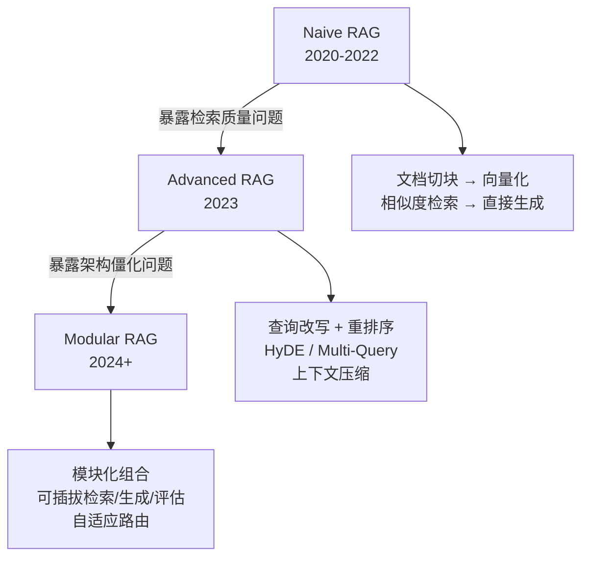
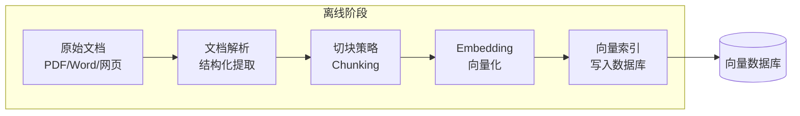
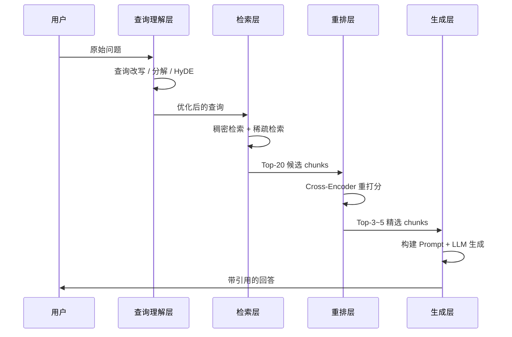

# 2.1 RAG 架构全景

## 一、核心概念

LLM 有一个根本性的工程缺陷：**知识是静态的**。模型的训练数据有截止日期，企业私有数据根本不在训练集里，而全参数微调的成本（数据标注 + GPU 算力 + 上线风险）在大多数业务场景下都是不可接受的。

RAG（Retrieval-Augmented Generation，检索增强生成）的出现，本质上是在回答一个工程问题：**如何在不修改模型权重的前提下，让 LLM 用上最新的、私有的、可追溯的知识？** 答案是：把知识从模型参数里"外包"出去，存到一个可以实时查询的外部系统，每次生成时动态检索进来。

这个思路的直接好处有三个：知识可以随时更新（改索引，不改模型）；回答可以附上来源（可溯源、可审计）；成本可控（向量检索比推理便宜几个数量级）。代价是引入了一条新的工程链路，每个环节都有独立的失败模式，出问题时的调试难度比 Prompt Engineering 高一个量级。

---

## 二、原理深讲

### 2.1.1 三代架构演进：Naive → Advanced → Modular RAG

RAG 并不是一个固定的架构，而是一套不断演进的工程范式。理解三代架构的演进，本质上是理解工程师在实际项目里踩了哪些坑、又是如何系统性地填坑的。



**Naive RAG**：最直白的实现——把文档切成 chunk，向量化存进数据库，用户提问时检索 Top-K，塞进 Prompt 让 LLM 回答。2022 年前后大量团队跑通了这套流程后，很快发现两个核心问题：**检索召回率不稳定**（语义相似不等于信息相关）和**生成幻觉依然存在**（检索到的内容没被正确利用）。

**Advanced RAG**：针对 Naive RAG 的两个痛点做定向加强。在检索前加查询理解（改写、扩展），在检索后加重排序（Cross-Encoder 二次打分），在生成前加上下文压缩（去掉无关内容减少干扰）。这一代解决了"检索质量差"的问题，但架构相对固化，不同场景之间的组件难以复用。

**Modular RAG**（Gao et al., 2023, arXiv:2312.10997）：把 RAG 拆解为一组可自由组合的功能模块——检索器、重排器、读取器、记忆模块、路由模块等。不同场景下可以选择不同的模块组合，甚至根据查询动态决定是否需要检索（某些问题直接用模型知识回答更好）。这一代更像是一个设计框架，而非具体实现。

| 维度 | Naive RAG | Advanced RAG | Modular RAG |
|------|-----------|--------------|-------------|
| 查询处理 | 原始问题直接检索 | 改写 / 扩展 / HyDE | 自适应路由与分解 |
| 检索策略 | 单路稠密向量 | 混合检索 + 重排 | 多路模块化组合 |
| 上下文处理 | 原始 chunk 直接塞入 | 压缩 / 摘要过滤 | 按需动态构建 |
| 架构灵活性 | 固定流水线 | 有限扩展 | 完全可插拔 |
| 适用阶段 | MVP 验证 | 产品化打磨 | 平台化建设 |

**工程建议**：绝大多数团队从 Naive RAG 起步，发现效果不达标时逐步引入 Advanced RAG 的优化手段。Modular RAG 更适合有独立 AI 基础设施团队的规模化场景，不要一开始就过度设计。

---

### 2.1.2 离线阶段：构建知识索引

离线阶段是"把知识喂给系统"的过程，分为四步：文档解析、切块、向量化、建索引。这条流水线的质量决定了 RAG 系统的上限——**检索召回率是 RAG 效果的天花板，生成质量无法弥补检索的缺失**。



**文档解析**：难点在于非结构化格式。PDF 的表格、双栏排版、页眉页脚都会干扰纯文本提取；扫描版 PDF 需要 OCR。工程上的实际选型：`pypdf` 适合标准 PDF，`markitdown`（微软开源）可以处理 Office 全家桶和网页，复杂 PDF 考虑 `pdfplumber` 或 Document AI 类服务。**踩坑点**：不要跳过解析质量验证，随机抽查 10% 的文档，检查是否有乱码、表格错位、内容截断。

**切块（Chunking）**：这一步是整个 RAG 流水线里最被低估的环节。chunk 太大，检索到的文本里有效信息密度低，浪费上下文窗口；chunk 太小，单个 chunk 语义不完整，LLM 无法理解。

```
# 三种主流切块策略示意

# 1. 固定大小（最简单，效果一般）
chunk_size=512, overlap=50

# 2. 语义切块（按句子/段落语义边界切割）
# 相邻句子向量相似度骤降时切割

# 3. 层次切块（保留文档结构）
# 大 chunk 用于粗粒度定位，小 chunk 用于精确检索
# 子 chunk 保留指向父 chunk 的引用
```

经验法则：中文技术文档用 **512–1024 字符 + 100 字符 overlap** 作为起点，然后用评估数据集验证实际效果。

**向量化（Embedding）**：选型原则——优先在任务类型上匹配，而不是一味追 MTEB 榜单排名。中文内容推荐 `BAAI/bge-m3`（多语言、多向量支持）或 `text-embedding-3-large`（OpenAI，适合混合中英文）。Embedding 阶段是计算密集型，一次性批量向量化，后续增量更新时只处理变更文档。

**索引构建**：向量数据库的核心选型维度是**数据规模**和**部署方式**。百万级以内、本地开发用 Chroma；百万到千万级生产环境用 Qdrant（性能好、支持 payload 过滤）；需要与现有 PostgreSQL 集成用 pgvector；超大规模（亿级以上）考虑 Milvus。HNSW 索引是当前生产环境的主流选择，查询延迟 < 10ms，召回率 > 95%。

---

### 2.1.3 在线阶段：查询到答案的完整链路

在线阶段是用户每次提问时实时执行的流程，延迟敏感，每个步骤都有优化空间。



**查询理解**：原始用户问题往往不是最适合检索的形式。几种常见策略：
- **查询改写**：用 LLM 把口语化问题重写为更规范的检索语句
- **Multi-Query**：从不同角度生成 3–5 个子查询，并行检索后合并结果
- **HyDE（Hypothetical Document Embedding）**：先让 LLM 生成一个假设性的回答文档，用这个假设文档的向量去检索——直觉是"假设答案的向量"比"问题的向量"在语义空间里更接近真实答案文档

**检索**：生产环境推荐混合检索——稠密向量检索（捕获语义相关性）+ BM25 稀疏检索（捕获关键词精确匹配），用 RRF（Reciprocal Rank Fusion）算法融合两路结果。纯向量检索在处理专有名词、型号编码、缩写时会有系统性失败，混合检索可以有效弥补。

**重排序**：检索层召回 Top-20，重排层从中挑出 Top-3～5。重排器（Cross-Encoder）会把**查询 + chunk** 作为一个整体输入，比检索阶段用的 Bi-Encoder 精度高得多，但速度慢，所以只用于精排。推荐 `BAAI/bge-reranker-v2-m3`，中英文效果均好。

**生成**：最终送给 LLM 的内容 = 系统提示 + 检索到的上下文 + 用户问题。几个工程细节：chunk 要附上来源元数据（文件名、页码），方便生成时引用；如果检索结果相关性不高，要有拒答逻辑（"根据现有资料无法回答"），而非让 LLM 编造答案；上下文顺序有影响，最相关的 chunk 放在前面和后面，避免"Lost in the Middle"问题。

---

## 三、工程视角：常见误区与最佳实践

**误区一：用相同的 chunk_size 处理所有文档类型**
→ **正确做法**：根据文档特性差异化配置。技术文档（代码 + 说明混合）用小 chunk（256–512 token）保持代码块完整性；法律合同用大 chunk（1024–2048 token）保留条款上下文；FAQ 文档每个 QA 对单独成 chunk。建立评估数据集，用 Context Recall 指标验证不同策略的效果差异。

**误区二：只做向量检索，忽略关键词匹配**
→ **正确做法**：上线混合检索（向量 + BM25）作为默认配置。特别是垂直领域系统中，专有名词（产品型号、药品名、法条编号）用向量检索会严重掉召回。Qdrant、Elasticsearch 都原生支持混合检索，接入成本不高。

**误区三：检索到内容就直接塞进 Prompt，不做质量过滤**
→ **正确做法**：加重排层，同时给每个 chunk 设定相关性分数阈值（如余弦相似度 < 0.6 的 chunk 直接丢弃）。把低质量 chunk 塞进上下文不仅没帮助，还会干扰 LLM 的注意力，降低生成质量。

**误区四：文档更新后忘记同步向量库**
→ **正确做法**：建立文档变更检测机制（文件 hash 或修改时间戳），变更时触发增量索引更新。删除文档时必须同步删除对应向量，否则检索会一直召回已失效内容。Qdrant 支持通过 payload 过滤来软删除，可以做版本管理。

**误区五：把 RAG 效果评估等同于 LLM 回答质量评估**
→ **正确做法**：分层评估。检索层单独评估（Context Recall：目标答案所需信息有多少比例被检索到）；生成层单独评估（Faithfulness：回答是否忠实于检索到的上下文）。两个指标独立优化，出了问题能快速定位是检索失败还是生成幻觉。RAGAS 框架提供了完整的评估指标体系（Module 2.6 详述）。

---

## 四、延伸思考

> 🤔 **思考题一**：随着 GPT-4o、Claude 3.7 等模型的上下文窗口扩展到 200K token，一个自然而然的问题是：能不能直接把整个知识库塞进 Prompt，完全绕过 RAG？这种"长上下文替代 RAG"的方案在什么条件下可行、什么条件下不可行？成本、延迟、知识库规模分别是怎样的约束边界？

> 🤔 **思考题二**：当前 RAG 系统的知识粒度是 chunk 级别的文本片段。对于需要跨文档、跨章节推理的问题（如"对比 A 合同和 B 合同的赔偿条款差异"），chunk 级 RAG 的架构天花板在哪里？GraphRAG 提出用知识图谱来表示文档间关系，这条路在工程上的代价是什么？
