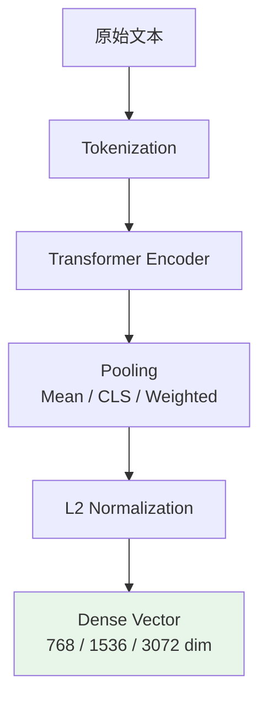
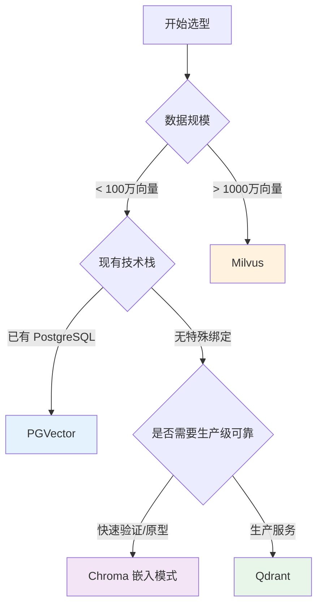
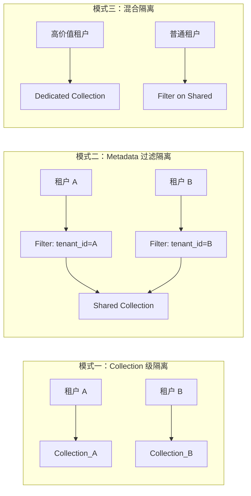

## 2.2 Embedding 与向量数据库

### 一、核心概念

RAG 系统的检索环节本质上是一个"语义匹配"问题：用户问的是"合同违约如何赔偿"，知识库里存的是"乙方未按时交付，需按合同金额的 5% 支付违约金"——这两句话没有一个词重合，但语义高度相关。传统的关键词搜索（BM25、Elasticsearch）在这里会完全失效。

解决思路是把文本映射到高维语义空间，让"语义相近"变成"向量距离近"。Embedding 模型就是这个映射函数，它将任意长度的文本压缩成一个固定维度的稠密向量（通常 768–3072 维）。向量数据库则是专门为高效存储和检索这些向量而设计的基础设施——它需要在百万量级的向量中，毫秒级找出与查询向量最相近的 Top-K 条。

理解这个模块的关键在于：**Embedding 模型决定检索的天花板，向量数据库决定系统的吞吐和延迟**。选错 Embedding 模型，换再好的数据库也救不回来；反之，Embedding 选对了，数据库选型不当会在生产环境中被并发打垮。两个决策都不能省。

---

### 二、原理深讲

#### 2.2.1 Embedding 模型选型

**工程动机**：不同的 Embedding 模型在检索效果、调用成本、是否需要私有化部署上差异显著。开源模型可本地部署避免数据出境合规风险，商业模型省去 GPU 运维成本。选型前必须明确：任务语言、数据敏感程度、预期 QPS、是否需要 Fine-tune。

**核心机制**：主流 Embedding 模型均基于双塔或单塔 Transformer 结构，通过对比学习（Contrastive Learning）训练，使相关文本对在向量空间中距离更近。关键差异在于：训练数据的语言分布、最大输入 Token 数、向量维度，以及是否支持非对称检索（Query 和 Document 可以用不同表示）。



**主流模型横向对比**：

| 模型 | 维度 | 最大输入 | 语言 | 部署方式 | 适用场景 |
|------|------|----------|------|----------|----------|
| `text-embedding-3-small` | 1536 | 8191 Token | 多语言 | API 调用 | 快速上线、多语言混合 |
| `text-embedding-3-large` | 3072 | 8191 Token | 多语言 | API 调用 | 效果优先、预算充裕 |
| `BGE-M3`（BAAI） | 1024 | 8192 Token | 中英为主 | 本地/私有化 | 中文场景、数据合规要求 |
| `GTE-Qwen2-7B` | 3584 | 32768 Token | 多语言 | 本地（GPU） | 长文档检索、效果顶尖 |
| `BGE-large-zh-v1.5` | 1024 | 512 Token | 中文 | 本地（CPU可） | 中文纯场景、资源受限 |

**工程建议**：
- 中文业务首选 BGE 系列或 GTE 系列，在 MTEB 中文榜单上持续领先 OpenAI 同级别模型，且可私有化
- 多语言混合场景（中英双语客服）用 `text-embedding-3-small` 或 `BGE-M3`
- 向量维度不是越高越好——维度越高，存储和检索成本越高，低质量数据集上高维度反而容易过拟合噪声
- 如果有标注数据，可以对 BGE 做领域 Fine-tune，通常比直接换大模型效果提升更稳定

#### 2.2.2 向量数据库横向对比

**工程动机**：能存向量的工具很多（Numpy 数组、Redis、甚至 SQLite），但生产系统需要：持久化存储、CRUD 支持、Metadata 过滤（如按 `tenant_id` 缩小检索范围）、高并发读写。向量数据库是这些能力的集大成者。

**主流数据库对比**：

| 特性 | Chroma | Qdrant | Milvus | PGVector |
|------|--------|--------|--------|----------|
| 部署难度 | ⭐（嵌入式/进程） | ⭐⭐ | ⭐⭐⭐⭐ | ⭐⭐（依托 PG） |
| 生产成熟度 | 中（适合原型） | 高 | 高（字节/小米在用） | 中高 |
| Metadata 过滤 | 基础 | 强（Payload 索引） | 强 | 依赖 SQL WHERE |
| 水平扩展 | 不支持 | 支持（分布式版） | 原生分布式 | 依赖 PG 扩展方案 |
| 混合查询（向量+SQL） | 弱 | 弱 | 弱 | 天然支持 |
| 许可证 | Apache 2.0 | Apache 2.0 | Apache 2.0 | PostgreSQL |
| 适合场景 | 快速原型、本地开发 | 中小生产场景 | 大规模生产（亿级） | 已有 PG 栈的团队 |

**选型决策树**：



**工程建议**：
- 新项目从 Qdrant 起步，API 设计现代，支持 Payload 索引（可对 Metadata 字段建立倒排加速过滤），Docker 一键启动，后续扩展空间大
- PGVector 最大优势是"不增加基础设施"——如果系统已经重度依赖 PostgreSQL，向量搜索直接跑在同一个数据库，JOIN 操作天然支持，运维成本低
- 不要用 Chroma 做生产环境——并发写入稳定性存疑，0.4.x 之前有严重数据损坏 bug

#### 2.2.3 索引类型：HNSW vs IVF-Flat

**工程动机**：向量检索的暴力方案是遍历所有向量计算距离（Brute Force），在百万量级下延迟不可接受。近似最近邻搜索（ANN, Approximate Nearest Neighbor）用可接受的精度损失换取数量级的速度提升。

**HNSW（Hierarchical Navigable Small World）**

直觉：把向量组织成一张多层图，高层图节点稀疏、只保留"远程连接"，低层图节点密集、精确定位。查询时从高层入口快速跳跃到目标区域，再在低层细化搜索，像是先定省再定市再定区。

关键参数：
- `M`：每个节点的最大邻居数。M 越大，图越稠密，精度高但构建慢、内存大。推荐从 16 开始调
- `ef_construction`：构建时搜索的动态候选集大小，影响索引质量，不影响查询速度
- `ef`（查询时）：查询时搜索的动态候选集大小，直接影响 recall/latency 权衡

特点：查询速度快（无需加载全量数据到内存），内存占用较大，适合高并发低延迟场景。Qdrant 默认使用 HNSW。

**IVF-Flat（Inverted File with Flat）**

直觉：先用 K-Means 把向量空间划分为 `nlist` 个簇，每个向量分配到最近的簇中心。查询时先找 `nprobe` 个最近的簇，再在这些簇内暴力搜索。像是先定区县再搜索区县内的街道。

关键参数：
- `nlist`：簇数量，通常设为 `sqrt(N)` 到 `4*sqrt(N)`（N 为向量总数）
- `nprobe`：查询时搜索的簇数，越大越准但越慢

特点：内存效率高（可配合 PQ 量化进一步压缩），但需要先训练聚类中心（冷启动问题），适合静态数据集和内存受限场景。

**HNSW vs IVF-Flat 对比**：

| 维度 | HNSW | IVF-Flat |
|------|------|----------|
| 查询速度 | 极快 | 快 |
| 内存占用 | 高（图结构） | 中 |
| 构建时间 | 中 | 快（需训练） |
| 动态增删 | 支持（部分库） | 麻烦（需重建） |
| 推荐场景 | 实时写入、高并发查询 | 批量导入、内存敏感 |

**工程建议**：优先选 HNSW——绝大多数 RAG 场景都是实时写入新文档，HNSW 增量插入友好；IVF 类索引在向量集合频繁变化时需要重建聚类中心，运维复杂。

#### 2.2.4 多租户隔离与权限控制

**工程动机**：SaaS 产品中，每个租户的数据必须严格隔离——不能让 A 公司查询到 B 公司的文档，也不能让普通员工查到只有 HR 才能访问的数据。

**三种隔离模式**：



| 隔离模式 | 数据隔离强度 | 资源利用率 | 运维复杂度 | 适用场景 |
|----------|------------|-----------|-----------|----------|
| Collection 级隔离 | 强 | 低（资源碎片化） | 高（租户增多后 Collection 爆炸） | 少量高价值租户、数据合规严格 |
| Metadata 过滤 | 中（依赖查询层正确过滤） | 高 | 低 | 中小型 SaaS，租户数百至数千 |
| 混合模式 | 分级 | 中 | 中 | 差异化服务（高级版独享，标准版共享） |

**权限控制最佳实践**：

```python
# Metadata 过滤隔离的标准实现模式（以 Qdrant 为例）
# 写入时强制注入租户标识和权限标签
payload = {
    "tenant_id": tenant_id,          # 租户隔离键
    "doc_id": doc_id,
    "permission_level": "internal",   # public / internal / confidential
    "department": "hr",              # 部门级权限
    "content": chunk_text,
}

# 查询时必须带上过滤条件——不能依赖上层业务逻辑"记得"加过滤
search_filter = models.Filter(
    must=[
        models.FieldCondition(key="tenant_id", match=models.MatchValue(value=current_tenant_id)),
        models.FieldCondition(key="permission_level", match=models.MatchAnyValue(
            any=user_accessible_levels  # 根据用户角色动态计算
        )),
    ]
)
```

**工程建议**：
- 权限过滤逻辑应该下沉到数据访问层，而不是散落在业务逻辑里——每个向量检索函数都必须接收 `tenant_id` 参数，没有默认值，强制调用方传入
- 对 `tenant_id` 和 `permission_level` 字段建立 Payload 索引（Qdrant 的 `create_payload_index`），否则 Metadata 过滤会退化成全量扫描，延迟直线上升

---

### 三、工程视角：常见误区与最佳实践

**误区一**：用同一个 Embedding 模型编码 Query 和 Document，认为对称就没问题。
→ **正确做法**：检索任务天然是非对称的——Query 短且口语化，Document 长且正式。BGE 系列提供了 `query_instruction_for_retrieval` 机制，查询时需在 Query 前加指令前缀（如 `"为这个句子生成表示以用于检索相关文章："`），而 Document 无需前缀。忘记加这个前缀会导致检索效果下降 5–15 个点。

**误区二**：向量数据库的 Collection 建好后不设置 Metadata 索引，直接上线。
→ **正确做法**：对所有用于过滤的 Metadata 字段（`tenant_id`、`doc_type`、`created_at` 等）提前建立 Payload 索引。未建索引时，过滤条件会触发 O(N) 全量扫描，数据量增长到 10 万以上时延迟会从 20ms 飙升到 2s+。

**误区三**：Embedding 模型的 `max_tokens` 限制被忽视，直接把整页 PDF 塞进去。
→ **正确做法**：BGE-large-zh-v1.5 最大输入只有 512 Token，超出部分会被截断——模型不报错，但后半段内容完全丢失。使用 tiktoken 或模型对应的 tokenizer 在切块阶段做长度校验，确保每个 chunk 的 Token 数低于模型上限的 90%（留 10% 余量给特殊 Token）。

**误区四**：开发阶段用 Chroma 内存模式，上线前换 Qdrant，以为"都支持 LangChain 接口所以迁移是零成本"。
→ **正确做法**：不同向量数据库的 Metadata 过滤语法、Collection 配置、HNSW 参数设置差异很大，LangChain 的抽象层只覆盖了基础 CRUD，高级功能需要直接调用原生 SDK。建议从 MVP 阶段就选定生产向量数据库，或者项目里封装一个抽象接口层，把向量数据库实现细节收敛在一处。

**误区五**：把向量相似度分数当作绝对置信度，直接透出给用户（如"相关度 0.87"）。
→ **正确做法**：cosine 相似度的分布高度依赖 Embedding 模型和语料领域，同一个分数在不同场景下含义完全不同。线上先做分数分布统计（如 P10/P50/P90），根据业务实际效果确定"有效命中"的分数阈值，再考虑是否要对外展示。

---

### 四、延伸思考

> 🤔 思考题：随着主流大模型的上下文窗口扩展到 100K–1M Token，"把所有文档塞进 Prompt"看起来似乎可以替代 RAG 的检索步骤，那么向量数据库还有存在的意义吗？

长上下文并非向量检索的终结者：其一，长上下文的推理成本随输入长度线性（甚至二次）增长，10 万条文档全塞进去成本无法承受；其二，研究表明 LLM 在超长上下文中存在"Lost in the Middle"现象——关键信息位于中间位置时，模型的利用率显著下降。向量检索在"先过滤、再精读"的分阶段架构中依然不可替代，两者更可能走向结合——检索先召回 Top-K，再交给长上下文模型做精确推理。
