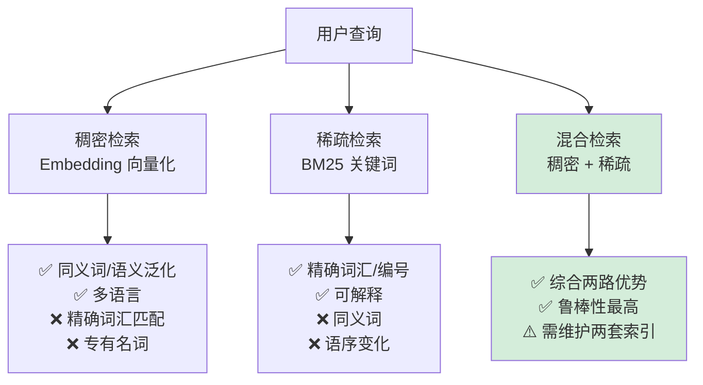

## 2.3 检索策略（稠密 / 稀疏 / 混合）

---

### 一、核心概念

你在 2.4 节搭建本地知识库时，大概率会先跑通一个"用 Embedding 向量化 + 余弦相似度检索"的最简 RAG，然后发现一个让人头疼的问题：用户输入"合同第 7.2.3 条的赔偿上限是多少"，系统回来的 Top-3 文档跟合同赔偿没什么关系，但语义上听起来"挺像的"。

这是纯向量检索的经典失效场景——**语义相近不等于字面匹配**。"7.2.3 条"这个精确条款号，对向量模型来说不过是几个 Token，远没有"赔偿"这类高权重词汇在 Embedding 空间中的影响大。

这就是为什么生产级 RAG 不只依赖一种检索方式，而是把**稠密检索**（Dense Retrieval，向量语义）和**稀疏检索**（Sparse Retrieval，关键词匹配）结合起来用。两种方法各有死角，混合使用才是大多数场景下的工程最优解。

---

### 二、原理深讲

#### 2.3.1 稠密检索：语义向量相似度

**工程动机**：传统关键词检索完全依赖词汇重叠，"买车"和"购置汽车"会被判定为不相关。稠密检索把文本映射到连续向量空间，语义相近的文本向量距离也相近，解决了同义词、换说法等问题。

**核心机制**：

文档在离线阶段被 Embedding 模型编码为高维向量（通常 768~3072 维）存入向量数据库。检索时，查询文本同样经过 Embedding，然后计算与所有文档向量的距离，取 Top-K 返回。

两种主流距离度量：

| 度量方式 | 公式 | 适用场景 | 注意事项 |
|---|---|---|---|
| **余弦相似度** | $\cos(\theta) = \frac{A \cdot B}{\|A\| \cdot \|B\|}$ | 大多数文本检索 | 消除了向量长度影响，只关注方向 |
| **点积（Dot Product）** | $A \cdot B = \sum_i a_i b_i$ | 向量已归一化时与余弦等价 | 向量未归一化时结果受模长影响 |
| **L2 欧氏距离** | $\sqrt{\sum_i (a_i - b_i)^2}$ | 少见，某些图像检索场景 | 文本检索中通常不如余弦稳定 |

**工程建议**：

- Embedding 模型选型时优先看 [MTEB Leaderboard](https://huggingface.co/spaces/mteb/leaderboard) 上你任务语言对应的得分，而不是用默认的 `text-embedding-ada-002`。中文场景推荐 `BAAI/bge-large-zh-v1.5`，多语言场景推荐 `intfloat/multilingual-e5-large`。
- 向量数据库中开 HNSW 索引，`ef_construction=200, m=16` 是大多数场景合理的起点；数据量超过 100 万条再考虑 IVF-Flat 分桶。
- **归一化存储**：存入向量库前对向量做 L2 归一化，查询时点积直接等价余弦相似度，可以节省运行时除法计算。

---

#### 2.3.2 稀疏检索：BM25 关键词匹配

**工程动机**：精确词汇（产品编号、人名、专有名词、数字）是向量模型的弱项，却是稀疏检索的强项。BM25 是 TF-IDF 的改进版本，几十年的工程打磨，在关键词匹配上性价比极高。

**核心机制**：

BM25 对每个词 $q_i$ 计算相关性得分：

$$\text{BM25}(D, Q) = \sum_{i=1}^{n} \text{IDF}(q_i) \cdot \frac{f(q_i, D) \cdot (k_1 + 1)}{f(q_i, D) + k_1 \cdot \left(1 - b + b \cdot \frac{|D|}{\text{avgdl}}\right)}$$

用人话解释三个关键设计：

1. **词频饱和（$k_1$ 参数，默认 1.2~2.0）**：同一个词出现 10 次的得分不是出现 1 次的 10 倍，而是趋于饱和。防止"关键词堆砌"。
2. **文档长度归一化（$b$ 参数，默认 0.75）**：长文档天然包含更多词，$b$ 控制长度惩罚力度。$b=0$ 不做归一化，$b=1$ 完全归一化。
3. **IDF 加权**：常见词（"的"、"是"）权重低，稀有词（"7.2.3 条"）权重高。

**Elasticsearch 实战**：

ES 的默认相似度算法就是 BM25，开箱即用。关键是**分词器**的选择——中文必须用 `ik_max_word` 或 `jieba` 分词插件，否则 BM25 退化成按字检索，效果断崖式下跌。

```python
# 示意：ES 索引配置中文分词
{
  "settings": {
    "analysis": {
      "analyzer": {
        "ik_analyzer": {
          "type": "custom",
          "tokenizer": "ik_max_word"
        }
      }
    }
  },
  "mappings": {
    "properties": {
      "content": {
        "type": "text",
        "analyzer": "ik_analyzer"
      }
    }
  }
}
```

如果不想维护 ES 集群，`rank_bm25` 这个纯 Python 库可以在小数据集（几万条以内）上本地跑 BM25，够用且零运维。

---

#### 2.3.3 混合检索：RRF 融合算法

**工程动机**：稠密和稀疏检索各自返回一个排好序的列表，怎么把两个列表合成一个最终结果？直接按分数相加行不通——向量相似度（0.85）和 BM25 分数（23.7）的量纲完全不同，没有可比性。

**RRF（Reciprocal Rank Fusion）核心机制**：

只看排名，不看分数。对每个文档，累加它在各个列表中排名倒数的和：

$$\text{RRF}(d) = \sum_{r \in R} \frac{1}{k + r(d)}$$

其中 $k$ 通常取 60（平滑因子，防止排名第 1 的文档得分爆炸），$r(d)$ 是文档 $d$ 在列表 $r$ 中的排名。

举例说明：

| 文档 | 稠密检索排名 | BM25 排名 | RRF 得分（k=60） |
|---|---|---|---|
| Doc A | 1 | 3 | 1/61 + 1/63 ≈ 0.0321 |
| Doc B | 5 | 1 | 1/65 + 1/61 ≈ 0.0315 |
| Doc C | 2 | 未出现 | 1/62 + 0 ≈ 0.0161 |

Doc A 在两个列表中都表现良好，得分最高——这正是我们想要的结果。

**RRF 的工程优势**：

- 无需调权重，天然鲁棒
- 对 Top-K 的 K 值不敏感，即使两个列表的 K 不同也能合并
- 加入第三路检索（如 BM25 变体、重排模型）时，只需再加一项求和

**带权重的 RRF 变体**：

有些场景你确实需要偏向某一路检索，可以给每路加权重系数：

```python
def weighted_rrf(dense_results, sparse_results, 
                 dense_weight=0.6, sparse_weight=0.4, k=60):
    scores = {}
    for rank, doc_id in enumerate(dense_results, start=1):
        scores[doc_id] = scores.get(doc_id, 0) + dense_weight / (k + rank)
    for rank, doc_id in enumerate(sparse_results, start=1):
        scores[doc_id] = scores.get(doc_id, 0) + sparse_weight / (k + rank)
    return sorted(scores.items(), key=lambda x: x[1], reverse=True)
```

---

**三种检索方式的完整对比**：



| 维度 | 稠密检索 | 稀疏检索（BM25） | 混合检索（RRF） |
|---|---|---|---|
| **语义理解** | ✅ 强 | ❌ 弱 | ✅ 强 |
| **精确匹配** | ❌ 弱 | ✅ 强 | ✅ 强 |
| **可解释性** | ❌ 黑盒 | ✅ 可追溯命中词 | ⚠️ 部分可解释 |
| **新增文档速度** | ⚠️ 需重编码 | ✅ 直接倒排 | ⚠️ 两路都要更新 |
| **工程复杂度** | 低 | 低 | 中 |
| **推荐场景** | 语义问答、FAQ | 法律/医疗精确检索 | 生产级通用 RAG |

---

### 三、工程视角：常见误区与最佳实践

**误区 1：默认用余弦相似度，但向量没有归一化**
→ **正确做法**：使用 HNSW 或 Qdrant 时，在存入向量前显式做 L2 归一化（`vector / np.linalg.norm(vector)`），或直接用向量数据库内置的归一化参数。向量未归一化时，向量长度会干扰余弦相似度计算，尤其是不同长度文本的 Embedding 差异显著。

---

**误区 2：混合检索权重一刀切，所有场景都用 0.5:0.5**
→ **正确做法**：权重是需要用评估集调的超参数。法律合规、金融报告等强调精确条款的场景，稀疏检索权重应调高（0.3:0.7）；产品推荐、FAQ 问答等语义场景，稠密检索权重应调高（0.7:0.3）。用 RAGAS 的 Context Recall 指标做自动化调参，而不是凭直觉拍。

---

**误区 3：BM25 中文不加分词器，直接按字切分**
→ **正确做法**：中文"深度学习"如果按字切分成"深"、"度"、"学"、"习"，BM25 会把"学习深度"和"深度学习"判定为高度相关，完全语义错乱。生产环境必须接入 `jieba`（轻量）或 `IK Analyzer`（ES 场景），结巴推荐用 `cut_for_search` 模式增加 n-gram 覆盖率。

---

**误区 4：线上 Top-K 设置太小，召回天花板被卡死**
→ **正确做法**：混合检索时，每路检索的初始 Top-K 要比最终返回的文档数大 3~5 倍。比如最终要给 LLM 送 5 条上下文，稠密和稀疏检索各自应该先取 Top-20，再用 RRF 合并后截取前 5。如果每路只取 Top-5 再合并，两路共同覆盖的候选集太小，容易丢失关键文档。

---

**误区 5：向量检索和全文检索用不同系统，数据一致性难以保证**
→ **正确做法**：优先选择支持混合检索的单一数据库——Qdrant（内置稀疏向量支持）、Elasticsearch（8.x 原生向量字段）、Weaviate（内置 BM25 + 向量双路）。维护两套独立数据库（ES + Qdrant）会引入数据同步延迟，文档更新时容易出现"向量已更新但 BM25 索引还是旧版本"的静默错误。

---

### 四、延伸思考

> 🤔 **思考题一**：RRF 用排名代替分数，这个设计在什么情况下会反而损失信息？例如，当稠密检索返回的 Top-1 文档相似度为 0.97、Top-2 为 0.45 时（分数断崖），RRF 还会给两者同样的排名差权重，这是否合理？有什么改进方案？

> 🤔 **思考题二**：随着 LLM 上下文窗口扩展到 100K+ Token，"把整个知识库塞进 Prompt"的方案理论上可行了。那么混合检索还有存在价值吗？它的核心壁垒究竟在哪里——是成本、延迟，还是检索精度本身？
