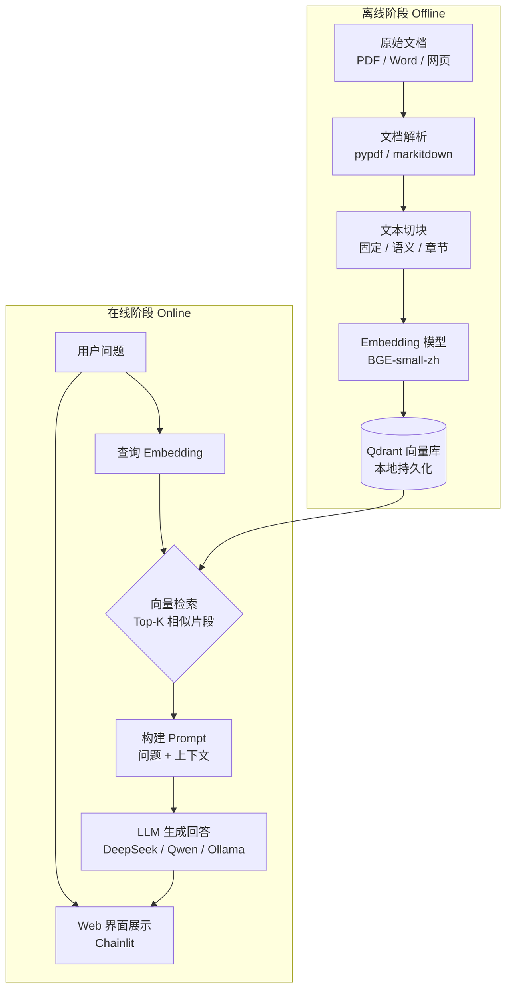

# 2.4 【动手】从零搭建本地知识库问答系统

---

## 实验目标

本节结束后，你将拥有一个完整运行的本地 RAG 问答系统：支持解析 PDF、Word、网页三类文档，能回答基于这些文档内容的自然语言问题，并带有简单的 Web 界面。

核心学习点（3 个）：
1. **文档解析与切块的工程取舍**：不同格式的解析工具选择，以及三种切块策略的效果差异；
2. **向量化-存储-检索全链路**：如何用本地 Embedding 模型 + Qdrant 向量库构建离线索引，并在查询时高效检索；
3. **RAG 问答链路的组装**：将检索结果注入 Prompt，让 LLM 基于文档内容作答而非凭空生成。

---

## 架构总览



---

## 环境准备

```bash
# 创建虚拟环境（uv）
uv venv --python 3.11
source .venv/bin/activate  # Windows: .venv\Scripts\activate

# 安装依赖（锁定版本）
uv pip install \
  litellm>=1.40.0 \
  python-dotenv>=1.0.0 \
  pypdf>=4.0.0 \
  markitdown[docx,pptx]>=0.1.0 \
  tiktoken>=0.5.0 \
  langchain-text-splitters>=0.1.0 \
  qdrant-client>=1.0.0 \
  sentence-transformers>=2.0.0 \
  chainlit>=1.0.0 \
  numpy>=1.24.0 \
  pytest>=7.0.0
```

> Colab 用户：`!pip install litellm python-dotenv pypdf markitdown tiktoken langchain-text-splitters qdrant-client sentence-transformers chainlit numpy pytest` 即可，无需创建虚拟环境。

新建 `.env` 文件管理密钥：

```bash
DEEPSEEK_API_KEY=sk-xxx          # DeepSeek 模型需要
DASHSCOPE_API_KEY=sk-xxx         # Qwen 模型需要
# 若用 Ollama 本地模型，上述均可留空
```

模型选择通过 `core_config.py` 中的 `ACTIVE_MODEL_KEY` 控制，默认使用 `DeepSeek-V3`，改为 `"Qwen-Max"` 即可切换。

项目目录结构约定：

```
local-rag/
├── .env
├── docs/                  # 放你的文档
├── qdrant_storage/        # 向量库持久化目录（自动生成）
├── core_config.py         # 模型注册表（统一管理 LLM 配置）
├── main.py                # 统一入口（index / ask / chainlit）
├── step1_parse.py
├── step2_chunk.py
├── step3_index.py
├── step4_query.py
├── app.py                 # Chainlit Web 界面
├── smoke_test.py          # 端到端冒烟测试
└── requirements.txt
```

---

## Step-by-Step 实现

### Step 1：文档解析

**目标**：将 PDF、Word、网页三类格式统一转换为纯文本，并保留足够的结构信息供后续切块使用。选择工具的核心原则是：能拿到结构就拿结构，实在拿不到再退化为纯文本。

```python
# step1_parse.py
"""
文档解析模块：支持 PDF / Word / 网页 → 结构化文本
"""
from __future__ import annotations

import re
from dataclasses import dataclass, field
from pathlib import Path
from typing import Literal
from urllib.request import urlopen

import pypdf
from markitdown import MarkItDown


@dataclass
class ParsedDocument:
    """解析后的文档，保留来源信息供后续引用溯源"""
    content: str                          # 纯文本内容（Markdown 格式）
    source: str                           # 文件路径或 URL
    doc_type: Literal["pdf", "word", "web"]
    metadata: dict = field(default_factory=dict)


def parse_pdf(path: str | Path) -> ParsedDocument:
    """
    解析 PDF 文档。

    策略：优先用 pypdf 提取文字层；若文字层为空（扫描件），
    退化提示用户使用 OCR 工具（如 marker-pdf）预处理。
    """
    path = Path(path)
    reader = pypdf.PdfReader(str(path))
    pages: list[str] = []

    for i, page in enumerate(reader.pages):
        text = page.extract_text() or ""
        if text.strip():
            # 添加页码标记，方便后续引用溯源
            pages.append(f"<!-- Page {i + 1} -->\n{text}")

    if not pages:
        raise ValueError(
            f"{path.name} 可能是扫描版 PDF，pypdf 无法提取文字层。"
            "建议用 marker-pdf 或 pymupdf 进行 OCR 预处理。"
        )

    content = "\n\n".join(pages)
    return ParsedDocument(
        content=content,
        source=str(path),
        doc_type="pdf",
        metadata={"page_count": len(reader.pages), "filename": path.name},
    )


def parse_word_or_office(path: str | Path) -> ParsedDocument:
    """
    解析 Word / Excel / PPT 等 Office 格式。

    使用 MarkItDown 统一转为 Markdown，保留标题层级结构，
    这对后续章节切块策略至关重要。
    """
    path = Path(path)
    md = MarkItDown()
    result = md.convert(str(path))
    return ParsedDocument(
        content=result.text_content,
        source=str(path),
        doc_type="word",
        metadata={"filename": path.name},
    )


def parse_webpage(url: str) -> ParsedDocument:
    """
    解析网页内容。

    MarkItDown 内部使用 trafilatura 抽取正文，
    自动过滤导航栏、广告等噪声区域。
    """
    md = MarkItDown()
    result = md.convert_url(url)
    return ParsedDocument(
        content=result.text_content,
        source=url,
        doc_type="web",
        metadata={"url": url},
    )


def parse_document(source: str) -> ParsedDocument:
    """统一入口：根据来源自动分发到对应解析器"""
    if source.startswith("http://") or source.startswith("https://"):
        return parse_webpage(source)

    path = Path(source)
    suffix = path.suffix.lower()

    if suffix == ".pdf":
        return parse_pdf(path)
    elif suffix in {".docx", ".xlsx", ".pptx", ".doc"}:
        return parse_word_or_office(path)
    else:
        raise ValueError(f"不支持的文件格式：{suffix}")


# ── 快速验证 ──────────────────────────────────────────────
if __name__ == "__main__":
    import sys
    source = sys.argv[1] if len(sys.argv) > 1 else "https://docs.python.org/3/library/pathlib.html"
    doc = parse_document(source)
    print(f"来源：{doc.source}")
    print(f"类型：{doc.doc_type}")
    print(f"字符数：{len(doc.content)}")
    print(f"前 300 字：\n{doc.content[:300]}")
```

**关键点**：
- `MarkItDown` 的核心价值在于将 Office 格式转为带层级的 Markdown，`# 标题` 这样的结构信息在章节切块时会被直接利用。
- pypdf 对扫描版 PDF 无效，这是生产环境最常见的坑之一。建议在解析前做一次页面文字密度检测，低于阈值则提示用户。

---

### Step 2：文本切块（三种策略对比）

**目标**：将长文档切成适合向量化的小片段（Chunk）。切块质量直接影响检索准确率——块太大会引入噪声，块太小会丢失上下文。

```python
# step2_chunk.py
"""
三种切块策略的实现与对比：
1. 固定大小切块（按 Token 数）
2. 语义切块（按句子边界 + 相似度聚合）
3. 章节切块（利用 Markdown 标题层级）
"""
from __future__ import annotations

import re
from dataclasses import dataclass
from typing import Literal

import tiktoken
from langchain_text_splitters import RecursiveCharacterTextSplitter

from step1_parse import ParsedDocument


@dataclass
class Chunk:
    """单个文本片段，携带溯源信息"""
    text: str
    source: str
    chunk_index: int
    strategy: str
    metadata: dict


# ── 策略 1：固定大小切块 ────────────────────────────────────
def chunk_fixed_size(
    doc: ParsedDocument,
    chunk_size: int = 512,
    chunk_overlap: int = 64,
) -> list[Chunk]:
    """
    按 Token 数做固定大小切块。

    为什么用 Token 而非字符数？
    因为 Embedding 模型的输入限制是 Token，用字符数切块
    在中文环境下会因字符/Token 比例不固定而导致截断。

    chunk_overlap 保证跨块的句子不会完全割裂语义。
    """
    enc = tiktoken.get_encoding("cl100k_base")

    splitter = RecursiveCharacterTextSplitter(
        chunk_size=chunk_size,
        chunk_overlap=chunk_overlap,
        length_function=lambda text: len(enc.encode(text)),  # 按 Token 计长度
        separators=["\n\n", "\n", "。", "！", "？", ".", "!", "?", " ", ""],
    )

    texts = splitter.split_text(doc.content)
    return [
        Chunk(
            text=t,
            source=doc.source,
            chunk_index=i,
            strategy="fixed",
            metadata={**doc.metadata, "token_count": len(enc.encode(t))},
        )
        for i, t in enumerate(texts)
    ]


# ── 策略 2：章节切块（推荐用于结构化文档）──────────────────
def chunk_by_section(
    doc: ParsedDocument,
    max_chunk_size: int = 1000,
) -> list[Chunk]:
    """
    按 Markdown 标题层级切块。

    适用场景：Word/PPT 文档、技术文档、API 参考。
    这类文档的章节边界本身就是语义边界，按标题切比按字符切
    更能保证每个 Chunk 内容的语义完整性。

    超过 max_chunk_size 的节会用固定大小策略二次切分。
    """
    enc = tiktoken.get_encoding("cl100k_base")

    # 匹配所有级别的 Markdown 标题（# ~ ######）
    heading_pattern = re.compile(r"^(#{1,6})\s+(.+)$", re.MULTILINE)
    matches = list(heading_pattern.finditer(doc.content))

    if not matches:
        # 没有检测到标题结构，退化为固定大小切块
        return chunk_fixed_size(doc, chunk_size=max_chunk_size)

    # 按标题边界切分文本
    sections: list[tuple[str, str]] = []  # (标题, 正文)
    for i, match in enumerate(matches):
        heading = match.group(0)
        start = match.end()
        end = matches[i + 1].start() if i + 1 < len(matches) else len(doc.content)
        body = doc.content[start:end].strip()
        sections.append((heading, body))

    chunks: list[Chunk] = []
    for heading, body in sections:
        section_text = f"{heading}\n\n{body}"
        token_count = len(enc.encode(section_text))

        if token_count <= max_chunk_size:
            chunks.append(
                Chunk(
                    text=section_text,
                    source=doc.source,
                    chunk_index=len(chunks),
                    strategy="section",
                    metadata={**doc.metadata, "heading": heading.strip()},
                )
            )
        else:
            # 超长章节二次切分，保留标题作为前缀
            sub_splitter = RecursiveCharacterTextSplitter(
                chunk_size=max_chunk_size,
                chunk_overlap=50,
                length_function=lambda t: len(enc.encode(t)),
            )
            for sub_text in sub_splitter.split_text(body):
                chunks.append(
                    Chunk(
                        text=f"{heading}\n\n{sub_text}",
                        source=doc.source,
                        chunk_index=len(chunks),
                        strategy="section+fixed",
                        metadata={**doc.metadata, "heading": heading.strip()},
                    )
                )

    return chunks


# ── 策略选择入口 ────────────────────────────────────────────
def chunk_document(
    doc: ParsedDocument,
    strategy: Literal["fixed", "section"] = "section",
) -> list[Chunk]:
    """
    根据文档类型自动选择最优切块策略：
    - Word/PPT 等结构化文档 → section（利用标题层级）
    - PDF/网页等非结构化文档 → fixed（按 Token 均匀切分）
    """
    if strategy == "section" or doc.doc_type == "word":
        return chunk_by_section(doc)
    return chunk_fixed_size(doc)


# ── 对比实验 ──────────────────────────────────────────────
if __name__ == "__main__":
    from step1_parse import parse_document

    # 用网页做演示，结构相对清晰
    doc = parse_document("https://docs.python.org/3/library/pathlib.html")
    fixed_chunks = chunk_fixed_size(doc, chunk_size=512)
    section_chunks = chunk_by_section(doc, max_chunk_size=1000)

    print(f"固定大小切块：{len(fixed_chunks)} 块，平均长度 {sum(len(c.text) for c in fixed_chunks)//len(fixed_chunks)} 字符")
    print(f"章节切块：    {len(section_chunks)} 块，平均长度 {sum(len(c.text) for c in section_chunks)//len(section_chunks)} 字符")
    print(f"\n章节切块示例（第 1 块）：\n{section_chunks[0].text[:300]}")
```

**关键点**：
- 三种策略的选型建议：**结构化文档（Word/PPT）用章节切块**，语义最完整；**PDF 和网页用固定大小切块**，因为提取出的文本往往缺少层级信息；语义切块（按句子相似度聚合）效果最好但耗时显著，生产环境中除非对准确率要求极高，否则不值得为全量文档使用。
- `chunk_overlap` 不是越大越好：过大会导致相邻块高度重复，Top-K 检索时同质化结果占满名额，反而降低召回多样性。经验值：`overlap ≈ chunk_size × 10-15%`。

---

### Step 3：向量化与索引构建

**目标**：用本地 Embedding 模型将所有 Chunk 向量化，写入 Qdrant 持久化存储。选本地模型而非 API 的原因：离线可用、无隐私泄露风险、批量处理无费用。

```python
# step3_index.py
"""
向量化 + Qdrant 索引构建
"""
from __future__ import annotations

import json
import time
from pathlib import Path
from typing import Iterator

from qdrant_client import QdrantClient
from qdrant_client.models import (
    Distance,
    PointStruct,
    VectorParams,
)
from sentence_transformers import SentenceTransformer

from step2_chunk import Chunk, chunk_document
from step1_parse import parse_document

# ── 配置 ──────────────────────────────────────────────────
COLLECTION_NAME = "local_kb"
EMBED_MODEL_NAME = "BAAI/bge-small-zh-v1.5"   # 512 维，中文效果好，约 90MB
VECTOR_DIM = 512
QDRANT_PATH = "./qdrant_storage"               # 本地持久化目录
BATCH_SIZE = 64                                # 批量向量化大小


def get_embed_model() -> SentenceTransformer:
    """
    加载 Embedding 模型（首次运行会从 HuggingFace 下载）。

    为什么选 BGE-small-zh-v1.5？
    - 512 维向量，索引体积小，检索快
    - 中文 MTEB 排名靠前，性价比最高
    - 支持查询前缀：查询时加 "为这个句子生成表示以用于检索相关文章："
      文档时不加前缀，这是 BGE 的特殊使用约定。
    """
    return SentenceTransformer(EMBED_MODEL_NAME)


def get_qdrant_client() -> QdrantClient:
    """获取本地持久化 Qdrant 客户端"""
    Path(QDRANT_PATH).mkdir(parents=True, exist_ok=True)
    return QdrantClient(path=QDRANT_PATH)


def ensure_collection(client: QdrantClient) -> None:
    """确保 Collection 存在，不存在则创建"""
    existing = {c.name for c in client.get_collections().collections}
    if COLLECTION_NAME not in existing:
        client.create_collection(
            collection_name=COLLECTION_NAME,
            vectors_config=VectorParams(size=VECTOR_DIM, distance=Distance.COSINE),
        )
        print(f"已创建 Collection：{COLLECTION_NAME}")
        # 创建后立即优化索引
        client.update_collection(
            collection_name=COLLECTION_NAME,
            optimizer_config={"indexing_threshold": 1},
        )
        print(f"已设置索引阈值")
    else:
        print(f"Collection 已存在：{COLLECTION_NAME}")


def batch_iter(items: list, size: int) -> Iterator[list]:
    """将列表按批次切分的生成器"""
    for i in range(0, len(items), size):
        yield items[i : i + size]


def index_chunks(chunks: list[Chunk], model: SentenceTransformer, client: QdrantClient) -> int:
    """
    批量向量化并写入 Qdrant。

    返回写入的 Chunk 总数。
    """
    ensure_collection(client)

    # 获取当前最大 ID，避免覆盖已有数据
    count_result = client.count(collection_name=COLLECTION_NAME)
    start_id = count_result.count

    total = 0
    for batch in batch_iter(chunks, BATCH_SIZE):
        texts = [c.text for c in batch]

        # BGE 文档向量化：不加查询前缀
        vectors = model.encode(texts, normalize_embeddings=True, show_progress_bar=False)

        points = [
            PointStruct(
                id=start_id + i,
                vector=vector.tolist(),
                payload={
                    "text": chunk.text,
                    "source": chunk.source,
                    "chunk_index": chunk.chunk_index,
                    "strategy": chunk.strategy,
                    **chunk.metadata,
                },
            )
            for i, (chunk, vector) in enumerate(zip(batch, vectors))
        ]

        client.upsert(collection_name=COLLECTION_NAME, points=points)
        start_id += len(batch)
        total += len(batch)
        print(f"  已写入 {total}/{len(chunks)} 块")

    return total


def index_document(source: str, strategy: str = "section") -> None:
    """完整索引一个文档的便捷函数"""
    print(f"\n📄 处理文档：{source}")

    t0 = time.time()
    doc = parse_document(source)
    print(f"  解析完成：{len(doc.content)} 字符，耗时 {time.time()-t0:.1f}s")

    t1 = time.time()
    chunks = chunk_document(doc, strategy=strategy)
    print(f"  切块完成：{len(chunks)} 块，耗时 {time.time()-t1:.2f}s")

    t2 = time.time()
    model = get_embed_model()
    client = get_qdrant_client()
    count = index_chunks(chunks, model, client)
    print(f"  索引完成：写入 {count} 块，耗时 {time.time()-t2:.1f}s")
    print(f"  总耗时：{time.time()-t0:.1f}s ✅")


if __name__ == "__main__":
    import sys
    sources = sys.argv[1:] or ["https://docs.python.org/3/library/pathlib.html"]
    for src in sources:
        index_document(src)
```

**关键点**：
- **BGE 的查询前缀约定**：文档向量化时不加前缀，查询时要加 `"为这个句子生成表示以用于检索相关文章："`，跳过这个约定会导致检索准确率下降 5-10%。
- **`normalize_embeddings=True`**：BGE 模型建议开启，向量归一化后余弦相似度等价于点积，检索速度更快。
- **索引优化**：创建 Collection 后立即设置 `indexing_threshold: 1`，确保小规模数据也能立刻触发索引构建，避免查询时索引未就绪。
- 重复索引问题：`upsert` 会基于 ID 更新，但我们用累加 ID，多次运行同一文档会产生重复数据。生产环境应先按 `source` 字段删除旧数据再重建，或改用文件哈希作为 ID。

---

### Step 4：查询与 LLM 问答

**目标**：接收用户问题，用 BGE 向量检索最相关的 Chunk，构建 Prompt 并调用 LLM 生成基于文档内容的回答。

系统使用 `core_config.py` 统一管理 LLM 模型配置（通过 LiteLLM），支持 DeepSeek 和 Qwen 两种模型，只需修改 `ACTIVE_MODEL_KEY` 即可全局切换。

```python
# step4_query.py
"""
RAG 查询链路：问题向量化 → 相似检索 → Prompt 构建 → LLM 生成
"""
from __future__ import annotations

import os
from dataclasses import dataclass

from dotenv import load_dotenv
from qdrant_client import QdrantClient
from sentence_transformers import SentenceTransformer

from step3_index import COLLECTION_NAME, EMBED_MODEL_NAME, QDRANT_PATH
from core_config import MODEL_REGISTRY

load_dotenv()

BGE_QUERY_PREFIX = "为这个句子生成表示以用于检索相关文章："


@dataclass
class RetrievedChunk:
    text: str
    source: str
    score: float
    metadata: dict


@dataclass
class RAGAnswer:
    question: str
    answer: str
    sources: list[RetrievedChunk]


def get_llm_client(model_key: str = "DeepSeek-V3"):
    """获取 LLM 客户端（支持 DeepSeek 和 Qwen）"""
    import litellm

    if model_key not in MODEL_REGISTRY:
        model_key = "DeepSeek-V3"

    cfg = MODEL_REGISTRY[model_key]
    api_key_env = cfg.get("api_key_env")
    base_url = cfg.get("base_url")

    api_key = os.environ.get(api_key_env) if api_key_env else None

    if model_key.startswith("Qwen") and base_url:
        os.environ["OPENAI_API_KEY"] = api_key or ""
        os.environ["OPENAI_API_BASE"] = base_url
        return litellm, cfg["litellm_id"]
    else:
        return litellm, cfg["litellm_id"]


class RAGPipeline:
    def __init__(self, top_k: int = 5, score_threshold: float = 0.5, model_key: str = "DeepSeek-V3"):
        self.top_k = top_k
        self.score_threshold = score_threshold

        self.embed_model = SentenceTransformer(EMBED_MODEL_NAME)
        self.qdrant = QdrantClient(path=QDRANT_PATH)

        self.llm_client, self.model_name = get_llm_client(model_key)
        print(f"✅ LLM 模型：{model_key} ({self.model_name})")

    def retrieve(self, question: str) -> list[RetrievedChunk]:
        """向量化问题并检索最相关的 Chunk"""
        query_with_prefix = f"{BGE_QUERY_PREFIX}{question}"
        query_vector = self.embed_model.encode(
            query_with_prefix,
            normalize_embeddings=True,
        ).tolist()

        # 首先尝试使用索引查询
        results = self.qdrant.query_points(
            collection_name=COLLECTION_NAME,
            query=query_vector,
            limit=self.top_k,
            score_threshold=self.score_threshold,
            with_payload=True,
        )

        # 如果索引查询没有返回结果，使用全量扫描作为备选
        if len(results.points) == 0:
            print("⚠️ 索引查询无结果，尝试全量扫描...")
            return self._retrieve_full_scan(query_vector)

        return [
            RetrievedChunk(
                text=r.payload["text"],
                source=r.payload["source"],
                score=r.score,
                metadata={k: v for k, v in r.payload.items() if k not in {"text", "source"}},
            )
            for r in results.points
        ]

    def _retrieve_full_scan(self, query_vector: list[float]) -> list[RetrievedChunk]:
        """全量扫描检索（当索引未就绪时使用）"""
        import numpy as np

        # 获取所有数据
        scroll_result = self.qdrant.scroll(
            collection_name=COLLECTION_NAME,
            limit=1000,
            with_vectors=True,
        )

        points = scroll_result[0]
        if not points:
            return []

        # 计算余弦相似度
        query_np = np.array(query_vector)
        scores = []
        for point in points:
            if point.vector:
                vector_np = np.array(point.vector)
                # 余弦相似度
                score = float(np.dot(query_np, vector_np) /
                            (np.linalg.norm(query_np) * np.linalg.norm(vector_np)))
                if score >= self.score_threshold:
                    scores.append((score, point))

        # 按相似度排序并取top_k
        scores.sort(key=lambda x: x[0], reverse=True)
        top_results = scores[:self.top_k]

        return [
            RetrievedChunk(
                text=r[1].payload["text"],
                source=r[1].payload["source"],
                score=r[0],
                metadata={k: v for k, v in r[1].payload.items() if k not in {"text", "source"}},
            )
            for r in top_results
        ]

    def build_prompt(self, question: str, chunks: list[RetrievedChunk]) -> str:
        """构建 RAG Prompt"""
        if not chunks:
            return f"""你是一个知识库问答助手。

用户问题：{question}

很抱歉，在知识库中没有找到与该问题相关的内容，请直接告知用户你无法回答该问题。"""

        context_parts = []
        for i, chunk in enumerate(chunks, 1):
            source_name = chunk.source.split("/")[-1]
            context_parts.append(f"【参考资料 {i}】来源：{source_name}\n{chunk.text}")

        context = "\n\n---\n\n".join(context_parts)

        return f"""你是一个知识库问答助手，请严格根据以下参考资料回答用户问题。

规则：
- 只能基于参考资料中的内容作答，不得凭空编造
- 如果参考资料中没有足够信息，请直接说"根据现有资料无法回答该问题"
- 回答时注明信息来自哪份参考资料（如：根据参考资料 1...）

参考资料：
{context}

用户问题：{question}

请用中文回答："""

    def ask(self, question: str) -> RAGAnswer:
        """端到端问答：检索 → 构建 Prompt → 生成回答"""
        chunks = self.retrieve(question)
        prompt = self.build_prompt(question, chunks)

        response = self.llm_client.completion(
            model=self.model_name,
            messages=[{"role": "user", "content": prompt}],
            temperature=0.1,
            max_tokens=1024,
        )

        return RAGAnswer(
            question=question,
            answer=response.choices[0].message.content,
            sources=chunks,
        )


if __name__ == "__main__":
    import sys

    model_key = os.getenv("RAG_MODEL", "DeepSeek-V3")
    if len(sys.argv) > 1:
        model_key = sys.argv[1]

    # 降低阈值以获取更多结果
    pipeline = RAGPipeline(top_k=5, score_threshold=0.4, model_key=model_key)
    question = "pathlib 的层次结构是什么样的？"
    result = pipeline.ask(question)

    print(f"问题：{result.question}\n")
    print(f"回答：\n{result.answer}\n")
    print(f"引用来源（{len(result.sources)} 条）：")
    for c in result.sources:
        print(f"  [{c.score:.3f}] {c.source}")

    # 显式关闭 Qdrant 连接，避免程序退出时触发析构函数错误
    pipeline.qdrant.close()
```

**关键点**：
- `score_threshold=0.4`（默认 0.5）是关键防线：余弦相似度低于此值的结果通常和问题关联很弱，强行注入 Prompt 反而会干扰 LLM 作答。实际阈值需根据你的模型和数据调整，可先用 0.4-0.6 区间实验。
- `temperature=0.1`：RAG 问答是事实检索任务，高温度会让模型"发挥过度"，引入幻觉。
- **双路检索策略**：优先使用 `query_points` 索引查询，无结果时自动降级到 `_retrieve_full_scan` 全量扫描，避免索引未就绪时查询失败。
- **模型可切换**：通过 `core_config.py` 的 `MODEL_REGISTRY` 注册多模型，`RAGPipeline` 初始化时传入 `model_key` 参数即可切换。
- **Qdrant 连接管理**：程序退出前显式调用 `pipeline.qdrant.close()`，避免析构函数报错。

---

### Step 5：Web 界面（Chainlit）

**目标**：用 Chainlit 为 RAG 系统加一个对话式 Web 界面，无需写前端代码，5 分钟可用。

```python
# app.py
"""
Chainlit Web 界面：启动命令 → chainlit run app.py
"""
from __future__ import annotations

import chainlit as cl

from step4_query import RAGPipeline

# 全局单例，避免每次对话重新加载模型（模型加载耗时约 2-5s）
_pipeline: RAGPipeline | None = None


def get_pipeline() -> RAGPipeline:
    global _pipeline
    if _pipeline is None:
        _pipeline = RAGPipeline(top_k=5, score_threshold=0.4)
    return _pipeline


@cl.on_chat_start
async def on_start() -> None:
    """对话开始时的欢迎信息"""
    await cl.Message(
        content="👋 你好！我是本地知识库问答助手。\n"
                "请先确保已运行 `python step3_index.py` 完成文档索引。\n"
                "有什么想了解的？"
    ).send()


@cl.on_message
async def on_message(message: cl.Message) -> None:
    """处理用户消息"""
    pipeline = get_pipeline()
    question = message.content.strip()

    # 显示思考中状态
    async with cl.Step(name="🔍 检索知识库") as step:
        result = pipeline.ask(question)
        step.output = f"找到 {len(result.sources)} 条相关内容"

    # 构建引用来源的展示文本
    source_text = ""
    if result.sources:
        source_lines = [
            f"- [{c.score:.2f}] `{c.source.split('/')[-1]}`"
            for c in result.sources
        ]
        source_text = "\n\n**参考来源：**\n" + "\n".join(source_lines)

    await cl.Message(content=result.answer + source_text).send()
```

启动界面：

```bash
chainlit run app.py --port 8000
# 浏览器打开 http://localhost:8000
```

---

## 统一入口：main.py

项目提供了 `main.py` 作为统一命令行入口，封装了常用操作：

```python
# main.py
"""
RAG 本地知识库问答系统 — 统一入口
用法：
  python main.py index <url_or_file>    # 索引文档
  python main.py ask "你的问题"          # 问答查询
  python main.py chainlit               # 启动 Chainlit Web 界面
"""
from __future__ import annotations

import sys


def index(source: str, strategy: str = "section") -> None:
    """索引一个文档到本地知识库"""
    from step3_index import index_document
    index_document(source, strategy=strategy)


def ask(question: str, top_k: int = 5, score_threshold: float = 0.5) -> None:
    """对知识库提问"""
    from step4_query import RAGPipeline
    pipeline = RAGPipeline(top_k=top_k, score_threshold=score_threshold)
    result = pipeline.ask(question)
    print(f"\n问题：{result.question}\n")
    print(f"回答：\n{result.answer}\n")
    print(f"引用来源（{len(result.sources)} 条）：")
    for c in result.sources:
        print(f"  [{c.score:.3f}] {c.source}")
    # 关闭 Qdrant 连接
    pipeline.qdrant.close()


def launch_chainlit() -> None:
    """启动 Chainlit Web 界面"""
    import subprocess
    subprocess.run([sys.executable, "-m", "chainlit", "run", "app.py"])


def main() -> None:
    if len(sys.argv) < 2:
        print(__doc__)
        return

    cmd = sys.argv[1]

    if cmd == "index":
        source = sys.argv[2] if len(sys.argv) > 2 else "https://docs.python.org/3/library/pathlib.html"
        strategy = sys.argv[3] if len(sys.argv) > 3 else "section"
        index(source, strategy)

    elif cmd == "ask":
        if len(sys.argv) < 3:
            print("用法：python main.py ask \"你的问题\"")
            return
        ask(sys.argv[2])

    elif cmd == "chainlit":
        launch_chainlit()

    else:
        print(f"未知命令：{cmd}")
        print(__doc__)


if __name__ == "__main__":
    main()
```

使用示例：

```bash
# 索引文档
python main.py index https://docs.python.org/3/library/pathlib.html
python main.py index ./docs/my_report.pdf

# 问答查询
python main.py ask "pathlib 是什么？"

# 启动 Web 界面
python main.py chainlit
```

---

## 模型配置：core_config.py

项目使用 `core_config.py` 统一管理 LLM 模型配置，支持多模型注册和一键切换：

```python
# core_config.py
"""全局配置：模型注册表与定价信息"""
import os
from typing import TypedDict


class ModelConfig(TypedDict):
    litellm_id: str          # LiteLLM 识别的模型字符串
    price_in: float          # 每 1K input tokens 价格（美元）
    price_out: float         # 每 1K output tokens 价格（美元）
    max_tokens_limit: int    # 模型支持的最大 max_tokens
    api_key_env: str | None  # API Key 环境变量名
    base_url: str | None     # API 基础 URL（None 表示使用默认）


# 注册表：key 是界面显示名，value 是调用配置
MODEL_REGISTRY: dict[str, ModelConfig] = {
    "DeepSeek-V3": {
        "litellm_id": "deepseek/deepseek-chat",
        "price_in": 0.00027,
        "price_out": 0.0011,
        "max_tokens_limit": 4096,
        "api_key_env": "DEEPSEEK_API_KEY",
        "base_url": None,
    },
    "Qwen-Max": {
        "litellm_id": "qwen/qwen-plus",
        "price_in": 0.001,
        "price_out": 0.004,
        "max_tokens_limit": 4096,
        "api_key_env": "DASHSCOPE_API_KEY",
        "base_url": "https://dashscope.aliyuncs.com/compatible-mode/v1",
    },
}

# 当前激活模型 key — 修改此处全局切换模型
ACTIVE_MODEL_KEY: str = "DeepSeek-V3"
# ... 辅助函数 get_litellm_id(), get_api_key(), get_base_url() 等
```

切换模型只需修改 `ACTIVE_MODEL_KEY` 的值，或在 `RAGPipeline` 初始化时传入 `model_key` 参数。

---

## 完整运行验证

以下是端到端冒烟测试，确认整条链路通畅：

```python
# smoke_test.py
"""端到端冒烟测试：一键验证全流程"""
from __future__ import annotations

import sys

def main() -> None:
    print("=" * 50)
    print("Step 1：解析文档")
    from step1_parse import parse_document
    doc = parse_document("https://docs.python.org/3/library/pathlib.html")
    assert len(doc.content) > 100, "文档解析失败：内容为空"
    print(f"  ✅ 解析成功，字符数：{len(doc.content)}")

    print("\nStep 2：切块")
    from step2_chunk import chunk_document
    chunks = chunk_document(doc, strategy="section")
    assert len(chunks) > 0, "切块失败：无切块结果"
    print(f"  ✅ 切块成功，共 {len(chunks)} 块")

    print("\nStep 3：向量化 & 索引")
    from step3_index import get_embed_model, get_qdrant_client, index_chunks
    model = get_embed_model()
    client = get_qdrant_client()
    count = index_chunks(chunks[:5], model, client)  # 只索引前 5 块供测试
    assert count == 5, f"索引写入数量异常：{count}"
    print(f"  ✅ 索引成功，写入 {count} 块")

    print("\nStep 4：问答查询")
    from step4_query import RAGPipeline
    pipeline = RAGPipeline(top_k=3, score_threshold=0.3)
    result = pipeline.ask("pathlib 是什么？")
    assert len(result.answer) > 10, "LLM 回答异常：内容过短"
    print(f"  ✅ 问答成功")
    print(f"  问题：{result.question}")
    print(f"  回答：{result.answer[:200]}...")
    print(f"  引用：{len(result.sources)} 条")

    print("\n" + "=" * 50)
    print("✅ 所有步骤通过！RAG 系统运行正常。")


if __name__ == "__main__":
    main()
```

运行方式：

```bash
python smoke_test.py
```

预期输出：

```
==================================================
Step 1：解析文档
  ✅ 解析成功，字符数：45823
Step 2：切块
  ✅ 切块成功，共 38 块
Step 3：向量化 & 索引
  已写入 5/5 块
  ✅ 索引成功，写入 5 块
Step 4：问答查询
  ✅ 问答成功
  问题：pathlib 是什么？
  回答：根据参考资料，pathlib 是 Python 标准库中提供面向对象文件系统路径操作的模块...
  引用：3 条
==================================================
✅ 所有步骤通过！RAG 系统运行正常。
```

---

## 常见报错与解决方案

| 报错信息 | 原因 | 解决方案 |
|---------|------|---------|
| `pypdf.errors.PdfReadError: EOF marker not found` | PDF 文件损坏或下载不完整 | 重新下载文件；或改用 `pymupdf`（`pip install pymupdf`）解析 |
| `qdrant_client.http.exceptions.UnexpectedResponse: 404` | Collection 不存在，尚未建立索引 | 先运行 `python step3_index.py <文档路径>` 完成索引 |
| `sentence_transformers` 下载模型超时 | HuggingFace 网络不通 | 设置环境变量 `HF_ENDPOINT=https://hf-mirror.com` 使用镜像 |
| `litellm.exceptions.AuthenticationError` | API Key 未配置或无效 | 检查 `.env` 文件中的 `DEEPSEEK_API_KEY` 或 `DASHSCOPE_API_KEY` |
| Chainlit 启动后无法访问 | 端口被占用 | 改为 `chainlit run app.py --port 8080` |
| 检索结果为空（`score_threshold` 过滤掉全部） | 阈值设置过高，或文档未正确索引 | 临时将 `score_threshold` 降到 `0.2` 调试；确认索引文档数量 |
| 切块后中文文本被异常截断 | tiktoken `cl100k_base` 对中文的 Token 率约为 1.5-2 字符/Token | 将 `chunk_size` 从 512 调高到 800，或换用字符计长函数 |

---

## 扩展练习（可选）

1. **中等——加入混合检索**：在当前纯向量检索的基础上，集成 BM25 关键词检索（可用 `rank_bm25` 库），用 RRF（Reciprocal Rank Fusion）算法融合两路结果。对比纯向量检索 vs 混合检索在包含专有名词（如人名、型号）的问题上的准确率差异。

2. **困难——接入 RAGAS 自动评估**：构造 10 组问答对作为黄金标准集，用 `ragas` 库计算 Faithfulness 和 Answer Relevancy 指标。修改 `chunk_size`、`top_k`、`score_threshold` 三个参数各做一次消融实验，观察哪个参数对指标影响最大，并写出你的结论。

> **生产注意**：本节实现的 Qdrant 使用本地文件存储模式，不支持多进程并发写入。生产环境应改为 Docker 独立部署 Qdrant（`docker run -p 6333:6333 qdrant/qdrant`），并通过网络连接（`QdrantClient(host="localhost", port=6333)`）访问，支持并发读写与数据持久化管理。

---

## 依赖清单（requirements.txt）

```
litellm>=1.40.0
python-dotenv>=1.0.0
pypdf>=4.0.0
markitdown[docx,pptx]>=0.1.0
tiktoken>=0.5.0
langchain-text-splitters>=0.1.0
qdrant-client>=1.0.0
sentence-transformers>=2.0.0
chainlit>=1.0.0
numpy>=1.24.0
pytest>=7.0.0
```

---
