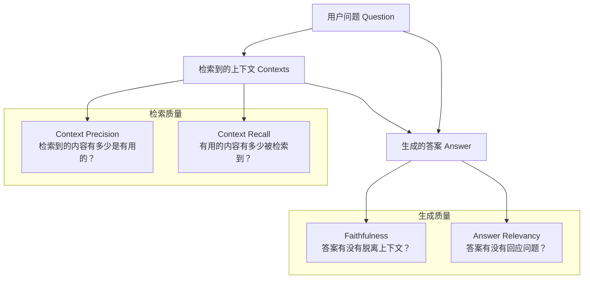
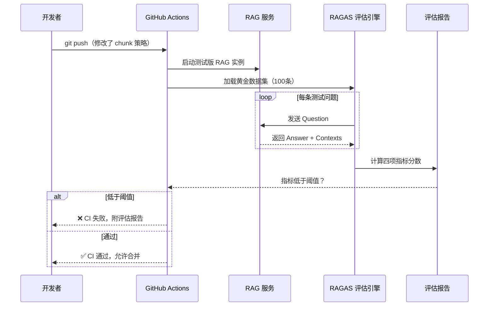

## 2.6 RAG 评估体系（RAGAS 框架）

### 一、核心概念

RAG 系统最难的问题不是搭建，而是你**不知道它有多烂**。

这不是玩笑。大多数团队上线 RAG 系统后，评估方式是：把几个问题丢进去，觉得回答"还不错"，就上线了。结果用户开始抱怨：回答前后矛盾、引用的内容根本没提到这个观点、问了一个文档里有明确答案的问题却说"未找到相关信息"。

问题出在哪？你没有评估指标，只有感觉。

RAG 系统由两个核心组件构成：**检索器**（Retriever）和**生成器**（Generator）。这两个组件都可能独立出问题：检索器可能召回了无关段落，生成器可能忽视了检索结果自行发挥。如果只看最终回答的质量，你根本无法定位问题在哪个环节。

RAGAS（RAG Assessment）框架的价值正在于此——它提供了一套**可分解、可量化、可自动化**的评估指标，分别针对生成器的忠实度、回答的相关性、检索器的精确率和召回率进行独立度量。每个指标都是 [0, 1] 区间的分数，可以串入 CI 流水线，让 RAG 系统的质量有据可依。

---

### 二、原理深讲

#### 2.6.1 四大核心指标



**① Faithfulness（忠实度）—— 防幻觉的核心指标**

**工程动机**：生成器最常见的问题是"越权发挥"——检索到的段落只提到了 A，但模型结合自身参数知识额外生成了 B 和 C，这在 LLM 能力强的时候尤其明显。Faithfulness 就是在度量这个问题。

**计算方式**：
1. 让 LLM 把生成的答案分解为若干原子陈述（atomic claims），例如"张三是 CEO"、"公司成立于 2010 年"
2. 对每个原子陈述，判断是否可以从检索上下文中**直接推断**出来
3. `Faithfulness = 可以被上下文支持的陈述数 / 总陈述数`

**工程建议**：Faithfulness 低通常意味着两类问题：一是检索召回率不够，模型被迫"猜测"；二是生成器的 System Prompt 没有严格约束"只基于上下文回答"。先看 Context Recall，再调 Prompt。

---

**② Answer Relevancy（答案相关性）—— 检测废话和跑题**

**工程动机**：Faithfulness 高并不代表答案好。模型可能只重复了上下文的内容，但完全没有正面回答问题，或者答案充斥着"根据以上信息"这类废话。

**计算方式**（反向验证法，非常巧妙）：
1. 给定生成的答案，让 LLM 反向生成 N 个可能对应这个答案的问题
2. 计算这些反向生成的问题与原始问题之间的余弦相似度均值
3. 相似度越高，说明答案越紧扣原始问题

**工程建议**：Answer Relevancy 低通常是 Prompt 问题，而非检索问题。检查是否给了模型过多"格式化回答"的指令，导致答案冗长且中心漂移。

---

**③ Context Precision（上下文精确率）—— 检索噪声度量**

**工程动机**：检索器返回 Top-K 个段落，但这些段落里有多少是真正有用的？如果大量无关段落混入上下文，会稀释关键信息，干扰 LLM 的注意力，导致生成质量下降。

**计算方式**：
1. 对每个检索到的段落，判断它是否对生成正确答案有帮助（需要 Ground Truth 答案作为参照）
2. 考虑排序权重——排在前面的有用段落贡献更高的精确率分数（加权平均 Precision@K）

**工程建议**：Context Precision 低，优先考虑：① 调整切块粒度（过大的 chunk 混入大量无关内容）；② 接入 Reranker（见 2.5 节）重排检索结果；③ 加大 Embedding 模型在垂直领域的表现评测。

---

**④ Context Recall（上下文召回率）—— 检索覆盖度量**

**工程动机**：能找到相关段落是最基础的要求。如果文档里明明有答案，检索器却没有召回，后续一切优化都是无用功。

**计算方式**：
1. 把 Ground Truth 答案分解为原子陈述
2. 对每个原子陈述，判断是否能在检索到的上下文中找到支撑
3. `Context Recall = 被上下文覆盖的陈述数 / 总陈述数`

**工程建议**：Context Recall 低，排查顺序：① 切块策略（关键信息是否被切碎跨越了两个 chunk）；② Embedding 模型是否适配垂直领域（通用 Embedding 在专业术语上召回率差）；③ 考虑引入稀疏检索（BM25）的混合检索策略。

---

**四指标联合诊断矩阵**

| 症状 | Faithfulness | Answer Relevancy | Context Precision | Context Recall | 诊断方向 |
|---|---|---|---|---|---|
| 回答正确但啰嗦 | 高 | 低 | - | - | 优化生成 Prompt |
| 回答编造内容 | 低 | - | - | - | 限制生成边界 / 提升 Context Recall |
| 返回大量无关内容 | - | - | 低 | - | 优化切块 / 接入 Reranker |
| 文档有答案但没检索到 | - | - | - | 低 | 优化检索策略 / 切块方式 |
| 各项均低 | 低 | 低 | 低 | 低 | 系统性重新设计 |

---

#### 2.6.2 构建黄金评估数据集

RAGAS 的四个指标需要两类输入：**测试问题**（Question）和**标准答案**（Ground Truth）。这就是所谓的"黄金评估数据集"（Golden Dataset）——它是 RAG 评估的地基，数据集质量直接决定指标可信度。

```mermaid
flowchart LR
    subgraph 方式一：人工标注
        D1[领域专家] --> Q1[撰写代表性问题]
        Q1 --> A1[标注标准答案]
        A1 --> V1[交叉验证]
    end

    subgraph 方式二：LLM 自动生成
        D2[知识库文档] --> LLM[LLM 生成 QA 对]
        LLM --> Filter[质量过滤]
        Filter --> Sample[人工抽样复核 10-20%]
    end

    V1 --> GD[黄金数据集]
    Sample --> GD
```

**人工标注 vs LLM 自动生成对比**

| 维度 | 人工标注 | LLM 自动生成 |
|---|---|---|
| 质量上限 | 高（专家级） | 中（受 LLM 能力限制） |
| 成本 | 高（100条需数天） | 低（分钟级生成千条） |
| 覆盖率 | 低（依赖人工精力） | 高（可覆盖全文档） |
| 偏差风险 | 人工偏见 | LLM 风格一致性偏差 |
| 推荐规模 | 50–200 条核心问题 | 500–2000 条自动生成 |

**实践建议**：两者结合效果最好。用 LLM 批量生成后，让领域专家抽样复核 15-20% 的数据，重点检查：① 问题是否清晰无歧义；② 标准答案是否可以从文档中直接支撑（避免引入文档外知识）；③ 问题分布是否覆盖了系统实际会遇到的查询类型（事实性问题、推理性问题、比较性问题）。

**LLM 生成 QA 对的示意**：

```python
# 示意代码，非完整实现
GENERATION_PROMPT = """
基于以下文档片段，生成3个高质量的问答对。
要求：
1. 问题需要阅读文档才能回答，不能是常识性问题
2. 答案必须完全来自文档内容，不引入外部知识
3. 包含不同类型：事实查找、原因解释、比较分析

文档：{chunk}

输出 JSON 格式：[{{"question": "...", "answer": "..."}}]
"""
```

---

#### 2.6.3 CI 集成：把评估嵌入开发流程

评估数据集有了，更重要的是让评估**自动运行**。每次修改切块策略、更换 Embedding 模型、调整 Reranker，都应该自动触发评估，防止效果悄悄退化。



**阈值设置建议**：

```yaml
# .ragas-thresholds.yaml 示例
thresholds:
  faithfulness: 0.85        # 低于此值说明幻觉严重
  answer_relevancy: 0.80    # 低于此值答案质量差
  context_precision: 0.75   # 低于此值检索噪声多
  context_recall: 0.80      # 低于此值检索覆盖不足
```

首次集成时不要设太高的阈值。建议先跑一次全量评估，以当前水平为基线，阈值设为基线的 95%（允许 5% 的自然波动），再随着系统优化逐步提高标准。

---

### 三、工程视角：常见误区与最佳实践

**误区 1：用 LLM 生成的 QA 对直接评估，不做人工复核**
→ **正确做法**：LLM 生成 QA 对时有明显的"出题偏向"——倾向于生成浅层事实性问题，回避推理类和比较类问题；且标准答案可能包含 LLM 的背景知识而非文档内容。必须人工抽样 15% 以上进行质量把关，重点检查标准答案是否完全有文档支撑。

**误区 2：测试集 QA 对与检索文档存在内容重叠（数据污染）**
→ **正确做法**：黄金数据集必须从**同一份知识库文档**生成，但要确保 QA 对本身不直接复制原文作为答案。如果 Ground Truth 和 chunk 文本几乎相同，Context Recall 会虚高（检索到原文段落直接匹配），无法真实反映系统性能。答案应使用不同表述方式写出。

**误区 3：只盯着综合评分，不看单项指标**
→ **正确做法**：四个指标反映的是 RAG 流水线的不同环节，综合分数会掩盖问题。一个常见的陷阱是：Context Precision 低（检索噪声多）但 Faithfulness 高（模型忠实地引用了那些噪声内容），综合分数看起来还不错，但用户体验很差。应该建立各项指标的独立监控面板。

**误区 4：评估数据集一次生成，永远不更新**
→ **正确做法**：知识库随业务迭代，评估数据集也要同步更新。每次大规模更新文档后，应补充至少 10-20% 的新 QA 对覆盖新增内容，并清理已失效问题（文档已删除的段落对应的问题）。建议用版本控制管理评估数据集。

**误区 5：RAGAS 评估成本不计入系统成本**
→ **正确做法**：RAGAS 的四个指标底层都调用 LLM（通常是 GPT-4 级别）进行判断，每次评估 100 条问题的成本在 \$2–5 之间。评估集超过 1000 条时，频繁在 CI 中跑全量评估成本不可忽视。推荐策略：PR 触发时跑核心 100 条快速评估，每周定时跑全量评估。

---

### 四、延伸思考

> 🤔 **思考题 1**：RAGAS 的四个指标本质上都依赖 LLM 来做裁判（判断"是否支持"、"是否相关"），这意味着评估结果的可靠性受评判 LLM 本身能力的制约。当你的 RAG 系统使用 GPT-4o 作为生成器，同时用 GPT-4o 作为 RAGAS 的评判 LLM，这种"自我评估"是否存在系统性偏差？你会如何设计更稳健的评估方案？

> 🤔 **思考题 2**：RAGAS 评估的是"检索到的内容有没有被正确使用"，但它无法度量一个更根本的问题："检索器有没有找到知识库里**最相关**的内容"——因为这需要人工标注每个问题的"完美上下文"。随着知识库规模扩展到百万文档级别，这种标注成本是否会成为 RAG 评估的根本瓶颈？有哪些可能的解法？
