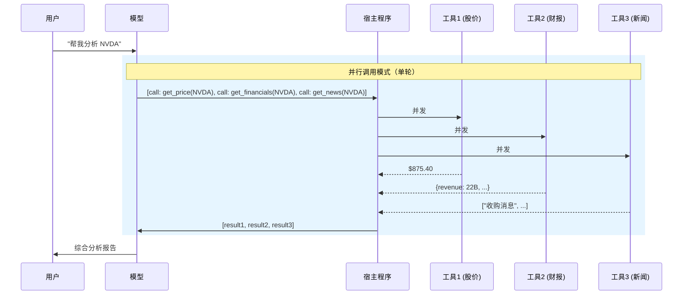
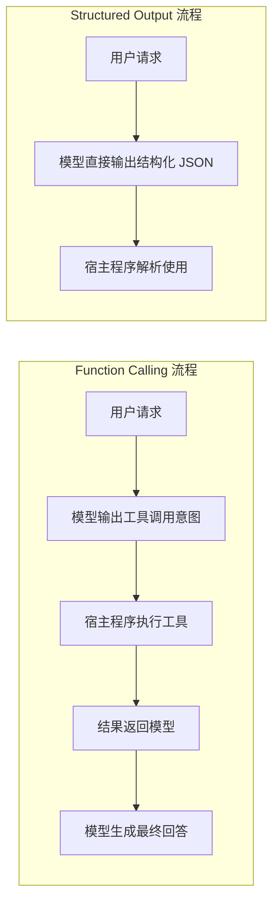

# 3.1 Function Calling 原理与协议

## 一、核心概念

LLM 本质上是一个文本生成器——你给它文字，它还你文字。但真实的工程场景里，光靠文字远远不够：查一下当前股价、执行一条 SQL、发一封邮件，这些都需要和外部系统交互。最早的"解法"是在 Prompt 里写"请返回 JSON，我来解析"，然后用正则或 `json.loads` 硬扒。这条路走得很痛苦——模型可能加 markdown 代码块、可能字段名大小写不一致、可能在 JSON 里夹杂解释文字，解析逻辑脆得一碰就碎。

Function Calling（2023 年 6 月 OpenAI 正式发布，后被各家跟进）从协议层解决了这个问题。它的本质不是"教模型调函数"，而是**在模型输出和宿主程序之间建立一套结构化契约**：开发者用 JSON Schema 声明"我有哪些工具、每个工具接收什么参数"，模型在需要时输出一个符合 Schema 的结构化调用请求，宿主程序执行后把结果还给模型，模型再继续生成。整个过程里，"执行"永远发生在宿主程序侧，模型只负责"决策调用什么、传什么参数"。

这个设计有两个深远影响：一是解析可靠性大幅提升（模型针对 Schema 做了对齐训练）；二是工具调用从 Prompt Hack 升级为**原生协议**，框架、SDK、可观测性工具都可以围绕它标准化。

---

## 二、原理深讲

### 2.1 JSON Schema 工具定义规范与参数设计

#### 工程动机

模型需要知道三件事才能正确调用工具：**叫什么名字、做什么用、接受哪些参数**。JSON Schema 就是传递这三件事的载体。写得好，模型调用准确率高；写得糟，模型要么乱传参数，要么根本不知道该用哪个工具。

#### 核心机制

一个标准工具定义的结构如下（以 OpenAI 格式为例，其他厂商大同小异）：

```python
tool = {
    "type": "function",
    "function": {
        "name": "get_stock_price",          # 工具名：动词_名词，清晰动作导向
        "description": "查询指定股票代码的实时价格，仅支持 A 股和港股",  # 关键！模型靠描述决定用不用
        "parameters": {
            "type": "object",
            "properties": {
                "symbol": {
                    "type": "string",
                    "description": "股票代码，如 '600519'（A股）或 '00700'（港股）",
                    "pattern": "^[0-9]{5,6}$"   # 可选：用正则约束格式
                },
                "market": {
                    "type": "string",
                    "enum": ["A", "HK"],          # 枚举值明确限定范围
                    "description": "市场类型"
                }
            },
            "required": ["symbol"],               # 必填参数显式声明
            "additionalProperties": false          # 禁止额外字段，防止幻觉参数
        }
    }
}
```

#### 工程建议

**`description` 字段是核心，不是注释**。模型路由工具的决策完全依赖 `name` + `description`，参数的 `description` 决定模型能否正确填值。几条高价值的写法原则：

- **工具描述写使用边界**：不只写"能做什么"，还要写"不能做什么"或"适用范围"。例如"仅支持 A 股和港股"能防止模型拿美股代码来调用。
- **参数描述给示例**：`"股票代码，如 '600519'（A股）"` 比 `"股票代码"` 的准确率提升显著。
- **枚举值优先于字符串**：能用 `enum` 约束的字段就不要用开放 `string`，模型填错的概率大幅降低。
- **`required` 必须精确**：漏掉必填参数，模型可能传 `null`；把可选参数放进去，模型会强行编一个值。

---

### 2.2 并行工具调用 vs 串行调用

#### 工程动机

单次 Agent 任务往往需要多个工具。"查股价 → 查财报 → 查新闻"如果每次只调一个工具，每次都要走一个完整的 LLM 推理轮次，延迟叠加、成本叠加。并行工具调用（Parallel Tool Use）允许模型在一次响应里输出多个工具调用请求，宿主程序并发执行，再把所有结果一次性还给模型。



对比串行调用：同样三个工具，串行需要 3 轮 LLM 推理，假设每轮 1s，总延迟 ≥ 3s；并行只需 1 轮，总延迟 ≈ max(工具执行时间) + 1 次 LLM 推理。

#### 选型决策

| 场景特征 | 推荐模式 | 原因 |
|---------|---------|------|
| 工具间无依赖（如同时查多个数据源） | **并行** | 延迟最小，成本最低 |
| 工具 B 的入参依赖工具 A 的输出 | **串行** | 数据依赖不可并行 |
| 工具有副作用（写入、发送消息） | **串行** | 防止竞态条件，便于回滚 |
| 工具有幂等性且相互独立 | **并行** | 可安全并发 |
| 工具调用结果需要中间判断再决定下一步 | **串行** | 需要模型介入决策 |

#### 代码层面处理

并行调用时，模型一次返回多个 `tool_calls`，宿主程序需要并发执行并将所有结果按 `tool_call_id` 对应地返回：

```python
# 伪代码：并发执行所有工具调用
import asyncio

async def execute_tool_calls(tool_calls):
    tasks = [execute_single_tool(tc) for tc in tool_calls]
    results = await asyncio.gather(*tasks)          # 并发执行
    return [
        {"role": "tool", "tool_call_id": tc.id, "content": str(r)}
        for tc, r in zip(tool_calls, results)
    ]
```

---

### 2.3 Structured Output 与 Function Calling 的关系与区别

#### 常见混淆

两者都能让模型输出结构化 JSON，很多人把它们当成一回事——这是个高频踩坑点。

**Function Calling**：模型输出的是"我要调用某个工具、传某些参数"这个**意图声明**，后续需要宿主程序去真正执行这个工具。它的 Schema 描述的是工具的接口签名。

**Structured Output**（OpenAI 2024.08 发布）：模型直接输出符合你给定 JSON Schema 的**最终内容**，没有"工具执行"这一步。它解决的是"我不需要调外部接口，只是想让模型的输出有固定格式"的需求。



#### 选型对比

| 维度 | Function Calling | Structured Output |
|------|-----------------|-------------------|
| **本质** | 工具调用意图声明 | 格式化内容生成 |
| **是否需要外部执行** | ✅ 必须 | ❌ 不需要 |
| **典型用途** | 查数据、执行操作、调 API | 信息提取、分类打标、生成报告 |
| **Schema 复杂度** | 中（工具参数） | 高（可描述复杂嵌套结构） |
| **格式保证** | 较高（参数层面） | 极高（100% 符合 Schema） |
| **支持厂商** | 几乎全部主流模型 | OpenAI / 部分开源模型 |

**决策口诀**：需要调外部接口 → Function Calling；只需要让模型输出结构化文本 → Structured Output。

**一个容易出错的场景**：用 Function Calling 做信息提取（如"从这段文字中提取姓名、日期、金额"）。这完全不需要工具执行，用 Structured Output 更直接、更可靠、成本更低。但很多人习惯性地定义一个 `extract_info` 的假工具来绕路实现——这在 Structured Output 出现之前是无奈之举，现在是反模式。

---

## 三、工程视角：常见误区与最佳实践

**误区一：工具描述写成 API 文档风格** → **正确做法**：描述要面向模型的"理解"而非面向人类的"阅读"。模型判断"要不要用这个工具"依赖描述，所以要写清楚触发条件："当用户问到实时价格时使用，历史价格请用 `get_historical_price`"。在工具多（>10个）时，这种边界描述能显著降低工具选错率。

**误区二：把并行调用的工具结果顺序搞乱** → **正确做法**：并行执行后，返回 `tool` 消息时必须通过 `tool_call_id` 和对应调用关联，而不是按执行完成顺序堆砌。顺序错乱会导致模型把 A 工具的结果当成 B 工具来解读，产生严重幻觉。务必维护 `tool_call_id → result` 的映射关系。

**误区三：把 Structured Output 当成 Function Calling 的替代品** → **正确做法**：认清两者的本质差异（见 2.3 节表格）。混用最典型的灾难场景：用 Structured Output 让模型"生成"一个查询语句然后自己"假装执行"——模型根本无法真正查数据库，输出的是幻觉 SQL 结果。

**误区四：`additionalProperties` 不设为 `false`** → **正确做法**：在参数 Schema 里加上 `"additionalProperties": false`。不加的话，模型可能在参数里塞入不存在的字段（如自己发明一个 `currency` 参数），Pydantic 等校验框架会直接报错，或者这些幻觉参数被静默忽略后导致逻辑 bug。

**误区五：在工具结果里返回大量无关信息** → **正确做法**：工具返回值会占用上下文窗口，且模型倾向于把 Tool Result 里的内容当成"事实"。返回值应精简、结构化，去掉原始 HTML、日志、冗余字段。如果原始响应很大，在宿主程序侧先做过滤再返回模型，避免上下文污染和不必要的 Token 消耗。

---

## 四、延伸思考

> 🤔 **思考题一**：随着模型上下文窗口越来越长（1M Token），是否意味着工具调用会逐渐被"把所有资料塞进上下文"所替代？Function Calling 的不可替代性边界在哪里？（提示：思考副作用操作、实时数据、成本三个维度）

> 🤔 **思考题二**：当工具数量膨胀到 100+ 时，把全部工具定义一次性放进 `tools` 参数会带来什么问题？这和 RAG 的"检索"思想能否结合——即动态检索当前任务最相关的工具子集传给模型？这种"工具路由"架构会引入哪些新的工程复杂度？（Module 3.4 将展开讨论）
