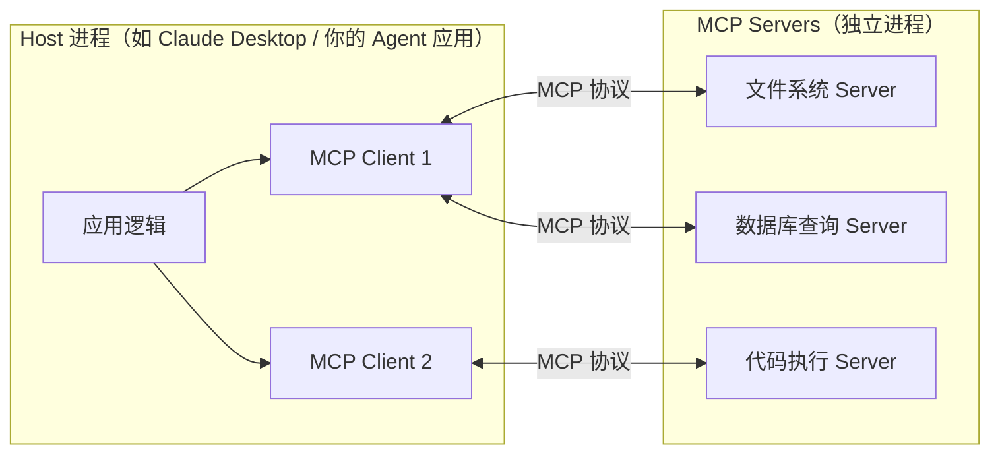
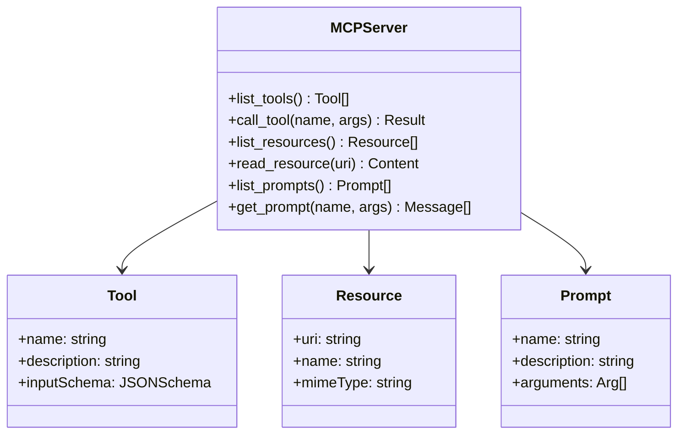

# 3.2 MCP 协议详解

### 一、核心概念

在 Function Calling 普及之前，每个 AI 应用都要自己实现工具集成——搜索、数据库、文件系统各写一套胶水代码，换一个模型提供商就要重写一遍。更麻烦的是，Claude 的工具调用格式和 OpenAI 的不一样，LangChain 又有自己的 Tool 抽象，生态碎片化严重。

MCP（Model Context Protocol）是 Anthropic 在 2024 年 11 月开源的工具接入标准协议，目标是做 AI 工具生态的"USB-C"——定义统一接口，让任何 LLM 应用都能无缝接入任何工具服务，而无需关心对方的实现细节。它解决的不是"模型能不能调工具"的问题（Function Calling 已经解决了），而是"工具如何被标准化地注册、发现和调用"的工程问题。

理解 MCP 的关键一句话：**MCP 把工具服务器（MCP Server）变成了可独立部署、可复用的能力单元**，而不是散落在各个应用里的硬编码函数。

---

### 二、原理深讲

#### 2.1 三层架构：Host / Client / Server

MCP 的架构分三层，职责清晰：



**Host** 是 AI 应用本身（Claude Desktop、你自己开发的 Agent 服务），它持有 LLM 连接和对话上下文，负责决策"要不要调工具"。

**MCP Client** 是 Host 内部的协议客户端，每个 Client 对应一个 Server 连接，负责协议握手、能力发现和消息路由。通常由框架（如 LangChain、Claude SDK）内置实现，开发者很少需要手写。

**MCP Server** 是对外暴露能力的独立进程，实现了协议规定的接口，可以用任何语言写（官方提供 Python/TypeScript SDK）。它不知道谁在调用自己，也不持有 LLM 状态——这种解耦是 MCP 可复用性的基础。

**工程建议**：Server 设计为无状态更易维护，如果必须有状态（如数据库连接池），用进程内单例管理，不要依赖 Client 传递状态。

---

#### 2.2 Transport 层：stdio vs HTTP+SSE

MCP 协议本身是语言无关的，但消息怎么传输取决于部署场景：

| 维度 | stdio | HTTP + SSE |
|------|-------|------------|
| 适用场景 | 本地工具、CLI 集成 | 远程服务、多客户端共享 |
| 部署方式 | Host 直接 fork 子进程 | 独立部署为 HTTP 服务 |
| 延迟 | 极低（进程内 IPC） | 网络延迟，通常 1-10ms |
| 安全性 | 天然隔离，无网络暴露 | 需要 TLS + Auth |
| 扩展性 | 每个 Host 实例启动独立子进程 | 多 Host 共享同一 Server |
| 典型案例 | Claude Desktop 本地插件 | 企业内部共享工具平台 |

**stdio 模式**的工作原理：Host 通过 `subprocess` fork 出 Server 进程，通过 stdin/stdout 交换 JSON-RPC 消息。消息格式严格，每行一条 JSON，换行符作为消息分隔符。

```
Host进程                    Server子进程
    |                           |
    |-- stdin: {"method":"initialize",...} -->|
    |<-- stdout: {"result":{"capabilities":{...}}} --|
    |-- stdin: {"method":"tools/call",...} -->|
    |<-- stdout: {"result":{...}} --|
```

**HTTP+SSE 模式**下，Server 是一个标准 HTTP 服务。Client 先发 POST 请求，Server 通过 SSE（Server-Sent Events）推送响应，支持流式返回长内容。这种模式适合需要跨团队共享或部署在 K8s 的场景。

> **注意**：截至 2024 年底，MCP 规范中 HTTP 传输层正在从 HTTP+SSE 向 Streamable HTTP 演进（单一端点同时支持请求/响应和流式推送），新实现建议参考官方最新规范而非早期文档。

**选型建议**：
- 开发阶段和本地工具 → stdio，调试简单，`print()` 直接看日志
- 生产环境、多租户、需要 Auth → HTTP，配合反向代理和 JWT

---

#### 2.3 三类能力：Tools / Resources / Prompts

MCP Server 可以向 Host 暴露三种能力，理解它们的区别是设计 Server 的关键：



**Tools（工具）** 是最常用的能力类型，对应"执行一个操作并返回结果"——查询数据库、调用 API、执行代码。Tool 有明确的输入 Schema（JSON Schema 格式），模型根据 schema 生成参数，Host 校验后调用。设计原则：每个 Tool 职责单一，description 要精准（这是模型选工具的依据，比函数名更重要）。

**Resources（资源）** 是"给模型读取上下文"用的，类似只读文件系统。Resources 通过 URI 寻址（如 `file:///config.yaml`、`db://users/123`），返回文本或二进制内容注入到上下文窗口。适合提供静态配置、文档片段、数据库记录的读取——这些操作不需要模型"决策调用"，而是由 Host 主动拉取。

**Prompts（提示词模板）** 是服务器端定义的可复用提示词，支持参数化。比如一个代码审查 Server 可以注册一个 `review_code` Prompt，接受 `language` 和 `code` 参数，返回结构化的审查指令。这个能力在 Claude Desktop 中体现为"/"斜杠命令。**工程实践中这类能力使用较少**，大多数 Agent 框架会在应用层管理 Prompt，无需下沉到 Server。

**三类能力的工程直觉**：

| 能力 | 谁触发 | 有无副作用 | 典型用途 |
|------|--------|-----------|----------|
| Tools | LLM 决策调用 | 有（写操作） | 执行动作、查询数据 |
| Resources | Host 主动拉取 | 无（只读） | 提供上下文 |
| Prompts | 用户/Host 触发 | 无 | 复用提示词模板 |

---

### 三、工程视角：常见误区与最佳实践

**误区一：Tool description 随便写**
→ **正确做法**：description 是模型选择工具的唯一依据，必须清晰描述"什么情况下用这个工具、能做什么、不能做什么"。尤其当工具数量超过 10 个时，description 写得模糊会导致模型频繁选错工具或参数填错。推荐格式：`[动词] [对象]，当[场景]时使用，返回[结果格式]`。

**误区二：Server 里直接 print() 调试**
→ **正确做法**：stdio 模式下，stdout 是协议信道，任何非 JSON 输出都会破坏消息帧，导致 Host 解析失败且报错信息极难定位。调试日志必须写到 stderr（`print(..., file=sys.stderr)`）或写文件。HTTP 模式没有这个问题。

**误区三：一个 Server 塞所有工具**
→ **正确做法**：按领域边界拆分 Server（文件系统一个、数据库一个、外部 API 一个），好处有三：独立部署升级互不影响；权限控制粒度更细（生产库 Server 只授权特定 Agent）；单 Server 崩溃不影响其他能力。Claude Desktop 的设计哲学也是如此：每个插件对应一个独立 Server 进程。

**误区四：忽略 Server 的错误返回规范**
→ **正确做法**：Tool 调用失败时不要抛异常让 Host 崩溃，要返回带 `isError: true` 的结构化结果，并在 content 里给出人类可读的错误描述（如"数据库连接失败，请检查 DB_URL 配置"）。LLM 能读懂错误信息并自动重试或向用户说明，比堆栈报错信息有用得多。

**误区五：在 Server 里做鉴权**
→ **正确做法**：stdio 模式的 Server 天然只被 Host 进程访问，无需额外鉴权；HTTP 模式的 Server 鉴权应在反向代理层（Nginx/API Gateway）处理，而不是在 Server 业务代码里写一遍。Server 内部可以通过环境变量接收服务凭证（数据库密码、API Key），但不要实现自己的 Token 验证逻辑——职责分离。

---

### 四、延伸思考

> 🤔 **思考题一**：MCP Server 的 Resources 能力和 RAG 的向量检索在本质上都是"给模型提供上下文"，那什么情况下应该用 Resource，什么情况下应该走 RAG 检索？两者能否结合——比如把向量检索结果封装为 Resource 返回？

> 🤔 **思考题二**：当 Agent 需要调用 50+ 个工具时，把所有工具一次性塞进系统提示会消耗大量 Token，且模型选工具的准确率会下降。MCP 协议本身并没有解决"工具发现"问题——你会如何在 Host 层设计一个动态工具路由机制，在每次 LLM 调用前只注入最相关的工具子集？（提示：参考 Module 3.4 工具可靠性章节的工具路由设计）
