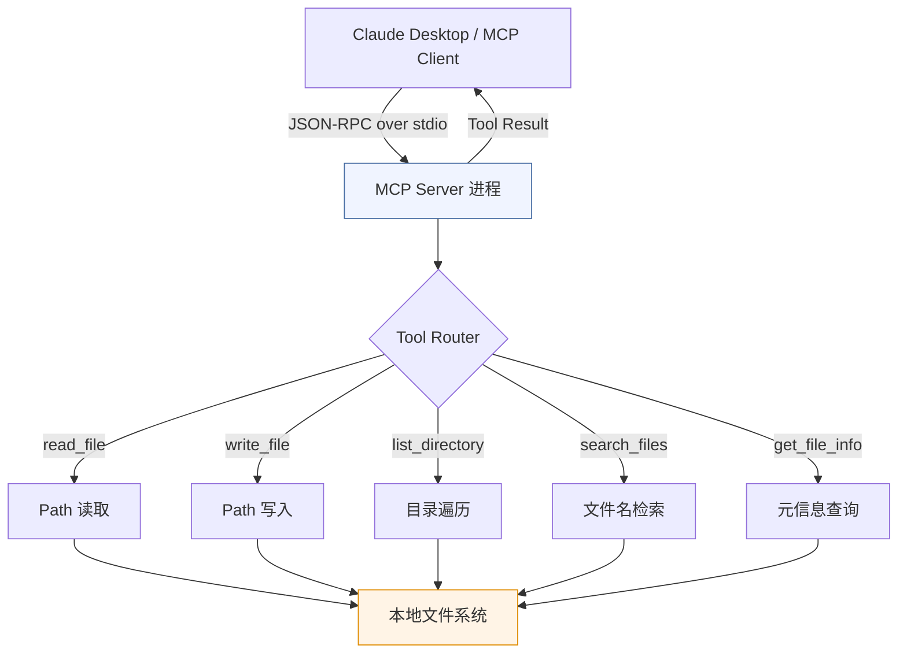

# 3.2.1 【动手一】文件系统操作 MCP Server

**难度** ⭐⭐ | **类型** Tools | **适合人群** 入门首选

---

## 实验目标

完成本节实验后，你将拥有一个能被 Claude 直接调用的本地文件系统 MCP Server，并通过它让 Claude 读取、写入、搜索你的本地文件。

核心学习点有三个：第一，理解 MCP 的 Tool 注册机制——为什么用装饰器而不是函数注册表；第二，掌握 stdio transport 模式的工作原理，以及何时应该用 HTTP+SSE 替代它；第三，建立对 MCP Server 安全边界设计的工程意识——一个没有路径白名单的文件系统 Server 在生产环境是危险的。

---

## 架构总览



MCP 协议的通信模型：Claude（Host 层的 Client）通过 stdio 启动 Server 子进程，双方用 JSON-RPC 2.0 格式交换消息。Server 向 Client 暴露工具列表，Claude 决定何时调用哪个工具，Server 执行后返回结果。**整个链路是同步阻塞的**——这是 stdio transport 的关键限制，处理大文件时要格外注意。

---

## 环境准备

```bash
# 创建项目目录
mkdir mcp-filesystem && cd mcp-filesystem

# 用 uv 创建虚拟环境并激活
uv venv --python 3.11
source .venv/bin/activate  # Windows: .venv\Scripts\activate

# 安装依赖（锁定版本，保证可复现）
uv pip install "fastmcp>=2.0.0" "python-dotenv>=1.0.0"

# 验证安装
python -c "import fastmcp; print('fastmcp installed')"
```

> Colab 用户：`!pip install "fastmcp>=2.0.0" "python-dotenv>=1.0.0"` 即可，无需创建虚拟环境。Colab 上通过 HTTP transport 验证，stdio 模式需要本地终端。

> ⚠️ **版本说明**：MCP Python SDK 在 1.x 阶段迭代较快，`fastmcp` 是官方提供的高层封装，底层调用 `mcp.server` 核心库。如果遇到 `ImportError: cannot import name 'FastMCP'`，检查 fastmcp 版本是否 ≥ 2.0。

---

## Step-by-Step 实现

### Step 1：初始化 Server 与安全边界

**目标**：创建 MCP Server 实例，并在初始化阶段建立路径白名单机制。不做白名单的文件系统 Server 等于给 Claude 开了一个无限制的 shell，这是生产环境绝对不可接受的。

```python
# filesystem_server.py
import os
import stat
import fnmatch
from datetime import datetime
from pathlib import Path
from typing import Optional

from fastmcp import FastMCP

# 文件大小上限：避免 Claude 把一个 2GB 的日志文件整个读进上下文
MAX_FILE_SIZE_BYTES = int(os.environ.get("MCP_MAX_FILE_SIZE", 1024 * 1024))  # 默认 1MB

def _get_allowed_root() -> Path:
    """
    动态获取允许的根目录。
    优先从环境变量读取，让部署时灵活配置；默认限制在当前工作目录。
    动态获取确保环境变量在运行时生效，而不是在模块加载时就固定。
    """
    return Path(
        os.environ.get("MCP_ALLOWED_ROOT", Path.cwd())
    ).expanduser().resolve()

def _safe_path(raw: str) -> Path:
    """
    将用户传入的路径解析为绝对路径，并校验是否在白名单根目录内。

    使用 Path.resolve() 而非简单的字符串前缀匹配，是为了防止路径穿越攻击：
    ../../../etc/passwd 经过 resolve() 后会暴露真实绝对路径，从而被拦截。
    """
    allowed_root = _get_allowed_root()
    resolved = Path(raw).expanduser().resolve()
    # is_relative_to 是 Python 3.9+ 的方法，确保路径在白名单内
    if not resolved.is_relative_to(allowed_root):
        raise PermissionError(
            f"路径 '{raw}' 超出允许的根目录 '{allowed_root}'。"
            f"请设置环境变量 MCP_ALLOWED_ROOT 扩大访问范围。"
        )
    return resolved


# ── Server 初始化 ──────────────────────────────────────────────────────────────
def _get_server_instructions() -> str:
    """动态生成 Server 级别的系统提示。"""
    return (
        f"你可以操作本机文件系统，根目录限定为：{_get_allowed_root()}。"
        f"单文件最大读取 {MAX_FILE_SIZE_BYTES // 1024}KB。"
        "写操作会直接修改磁盘文件，请在执行前向用户确认。"
    )


# 供外部导入的只读常量，值在模块加载时从环境变量读取
ALLOWED_ROOT = _get_allowed_root()

mcp = FastMCP(
    name="filesystem-server",
    # instructions 是 Server 级别的系统提示，会注入给调用方的 LLM。
    # 清晰说明能力边界，有助于 Claude 做出更准确的工具选择。
    instructions=_get_server_instructions(),
)
```

**关键点**：
- `_safe_path()` 是整个 Server 的安全核心，所有 Tool 都必须经过它处理路径，任何直接使用原始字符串的代码都是漏洞。
- `_get_allowed_root()` 采用**动态获取**而非模块级常量，确保环境变量在运行时修改后仍然生效（而非在模块加载时就固定）。
- `instructions` 字段不是装饰性注释，它会出现在 Claude 的 tool schema 描述中，影响模型判断何时以及如何调用这个 Server。
- ⚠️ 不要用 `str.startswith(ALLOWED_ROOT)` 做路径检查——`/tmp/safe_dir/../etc/passwd` 这类输入会绕过字符串前缀检查。

---

### Step 2：实现 `read_file` 与 `get_file_info`

**目标**：实现文件读取和元信息查询两个只读工具。只读工具是入门首选，副作用为零，适合先把整体链路跑通。

```python
@mcp.tool()
def read_file(path: str) -> str:
    """读取指定文件的内容。"""
    p = _safe_path(path)
    if not p.is_file():
        raise FileNotFoundError(f"文件不存在: {path}")
    file_size = p.stat().st_size
    if file_size > MAX_FILE_SIZE_BYTES:
        raise ValueError(
            f"文件大小 ({file_size // 1024}KB) 超过限制 ({MAX_FILE_SIZE_BYTES // 1024}KB)"
        )
    return p.read_text(encoding="utf-8")


@mcp.tool()
def get_file_info(path: str) -> dict:
    """获取文件的元信息（大小、修改时间、权限等）。"""
    p = _safe_path(path)
    if not p.exists():
        raise FileNotFoundError(f"文件不存在: {path}")
    st = p.stat()
    return {
        "path": str(p),
        "name": p.name,
        "size_bytes": st.st_size,
        "size_human": f"{st.st_size / 1024:.1f}KB" if st.st_size < 1024 * 1024 else f"{st.st_size / (1024 * 1024):.1f}MB",
        "modified": datetime.fromtimestamp(st.st_mtime).isoformat(),
        "created": datetime.fromtimestamp(st.st_ctime).isoformat(),
        "is_file": p.is_file(),
        "is_dir": p.is_dir(),
        "permissions": stat.filemode(st.st_mode),
    }
```

**关键点**：
- `read_file()` 在文件不存在或超大时**直接抛出异常**（`FileNotFoundError` / `ValueError`），而非返回错误字符串。MCP 协议会将异常序列化为 error response。
- `get_file_info()` 返回 `is_file` / `is_dir` 布尔字段，让 Claude 能判断目标类型。
- `size_human` 用简单的 KB/MB 两档格式，而非多档循环计算。

---

### Step 3：实现 `list_directory` 与 `write_file`

**目标**：补全目录浏览和文件写入能力。`write_file` 是有副作用的工具，需要在 docstring 中明确声明，让 Claude 在调用前向用户确认。

```python
def _build_tree(dir_path: Path, max_depth: int, current_depth: int = 0) -> list:
    """递归构建目录树结构。"""
    if current_depth >= max_depth:
        return []
    children = []
    try:
        entries = sorted(dir_path.iterdir(), key=lambda x: (not x.is_file(), x.name))
    except PermissionError:
        return ["[Permission Denied]"]
    for entry in entries:
        if entry.is_file():
            children.append({"name": entry.name, "type": "file", "size": entry.stat().st_size})
        elif entry.is_dir():
            children.append({
                "name": entry.name,
                "type": "directory",
                "children": _build_tree(entry, max_depth, current_depth + 1),
            })
    return children


@mcp.tool()
def list_directory(path: str = ".", max_depth: int = 1) -> dict:
    """列出目录内容，支持递归深度控制。"""
    p = _safe_path(path)
    if not p.is_dir():
        raise NotADirectoryError(f"不是目录: {path}")
    children = _build_tree(p, max_depth)
    return {
        "root": str(p),
        "children": children,
        "summary": f"目录 {p} 共 {len(children)} 个条目",
    }


@mcp.tool()
def write_file(path: str, content: str) -> dict:
    """创建或覆盖文件。"""
    p = _safe_path(path)
    p.parent.mkdir(parents=True, exist_ok=True)
    p.write_text(content, encoding="utf-8")
    return {"status": "success", "path": str(p), "bytes_written": len(content.encode("utf-8"))}
```

**关键点**：
- `_build_tree()` 是 `list_directory` 的辅助函数，不通过 `@mcp.tool()` 装饰器暴露，只在内部使用。
- `list_directory` 的 `max_depth` **默认值为 1**，且不设上限（由调用者控制）。目录遍历时**不过滤隐藏文件或特定目录**（如 `.git`、`__pycache__`）。
- `write_file` 直接创建或覆盖文件，**无 `overwrite` 参数保护**。父目录不存在时自动创建。
- ⚠️ `p.parent.mkdir(parents=True, exist_ok=True)` 要在 `_safe_path()` 验证之后调用。顺序很重要：先验权限，再操作文件系统。

---

### Step 4：实现 `search_files`

**目标**：实现按关键词搜索文件名，让 Claude 在代码库或文档库中快速定位文件。

```python
@mcp.tool()
def search_files(
    query: str,
    directory: str = ".",
    file_pattern: str = "*",
    max_results: int = 20,
) -> dict:
    """在指定目录中搜索文件名或内容包含 query 的文件。"""
    p = _safe_path(directory)
    if not p.is_dir():
        raise NotADirectoryError(f"不是目录: {directory}")
    matched = []
    total_matches = 0
    for root, dirs, files in os.walk(p):
        root_path = Path(root)
        if not root_path.is_relative_to(_get_allowed_root()):
            dirs.clear()
            continue
        for fname in files:
            if not fnmatch.fnmatch(fname, file_pattern):
                continue
            if query.lower() in fname.lower():
                matched.append(str(root_path / fname))
                total_matches += 1
            if len(matched) >= max_results:
                break
        if len(matched) >= max_results:
            break
    return {
        "matched_files": len(matched),
        "total_matches": total_matches,
        "files": matched,
    }
```

**关键点**：
- `search_files` 搜索的是**文件名**（`query.lower() in fname.lower()`），而非文件内容。这是与全文搜索的区别。
- 使用 `fnmatch.fnmatch()` 实现 `file_pattern` 通配符过滤（如 `"*.py"`）。
- `os.walk()` 递归遍历，每一步都检查 `is_relative_to(_get_allowed_root())` 防止越界。
- 搜索结果包含 `matched_files`（返回数量）和 `total_matches`（总命中数），两者在截断时可能不同。
- ⚠️ 如果需要**全文内容搜索**（而非文件名搜索），需遍历每个文件并逐行匹配——这在大项目中可能耗时较长。

---

### Step 5：启动入口与配置

**目标**：完成 Server 入口，支持 stdio（Claude Desktop）和 HTTP（调试/测试）两种 transport 模式。

`main.py` 作为主入口，加载 `.env` 环境变量后导入并启动 Server：

```python
# main.py
#!/usr/bin/env python3
"""主入口：文件系统 MCP Server"""

import sys
import os

# 确保 .env 文件中的 API Key 被加载
from dotenv import load_dotenv
load_dotenv()

from filesystem_server import mcp, ALLOWED_ROOT

if __name__ == "__main__":
    import argparse

    parser = argparse.ArgumentParser(description="文件系统 MCP Server")
    parser.add_argument(
        "--transport",
        choices=["stdio", "http"],
        default="stdio",
        help="传输方式：stdio（Claude Desktop）或 http（调试模式，默认端口 8000）",
    )
    parser.add_argument("--port", type=int, default=8000, help="HTTP 模式端口号")
    args = parser.parse_args()

    print(f"文件系统 MCP Server 启动", file=sys.stderr)
    print(f"   根目录：{ALLOWED_ROOT}", file=sys.stderr)
    print(f"   传输方式：{args.transport}", file=sys.stderr)

    if args.transport == "http":
        mcp.run(transport="streamable-http", port=args.port)
    else:
        mcp.run(transport="stdio")
```

也可以直接从 `filesystem_server.py` 启动（其内部同样包含 `if __name__ == "__main__"` 入口）：

```bash
# 直接运行 filesystem_server.py
python filesystem_server.py --transport http --port 8000
```

---

## 完整运行验证

### 方式一：Claude Desktop 接入（推荐）

编辑 Claude Desktop 配置文件，路径因系统而异：
- macOS：`~/Library/Application Support/Claude/claude_desktop_config.json`
- Windows：`%APPDATA%\Claude\claude_desktop_config.json`

```json
{
  "mcpServers": {
    "filesystem": {
      "command": "/path/to/your/.venv/bin/python",
      "args": ["/path/to/mcp-filesystem/filesystem_server.py"],
      "env": {
        "MCP_ALLOWED_ROOT": "/Users/yourname/Documents",
        "MCP_MAX_FILE_SIZE": "2097152"
      }
    }
  }
}
```

重启 Claude Desktop，在对话框右下角看到工具图标说明接入成功。验证提示词：

```
帮我列出 ~/Documents 目录结构，找到所有包含"TODO"的 Python 文件，然后把结果摘要写入 todo_summary.md
```

### 方式二：命令行单元验证（不依赖 Claude Desktop）

```python
# test_server.py
# 直接调用 Server 函数进行单元测试，不走 MCP 协议
# 适合 CI 环境或 Colab 调试

import sys, os
os.environ["MCP_ALLOWED_ROOT"] = os.path.expanduser("~/Desktop/workspace/AI-Agent-in-Practice/libs/AI Agent 与大模型应用开发实战手册/第三章 Function Calling MCP 与工具使用/3.2.1 _动手一_文件系统操作 MCP Server")

# 把 Server 文件当模块导入
sys.path.insert(0, ".")
from filesystem_server import read_file, write_file, list_directory, search_files, get_file_info

# ── 测试 1：列目录 ────────────────────────────────────────────────────────────
print("=== list_directory ===")
result = list_directory(".", max_depth=1)
print(f"根目录：{result.get('root')}")
print(f"摘要：{result.get('summary', result.get('children', []))[:10000]}")

# ── 测试 2：写文件 ────────────────────────────────────────────────────────────
print("\n=== write_file ===")
r = write_file("test_output.md", "# 测试文件\n\n由 MCP Server 创建。\n")
print(r)

# ── 测试 3：读文件 ────────────────────────────────────────────────────────────
print("\n=== read_file ===")
content = read_file("test_output.md")
print(content[:200])

# ── 测试 4：文件元信息 ────────────────────────────────────────────────────────
print("\n=== get_file_info ===")
info = get_file_info("test_output.md")
print(info)

# ── 测试 5：搜索文件 ──────────────────────────────────────────────────────────
print("\n=== search_files ===")
r = search_files("MCP", directory=".", file_pattern="*.txt", max_results=5)
print(f"匹配文件数：{r['matched_files']}，总命中：{r['total_matches']}")

# ── 清理 ─────────────────────────────────────────────────────────────────────
import os
if os.path.exists("test_output.md"):
    print("\n=== 清理临时文件 ===")
    os.remove("test_output.md")
    print("\n✅ 测试完成，临时文件已清理")
```

预期输出：
```
=== list_directory ===
根目录：/Users/yourname/.../3.2.1 _动手一_文件系统操作 MCP Server
摘要：目录 /Users/yourname/... 共 N 个条目

=== write_file ===
{'status': 'success', 'path': '/Users/yourname/.../test_output.md', 'bytes_written': 34}

=== read_file ===
# 测试文件

由 MCP Server 创建。

=== get_file_info ===
{'path': '/Users/yourname/.../test_output.md', 'name': 'test_output.md', 'size_bytes': 34, 'size_human': '0.0KB', 'modified': '2025-...', 'is_file': True, 'is_dir': False, 'permissions': '-rw-r--r--'}

=== search_files ===
匹配文件数：N，总命中：N

=== 清理临时文件 ===

✅ 测试完成，临时文件已清理
```

### 方式三：MCP Inspector 可视化调试

```bash
# MCP Inspector 是官方提供的调试 UI，无需 Claude Desktop
npx @modelcontextprotocol/inspector python filesystem_server.py
# 浏览器打开 http://localhost:5173，可以可视化调用所有 Tool
```

---

## 常见报错与解决方案

| 报错信息 | 原因 | 解决方案 |
|---------|------|---------|
| `ModuleNotFoundError: No module named 'fastmcp'` | 虚拟环境未激活或包未安装 | 确认 `source .venv/bin/activate` 后重新 `pip install` |
| `PermissionError: 路径超出允许的根目录` | 传入路径不在 `MCP_ALLOWED_ROOT` 下 | 调整环境变量或使用白名单内的路径 |
| Claude Desktop 工具栏看不到 Server | 配置文件路径或 JSON 格式错误 | 用 `python -m json.tool claude_desktop_config.json` 验证 JSON 合法性 |
| `FileNotFoundError: 文件不存在` | 路径错误或文件确实不存在 | 先用 `list_directory` 确认目录结构和文件名 |
| `search_files` 返回空结果 | 搜索的是文件名而非文件内容 | 确认 query 关键词出现在文件名中，或改用其他方式搜索文件内容 |
| `mcp.run()` 后进程立即退出 | stdio 模式下没有从 stdin 读到数据 | stdio 模式需由 Claude Desktop 启动，调试请用 `--transport http` |

---

## 扩展练习（可选）

1. 🟡 **中等：将 `search_files` 升级为全文内容搜索**  
   当前实现仅搜索文件名。尝试添加文件内容匹配逻辑：遍历每个文件读取文本，逐行查找关键词并返回匹配行及上下文。提示：注意二进制文件的跳过逻辑（检查 null byte）。

2. 🟡 **中等：添加 `overwrite` 保护到 `write_file`**  
   当前 `write_file` 直接覆盖已有文件。尝试添加 `overwrite: bool = False` 参数，在文件已存在且 `overwrite=False` 时拒绝写入，让 Claude 先向用户确认。

3. 🔴 **困难：路径权限分级管理**  
   当前实现只有一个全局白名单。尝试设计一个配置文件（JSON/TOML），支持定义多个路径的不同权限（只读目录 vs 读写目录），并在 `_safe_path()` 中根据操作类型（read/write）做分级校验。

> ⚠️ **生产注意**：本实验的 `write_file` 直接操作磁盘，无事务保证。生产环境建议先写入 `.tmp` 临时文件，验证成功后再原子重命名（`Path.rename()`），防止写入中途程序崩溃导致文件损坏。

---
