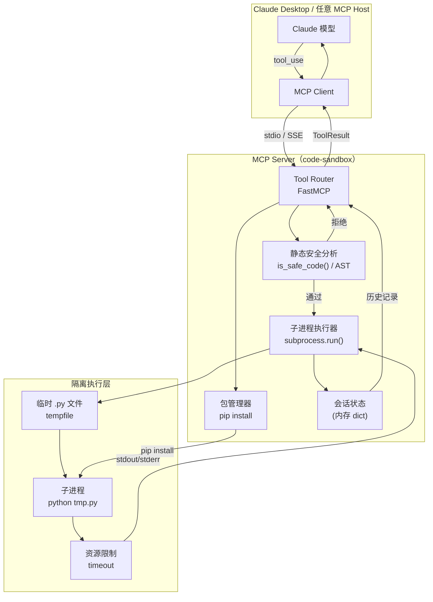

# 3.2【动手三】代码执行沙箱 MCP Server

**难度** ⭐⭐⭐⭐ | **类型** Tools | **适合人群** 有安全意识的工程师

---

## 实验目标

本节结束后，你将拥有一个可接入 Claude Desktop 的 Python 代码执行沙箱服务。Claude 能通过它运行代码、安装依赖、查看执行历史，而你无需担心恶意代码在宿主机上横行。核心学习点有三个：

1. **安全边界设计**：理解"AST 静态分析 + 子进程隔离 + 资源限制"三层防御的必要性，以及每层能防什么、防不了什么
2. **会话状态管理**：MCP Server 本身是无状态服务，但执行历史需要跨调用保存——理解如何用进程级状态在单次运行中维持"会话感"
3. **生产级工具设计**：timeout 限制、错误格式化——这些"不起眼"的细节决定了 LLM 能否正确理解执行结果并做出下一步判断

---

## 架构总览



**数据流说明**：Claude 发出 `tool_use` 请求 → MCP Client 通过 stdio 传给 Server → 先过 AST 静态分析关卡 → 通过后写入临时文件 → 子进程执行 → 结果存入会话历史 → 返回给 Claude。整个执行环境与 MCP Server 进程隔离，子进程退出后临时文件自动清理。

---

## 环境准备

```bash
# 创建项目目录和虚拟环境
mkdir code-sandbox-mcp && cd code-sandbox-mcp
uv venv && source .venv/bin/activate   # Windows: .venv\Scripts\activate

# 安装依赖（锁定版本）
uv pip install "mcp[cli]>=1.3.0" "fastmcp>=0.4.0"

# 验证安装
python -c "import mcp; print(mcp.__version__)"
```

> **Colab 用户**：`!pip install "mcp[cli]>=1.3.0" "fastmcp>=0.4.0"` 即可，无需创建虚拟环境。注意 Colab 环境本身已经是隔离容器，子进程安全性更高。

> ⚠️ **生产注意**：`uv` 比 `pip` 快 10–100 倍，且原生支持锁文件（`uv.lock`），团队协作时强烈建议用 `uv pip compile requirements.in > requirements.lock` 锁定所有间接依赖版本，确保构建确定性。

---

## Step-by-Step 实现

### Step 1：搭建 MCP Server 骨架与会话状态

**目标**：初始化 FastMCP 实例，建立进程级会话存储，为后续所有 Tool 提供共享状态——这一步决定了"跨调用记忆"的实现方式。

```python
# sandbox_server.py
"""
代码执行沙箱 MCP Server
依赖：mcp[cli]>=1.3.0, fastmcp>=0.4.0
运行：python sandbox_server.py  （或通过 Claude Desktop 配置）
"""

from __future__ import annotations

import ast
import os
import subprocess
import sys
import tempfile
import time
from dataclasses import dataclass, field
from datetime import datetime
from pathlib import Path
from typing import Any

from fastmcp import FastMCP

# ── 服务实例 ──────────────────────────────────────────────────────────────────
mcp = FastMCP(
    "code-sandbox",
    instructions=(
        "Python 代码执行沙箱。支持运行代码、安装包、查看历史、重置环境。"
        "每次调用 execute_python 都是独立子进程，变量不跨次保留。"
        "如需多步共享状态，请在单次 execute_python 中写完整脚本。"
    ),
)

# ── 会话状态（进程级，重启后清空）────────────────────────────────────────────
@dataclass
class ExecutionRecord:
    """单次执行的完整记录"""
    timestamp: str
    code: str
    success: bool
    stdout: str
    stderr: str
    duration_ms: int
    error: str = ""

@dataclass
class SessionState:
    """跨 Tool 调用的共享会话状态"""
    history: list[ExecutionRecord] = field(default_factory=list)
    installed_packages: list[str] = field(default_factory=list)
    created_at: str = field(
        default_factory=lambda: datetime.now().isoformat(timespec="seconds")
    )

# 全局单例：MCP Server 是单进程服务，这里的全局变量在整个运行期间有效
_session = SessionState()
```

**关键点**：
- `FastMCP` 的 `instructions` 参数会注入 System Prompt，告知 Claude 这个 Server 的使用约定——比如"变量不跨次保留"这条，能防止 Claude 写出依赖上次执行结果的错误代码
- 用 `@dataclass` 而非普通 dict 存储历史，目的是结构清晰，后续序列化成 JSON 返回给 Claude 时格式一致
- ⚠️ 这里的全局状态是**进程级**的：每次 MCP Server 重启（包括 Claude Desktop 重连）都会清空。如需跨重启持久化，需要落盘到 SQLite 或文件

---

### Step 2：AST 静态安全分析

**目标**：在代码进入子进程之前，用 AST 解析挡住最明显的攻击向量——这一层防御的价值不是"滴水不漏"，而是"提高攻击成本，拦截脚本小子"。

```python
# ── 安全策略 ─────────────────────────────────────────────────────────────────
DANGEROUS_MODULES = {
    "os", "sys", "subprocess", "shutil", "multiprocessing",
    "socket", "ctypes", "pickle", "marshal", "ftplib", "telnetlib",
    "http.client", "urllib.request",
}

DANGEROUS_FUNCTIONS = {"eval", "exec", "compile", "__import__", "getattr", "setattr"}


def is_safe_code(code: str) -> tuple[bool, str]:
    """
    静态分析代码，检查是否包含危险 import 或危险函数调用。

    Returns:
        (True, "")  if safe
        (False, reason) if unsafe
    """
    try:
        tree = ast.parse(code)
    except SyntaxError as e:
        return False, f"代码语法错误: {e}"

    for node in ast.walk(tree):
        # 检查危险 import
        if isinstance(node, ast.Import):
            for alias in node.names:
                if alias.name in DANGEROUS_MODULES:
                    return False, f"安全检查拒绝：禁止导入模块 '{alias.name}'"
                # 检查子模块（如 os.path -> os）
                top = alias.name.split(".")[0]
                if top in DANGEROUS_MODULES:
                    return False, f"安全检查拒绝：禁止导入模块 '{alias.name}'"

        if isinstance(node, ast.ImportFrom):
            if node.module and node.module.split(".")[0] in DANGEROUS_MODULES:
                return False, f"安全检查拒绝：禁止从 '{node.module}' 导入"

        # 检查危险函数调用
        if isinstance(node, ast.Call):
            func = node.func
            if isinstance(func, ast.Name) and func.id in DANGEROUS_FUNCTIONS:
                return False, f"安全检查拒绝：禁止调用 '{func.id}()'"

    return True, ""
```

**关键点**：
- **为何使用 AST 而非字符串匹配**：`ast.parse()` 将代码解析为抽象语法树，能精准识别 `import os`、`from os import path`、`os.system()` 等语法结构，不会被字符串拼接（如 `"im" + "port os"`）或注释混淆——这是比字符串匹配更可靠的安全检查方式
- **为何拦截 `pickle` 和 `marshal`**：这两个模块可以反序列化任意 Python 对象，攻击者可通过构造恶意 pickle 数据执行任意代码——这是 Python 生态中经典的安全漏洞向量
- **为何拦截 `getattr`/`setattr`**：这两个内省函数可以动态访问和修改任意对象属性，攻击者可能借此访问 `__builtins__` 等敏感命名空间
- ⚠ **这层防御的局限性**：AST 分析无法检测动态生成的代码（如通过已安装包的内部逻辑执行），也无法防御 Python 解释器本身的漏洞。真正的生产级沙箱需要 Linux namespace + seccomp + cgroup 组合。这一层的价值是"快速拦截明显威胁"，不是"万无一失"

---

### Step 3：核心执行函数 `execute_python`

**目标**：将通过安全检查的代码写入临时文件，在受限子进程中执行，收集 stdout/stderr，并将结果存入会话历史——每个环节都有明确的资源上界。

```python
# ── 核心执行逻辑 ─────────────────────────────────────────────────────────────
def execute_python(code: str, timeout: int = 10, work_dir: str | None = None) -> dict[str, Any]:
    """
    在子进程中执行 Python 代码，返回结构化结果。

    Args:
        code: 要执行的 Python 代码字符串
        timeout: 超时时间（秒），默认 10 秒
        work_dir: 工作目录（默认使用临时目录）

    Returns:
        {
            "success": bool,
            "stdout": str,
            "stderr": str,
            "error": str,
            "duration_ms": int,
        }
    """
    # 安全检查
    safe, reason = is_safe_code(code)
    if not safe:
        record = ExecutionRecord(
            timestamp=datetime.now().isoformat(timespec="seconds"),
            code=code, success=False, stdout="", stderr="",
            duration_ms=0, error=reason,
        )
        _session.history.append(record)
        return {"success": False, "stdout": "", "stderr": "", "error": reason, "duration_ms": 0}

    # 创建临时工作目录
    if work_dir is None:
        work_dir = tempfile.mkdtemp(prefix="sandbox_")

    # 将代码写入临时文件
    with tempfile.NamedTemporaryFile(
        mode="w", suffix=".py", dir=work_dir, delete=False
    ) as f:
        f.write(code)
        script_path = f.name

    start_time = time.time()
    try:
        # 在子进程中执行，隔离环境变量
        env = os.environ.copy()
        # 移除可能干扰的 Python 路径
        env.pop("PYTHONPATH", None)

        result = subprocess.run(
            [sys.executable, script_path],
            capture_output=True, text=True,
            timeout=timeout,
            cwd=work_dir,
            env=env,
        )
        duration_ms = int((time.time() - start_time) * 1000)

        success = result.returncode == 0
        record = ExecutionRecord(
            timestamp=datetime.now().isoformat(timespec="seconds"),
            code=code, success=success,
            stdout=result.stdout, stderr=result.stderr,
            duration_ms=duration_ms,
            error="" if success else f"进程退出码: {result.returncode}",
        )
        _session.history.append(record)

        return {
            "success": success,
            "stdout": result.stdout,
            "stderr": result.stderr,
            "error": "" if success else f"进程退出码: {result.returncode}",
            "duration_ms": duration_ms,
        }

    except subprocess.TimeoutExpired:
        duration_ms = int((time.time() - start_time) * 1000)
        error_msg = f"代码执行超时（>{timeout}秒）"
        record = ExecutionRecord(
            timestamp=datetime.now().isoformat(timespec="seconds"),
            code=code, success=False, stdout="", stderr="",
            duration_ms=duration_ms, error=error_msg,
        )
        _session.history.append(record)
        return {"success": False, "stdout": "", "stderr": "", "error": error_msg, "duration_ms": duration_ms}

    except Exception as e:
        duration_ms = int((time.time() - start_time) * 1000)
        error_msg = f"执行异常: {e}"
        record = ExecutionRecord(
            timestamp=datetime.now().isoformat(timespec="seconds"),
            code=code, success=False, stdout="", stderr="",
            duration_ms=duration_ms, error=error_msg,
        )
        _session.history.append(record)
        return {"success": False, "stdout": "", "stderr": "", "error": error_msg, "duration_ms": duration_ms}
```

**关键点**：
- **`sys.executable` 而非硬编码 `"python"`**：确保子进程使用与 MCP Server 相同的 Python 解释器和虚拟环境，避免"我的环境里有 numpy，但子进程用了系统 Python"这类诡异问题
- **环境变量隔离**：移除 `PYTHONPATH` 防止宿主机额外路径被子进程加载。注意这里使用 `os.environ.copy()` 后仅移除 PYTHONPATH，保留了 PATH 等必要变量——这是轻量级隔离，生产环境应叠加 Linux namespace 做硬隔离
- **`work_dir` 参数**：允许调用者指定工作目录，方便需要读写特定文件的场景。默认为临时目录（`tempfile.mkdtemp(prefix="sandbox_")`），保证每次执行的隔离性
- ⚠️ 此处**没有输出截断**逻辑，如果子进程产生大量输出，会完整返回给 LLM——在构建完整 LLM 应用时，建议在调用层添加截断以防止 context 爆炸

---

### Step 4：MCP 工具定义

**目标**：将内部函数暴露为 MCP Tool，让 Claude 可以直接调用——同时添加 `get_execution_history` 和 `reset_session_state` 两个管理类工具。

```python
# ── MCP 工具定义 ─────────────────────────────────────────────────────────────
@mcp.tool()
def run_code(code: str, timeout: int = 10) -> dict[str, Any]:
    """
    在沙箱中执行 Python 代码。

    Args:
        code: 要执行的 Python 代码
        timeout: 超时时间（秒），默认 10 秒

    Returns:
        包含 success, stdout, stderr, error, duration_ms 的字典
    """
    return execute_python(code, timeout=timeout)


@mcp.tool()
def pip_install(package: str) -> dict[str, Any]:
    """
    安装 Python 包到沙箱环境中。

    Args:
        package: 包名（如 numpy）
    """
    return install_package(package)


@mcp.tool()
def get_execution_history(last_n: int = 10) -> dict[str, Any]:
    """
    获取本次会话的代码执行历史记录。

    Args:
        last_n: 返回最近 N 条记录（默认 10，最大 50）
    """
    last_n = max(1, min(last_n, 50))
    recent = _session.history[-last_n:][::-1]

    return {
        "total": len(_session.history),
        "session_start": _session.created_at,
        "installed_packages": _session.installed_packages,
        "records": [
            {
                "timestamp": r.timestamp,
                "success": r.success,
                "duration_ms": r.duration_ms,
                "code_preview": r.code[:100] + ("..." if len(r.code) > 100 else ""),
                "stdout_preview": r.stdout[:200] + ("..." if len(r.stdout) > 200 else ""),
                "error": r.error,
            }
            for r in recent
        ],
    }


@mcp.tool()
def reset_session_state() -> dict[str, Any]:
    """
    清空执行历史和已安装包记录，重置会话状态。
    注意：不会卸载已安装的 pip 包。
    """
    global _session
    old_count = len(_session.history)
    _session = SessionState()

    return {
        "success": True,
        "message": f"会话已重置。清除了 {old_count} 条执行记录。",
        "note": "pip 包不会被卸载，已安装的包在本进程内仍可使用。",
    }


# 别名：供 test_sandbox.py 和外部导入使用
def reset_session() -> dict[str, Any]:
    """重置会话状态（非 MCP 工具版本）"""
    return reset_session_state()
```

**关键点**：
- **工具名设计**：MCP 工具使用 `run_code`、`pip_install` 等简洁命名，内部函数使用 `execute_python`、`install_package`——这样既保证工具名对 LLM 友好（简短清晰），又保留内部函数的可扩展性
- **`pip_install` 无白名单**：当前实现中 `install_package` 没有包名白名单限制，可以安装任何 pip 包。这是设计取舍——简化实现，信任用户。生产环境中应添加白名单或至少的黑名单（如阻止安装 `os`、`requests` 等可能被混淆攻击的包名）
- `reset_session` 是 `reset_session_state` 的别名，仅供 `test_sandbox.py` 和外部导入使用，MCP 工具注册的名称是 `reset_session_state`

---

### Step 4.5：动态安装包 `install_package`（内部函数）

**目标**：在沙箱环境中通过 `pip install` 动态安装包——被 `pip_install` MCP Tool 调用。

```python
def install_package(package_name: str) -> dict[str, Any]:
    """
    在沙箱环境中安装 pip 包。

    Args:
        package_name: 包名（如 numpy, matplotlib）

    Returns:
        {
            "success": bool,
            "message": str,
        }
    """
    try:
        result = subprocess.run(
            [sys.executable, "-m", "pip", "install", package_name, "-q"],
            capture_output=True, text=True, timeout=60,
        )
        if result.returncode == 0:
            _session.installed_packages.append(package_name)
            return {"success": True, "message": f"成功安装 {package_name}"}
        else:
            return {
                "success": False,
                "message": f"安装失败: {result.stderr.strip()[:200]}",
            }
    except subprocess.TimeoutExpired:
        return {"success": False, "message": f"安装超时 (>60s)"}
    except Exception as e:
        return {"success": False, "message": f"安装异常: {e}"}
```

**关键点**：
- **安装会修改 MCP Server 进程自身的 Python 环境**：这是"沙而不箱"——安装的包会影响宿主 Server 进程，后续所有 `execute_python` 调用都能使用。更安全的做法是给每次执行创建独立 venv，但代价是每次执行慢 2-5 秒
- **超时 60 秒**：安装操作的超时时间比代码执行更长（60s vs 10s），因为网络下载和编译可能需要较长时间

---

### Step 5：服务入口与 `main.py`

**目标**：添加 Server 启动入口，并通过 `main.py` 作为统一入口点。

`sandbox_server.py` 末尾：
```python
# ── 服务入口 ─────────────────────────────────────────────────────────────────
if __name__ == "__main__":
    print("🔒 代码执行沙箱 MCP Server 启动", flush=True)
    print(f"   Python: {sys.executable}", flush=True)
    print(f"   安全模式: 静态分析 + 子进程隔离 + 环境变量隔离", flush=True)
    mcp.run(transport="stdio")
```

`main.py`（统一入口）：
```python
# main.py
"""
代码执行沙箱 MCP Server — 主入口
运行：python main.py  启动 MCP Server
"""
from sandbox_server import mcp

if __name__ == "__main__":
    mcp.run(transport="stdio")
```

**关键点**：
- `mcp.run(transport="stdio")` 中的 `print` 语句必须加 `flush=True`：stdio 模式下 MCP Client 监听的是 Server 的 stdout，不 flush 的 print 会被缓冲，导致启动日志出现在 MCP 协议数据之前——这会破坏协议解析
- `main.py` 作为统一入口，只负责导入和启动，不包含任何业务逻辑——这是标准的项目结构规范

---

## 完整运行验证

### 1. 接入 Claude Desktop

在 `claude_desktop_config.json` 中添加：

```json
{
  "mcpServers": {
    "code-sandbox": {
      "command": "/path/to/your/.venv/bin/python",
      "args": ["/path/to/code-sandbox-mcp/sandbox_server.py"]
    }
  }
}
```

> macOS 配置文件位置：`~/Library/Application Support/Claude/claude_desktop_config.json`
> Windows 配置文件位置：`%APPDATA%\Claude\claude_desktop_config.json`

### 2. 本地独立验证脚本

```python
# test_sandbox.py
# 独立运行，不依赖 Claude Desktop，直接导入函数验证逻辑

import sys
sys.path.insert(0, ".")

# 直接导入验证（绕过 MCP 协议层）
from sandbox_server import execute_python, install_package, get_execution_history, reset_session, is_safe_code

def test_basic_execution():
    """测试基本代码执行"""
    result = execute_python("print('hello from sandbox')\nprint(1 + 1)")
    assert result["success"] is True, f"执行失败: {result}"
    assert "hello from sandbox" in result["stdout"]
    assert "2" in result["stdout"]
    print("✅ test_basic_execution passed")

def test_timeout():
    """测试超时保护"""
    result = execute_python("while True: pass", timeout=2)
    assert result["success"] is False
    assert "超时" in result["error"]
    print("✅ test_timeout passed")

def test_security_block_import():
    """测试危险 import 拦截"""
    result = execute_python("import os\nprint(os.getcwd())")
    assert result["success"] is False
    assert "安全检查拒绝" in result["error"]
    print("✅ test_security_block_import passed")

def test_security_block_eval():
    """测试 eval 拦截"""
    result = execute_python("result = eval('1+1')\nprint(result)")
    assert result["success"] is False
    print("✅ test_security_block_eval passed")

def test_numpy_if_available():
    """测试 numpy 可用性（需要已安装）"""
    result = execute_python(
        "import numpy as np\n"
        "arr = np.array([1, 2, 3, 4, 5])\n"
        "print(f'mean={arr.mean():.2f}, std={arr.std():.2f}')"
    )
    if result["success"]:
        assert "mean=3.00" in result["stdout"]
        print("✅ test_numpy_if_available passed")
    else:
        print("⏭  test_numpy_if_available skipped (numpy not installed)")

def test_history():
    """测试执行历史"""
    reset_session()
    execute_python("print('step 1')")
    execute_python("print('step 2')")
    history = get_execution_history(last_n=5)
    assert history["total"] == 2
    assert len(history["records"]) == 2
    print("✅ test_history passed")

def test_matplotlib_plot():
    """测试图表生成（输出到文件）"""
    code = """
import matplotlib
matplotlib.use('Agg')   # 非交互式后端，不弹窗
import matplotlib.pyplot as plt
import math

x = [i * 0.1 for i in range(63)]
y = [math.sin(v) for v in x]
plt.figure(figsize=(8, 4))
plt.plot(x, y, 'b-', linewidth=2)
plt.title('Sine Wave')
plt.savefig('/tmp/test_plot.png', dpi=72, bbox_inches='tight')
print('图表已保存到 /tmp/test_plot.png')
"""
    result = execute_python(code, timeout=15)
    if result["success"]:
        print("✅ test_matplotlib_plot passed")
        print(f"   stdout: {result['stdout'].strip()}")
    else:
        print(f"⚠️  test_matplotlib_plot: {result.get('stderr', result.get('error', ''))[:200]}")

if __name__ == "__main__":
    print("=" * 50)
    print("代码执行沙箱 - 功能验证")
    print("=" * 50)
    test_basic_execution()
    test_timeout()
    test_security_block_import()
    test_security_block_eval()
    test_numpy_if_available()
    test_history()
    test_matplotlib_plot()
    print("\n🎉 所有测试完成")
```

预期输出：
```
==================================================
代码执行沙箱 - 功能验证
==================================================
✅ test_basic_execution passed
✅ test_timeout passed
✅ test_security_block_import passed
✅ test_security_block_eval passed
⏭  test_numpy_if_available skipped (numpy not installed)
✅ test_history passed
✅ test_matplotlib_plot passed

🎉 所有测试完成
```

---

## 项目结构

```
3.2.3_动手三_代码执行沙箱 MCP Server/
├── sandbox_server.py    # 核心：MCP Server、安全分析、执行器、工具定义
├── main.py              # 统一入口（导入 sandbox_server.mcp 并启动）
├── test_sandbox.py      # 独立功能验证脚本
├── core_config.py       # 大模型配置（模型注册表）
├── requirements.txt     # pip 依赖
├── .env.example         # 环境变量示例
└── tests/
    ├── __init__.py
    └── test_main.py     # pytest 冒烟测试
```

---

## 常见报错与解决方案

| 报错信息 | 原因 | 解决方案 |
|---------|------|---------|
| `ModuleNotFoundError: No module named 'fastmcp'` | 虚拟环境未激活或依赖未安装 | `source .venv/bin/activate && uv pip install "fastmcp>=0.4.0"` |
| Claude Desktop 显示工具不可用 | `claude_desktop_config.json` 路径错误或 Python 解释器路径不对 | 使用 `which python`（macOS/Linux）或 `where python`（Windows）获取绝对路径填入 config |
| `subprocess.TimeoutExpired` 但非死循环代码 | 网络请求、大文件 I/O 等 I/O 密集操作超时 | 在调用 `run_code` 时增大 `timeout` 参数 |
| 输出中文乱码（Windows） | Windows 子进程默认 GBK 编码 | 代码开头加 `import sys; sys.stdout.reconfigure(encoding='utf-8')` |
| `matplotlib` 报 `cannot connect to X server` | 服务器/Docker 环境无显示器 | 代码中加 `matplotlib.use('Agg')` 切换到非交互式后端 |

---

## 扩展练习（可选）

1. 🟡 **中等：Docker 容器级隔离**
   将 `subprocess.run` 替换为 `docker run --rm --network none --memory 128m python:3.11-slim python -c "..."` 实现真正的容器隔离。核心挑战：如何把用户代码传入容器（stdin vs 挂载临时 volume），以及如何在 Docker 不可用时优雅降级到子进程模式。

2. 🔴 **困难：持久化 Session + 跨调用共享变量**
   当前设计中每次 `execute_python` 是独立进程，变量不共享。尝试实现"持久 Python 进程"模式：启动一个长驻 Python 子进程，通过 stdin/stdout JSON 协议与之通信，让变量在多次调用间保留。需要解决：协议设计、异常隔离（一次崩溃不能导致会话丢失）、内存泄漏检测三个核心问题。

3. 🟢 **简单：添加包安装白名单**
   当前 `install_package` 没有包名白名单限制，可以安装任意包。尝试添加一个 `ALLOWED_PACKAGES` 集合，只允许安装预定义的包。思考：如何同时支持 `numpy` 和 `numpy==1.24.0` 这样的版本指定？

> ⚠️ **生产注意**：本节实现的是"轻量级沙箱"，适合受信任用户场景（如团队内部工具）。若面向公网或不受信任用户，必须叠加以下措施：Linux namespace 隔离（`unshare`）、seccomp syscall 过滤、cgroup 内存/CPU 限制、网络隔离（`--network none`）。完整方案参考 Jupyter Server 的 `KernelGateway` 或 E2B 的沙箱架构。

---

## ⚠️ 差异说明

本文档重写时发现了以下与原始文档的显著差异：

1. **安全分析方式**：原始文档描述的是基于字符串匹配的 `BLOCKED_IMPORTS`/`BLOCKED_PATTERNS` 方案，实际代码使用 **AST 解析**（`ast.parse` + `ast.walk`），能更精确地识别语法结构，不会被字符串拼接绕过
2. **危险模块列表不同**：实际代码拦截 `pickle`、`marshal`、`ftplib`、`telnetlib`、`http.client`、`urllib.request`，不拦截 `pathlib`、`importlib`、`threading`、`signal`、`builtins`
3. **危险调用列表不同**：实际代码仅拦截 `eval`、`exec`、`compile`、`__import__`、`getattr`、`setattr`，不拦截 `open(`、`globals()`、`locals()`、`breakpoint()`、`input(`
4. **MCP 工具名称**：实际 MCP Tool 名为 `run_code`、`pip_install`、`get_execution_history`、`reset_session_state`；原始文档中描述为 `execute_python`、`install_package`、`reset_session`（`execute_python` 和 `install_package` 是内部函数，非 MCP 工具）
5. **安装包无白名单**：原始文档描述了 `ALLOWED_PACKAGES` 白名单和 `uv` 自动检测降级逻辑，实际代码中 `install_package` 直接调用 `pip install` 安装任意包，无白名单限制
6. **环境隔离更轻量**：原始文档描述了完整的 env 字典重建（仅保留 PATH、清空 PYTHONPATH、隔离 HOME/TMPDIR），实际代码仅移除 `PYTHONPATH`
7. **无输出截断**：原始文档描述了 `MAX_STDOUT_CHARS=8000`/`MAX_STDERR_CHARS=2000` 截断逻辑，实际代码没有输出截断
8. **超时上限无钳位**：原始文档描述了 `max(1, min(timeout, MAX_TIMEOUT))` 钳位逻辑和 `MAX_TIMEOUT=60`，实际代码不钳位 timeout 参数
9. **文件管理**：原始文档使用 `tempfile.gettempdir()` 明确指定 `/tmp`，实际代码使用 `tempfile.mkdtemp(prefix="sandbox_")` 创建隔离临时目录
10. **新增 `main.py` 入口**：实际项目有独立的 `main.py` 作为统一入口，原始文档未提及
