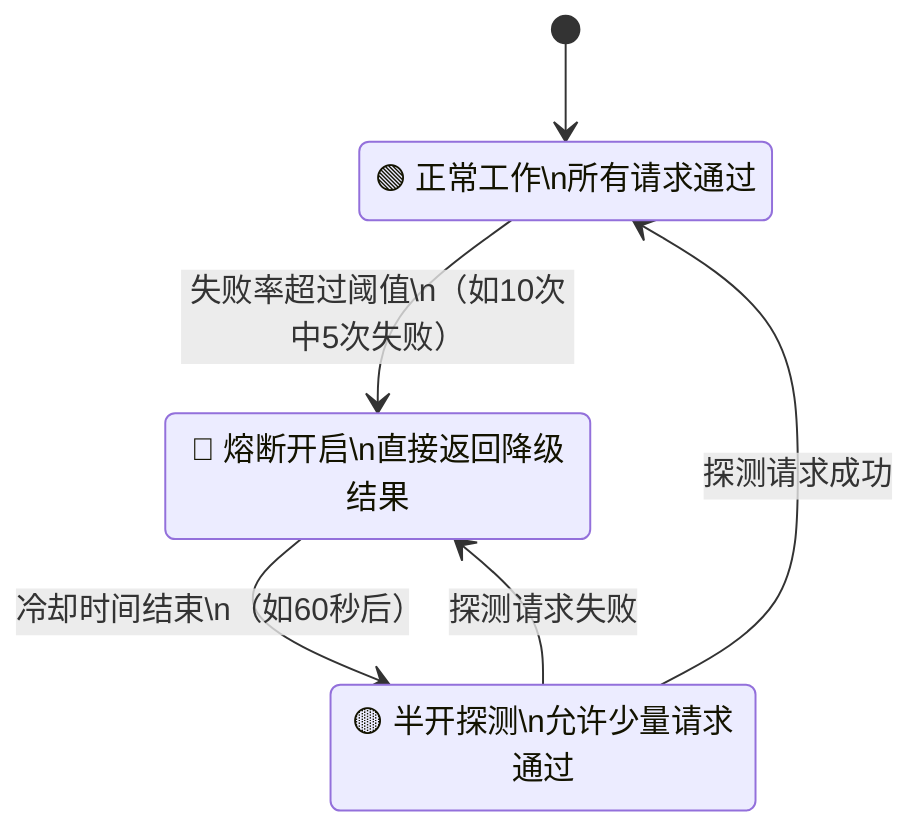
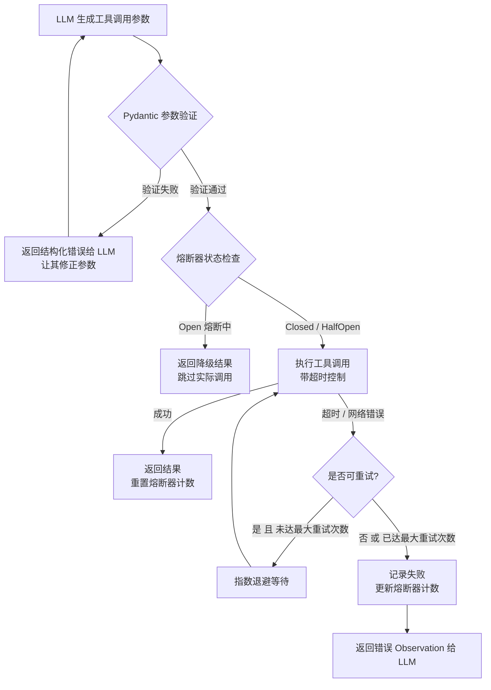

## 3.4 工具可靠性与错误处理

### 一、核心概念

工具调用把 LLM 从"只会说话"变成了"能干活"，但也引入了一个新的可靠性维度：外部世界是不确定的。API 会超时、参数会传错、服务会抖动。在纯文本生成场景，模型输出一段烂文字顶多让用户不满意；但在 Agent 场景，一次工具调用失败可能导致整个任务链路中断，而此时 Agent 已经消耗了大量 Token 和时间。

更棘手的是，工具失败的模式五花八门：网络超时、参数格式不对、权限不足、第三方服务限流、返回值格式意外变化……如果每种失败都要人工干预，Agent 就退化成了一个昂贵的半自动脚本。工程上的目标是：**让 Agent 能自主处理大多数工具失败，同时为无法恢复的失败提供可观测的退出路径**。

这一节的三个技术点——重试策略、参数验证、熔断超时——分别对应三类问题：**暂时性失败怎么恢复**、**调用前怎么预防参数错误**、**持续失败怎么止损**。

---

### 二、原理深讲

#### 2.1 重试策略：指数退避 + 最大重试次数

**工程动机**

大多数工具调用失败是"暂时性"的：搜索 API 限流返回 429、数据库连接池满、网络闪断。这类错误的特点是"等一等就好了"。朴素做法是立刻重试，但这会放大问题——限流场景下立刻重试只会让服务器更快把你封掉。

**核心机制：指数退避（Exponential Backoff）**

每次重试前等待时间按指数增长，通常还加入随机抖动（Jitter）防止多个并发请求同时重试造成"惊群效应"：

```
等待时间 = min(base * 2^attempt + random(0, jitter), max_delay)
```

典型参数：`base=1s`，`max_delay=60s`，`jitter=1s`，最大重试 3 次。

**哪些错误值得重试？**

不是所有失败都该重试。关键区分：

| 错误类型 | 典型 HTTP 状态码 | 是否重试 |
|----------|-----------------|----------|
| 限流 | 429 | ✅ 必须重试，等待 Retry-After 头 |
| 服务不可用 | 502 / 503 | ✅ 重试 |
| 网络超时 | timeout | ✅ 重试 |
| 参数错误 | 400 | ❌ 重试无意义，需修正参数 |
| 认证失败 | 401 / 403 | ❌ 重试无意义，需修正凭证 |
| 资源不存在 | 404 | ❌ 重试无意义 |

**工程建议**

在 Agent 场景中，重试逻辑应该封装在工具层而非 Agent 循环层。原因是：如果把重试暴露给 LLM（让 LLM 看到失败 Observation 后自己决定重调），模型可能做出不一致的决策，且会消耗更多 Token。工具应该对外表现为"成功"或"明确失败"，暂时性抖动由工具内部处理。

```python
# 示意代码：工具层的重试装饰器
import time, random

def with_retry(max_attempts=3, base_delay=1.0, max_delay=60.0):
    def decorator(func):
        def wrapper(*args, **kwargs):
            for attempt in range(max_attempts):
                try:
                    return func(*args, **kwargs)
                except RetryableError as e:
                    if attempt == max_attempts - 1:
                        raise  # 最后一次重试失败，向上抛出
                    delay = min(base_delay * (2 ** attempt) + random.uniform(0, 1), max_delay)
                    time.sleep(delay)
        return wrapper
    return decorator
```

---

#### 2.2 参数验证：Pydantic 强校验 + 错误反馈给 LLM

**工程动机**

LLM 生成工具调用参数时会犯两类错误：**类型错误**（把数字传成了字符串）和**语义错误**（日期格式用了 `MM/DD/YYYY` 而不是 `YYYY-MM-DD`）。如果参数直接传给工具执行，要么报一个晦涩的底层异常，要么静默产生错误结果。更好的做法是在执行前验证，把清晰的错误信息返回给 LLM，让它修正后重试。

**核心机制**

用 Pydantic 定义工具的输入 Schema，在工具执行前做一次验证。验证失败不抛异常，而是返回一个结构化的错误 Observation：

```python
# 示意代码：参数验证层
from pydantic import BaseModel, validator
from typing import Optional
from datetime import date

class StockQueryInput(BaseModel):
    symbol: str
    start_date: date          # Pydantic 自动解析 "2024-01-01" 格式
    end_date: date
    interval: str = "1d"

    @validator("symbol")
    def symbol_must_be_uppercase(cls, v):
        return v.upper()

    @validator("end_date")
    def end_after_start(cls, v, values):
        if "start_date" in values and v < values["start_date"]:
            raise ValueError("end_date must be after start_date")
        return v

def execute_tool(raw_params: dict) -> str:
    try:
        params = StockQueryInput(**raw_params)
    except ValidationError as e:
        # 将 Pydantic 的错误格式化为 LLM 可理解的自然语言
        errors = [f"- {err['loc'][0]}: {err['msg']}" for err in e.errors()]
        return f"参数验证失败，请修正后重试：\n" + "\n".join(errors)
    
    return query_stock_data(params)
```

**错误信息的质量很重要**

返回给 LLM 的错误信息应该"可操作"。`ValidationError: value is not a valid date` 比 `TypeError` 强，但 `日期格式应为 YYYY-MM-DD，你传入的 '01/15/2024' 格式不正确` 才是最佳实践。错误信息的质量直接影响 LLM 是否能一次修正到位。

**工具定义与验证的一致性**

工具的 JSON Schema（用于 Function Calling）和 Pydantic 模型应该保持同步。推荐用 Pydantic 模型自动生成 JSON Schema，而非手写两份：

```python
# Pydantic v2 直接生成 JSON Schema
schema = StockQueryInput.model_json_schema()
```

---

#### 2.3 超时与熔断机制

**工程动机**

重试解决了"暂时失败"，但解决不了"持续失败"。如果一个工具（比如某个外部 API）已经宕机了，Agent 每次到这个节点就会等待超时 + 重试，最终在一个死环里浪费几分钟时间和大量 Token。熔断器（Circuit Breaker）的作用是：**快速检测服务已不可用，并在恢复前跳过它，直接返回降级结果**。

**超时机制**

每次工具调用必须有超时上限。在 Python 中通常用 `asyncio.wait_for` 或 `concurrent.futures.TimeoutError`：

```python
# 示意代码：带超时的工具调用
import asyncio

async def call_tool_with_timeout(tool_func, params, timeout=10.0):
    try:
        result = await asyncio.wait_for(tool_func(params), timeout=timeout)
        return result
    except asyncio.TimeoutError:
        return {"error": f"工具调用超时（{timeout}s），请稍后重试或换用其他方式"}
```

超时阈值的设置是个工程判断：搜索 API 可以设 5-10s，代码执行沙箱可能需要 30-60s，数据库查询通常 5s 以内。

**熔断器状态机**

熔断器有三个状态，通过监控失败率自动切换：



**完整工具调用链路**

把重试、验证、熔断、超时组合在一起，一次工具调用的完整流程如下：



**降级策略**

熔断时不应该直接让 Agent 崩溃，而是返回一个**降级结果**，让 Agent 能继续工作（可能质量降低）：

- 搜索工具不可用 → 返回"搜索服务暂时不可用，将基于已有知识回答"
- 数据库工具不可用 → 返回"无法获取实时数据，请稍后重试"
- 计算工具不可用 → 返回"计算服务不可用，可尝试用代码执行工具替代"

---

### 三、工程视角：常见误区与最佳实践

**误区 1：对所有错误无差别重试**
→ **正确做法**：区分"可重试错误"和"不可重试错误"。400 参数错误重试三次毫无意义，只是浪费时间和 Token。通过 HTTP 状态码或自定义异常类型做分类，只对 5xx 和 429 类错误重试。

**误区 2：把原始异常堆栈作为 Observation 返回给 LLM**
→ **正确做法**：将异常转换为结构化、可操作的错误描述。`sqlalchemy.exc.OperationalError: (sqlite3.OperationalError) no such table: users` 对 LLM 没有帮助；`数据库查询失败：表 'users' 不存在，请检查表名是否正确` 才能让 LLM 有效修正。错误信息要告诉 LLM **发生了什么** 以及 **如何修正**。

**误区 3：超时设置过长**
→ **正确做法**：Agent 任务通常对延迟敏感，用户等待是有成本的。工具调用超时应该比你"觉得合理"的值更激进。如果一个搜索 API 正常响应是 1-2s，把超时设为 3s 而不是 30s，搭配重试即可覆盖大多数抖动。30s 的超时只会让 Agent 在异常时白白等待。

**误区 4：熔断阈值设置过于敏感**
→ **正确做法**：熔断阈值太低会导致正常的偶发失败触发熔断（误开路）。推荐用**失败率**而非**失败次数**作为触发条件，且设置最小请求数窗口（如"过去 20 次请求中失败率超过 50% 才熔断"），避免冷启动时的误触发。

**误区 5：验证逻辑分散在工具实现内部**
→ **正确做法**：将参数验证集中在工具的入口层（Pydantic Schema），工具内部代码假设参数已经合法。这样既能统一错误格式，也便于在工具注册阶段自动生成文档和 JSON Schema，减少"工具定义"和"工具实现"之间的不一致。

---

### 四、延伸思考

> 🤔 思考题：当一个工具频繁失败，熔断器将其标记为不可用时，Agent 有几种应对策略：放弃任务、降级回答、切换备用工具。如何让 Agent 自动选择最合适的策略？这个决策应该写死在工具层，还是交给 LLM 规划层来判断？两种方案各有什么取舍？

> 🤔 思考题：参数验证 + 错误反馈给 LLM 的模式本质上是一个"LLM 自我纠错"循环。在实践中，这个循环收敛需要几轮？是否存在 LLM 无法通过错误信息修正参数的情况？遇到这类"无法自愈"的工具调用失败时，应该如何设计兜底机制？
