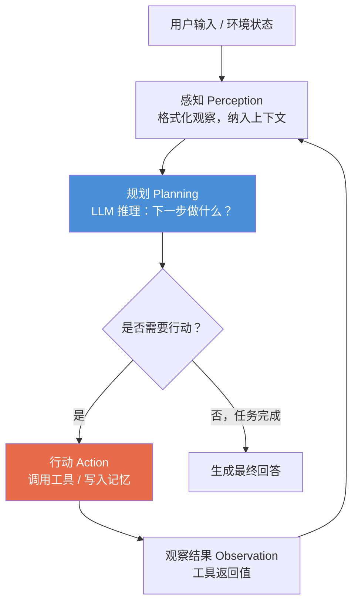
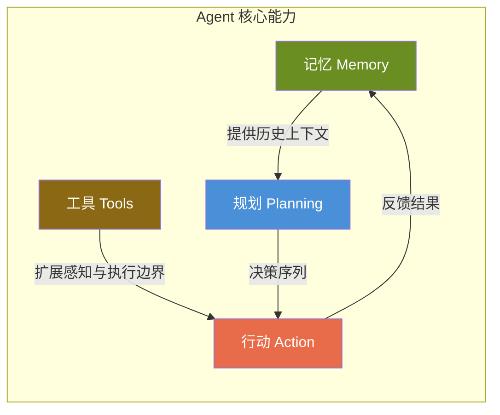

# 4.1 Agent 定义：感知-规划-行动循环

---

## 一、核心概念

在做 RAG 系统的时候，你可能已经注意到一个问题：用户的需求越来越复杂，一次检索-生成根本不够用。「帮我分析竞争对手的最新财报，然后生成一份 PPT 提纲」——这件事需要搜索、读取文件、理解数字、生成结构化内容，多个步骤环环相扣，每一步的输出是下一步的输入。

传统的做法是写一堆 if-else，把这些步骤硬编码成流水线。但问题在于，现实需求的路径千变万化——财报可能在 PDF 里，也可能在网页上；用户可能要横向对比三家公司；中途可能发现数据不够，需要追加搜索。规则引擎穷举不完这些分支。

**Agent 解决的正是这个问题：让 LLM 在运行时动态决定"下一步做什么"，而不是在代码里提前把路径写死。** 它的核心循环很简单——感知（Perception）、规划（Planning）、行动（Action）——但这个循环赋予了系统真正的自适应能力。理解这个循环，是构建一切复杂 Agent 系统的基础。

---

## 二、原理深讲

### 2.1 与传统 RPA / 规则引擎的核心区别

RPA（Robotic Process Automation）和规则引擎是自动化领域的老兵，但它们有一个根本性的局限：**路径在部署前就已确定**。

来看一个对比：

| 维度 | RPA / 规则引擎 | LLM Agent |
|---|---|---|
| 决策方式 | 预定义规则树，if-else 分支 | LLM 在运行时动态推理 |
| 对异常的处理 | 规则未覆盖则报错或走 fallback | 可尝试推理出应对策略 |
| 适应新需求 | 需要人工修改代码/规则 | 通过 Prompt 调整即可适配 |
| 理解语义 | 只能处理结构化输入 | 可理解自然语言、模糊指令 |
| 典型失败场景 | 网页 DOM 结构变了，脚本崩溃 | 上下文丢失导致推理出错 |
| 适用边界 | 高重复、低变化、强合规的流程 | 高变化、语义理解要求高的任务 |

一句话总结：**RPA 是精准的流水线执行器，Agent 是有判断力的通用任务执行者**。前者更可靠、更快、更便宜，适合"我知道怎么做"的场景；后者更灵活，适合"我知道要什么结果，但不确定怎么做"的场景。

工程判断：如果一个任务的路径可以完整枚举，用 RPA 或规则引擎；只有路径不确定、需要语义理解时，才引入 Agent。用 Agent 不等于更好，它引入了不确定性，代价是真实的。

---

### 2.2 感知-规划-行动：核心循环机制

Agent 的运作本质是一个迭代循环，每一轮包含三个阶段：

**感知（Perception）**：将所有输入——用户的问题、历史对话、工具返回值——整理成 LLM 能处理的 Prompt。这一步看似简单，但信息的组织方式直接影响规划质量。差的感知层会把无关信息全部塞进上下文，导致 LLM "分心"。

**规划（Planning）**：这是 LLM 真正发挥作用的地方。给定当前状态，LLM 决定：任务是否完成？如果没有，下一步应该调用哪个工具，传入什么参数？这个决策过程可以是隐式的（一步推断），也可以是显式的（生成 Thought 后再决定 Action，即 ReAct 范式，我们在 4.2 节深入讲）。

**行动（Action）**：执行决策——调用搜索 API、执行 SQL、写文件、调用另一个 Agent。行动结果作为新的"观察"（Observation）被送回感知层，开始下一轮循环。

**终止条件**：Agent 在两种情况下退出循环：LLM 判断任务已完成，或者达到最大迭代次数限制（必须设，否则死循环）。

---

### 2.3 Agent 的四大核心能力

一个 Agent 是否"好用"，取决于它在以下四个维度上的实现质量：

**记忆（Memory）**：Agent 的记忆分三层。短期记忆是当前对话的上下文窗口，用完即弃；长期记忆是写入向量数据库的历史信息，下次对话还能检索；外部记忆是结构化存储（数据库、文件系统），存放精确的结构化状态。记忆系统的设计决定了 Agent 的"持久性"，没有长期记忆的 Agent 每次对话都是"失忆"状态。

**工具（Tools）**：工具是 Agent 与外部世界的接口——搜索引擎、代码解释器、数据库、其他 API。工具的质量上限直接决定了 Agent 能做什么。一个原则：**工具的描述（description）比实现更重要**，LLM 是根据描述来决定要不要调用这个工具的，描述模糊就会导致工具被错误调用或完全忽视。

**规划（Planning）**：规划能力决定 Agent 是否能把复杂目标拆解为可执行序列。简单任务直接 ReAct 循环就够；复杂任务需要先生成全局计划再逐步执行（Plan-and-Execute）；更高级的场景需要动态重规划——执行途中发现计划不可行时能自我纠正。

**行动（Action）**：行动不只是调用工具，还包括"不调用工具直接回答"、"向用户请求澄清"、"终止任务并报告失败"。**能优雅地终止是一种被严重低估的能力**——很多初级 Agent 实现会在工具调用失败后无限重试，而不是向上汇报问题。

---

### 2.4 Agent 可靠性现状：任务完成率 Benchmark 解读

这是一个让人清醒的话题。Agent 的实际表现远没有 Demo 视频里那么亮眼。

几个权威 Benchmark 的数据（截至 2025 年）：

| Benchmark | 测试内容 | 顶级模型成绩 | 说明 |
|---|---|---|---|
| **SWE-Bench Verified** | 真实 GitHub Issue 修复 | ~50%（Claude 3.7 Sonnet） | 软件工程任务，需多步代码修改 |
| **GAIA** | 需多步推理的通用助手任务 | ~60%（GPT-4 系列） | Level 3 难题仍 <30% |
| **τ-Bench** | 模拟真实客服/零售场景的工具调用 | ~60–70% | 有真实用户中断、模糊指令 |
| **WebArena** | 真实网站操作自动化 | ~35–45% | 模拟真实浏览器环境 |

**数字背后的工程含义**：50% 的任务完成率，意味着如果你在生产环境让 Agent 自主执行 100 个任务，有 50 个会出错或无法完成。这在很多场景是不可接受的。

为什么 Agent 容易失败？主要原因集中在以下几类：
- **上下文累积错误**：多轮循环后，错误的中间结果污染后续推理
- **工具调用幻觉**：LLM 生成了格式正确但语义错误的工具参数
- **任务漂移**：长任务中 Agent 忘记原始目标，偏向最近的子任务
- **缺乏自我怀疑**：到了应该停止并求助的时候，仍然继续执行

**工程推论**：当前阶段，Agent 适合作为"人类的加速器"而非"人类的替代者"。最可靠的落地模式是 Human-in-the-Loop——在高风险操作前插入人工审批节点，而不是让 Agent 全程自主运行。随着模型能力提升，这个比例会逐步向自动化倾斜，但盲目追求"全自动"在现阶段是一种工程冒险。

---

## 三、工程视角：常见误区与最佳实践

**误区一：把 Agent 当作万能方案** → **正确做法**：先评估任务路径的确定性。如果一个任务的步骤可以穷举（如"每天早上爬取数据，写入数据库，发邮件"），用定时任务 + 脚本，比 Agent 更快、更稳、更便宜。只有路径不确定、需要语义判断时，Agent 的成本才值得。

**误区二：不设最大迭代次数限制** → **正确做法**：任何 Agent 循环都必须设置 `max_iterations`（通常 10–20 步）。LLM 有时会陷入"我以为我在进步但其实在原地打转"的状态——比如反复调用同一个工具，得到相同的错误，却不知道该终止。没有上限保护，你的 API 账单会告诉你什么叫"无限循环"。

**误区三：工具描述写得太简略** → **正确做法**：工具的 `description` 字段要写清楚"什么情况下用这个工具"、"什么情况下不该用"、"参数的格式要求"。反例：`description: "搜索信息"`；正例：`description: "当需要获取实时网络信息、新闻或不在知识库中的内容时使用。不要用于查询本地数据库中已有的结构化数据。query 参数应为简洁的关键词，不超过 20 字。"`

**误区四：用 Agent 处理所有的错误重试** → **正确做法**：工具调用的瞬时失败（网络超时、速率限制）应该在工具封装层用指数退避重试，而不是让 LLM 感知错误后"思考如何重试"——这会浪费 Token 且效果不稳定。LLM 应该处理的是"这个工具在语义上无法完成任务"，而不是"这个 API 超时了"。

**误区五：在生产环境跳过 Human-in-the-Loop** → **正确做法**：识别任务中的"破坏性操作"——删除数据、发送消息、执行支付、修改代码部署——并在这些节点设置人工审批。LangGraph 的 `interrupt_before` 机制可以优雅实现这一点（见 4.5 节）。规则是：**副作用可逆的操作可以自动执行，副作用不可逆的操作需要人工确认**。

---

## 四、延伸思考

> 🤔 **思考题一**：当前 Agent 的任务完成率在复杂任务上仍然停留在 50% 上下，但 LLM 本身的能力在持续提升。你认为"模型更强"能否线性地提升 Agent 的可靠性？还是 Agent 的可靠性瓶颈有一部分在架构设计上，与模型能力无关？

> 🤔 **思考题二**：感知-规划-行动循环本质上是一个序列决策问题，这与强化学习（RL）中的 Markov Decision Process 高度相似。为什么当前主流 Agent 框架选择了"用 LLM 做策略推断"而不是"训练一个 RL 策略网络"？这两条路线在工程落地上各有哪些权衡？（提示：结合 DeepSeek-R1 的 GRPO 训练方式思考。）
