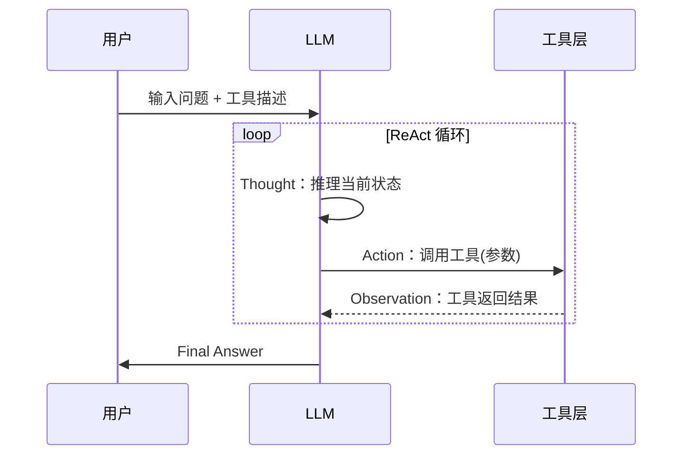

# 4.2 ReAct 范式实战

## 一、核心概念

单纯给 LLM 一个问题，它只能"想"；单纯给它工具，它不知道"何时用"。ReAct（Reasoning + Acting）解决的正是这个问题：**让模型的推理过程和行动决策交织在一起，形成闭环**。

在 ReAct 出现之前，工程师通常有两种选择：要么写死一条 Prompt 链，预先设计好每一步调用哪个工具；要么把问题直接丢给模型，期待它一步输出正确答案。前者脆弱易断，后者对复杂问题力不从心。ReAct 的核心洞察来自 Yao et al., 2022（arXiv:2210.03629）：**人类解决问题时会边思考边行动，而不是先想好再动**。让模型显式输出思维链（Thought），再基于这条链决定下一步行动（Action），再把行动结果（Observation）反馈回去——这个循环本质上是把"试错"这件人类理所当然的事，赋予了 LLM。

工程价值在于：整个推理过程变得**可观测、可调试**。当 Agent 出错，你能看到它在哪一步想错了，而不是面对一个黑盒输出。

---

## 二、原理深讲

### 2.1 Thought → Action → Observation 循环

循环的每一步都有明确职责：

- **Thought**：模型内部的推理步骤，类似"我现在知道什么，还缺什么，下一步该怎么做"。这一步不调用任何工具，纯文本生成。
- **Action**：模型决定调用哪个工具，以及传入什么参数。格式通常是结构化文本，如 `Search["苹果公司2024年营收"]`。
- **Observation**：工具执行后返回的结果，拼接回 Prompt，作为下一轮推理的上下文。



关键在于 **Prompt 的构造方式**。模型每一轮的输入是累积的：原始问题 + 到目前为止所有的 Thought/Action/Observation。这意味着每一步 LLM 都能"看到"完整历史，从而做出连贯决策。

一个典型的 Prompt 结构（伪代码）：

```
[系统提示：你是一个能使用工具的助手，工具列表：...]

问题：{用户输入}

Thought: {模型生成}
Action: Search["..."]
Observation: {工具返回}
Thought: {模型生成}
Action: Calculator["..."]
Observation: {工具返回}
Thought: 我已经有足够信息了。
Final Answer: {最终答案}
```

**工程建议**：停止条件的设定至关重要。必须规定两个终止信号：一是模型输出 `Final Answer:`，二是达到最大步数上限（通常 10–15 步）。两者缺一会导致无限循环或资源耗尽。

---

### 2.2 从零实现一个 ReAct Agent

不依赖 LangChain/LangGraph，用原生 Python 实现，是理解 ReAct 机制最好的方式。核心只需三个组件：

**① 工具注册表**
```python
# 工具是普通 Python 函数，统一注册到字典
tools = {
    "search": search_web,       # 返回 str
    "calculator": eval_math,    # 返回 str
    "get_weather": get_weather, # 返回 str
}
```

**② Action 解析器**
从模型输出中提取工具名和参数——这是最容易出错的地方。正则表达式是最简单的做法，但强烈建议用 Function Calling 替代纯文本解析（详见 Module 3.1）：
```python
import re

def parse_action(text: str) -> tuple[str, str] | None:
    # 匹配 Action: tool_name["参数"] 格式
    match = re.search(r'Action:\s*(\w+)\["?([^"\]]+)"?\]', text)
    if match:
        return match.group(1), match.group(2)
    return None
```

**③ 主循环**
```python
def react_agent(question: str, max_steps: int = 10) -> str:
    messages = [
        {"role": "system", "content": SYSTEM_PROMPT},  # 含工具描述
        {"role": "user", "content": question}
    ]
    
    for step in range(max_steps):
        response = llm_call(messages)  # 调用 LLM
        messages.append({"role": "assistant", "content": response})
        
        # 终止条件：找到最终答案
        if "Final Answer:" in response:
            return response.split("Final Answer:")[-1].strip()
        
        # 解析并执行工具调用
        action = parse_action(response)
        if action:
            tool_name, tool_input = action
            observation = tools[tool_name](tool_input)
            # 把 Observation 追加进上下文
            messages.append({
                "role": "user",
                "content": f"Observation: {observation}"
            })
    
    return "超过最大步数，未能得出答案"
```

整个实现不超过 50 行，但包含了 ReAct 的全部本质。理解这个骨架，再看 LangGraph 的封装就会豁然开朗。

---

### 2.3 ReAct 常见失败模式

| 失败模式 | 表现 | 根本原因 |
|----------|------|----------|
| **幻觉行动** | 模型输出不存在的工具名，或参数明显错误 | 工具描述不清晰，或模型未严格遵循格式 |
| **死循环** | 反复调用同一工具、同样参数，永不停止 | 缺少循环检测，或 Observation 信息未被模型利用 |
| **过早停止** | 信息不足就给出 Final Answer，答案错误 | 系统提示未明确要求充分验证，或温度参数过高 |
| **推理漂移** | 前几步 Thought 正确，中途突然跑偏 | 上下文过长导致注意力稀释，或工具返回噪音太多 |

**幻觉行动**的工程对策：用 Function Calling 代替纯文本解析，模型输出的工具名和参数会被 API 层强制约束在合法范围内。

**死循环**的工程对策：
```python
# 检测重复 Action，超过 N 次相同调用则强制终止
action_history = []
if action in action_history[-3:]:  # 连续 3 次重复
    return "检测到循环，终止执行"
action_history.append(action)
```

**过早停止**的工程对策：在系统提示中明确要求"在确认答案之前，必须通过至少一次工具调用验证关键数据"。

---

## 三、工程视角：常见误区与最佳实践

**误区 1：把 Observation 直接塞进上下文，不做任何处理**
→ **正确做法**：工具返回内容可能极长（搜索结果、数据库查询）。应在工具层对输出做截断或摘要，控制单条 Observation 在 500–1000 Token 以内，否则 Agent 跑几轮上下文就会爆炸。

**误区 2：系统提示只描述工具功能，不给调用示例**
→ **正确做法**：在系统提示中加入 2–3 个 few-shot 示例，完整展示 Thought/Action/Observation 的格式。模型对"应该输出什么格式"非常依赖示例，缺乏示例时格式错误率会显著上升，尤其是能力较弱的模型。

**误区 3：Action 解析用正则，处理不了格式变体**
→ **正确做法**：优先使用原生 Function Calling（OpenAI / Claude 均支持）。如果必须用文本解析，加上格式校验失败后的重试逻辑，并把解析失败信息作为 Observation 反馈给模型让它自我纠正：
```
Observation: 工具调用格式错误，请严格按照 ToolName["参数"] 格式重新输出 Action。
```

**误区 4：Thought 步骤对生产没用，直接去掉节省 Token**
→ **正确做法**：不能去掉。Thought 不只是"让模型解释自己"，它本质上是在引导模型做中间推理——没有 Thought，模型的 Action 质量会明显下降（这与 CoT 的机制相同）。可以在**前端展示**时隐藏 Thought，但推理链必须存在。

**误区 5：用 ReAct 处理所有类型任务**
→ **正确做法**：ReAct 适合需要多步信息收集的任务（研究、问答、数据分析）。对于需要全局规划的复杂长任务（如"重构一个代码库"），Plan-and-Execute 架构（先生成完整计划，再逐步执行）更合适——ReAct 的每步局部决策在长任务中容易走偏，因为它没有全局规划约束。

---

## 四、延伸思考

> 🤔 思考题：ReAct 的 Thought 步骤本质上是 Chain-of-Thought 的变体。但研究表明，模型的 Thought 有时是"事后解释"而非真正的推理过程——模型已经决定好 Action，再补写一个合理化的 Thought。这种现象对 Agent 的可靠性有什么影响？当你在 LangFuse 里看到一条"看起来推理合理"的 Thought 链时，它真的代表模型的决策路径吗？

> 🤔 思考题：ReAct 每一步都需要完整 LLM 推理，对于需要 10 步以上的任务，延迟和成本都很高。有没有方法让部分"机械性"的 Action 步骤（如格式转换、简单计算）绕过 LLM，直接由确定性代码执行？这种"混合执行"架构如何设计？
