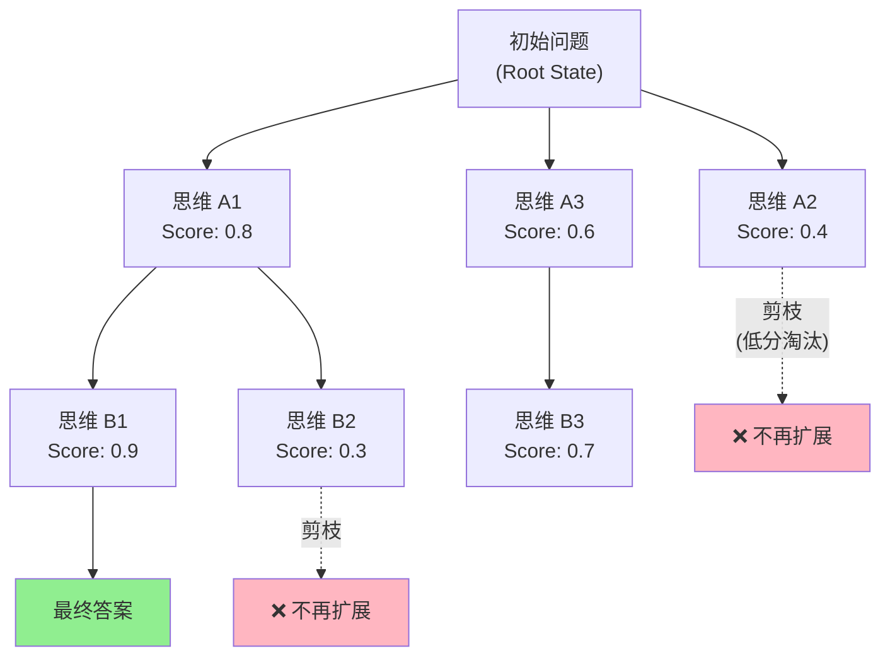
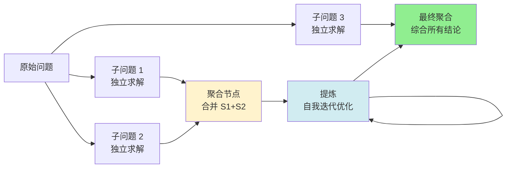
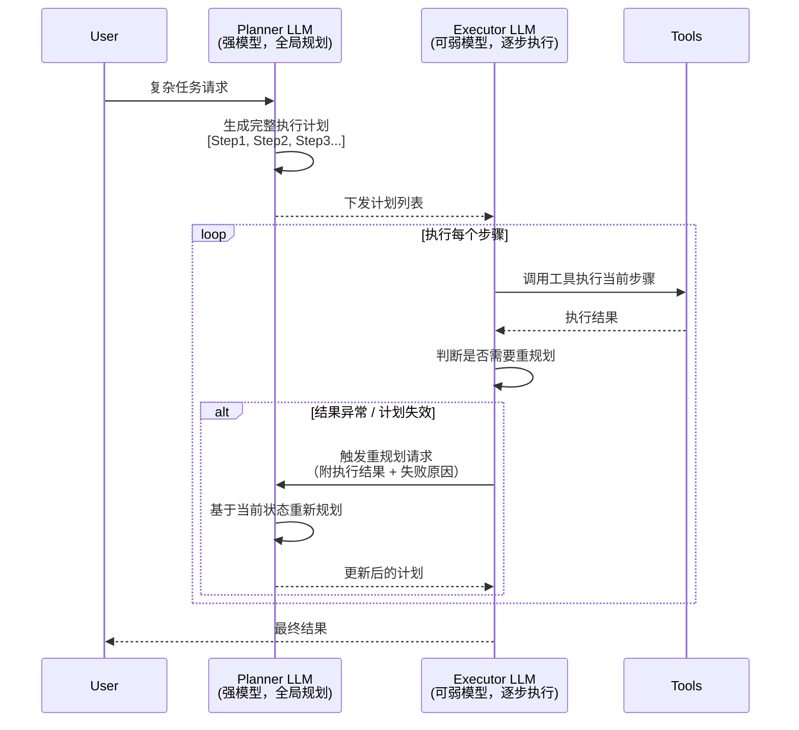

## 4.3 Planning 策略（ToT / GoT / Plan-and-Execute）

---

### 一、核心概念

ReAct 解决了"边想边做"的问题，但它本质上是一种**贪心策略**——每一步只看当前最优解，不回头。当任务足够简单时这没问题，但一旦遇到需要多步推理、存在分叉决策、或者中途会走错路的任务，ReAct 就会暴露出短视的缺陷：Agent 往往在走错了三步之后才意识到方向不对，而此时已经没有回头路。

更深层的问题是：**ReAct 把规划和执行混在同一个循环里**。每次 Thought 既要决定"做什么"，又要判断"当前上下文意味着什么"，认知负担全压在一个 Token 序列上。对于复杂任务，这就像让一个人在没有草稿纸的情况下心算乘法——不是做不到，而是出错概率高得不可接受。

Planning 策略的出现正是为了解决这两个问题：**让 Agent 能够系统性地探索解题路径，并将规划与执行解耦**。Tree of Thought（ToT）和 Graph of Thought（GoT）给 Agent 提供了"回头路"和"多线并探"的能力；Plan-and-Execute 则彻底分离了"想清楚再动手"与"按图执行"两个阶段。

---

### 二、原理深讲

#### 2.1 Tree of Thought（ToT）：让 Agent 拥有搜索能力

**工程动机**：设想一个任务——给定一道数学竞赛题，要求 Agent 分步骤解题。ReAct 会从第一步开始往下走，如果某步出错，整个推理链就崩了，而且 Agent 往往不知道自己已经走偏。ToT 的核心洞察是：**把 LLM 的推理过程显式建模成一棵搜索树**，每个节点是一个"思维状态"，从根节点到叶节点的路径就是一个推理链。

**核心机制**：

ToT 框架的三个核心组件：

1. **思维分解（Thought Decomposition）**：把问题拆成若干可以逐步推进的"思维步骤"，每步的粒度取决于任务——对于写作任务可能是一个段落，对于数学任务可能是一个推导步骤。

2. **思维生成（Thought Generator）**：在每个节点，让 LLM 生成 $k$ 个候选的下一步思维（通过 Sample 或 Propose prompt），形成树的分支。

3. **状态评估（State Evaluator）**：对每个候选节点打分（用 LLM 直接评分，或启发式规则），决定哪些节点值得继续扩展，哪些可以剪枝。

搜索策略上，论文（Yao et al., 2023, arXiv:2305.10601）主要使用 **BFS**（广度优先）和 **DFS**（深度优先）两种。BFS 适合需要在同层比较多个候选方案的任务（如创意写作中比较不同开头），DFS + 回溯适合有明确终止条件的推理任务（如数学解题）。

**工程建议**：ToT 的实际使用成本是 ReAct 的 $k \times d$ 倍（$k$ 为分支数，$d$ 为树深度），在生产环境中需要谨慎。论文中 $k=5$、$d=3$ 的配置在 Game of 24 任务上从 4% 提升到 74% 准确率，但同时 API 调用量暴涨。**适用场景**：有明确正确答案、允许较高延迟和成本、错误代价高的任务（如代码生成的关键逻辑、医疗诊断辅助）。不适合实时对话或成本敏感场景。

---

#### 2.2 Graph of Thought（GoT）：打破线性约束

**工程动机**：ToT 的思维结构是树——从根出发，不能合流。但很多真实问题天然是图结构：两个独立子问题的解可以合并成一个更强的答案，或者推理中某个中间结论可以被多条路径复用。GoT（Besta et al., 2024, arXiv:2308.09687）的核心贡献是**允许思维节点之间存在任意连接，包括聚合（Aggregation）和提炼（Refinement）操作**。

**核心机制**：GoT 在 ToT 的基础上新增了两类操作：

- **聚合（Aggregate）**：将多个思维节点合并为一个更综合的节点。例如分别搜索"方案A的优点"和"方案B的优点"后，合并成一个"综合对比"节点。
- **提炼（Refine）**：在原节点上迭代改进，形成自环式的优化回路。

**工程建议**：GoT 在排序、集合操作、文档摘要聚合等任务上有显著优势，因为这类任务天然需要"分而治之再合并"。但 GoT 的图结构管理复杂度更高，在没有成熟框架支撑的情况下，**工程实现成本远高于 ToT**。目前生产落地案例较少，更多用于研究场景。如果需要并行分治，建议先考虑 Plan-and-Execute 中的并行执行步骤，更易控制。

---

#### 2.3 Plan-and-Execute：规划与执行的架构分离

**工程动机**：ToT/GoT 解决的是"如何更聪明地搜索"，但有一个更根本的问题：**复杂任务的规划本身就需要全局视角，而执行每一步时又需要聚焦局部细节**。把两者混在 ReAct 循环里，导致 Agent 既无法做出连贯的全局计划，又在执行时被宏观干扰。

Plan-and-Execute（Wang et al., 2023, arXiv:2305.04091）的解决方案直接：**用两个分离的 LLM 调用分别承担 Planner 和 Executor 的职责**。

**核心机制**：

这个架构有几个重要优势：

1. **成本优化**：Planner 用强模型（GPT-4o / Claude Sonnet），Executor 用弱模型（GPT-4o-mini / Haiku），规划 1 次，执行 N 步，整体成本可控。
2. **可审查性**：计划在执行前是可见的，可以加入人工审批节点——这在高风险场景（如数据库写操作、发送邮件）中至关重要。
3. **并行执行**：Planner 可以显式标注哪些步骤可以并行，Executor 直接并发执行，远比 ReAct 的串行循环高效。

**动态重规划**是这个架构的关键机制。执行器在以下情况应触发重规划：

- 某步骤工具调用失败且重试耗尽
- 执行结果与计划假设严重不符（如查询数据库发现关键数据不存在）
- 外部环境发生变化（如第 3 步依赖的资源在第 2 步执行期间被删除）

重规划时，需要将**已执行步骤的结果 + 当前失败原因**一并传给 Planner，而不是从头开始，否则会丢失已有上下文。

**三种规划策略对比**：

| 维度 | ToT | GoT | Plan-and-Execute |
|------|-----|-----|-----------------|
| 核心思路 | 树形搜索 + 剪枝 | 图结构思维流 | 规划/执行分离 |
| Token 消耗 | 极高（$k^d$ 倍） | 极高 | 中等（1次规划 + N次执行） |
| 实现复杂度 | 中 | 高 | 低 |
| 生产可用性 | 低（高成本场景限用） | 极低 | 高 |
| 适用任务 | 精确推理、数学、代码逻辑 | 分治聚合、摘要 | 多步骤工作流、长任务 |
| 支持并行 | 是（BFS天然并行） | 是 | 是（需显式标注） |
| 可干预性 | 低 | 低 | 高（计划可审批） |
| 代表框架 | 手工实现为主 | 手工实现为主 | LangGraph、LlamaIndex Workflow |

---

### 三、工程视角：常见误区与最佳实践

**误区 1：对所有 Agent 任务都上 ToT，以为"搜索越多越准"**
→ **正确做法**：ToT 是高成本换高准确率的策略，只在以下条件同时满足时使用：①任务有明确的正确/错误判断标准；②允许 5-10 倍的延迟和成本；③ReAct 的单链准确率已经证明不够。对话型 Agent、简单工具调用任务用 ReAct 足够，ToT 用在数学证明、代码关键逻辑等高精度要求场景。

**误区 2：Plan-and-Execute 中 Planner 一次规划后不再更新，Executor 死扣计划执行**
→ **正确做法**：必须给 Executor 赋予"触发重规划"的能力，并设计清晰的触发条件判断逻辑。一个常见的实现模式是：Executor 每步执行后输出一个结构化的 `{success: bool, needs_replan: bool, reason: str}` 对象，由控制层决策是否触发重规划。计划不是圣旨，是可修正的假设。

**误区 3：重规划时把新计划直接覆盖旧计划，丢失已执行步骤的结果**
→ **正确做法**：重规划时传给 Planner 的上下文必须包含：原始目标 + 已完成步骤及其结果 + 当前失败原因 + 剩余待完成目标。Planner 应该只对"未完成的部分"重新规划，而不是从头开始。否则 Agent 会忘记它已经知道的信息，导致重复查询或逻辑矛盾。

**误区 4：ToT 的评估器（State Evaluator）用同一个 LLM 既生成思维又打分，产生自我偏袒**
→ **正确做法**：生成候选思维和评估候选思维在提示词上应该严格分离，最好是两次独立的 LLM 调用，且评估提示词中不应包含生成该思维的上下文（避免锚定效应）。在资源有限时，可以使用投票机制——对同一节点调用评估器 3 次取多数票，比单次评估更稳定。

**误区 5：把 Plan-and-Execute 的"计划"设计成自然语言列表，Executor 自由发挥理解**
→ **正确做法**：计划应使用结构化格式（JSON），每个步骤包含：`step_id`、`description`、`tool_name`（如果已知）、`depends_on`（依赖的步骤 ID，用于并行调度）、`can_be_parallelized`。结构化计划不仅让 Executor 执行更精确，也便于可视化调试和人工审批时快速定位问题步骤。

---

### 四、延伸思考

> 🤔 **思考题一**：Plan-and-Execute 的 Planner 在生成初始计划时，需要预判所有可能的执行路径——但 Planner 调用时往往并不知道工具执行的真实结果。这是否意味着对于高度不确定的任务（如爬取实时数据、调用第三方 API），Plan-and-Execute 的优势会大幅削弱？在这类场景下，是否存在一种"懒惰规划"（Lazy Planning）模式——只规划到当前可确定的步骤，每步执行后再决定下一步的计划？

> 🤔 **思考题二**：ToT 的评估器本质上是一个"价值函数"（Value Function）——它在评估"当前思维状态距离最终目标有多近"。这和强化学习中的 Critic 网络高度同构。如果我们把 Agent 的规划问题完全形式化为强化学习问题，ToT 的 BFS/DFS 搜索和 MCTS（Monte Carlo Tree Search）的区别是什么？当前 LLM-based 评估器的主要瓶颈在哪里？
