# 4.4 记忆系统设计

## 一、核心概念

如果你用过 ChatGPT，一定遇到过这种情况：上一个对话窗口里你跟它聊了半天你的项目背景，新开一个窗口，它什么都不记得了。这不是 Bug，是 LLM 的本质特性——模型本身是无状态的，每次调用都是一次"失忆"。

Agent 系统里，记忆问题被放大十倍。一个需要执行 20 步任务的 Agent，必须记住：用户的意图是什么、第 3 步的工具调用结果是什么、用户之前说过"不要修改生产数据库"这条约束。如果做不到，Agent 要么反复追问用户，要么犯下灾难性的"遗忘错误"。

工程上，记忆系统面临三个核心矛盾：**上下文窗口有限**（贵且有上限）、**信息重要性不均等**（并非所有内容都值得记）、**访问时机不一致**（有些信息要在几秒内访问，有些要在几周后召回）。针对这三个矛盾，记忆系统被自然地分成三层：短期记忆（对话上下文管理）、长期记忆（向量存储的语义召回）、外部记忆（结构化数据库的精确查询）。三层各司其职，组合使用才能支撑复杂 Agent 场景。

---

## 二、原理深讲

### 短期记忆：对话上下文管理

短期记忆解决的是"这次对话里发生了什么"的问题。LLM 的输入就是它的工作记忆，所有上下文都以 Token 的形式存活在 messages 列表里。

问题在于 Token 有上限，而且费钱。一次多轮对话，每轮都要把历史全部重传，成本随对话长度线性增长。当历史超过窗口上限时，朴素地截断会直接丢失关键信息。三种主流策略：

**滑动窗口裁剪**：保留最近 N 轮对话，丢弃最早的消息。实现最简单，但会丢失早期建立的重要上下文（如用户在第 1 轮说的"我是法律从业者"）。适合任务相对短平快、上下文依赖局部性强的场景。

**摘要压缩**：当历史超过阈值时，用 LLM 对早期历史生成摘要，用摘要替换原始消息。保留语义，大幅压缩 Token。代价是引入额外的 LLM 调用延迟和成本，摘要质量也依赖 LLM 能力。适合长对话、信息密度高的客服/助手场景。

**重要性保留**：给每条消息打重要性分数，优先保留高分消息。分数来源可以是：用户明确指令（"记住这个"）、包含约束/偏好的消息、最近一轮的消息。这是最灵活也最复杂的方案。

```
# 摘要压缩伪代码
def compress_history(messages, max_tokens=2000):
    if token_count(messages) < max_tokens:
        return messages
    
    # 将早期历史交给 LLM 摘要
    early_messages = messages[:-6]  # 保留最近 3 轮
    summary = llm.invoke(
        f"请将以下对话历史压缩为简洁摘要，保留关键信息：\n{early_messages}"
    )
    
    # 用摘要替换早期历史
    return [{"role": "system", "content": f"对话背景摘要：{summary}"}] + messages[-6:]
```

**多轮对话状态追踪与实体提取**：光管理消息还不够，Agent 还需要主动追踪对话中的实体状态。比如用户先说"帮我分析 NVDA"，后说"再看看它的竞争对手"，Agent 必须知道"它"指的是 NVDA。LangGraph 的 State 机制天然适合做这件事——把当前追踪的实体、任务状态、用户偏好存入 State，每轮更新。

| 策略 | Token 节省 | 信息保真度 | 实现复杂度 | 适用场景 |
|------|-----------|-----------|-----------|---------|
| 滑动窗口 | 中 | 低（丢早期上下文） | 低 | 短对话、本地依赖强 |
| 摘要压缩 | 高 | 中（摘要有损） | 中 | 长对话客服/助手 |
| 重要性保留 | 高 | 高 | 高 | 复杂任务 Agent |

---

### 长期记忆：向量存储的语义召回

短期记忆解决"当前对话"，长期记忆解决"跨会话"问题。用户上周提到他不喜欢冗长的回答，下周再开新对话时，Agent 应该记得。这类信息不适合放 Context（每次都带太贵），适合存向量数据库，按需检索。

**记忆写入时机：何时值得记？**

这是长期记忆设计中最容易被忽视的问题。如果什么都写，向量库很快变成垃圾场，检索时噪声极高。判断是否值得写入的经验规则：

- **用户显式偏好**：用户说"我喜欢/不喜欢 X"——值得记
- **重要约束**：用户说"不要使用外部 API"——必须记
- **任务完成结果**：Agent 完成了某个子任务的关键输出——值得记
- **普通事实性对话**：用户问今天天气——不值得记
- **中间过程**：工具调用的中间结果——通常不值得记（除非是关键决策点）

写入粒度也很重要：不要把整段对话写入，而是提炼成原子化的"记忆条目"，每条包含：内容、来源时间戳、关联实体、重要性分数。

```
# 记忆条目结构
memory_entry = {
    "content": "用户偏好使用 DeepSeek 模型以控制成本",
    "entity": "user_preference",
    "created_at": "2025-04-01T10:00:00Z",
    "importance": 0.9,
    "source_session_id": "session_abc123"
}
```

**记忆检索：时间衰减 + 相关性混合排序**

检索时不能只用语义相似度——一条"用户三年前说过他在上海"的记忆，相关性可能很高，但时效性已经很低了。工程上，综合评分常用：

```
final_score = α * semantic_similarity + β * recency_score + γ * importance_score

recency_score = exp(-λ * days_elapsed)  # 指数衰减，λ 控制衰减速度
```

实践中 α=0.5、β=0.3、γ=0.2 是常见起点，根据业务场景调整。`mem0` 是目前做这块做得比较完整的开源库，直接封装了上述逻辑，生产项目可以直接用。

---

### 外部记忆：结构化数据库

向量检索擅长语义相似，但不擅长精确查询。"用户的订阅计划是什么"——这是一个精确查找，不是语义匹配。外部记忆用关系型数据库或图数据库存储结构化信息。

**结构化记忆：用户画像 / 任务状态存 PostgreSQL**

用户画像（姓名、偏好、历史行为）、Agent 任务状态（当前执行到第几步、子任务完成情况）都属于结构化信息，天然适合关系型数据库。设计要点：

- 用户画像表需要版本管理，历史偏好变更要可追溯
- 任务状态表需要幂等设计，Agent 崩溃后重启不能重复执行已完成步骤
- 与 LangGraph Checkpoint 机制配合使用效果最好——Checkpoint 存 Agent 执行状态，PostgreSQL 存业务语义数据

**图记忆：知识图谱存 Neo4j**

当实体之间关系复杂时，关系型数据库力不从心。比如"张三 → 负责 → 项目 A → 依赖 → 系统 B → 由 → 李四维护"这类多跳关系，用 SQL 写起来痛苦，用 Cypher 查询则非常自然：

```cypher
MATCH (user:Person {name: "张三"})-[:MANAGES]->(project:Project)
      -[:DEPENDS_ON]->(system:System)<-[:MAINTAINS]-(owner:Person)
RETURN project.name, system.name, owner.name
```

Graph RAG（Microsoft 2024）验证了图结构对多跳推理的增强效果——对于需要跨实体关系推理的问答场景，图记忆比纯向量检索准确率高出显著差距。

**三层记忆系统整体架构**：

```mermaid
graph TD
    U[用户输入] --> A[Agent]
    A --> STM[短期记忆\n对话 Context]
    A --> |检索| LTM[长期记忆\n向量数据库]
    A --> |精确查询| EXT[外部记忆\nPostgreSQL / Neo4j]
    
    STM --> |超出阈值| COMP[摘要压缩]
    COMP --> STM
    
    A --> |写入| WRITE{值得记忆?}
    WRITE --> |是| LTM
    WRITE --> |结构化| EXT
    WRITE --> |否| DISCARD[丢弃]
    
    LTM --> |混合排序\n时间+相关性| A
    EXT --> A
```



---

## 三、工程视角：常见误区与最佳实践

**误区一：把所有历史消息都塞进 Context**
→ **正确做法**：设定 Token 预算，超出阈值时主动触发压缩或裁剪。Token 预算建议控制在模型上下文窗口的 50-60%，留出足够空间给系统 Prompt、工具定义和输出。

**误区二：长期记忆写入不加过滤，什么都存**
→ **正确做法**：设计记忆写入的"过滤层"——在每轮对话结束后，让 LLM 判断本轮是否产生了值得长期记忆的信息，并抽取成原子化条目再写入。宁愿漏记，也不要把向量库变成噪声库。

**误区三：检索时只用余弦相似度，不考虑时效性**
→ **正确做法**：对于用户偏好、环境信息类记忆，必须引入时间衰减权重。三年前的"用户住在北京"，不能和昨天的偏好同等对待。

**误区四：用向量检索做精确查询（如"用户的 VIP 等级是多少"）**
→ **正确做法**：精确查询走数据库，语义查询走向量库，两者不能互相替代。设计记忆系统时，明确区分信息的查询模式：需要精确匹配的存 PostgreSQL，需要语义召回的存向量库。

**误区五：忽略记忆的隐私与安全边界**
→ **正确做法**：多用户系统中，记忆必须严格按用户 ID 隔离。向量库中每条记忆条目必须带 `user_id` 字段，检索时强制过滤。曾有案例因为没有做用户隔离，导致 Agent 把用户 A 的偏好"泄漏"给用户 B 的对话——这是严重的数据安全问题。

---

## 四、延伸思考

> 🤔 思考题：随着模型上下文窗口越来越大（已有模型支持 100 万 Token），长期记忆系统是否会变得多余？把所有历史对话直接塞进 Context 是否会成为更简单有效的方案？

这个问题没有标准答案，但值得认真思考两点反驳：（1）成本问题——100 万 Token 的输入在当前定价下仍然昂贵，压缩和选择性召回在经济上仍然有必要；（2）"Lost in the Middle"现象——研究表明 LLM 对超长 Context 中间部分的利用率显著下降，简单堆砌历史并不等于有效利用记忆。记忆系统的价值不只是"存"，更是"选择性地召回"。
