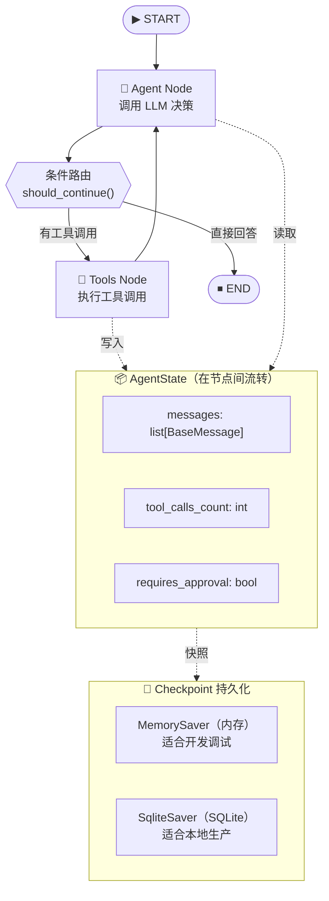

# 4.5 【动手】用 LangGraph 构建有状态 Agent

## 实验目标

本节结束后，你将能够：用 LangGraph 从零搭建一个带工具调用、支持中断恢复的有状态 ReAct Agent——不是"跑通 Hello World"，而是理解为什么 LangGraph 要用图结构来建模 Agent、Checkpoint 解决的是什么根本问题。

**核心学习点（3 个）：**
1. **State 是一等公民**：理解为什么 Agent 的"记忆"本质是一个在 Node 间流转的状态对象，而不是隐式的全局变量
2. **条件边是控制流的声明式表达**：掌握如何用 `conditional_edges` 实现"调用工具 → 继续 → 结束"的动态路由，替代手写 if/else 的意大利面代码
3. **Checkpoint = 可重放的执行历史**：学会用 `MemorySaver` / `SqliteSaver` 持久化 Agent 状态，实现中断恢复与人工审批卡点

---

## 架构总览

我们要构建的是一个**研究助手 Agent**：接收用户问题 → 决策是否搜索 → 调用搜索工具 → 生成回答。同时支持在"高风险操作"前插入人工审批节点。



---

## 环境准备

```bash
# 创建虚拟环境（uv）
uv venv --python 3.11
source .venv/bin/activate  # Windows: .venv\Scripts\activate

# 安装依赖
uv pip install -r requirements.txt
```

配置 `.env` 文件（复制 `.env.example` 并填入你的 API Key）：

```bash
# .env
DEEPSEEK_API_KEY=sk-...        # DeepSeek API Key
DASHSCOPE_API_KEY=sk-...       # 阿里云 DashScope（通义千问）
TAVILY_API_KEY=tvly-...        # 搜索工具（可选，未配置时使用 Mock 搜索）
```

> 默认使用 `core_config.py` 中的 `ACTIVE_MODEL_KEY = "DeepSeek-V3"` 通过 LiteLLM 路由。也可在 `agent.py` 中使用 `create_llm(provider="anthropic")` 直连 Claude 或 `create_llm(provider="openai")` 直连 GPT。

---

## Step-by-Step 实现

### Step 1：定义 AgentState——Agent 的"血液"

**目标**：定义贯穿整个 Agent 生命周期的状态结构。这是 LangGraph 与 LangChain 传统 Chain 最根本的区别——状态是显式的、可检查的、可恢复的。

```python
# state.py
from typing import Annotated, Literal
from langgraph.graph.message import add_messages
from langchain_core.messages import BaseMessage
from typing_extensions import TypedDict


class AgentState(TypedDict):
    """Agent 运行时的完整状态。
    
    字段说明：
    - messages: 对话历史，使用 add_messages reducer 自动合并而非覆盖
    - tool_calls_count: 本轮工具调用计数，用于防止无限循环
    - requires_approval: 标记是否需要人工审批后才能继续执行
    """
    # Annotated + add_messages 是 LangGraph 的核心约定：
    # 多个节点向 messages 写入时，自动 append 而非覆盖
    messages: Annotated[list[BaseMessage], add_messages]
    tool_calls_count: int
    requires_approval: bool
```

**关键点**：
- `Annotated[list[BaseMessage], add_messages]` 是 LangGraph 的 **Reducer** 机制。Node 返回 `{"messages": [new_msg]}`，LangGraph 会自动把 `new_msg` 追加到现有列表，而不是替换整个列表。这是分布式状态合并的核心思想。
- `TypedDict` 而非 `dataclass`：推荐使用 TypedDict 定义 State（LangGraph 0.2+ 也支持 Pydantic 模型，但 TypedDict 更直观），State 必须是可序列化的 dict 结构，便于 Checkpoint 持久化。
- ⚠️ 如果你的字段没有 Reducer，节点返回该字段时会**完全覆盖**旧值，这是新手最常踩的坑。

---

### Step 2：统一大模型配置——core_config.py

**目标**：通过 `core_config.py` 中的 `MODEL_REGISTRY` 统一管理所有模型配置，避免在业务代码中硬编码模型名和 API Key。

```python
# core_config.py
"""全局配置：模型注册表与定价信息"""
import os
from typing import TypedDict


class ModelConfig(TypedDict, total=False):
    litellm_id: str          # LiteLLM 识别的模型字符串（含 provider 前缀）
    chat_model_id: str       # OpenAI/Anthropic SDK 直连时使用的模型名（无前缀）
    price_in: float          # 每 1K input tokens 价格（美元）
    price_out: float         # 每 1K output tokens 价格（美元）
    max_tokens_limit: int    # 模型支持的最大 max_tokens
    api_key_env: str | None  # API Key 环境变量名
    base_url: str | None     # API 基础 URL（None 表示使用默认）


# 注册表：key 是界面显示名，value 是调用配置
MODEL_REGISTRY: dict[str, ModelConfig] = {
    "DeepSeek-V3": {
        "litellm_id": "deepseek/deepseek-chat",
        "chat_model_id": "deepseek-chat",
        "price_in": 0.00027,
        "price_out": 0.0011,
        "max_tokens_limit": 8192,
        "api_key_env": "DEEPSEEK_API_KEY",
        "base_url": "https://api.deepseek.com/v1",
    },
    "Qwen-Max": {
        "litellm_id": "qwen/qwen-plus",
        "chat_model_id": "qwen-plus",
        "price_in": 0.001,
        "price_out": 0.004,
        "max_tokens_limit": 4096,
        "api_key_env": "DASHSCOPE_API_KEY",
        "base_url": "https://dashscope.aliyuncs.com/compatible-mode/v1",
    },
    # 以下模型用于 LangChain 直连（不通过 LiteLLM），保留显示名供切换参考
    "Claude-Sonnet": {
        "litellm_id": "anthropic/claude-sonnet-4-20250514",
        "chat_model_id": "claude-sonnet-4-20250514",
        "price_in": 0.003,
        "price_out": 0.015,
        "max_tokens_limit": 8192,
        "api_key_env": "ANTHROPIC_API_KEY",
        "base_url": None,
    },
    "GPT-4o-Mini": {
        "litellm_id": "gpt-4o-mini",
        "chat_model_id": "gpt-4o-mini",
        "price_in": 0.00015,
        "price_out": 0.0006,
        "max_tokens_limit": 16384,
        "api_key_env": "OPENAI_API_KEY",
        "base_url": None,
    },
}

# 当前激活模型 key — 修改此处全局切换
# 默认使用 LiteLLM 路由的 DeepSeek-V3，
# agent.py 中 create_llm(provider="default") 即使用此模型
ACTIVE_MODEL_KEY: str = "DeepSeek-V3"


def get_active_config() -> ModelConfig:
    """获取当前激活模型的完整配置"""
    return MODEL_REGISTRY[ACTIVE_MODEL_KEY]


def get_litellm_id(model_key: str | None = None) -> str:
    """获取指定模型的 LiteLLM SDK ID（含 provider 前缀，如 deepseek/deepseek-chat）"""
    key = model_key or ACTIVE_MODEL_KEY
    return MODEL_REGISTRY[key]["litellm_id"]


def get_chat_model_id(model_key: str | None = None) -> str:
    """获取 OpenAI/Anthropic SDK 直连时使用的模型名（无前缀，如 deepseek-chat）"""
    key = model_key or ACTIVE_MODEL_KEY
    cfg = MODEL_REGISTRY[key]
    return cfg.get("chat_model_id", cfg["litellm_id"].split("/")[-1])


def get_api_key(model_key: str | None = None) -> str | None:
    """从环境变量读取指定模型的 API Key"""
    key = model_key or ACTIVE_MODEL_KEY
    env_var = MODEL_REGISTRY[key].get("api_key_env")
    return os.environ.get(env_var) if env_var else None


def get_base_url(model_key: str | None = None) -> str | None:
    """获取指定模型的 base_url（None 表示使用 SDK 默认值）"""
    key = model_key or ACTIVE_MODEL_KEY
    return MODEL_REGISTRY[key].get("base_url")


def get_model_list() -> list[str]:
    """获取所有已注册模型的显示名列表"""
    return list(MODEL_REGISTRY.keys())


def estimate_cost(model_key: str, input_tokens: int, output_tokens: int) -> float:
    """根据 Token 数估算调用费用（美元）"""
    cfg = MODEL_REGISTRY[model_key]
    return (
        input_tokens / 1000 * cfg.get("price_in", 0)
        + output_tokens / 1000 * cfg.get("price_out", 0)
    )
```

**关键点**：
- `MODEL_REGISTRY` 集中管理所有模型的配置，包括 LiteLLM ID、SDK 直连模型名、定价、环境变量名等。
- `ACTIVE_MODEL_KEY` 是全局开关，修改一行即可切换模型，无需改动业务代码。
- `get_chat_model_id()` 用于 OpenAI/Anthropic SDK 直连场景（无前缀模型名），`get_litellm_id()` 用于 LiteLLM 路由（含 provider 前缀）。

---

### Step 3：定义工具——Agent 的"手"

**目标**：注册 Agent 可调用的工具集。工具是 LangGraph 中唯一能与外部世界交互的接口。本项目实现了**优雅降级**：未配置 Tavily API Key 时自动使用 Mock 搜索工具，确保代码在无 Key 环境下也能导入运行。

```python
# tools.py
import os
from pathlib import Path
from dotenv import load_dotenv
from langchain_core.tools import tool

# 尝试从多个位置加载 .env 文件
# 1. 当前工作目录
# 2. 项目根目录（向上查找）
env_loaded = load_dotenv()
if not env_loaded:
    project_root = Path(__file__).resolve().parent
    while project_root.parent != project_root:
        env_path = project_root / ".env"
        if env_path.exists():
            load_dotenv(env_path)
            break
        project_root = project_root.parent


def get_search_tool():
    """返回配置好的搜索工具。

    优先使用 TavilySearchResults（需 TAVILY_API_KEY）；
    若未配置则返回一个 Mock 搜索工具，避免 ImportError 阻塞导入。

    max_results=3 是经验值：结果太多会撑爆上下文窗口，
    太少可能漏掉关键信息。可根据模型上下文大小调整。
    """
    if os.getenv("TAVILY_API_KEY") and os.getenv("TAVILY_API_KEY") != "test_dummy_key":
        from langchain_tavily import TavilySearch
        return TavilySearch(max_results=3)
    else:
        return mock_search


@tool
def mock_search(query: str) -> str:
    """搜索网络获取最新信息。

    Args:
        query: 搜索查询词

    Returns:
        模拟的搜索结果（当 TAVILY_API_KEY 未配置时使用）
    """
    return f"[模拟搜索] 关于'{query}'：当前未配置 TAVILY_API_KEY，此为占位结果。请设置真实的 Tavily API Key 启用真实搜索。"


@tool
def calculate(expression: str) -> str:
    """安全地执行数学计算表达式。
    
    Args:
        expression: 合法的 Python 数学表达式，如 "2 ** 10 + 100"
    
    Returns:
        计算结果的字符串表示
    
    Example:
        >>> calculate("(1024 * 1024) / 1000")
        '1048.576'
    """
    # ⚠️ 生产环境应使用沙箱（E2B / Modal），这里用白名单简化演示
    allowed_names = {"__builtins__": {}}
    import math
    allowed_names.update({k: getattr(math, k) for k in dir(math) if not k.startswith("_")})
    try:
        result = eval(expression, allowed_names)  # noqa: S307
        return str(result)
    except Exception as e:
        return f"计算错误: {e}"


# 工具列表，后续绑定到 LLM 和 ToolNode
TOOLS = [get_search_tool(), calculate]
```

**关键点**：
- `get_search_tool()` 在运行时动态选择真实工具或 Mock 工具，避免了在无 API Key 时 `import` 失败的问题。
- `.env` 加载支持**自动向上查找**，即使从项目根目录运行也能找到子目录下的 `.env`。
- `TavilySearch` 来自 `langchain_tavily` 包（不是 `langchain_community`），这是 LangChain 官方的独立包。

---

### Step 4：构建 Agent Node——LLM 决策中枢

**目标**：实现核心的"大脑"节点——调用绑定了工具的 LLM，输出决策（直接回答 or 调用工具）。支持三种 LLM 路由方式。

```python
# agent.py
from langchain_anthropic import ChatAnthropic
from langchain_openai import ChatOpenAI
from langchain_core.messages import SystemMessage
from state import AgentState
from tools import TOOLS
from core_config import get_litellm_id, get_chat_model_id, get_api_key, get_base_url, ACTIVE_MODEL_KEY, MODEL_REGISTRY


def create_llm(provider: str = "default"):
    """工厂函数：按提供商创建 LLM 实例并绑定工具。

    provider 可选值：
    - "default": 使用 core_config 中 ACTIVE_MODEL_KEY 对应的模型（通过 LiteLLM 路由）
    - "anthropic": 直连 Anthropic Claude
    - "openai": 直连 OpenAI GPT

    bind_tools() 是关键：它把工具的 JSON Schema 注入到每次请求，
    让模型知道有哪些工具可用，返回的 AIMessage 可能携带 tool_calls。
    """
    if provider == "anthropic":
        llm = ChatAnthropic(model=get_chat_model_id("Claude-Sonnet"), temperature=0)
    elif provider == "openai":
        llm = ChatOpenAI(model=get_chat_model_id("GPT-4o-Mini"), temperature=0)
    else:
        # 默认路径：通过 LiteLLM 调用，模型由 core_config 统一管理
        from langchain_litellm import ChatLiteLLM

        llm = ChatLiteLLM(
            model=get_litellm_id(),
            api_key=get_api_key(),
            api_base=get_base_url(),
            temperature=0,
        )

    return llm.bind_tools(TOOLS)


SYSTEM_PROMPT = """你是一个专业的研究助手，能够搜索最新信息并进行计算。

工作原则：
1. 对于需要实时信息的问题，优先使用搜索工具
2. 对于数学计算，使用计算器工具确保准确性
3. 综合多个搜索结果后给出有依据的回答
4. 如果不确定，如实说明，不要编造信息

当前工具限制：每轮对话最多调用工具 5 次，超出后必须给出最终回答。"""


def agent_node(state: AgentState) -> dict:
    """Agent 核心节点：接收当前状态，调用 LLM，返回状态更新。

    Node 的契约：
    - 输入：完整的 AgentState
    - 输出：需要更新的字段（partial update），LangGraph 负责合并

    这个函数是纯函数：相同输入 → 相同（类型的）输出，便于测试和调试。
    """
    llm_with_tools = create_llm()

    # 注入系统提示（每次调用都加，确保模型行为一致）
    messages = [SystemMessage(content=SYSTEM_PROMPT)] + state["messages"]

    response = llm_with_tools.invoke(messages)

    # 只返回需要更新的字段，LangGraph 的 Reducer 负责合并
    return {
        "messages": [response],
        "tool_calls_count": state["tool_calls_count"] + (
            1 if hasattr(response, "tool_calls") and response.tool_calls else 0
        ),
    }
```

**关键点**：
- **三种 LLM 路由**：`default` 走 LiteLLM（模型由 `core_config` 统一控制），`anthropic` 直连 Claude，`openai` 直连 GPT。
- `temperature=0` 让工具调用决策更稳定，避免随机性导致的死循环。
- Node 返回 `dict` 而非完整 `AgentState`——LangGraph 会做 **partial update**，只覆盖你返回的字段。这是与函数式状态机的核心设计哲学。
- ⚠️ `state["messages"]` 里已经包含了所有历史，不要手动维护对话历史！LangGraph 的 `add_messages` reducer 已经处理了。

---

### Step 5：条件路由——Agent 的"导航仪"

**目标**：实现动态路由逻辑，决定 LLM 的输出应该导向"执行工具"还是"结束对话"。

```python
# router.py
from typing import Literal
from langchain_core.messages import AIMessage
from state import AgentState

# 工具调用上限：防止 Agent 陷入无限工具调用循环
MAX_TOOL_CALLS = 5


def should_continue(state: AgentState) -> Literal["tools", "end"]:
    """条件边路由函数：返回值对应 conditional_edges 中定义的路由 key。
    
    路由逻辑（优先级从高到低）：
    1. 工具调用次数超上限 → 强制结束，防止死循环
    2. 最新消息有 tool_calls → 路由到 tools 节点
    3. 否则 → 结束
    
    Returns:
        "tools": 路由到工具执行节点
        "end": 路由到 END，对话结束
    """
    last_message = state["messages"][-1]
    
    # 安全阀：超过调用上限，强制结束
    if state["tool_calls_count"] >= MAX_TOOL_CALLS:
        return "end"
    
    # 检查 LLM 是否决定调用工具
    if isinstance(last_message, AIMessage) and last_message.tool_calls:
        return "tools"
    
    return "end"


def check_approval(state: AgentState) -> Literal["approved", "pending"]:
    """人工审批卡点路由函数（用于高风险操作场景）。
    
    当 requires_approval=True 时，Agent 会在此节点暂停（interrupt），
    等待外部系统修改 state 后再继续执行。
    """
    if state.get("requires_approval", False):
        return "pending"
    return "approved"
```

**关键点**：
- 条件路由函数的返回值必须与 `add_conditional_edges` 中的 `path_map` 键完全匹配，拼写错误会静默失败（路由到 None 导致图中断）。
- `MAX_TOOL_CALLS` 安全阀是生产必备，真实案例中 GPT-4 在某些 Prompt 下会连续调用同一工具 20+ 次，造成巨额费用。

---

### Step 6：组装图——把积木拼成 Agent

**目标**：用 `StateGraph` 把前面定义的 Node、Edge、Router 组装成一个完整的可执行 Agent。

```python
# graph.py
from langgraph.graph import StateGraph, START, END
from langgraph.prebuilt import ToolNode
from langgraph.checkpoint.memory import MemorySaver
from state import AgentState
from agent import agent_node
from router import should_continue
from tools import TOOLS


def build_graph(use_memory: bool = True) -> "CompiledGraph":
    """构建并编译 Agent 图。
    
    Args:
        use_memory: 是否启用内存 Checkpoint（开发调试用）
                   生产环境建议切换为 SqliteSaver 或 PostgresSaver
    
    Returns:
        编译后的图，可直接调用 .invoke() / .stream()
    """
    # 1. 初始化图，绑定 State Schema
    graph_builder = StateGraph(AgentState)
    
    # 2. 添加节点
    # agent_node: 我们自定义的 LLM 决策节点
    graph_builder.add_node("agent", agent_node)
    
    # ToolNode 是 LangGraph 预置的工具执行节点：
    # 自动解析 AIMessage 中的 tool_calls，执行对应工具，
    # 将结果包装成 ToolMessage 追加到 messages
    graph_builder.add_node("tools", ToolNode(TOOLS))
    
    # 3. 定义边（控制流）
    # 入口：START → agent
    graph_builder.add_edge(START, "agent")
    
    # 条件边：agent 执行完毕后，根据 should_continue 的返回值路由
    graph_builder.add_conditional_edges(
        source="agent",           # 从哪个节点出发
        path=should_continue,     # 路由函数
        path_map={                # 返回值 → 目标节点映射
            "tools": "tools",
            "end": END,
        },
    )
    
    # 固定边：工具执行完毕后，无条件回到 agent 节点（ReAct 循环）
    graph_builder.add_edge("tools", "agent")
    
    # 4. 配置 Checkpoint（状态持久化）
    checkpointer = MemorySaver() if use_memory else None
    
    # 5. 编译图（compile 会做静态验证：检查孤立节点、死路等）
    return graph_builder.compile(checkpointer=checkpointer)


# 模块级别的图实例（单例，避免重复编译）
agent_graph = build_graph(use_memory=True)
```

**关键点**：
- `ToolNode` 是 LangGraph 预置的标准工具执行节点，内部处理了工具找不到、工具异常等边界情况，优先使用而非自己实现。
- `compile()` 是静态检查关卡，会报告未连接节点等图结构错误，方便在启动时而非运行时发现问题。
- ⚠️ `MemorySaver` 仅存在内存中，进程重启后 Checkpoint 丢失。生产环境用 `SqliteSaver("checkpoints.db")` 或 `AsyncPostgresSaver`。

---

### Step 7：Checkpoint 持久化——中断恢复与人工审批

**目标**：演示 Checkpoint 最核心的两个用途：（1）对话持久化；（2）人工审批卡点（Human-in-the-Loop）。

```python
# checkpoint_demo.py
from langgraph.graph import StateGraph, START, END
from langgraph.checkpoint.memory import MemorySaver
from langgraph.checkpoint.sqlite import SqliteSaver
from langchain_core.messages import HumanMessage
from graph import build_graph


def demo_multi_turn_memory():
    """演示：Checkpoint 实现多轮对话状态持久化。
    
    thread_id 是会话标识符，同一 thread_id 的调用会共享状态历史。
    不同 thread_id 之间完全隔离，天然支持多用户场景。
    """
    graph = build_graph(use_memory=True)
    
    # thread_id 标识一个对话会话，可以是用户ID、会话UUID等
    config = {"configurable": {"thread_id": "user_001_session_1"}}
    
    # 第一轮对话
    print("=== 第一轮 ===")
    result = graph.invoke(
        input={
            "messages": [HumanMessage(content="LangGraph 是什么？它和 LangChain 有什么区别？")],
            "tool_calls_count": 0,
            "requires_approval": False,
        },
        config=config,
    )
    print(result["messages"][-1].content[:200])
    
    # 查看 Checkpoint 快照（调试用）
    snapshot = graph.get_state(config)
    print(f"\n当前状态快照：messages 数量={len(snapshot.values['messages'])}")
    
    # 第二轮对话：不需要重传历史，Checkpoint 自动恢复上下文
    print("\n=== 第二轮（自动携带上轮历史）===")
    result2 = graph.invoke(
        input={"messages": [HumanMessage(content="它支持哪些 Checkpoint 后端？")]},
        # LangGraph 会从 Checkpoint 中恢复完整状态，再 merge 新的 messages
        config=config,
    )
    print(result2["messages"][-1].content[:300])


def demo_human_approval():
    """演示：使用 interrupt_before 实现人工审批卡点。
    
    核心机制：compile(interrupt_before=["tools"]) 让 Agent 在即将执行工具前暂停，
    将控制权交还给调用方。调用方检查 pending tool_calls，决定是否批准继续执行。
    """
    # 创建带中断点的图：在执行 tools 节点前暂停
    from state import AgentState
    from agent import agent_node
    from router import should_continue
    from tools import TOOLS
    from langgraph.prebuilt import ToolNode

    graph_builder = StateGraph(AgentState)
    graph_builder.add_node("agent", agent_node)
    graph_builder.add_node("tools", ToolNode(TOOLS))
    graph_builder.add_edge(START, "agent")
    graph_builder.add_conditional_edges("agent", should_continue, {"tools": "tools", "end": END})
    graph_builder.add_edge("tools", "agent")
    
    checkpointer = MemorySaver()
    # interrupt_before=["tools"] 是关键：Agent 决策后、工具执行前暂停
    approval_graph = graph_builder.compile(
        checkpointer=checkpointer,
        interrupt_before=["tools"],
    )
    
    config = {"configurable": {"thread_id": "approval_demo_001"}}
    
    # Step 1：发起请求，Agent 决策调用工具后暂停
    print("=== 发起请求（Agent 即将调用工具）===")
    result = approval_graph.invoke(
        input={
            "messages": [HumanMessage(content="搜索 LangGraph 最新版本号")],
            "tool_calls_count": 0,
            "requires_approval": False,
        },
        config=config,
    )
    
    # 此时图已暂停，检查 Agent 想做什么
    snapshot = approval_graph.get_state(config)
    last_msg = snapshot.values["messages"][-1]
    
    if hasattr(last_msg, "tool_calls") and last_msg.tool_calls:
        print(f"\n⏸️  Agent 暂停，待审批的工具调用：")
        for tc in last_msg.tool_calls:
            print(f"   工具: {tc['name']}, 参数: {tc['args']}")
        
        # Step 2：模拟人工审批（实际场景可接入 Slack Bot / 审批系统）
        approved = input("\n✅ 批准执行? (y/n): ").strip().lower() == "y"
        
        if approved:
            print("\n▶️  已批准，继续执行...")
            # 传入 None 作为 input，从 Checkpoint 恢复继续执行
            final_result = approval_graph.invoke(None, config=config)
            print(f"\n最终回答：{final_result['messages'][-1].content}")
        else:
            print("\n❌ 已拒绝，中止执行")


if __name__ == "__main__":
    demo_multi_turn_memory()
    demo_human_approval()
```

**关键点**：
- `thread_id` 是 Checkpoint 的隔离键，可以用 `user_id + session_id` 的组合，支持多用户天然隔离。
- `interrupt_before=["tools"]` 是声明式中断，比在 Node 里手写 `input()` 等待更优雅，因为状态已被 Checkpoint 保存，中断期间进程可以重启。
- ⚠️ 第二轮调用时只传**新增**的 messages，不要重传完整状态——LangGraph 从 Checkpoint 恢复后做 merge，重传会导致状态字段被覆盖。

---

### Step 8：LangGraph Studio 可视化调试

**目标**：用 LangGraph Studio 直观查看图结构和执行 Trace，生产调试效率提升 10 倍。

`langgraph.json`（项目根目录，Studio 配置文件）：

```json
{
  "dependencies": ["."],
  "graphs": {
    "research_agent": "./graph.py:agent_graph"
  },
  "env": ".env"
}
```

```bash
# 安装 LangGraph CLI
uv pip install "langgraph-cli[inmem]"

# 启动 Studio（本地开发服务器）
langgraph dev

# 浏览器访问：http://localhost:8123
# 可视化功能：
# 1. 图结构预览：自动渲染 Node/Edge 拓扑
# 2. 实时 Trace：每步 Node 输入/输出的完整状态
# 3. 时间旅行：点击历史快照重放任意一步
# 4. 手动干预：在 Playground 中修改 State 后继续执行
```

> ⚠️ **生产注意**：LangGraph Studio 仅用于开发调试，不要在生产环境暴露。生产可观测性接入 LangFuse 或 LangSmith（见 Module 6.5）。

---

## 完整运行验证

```python
# run_agent.py —— 端到端冒烟测试，直接复制运行
import os
from dotenv import load_dotenv
from langchain_core.messages import HumanMessage
from graph import build_graph

load_dotenv()

def run_smoke_test():
    """端到端验证：搜索工具 + 多轮对话 + Checkpoint 恢复。"""
    graph = build_graph(use_memory=True)
    config = {"configurable": {"thread_id": "smoke_test_001"}}
    
    test_cases = [
        "今天是几号？LangGraph 0.2 版本有哪些重要更新？",
        "它的最新版本号是多少？",  # 测试多轮上下文
        "2 的 16 次方等于多少？",  # 测试计算器工具
    ]
    
    for i, question in enumerate(test_cases, 1):
        print(f"\n{'='*60}")
        print(f"[第{i}轮] {question}")
        print("-" * 60)
        
        # 流式输出：实时看到工具调用过程
        for event in graph.stream(
            input={
                "messages": [HumanMessage(content=question)],
                "tool_calls_count": 0,
                "requires_approval": False,
            },
            config=config,
            stream_mode="values",  # 每次 State 更新都输出
        ):
            last_msg = event["messages"][-1]
            msg_type = type(last_msg).__name__
            
            if msg_type == "AIMessage":
                if hasattr(last_msg, "tool_calls") and last_msg.tool_calls:
                    for tc in last_msg.tool_calls:
                        print(f"  🔧 调用工具: {tc['name']}({tc['args']})")
                elif last_msg.content:
                    print(f"  🤖 回答: {last_msg.content[:300]}")
            elif msg_type == "ToolMessage":
                print(f"  📥 工具结果: {str(last_msg.content)[:100]}...")


if __name__ == "__main__":
    run_smoke_test()
```

**预期输出**：

```
============================================================
[第1轮] 今天是几号？LangGraph 0.2 版本有哪些重要更新？
------------------------------------------------------------
  🔧 调用工具: tavily_search_results_json({'query': 'LangGraph 0.2 updates changelog 2025'})
  📥 工具结果: [{"url": "https://github.com/langchain-ai/langgraph...", "content": "..."}]...
  🤖 回答: 根据搜索结果，LangGraph 0.2 版本的重要更新包括...

============================================================
[第2轮] 它的最新版本号是多少？
------------------------------------------------------------
  🔧 调用工具: tavily_search_results_json({'query': 'LangGraph latest version 2025'})
  📥 工具结果: ...
  🤖 回答: 根据我们刚才讨论的内容和最新搜索，LangGraph 目前最新稳定版本为 0.2.68...

============================================================
[第3轮] 2 的 16 次方等于多少？
------------------------------------------------------------
  🔧 调用工具: calculate({'expression': '2 ** 16'})
  📥 工具结果: 65536...
  🤖 回答: 2 的 16 次方等于 65536。
```

---

## 常见报错与解决方案

| 报错信息 | 原因 | 解决方案 |
|---------|------|---------|
| `ValueError: Found edge going to unknown node` | `add_conditional_edges` 中 `path_map` 的 key 与路由函数返回值不匹配 | 检查路由函数返回的字符串与 `path_map` 中的 key 拼写是否完全一致 |
| `KeyError: 'tool_calls_count'` | 第一次调用时 State 初始化缺少字段 | `invoke()` 的 `input` 必须包含 State 所有必填字段的初始值 |
| `InvalidUpdateError: Expected dict, got ...` | Node 函数返回了非 dict 类型 | 确保所有 Node 函数返回 `dict`，如 `{"messages": [response]}` |
| `RateLimitError` 在工具调用密集时 | 短时间内 LLM 调用次数超过 API 限制 | 在 `agent_node` 中加指数退避重试，或降低 `MAX_TOOL_CALLS` |
| `MemorySaver` 多进程下状态丢失 | `MemorySaver` 不跨进程共享 | 生产环境切换为 `SqliteSaver` 或 `AsyncPostgresSaver` |
| Studio 启动报 `Port 8123 already in use` | 端口被占用 | `langgraph dev --port 8124` 指定其他端口 |

---

## 项目文件结构

```
4.5 _动手_用 LangGraph 构建有状态 Agent/
├── core_config.py        # 大模型注册表（统一管理模型配置）
├── state.py              # AgentState 定义
├── tools.py              # 搜索工具 + 计算器（支持优雅降级）
├── agent.py              # LLM 决策节点（支持 LiteLLM/Anthropic/OpenAI 三种路由）
├── router.py             # 条件路由函数（should_continue + check_approval）
├── graph.py              # StateGraph 组装与编译
├── checkpoint_demo.py    # Checkpoint 多轮对话 + 人工审批演示
├── run_agent.py          # 端到端冒烟测试
├── requirements.txt      # 依赖清单
├── .env.example          # 环境变量模板
├── tests/
│   ├── __init__.py
│   ├── conftest.py
│   └── test_main.py      # 冒烟测试
└── _backup/              # 整理前的原始文件备份
```

---

## 扩展练习（可选）

1. 🟡 **中等**：为 Agent 添加**工具调用日志节点**——在 `tools` 节点执行后、`agent` 节点前，插入一个 `log_node`，将每次工具调用的输入/输出写入 SQLite 数据库，实现完整的审计日志链路。

2. 🟡 **中等**：实现**并行工具调用优化**——当 LLM 在单次响应中返回多个 `tool_calls` 时（如同时搜索两个关键词），使用 `asyncio.gather` 并发执行，将顺序执行的 N×T 延迟降至 T+epsilon，并在实验报告中记录延迟对比数据。

3. 🔴 **困难**：将 `MemorySaver` 替换为 `AsyncPostgresSaver`，结合 FastAPI 实现一个支持多用户并发的**生产级 Agent 服务**——要求：每个用户的 `thread_id` 隔离、支持 `/chat/stream` SSE 流式响应、`/history/{thread_id}` 接口返回完整对话历史，并用 Locust 压测验证 100 并发用户下 P99 延迟不超过 10s（不含 LLM 调用时间）。

---
