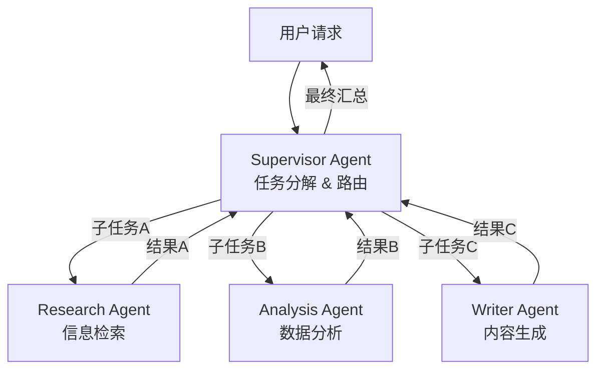
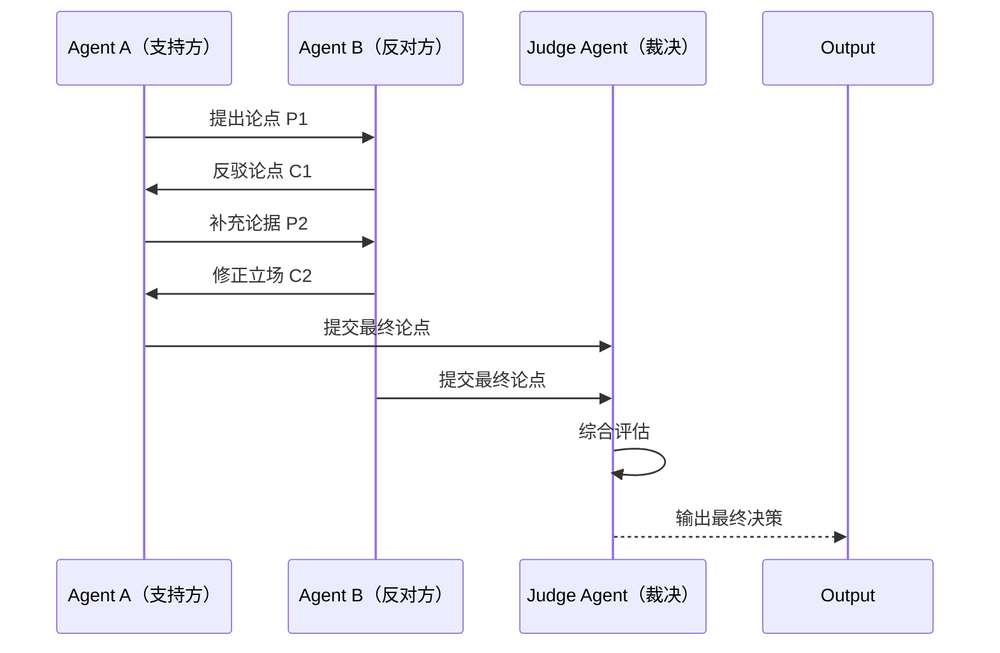
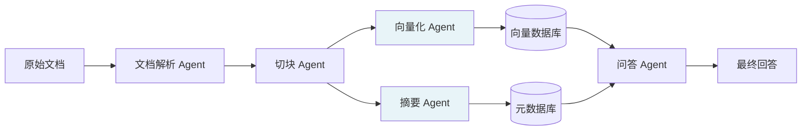
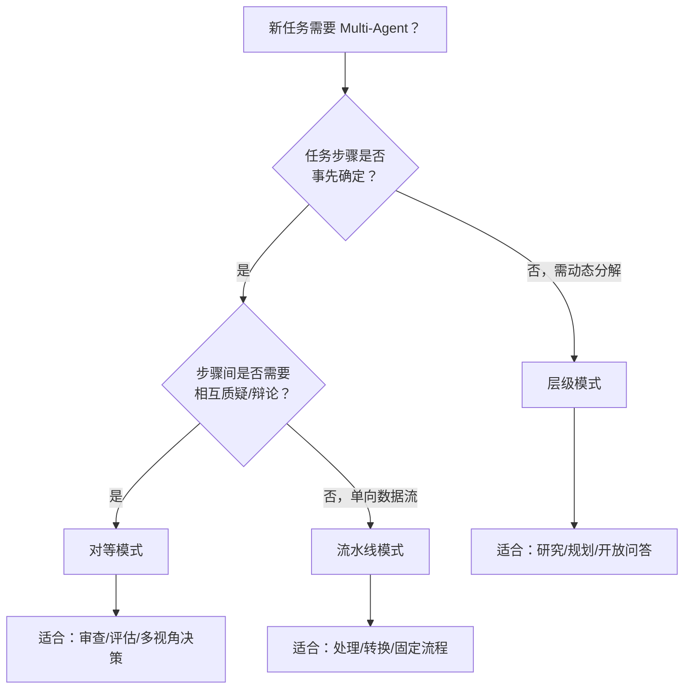

## 5.1 多 Agent 协作模式（层级 / 对等 / 流水线）

---

### 一、核心概念

单个 Agent 的本质局限在于：它是一个串行决策者。当你把"分析竞争对手、撰写营销方案、生成配图文案、推送到多个渠道"这类任务塞给一个 Agent，你会得到一个上下文爆炸、专注度涣散、失败无法追溯的泥团。

Multi-Agent 系统的核心价值不是"更多 AI"，而是**分治**——把一个复杂任务拆成若干边界清晰的子任务，由专职 Agent 并行或串行处理，通过协调机制汇聚结果。这套思路在软件工程里叫微服务，在人类组织里叫团队协作，到了 AI 系统里就是 Multi-Agent 架构。

当前生产级 Multi-Agent 系统主要有三种协作模式，它们不是竞争关系，而是适用于不同任务结构的工具：**层级模式**适合任务边界模糊、需要动态调度的场景；**对等模式**适合需要相互校验或博弈达成共识的场景；**流水线模式**适合任务依赖关系固定、各步骤输入输出明确的场景。选错模式不会让系统跑不起来，但会让你在调试死循环、Token 爆炸、结果不一致上浪费大量时间。

---

### 二、原理深讲

#### 2.1 层级模式（Hierarchical）

**工程动机**：你有一个任务，但你在设计系统时不确定它会被拆成几个子任务，或者子任务的边界会随输入变化。比如"帮我分析这份财报并给出投资建议"——对于简单财报可能只需要两步，对于复杂财报可能需要五步。这种动态性需要一个能"实时拆解和调度"的角色。

**核心机制**：Supervisor Agent 持有全局目标，负责将任务分解成子指令并分发给 Worker Agent，收到结果后判断是否需要继续迭代或汇总输出。Supervisor 本身不执行具体任务，它的核心能力是**任务规划**和**结果聚合**。



**工程建议**：
- Supervisor 的系统提示需要明确"你能分发哪些类型的任务"，否则它会创造出你没预料到的 Worker 类型
- Worker Agent 的工具集要严格限定，不要给 Research Agent 写数据库的权限——职责边界决定了系统的可预测性
- Supervisor 分发任务时推荐附带**成功标准**，而非只是任务描述，例如"检索 3 条以上来源，每条需包含日期"

#### 2.2 对等模式（Peer-to-Peer）

**工程动机**：某些任务天然需要"质疑与辩护"的过程才能提升质量。代码审查、方案评审、多角度分析——当你希望输出结论经过多方验证而非单线生成时，对等模式更合适。TradingAgents（Module 7 项目一）里的 Bull vs Bear 辩论就是这种模式的典型应用。

**核心机制**：Agent 之间地位平等，通过共享消息通道互相传递信息，没有固定的分发者。共识可以通过投票、辩论轮次上限、裁判 Agent 等方式收敛。



**工程建议**：
- 必须设置**终止条件**：最大轮次（通常 3-5 轮）+ 共识阈值，否则两个 Agent 可以永远互相质疑
- 对等模式的 Token 消耗是层级模式的 2-4 倍，不要在低价值任务上使用
- 消息历史要做**选择性截断**：每个 Agent 不需要看到完整的对话历史，只需要看到与自己立场相关的关键信息

#### 2.3 流水线模式（Pipeline / DAG）

**工程动机**：当任务可以被清晰地分解为若干**输入输出确定**的步骤，且步骤间存在明确依赖关系时，流水线是最高效、最可维护的选择。文档处理、数据 ETL、内容生成流水线都属于这类场景。它的优势在于每个节点独立可测、失败可重试、可并行化。

**核心机制**：用有向无环图（DAG）描述任务依赖，节点是 Agent 或处理函数，边是数据流。没有依赖关系的节点可以并行执行，大幅降低端到端延迟。



上图中 Embed 和 Summary 节点无依赖关系，可以并行执行。

**工程建议**：
- 每个节点的输入输出用 Pydantic Schema 强约束，避免上游输出格式变化静默导致下游崩溃
- 在关键节点之间加**检查点（Checkpoint）**，支持失败后从断点重跑而不是从头开始
- 流水线的调试比单 Agent 容易——每个节点独立可单元测试，这是它相对其他模式最大的工程优势

#### 2.4 模式选型决策树

| 考量维度 | 层级模式 | 对等模式 | 流水线模式 |
|--------|---------|---------|---------|
| 任务结构 | 动态、边界模糊 | 需多角度校验 | 固定、依赖明确 |
| 并行性 | 低（Supervisor 串行） | 中（轮次内并行） | 高（DAG 并行） |
| Token 消耗 | 中 | 高 | 低 |
| 调试难度 | 高（动态路径难追踪） | 中 | 低（节点独立） |
| 失败可恢复性 | 中 | 低 | 高（节点级重试） |
| 典型场景 | 研究助手、开放式规划 | 代码审查、投资决策 | 数据处理、内容生成 |



---

### 三、工程视角：常见误区与最佳实践

**误区 1：把所有问题都塞给层级模式**  
→ **正确做法**：层级模式的灵活性是有代价的——Supervisor 的调度决策不可预测，导致系统行为难以复现和测试。如果任务结构是固定的，优先选流水线，测试覆盖率会高出一个数量级。只有在真正需要"运行时动态规划"时才引入层级模式。

**误区 2：对等模式没有终止保护**  
→ **正确做法**：两个 Agent 在对等模式下极易进入"你说我错、我说你错"的死循环，且每轮都会消耗 Token。生产代码中必须硬编码 `max_rounds` 参数，并设计一个"强制收敛"机制——超过轮次后由 Judge Agent 或规则引擎强制输出结论。

**误区 3：流水线节点之间用字符串传递数据**  
→ **正确做法**：节点间通信用 Pydantic 模型而非原始字符串或字典。当上游 Agent 的输出格式发生变化时，Pydantic 的类型校验会在入口处立即报错，而不是让错误静默传播到第 5 个节点后才爆炸。示例：

```python
# ❌ 不要这样做
result = {"content": "...", "source": "..."}  # 字典无约束

# ✅ 正确做法
class SearchResult(BaseModel):
    content: str
    source: HttpUrl
    relevance_score: float = Field(ge=0.0, le=1.0)
```

**误区 4：把三种模式当互斥选项**  
→ **正确做法**：生产级系统通常是混合架构——外层用层级模式处理动态规划，某些子任务内部用流水线模式处理固定步骤，需要质量保证的节点用对等模式做验证。例如：Supervisor 分发任务给 Research Worker（内部是 DAG 流水线），Research 结果由 Reviewer 做对等审查后才返回 Supervisor。

**误区 5：忽略 Agent 间的消息历史膨胀**  
→ **正确做法**：在多 Agent 系统中，消息历史会被多个 Agent 共享和追加，Token 消耗呈乘法级增长而非加法级。需要从设计阶段就规划**消息可见性策略**：每个 Agent 只看自己需要的消息片段，而不是整个会话历史。LangGraph 通过 State 图的设计天然支持这种隔离。

---

### 四、延伸思考

> 🤔 **思考题 1**：流水线模式强调节点独立可测，但 AI Agent 节点的输出本质上是非确定性的——同样的输入可能产生不同输出。这对"流水线可测试性"这个优势构成了多大威胁？你会如何在 AI Agent 流水线中设计测试策略？

> 🤔 **思考题 2**：层级模式中，Supervisor 自身也是一个 LLM，它的任务拆解质量直接决定了整个系统的上限。当 Supervisor 出现拆解错误时，系统会产生"级联失败"——所有下游 Worker 都在执行错误的子任务。在不引入人工干预的前提下，你有哪些设计手段可以让系统具备自我纠错能力？
