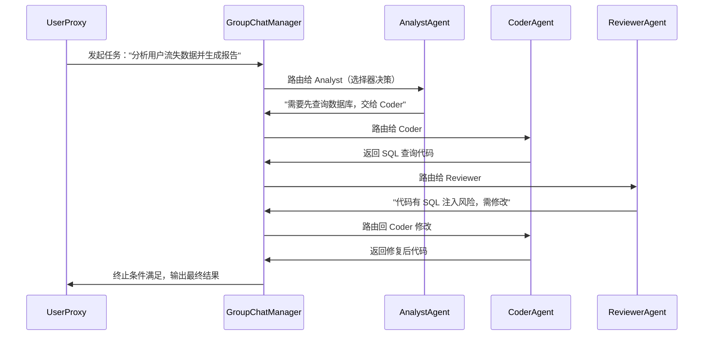
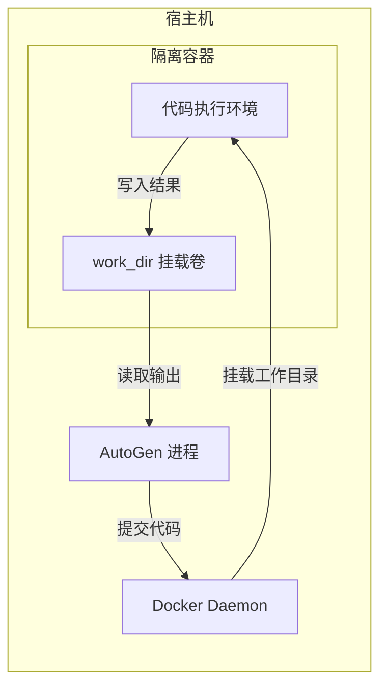
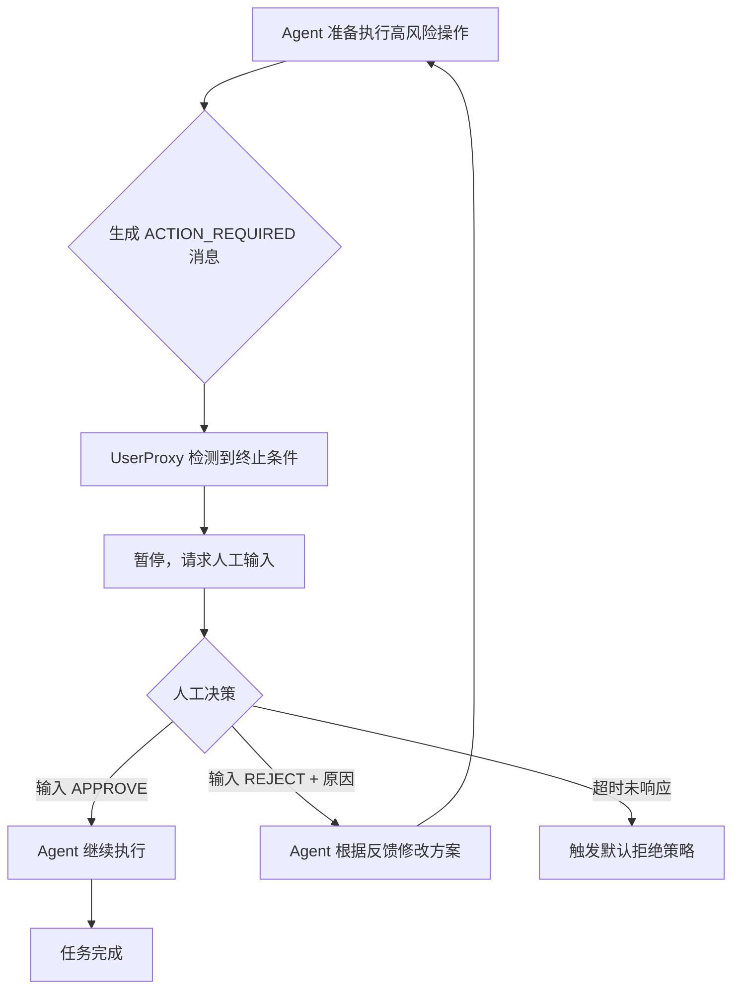

## 5.2 AutoGen 框架实战

---

### 一、核心概念

单个 Agent 能力再强，也有它的天花板：一个 Agent 既要理解需求、又要写代码、又要审查安全性、又要跑测试——上下文越来越长，角色越来越乱，最终输出质量随之下降。这是"单体 Agent"的本质问题，本质上和单体应用的问题一样——职责不清、难以扩展。

AutoGen 的核心答案是**对话驱动的多 Agent 协作**：把复杂任务拆解为多个专职 Agent 之间的对话，每个 Agent 只关心自己的职责，通过消息传递协作完成任务。这听起来像是"微服务化"，但 AutoGen 的独特之处在于：**协作本身是通过自然语言对话完成的，而不是函数调用或事件总线**——这让 Agent 之间的"接口"变得极其灵活，代价是需要额外管理对话的终止条件和信息流向。

理解 AutoGen，需要先理解它的两个核心层：单个 Agent 的行为抽象（`ConversableAgent`）和多 Agent 的编排抽象（`GroupChat`）。掌握这两层，你就能用 AutoGen 解决 80% 的多 Agent 场景。

---

### 二、原理深讲

#### 2.1 ConversableAgent：一切 Agent 的基类

**工程动机**：你需要一种抽象，让 Agent 能"说话"也能"执行"，能接收消息也能拒绝消息，还要能灵活接入 LLM 或本地函数。

`ConversableAgent` 就是这个抽象。它的核心设计理念是：**每个 Agent 都是一个能收发消息、能自主决定是否回复的实体**。收到消息时，Agent 按优先级依次尝试：注册的回复函数 → LLM 调用 → 人工输入 → 默认回复。

```python
# 示意结构，非完整代码
agent = ConversableAgent(
    name="analyst",
    system_message="你是一个数据分析专家...",
    llm_config={"model": "gpt-4o", "api_key": "..."},
    human_input_mode="NEVER",       # 何时请求人工介入
    is_termination_msg=lambda x: "DONE" in x["content"],  # 终止条件
    max_consecutive_auto_reply=10,  # 防止死循环
)
```

几个关键参数的工程含义：

| 参数 | 含义 | 工程建议 |
|------|------|---------|
| `human_input_mode` | `NEVER` / `TERMINATE` / `ALWAYS` | 生产环境用 `NEVER`，审批节点用 `TERMINATE` |
| `is_termination_msg` | 判断是否终止对话的函数 | 必须显式设置，否则依赖 `max_consecutive_auto_reply` 兜底 |
| `max_consecutive_auto_reply` | 最大自动回复次数 | 永远设置这个值，防止死循环导致 Token 爆炸 |
| `code_execution_config` | 代码执行器配置 | 生产环境必须用 Docker executor，见 2.2 节 |

AutoGen 内置了两个最常用的子类：`AssistantAgent`（默认不执行代码，适合生成内容）和 `UserProxyAgent`（默认可执行代码，适合作为"代理用户"驱动工作流）。大多数场景，你用这两个子类就够了，直接继承 `ConversableAgent` 是为了更细粒度的定制。

#### 2.2 GroupChat：多 Agent 协作的编排层

**工程动机**：两个 Agent 之间的对话好处理，但三个以上 Agent 需要协调——谁先说话？谁有资格回复？如何防止 Agent A 和 Agent B 互相刷屏而 Agent C 永远插不上话？

`GroupChat` 解决的是**发言权管理**问题。它本身不是 Agent，而是一个协调器：管理所有参与 Agent 的列表、维护共享消息历史、根据策略决定"下一个发言者"。`GroupChatManager` 则是驱动这个协调器的 Agent，它负责把消息路由给正确的 Agent。



发言者选择策略（`speaker_selection_method`）是 GroupChat 最关键的配置：

| 策略 | 机制 | 适用场景 |
|------|------|---------|
| `auto`（默认）| 由 GroupChatManager 用 LLM 决定下一个发言者 | 任务流动态、角色灵活时 |
| `round_robin` | 轮流发言 | 需要每个 Agent 都发表意见的评审场景 |
| `random` | 随机选择 | 几乎不用于生产 |
| 自定义函数 | 传入 `(last_speaker, groupchat) -> Agent` 的函数 | 需要确定性流程的生产场景 |

**工程建议**：`auto` 模式灵活但不可预测，而且每次路由都会消耗一次 LLM 调用。**生产环境优先用自定义选择器函数**，把状态机逻辑显式写出来，而不是依赖 LLM 来"猜"下一步该谁说话。如果你的流程是确定性的，LangGraph 往往是更好的选择（见 4.5 节）；如果流程本身需要动态协商，再考虑 AutoGen 的 `auto` 模式。

#### 2.3 代码执行沙箱：Docker Executor

**工程动机**：AutoGen 的经典场景是"写代码 + 执行代码"，但默认的本地执行模式直接在宿主机上运行生成的代码——LLM 生成的代码你真的敢直接跑吗？

答案当然是不行。**生产环境必须使用 Docker executor。**

```python
from autogen import UserProxyAgent
from autogen.coding import DockerCommandLineCodeExecutor

# 创建 Docker 执行器
executor = DockerCommandLineCodeExecutor(
    image="python:3.11-slim",   # 基础镜像，按需定制
    timeout=30,                  # 单次执行超时（秒）
    work_dir="./coding",         # 代码文件落盘目录（宿主机路径）
)

# 把执行器注入 UserProxyAgent
user_proxy = UserProxyAgent(
    name="executor",
    human_input_mode="NEVER",
    code_execution_config={"executor": executor},
)

# 使用 with 语句确保容器生命周期管理
with executor:
    # 在这个上下文里发起对话，代码会在容器内执行
    ...
```

Docker executor 的安全隔离边界：



关键安全配置建议：
- **网络隔离**：给容器设置 `--network none`（AutoGen 支持通过 `DockerCommandLineCodeExecutor` 的 `docker_config` 传入），阻止生成的代码发起网络请求
- **只读文件系统**：除 `work_dir` 挂载卷外，容器内其他目录设为只读
- **资源限制**：通过 `docker_config` 传入 `mem_limit`（如 `512m`）和 `cpu_period`/`cpu_quota` 防止资源滥用
- **镜像精简**：使用最小化镜像，不要用 `python:3.11`（包含 pip 缓存等冗余内容），用 `python:3.11-slim`

#### 2.4 Human-in-the-Loop：动态插入人工节点

**工程动机**：全自动 Agent 听起来很美，但涉及删库、发邮件、转账等高风险操作时，你需要人能随时"踩刹车"。问题是：如何把人工审批节点优雅地嵌入对话流，而不破坏 Agent 的整体执行逻辑？

AutoGen 通过 `human_input_mode` 和 `is_termination_msg` 的组合实现这一点：

```python
# 高风险操作前暂停等待人工确认的 Agent 配置
approval_proxy = UserProxyAgent(
    name="human_approver",
    human_input_mode="TERMINATE",  # 收到终止消息时请求人工输入
    is_termination_msg=lambda x: (
        x.get("content", "").startswith("ACTION_REQUIRED:")
    ),
    default_auto_reply="",  # 等待人工输入时的默认回复
)
```

工作流逻辑：



**三种 `human_input_mode` 的选型逻辑**：

| 模式 | 触发时机 | 适用场景 |
|------|---------|---------|
| `NEVER` | 从不请求人工 | 完全自动化的批处理任务 |
| `TERMINATE` | 满足终止条件时请求人工 | 需要在关键节点审批的工作流（推荐生产使用） |
| `ALWAYS` | 每条消息后都请求人工 | 调试阶段，或人工深度参与的交互式场景 |

**实际工程中的 Human-in-the-Loop 设计建议**：不要把人工审批逻辑耦合在 `is_termination_msg` 里——这个函数应该轻量。复杂的审批逻辑（如调用 Slack API 发送审批请求、等待 Webhook 回调）应该封装在一个独立的 `UserProxyAgent` 子类里，重写 `get_human_input` 方法。

---

### 三、工程视角：常见误区与最佳实践

**误区 1：在生产环境使用本地代码执行器**
→ **正确做法**：无论测试还是生产，只要涉及代码执行，都使用 `DockerCommandLineCodeExecutor`。本地执行器只适合你完全信任提示词的 toy demo。即使是内部工具，LLM 偶尔也会生成破坏文件系统的代码。

**误区 2：不设置 `max_consecutive_auto_reply` 和显式终止条件**
→ **正确做法**：两个必须同时设置，互为兜底。`is_termination_msg` 是"正常退出"，`max_consecutive_auto_reply` 是"紧急熔断"。生产环境建议 `max_consecutive_auto_reply` 不超过 20，同时监控 Token 消耗，发现异常立即告警。

**误区 3：GroupChat 的 `auto` 选择器用于生产流程**
→ **正确做法**：`auto` 模式每次路由多消耗一次 LLM 调用，且行为不可预测（相同输入可能路由到不同 Agent）。流程确定的场景用自定义选择器函数；流程高度动态（如需要 Agent 自己决定找谁帮忙）再用 `auto`，并加日志记录每次路由决策。

**误区 4：GroupChat 消息历史无限增长**
→ **正确做法**：GroupChat 默认把所有历史消息传给每个参与 Agent，在长任务中会撑爆上下文窗口。合理设置 `max_round`（GroupChat 的最大轮次），并考虑在 `GroupChatManager` 的 `system_message` 里指示它在适当时候进行摘要压缩。

**误区 5：用 AutoGen 处理确定性流程**
→ **正确做法**：AutoGen 的核心优势是"对话驱动的灵活协作"，它的代价是不确定性和额外的 LLM 调用开销。如果你的多 Agent 流程是 DAG（有向无环图）形式的确定性流程，用 LangGraph 的显式状态机更合适；如果流程需要 Agent 之间动态协商、反复辩论，AutoGen 才是更自然的选择。

---

### 四、延伸思考

> 🤔 **思考题 1**：AutoGen 的 GroupChat 把所有 Agent 的消息放在同一个共享历史里，这意味着任何 Agent 都能看到其他 Agent 的全部对话。在某些场景下（比如 Bull/Bear 辩论 Agent），这恰好是优点；但在某些场景下（比如安全审计 Agent 不应该被其他 Agent 的消息"污染"判断），这可能是问题。你会如何设计一个"局部可见性"的多 Agent 通信机制？

> 🤔 **思考题 2**：Human-in-the-Loop 的本质是在自动化流程中引入延迟等待。在高并发场景下（同时有 100 个 Agent 工作流在等待人工审批），如何设计一个既能批量处理审批请求、又不降低紧急任务响应速度的优先级队列系统？
