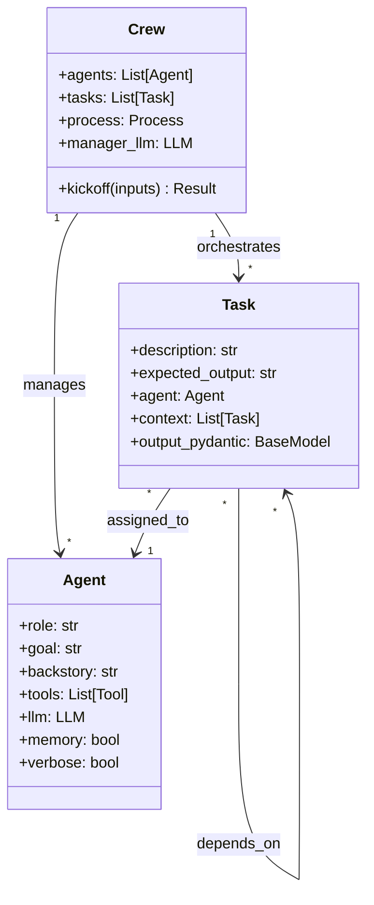
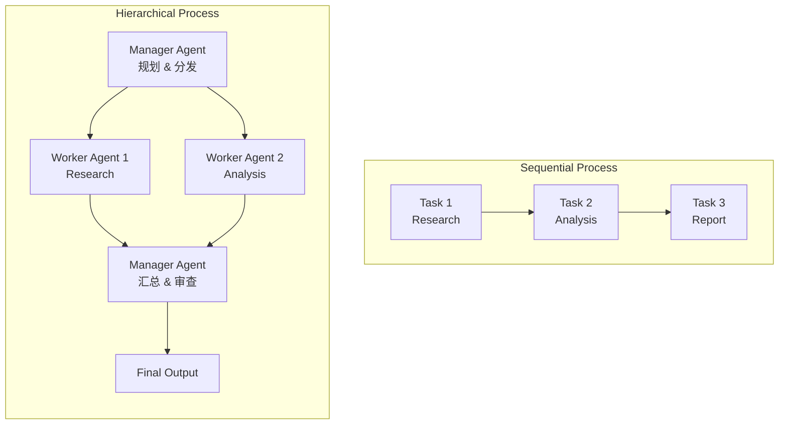

## 5.3 CrewAI 角色分工实战

### 一、核心概念

构建一个复杂的 AI 任务系统时，开发者往往会陷入一个陷阱：把所有职责都塞给一个 Agent，结果是 Prompt 越写越长、输出质量越来越不可控，改一个地方就破坏另一个地方。这本质上和软件工程里"上帝类"（God Class）的问题如出一辙——单一职责原则同样适用于 Agent 系统设计。

CrewAI 的核心思想是**角色分工驱动的协作**：将一个复杂任务拆解成多个专业角色，每个角色只做自己最擅长的事，通过结构化的任务流转最终完成整体目标。这个设计不只是工程上的"整洁"追求，背后有实证依据——给 LLM 一个聚焦的角色定义和清晰的任务边界，输出质量显著优于"你什么都得会"的通才 Agent。类比团队协作：一个有明确分工的研发团队，比同等人数的"每个人做所有事"的团队，交付质量和效率都更高。

CrewAI 用三个层次的抽象来表达这个思想：**Agent**（谁来做）、**Task**（做什么）、**Crew**（怎么协调）。理解这三层的职责边界，是用好 CrewAI 的关键。

---

### 二、原理深讲

#### 2.1 三层抽象建模：Agent / Task / Crew

先看整体结构：



**Agent：角色定义层**

Agent 是最核心的抽象，定义"这个角色是谁、能做什么"。三个最关键的字段：

- `role`：角色头衔，简洁有力，如 `"Senior Financial Analyst"`
- `goal`：这个角色在任务中追求的目标，驱动 LLM 的决策偏向
- `backstory`：背景故事，赋予角色专业性和个性，影响输出风格和深度

`tools` 定义这个 Agent 能调用的外部能力（搜索、代码执行、数据库查询等）。`memory=True` 会开启跨任务的记忆能力，适合需要上下文连贯的角色。

```python
from crewai import Agent

researcher = Agent(
    role="Market Research Specialist",
    goal="Find accurate and up-to-date market data about {industry}",
    backstory=(
        "You are a seasoned market researcher with 10 years of experience "
        "in competitive analysis. You are known for your ability to find "
        "non-obvious insights from public data sources."
    ),
    tools=[search_tool, scraping_tool],
    llm=llm,
    verbose=True,
)
```

**Task：任务定义层**

Task 描述"要做什么、输出什么"，与 Agent 解耦。一个关键设计原则：**Task 的 `expected_output` 要尽可能具体**，模糊的期望输出是质量不稳定的主要来源。

`context` 字段用于声明任务依赖——该任务需要读取哪些前置任务的输出。`output_pydantic` 可以强制输出结构化数据，这在需要将 Agent 输出传递给下游系统时非常关键。

```python
from crewai import Task

research_task = Task(
    description=(
        "Research the top 5 competitors in the {industry} space. "
        "For each competitor, identify their pricing model, target customer, "
        "and key differentiator."
    ),
    expected_output=(
        "A structured report with 5 competitor profiles, each containing: "
        "company name, pricing tier, target segment, and one-sentence differentiator."
    ),
    agent=researcher,
)

analysis_task = Task(
    description="Based on the competitor research, identify gaps and opportunities for our product.",
    expected_output="A list of 3-5 actionable opportunities with supporting evidence from the research.",
    agent=analyst,
    context=[research_task],  # 声明依赖，自动注入 research_task 的输出
)
```

**Crew：协调层**

Crew 是 Orchestrator，负责把 Agents 和 Tasks 组装起来并驱动执行。最重要的配置是 `process`，决定任务的执行方式。

---

#### 2.2 角色设计最佳实践：goal + backstory 对质量的影响

这是 CrewAI 里最被低估的工程细节，也是最影响输出质量的地方。

**为什么 goal + backstory 很重要？**

LLM 在生成回答时，会受到 system prompt 中角色设定的强烈约束——这是 RLHF 对齐的结果。一个好的 `goal` 能让模型在面对模糊情况时做出正确的取舍；一个好的 `backstory` 能让模型"激活"训练数据里该领域专家的知识和表达风格。

**goal 的设计原则**

`goal` 应该描述角色在这次任务中的**利益驱动**，而不是任务步骤：

```
❌ 弱 goal: "Analyze the data and write a report"
✅ 强 goal: "Produce analysis that helps the CEO make a go/no-go decision 
            with high confidence, prioritizing accuracy over comprehensiveness"
```

强 goal 包含了决策者是谁、质量标准是什么、取舍方向是哪边——这些信息会在 LLM 面临多种可能的表达方式时，影响它的选择。

**backstory 的设计原则**

`backstory` 最大的作用是**激活专业知识**和**校准输出风格**。有效的 backstory 包含：
1. 经验年限和专业领域（激活领域知识）
2. 工作风格或方法论偏好（校准输出风格）
3. 一个代表性的"成就"或"处事原则"（强化角色一致性）

```
✅ 有效 backstory:
"You are a senior software architect with 12 years of experience in distributed 
systems. You've designed infrastructure for systems serving 100M+ users. 
You are known for asking 'what happens when this fails?' before finalizing 
any design, and your reports always include explicit trade-off analysis."
```

这个 backstory 会让模型在输出架构分析时，自然地加入容错分析和 trade-off 对比——即使 Task 的 description 没有明确要求。

---

#### 2.3 Process 类型：Sequential vs Hierarchical

这是 CrewAI 里最重要的架构选择，直接影响任务执行逻辑和 Token 消耗。



| 维度 | Sequential | Hierarchical |
|------|-----------|--------------|
| 执行逻辑 | 按任务列表顺序线性执行 | Manager Agent 动态分配任务 |
| 适用场景 | 任务依赖链清晰、步骤固定 | 任务复杂、需要动态决策 |
| Token 消耗 | 较低（无 Manager 开销） | 较高（Manager 需额外推理） |
| 输出可控性 | 高（流程确定） | 中（Manager 行为有随机性） |
| 典型用例 | 内容生成流水线、报告生成 | 复杂研究任务、需要质量审核 |
| 配置复杂度 | 低 | 高（需配置 manager_llm） |

**Sequential：适合流程明确的任务**

任务之间有清晰的依赖关系，前一步的输出是后一步的输入，不需要动态调度：

```python
from crewai import Crew, Process

crew = Crew(
    agents=[researcher, analyst, writer],
    tasks=[research_task, analysis_task, writing_task],
    process=Process.sequential,  # 按列表顺序执行
    verbose=True,
)
result = crew.kickoff(inputs={"industry": "cloud storage"})
```

**Hierarchical：适合需要动态决策的复杂任务**

Manager Agent 会根据任务复杂度决定调用哪些 Worker、以什么顺序调用，并在最后汇总结果：

```python
crew = Crew(
    agents=[researcher, analyst, writer],  # Worker Agents
    tasks=[complex_research_task],
    process=Process.hierarchical,
    manager_llm=gpt4_llm,  # Manager 用更强的模型
    verbose=True,
)
```

**工程选型建议**：生产环境优先选 Sequential。Hierarchical 的 Manager 行为本质上是让模型做任务规划，这会引入额外的不确定性——你很难 100% 预测 Manager 会如何分发任务。Sequential 的确定性更强，也更容易在 LangFuse / LangSmith 里 debug。只有当任务本身需要动态调度（如根据中间结果决定是否继续某个分支）时，才值得承担 Hierarchical 的复杂度。

---

### 三、工程视角：常见误区与最佳实践

**误区 1：把多个职责塞给同一个 Agent**

→ 常见表现：一个 `researcher` Agent 既负责搜索数据，又负责分析数据，还负责写报告。结果是 Prompt 爆长，LLM 在多个目标之间摇摆，输出质量不稳定。

→ **正确做法**：遵守单一职责。一个 Agent 的 `role` 应该可以用一个职位头衔清晰描述。如果你的 role 里出现了"and"，大概率需要拆分。

---

**误区 2：`expected_output` 写得过于模糊**

→ 常见表现：`expected_output = "A good analysis of the data"`。LLM 面对模糊期望，会用自己的默认风格填充，导致每次输出结构不一致，下游处理困难。

→ **正确做法**：把 `expected_output` 写成一份"验收标准"——描述输出应该包含哪些字段、什么格式、多少条目。如果输出要被程序消费，直接用 `output_pydantic` 约束输出 schema。

---

**误区 3：所有 Agent 都用同一个强模型**

→ 常见表现：Researcher、Writer、Reviewer 全部使用 `gpt-4o`，Token 消耗和成本居高不下。

→ **正确做法**：按角色职责选择模型。信息检索、格式整理类的任务用小模型（如 `gpt-4o-mini` 或 `claude-haiku`）；需要深度推理、质量审核的任务才用强模型。CrewAI 支持在 Agent 级别单独配置 `llm`，充分利用这个能力。

---

**误区 4：在 Hierarchical 模式下把 Manager Agent 也列入 agents 列表**

→ 这是 CrewAI 的一个新手陷阱。Hierarchical 模式下，Manager 是自动创建的内部角色，由 `manager_llm` 参数控制其使用的模型。如果你手动把一个 "Manager Agent" 加入 `agents` 列表，它会被当作普通的 Worker，行为完全错误。

→ **正确做法**：`agents` 列表里只放 Worker Agents，Manager 通过 `manager_llm` 单独配置。

---

**误区 5：忽略 `context` 字段导致任务之间信息断层**

→ 常见表现：Analysis Task 需要 Research Task 的数据，但没有在 `context` 里声明依赖。结果是 Analyst Agent 在没有上下文的情况下凭空分析，输出驴唇不对马嘴。

→ **正确做法**：显式声明任务依赖。`context=[research_task]` 会自动把 `research_task` 的输出注入到 Analysis Task 的 Prompt 上下文中。复杂任务中，可以用 DAG 的视角思考任务依赖图，确保每个任务能获得所需的上游输出。

---

### 四、延伸思考

> 🤔 思考题：CrewAI 的角色分工本质上是把"任务分解"从开发者的代码层面提升到了"角色 Prompt 层面"——但任务分解的质量仍然依赖人工设计。未来是否可能让一个 Meta-Agent 根据任务描述自动生成最优的角色分工方案？这种自动化分工在什么场景下会比人工设计更好，什么场景下会更差？

> 🤔 思考题：CrewAI 的 `backstory` 机制依赖 LLM 的角色扮演能力，但不同的底座模型对角色扮演的响应程度差异很大（有的模型容易"出戏"）。当你的 CrewAI 系统需要支持多个底座模型时，如何设计 backstory 使其在不同模型上都能稳定生效？
