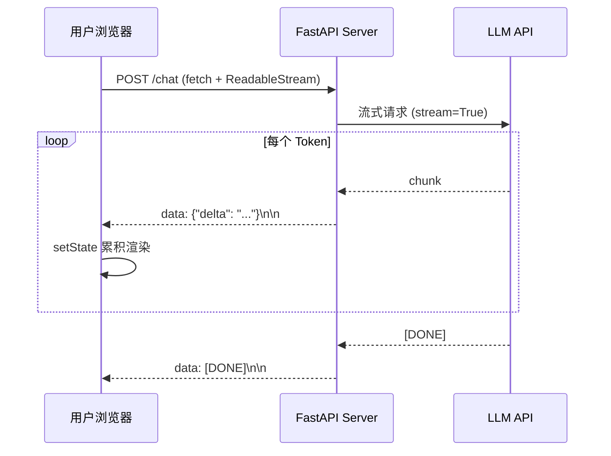
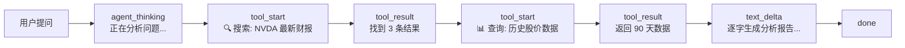

# 6.1 流式输出与用户体验

## 一、核心概念

你有没有注意到，ChatGPT 的回答是一个字一个字"打"出来的，而不是等几秒后突然出现一大段文字？这不是视觉特效，而是一个关键的工程决策——**流式输出（Streaming Output）**。

从 LLM 的生成机制来看，模型是自回归的：每次只预测下一个 Token，预测完之后再预测下一个。这意味着模型在生成第一个 Token 时，后续的内容完全未知。如果采用"等全部生成完再返回"的策略，用户需要盯着空白屏幕等待 5–30 秒，这在 UX 层面是灾难性的。而流式输出让服务端一边生成、一边推送，用户看到内容在实时增长，心理等待时间大幅下降——即使**总耗时相同**，感知体验是完全不同的。

Agent 场景让这个问题更加复杂：一次请求可能触发多轮工具调用，每次工具调用本身就需要几秒到几十秒。如果用户完全不知道 Agent 在"做什么"，只看到一个旋转的 loading，信任感会迅速崩塌。**中间过程透出**（intermediate status streaming）成为 Agent 产品能否留住用户的核心体验问题。

SSE（Server-Sent Events）是目前最主流的流式推送方案——基于 HTTP，实现简单，天然支持文本流，是 OpenAI、Anthropic 等主流 LLM API 的标准传输协议。

---

## 二、原理深讲

### 2.1 SSE 服务端实现（FastAPI）

**工程动机**：WebSocket 是双向通道，但 LLM 流式输出是单向的（服务端 → 客户端），用 WebSocket 过重。SSE 建立在普通 HTTP 之上，每个 data chunk 格式固定，浏览器和大多数 HTTP 客户端原生支持，运维成本极低。

**核心机制**：SSE 的数据格式极简——每条消息以 `data:` 开头，以两个换行符结尾：

```
data: {"type": "text", "content": "你好"}\n\n
data: {"type": "text", "content": "，我是"}\n\n
data: [DONE]\n\n
```

服务端只需要将 `Content-Type` 设置为 `text/event-stream`，然后持续 `yield` 数据即可。FastAPI 通过 `StreamingResponse` 原生支持：

```python
from fastapi import FastAPI
from fastapi.responses import StreamingResponse
import asyncio, json

app = FastAPI()

async def token_generator(prompt: str):
    """模拟 LLM 流式生成"""
    async for chunk in call_llm_stream(prompt):  # 调用 LLM SDK 的流式接口
        payload = {"type": "text", "delta": chunk.text}
        yield f"data: {json.dumps(payload, ensure_ascii=False)}\n\n"
    yield "data: [DONE]\n\n"

@app.get("/stream")
async def stream_endpoint(prompt: str):
    return StreamingResponse(
        token_generator(prompt),
        media_type="text/event-stream",
        headers={
            "Cache-Control": "no-cache",
            "X-Accel-Buffering": "no",  # 关键：禁用 Nginx 缓冲
        }
    )
```

**工程建议**：
- **必须禁用代理缓冲**：Nginx 默认会缓存响应直到连接关闭，加 `X-Accel-Buffering: no` 响应头，或在 Nginx 配置里加 `proxy_buffering off`，否则用户会等很久后收到一次性的全量数据，流式完全失效。
- **心跳保活**：长时间不推送数据（工具调用耗时）会导致某些 CDN/代理断开连接。每 15–20 秒推送一条 `: keep-alive\n\n`（注释行，客户端忽略）。

---

### 2.2 前端流式渲染：React + ReadableStream

**工程动机**：浏览器的 `EventSource` API 原生支持 SSE，但它只支持 GET 请求，无法携带请求体。LLM 应用通常需要 POST（发送长 Prompt），所以实践中更常用 `fetch` + `ReadableStream` 手动解析 SSE。

**核心机制**：

```javascript
async function streamChat(prompt, onChunk, onDone) {
    const response = await fetch("/stream", {
        method: "POST",
        headers: { "Content-Type": "application/json" },
        body: JSON.stringify({ prompt }),
    });

    const reader = response.body.getReader();
    const decoder = new TextDecoder();
    let buffer = "";

    while (true) {
        const { done, value } = await reader.read();
        if (done) break;

        buffer += decoder.decode(value, { stream: true });
        const lines = buffer.split("\n\n");
        buffer = lines.pop(); // 保留未完整的最后一段

        for (const line of lines) {
            if (!line.startsWith("data: ")) continue;
            const data = line.slice(6).trim();
            if (data === "[DONE]") { onDone(); return; }
            onChunk(JSON.parse(data));
        }
    }
}
```

在 React 中，用 `useState` 累积文本，每次 `onChunk` 触发 `setState`，React 的批量更新机制会自动控制渲染频率：

```jsx
const [content, setContent] = useState("");

const handleStream = async () => {
    setContent("");
    await streamChat(
        userInput,
        (chunk) => setContent(prev => prev + (chunk.delta ?? "")),
        () => console.log("Stream complete")
    );
};
```

**架构全链路**：



---

### 2.3 中间过程透出：Tool Call 状态实时展示

**工程动机**：Agent 执行一次任务可能包含：调用搜索 → 等待结果 → 调用数据库 → 生成总结，整个过程 10–60 秒。如果用户只看到文字在慢慢生成，完全不知道 Agent 在哪个步骤、卡在哪里，信任感会崩溃，也无法判断是正在执行还是已经出错。

**核心机制**：将 Agent 执行中的每个关键事件定义为不同消息类型，通过同一条 SSE 连接推送：

```python
# 消息类型定义
class EventType(str, Enum):
    TEXT_DELTA = "text_delta"          # LLM 生成的文字增量
    TOOL_START = "tool_start"          # 工具调用开始
    TOOL_RESULT = "tool_result"        # 工具调用结果
    TOOL_ERROR = "tool_error"          # 工具调用失败
    AGENT_THINKING = "agent_thinking"  # 推理模型的 thinking 块（可选）
    DONE = "done"

# 在 Agent 执行循环中推送事件
async def run_agent_stream(user_message: str):
    async for event in agent.astream_events(user_message):
        if event["event"] == "on_tool_start":
            yield format_sse({
                "type": EventType.TOOL_START,
                "tool_name": event["name"],
                "tool_input": event["data"]["input"],
            })
        elif event["event"] == "on_tool_end":
            yield format_sse({
                "type": EventType.TOOL_RESULT,
                "tool_name": event["name"],
                "output_preview": str(event["data"]["output"])[:200],
            })
        elif event["event"] == "on_llm_stream":
            chunk = event["data"]["chunk"]
            if chunk.content:
                yield format_sse({
                    "type": EventType.TEXT_DELTA,
                    "delta": chunk.content,
                })
```

前端根据消息类型渲染不同 UI 组件：

```jsx
// 前端根据 type 渲染不同状态
function renderEvent(event) {
    switch (event.type) {
        case "tool_start":
            return <ToolCallBadge name={event.tool_name} status="running" input={event.tool_input} />;
        case "tool_result":
            return <ToolCallBadge name={event.tool_name} status="done" preview={event.output_preview} />;
        case "tool_error":
            return <ToolCallBadge name={event.tool_name} status="error" />;
        case "text_delta":
            // 累积到 content state
        default:
            return null;
    }
}
```

**事件流示意**：



**工程建议**：`tool_input` 可能包含敏感信息（如数据库查询参数、用户私密数据），推送给前端前要过滤或脱敏。推荐设计 `visible: bool` 字段，由后端控制哪些工具调用详情对用户可见。

---

## 三、工程视角：常见误区与最佳实践

**误区一：用 Nginx 反向代理但忘记禁用缓冲**
→ **正确做法**：在 FastAPI 响应头中加 `X-Accel-Buffering: no`，同时在 Nginx location 块中配置 `proxy_buffering off; proxy_cache off;`。部署后用 `curl -N` 测试，如果响应是"一次性涌出"而非逐字推送，就是缓冲没有关闭。

**误区二：前端直接用 `EventSource` 发流式请求**
→ **正确做法**：`EventSource` 只支持 GET + 无请求体，大 Prompt 会触发 URL 长度限制。统一用 `fetch` + 手动解析 SSE 流，也更便于统一添加 `Authorization` 等请求头。

**误区三：流式响应出错时静默失败**
→ **正确做法**：定义专用的错误事件类型 `{"type": "error", "code": "...", "message": "..."}`，在 generator 的 `except` 块里捕获异常后推送错误事件再关闭连接，让前端能够感知并展示错误状态，而不是让 loading 永远转下去。

**误区四：每个 Token 都触发一次 React re-render**
→ **正确做法**：使用 `useRef` 暂存高频更新的文本内容，配合 `requestAnimationFrame` 或 16ms 的 `setInterval` 批量刷新 DOM，避免高速 Token 流（如 100 tokens/s）压垮浏览器渲染线程。

**误区五：Tool Call 结果全量推送给前端**
→ **正确做法**：工具返回内容可能很大（如 SQL 返回 1000 行数据）。只推送摘要或截断预览（如前 200 字符），完整数据留在服务端供 LLM 使用。前端展示"已获取 1000 行数据，正在分析…"即可满足用户感知需求。

---

## 四、延伸思考

> 🤔 思考题：当 Agent 正在执行过程中，用户想要"取消"当前任务，如何设计中断机制？SSE 是单向推送，客户端主动断开连接后，服务端如何检测并优雅地终止 LLM 调用和工具执行，避免产生"孤儿任务"持续消耗 Token 和计算资源？

> 🤔 思考题：对于需要思考（Extended Thinking / Reasoning）的推理模型，thinking 内容是否应该推送给用户？展示 CoT 推理过程可能增加信任感，但也可能暴露模型的"不确定性"或中间错误，影响产品可信度——你会如何在产品层面做取舍？
