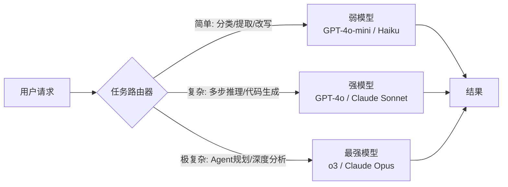
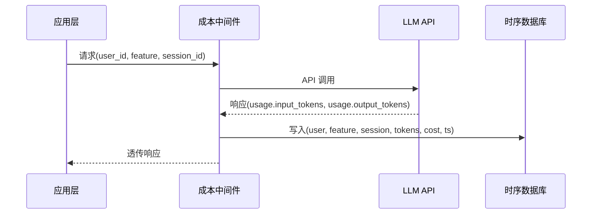

## 6.2 成本控制与 Token 优化

### 一、核心概念

LLM 应用上线之前，大多数工程师关注的是"能不能跑通"；上线之后，第一个让人头疼的生产问题往往是账单。一个月活十万的 AI 应用，如果 Prompt 设计粗糙、模型选型一刀切，每月 API 费用轻松破万美元——而同样的功能，经过系统性优化，成本可以压缩到原来的 20% 以下。

Token 成本的本质是**计算资源的货币化**：你向模型发送多少 Token、接收多少 Token，乘以单价，就是你的账单。但这个看似简单的等式背后藏着三个可优化的维度：

- **请求层**：每次调用发送了多少 Token？能不能发更少？
- **模型层**：这个任务真的需要最贵的模型吗？
- **监控层**：钱都花在哪里了？谁在烧钱？

这三层形成一个完整的成本治理框架。不做监控就优化，是盲目调参；不做请求层压缩就上强模型，是浪费算力。

---

### 二、原理深讲

#### 2.1 请求层：Prompt 压缩 + 动态截断 + 摘要替换

**工程动机**：Agent 应用的上下文往往随对话轮数线性增长。一个 20 轮的对话 Agent，第 20 轮发出的请求可能包含前 19 轮的完整历史，再加上系统提示、工具定义、检索到的文档……轻松超过 10 万 Token。输入 Token 是真实计费的，压缩输入就是直接省钱。

**三种核心手段：**

**Prompt 压缩（LLMLingua 类方案）**

原理是用一个轻量语言模型（如 bert-base 量级）对 Prompt 中每个 Token 计算"困惑度"——对模型而言越"意外"的 Token 越重要，越"可预测"的 Token 越可删除。LLMLingua 系列可在损失 3% 效果的前提下压缩 4–6 倍 Token。适用场景：检索回来的文档段落、Few-shot 示例、历史对话记录。

```python
# 示意代码：LLMLingua 压缩检索文档
from llmlingua import PromptCompressor

compressor = PromptCompressor(model_name="microsoft/llmlingua-2-bert-base-multilingual-cased-meetingbank")

retrieved_docs = "\n\n".join(chunks)  # 假设检索回来 3000 tokens 的文档
compressed = compressor.compress_prompt(
    retrieved_docs,
    rate=0.4,           # 压缩到 40%，即保留 1200 tokens
    force_tokens=["\n"] # 保留换行结构
)
# compressed["compressed_prompt"] 即可直接塞入 Prompt
```

**动态截断**

比 LLMLingua 更轻量的工程手段：根据剩余 Context Window 预算，对低优先级内容直接截断。优先级通常是：系统提示 > 最近几轮对话 > 工具定义 > 历史轮次 > 检索文档。

```python
# 示意代码：按优先级动态填充上下文窗口
MAX_TOKENS = 100_000
RESERVED_OUTPUT = 4_000

budget = MAX_TOKENS - RESERVED_OUTPUT
messages = []

# 1. 系统提示（不可压缩）
messages.append(system_prompt)
budget -= count_tokens(system_prompt)

# 2. 最近 N 轮对话（优先保留）
for turn in recent_turns[-10:]:
    if budget - count_tokens(turn) > 0:
        messages.append(turn)
        budget -= count_tokens(turn)

# 3. 检索文档（有多少放多少，超出截断）
for chunk in retrieved_chunks:
    if budget - count_tokens(chunk) > 5000:  # 留安全边距
        messages.append(chunk)
        budget -= count_tokens(chunk)
    else:
        break
```

**摘要替换（Summary Compression）**

对话超过阈值时，将早期历史摘要化后压缩存储，替换原始对话。LangGraph 的 `MemorySaver` 节点可以在 Checkpoint 时触发摘要写入。核心设计是：**摘要触发时机**（如超过 8000 Token）和**摘要粒度**（每 5 轮压缩一次 vs 全量压缩）。

---

#### 2.2 模型层：任务路由

**工程动机**：GPT-4o 的能力比 GPT-4o-mini 强，但价格贵 10–30 倍。一个 AI 应用里，复杂推理任务可能只占 20%，其余 80% 是简单 FAQ 回答、文本改写、实体提取这类工作——这 80% 完全没必要用最贵的模型。

**路由架构：**



**路由判断的三种实现方式：**

| 方式 | 实现复杂度 | 准确性 | 延迟开销 |
|------|-----------|--------|---------|
| 规则路由（关键词 / 请求类型标签） | 低 | 中 | 0ms |
| 小模型分类器（微调 bert/fasttext） | 中 | 高 | 10–50ms |
| LLM 自评估（让弱模型先判断自己能否完成） | 中 | 高 | 一次弱模型调用 |

工程上最实用的是**LLM 自评估路由**：先发给便宜模型，让它用结构化输出回答"你的置信度是否大于 0.85"，低于阈值再升级到强模型。这样大部分简单请求一次调用完成，复杂请求付出两次调用代价（但总成本仍远低于全量使用强模型）。

```python
# 示意代码：自评估路由
def route_with_confidence(user_query: str, context: str) -> str:
    # 第一步：用弱模型尝试回答，同时输出置信度
    weak_response = weak_model.chat(
        f"""请回答以下问题，并在最后用 JSON 格式输出置信度（0-1）。
        问题：{user_query}
        ...
        {{"answer": "...", "confidence": 0.X}}"""
    )
    
    result = parse_json(weak_response)
    
    if result["confidence"] >= 0.85:
        return result["answer"]
    else:
        # 升级到强模型
        return strong_model.chat(user_query, context)
```

**选型建议**：对延迟敏感的场景（如实时聊天），规则路由 + 弱模型路由组合；对成本极度敏感的批处理场景，可以接受两次调用的延迟，用 LLM 自评估路由准确性更好。

---

#### 2.3 监控层：按维度统计成本

**工程动机**：成本优化的前提是知道"钱花在哪里"。没有监控的优化是盲目的——你可能花了一周压缩 Prompt，但真正烧钱的是某个低频但 Token 暴涨的 Admin 功能。

**三个关键统计维度：**

- **User 维度**：识别高消耗用户，防止滥用（配合速率限制）
- **Feature 维度**：识别高消耗功能模块（如某个复杂查询路径）
- **Session 维度**：识别异常长会话（可能是 Agent 死循环）

**实现架构：**



核心实现是一个**LLM 调用中间件**，拦截所有 API 调用，从响应的 `usage` 字段提取 Token 用量，乘以模型单价后写入时序数据库（InfluxDB / TimescaleDB）或直接打 Metrics 到 Prometheus。

```python
# 示意代码：成本追踪中间件（以 OpenAI 为例）
from functools import wraps
import time

# 模型单价表（美元/百万Token，定期更新）
PRICING = {
    "gpt-4o": {"input": 2.5, "output": 10.0},
    "gpt-4o-mini": {"input": 0.15, "output": 0.6},
    "claude-sonnet-4-5": {"input": 3.0, "output": 15.0},
}

def track_cost(model: str, user_id: str, feature: str, session_id: str):
    """装饰器：追踪 LLM 调用成本"""
    def decorator(func):
        @wraps(func)
        def wrapper(*args, **kwargs):
            start = time.time()
            response = func(*args, **kwargs)
            latency = time.time() - start
            
            usage = response.usage
            price = PRICING.get(model, {"input": 0, "output": 0})
            cost_usd = (
                usage.prompt_tokens / 1_000_000 * price["input"] +
                usage.completion_tokens / 1_000_000 * price["output"]
            )
            
            # 写入监控系统（Prometheus / InfluxDB / 自定义）
            metrics.record({
                "user_id": user_id,
                "feature": feature,
                "session_id": session_id,
                "model": model,
                "input_tokens": usage.prompt_tokens,
                "output_tokens": usage.completion_tokens,
                "cost_usd": cost_usd,
                "latency_ms": latency * 1000,
            })
            return response
        return wrapper
    return decorator
```

有了这层数据，你就能回答：哪个 feature 的 Token 消耗占了总量的 60%？哪个用户的单日消耗是均值的 100 倍（可能在薅羊毛）？哪个 session 长度异常（Agent 可能在死循环）？

---

### 三、工程视角：常见误区与最佳实践

**误区 1：系统提示越详细越好，反正是固定的不花钱**
→ **正确做法**：系统提示的 Token 每次请求都会计费。一个 5000 Token 的系统提示，日调用 10 万次，光系统提示就要每天消耗 5 亿 Token。优先使用 Claude / OpenAI 的 **Prompt Caching**（缓存首个 1024 Token 以上的固定前缀），缓存命中后输入 Token 可降价 90%。系统提示本身要定期审计，删除冗余描述。

**误区 2：对话历史全量传递，保证模型"记住"所有上下文**
→ **正确做法**：大多数任务中，模型真正需要的是最近 3–5 轮对话 + 任务相关的关键历史事实，而不是完整的逐字记录。应该用**滑动窗口 + 摘要**结合的方式：保留最近 N 轮原文，早期内容摘要化。实测 80% 的任务场景下，摘要化历史与完整历史的效果差距 < 2%，但 Token 消耗降低 60% 以上。

**误区 3：路由器判断一次，结果确定**
→ **正确做法**：路由不是一次性决策，而是动态的。对于 Agent 任务，初始 planning 阶段用强模型，工具调用结果解析、格式化输出这类低难度步骤可以路由给弱模型。**按步骤路由**而非按任务整体路由，是更精细的优化策略。

**误区 4：只监控总 Token 消耗，忽略分布**
→ **正确做法**：平均值掩盖了最重要的信息。真正应该关注的是 P95/P99 分位数和异常值。一个正常用户的单次会话可能是 2000 Token，但有 1% 的会话是 50000 Token——这 1% 占了总成本的 20%。应设置**会话级 Token 上限硬截断**，超出后强制结束或摘要压缩。

**误区 5：压缩 Prompt 后不做效果回归**
→ **正确做法**：任何 Prompt 压缩都应该配套效果测试。LLMLingua 的 4× 压缩在 RAG 场景下通常安全，但在需要精确引用数字、日期的场景下会有质量损失。每次调整压缩率，都要跑 RAGAS 或自定义的 Golden Set 回归，确认效果没有显著下降。

---

### 四、延伸思考

> 🤔 思考题：模型路由的判断本身也要消耗 Token（以及时间）。当弱模型置信度低、需要升级到强模型时，相当于付出了"两次调用"的代价。请思考：在什么样的请求分布下，LLM 自评估路由的总成本反而高于直接使用强模型？如何设计一个"路由成本 vs 节省成本"的 break-even 分析模型来指导路由策略的选择？

> 🤔 思考题：随着模型单价持续下降（GPT-4 级别的能力在 2025 年的价格已是 2023 年的 1/20），Token 优化的投入回报比是否在降低？工程师应该在什么时候决定"不值得再优化了，直接用贵模型"？
