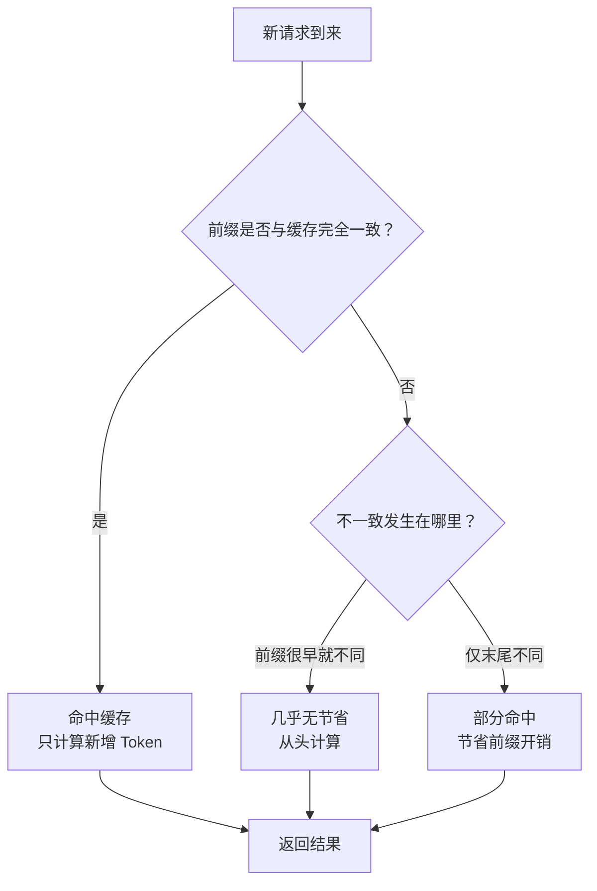
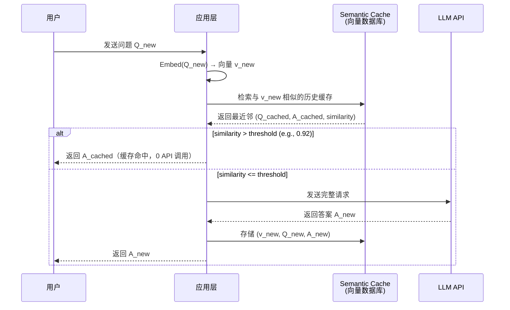
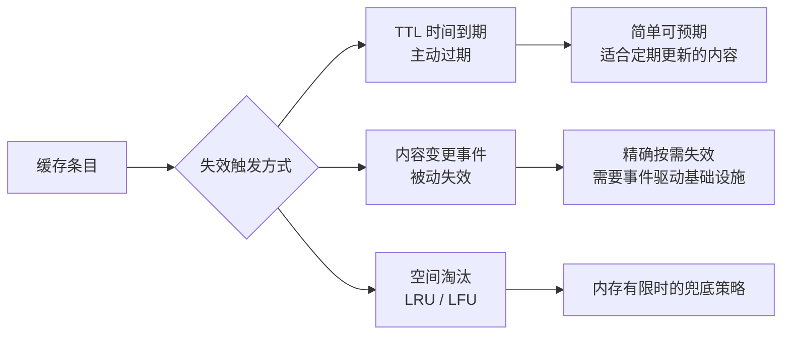

## 6.3 缓存策略（Prompt Cache / Semantic Cache）

### 一、核心概念

在 Agent 系统投入生产后，工程师往往会发现一个扎心的事实：大量的 Token 消耗来自于重复计算。一个典型的 RAG 问答系统，System Prompt 动辄 2000 Token，每次请求都带着相同的角色设定、工具描述、检索结果反复发送；一个多轮对话 Agent，每轮都需要重新传入完整的历史对话记录。这些"不变的前缀"在每次 API 调用时都会被模型重新计算，既浪费钱，又拉高延迟。

缓存策略本质上是在"计算复用"这个目标上的两种不同切入角度：

- **Prompt Cache**：在模型侧缓存 KV（Key-Value）计算结果，下次遇到相同前缀时直接复用，节省的是 **prefill 阶段的计算开销**，由模型服务商实现，调用方无需改变推理逻辑。
- **Semantic Cache**：在应用侧缓存完整的请求-响应对，通过语义相似度判断"这个新问题是否和之前某个问题足够接近"，命中则直接返回缓存结果，连 LLM 调用都省掉，节省的是**整次推理的成本**。

两者不是替代关系，而是互补的两层防线：Semantic Cache 挡住语义重复的请求，Prompt Cache 降低未被挡住请求的计算成本。

---

### 二、原理深讲

#### 2.1 Prompt Cache：官方缓存机制

**工程动机**

Transformer 在处理输入时，需要为每个 Token 计算 Attention 的 Key 和 Value 矩阵（即 KV Cache）。对于长度为 N 的 Prompt，Prefill 阶段的计算复杂度是 O(N²)。如果每次请求都携带相同的 2000 Token 系统提示，服务器每次都在做重复的矩阵运算——这就是 Prompt Cache 要解决的问题。

**核心机制**

主流服务商的实现方式类似：在服务端缓存 Prompt 前缀的 KV 状态，当新请求的前缀与缓存命中时，直接从缓存加载该部分的 KV，只计算新增 Token 部分。

| 服务商 | 缓存触发方式 | 缓存有效期 | 价格折扣 | 最小前缀长度 |
|--------|------------|-----------|---------|------------|
| **Anthropic Claude** | 显式标记 `cache_control` | 5 分钟（可延长至 1 小时） | 缓存写入 1.25x，读取 0.1x | 1024 Token |
| **OpenAI** | 自动（1024 Token 前缀对齐） | 5–10 分钟 | 读取 0.5x | 1024 Token |
| **DeepSeek** | 自动 | 会话级别 | 读取约 0.1x | 64 Token |

**Claude 显式缓存示例（伪代码）**

```python
# Claude 需要显式标注哪些内容需要缓存
messages = [
    {
        "role": "user",
        "content": [
            {
                "type": "text",
                "text": system_prompt,           # 2000 Token 的系统提示
                "cache_control": {"type": "ephemeral"}  # 标记此处作为缓存断点
            },
            {
                "type": "text", 
                "text": retrieved_context,       # 检索到的文档上下文
                "cache_control": {"type": "ephemeral"}  # 第二个缓存断点
            },
            {
                "type": "text",
                "text": user_question            # 每次变化的用户问题
            }
        ]
    }
]
# 首次请求：写入缓存，费用 = (system_prompt + context) * 1.25x + question * 1x
# 后续命中：费用 = (system_prompt + context) * 0.1x + question * 1x
# 节省幅度：若 context 占总 Token 的 80%，节省约 72%
```

**命中率优化关键：前缀稳定性**

Prompt Cache 是**前缀匹配**，不是模糊匹配。缓存失效最常见的原因不是 TTL 到期，而是前缀发生了细微变化：



**工程建议**：
1. **稳定内容放前面**：System Prompt → 静态工具描述 → 检索文档 → 历史对话 → 当前问题，越稳定的内容越靠前
2. **避免动态注入时间戳**：`"当前时间：{datetime.now()}"` 这类写法会让每次请求前缀都不同，导致缓存永远 miss
3. **多轮对话的缓存策略**：将前 N-1 轮对话作为缓存前缀，只让最新一轮动态变化

---

#### 2.2 Semantic Cache：语义相似度缓存

**工程动机**

Prompt Cache 依赖服务商侧的能力，且只能节省计算成本，无法减少 API 调用次数（计费仍然发生）。而在很多场景下，用户的问题存在大量语义重复：

> "帮我总结一下 Q3 报告" 和 "Q3 报告的主要内容是什么" 语义几乎相同，但字符串完全不同。

Semantic Cache 的思路是：在应用层拦截请求，先用 Embedding 模型将问题向量化，在向量数据库中检索是否存在语义相近的历史问题，若相似度超过阈值则直接返回缓存答案。

**核心流程**



**GPTCache 实战（伪代码）**

```python
from gptcache import cache
from gptcache.adapter import openai
from gptcache.embedding import Onnx
from gptcache.manager import CacheBase, VectorBase, get_data_manager
from gptcache.similarity_evaluation.distance import SearchDistanceEvaluation

# 初始化 Embedding 模型（轻量 ONNX 版，避免引入 PyTorch）
onnx = Onnx()

# 配置：SQLite 存储问答对 + Faiss 存储向量
data_manager = get_data_manager(
    CacheBase("sqlite"),
    VectorBase("faiss", dimension=onnx.dimension)
)

# 初始化缓存，相似度阈值设为 0.85
cache.init(
    embedding_func=onnx.to_embeddings,
    data_manager=data_manager,
    similarity_evaluation=SearchDistanceEvaluation(),
)
cache.set_openai_key()

# 使用方式与原生 OpenAI 完全相同，自动被缓存拦截
response = openai.ChatCompletion.create(
    model="gpt-4o",
    messages=[{"role": "user", "content": "什么是 RAG？"}]
)
# 第二次提问"请介绍一下 RAG 技术"会命中缓存，直接返回上一次的答案
```

**Zep 的差异化：长期记忆 + 语义缓存一体化**

GPTCache 是纯缓存工具，而 Zep 将 Semantic Cache 与 Agent 记忆系统结合：它不仅缓存问答对，还维护用户级别的长期记忆图谱，支持"这个用户之前问过类似的问题，且当时的上下文是……"这类更丰富的检索语义。适合需要个性化记忆的长期 Agent 场景。

**相似度阈值的选取**

| 阈值 | 效果 | 适用场景 |
|------|------|---------|
| > 0.95 | 极保守，几乎只命中完全相同的问题 | 对准确性要求极高的场景（法律、医疗） |
| 0.85–0.95 | 平衡，能命中语义相近的问法变体 | 大多数企业知识库问答 |
| 0.75–0.85 | 激进，可能返回语义相近但答案不完全适用的缓存 | 需要极低延迟、容忍轻微偏差的场景 |

---

#### 2.3 缓存失效策略

缓存的核心矛盾是**新鲜度 vs 命中率**，失效策略直接决定这个权衡点在哪里。



**TTL（Time-To-Live）策略**

- 优点：实现简单，行为可预期
- 缺点：内容变更后，TTL 到期前的缓存答案可能已经过时
- 适用：问答结果的时效性在分钟或小时级别可接受的场景

```python
# Redis + TTL 示例（伪代码）
cache.set(cache_key, answer, ex=3600)  # 1 小时后自动失效
```

**内容变更触发失效（Event-Driven Invalidation）**

更精确的做法：当知识库文档更新时，主动失效相关缓存条目。

```python
# 文档更新时，失效包含该文档内容的所有缓存条目
def on_document_updated(doc_id: str):
    # 找出所有引用了该文档的缓存 Key
    affected_keys = cache_index.get_keys_by_source(doc_id)
    for key in affected_keys:
        cache.delete(key)
```

挑战在于需要在缓存条目中记录"这条答案依赖了哪些文档"，增加了系统复杂度，但对于文档频繁更新的企业知识库是必要的。

**Prompt Cache 的失效**：由服务商控制，开发者无法主动失效，只能等 TTL（通常 5 分钟）。这意味着如果 Prompt 内容修改后立即生效的需求，Prompt Cache 无法满足——它的定位是**降低稳定前缀的重复计算成本**，而不是精确的缓存管理工具。

---

### 三、工程视角：常见误区与最佳实践

**误区一：认为 Semantic Cache 阈值越低越好，能命中更多请求**
→ **正确做法**：低阈值会导致"错误命中"——用相似但不相同的问题的答案回答用户，在知识库问答中会造成答案偏差甚至错误。生产环境应从 0.92 开始，结合业务日志中的用户反馈逐步调低，而不是凭感觉设置。

**误区二：在 System Prompt 中动态插入当前时间/用户信息，导致 Prompt Cache 永远 miss**
→ **正确做法**：将动态用户信息（用户名、当前时间、session ID）从 System Prompt 中移出，放到对话的最后一个 User Message 中注入。System Prompt 保持静态，最大化 Prompt Cache 命中率。

**误区三：Semantic Cache 的 Embedding 模型使用业务主模型（如 text-embedding-3-large）**
→ **正确做法**：Semantic Cache 的 Embedding 计算本身也有成本，应使用轻量模型（如 ONNX 版的 `bge-small-zh`，速度快 10x，体积小 10x）。缓存层的延迟必须远小于 LLM 调用延迟，否则失去意义。

**误区四：对 Semantic Cache 的命中率抱有不切实际的预期**
→ **正确做法**：Semantic Cache 的命中率高度依赖业务场景的问题重复度。对于"每个用户问题都高度个性化"的场景（如代码 Debug、创意写作），命中率可能低于 5%，此时 Semantic Cache 引入的 Embedding 计算延迟得不偿失，应评估后选择放弃。适合的场景是：客服 FAQ、产品文档问答、固定报表查询。

**误区五：将 Prompt Cache 和 Semantic Cache 视为互斥选择**
→ **正确做法**：两者应该叠加使用。Semantic Cache 在应用层拦截语义重复请求（0 API 调用）；漏过去的请求到达 LLM 时，Prompt Cache 负责节省 Prefill 计算。两层叠加才能最大化成本节省。

---

### 四、延伸思考

> 🤔 **思考题一**：Semantic Cache 本质上是"用近似答案代替精确计算"。在某些场景下，这种近似可能引发严重问题（比如法律咨询给出了过时的判例）。你会如何在系统设计层面区分"适合缓存的问题"和"必须实时计算的问题"？除了相似度阈值之外，是否有其他维度可以作为缓存适用性的判断依据？

> 🤔 **思考题二**：随着 LLM 推理成本持续下降（过去两年已降低约 100 倍），Semantic Cache 的经济性优势会逐渐收窄。如果 Token 成本趋近于零，Semantic Cache 是否还有存在价值？它除了降低成本，还能解决哪些本质问题（比如延迟、可用性）？
