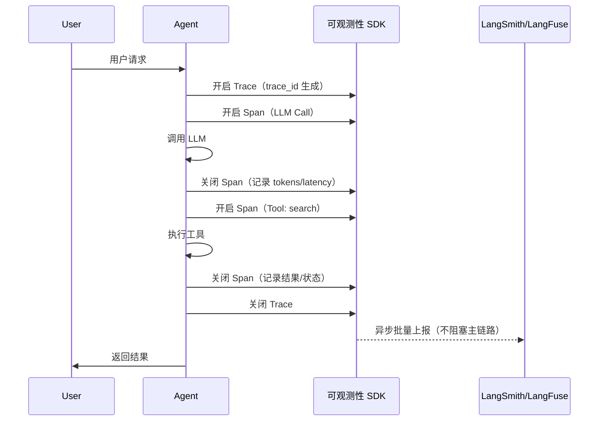
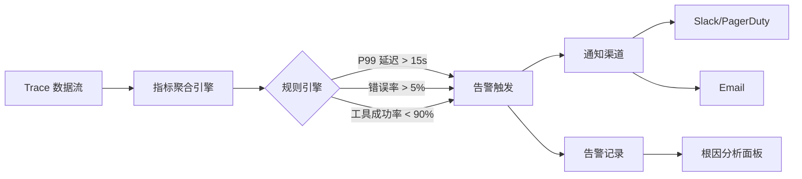

## 6.5 可观测性（LangSmith / LangFuse）

---

### 一、核心概念

Agent 上线后的第一个噩梦往往不是功能缺失，而是**无法回答"刚才那次失败是哪里出的问题"**。

传统 Web 服务的日志很简单：一个 HTTP 请求对应一条日志，排查链路清晰。但 Agent 的一次用户请求，背后可能经历：LLM 调用 → 工具触发 → 向量检索 → 再次 LLM 调用 → 另一个工具 → 汇总回答，整个链路跨越 5–10 个独立操作，每步都有自己的延迟、Token 消耗和失败模式。没有专门的可观测性工具，你面对的就是一堆散落的 `print()` 日志，根本不知道这 12 秒延迟是卡在检索还是卡在 LLM 生成。

**可观测性（Observability）在 LLM 应用中的核心价值是：把黑盒的 AI 执行过程，还原成可追溯、可测量、可告警的工程系统。** 它借鉴了分布式链路追踪（Distributed Tracing）的思路，用 **Trace → Span** 两级结构记录一次完整的 Agent 执行：Trace 代表一次用户请求的全貌，Span 代表其中的每个原子操作（一次 LLM 调用、一次工具执行、一次检索）。在此基础上，你才能度量延迟分布、Token 成本、工具成功率，进而配置告警、驱动优化。

目前主流选择是 **LangSmith**（LangChain 官方出品，与 LangChain/LangGraph 深度集成）和 **LangFuse**（开源，框架无关，支持自托管）。两者核心理念相同，接入方式略有差异，下文会对比说明。

---

### 二、原理深讲

#### 2.1 Trace 采集：Agent 执行链路的 Span 记录

**工程动机**

你不可能在 Agent 每个步骤里手动打日志，也不应该这样做——那会把业务逻辑和监控代码耦合在一起。可观测性工具的正确姿势是**通过 SDK 自动 Hook 框架调用**，或在关键位置用装饰器/上下文管理器手动包裹，业务代码基本不需要改动。

**核心机制：Trace / Span / Run 三级结构**

```
Trace（一次用户请求）
├── Span: LLM Call（GPT-4o，输入 1200 tokens，输出 350 tokens，耗时 2.1s）
├── Span: Tool Use - search_web（耗时 0.8s，返回 5 条结果）
├── Span: LLM Call（GPT-4o，输入 800 tokens，输出 120 tokens，耗时 1.3s）
└── Span: Tool Use - write_file（耗时 0.05s，成功）
```

每个 Span 记录：开始时间、结束时间、输入输出内容、模型名称、Token 消耗、错误信息（如有）。Trace 层聚合所有 Span，给出整体延迟和总 Token 成本。



**LangSmith 接入方式**（与 LangChain/LangGraph 自动集成，仅需设置环境变量）：

```python
# 仅需配置环境变量，LangChain 调用自动被追踪
import os
os.environ["LANGCHAIN_TRACING_V2"] = "true"
os.environ["LANGCHAIN_API_KEY"] = "ls_..."
os.environ["LANGCHAIN_PROJECT"] = "my-agent-prod"

# 以下代码无需改动，Trace 自动上报
from langchain_openai import ChatOpenAI
llm = ChatOpenAI(model="gpt-4o")
response = llm.invoke("你好")  # 自动生成 Span
```

**LangFuse 接入方式**（框架无关，适合非 LangChain 技术栈或需要自托管）：

```python
from langfuse import Langfuse
from langfuse.decorators import observe, langfuse_context

langfuse = Langfuse(
    public_key="pk-lf-...",
    secret_key="sk-lf-...",
    host="https://cloud.langfuse.com"  # 或自托管地址
)

@observe()  # 装饰器自动创建 Span
def call_llm(prompt: str) -> str:
    # 任何 LLM 调用框架均可
    response = openai_client.chat.completions.create(...)
    # 手动记录 Token 信息（非 LangChain 时需要）
    langfuse_context.update_current_observation(
        usage={"input": response.usage.prompt_tokens,
               "output": response.usage.completion_tokens}
    )
    return response.choices[0].message.content

@observe(name="agent-run")  # 顶层 Trace
def run_agent(user_query: str):
    result1 = call_llm(user_query)        # 子 Span
    tool_result = execute_tool(result1)    # 另一个子 Span
    final = call_llm(tool_result)
    return final
```

**工程建议**：SDK 默认使用**异步批量上报**，不会阻塞主链路（对延迟影响 < 1ms）。生产环境务必验证这一点，不要误用同步上报模式。

---

#### 2.2 核心指标：延迟 P99 / Token 消耗 / 工具调用成功率

**为什么是 P99 而不是平均值**

平均延迟会掩盖长尾问题。如果 95% 的请求在 2 秒内完成，但 5% 的请求需要 30 秒，平均值仍然看起来"正常"，但用户体验已经被严重损害。**P99（99th Percentile）** 告诉你"最差的 1% 用户看到的延迟"，是衡量实际体验更有效的指标。

**三类核心指标及其工程含义**：

| 指标类型 | 具体指标 | 工程含义 | 异常信号 |
|---------|---------|---------|---------|
| **延迟** | E2E P99 延迟 | 用户真实等待体验 | 突然升高 → 排查 LLM 供应商波动或工具超时 |
| **延迟** | 各 Span 延迟分布 | 定位瓶颈在哪个步骤 | 某 Span P99 远超平均 → 该工具/模型异常 |
| **成本** | 每请求 Token 消耗 | 直接影响 API 费用 | 突然升高 → Prompt 膨胀或检索结果过多 |
| **成本** | 按 Feature/User 分摊 | 识别高成本功能 | 某功能成本是均值 10 倍 → 需要 Prompt 优化 |
| **可靠性** | 工具调用成功率 | Agent 任务完成能力 | 低于 95% → 工具本身稳定性或参数校验问题 |
| **可靠性** | LLM 调用错误率 | API 可用性 | 突增 → Rate Limit 或供应商故障 |

**LangFuse 指标查询示例**（通过 SDK 或 Dashboard）：

```python
# 通过 LangFuse SDK 查询聚合指标
traces = langfuse.get_traces(
    project_id="my-project",
    from_timestamp=datetime.now() - timedelta(hours=24)
)

# 计算 P99 延迟
latencies = [t.latency for t in traces.data if t.latency]
p99_latency = sorted(latencies)[int(len(latencies) * 0.99)]

# 统计 Token 成本
total_tokens = sum(
    t.usage.total_tokens for t in traces.data 
    if t.usage
)
```

**工程建议**：在 Trace 中打好**标签（Tags）和元数据（Metadata）**，例如 `user_id`、`feature_name`、`model_version`，这样你能按维度下钻分析（某个用户的成本异常，还是某个功能集中出错）。这一步在接入初期容易被跳过，等后期数据量大了再补标签代价极高。

---

#### 2.3 告警配置：阈值触发与异常检测

**工程动机**

Dashboard 是给人看的，告警是给系统"自己发现问题"的。没有告警，你只能靠用户投诉或定时盯大盘来发现问题，两者都是被动且迟滞的。

**告警体系设计**：



**LangSmith 告警配置**（通过 Rules 功能，UI 配置为主）：

```python
# LangSmith 目前主要通过 UI 配置告警规则
# 也可通过 API 查询后接自建告警

from langsmith import Client
client = Client()

# 查询近 1 小时 P99 延迟，超阈值则触发自建告警
runs = client.list_runs(
    project_name="my-agent-prod",
    start_time=datetime.now() - timedelta(hours=1),
    error=False
)
latencies = [r.total_tokens for r in runs if r.end_time]
# 接入 Prometheus/Grafana Alertmanager 或直接推 Slack
```

**LangFuse + Grafana 告警方案**（适合自托管场景的生产级做法）：

```yaml
# LangFuse 支持将指标暴露给 Prometheus
# grafana/alerts/llm-alerts.yaml 示意

groups:
  - name: llm-agent-alerts
    rules:
      - alert: AgentHighP99Latency
        expr: |
          histogram_quantile(0.99, 
            rate(langfuse_trace_duration_seconds_bucket[5m])
          ) > 15
        for: 2m
        labels:
          severity: warning
        annotations:
          summary: "Agent P99 延迟超过 15 秒"
          
      - alert: ToolCallHighErrorRate  
        expr: |
          rate(langfuse_span_errors_total{span_type="tool"}[5m]) /
          rate(langfuse_span_total{span_type="tool"}[5m]) > 0.05
        for: 1m
        labels:
          severity: critical
        annotations:
          summary: "工具调用错误率超过 5%"
```

**工具链选型建议**：

| 场景 | 推荐方案 | 理由 |
|------|---------|------|
| LangChain/LangGraph 技术栈 | LangSmith | 零配置接入，UI 直接支持 Prompt 调试 |
| 框架无关 / 自研 Agent | LangFuse 自托管 | 数据不出内网，成本可控 |
| 需要集成现有监控体系 | LangFuse + Prometheus/Grafana | 统一告警平台，避免多套系统 |
| 快速验证 MVP | LangSmith Cloud 免费版 | 无需运维，上手 5 分钟 |

---

### 三、工程视角：常见误区与最佳实践

**误区 1：只看平均延迟，忽视长尾**
→ **正确做法**：将 P50/P95/P99 都纳入监控面板。LLM 调用的延迟分布往往是重尾分布，P99 可能是 P50 的 5–10 倍。告警阈值应基于 P99，而非平均值。

**误区 2：Trace 数据只记录输出，不记录输入**
→ **正确做法**：同时记录每次 LLM 调用的完整输入（Prompt + 上下文）。没有输入，出了问题无法复现，只能靠猜。注意：输入中可能含有用户 PII，上报前需要做脱敏处理，或选择支持本地存储的 LangFuse 自托管方案。

**误区 3：接入可观测性后认为"一劳永逸"**
→ **正确做法**：告警阈值需要随着系统成熟而迭代。上线初期阈值设宽松（避免误报淹没告警），稳定后收紧。同时要定期检查告警是否被处理——"告警沉默"（团队习惯性忽略某条告警）是监控体系失效的早期信号。

**误区 4：所有 Trace 全量保存，成本爆炸**
→ **正确做法**：根据业务阶段配置采样率（Sampling Rate）。开发/Staging 环境 100% 采样；生产环境高流量场景可降至 10–20%，但对错误请求保持 100% 采样（Error Sampling = 100%）。LangFuse 支持在 SDK 层配置采样率，LangSmith 则通过 Project 设置控制。

**误区 5：把 LLM 输入输出当普通日志存，不做结构化**
→ **正确做法**：利用 Tags 和 Metadata 字段记录业务维度信息（功能模块、用户分层、模型版本、实验 ID）。没有这些维度，后期做效果分析和 A/B 对比时，你会发现数据虽然有，但无从切割。

---

### 四、延伸思考

> 🤔 **思考题一**：可观测性工具记录了完整的 Prompt 输入，这意味着用户的原始提问和业务数据全部上传到了第三方平台（LangSmith/LangFuse Cloud）。在金融、医疗等数据敏感行业，如何在"可观测性"和"数据合规"之间取得平衡？除了自托管，还有哪些折中方案？

> 🤔 **思考题二**：当 Agent 系统规模变大（日处理百万 Trace），可观测性平台本身会成为性能瓶颈和成本中心。这是否意味着"可观测性越完善越好"这一直觉是错误的？在实际工程中，如何对可观测性本身进行成本与收益的量化评估？
