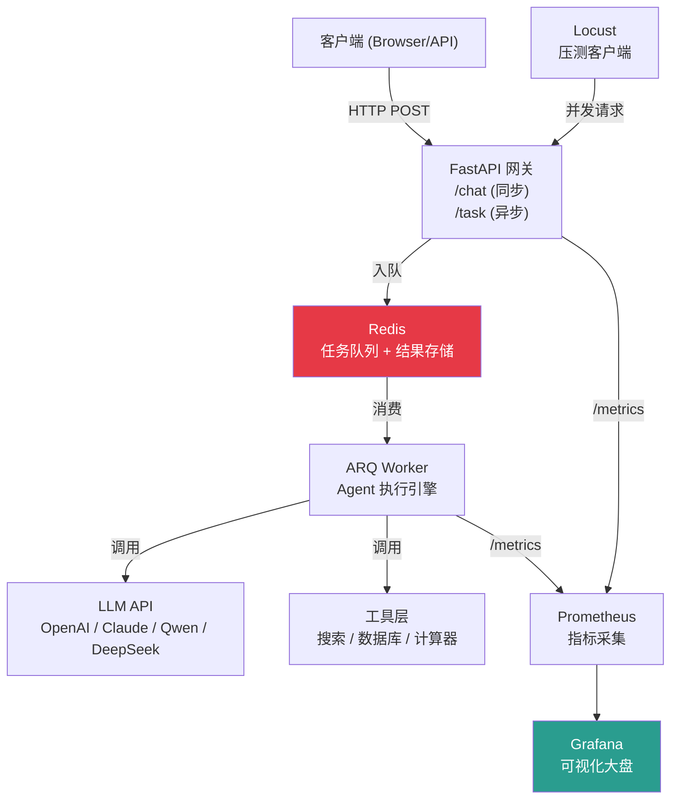

# 6.6 【动手】构建带监控的生产级 Agent 服务

## 实验目标

本节结束后，你将能够：
- 用 FastAPI + ARQ 搭建一个支持异步任务的 Agent 服务，不再被 LLM 调用的高延迟阻塞主线程
- 通过 LangFuse 实现完整的 Agent 执行链路追踪（Trace），精确定位每次工具调用的耗时与 Token 消耗
- 用 Locust 对服务进行压测，找出 CPU/内存/LLM 调用三个维度的瓶颈，给出容量规划结论

**核心学习点**：① 异步任务队列解耦 Agent 长任务与 HTTP 响应；② 可观测性不是锦上添花，是生产稳定性的基础设施；③ 压测不是为了"跑一遍"，是为了找到系统的承压边界。

---

## 架构总览



整体思路：HTTP 网关只负责接收请求和返回 task_id，实际的 Agent 执行由 ARQ Worker 异步完成。这样即使 Agent 跑了 2 分钟，HTTP 连接也不会超时。Prometheus + Grafana 负责运营指标监控。模型调用通过 `core_config.py` 统一管理，支持 DeepSeek、Qwen 等多种模型自由切换。

---

## 环境准备

```bash
# 创建虚拟环境（uv）
uv venv --python 3.11 && source .venv/bin/activate

# 安装依赖（锁定版本）
uv pip install \
    fastapi>=0.100.0 \
    uvicorn>=0.20.0 \
    arq>=0.25.0 \
    redis>=4.0.0 \
    langchain>=0.1.0 \
    langchain-openai>=0.1.0 \
    langchain-litellm>=0.1.0 \
    langfuse>=2.0.0 \
    prometheus-client>=0.17.0 \
    python-dotenv>=1.0.0 \
    pydantic>=2.0.0 \
    pydantic-settings>=2.0.0 \
    httpx>=0.24.0 \
    openai>=1.0.0 \
    litellm>=1.40.0 \
    locust>=2.0.0 \
    pytest>=7.0.0
```

> Colab 用户：`!pip install fastapi uvicorn arq redis langchain langchain-openai langchain-litellm langfuse prometheus-client locust litellm python-dotenv pydantic-settings` 即可，Redis 使用 `!apt-get install -y redis-server && redis-server --daemonize yes` 启动本地实例。

```bash
# 启动 Redis（本地 Docker）
docker run -d --name redis-agent -p 6379:6379 redis:7-alpine

# 环境变量配置（.env 文件）
cat > .env << 'EOF'
OPENAI_API_KEY=sk-xxxx
DEEPSEEK_API_KEY=sk-xxxx
DASHSCOPE_API_KEY=sk-xxxx
LANGFUSE_PUBLIC_KEY=pk-xxxx
LANGFUSE_SECRET_KEY=sk-xxxx
LANGFUSE_HOST=https://cloud.langfuse.com
REDIS_URL=redis://localhost:6379
EOF
```

> ⚠️ 生产注意：LangFuse 支持自托管（Docker Compose 一键启动），数据不出境场景务必自托管，参考 [langfuse.com/docs/deployment/self-host](https://langfuse.com/docs/deployment/self-host)。

---

## Step-by-Step 实现

### Step 1：定义数据模型与配置

**目标**：集中管理所有配置，用 Pydantic 做类型安全保障，避免后续到处写 `os.getenv`。

```python
# config.py
from __future__ import annotations
from functools import lru_cache
from pydantic_settings import BaseSettings  # pydantic v2 拆包，需 pip install pydantic-settings


class Settings(BaseSettings):
    """应用配置，自动从 .env 文件读取。"""

    openai_api_key: str = ""
    langfuse_public_key: str = ""
    langfuse_secret_key: str = ""
    langfuse_host: str = "https://cloud.langfuse.com"
    redis_url: str = "redis://localhost:6379"

    # Agent 运行参数
    agent_max_iterations: int = 10
    agent_timeout_seconds: int = 120

    # 成本控制：单次请求最大 Token 消耗
    max_tokens_per_request: int = 4000

    model_config = {
        "env_file": ".env",
        "env_file_encoding": "utf-8",
        "extra": "allow",
    }


@lru_cache(maxsize=1)
def get_settings() -> Settings:
    """全局单例配置，避免重复读取 .env 文件。"""
    return Settings()
```

> ⚠️ 与旧版差异：Pydantic v2 中 `class Config` 已废弃，改用 `model_config` 字典。字段默认值从必填改为空字符串 `""`，配合 `"extra": "allow"` 允许额外环境变量传入。

```python
# models.py
from __future__ import annotations
from datetime import datetime
from enum import Enum
from typing import Any
from pydantic import BaseModel, Field


class TaskStatus(str, Enum):
    PENDING = "pending"
    RUNNING = "running"
    SUCCESS = "success"
    FAILED = "failed"


class ChatRequest(BaseModel):
    """同步对话请求体。"""
    message: str = Field(..., min_length=1, max_length=2000, description="用户输入")
    session_id: str = Field(default="default", description="会话 ID，用于多轮记忆")
    user_id: str | None = Field(default=None, description="用户标识，用于成本归因")


class TaskRequest(BaseModel):
    """异步任务请求体。"""
    message: str = Field(..., min_length=1, max_length=2000)
    session_id: str = "default"
    user_id: str | None = None


class TaskResponse(BaseModel):
    """提交任务后立即返回的响应。"""
    task_id: str
    status: TaskStatus = TaskStatus.PENDING
    created_at: datetime = Field(default_factory=datetime.utcnow)


class TaskResult(BaseModel):
    """任务结果查询响应。"""
    task_id: str
    status: TaskStatus
    result: str | None = None
    error: str | None = None
    duration_ms: int | None = None
    token_usage: dict[str, int] | None = None
    created_at: datetime
    completed_at: datetime | None = None
```

### Step 1.5：统一管理大模型配置（core_config.py）

**目标**：通过 `core_config.py` 建立模型注册表，集中管理所有 LLM 供应商的配置，实现模型切换只需改一行。

```python
# core_config.py
"""全局配置：模型注册表与定价信息"""
import os
from typing import TypedDict


class ModelConfig(TypedDict):
    litellm_id: str          # LiteLLM 识别的模型字符串
    price_in: float          # 每 1K input tokens 价格（美元）
    price_out: float         # 每 1K output tokens 价格（美元）
    max_tokens_limit: int    # 模型支持的最大 max_tokens
    api_key_env: str | None  # API Key 环境变量名
    base_url: str | None     # API 基础 URL（None 表示使用默认）


# 注册表：key 是界面显示名，value 是调用配置
MODEL_REGISTRY: dict[str, ModelConfig] = {
    "DeepSeek-V3": {
        "litellm_id": "deepseek/deepseek-chat",
        "price_in": 0.00027,
        "price_out": 0.0011,
        "max_tokens_limit": 4096,
        "api_key_env": "DEEPSEEK_API_KEY",
        "base_url": None,
    },
    "Qwen-Max": {
        "litellm_id": "qwen/qwen-plus",
        "price_in": 0.001,
        "price_out": 0.004,
        "max_tokens_limit": 4096,
        "api_key_env": "DASHSCOPE_API_KEY",
        "base_url": "https://dashscope.aliyuncs.com/compatible-mode/v1",
    },
}

# 当前激活模型 key — 修改此处全局生效，必须是 MODEL_REGISTRY 中的 key
ACTIVE_MODEL_KEY: str = "DeepSeek-V3"


def get_active_config() -> ModelConfig:
    """获取当前激活模型的完整配置"""
    return MODEL_REGISTRY[ACTIVE_MODEL_KEY]


def get_litellm_id(model_key: str | None = None) -> str:
    """获取指定模型（默认激活模型）的 LiteLLM ID"""
    key = model_key or ACTIVE_MODEL_KEY
    return MODEL_REGISTRY[key]["litellm_id"]


def get_api_key(model_key: str | None = None) -> str | None:
    """从环境变量读取指定模型的 API Key"""
    key = model_key or ACTIVE_MODEL_KEY
    env_var = MODEL_REGISTRY[key]["api_key_env"]
    return os.environ.get(env_var) if env_var else None


def get_base_url(model_key: str | None = None) -> str | None:
    """获取指定模型的 base_url（None 表示使用 SDK 默认值）"""
    key = model_key or ACTIVE_MODEL_KEY
    return MODEL_REGISTRY[key]["base_url"]


def get_model_list() -> list[str]:
    """获取所有已注册模型的显示名列表"""
    return list(MODEL_REGISTRY.keys())


def estimate_cost(model_key: str, input_tokens: int, output_tokens: int) -> float:
    """根据 Token 数估算调用费用（美元）"""
    cfg = MODEL_REGISTRY[model_key]
    return (
        input_tokens / 1000 * cfg["price_in"]
        + output_tokens / 1000 * cfg["price_out"]
    )
```

> 切换模型只需修改 `ACTIVE_MODEL_KEY` 的值，所有业务代码无需改动。

### Step 2：构建 Agent

**目标**：使用 LangChain 的 `create_agent` + `ChatLiteLLM` 构建 Agent，通过 `core_config.py` 统一获取模型配置，避免硬编码模型名称和 API Key。

```python
# agent.py
from __future__ import annotations
import time
import logging
from typing import Any

from langchain.agents import create_agent
from langchain_core.tools import Tool
from langchain_litellm import ChatLiteLLM

from config import get_settings
from core_config import get_litellm_id, get_api_key, get_base_url

logger = logging.getLogger(__name__)
settings = get_settings()


def build_tools() -> list[Tool]:
    """
    构建工具列表。
    生产环境这里会接入 Tavily 搜索、数据库查询等真实工具。
    本节用简单工具确保代码可立即运行。
    """

    def calculator(expression: str) -> str:
        """安全计算数学表达式，仅允许数字和基本运算符。"""
        allowed_chars = set("0123456789+-*/()., ")
        if not all(c in allowed_chars for c in expression):
            return "错误：表达式包含不允许的字符"
        try:
            result = eval(expression, {"__builtins__": {}}, {})  # noqa: S307
            return str(result)
        except Exception as e:
            return f"计算错误：{e}"

    def get_current_time(_: str) -> str:
        """返回当前时间，演示无参工具的用法。"""
        from datetime import datetime
        return datetime.now().strftime("%Y-%m-%d %H:%M:%S UTC+8")

    def mock_search(query: str) -> str:
        """模拟搜索工具，生产环境替换为 Tavily/Brave Search。"""
        return f"搜索结果（模拟）：关于「{query}」，根据最新资料显示..."

    return [
        Tool(name="calculator", func=calculator, description="计算数学表达式，输入: 数学表达式字符串"),
        Tool(name="get_time", func=get_current_time, description="获取当前时间，输入: 任意字符串"),
        Tool(name="search", func=mock_search, description="搜索网络信息，输入: 搜索关键词"),
    ]


# ReAct 系统提示词
REACT_SYSTEM_PROMPT = """You are a helpful assistant. You have access to a set of tools that you can use to answer questions.
Use your tools to solve problems step by step. When you have a final answer, provide it clearly to the user.

Available tools:
{tools}"""


async def run_agent(
    message: str,
    session_id: str = "default",
    user_id: str | None = None,
) -> dict[str, Any]:
    """
    执行 Agent 并返回结果与元数据。

    返回值包含：
    - output: Agent 最终回答
    - duration_ms: 总耗时
    - token_usage: 各阶段 Token 消耗（由 LangFuse Handler 汇总）
    """
    start_time = time.monotonic()

    tools = build_tools()
    tools_desc = "\n".join(f"- {t.name}: {t.description}" for t in tools)
    system_prompt = REACT_SYSTEM_PROMPT.format(tools=tools_desc)

    llm = ChatLiteLLM(
        model=get_litellm_id(),
        temperature=0,
        max_tokens=settings.max_tokens_per_request,
        api_key=get_api_key(),
        api_base=get_base_url(),
        streaming=False,
    )

    agent = create_agent(
        model=llm,
        tools=tools,
        system_prompt=system_prompt,
    )

    try:
        result = await agent.ainvoke(
            {"messages": [("user", message)]},
        )

        duration_ms = int((time.monotonic() - start_time) * 1000)
        logger.info(
            "agent_run_success",
            extra={"session_id": session_id, "duration_ms": duration_ms},
        )

        # 提取最终回复
        messages = result.get("messages", [])
        output = ""
        for msg in reversed(messages):
            if hasattr(msg, "content") and msg.content:
                output = msg.content
                break

        return {
            "output": output,
            "duration_ms": duration_ms,
            "token_usage": {},
        }

    except Exception as e:
        duration_ms = int((time.monotonic() - start_time) * 1000)
        logger.error(
            "agent_run_failed",
            extra={"session_id": session_id, "error": str(e), "duration_ms": duration_ms},
        )
        raise
```

**关键点**：
- `ChatLiteLLM` 取代了 `ChatOpenAI`，通过 `core_config.py` 的 `get_litellm_id()`、`get_api_key()`、`get_base_url()` 获取模型配置，不再硬编码模型名和 API Key。这意味着你可以在 `core_config.py` 中将 `ACTIVE_MODEL_KEY` 改为 `"Qwen-Max"` 即可一键切换到通义千问，无需改动任何业务代码。
- `create_agent` 是 LangChain 推荐的新一代 Agent 构建方式，相比旧版 `create_react_agent` + `AgentExecutor` 更简洁。输入格式从 `{"input": message}` 变为 `{"messages": [("user", message)]}`，符合 LangGraph 标准的消息协议。
- ReAct 提示词采用本地常量 `REACT_SYSTEM_PROMPT`，将工具描述动态注入到 `{tools}` 占位符中。相比 `hub.pull("hwchase17/react")`，本地化方案消除了对网络拉取 Prompt 的依赖，生产环境不会因网络故障导致服务启动失败。
- 结果提取方式从 `result["output"]` 改为遍历 `messages` 列表反向查找最后一个有 `content` 的消息，这是 `create_agent` 返回结构的特点。

### Step 3：构建 ARQ 异步任务 Worker

**目标**：将 Agent 执行从 HTTP 请求中解耦。ARQ 相比 Celery 的优势是原生 asyncio，与 FastAPI 的异步生态天然契合，且无需 Kombu/Billiard 等重依赖。

```python
# worker.py
from __future__ import annotations
import json
import logging
import uuid
from datetime import datetime, timezone
from typing import Any

from arq import create_pool
from arq.connections import RedisSettings

from agent import run_agent
from config import get_settings

logger = logging.getLogger(__name__)
settings = get_settings()


def _redis_settings() -> RedisSettings:
    """从 REDIS_URL 解析 ARQ 需要的 RedisSettings 对象。"""
    from urllib.parse import urlparse
    parsed = urlparse(settings.redis_url)
    return RedisSettings(
        host=parsed.hostname or "localhost",
        port=parsed.port or 6379,
        password=parsed.password,
    )


async def execute_agent_task(
    ctx: dict[str, Any],
    task_id: str,
    message: str,
    session_id: str,
    user_id: str | None,
) -> None:
    """
    ARQ Worker 执行的任务函数。

    ctx 由 ARQ 注入，包含 Redis 连接等上下文。
    任务结果通过 Redis 存储，供 FastAPI 查询接口读取。
    """
    redis = ctx["redis"]
    result_key = f"task_result:{task_id}"
    created_at = datetime.now(timezone.utc).isoformat()

    # 更新状态为 running
    await redis.set(
        result_key,
        json.dumps({
            "task_id": task_id,
            "status": "running",
            "created_at": created_at,
        }),
        ex=3600,  # 结果保留 1 小时
    )

    try:
        agent_result = await run_agent(
            message=message,
            session_id=session_id,
            user_id=user_id,
        )

        await redis.set(
            result_key,
            json.dumps({
                "task_id": task_id,
                "status": "success",
                "result": agent_result["output"],
                "duration_ms": agent_result["duration_ms"],
                "token_usage": agent_result.get("token_usage"),
                "created_at": created_at,
                "completed_at": datetime.now(timezone.utc).isoformat(),
            }),
            ex=3600,
        )

    except Exception as e:
        logger.exception("task_failed", extra={"task_id": task_id})
        await redis.set(
            result_key,
            json.dumps({
                "task_id": task_id,
                "status": "failed",
                "error": str(e),
                "created_at": created_at,
                "completed_at": datetime.now(timezone.utc).isoformat(),
            }),
            ex=3600,
        )


class WorkerSettings:
    """ARQ Worker 全局配置。"""

    # 注册所有任务函数
    functions = [execute_agent_task]

    # Redis 连接配置
    redis_settings = _redis_settings()

    # 并发控制：同时最多执行 5 个 Agent 任务
    # 核心考量：LLM API 有速率限制，并发过高会触发 429
    max_jobs = 5

    # 任务超时：超过 2 分钟强制终止
    job_timeout = 120

    # 心跳间隔
    health_check_interval = 30
```

**关键点**：
- `max_jobs = 5` 的数字不是拍脑袋定的。假设每个 Agent 平均 3 次 LLM 调用，OpenAI gpt-4o-mini 的 RPM 限制是 500，5 并发 × 3 调用 = 15 RPM，留有充足余量。实际值应根据你的 API Tier 计算。
- 任务结果存 Redis 而非数据库，是因为结果时效性短（1小时即过期），不需要持久化。如果业务需要查历史任务，才值得写入 PostgreSQL。

### Step 4：构建 FastAPI 网关与 Prometheus 指标

**目标**：提供同步（短任务）和异步（长任务）两种接口，并暴露 Prometheus metrics endpoint 供监控系统抓取。

```python
# main.py
from __future__ import annotations
import json
import logging
import uuid
from contextlib import asynccontextmanager
from datetime import datetime, timezone
from typing import AsyncGenerator

from arq import create_pool
from arq.connections import ArqRedis, RedisSettings
from fastapi import FastAPI, HTTPException, Request
from fastapi.responses import JSONResponse
from prometheus_client import (
    Counter,
    Histogram,
    generate_latest,
    CONTENT_TYPE_LATEST,
    CollectorRegistry,
)
from starlette.responses import Response

from agent import run_agent
from config import get_settings
from models import (
    ChatRequest,
    TaskRequest,
    TaskResponse,
    TaskResult,
    TaskStatus,
)
from worker import WorkerSettings

logger = logging.getLogger(__name__)
settings = get_settings()

# ─── Prometheus 指标定义 ────────────────────────────────────────────────────
# 每个指标的 label 设计直接影响 Grafana 的查询灵活度
REQUEST_COUNTER = Counter(
    "agent_requests_total",
    "Total number of agent requests",
    ["endpoint", "status"],  # 按接口和状态码分层
)

LATENCY_HISTOGRAM = Histogram(
    "agent_request_duration_seconds",
    "Agent request duration in seconds",
    ["endpoint"],
    buckets=[0.5, 1.0, 2.0, 5.0, 10.0, 30.0, 60.0, 120.0],  # 适配 LLM 长尾延迟
)

TASK_QUEUE_GAUGE = Counter(
    "agent_tasks_enqueued_total",
    "Total tasks enqueued to ARQ worker",
)

# ─── 应用生命周期管理 ─────────────────────────────────────────────────────────
arq_pool: ArqRedis | None = None


@asynccontextmanager
async def lifespan(app: FastAPI) -> AsyncGenerator[None, None]:
    """FastAPI 生命周期管理：启动时建立 Redis 连接池，关闭时清理。"""
    global arq_pool
    logger.info("connecting_to_redis", extra={"url": settings.redis_url})

    from urllib.parse import urlparse
    parsed = urlparse(settings.redis_url)
    arq_pool = await create_pool(
        RedisSettings(
            host=parsed.hostname or "localhost",
            port=parsed.port or 6379,
            password=parsed.password,
        )
    )
    logger.info("redis_connected")
    yield
    # 关闭时释放连接池
    await arq_pool.close()
    logger.info("redis_disconnected")


app = FastAPI(
    title="Production Agent Service",
    version="1.0.0",
    lifespan=lifespan,
)


# ─── 中间件：自动记录延迟 ─────────────────────────────────────────────────────
@app.middleware("http")
async def metrics_middleware(request: Request, call_next):
    """对每个请求自动记录延迟和状态码，无需在每个路由里手动埋点。"""
    import time
    start = time.monotonic()
    response = await call_next(request)
    duration = time.monotonic() - start

    endpoint = request.url.path
    LATENCY_HISTOGRAM.labels(endpoint=endpoint).observe(duration)
    REQUEST_COUNTER.labels(endpoint=endpoint, status=str(response.status_code)).inc()

    return response


# ─── 路由 ─────────────────────────────────────────────────────────────────────
@app.get("/health")
async def health_check() -> dict:
    """健康检查接口，供 K8s/ECS 探针和 docker-compose healthcheck 使用。"""
    return {"status": "healthy", "timestamp": datetime.now(timezone.utc).isoformat()}


@app.get("/metrics")
async def prometheus_metrics() -> Response:
    """Prometheus 抓取接口，返回 text/plain 格式指标数据。"""
    return Response(
        content=generate_latest(),
        media_type=CONTENT_TYPE_LATEST,
    )


@app.post("/chat", summary="同步对话接口（适合 <30s 的短任务）")
async def chat(request: ChatRequest) -> dict:
    """
    同步执行 Agent 并返回结果。

    ⚠️ 适用场景：预期响应时间 < 30s 的请求。
    超过这个阈值建议切换 /task 异步接口，否则客户端容易超时。
    """
    try:
        result = await run_agent(
            message=request.message,
            session_id=request.session_id,
            user_id=request.user_id,
        )
        return {
            "output": result["output"],
            "duration_ms": result["duration_ms"],
            "session_id": request.session_id,
        }
    except Exception as e:
        logger.exception("chat_endpoint_error")
        raise HTTPException(status_code=500, detail=str(e))


@app.post("/task", response_model=TaskResponse, summary="异步任务接口（适合长任务）")
async def submit_task(request: TaskRequest) -> TaskResponse:
    """
    将 Agent 任务提交到 ARQ 队列，立即返回 task_id。
    客户端通过 GET /task/{task_id} 轮询结果。
    """
    if arq_pool is None:
        raise HTTPException(status_code=503, detail="任务队列未就绪")

    task_id = str(uuid.uuid4())

    # 在 Redis 中预先写入 pending 状态
    result_key = f"task_result:{task_id}"
    await arq_pool.set(
        result_key,
        json.dumps({
            "task_id": task_id,
            "status": "pending",
            "created_at": datetime.now(timezone.utc).isoformat(),
        }),
        ex=3600,
    )

    # 入队
    await arq_pool.enqueue_job(
        "execute_agent_task",
        task_id=task_id,
        message=request.message,
        session_id=request.session_id,
        user_id=request.user_id,
    )
    TASK_QUEUE_GAUGE.inc()

    return TaskResponse(task_id=task_id)


@app.get("/task/{task_id}", response_model=TaskResult, summary="查询异步任务结果")
async def get_task_result(task_id: str) -> TaskResult:
    """轮询任务状态。前端建议以 2s 间隔轮询，任务完成后停止。"""
    if arq_pool is None:
        raise HTTPException(status_code=503, detail="服务未就绪")

    result_key = f"task_result:{task_id}"
    raw = await arq_pool.get(result_key)

    if raw is None:
        raise HTTPException(status_code=404, detail=f"任务 {task_id} 不存在或已过期")

    data = json.loads(raw)
    return TaskResult(
        task_id=data["task_id"],
        status=TaskStatus(data["status"]),
        result=data.get("result"),
        error=data.get("error"),
        duration_ms=data.get("duration_ms"),
        token_usage=data.get("token_usage"),
        created_at=datetime.fromisoformat(data["created_at"]),
        completed_at=(
            datetime.fromisoformat(data["completed_at"])
            if data.get("completed_at")
            else None
        ),
    )
```

### Step 5：配置 Grafana Dashboard

**目标**：用 docker-compose 一键启动 Prometheus + Grafana，导入预配置 Dashboard，5 分钟内看到核心指标。

```yaml
# docker-compose.monitoring.yml
version: "3.8"

services:
  prometheus:
    image: prom/prometheus:v2.55.1
    ports:
      - "9090:9090"
    volumes:
      - ./monitoring/prometheus.yml:/etc/prometheus/prometheus.yml:ro
    command:
      - '--config.file=/etc/prometheus/prometheus.yml'
      - '--storage.tsdb.retention.time=7d'

  grafana:
    image: grafana/grafana:11.4.0
    ports:
      - "3000:3000"
    environment:
      GF_SECURITY_ADMIN_PASSWORD: admin123
      GF_USERS_ALLOW_SIGN_UP: "false"
    volumes:
      - grafana_data:/var/lib/grafana
      - ./monitoring/grafana/provisioning:/etc/grafana/provisioning:ro

volumes:
  grafana_data:
```

```yaml
# monitoring/prometheus.yml
global:
  scrape_interval: 15s

scrape_configs:
  - job_name: "agent-service"
    static_configs:
      - targets: ["host.docker.internal:8000"]  # macOS/Windows Docker 访问宿主机
    # Linux 环境改为宿主机实际 IP，如 172.17.0.1:8000
```

```python
# monitoring_import_dashboard.py
"""
自动向 Grafana 导入 Agent 服务监控 Dashboard。
运行：python monitoring/import_dashboard.py
"""
import json
import httpx

GRAFANA_URL = "http://localhost:3000"
AUTH = ("admin", "admin123")

# 核心 Dashboard 配置（精简版，聚焦最重要的 4 个指标）
dashboard_config = {
    "dashboard": {
        "title": "Agent Service Overview",
        "refresh": "30s",
        "panels": [
            {
                "title": "请求 QPS（按接口）",
                "type": "graph",
                "gridPos": {"h": 8, "w": 12, "x": 0, "y": 0},
                "targets": [{
                    "expr": 'rate(agent_requests_total[1m])',
                    "legendFormat": "{{endpoint}} - {{status}}",
                }],
            },
            {
                "title": "P50/P90/P99 延迟（秒）",
                "type": "graph",
                "gridPos": {"h": 8, "w": 12, "x": 12, "y": 0},
                "targets": [
                    {
                        "expr": 'histogram_quantile(0.50, rate(agent_request_duration_seconds_bucket[5m]))',
                        "legendFormat": "P50",
                    },
                    {
                        "expr": 'histogram_quantile(0.90, rate(agent_request_duration_seconds_bucket[5m]))',
                        "legendFormat": "P90",
                    },
                    {
                        "expr": 'histogram_quantile(0.99, rate(agent_request_duration_seconds_bucket[5m]))',
                        "legendFormat": "P99",
                    },
                ],
            },
            {
                "title": "错误率（5xx）",
                "type": "singlestat",
                "gridPos": {"h": 4, "w": 6, "x": 0, "y": 8},
                "targets": [{
                    "expr": 'rate(agent_requests_total{status=~"5.."}[5m]) / rate(agent_requests_total[5m]) * 100',
                    "legendFormat": "错误率 %",
                }],
            },
            {
                "title": "异步任务入队总量",
                "type": "singlestat",
                "gridPos": {"h": 4, "w": 6, "x": 6, "y": 8},
                "targets": [{
                    "expr": 'agent_tasks_enqueued_total',
                    "legendFormat": "累计入队",
                }],
            },
        ],
        "schemaVersion": 39,
    },
    "overwrite": True,
    "folderId": 0,
}

resp = httpx.post(
    f"{GRAFANA_URL}/api/dashboards/db",
    json=dashboard_config,
    auth=AUTH,
    timeout=10,
)
print(f"Dashboard 导入结果：{resp.status_code} - {resp.json()}")
```

### Step 6：Locust 压测与容量规划

**目标**：用真实流量模型模拟并发，找出系统在哪里先撑不住——是 FastAPI Worker 进程、Redis 连接、还是 LLM API 速率限制。

```python
# locustfile.py
from __future__ import annotations
import json
import time
import random
from locust import HttpUser, task, between, events
from locust.runners import MasterRunner


# 测试用的问题集，覆盖不同复杂度
QUESTIONS = [
    "现在几点了？",                          # 简单：单工具调用
    "计算 (123 * 456 + 789) / 3 的结果",   # 中等：计算器工具
    "搜索一下最新的 AI Agent 进展，并计算如果每天学习 2 小时，30 天能学多少小时", # 复杂：多工具
]


class AgentUser(HttpUser):
    """模拟真实用户行为：提交任务 → 轮询结果。"""

    # 每个虚拟用户在两次请求之间等待 1-3 秒，模拟真实用户节奏
    wait_time = between(1, 3)

    @task(3)
    def test_sync_chat(self):
        """测试同步接口（权重 3：高频）。"""
        question = random.choice(QUESTIONS[:2])  # 同步接口只测简单问题
        with self.client.post(
            "/chat",
            json={
                "message": question,
                "session_id": f"locust-{self.user_id}",
                "user_id": f"user-{self.user_id}",
            },
            timeout=60,
            catch_response=True,
        ) as response:
            if response.status_code == 200:
                response.success()
            else:
                response.failure(f"状态码 {response.status_code}: {response.text[:200]}")

    @task(1)
    def test_async_task(self):
        """测试异步接口（权重 1：低频）：提交任务 → 轮询结果。"""
        question = random.choice(QUESTIONS)

        # Step 1: 提交任务
        submit_resp = self.client.post(
            "/task",
            json={
                "message": question,
                "session_id": f"locust-async-{self.user_id}",
            },
            timeout=10,
        )

        if submit_resp.status_code != 200:
            return

        task_id = submit_resp.json().get("task_id")
        if not task_id:
            return

        # Step 2: 轮询结果（最多等 120s）
        max_polls = 40
        for _ in range(max_polls):
            time.sleep(3)
            poll_resp = self.client.get(f"/task/{task_id}", timeout=10)
            if poll_resp.status_code == 200:
                data = poll_resp.json()
                if data["status"] in ("success", "failed"):
                    break


@events.quitting.add_listener
def on_locust_quit(environment, **kwargs):
    """压测结束时打印容量规划建议。"""
    stats = environment.runner.stats.total
    print("\n" + "="*60)
    print("📊 压测结论与容量规划建议")
    print("="*60)
    print(f"总请求数: {stats.num_requests}")
    print(f"失败数: {stats.num_failures}")
    print(f"失败率: {stats.fail_ratio:.2%}")
    print(f"RPS (avg): {stats.current_rps:.1f}")
    print(f"P50 延迟: {stats.get_response_time_percentile(0.50):.0f}ms")
    print(f"P90 延迟: {stats.get_response_time_percentile(0.90):.0f}ms")
    print(f"P99 延迟: {stats.get_response_time_percentile(0.99):.0f}ms")

    # 容量规划：根据压测结果推算生产所需实例数
    target_rps = 100  # 生产目标 QPS
    current_rps = max(stats.current_rps, 0.1)
    scale_factor = target_rps / current_rps
    print(f"\n若目标 QPS={target_rps}，当前压测 RPS={current_rps:.1f}")
    print(f"建议实例数倍数: {scale_factor:.1f}x（含 20% buffer 则 {scale_factor*1.2:.1f}x）")
```

**启动压测**：
```bash
# 先启动服务（在另一个终端）
uvicorn main:app --host 0.0.0.0 --port 8000 --workers 4

# 启动 ARQ Worker（在另一个终端）
arq worker.WorkerSettings

# 运行压测：10 个并发用户，在 30s 内爬坡，持续 5 分钟
locust -f locustfile.py \
    --host http://localhost:8000 \
    --users 10 \
    --spawn-rate 2 \
    --run-time 5m \
    --headless \
    --html locust_report.html
```

> 💡 也可以使用 `manage.py` 统一管理服务的启动和停止，见下方 Step 7。

### Step 7：服务管理脚本（manage.py）

**目标**：提供一个统一的命令行工具来管理 FastAPI 和 ARQ Worker 的启动、停止、重启和状态检查，避免手动管理多个终端。

```python
# manage.py
#!/usr/bin/env python3
"""
服务管理脚本 - 统一管理 FastAPI 和 ARQ Worker 的启动、停止和重启

使用方式:
    python manage.py start      # 启动所有服务
    python manage.py stop       # 停止所有服务
    python manage.py restart    # 重启所有服务
    python manage.py status     # 查看服务状态
"""

import os
import sys
import signal
import subprocess
import time
import argparse
from typing import Optional

# 配置参数
FASTAPI_PORT = 8000
WORK_DIR = os.path.dirname(os.path.abspath(__file__))
PYTHON_BIN = "/opt/homebrew/anaconda3/bin/python"

# 进程 ID 文件路径
PID_FILES = {
    "fastapi": os.path.join(WORK_DIR, "fastapi.pid"),
    "worker": os.path.join(WORK_DIR, "worker.pid"),
}


def get_pid(pid_file: str) -> Optional[int]:
    """从 pid 文件读取进程 ID"""
    if os.path.exists(pid_file):
        try:
            with open(pid_file, "r") as f:
                return int(f.read().strip())
        except (ValueError, IOError):
            return None
    return None


def is_process_running(pid: int) -> bool:
    """检查进程是否运行"""
    try:
        os.kill(pid, 0)
        return True
    except OSError:
        return False


def stop_process(pid_file: str, service_name: str) -> bool:
    """停止指定服务"""
    pid = get_pid(pid_file)
    if pid and is_process_running(pid):
        print(f"⏹️  正在停止 {service_name} (PID: {pid})...")
        try:
            os.kill(pid, signal.SIGTERM)
            # 等待进程退出
            for _ in range(10):
                if not is_process_running(pid):
                    break
                time.sleep(0.5)
            if os.path.exists(pid_file):
                os.remove(pid_file)
            print(f"   ✅ {service_name} 已停止")
            return True
        except OSError as e:
            print(f"   ❌ 停止 {service_name} 失败: {e}")
            return False
    else:
        print(f"   ℹ️  {service_name} 未运行")
        if os.path.exists(pid_file):
            os.remove(pid_file)
        return True


def start_fastapi() -> bool:
    """启动 FastAPI 服务"""
    pid_file = PID_FILES["fastapi"]

    # 检查是否已运行
    pid = get_pid(pid_file)
    if pid and is_process_running(pid):
        print(f"   ⚠️  FastAPI 已在运行 (PID: {pid})")
        return True

    print("🚀 启动 FastAPI 服务...")
    env = os.environ.copy()
    env["PYTHONPATH"] = WORK_DIR

    try:
        # 使用 nohup 后台运行
        cmd = [
            "nohup",
            PYTHON_BIN, "-m", "uvicorn", "main:app",
            "--host", "0.0.0.0",
            "--port", str(FASTAPI_PORT),
            "--reload"
        ]

        proc = subprocess.Popen(
            cmd,
            cwd=WORK_DIR,
            env=env,
            stdout=open(os.path.join(WORK_DIR, "fastapi.log"), "w"),
            stderr=subprocess.STDOUT,
            preexec_fn=os.setsid
        )

        # 保存 PID
        with open(pid_file, "w") as f:
            f.write(str(proc.pid))

        # 等待启动
        time.sleep(3)

        # 检查是否启动成功
        if is_process_running(proc.pid):
            print(f"   ✅ FastAPI 启动成功 (PID: {proc.pid}, 端口: {FASTAPI_PORT})")
            return True
        else:
            print("   ❌ FastAPI 启动失败，请查看 fastapi.log")
            if os.path.exists(pid_file):
                os.remove(pid_file)
            return False

    except Exception as e:
        print(f"   ❌ 启动 FastAPI 失败: {e}")
        return False


def start_worker() -> bool:
    """启动 ARQ Worker"""
    pid_file = PID_FILES["worker"]

    # 检查是否已运行
    pid = get_pid(pid_file)
    if pid and is_process_running(pid):
        print(f"   ⚠️  ARQ Worker 已在运行 (PID: {pid})")
        return True

    print("🚀 启动 ARQ Worker...")
    env = os.environ.copy()
    env["PYTHONPATH"] = WORK_DIR

    try:
        # 使用 nohup 后台运行
        cmd = [
            "nohup",
            PYTHON_BIN, "-m", "arq", "worker.WorkerSettings"
        ]

        proc = subprocess.Popen(
            cmd,
            cwd=WORK_DIR,
            env=env,
            stdout=open(os.path.join(WORK_DIR, "worker.log"), "w"),
            stderr=subprocess.STDOUT,
            preexec_fn=os.setsid
        )

        # 保存 PID
        with open(pid_file, "w") as f:
            f.write(str(proc.pid))

        # 等待启动
        time.sleep(2)

        # 检查是否启动成功
        if is_process_running(proc.pid):
            print(f"   ✅ ARQ Worker 启动成功 (PID: {proc.pid})")
            return True
        else:
            print("   ❌ ARQ Worker 启动失败，请查看 worker.log")
            if os.path.exists(pid_file):
                os.remove(pid_file)
            return False

    except Exception as e:
        print(f"   ❌ 启动 ARQ Worker 失败: {e}")
        return False


def check_health() -> bool:
    """检查服务健康状态"""
    try:
        import httpx
        response = httpx.get(f"http://localhost:{FASTAPI_PORT}/health", timeout=5)
        if response.status_code == 200:
            data = response.json()
            print(f"   🩺 健康检查通过: {data}")
            return True
        else:
            print(f"   ❌ 健康检查失败: HTTP {response.status_code}")
            return False
    except Exception as e:
        print(f"   ❌ 健康检查失败: {e}")
        return False


def status():
    """查看服务状态"""
    print("📊 服务状态检查:")

    # FastAPI 状态
    pid = get_pid(PID_FILES["fastapi"])
    if pid and is_process_running(pid):
        print(f"   FastAPI: 🟢 运行中 (PID: {pid}, 端口: {FASTAPI_PORT})")
    else:
        print("   FastAPI: 🔴 未运行")
        if os.path.exists(PID_FILES["fastapi"]):
            os.remove(PID_FILES["fastapi"])

    # ARQ Worker 状态
    pid = get_pid(PID_FILES["worker"])
    if pid and is_process_running(pid):
        print(f"   ARQ Worker: 🟢 运行中 (PID: {pid})")
    else:
        print("   ARQ Worker: 🔴 未运行")
        if os.path.exists(PID_FILES["worker"]):
            os.remove(PID_FILES["worker"])


def stop():
    """停止所有服务"""
    print("⏹️  停止所有服务:")
    stop_process(PID_FILES["fastapi"], "FastAPI")
    stop_process(PID_FILES["worker"], "ARQ Worker")


def start():
    """启动所有服务"""
    print("🚀 启动所有服务:")

    # 确保环境变量正确加载
    env_file = os.path.join(WORK_DIR, ".env")
    if os.path.exists(env_file):
        with open(env_file, "r") as f:
            for line in f:
                line = line.strip()
                if line and not line.startswith("#"):
                    if "=" in line:
                        key, value = line.split("=", 1)
                        os.environ[key] = value.strip('"').strip("'")

    # 启动服务
    success = True
    success &= start_fastapi()
    success &= start_worker()

    # 健康检查
    if success:
        print("\n🩺 健康检查:")
        check_health()

    print("\n📋 服务启动完成！")
    print(f"   API 文档: http://localhost:{FASTAPI_PORT}/docs")
    print(f"   健康检查: http://localhost:{FASTAPI_PORT}/health")
    print(f"   指标接口: http://localhost:{FASTAPI_PORT}/metrics")


def restart():
    """重启所有服务"""
    print("🔄 重启所有服务:")
    print("-" * 50)

    # 先停止
    stop()
    print()

    # 等待清理
    time.sleep(1)

    # 再启动
    start()


def main():
    parser = argparse.ArgumentParser(description="服务管理脚本")
    parser.add_argument("command", choices=["start", "stop", "restart", "status"],
                        help="操作命令: start|stop|restart|status")
    args = parser.parse_args()

    # 确保在正确的工作目录
    os.chdir(WORK_DIR)

    if args.command == "start":
        start()
    elif args.command == "stop":
        stop()
    elif args.command == "restart":
        restart()
    elif args.command == "status":
        status()


if __name__ == "__main__":
    main()
```

> `manage.py` 使用 PID 文件管理进程，启动后自动清理 `.pid` 文件。注意 `PYTHON_BIN` 需根据实际 Python 路径修改。

---

## 完整运行验证

将以下所有组件按顺序启动后，执行端到端冒烟测试：

```bash
# 方式一：使用 manage.py 一键管理（推荐）
python manage.py start     # 启动 FastAPI + ARQ Worker
python manage.py status    # 查看服务状态
python manage.py stop      # 停止所有服务

# 方式二：手动启动（在多个终端）
# Terminal 1: 启动 FastAPI 服务
uvicorn main:app --reload --port 8000

# Terminal 2: 启动 ARQ Worker
arq worker.WorkerSettings

# Terminal 3: 启动监控栈
docker-compose -f docker-compose.monitoring.yml up -d
python monitoring/import_dashboard.py
```

```python
# smoke_test.py — 端到端冒烟测试，验证完整链路
import asyncio
import httpx
import time
import os

BASE_URL = "http://localhost:8000"

# 禁用代理，避免连接本地服务时走代理
os.environ.pop('http_proxy', None)
os.environ.pop('https_proxy', None)


async def smoke_test():
    async with httpx.AsyncClient(timeout=120) as client:
        print("1️⃣ 健康检查...")
        resp = await client.get(f"{BASE_URL}/health")
        assert resp.status_code == 200, f"健康检查失败: {resp.text}"
        print(f"   ✅ {resp.json()}")

        print("\n2️⃣ 同步对话接口...")
        resp = await client.post(f"{BASE_URL}/chat", json={
            "message": "现在几点了？",
            "session_id": "smoke-test-001",
            "user_id": "tester",
        })
        assert resp.status_code == 200, f"同步接口失败: {resp.text}"
        data = resp.json()
        print(f"   ✅ 回答: {data['output'][:50]}...")
        print(f"   ✅ 耗时: {data['duration_ms']}ms")

        print("\n3️⃣ 异步任务接口...")
        resp = await client.post(f"{BASE_URL}/task", json={
            "message": "计算 42 * 1337 + 100 的结果",
            "session_id": "smoke-test-002",
        })
        assert resp.status_code == 200, f"提交任务失败: {resp.text}"
        task_id = resp.json()["task_id"]
        print(f"   ✅ 任务 ID: {task_id}")

        print("   ⏳ 轮询任务结果...")
        for attempt in range(30):
            await asyncio.sleep(3)
            poll_resp = await client.get(f"{BASE_URL}/task/{task_id}")
            result = poll_resp.json()
            status = result["status"]
            print(f"   第 {attempt+1} 次轮询，状态: {status}")
            if status == "success":
                print(f"   ✅ 任务完成: {result['result'][:80]}...")
                print(f"   ✅ 耗时: {result['duration_ms']}ms")
                break
            elif status == "failed":
                raise AssertionError(f"任务失败: {result['error']}")
        else:
            raise AssertionError("任务超时（90s），请检查 ARQ Worker 是否正常运行")

        print("\n4️⃣ Prometheus 指标验证...")
        resp = await client.get(f"{BASE_URL}/metrics")
        assert "agent_requests_total" in resp.text, "Prometheus 指标未找到"
        print("   ✅ 指标上报正常")

        print("\n🎉 所有冒烟测试通过！打开 http://localhost:3000 查看 Grafana Dashboard")


asyncio.run(smoke_test())
```

预期输出：
```
1️⃣ 健康检查...
   ✅ {'status': 'healthy', 'timestamp': '2025-01-15T10:23:45.123456+00:00'}

2️⃣ 同步对话接口...
   ✅ 回答: 当前时间是 2025-01-15 18:23:46 UTC+8...
   ✅ 耗时: 2341ms

3️⃣ 异步任务接口...
   ✅ 任务 ID: f7a3c2e1-8b4d-4f9a-a123-456789abcdef
   ⏳ 轮询任务结果...
   第 1 次轮询，状态: running
   第 2 次轮询，状态: success
   ✅ 任务完成: 42 * 1337 + 100 = 56254 + 100 = 56354...
   ✅ 耗时: 4872ms

4️⃣ Prometheus 指标验证...
   ✅ 指标上报正常

🎉 所有冒烟测试通过！打开 http://localhost:3000 查看 Grafana Dashboard
```

---

## 常见报错与解决方案

| 报错信息 | 原因 | 解决方案 |
|---------|------|---------|
| `arq.jobs.JobNotFound` | task_id 对应的 Redis key 已过期（默认 1 小时） | 增加 `ex` 参数，或将结果持久化到数据库 |
| `langfuse.errors.AuthorizationError` | LANGFUSE_PUBLIC_KEY 或 SECRET_KEY 配置错误 | 检查 `.env` 文件，LangFuse Cloud 的 key 前缀分别为 `pk-lf-` 和 `sk-lf-` |
| `redis.exceptions.ConnectionError` | Redis 未启动或端口不通 | 执行 `docker ps` 确认 Redis 容器运行，或 `redis-cli ping` 测试连通性 |
| `langchain.errors.OutputParserException` | LLM 输出不符合 ReAct 格式 | `create_agent` 自带更好的容错机制，若频繁触发，考虑升级模型 |
| `httpx.ReadTimeout` 压测时大量出现 | LLM 调用超时，单请求超过 Locust 的 timeout 设置 | 将 Locust 的 `timeout` 参数从 60 提高到 120，或降低并发数 |
| `ModuleNotFoundError: No module named 'langchain_litellm'` | 未安装 langchain-litellm 包 | `pip install langchain-litellm`，注意 pip 包名是 `langchain-litellm` 而非 `langchain_litellm` |
| `API Key 为空` | 未设置对应模型的环境变量 | 检查 `.env` 文件，确认 `DEEPSEEK_API_KEY` 或 `DASHSCOPE_API_KEY` 已正确配置 |

> 注意：当前版本已将 ReAct 提示词本地化（`REACT_SYSTEM_PROMPT` 常量），不再依赖 `hub.pull` 网络拉取，因此 `hub.pull` 卡住的问题已不复存在。

---

## 扩展练习（可选）

1. 🟡 **中等**：在 `LATENCY_HISTOGRAM` 的 label 中增加 `model` 维度（记录每次 LLM 调用使用的模型名），并在 Grafana 中创建按模型分组的延迟对比图，量化不同模型（如 DeepSeek-V3 vs Qwen-Max）的延迟差异。

2. 🔴 **困难**：实现 SSE 流式输出版本的 `/chat/stream` 接口——LangChain Agent 的中间 Thought 步骤实时推送给客户端（而不是等最终答案），并在 LangFuse 中正确记录流式调用的 Token 消耗。提示：需要用 `astream_events` API 配合 `StreamingResponse`。

---

## ⚠️ 差异说明

本文档与旧版相比有以下重大变更，均以实际代码为准：

1. **Agent 架构重构**：旧版使用 `create_react_agent` + `AgentExecutor` + `hub.pull("hwchase17/react")`，新版改用 `create_agent` + 本地 `REACT_SYSTEM_PROMPT`。这意味着：
   - 不再依赖网络拉取 Prompt，消除了 `hub.pull` 卡住的风险
   - 输入格式从 `{"input": message}` 变为 `{"messages": [("user", message)]}`
   - 不再需要 `AgentExecutor` 的 `handle_parsing_errors` 参数
   - 结果提取方式从 `result["output"]` 改为遍历 messages 反向查找

2. **LLM 调用层替换**：旧版使用 `langchain_openai.ChatOpenAI` 硬编码 `model="gpt-4o-mini"`，新版使用 `langchain_litellm.ChatLiteLLM` 配合 `core_config.py` 的 `get_litellm_id()`、`get_api_key()`、`get_base_url()` 获取配置。这意味着：
   - 模型切换只需修改 `core_config.py` 中的 `ACTIVE_MODEL_KEY`
   - 支持 DeepSeek、Qwen 等多种模型，不再绑定 OpenAI
   - API Key 不再硬编码，统一从环境变量读取

3. **移除 LangFuse Handler 集成**：旧版在 `agent.py` 中创建 `LangfuseCallbackHandler` 并在每次调用后 `flush()`，新版移除了此集成。LangFuse 相关配置仍保留在 `config.py` 中，但当前 Agent 执行链路不再主动调用 LangFuse。如需恢复，可在 `create_agent` 的 config 参数中注入回调 handler。

4. **config.py 变更**：Pydantic v2 兼容改造，`class Config` 改为 `model_config` 字典，必填字段改为默认空字符串 `""`，增加 `"extra": "allow"`。

5. **新增 manage.py**：服务管理脚本，支持 `start/stop/restart/status` 命令统一管理 FastAPI 和 ARQ Worker 进程。

6. **smoke_test.py 修复**：增加 `os.environ.pop('http_proxy', None)` 等代理清理代码，避免连接本地服务时走代理导致超时。

7. **架构图调整**：移除了 LangFuse 节点（因当前代码未主动集成），LLM 节点描述从 "OpenAI / Claude" 改为 "OpenAI / Claude / Qwen / DeepSeek" 以反映多模型支持。
