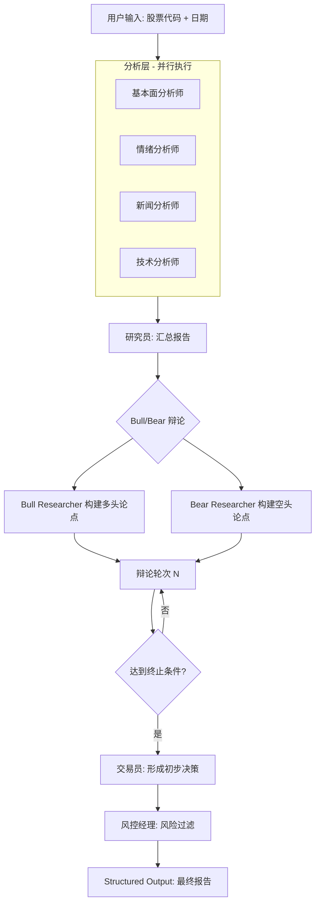
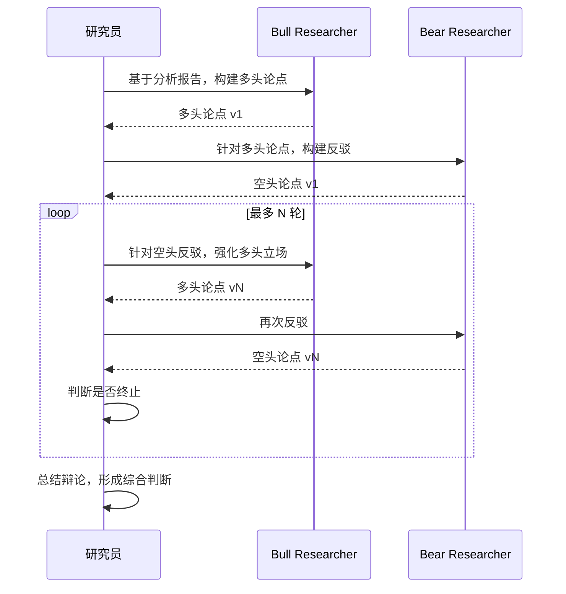

# 7.1 项目一：AI 选股分析师（基于 TradingAgents）

## 一、核心概念

投资分析从来不是单人决策的事。专业的对冲基金会同时配备基本面分析师、技术分析师、新闻事件跟踪员、风控经理，让他们各司其职、相互博弈，最终形成一份有张力的投资判断。这套分工协作的机制之所以有效，是因为单一视角的分析天然存在盲区：纯技术派容易忽视业绩雷，纯基本面派容易错过短期动量信号，而风控经理的存在是为了给所有人兜底。

TradingAgents 的核心洞见就在这里——**用多个专业化 Agent 模拟真实投资团队的角色分工，让不同"专家"在同一标的上独立分析、公开辩论，再由风控层做最终裁决**。这与我们在 Module 5 中学到的 Multi-Agent 层级协作模式高度吻合，但有一个关键差异：TradingAgents 引入了显式的 Bull/Bear 对抗辩论机制，让模型在输出结论前必须经历一轮"唱反调"的压力测试，从而显著减少模型的确认偏误（Confirmation Bias）。

对工程师来说，这个项目的价值不止于选股本身——它是一个**结构完整、可直接改造的 Multi-Agent 生产模板**：LangGraph 状态管理、Pydantic 结构化输出、并发工具调用、人工审批节点，这些第六章讲过的技术在这里都有完整的工程落地示例。

---

## 二、原理深讲

### 7.1.1 项目背景与架构解读

#### TradingAgents 论文核心思想

TradingAgents 发表于 AAAI 2025 Workshop，核心命题是：**LLM 的分析能力在多智能体框架下能否接近甚至超越单一大模型的"全知全能"模式**？

论文的实验结论给出了正面回答——在回测中，多 Agent 协作版本相比单 Agent Baseline 在风险调整收益（Sharpe Ratio）上有显著提升。原因直观：单个 LLM 调用时，提示词需要同时承载"分析基本面 + 读图 + 看情绪 + 做决策"的全部指令，导致注意力分散、推理深度不够；而角色拆分后，每个 Agent 的上下文专注、工具精准，输出质量更高。

这与软件工程里"单一职责原则"的逻辑如出一辙——不要让一个函数做所有事。

#### 五类角色分工

TradingAgents 将分析流程拆解为两层：

**分析层（Analyst Team）** — 并发执行，互不干扰：

| 角色 | 职责 | 主要工具 |
|------|------|----------|
| 基本面分析师（fundamentals） | 财务指标、估值模型、行业比较 | FinnHub 财报 API、SEC 文件解析 |
| 情绪分析师（sentiment） | 社交媒体情绪、散户情绪指数 | Reddit/X API、情绪评分模型 |
| 新闻分析师（news） | 重大事件、政策影响、黑天鹅识别 | NewsAPI、事件提取 |
| 技术分析师（technical） | K 线形态、均线、MACD/RSI 等指标 | Yahoo Finance、TA-Lib |

**决策层（Decision Team）** — 串行执行，有依赖关系：

| 角色 | 职责 |
|------|------|
| 研究员（Researcher） | 汇总分析层报告，主持 Bull/Bear 辩论 |
| 交易员（Trader） | 综合辩论结果形成具体买卖决策 |
| 风控经理（Risk Manager） | 基于风险偏好对决策做最终过滤 |

> ⚠️ **实际使用注意**：本项目的代码示例中，`selected_analysts` 仅启用 `["fundamentals", "news"]` 两个分析师节点（而非全部四个）。这样做的原因：（1）减少 API 调用次数和 Token 消耗；（2）新闻和基本面是 A 股/美股分析最核心的两个维度。如需启用全部分析师，将 `selected_analysts` 改为 `["fundamentals", "sentiment", "news", "technical"]` 即可。

#### LangGraph 有状态图的应用拆解

TradingAgents 选用 LangGraph 而非简单的函数调用链，核心原因有三：

1. **状态持久化**：分析师的报告需要在多个节点间流转，LangGraph 的 `State` 对象天然承载这种"共享黑板"语义
2. **条件路由**：辩论轮次、风险等级判断都需要动态决定下一步走哪个节点
3. **断点恢复**：长分析链路（通常 8-12 次 LLM 调用）中途失败时，Checkpoint 机制可从断点续跑

整体执行流如下：



**State 结构设计是架构关键**。TradingAgents 的核心 State 大致如下（伪代码）：

```python
class TradingState(TypedDict):
    ticker: str
    date_range: tuple[str, str]

    # 分析层输出（并发写入）
    fundamentals_report: str
    sentiment_report: str
    news_report: str
    technical_report: str

    # 决策层流转
    bull_argument: str
    bear_argument: str
    debate_rounds: int

    # 最终决策
    trader_decision: TraderDecision  # Pydantic model
    risk_level: RiskProfile
    final_signal: Literal["BUY", "HOLD", "SELL"]
    rationale: str
```

---

### 7.1.2 项目结构与快速开始

#### 项目文件结构

```
7.1 项目一：AI 选股分析师（基于 TradingAgents）/
├── main.py                        # 统一入口，调度四个实验
├── experiment_1_basic_analysis.py # 实验一：美股分析（NVDA/TSLA）
├── experiment_1_parse_output.py   # 实验一补充：决策结果可视化
├── experiment_2_astock.py         # 实验二：A 股适配（贵州茅台）
├── experiment_3_checkpoint.py     # 实验三：Checkpoint 断点续跑
├── experiment_4_model_comparison.py # 实验四：多模型对比
├── astock_adapter.py              # A 股数据适配层（AKShare → TradingAgents 格式）
├── core_config.py                 # 模型注册表（DeepSeek/Qwen/GPT-4o）
├── requirements.txt               # pip 依赖清单
├── .env.example                   # 环境变量模板
├── smoke_test.py                  # 端到端冒烟测试
├── tests/test_main.py             # pytest 单元测试
└── _backup/                       # 整理前的原始文件备份
```

#### 环境配置

1. 复制 `.env.example` 为 `.env`，填入 API Key：

```bash
# .env
DEEPSEEK_API_KEY=your_deepseek_api_key_here
DASHSCOPE_API_KEY=your_dashscope_api_key_here
```

2. 安装依赖：

```bash
pip install -r requirements.txt
```

3. 运行实验：

```bash
python main.py 1     # 实验一：分析美股 NVDA
python main.py 2     # 实验二：A 股适配（贵州茅台）
python main.py 3     # 实验三：Checkpoint 断点续跑
python main.py 4     # 实验四：多模型对比
python main.py test  # 冒烟测试
```

#### 核心调用流程

每个实验的核心调用路径均为：

```python
from tradingagents.graph.trading_graph import TradingAgentsGraph
from tradingagents.config import TradingAgentsConfig

# 1. 创建配置
config = TradingAgentsConfig(
    llm_provider="litellm",
    deep_think_llm="deepseek/deepseek-chat",
    quick_think_llm="deepseek/deepseek-chat",
    reasoning_effort="medium",      # 对应风险偏好
    max_debate_rounds=3,
    max_risk_discuss_rounds=3,
    max_recur_limit=100,
)

# 2. 初始化图（仅选 fundamentals + news 两个分析师）
graph = TradingAgentsGraph(
    selected_analysts=["fundamentals", "news"],
    config=config,
    debug=False,
)

# 3. 执行分析（耗时通常 2-5 分钟）
state, decision = graph.propagate(ticker, analysis_date)
```

**返回值说明**：`graph.propagate()` 返回 `(state, decision)` 二元组。其中 `decision` 在不同版本的 `tradingagents` 中类型不同：
- **新版本**：返回字符串，如 `"BUY"` / `"HOLD"` / `"SELL"`
- **旧版本**：返回字典，包含 `action`、`reasoning`、`confidence` 等字段

项目代码统一做了兼容处理：

```python
if isinstance(decision, str):
    decision_dict = {
        "action": decision.lower(),
        "reasoning": "分析完成",
        "confidence": 0.8,
    }
else:
    decision_dict = decision
```

---

### 7.1.3 核心模块精读与改造

#### Analyst Team：工具注册与并发分析机制

分析师节点本质上是"工具调用密集型 Agent"。每个分析师节点绑定一组专属工具，LangGraph 通过将这些节点配置为 `Send()` API 实现真正的并发：

```python
# 伪代码：并发分发到四个分析师
def dispatch_analysts(state: TradingState):
    return [
        Send("fundamentals_analyst", state),
        Send("sentiment_analyst", state),
        Send("news_analyst", state),
        Send("technical_analyst", state),
    ]
```

`Send()` 是 LangGraph 中实现 Map-Reduce 模式的核心原语——它将同一个 State 分发给多个节点并行处理，各节点的输出最终在 Reduce 节点（研究员）中合并。

**工具注册的最佳实践**：每个分析师对应的工具集应该尽量精简，不要把所有工具都暴露给所有 Agent。情绪分析师不需要访问财报 API，基本面分析师不需要看 Reddit。工具范围越小，模型的工具选择错误率越低。

**本项目实际选择**：代码中 `selected_analysts=["fundamentals", "news"]`，仅启用基本面和新闻两个分析师。这是出于 Token 成本控制的考虑——四个分析师全部启用时，单次分析约消耗 300-500K tokens，而仅用两个分析师可将消耗降低约 50%。

#### Bull vs Bear 辩论机制

这是 TradingAgents 最有特色的设计。辩论不是简单地让两个 Agent 轮流发言，而是有明确的**角色约束**：

- **Bull Researcher** 被系统提示词强制要求"只输出支持做多的论据，哪怕你内心不认同"
- **Bear Researcher** 同理，被强制充当空头

这种"强制角色扮演"的设计目的是打破 LLM 的默认倾向——大模型在没有约束时会倾向于输出"中庸"结论，而刻意的对立角色能逼出更有深度的分析。

辩论的终止条件有两个，满足其一即退出：
1. 达到最大辩论轮次（代码中 `max_debate_rounds=3`）
2. 研究员判断双方论点已充分展开（LLM 自判）



#### Risk Management：三种风险偏好实现

风控经理节点接收交易员的初步决策，并根据预设的风险偏好做修正。三种风险偏好对应不同的决策约束：

| 风险偏好 | 行为特征 | 代码中的 reasoning_effort |
|----------|----------|----------|
| 激进（Aggressive） | 容忍高波动，追求超额收益 | `high` |
| 中性（Neutral） | 平衡风险收益 | `medium` |
| 保守（Conservative） | 优先保本，强烈拒绝高风险操作 | `low` |

代码中通过 `RISK_TO_EFFORT` 映射实现：

```python
RISK_TO_EFFORT = {
    "aggressive":   "high",
    "neutral":      "medium",
    "conservative": "low",
}
```

**工程实现细节**：风险偏好通过 `reasoning_effort` 参数传入 `TradingAgentsConfig`，由 TradingAgents 内部在构建各节点提示词时动态使用。同一套代码可通过修改 `risk_level` 参数切换风险偏好，而无需改动任何业务逻辑。

#### 决策输出结构

TradingAgents 的最终决策通过 `graph.propagate()` 返回。实际代码中，decision 字典包含以下字段：

```python
decision_dict = {
    "action":     "buy" | "hold" | "sell" | "strong buy" | "strong sell",
    "reasoning":  "分析推理文本（通常 500-2000 字符）",
    "confidence": 0.0 ~ 1.0,
    # 以下字段在旧版本中可能存在：
    "target_price":   150.0,   # 目标买入价
    "stop_loss":      130.0,   # 止损价
    "take_profit":    180.0,   # 止盈价
}
```

可视化模块（`experiment_1_parse_output.py`）使用 Rich 库将决策输出渲染为终端面板：
- 五级评级（strong buy / buy / hold / sell / strong sell）带颜色区分
- 关键指标表格（目标价、止损价、止盈价、置信度、风险偏好）
- 核心投资论点面板（截取前 1500 字符）

---

### 7.1.4 A 股适配层设计

A 股与美股的数据格式存在显著差异，直接传入 TradingAgents 会导致解析失败。`astock_adapter.py` 提供了三层适配：

#### 价格历史适配

```python
adapter = AStockAdapter()
df = adapter.get_price_history("600519", days=90, adjust="qfq")
```

核心处理：
1. **字段映射**：东方财富返回的中文列名（`日期`、`开盘`、`收盘`）映射为 TradingAgents 标准字段（`Date`、`Open`、`Close`）
2. **时区转换**：日期索引从 `Asia/Shanghai` 转为 `UTC`
3. **复权处理**：默认使用前复权（`qfq`），也可选后复权（`hfq`）或不复权

#### 基本面信息适配

```python
info = adapter.get_fundamental_info("600519")
# 返回: {"name": "贵州茅台", "ticker": "600519", "marketCap": ..., "pe": ..., ...}
```

将 `ak.stock_individual_info_em()` 返回的两列 DataFrame 映射为 TradingAgents 期望的 FinnHub `/stock/profile2` 格式。

#### 新闻数据适配

```python
news = adapter.get_news("600519", limit=20)
# 返回: [{"headline": ..., "summary": ..., "datetime": ..., "source": ..., "url": ...}]
```

将 `ak.stock_news_em()` 返回的新闻数据映射为 TradingAgents News Tool 的标准格式。`summary` 字段截断至 500 字符以避免超出 Token 限制。

> ⚠️ **版本限制**：`tradingagents` 0.3.1 不再暴露 `graph.toolkit` 属性，因此 A 股数据源注入（`patch_astock_tools()`）当前仅为数据层验证，实际数据替换需等待上游支持。

---

### 7.1.5 Checkpoint 断点续跑

长分析链路（8-12 次 LLM 调用）中途失败时，能够从中断点续跑是生产化的关键需求。

#### 实现方案

`tradingagents` 0.3.1 暂不支持 `memory` / `checkpoint` 注入（`SqliteSaver` 无法直接传入 `TradingAgentsGraph`）。因此本项目改用**手动 SQLite 记录**方案：

```python
# checkpoint 表结构
CREATE TABLE IF NOT EXISTS checkpoints (
    thread_id TEXT PRIMARY KEY,
    ticker TEXT,
    analysis_date TEXT,
    status TEXT,              -- "completed" | "interrupted" | "error"
    created_at TIMESTAMP,
    result_json TEXT          -- 完整结果的 JSON 序列化
)
```

#### 使用流程

```python
# 首次运行
result = analyze_with_checkpoint("NVDA", "2025-01-10")
# 输出: Thread ID: NVDA_2025-01-10_a1b2c3d4  ← 保存此 ID

# 续跑（传入相同 thread_id）
result = analyze_with_checkpoint(
    "NVDA", "2025-01-10",
    thread_id="NVDA_2025-01-10_a1b2c3d4"
)
# 如果已有 "completed" 状态的记录，直接返回缓存结果
```

三种中断场景处理：
- **正常完成**：保存 `status="completed"` + 完整结果 JSON
- **手动中断（Ctrl+C）**：保存 `status="interrupted"`，打印续跑命令
- **异常中断**：保存 `status="error"`，打印错误信息和续跑建议

> 💡 **生产建议**：将 SQLite 替换为 PostgreSQL，并接入 LangFuse Trace 以实现完整的决策追踪和事后复盘。

---

### 7.1.6 多模型对比实验

实验四（`experiment_4_model_comparison.py`）支持用相同股票和日期，对比不同模型的分析质量。

#### 支持的模型

| 模型 Key | 显示名 | Provider | deep_model | quick_model | 输入价格（USD/1M tokens） |
|----------|--------|----------|------------|-------------|--------------------------|
| `gpt4o` | GPT-4o | openai | gpt-4o | gpt-4o-mini | $5.00 |
| `deepseek` | DeepSeek-V3 | litellm | deepseek/deepseek-chat | deepseek/deepseek-chat | $0.27 |

#### 评估维度

1. **评级一致性**：不同模型是否给出相同的 BUY/HOLD/SELL 评级
2. **推理深度**：核心论点字符数（粗略衡量分析深度）
3. **成本**：基于推理文本长度和模型定价估算
4. **延迟**：端到端耗时（秒）

#### 对比结果展示

```python
results = compare_models("NVDA", "2025-01-10", models=["gpt4o", "deepseek"])
display_comparison(results)
```

输出 Rich 表格，包含模型名、评级、置信度、目标价、推理深度、耗时、估算成本。最后自动判断评级一致性——所有模型评级一致则显示绿色通过，存在分歧则黄色告警并列出各模型评级。

原始结果（含完整推理文本）同时保存为 `comparison_results.json`，供离线分析。

---

### 7.1.7 生产化改造：评估、调度与决策日志

#### 如何评估 Agent 选股决策的质量

"Agent 说买就买"这种信任方式不可行——必须有量化的评估体系。接入回测框架是评估选股 Agent 质量的标准路径：

**评估维度**：

| 指标 | 含义 | 工具 |
|------|------|------|
| Sharpe Ratio | 风险调整收益 | backtrader / vectorbt |
| Max Drawdown | 最大回撤，衡量尾部风险 | 同上 |
| Win Rate | 决策胜率 | 自行统计 |
| Signal Calibration | 置信度与实际收益的相关性 | scipy 统计 |

回测流程建议：先在历史数据上跑 paper trading（模拟交易不动真钱），积累 50+ 个独立决策样本后再做统计分析。样本量太少时的回测结论不可信。

**一个常被忽略的评估盲区**：Agent 的"HOLD"决策也需要评估。如果 Agent 在大涨前频繁输出 HOLD，这和频繁输出错误的 BUY/SELL 一样有问题，但很多评估框架只统计 BUY/SELL 决策的准确率。

#### 生产化改造：定时任务 + 结果推送 + 决策日志

将 TradingAgents 从实验推向生产，核心改造点有三处：

**1. 定时触发**：使用 APScheduler（单机）或 Celery Beat（分布式）在每日收盘后（A 股 15:30，美股 16:00 ET）自动触发分析流程。需要注意节假日跳过逻辑——直接用交易日历库（`trading_calendars`）而非手写日期判断。

**2. 结果推送**：分析报告通过 Webhook 推送到飞书/钉钉/Slack。推送内容不要直接发原始 JSON——用模板渲染成可读的 Markdown 报告，包含信号、置信度、核心理由三行核心信息，详细报告附链接。

**3. 决策日志**：这是生产化最关键但最容易被忽视的环节。每次 Agent 决策必须完整记录：输入参数、各分析师报告原文、辩论过程、最终决策、时间戳。推荐写入 PostgreSQL 并接入 LangFuse Trace，这样事后既能做人工复盘，也能作为后续微调的训练数据。

---

## 三、工程视角：常见误区与最佳实践

**误区一：把 TradingAgents 当成真实交易系统直接使用**
→ **正确做法**：TradingAgents 是研究原型，不是生产级交易系统。它没有实盘接口、没有风控熔断、没有合规审计。如果要接入真实资金，必须在外层套一层规则防护：单笔上限、单日决策数量上限、人工审批节点。任何 AI 系统都不应该在没有人工监督的情况下执行真实资金操作。

**误区二：并发分析师的结果直接拼接给研究员**
→ **正确做法**：四个分析师的报告长度加总很容易超过 8000 Token，直接拼接会导致研究员的上下文中充斥无关信息。正确的做法是在研究员节点前增加一个"报告摘要"步骤，对每份分析报告做压缩（保留关键结论和数据点，去除冗余推导过程），再合并给研究员。这一步通常能将 Token 消耗降低 40-60%。

**误区三：辩论轮次越多质量越好**
→ **正确做法**：实验表明辩论超过 3 轮后，Bull/Bear 的论点开始出现大量重复，质量收益边际递减，但 Token 消耗线性增长。对大多数股票的日内分析，2-3 轮辩论是性价比最优的选择。只有对重大投资决策（如季报后的大幅调仓），才值得开启 5 轮以上辩论。

**误区四：Structured Output 的字段设计贪多求全**
→ **正确做法**：决策模型不要超过 8 个字段。字段越多，LLM 填充时出现逻辑矛盾的概率越高（例如 `signal=BUY` 但 `confidence=0.2`）。先用最小可行字段集跑通流程，根据实际业务需求再迭代增加。每增加一个字段，都要同步增加对应的 Pydantic 校验规则（`Field(ge=..., le=...)`）。

**误区五：用单一股票验证后就认为系统"有效"**
→ **正确做法**：LLM 在热门股（NVDA、TSLA）上有更丰富的训练数据，表现会显著好于冷门股。测试集必须包含不同市值、不同行业、不同市场环境（牛市/熊市/震荡）的标的组合，至少覆盖 20 只以上股票的 6 个月历史决策才能得出有统计意义的评估结论。

**误区六：tradingagents 版本兼容被忽略**
→ **正确做法**：本项目在 `tradingagents` 0.3.1 上验证。该版本有以下已知限制：（1）不支持 `graph.toolkit` 替换，A 股数据注入需等待上游支持；（2）不支持 `SqliteSaver` 注入，Checkpoint 需手动实现；（3）`graph.propagate()` 返回值类型不统一，可能返回字符串或字典，代码中必须做类型兼容处理。升级前务必重新测试所有实验。

---

## 四、延伸思考

> 🤔 思考题一：TradingAgents 的 Bull/Bear 辩论机制假设"对立论点能提升决策质量"，但这在认知科学上并非总是成立——有时强制对立反而会引导模型走向极端立场。你认为在什么类型的投资决策场景中，这种辩论机制的效果最好？什么场景下它可能适得其反？

> 🤔 思考题二：当前 TradingAgents 的评估依赖历史回测，但历史数据存在"幸存者偏差"和"未来函数"两大陷阱。如果你要为这套系统设计一个更严谨的 Forward Testing（前向测试）方案，使得测试过程不泄露未来信息，应该如何设计数据流水线和评估基础设施？

---
