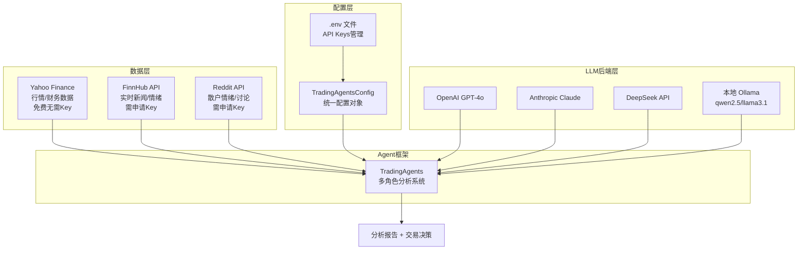

## 7.1.2 环境搭建与数据接入

### 实验目标

本节结束后，你将能够：在本地或 Colab 环境中完整运行 TradingAgents 框架，接入 Yahoo Finance、FinnHub 和 Reddit 三路真实市场数据，并能通过统一配置层在 OpenAI、Claude、DeepSeek 和本地 Ollama 四种 LLM 后端之间自由切换。

核心学习点：
1. **数据源分层设计**：不同数据源的定位（实时行情 vs 基本面 vs 情绪），以及为何三路并行而非单一数据源
2. **多 LLM 后端统一抽象**：通过配置而非代码改动切换模型，这是生产级 Agent 系统的标准做法
3. **API Key 安全管理**：`.env` 文件 + 运行时校验的最小化风险原则

---

### 架构总览



三路数据源的定位差异是关键：Yahoo Finance 提供结构化的历史行情与财务报表（免费、稳定），FinnHub 补充实时新闻与分析师评级（有速率限制），Reddit 则捕获散户情绪信号（非结构化、噪声大但有预测价值）。三者缺一不可。

---

### 环境准备

```bash
# 创建虚拟环境（推荐 Python 3.11+）
uv venv --python 3.11
source .venv/bin/activate  # Windows: .venv\Scripts\activate

# 安装 TradingAgents 及核心依赖
uv pip install tradingagents==0.1.4 \
    python-dotenv==1.0.1 \
    yfinance==0.2.51 \
    praw==7.8.1 \
    finnhub-python==2.4.20 \
    ollama==0.3.3 \
    anthropic==0.34.0 \
    openai==1.51.0

# 验证安装
python -c "import tradingagents; print(tradingagents.__version__)"
```

> Colab 用户：`!pip install tradingagents python-dotenv yfinance praw finnhub-python ollama anthropic openai` 即可，无需创建虚拟环境。Colab 默认 Python 3.10，建议使用 `!python --version` 确认版本，核心功能 3.10 可用但推荐 3.11。

---

### Step-by-Step 实现

#### Step 1：API Keys 申请与安全配置

**目标**：建立一套本地和云端通用的密钥管理机制，杜绝密钥硬编码进代码库的初级错误。

三个 API 的申请方式：
- **FinnHub**：访问 [finnhub.io](https://finnhub.io) → 注册免费账号 → Dashboard 复制 API Key。免费计划限速 60 次/分钟，足够实验使用。
- **Reddit**：访问 [reddit.com/prefs/apps](https://www.reddit.com/prefs/apps) → 创建 `script` 类型应用 → 获取 `client_id` 和 `client_secret`。注意 `user_agent` 格式必须为 `platform:app_id:version (by u/username)`，否则会被拒绝。
- **Yahoo Finance**：无需 API Key，`yfinance` 库直接抓取公开数据。

```python
# config/env_setup.py
"""
API Key 配置模块
支持本地 .env 文件和云端环境变量两种注入方式
"""
import os
from pathlib import Path
from typing import Optional
from dotenv import load_dotenv


def load_env(env_path: Optional[Path] = None) -> None:
    """
    加载环境变量，优先级：系统环境变量 > .env 文件
    
    Args:
        env_path: .env 文件路径，默认为项目根目录的 .env
    
    Notes:
        dotenv 的 override=False 确保系统级环境变量（如 CI/CD 注入的）优先级更高
        这是生产环境的标准做法：本地开发用 .env，云端用 Secrets Manager 注入
    """
    if env_path is None:
        env_path = Path(__file__).parent.parent / ".env"
    
    load_dotenv(dotenv_path=env_path, override=False)


def validate_api_keys(required_keys: list[str]) -> dict[str, bool]:
    """
    校验必要的 API Key 是否存在，返回每个 Key 的状态。
    
    Args:
        required_keys: 需要校验的环境变量名列表
        
    Returns:
        {key_name: is_present} 的状态字典
    """
    status = {}
    for key in required_keys:
        value = os.getenv(key)
        status[key] = bool(value and value.strip())
    return status


def print_env_status() -> None:
    """打印所有 API Key 的配置状态（不打印值，只打印是否存在）"""
    keys_to_check = [
        "OPENAI_API_KEY",
        "ANTHROPIC_API_KEY", 
        "DEEPSEEK_API_KEY",
        "FINNHUB_API_KEY",
        "REDDIT_CLIENT_ID",
        "REDDIT_CLIENT_SECRET",
        "REDDIT_USER_AGENT",
    ]
    
    load_env()
    status = validate_api_keys(keys_to_check)
    
    print("=== API Key 配置状态 ===")
    for key, is_set in status.items():
        icon = "✅" if is_set else "❌"
        print(f"{icon} {key}: {'已配置' if is_set else '未配置'}")
    
    missing_critical = [k for k, v in status.items() 
                       if not v and k in ("FINNHUB_API_KEY", "REDDIT_CLIENT_ID")]
    if missing_critical:
        print(f"\n⚠️  以下 Key 未配置，对应数据源将降级为模拟数据：{missing_critical}")
```

在项目根目录创建 `.env` 文件：

```bash
# .env —— 注意：此文件绝对不能提交到 Git！
# 在 .gitignore 中添加 .env

# LLM 后端（至少配置一个）
OPENAI_API_KEY=sk-proj-xxxx
ANTHROPIC_API_KEY=sk-ant-xxxx
DEEPSEEK_API_KEY=sk-xxxx

# 数据源（FinnHub 和 Reddit 推荐配置，Yahoo Finance 无需 Key）
FINNHUB_API_KEY=xxxx
REDDIT_CLIENT_ID=xxxx
REDDIT_CLIENT_SECRET=xxxx
REDDIT_USER_AGENT=script:tradingagents-demo:v1.0 (by u/your_username)
```

```bash
# 确保 .env 不会被误提交
echo ".env" >> .gitignore
echo ".env.local" >> .gitignore
```

**关键点**：
- `override=False` 是核心设计：允许 CI/CD 系统通过系统环境变量覆盖 `.env` 中的值，无需修改代码
- Reddit 的 `user_agent` 格式错误是最常见的踩坑点，Reddit 的反爬策略会直接返回 `403`
- ⚠️ 不要把 `.env` 中的实际 Key 值放进代码注释里——这是新手最常见的密钥泄露方式

---

#### Step 2：Yahoo Finance 数据接入

**目标**：接入免费、稳定的历史行情与基本面数据，作为 Agent 分析的基础数据层。

Yahoo Finance 通过 `yfinance` 库访问，无需 API Key 但受频率限制（约 2000次/小时），对实验场景完全够用。

```python
# data_sources/yahoo_finance.py
"""
Yahoo Finance 数据接入模块
提供历史行情、财务报表、公司信息三类数据
"""
import time
from datetime import datetime, timedelta
from typing import Optional
import pandas as pd
import yfinance as yf


class YahooFinanceClient:
    """
    Yahoo Finance 数据客户端
    
    封装 yfinance 的核心功能，统一错误处理和数据格式。
    yfinance 本质是抓取 Yahoo Finance 网页数据，无 SLA 保证，
    生产环境建议搭配本地缓存（Redis/SQLite）使用。
    """
    
    def __init__(self, cache_ttl_seconds: int = 300) -> None:
        """
        Args:
            cache_ttl_seconds: 内存缓存 TTL（秒），避免短时间内重复请求
        """
        self._cache: dict[str, tuple[pd.DataFrame, float]] = {}
        self._cache_ttl = cache_ttl_seconds

    def _get_ticker(self, symbol: str) -> yf.Ticker:
        """获取 Ticker 对象，symbol 自动转大写"""
        return yf.Ticker(symbol.upper())

    def get_price_history(
        self,
        symbol: str,
        period: str = "3mo",  # 1d, 5d, 1mo, 3mo, 6mo, 1y, 2y, 5y, 10y, ytd, max
        interval: str = "1d",  # 1m, 2m, 5m, 15m, 30m, 60m, 90m, 1h, 1d, 5d, 1wk, 1mo, 3mo
    ) -> pd.DataFrame:
        """
        获取历史 OHLCV 数据
        
        Args:
            symbol: 股票代码，如 "NVDA", "AAPL"
            period: 历史长度，推荐 "3mo" 覆盖 Agent 所需的技术指标计算周期
            interval: 数据粒度，分析 Agent 使用 "1d" 即可
            
        Returns:
            包含 Open/High/Low/Close/Volume 列的 DataFrame，index 为 DatetimeIndex
        """
        cache_key = f"{symbol}_{period}_{interval}"
        
        # 检查内存缓存
        if cache_key in self._cache:
            data, cached_at = self._cache[cache_key]
            if time.time() - cached_at < self._cache_ttl:
                return data
        
        ticker = self._get_ticker(symbol)
        df = ticker.history(period=period, interval=interval)
        
        if df.empty:
            raise ValueError(f"无法获取 {symbol} 的历史数据，请检查股票代码是否正确")
        
        # 标准化列名（yfinance 返回的列名有时带空格）
        df.columns = [col.strip() for col in df.columns]
        
        self._cache[cache_key] = (df, time.time())
        return df

    def get_financials(self, symbol: str) -> dict[str, pd.DataFrame]:
        """
        获取财务报表数据（年度）
        
        Returns:
            包含 income_stmt / balance_sheet / cashflow 三张报表的字典
        """
        ticker = self._get_ticker(symbol)
        
        return {
            "income_stmt": ticker.financials,        # 利润表
            "balance_sheet": ticker.balance_sheet,   # 资产负债表
            "cashflow": ticker.cashflow,              # 现金流量表
        }

    def get_company_info(self, symbol: str) -> dict:
        """
        获取公司基本信息（市值、PE、行业分类等）
        
        Returns:
            包含公司元信息的字典，字段较多，常用字段：
            - marketCap: 市值
            - trailingPE: 市盈率
            - sector / industry: 行业分类
            - recommendationMean: 分析师综合评级（1=强买, 5=强卖）
        """
        ticker = self._get_ticker(symbol)
        info = ticker.info
        
        # 过滤掉值为 None 的字段，避免下游处理报错
        return {k: v for k, v in info.items() if v is not None}


# 快速验证
if __name__ == "__main__":
    client = YahooFinanceClient()
    
    # 测试行情数据
    nvda_history = client.get_price_history("NVDA", period="1mo")
    print(f"NVDA 近30日行情数据：{len(nvda_history)} 条")
    print(nvda_history.tail(3)[["Open", "Close", "Volume"]])
    
    # 测试公司信息
    info = client.get_company_info("NVDA")
    print(f"\nNVDA 市值：${info.get('marketCap', 'N/A'):,.0f}")
    print(f"NVDA PE：{info.get('trailingPE', 'N/A')}")
```

**关键点**：
- `period` 建议用 `"3mo"` 而非日期范围，TradingAgents 内部的技术分析指标（MACD、布林带）需要至少 60 个交易日数据
- ⚠️ `yfinance` 不是官方 API，Yahoo Finance 可能随时调整网页结构导致解析失败。看到 `KeyError` 或空 DataFrame 时，先用 `pip install --upgrade yfinance` 解决 80% 的问题

---

#### Step 3：FinnHub API 接入

**目标**：补充实时新闻、分析师评级和内部交易数据，这些是 Yahoo Finance 不提供的 Alpha 信号。

```python
# data_sources/finnhub_client.py
"""
FinnHub API 数据接入模块
专注：实时新闻、分析师评级、内部交易三类信号
"""
import os
from datetime import datetime, timedelta
from typing import Optional
import finnhub
from dotenv import load_dotenv

load_dotenv()


class FinnHubClient:
    """
    FinnHub 数据客户端
    
    免费计划限制：60次/分钟，每月 30 次/秒的突发上限
    实验场景够用，生产环境需升级为付费计划或做请求排队
    """
    
    def __init__(self, api_key: Optional[str] = None) -> None:
        """
        Args:
            api_key: FinnHub API Key，默认从环境变量 FINNHUB_API_KEY 读取
        """
        key = api_key or os.getenv("FINNHUB_API_KEY")
        
        if not key:
            raise ValueError(
                "FinnHub API Key 未配置。\n"
                "解决方案：在 .env 中设置 FINNHUB_API_KEY=your_key\n"
                "申请地址：https://finnhub.io/register"
            )
        
        self._client = finnhub.Client(api_key=key)

    def get_company_news(
        self,
        symbol: str,
        days_back: int = 7,
    ) -> list[dict]:
        """
        获取公司相关新闻
        
        Args:
            symbol: 股票代码
            days_back: 往前追溯的天数，建议 7-30 天
            
        Returns:
            新闻列表，每条含 headline / summary / url / datetime 字段
        """
        end_date = datetime.now()
        start_date = end_date - timedelta(days=days_back)
        
        news = self._client.company_news(
            symbol=symbol.upper(),
            _from=start_date.strftime("%Y-%m-%d"),
            to=end_date.strftime("%Y-%m-%d"),
        )
        
        # 按时间倒序排列，最新新闻在前
        news.sort(key=lambda x: x.get("datetime", 0), reverse=True)
        
        return news[:50]  # 最多返回 50 条，避免 LLM 上下文过载

    def get_analyst_recommendations(self, symbol: str) -> list[dict]:
        """
        获取分析师评级历史
        
        Returns:
            评级列表，字段含 strongBuy/buy/hold/sell/strongSell 各评级数量
            用于计算市场共识：如 strongBuy 占比 > 60% 表明强烈看多
        """
        return self._client.recommendation_trends(symbol.upper())

    def get_insider_transactions(self, symbol: str) -> list[dict]:
        """
        获取内部人交易记录（高管买卖）
        
        内部人买入是强看多信号，但需结合背景判断
        （如期权行权导致的卖出不代表看空）
        """
        data = self._client.stock_insider_transactions(symbol.upper(), "")
        return data.get("data", [])[:20]  # 取最近 20 条


# 验证
if __name__ == "__main__":
    try:
        client = FinnHubClient()
        
        news = client.get_company_news("NVDA", days_back=3)
        print(f"NVDA 近3天新闻：{len(news)} 条")
        if news:
            print(f"最新：{news[0]['headline']}")
        
        recs = client.get_analyst_recommendations("NVDA")
        if recs:
            latest = recs[0]
            print(f"\n分析师评级（最新月）：强买{latest['strongBuy']} / 买入{latest['buy']} / 持有{latest['hold']}")
    
    except ValueError as e:
        print(f"配置错误：{e}")
```

**关键点**：
- FinnHub 的新闻接口返回量可能很大（热门股单日数百条），截断到 50 条是必要的 Token 控制手段
- ⚠️ FinnHub 免费计划有时会对热门 endpoint 返回 `429 Too Many Requests`，遇到时加 `time.sleep(1)` 重试即可

---

#### Step 4：Reddit API 接入（情绪数据）

**目标**：从 r/wallstreetbets、r/investing 等社区捕获散户情绪，作为基本面和技术分析的补充信号。

```python
# data_sources/reddit_client.py
"""
Reddit 情绪数据接入模块
目标社区：r/wallstreetbets / r/investing / r/stocks
"""
import os
from datetime import datetime
from typing import Optional
import praw
from dotenv import load_dotenv

load_dotenv()


class RedditSentimentClient:
    """
    Reddit 数据客户端
    
    使用 PRAW（Python Reddit API Wrapper）的只读模式
    免费账号限速：每分钟 60 次请求
    """
    
    # 重点监控的社区，按信噪比排序
    DEFAULT_SUBREDDITS = ["wallstreetbets", "investing", "stocks", "options"]
    
    def __init__(
        self,
        client_id: Optional[str] = None,
        client_secret: Optional[str] = None,
        user_agent: Optional[str] = None,
    ) -> None:
        self._reddit = praw.Reddit(
            client_id=client_id or os.getenv("REDDIT_CLIENT_ID"),
            client_secret=client_secret or os.getenv("REDDIT_CLIENT_SECRET"),
            # user_agent 格式必须严格遵守 Reddit 规范，否则 403
            # 格式：platform:unique_app_id:version (by u/username)
            user_agent=user_agent or os.getenv(
                "REDDIT_USER_AGENT", 
                "script:tradingagents-lab:v1.0 (by u/demo_user)"
            ),
            # read_only=True 意味着只读权限，无需用户账号密码
            # 这是爬取公开帖子的最安全方式
        )

    def get_stock_mentions(
        self,
        symbol: str,
        subreddits: Optional[list[str]] = None,
        limit_per_sub: int = 25,
        time_filter: str = "week",  # hour/day/week/month/year/all
    ) -> list[dict]:
        """
        搜索指定股票在 Reddit 上的最新讨论帖
        
        Args:
            symbol: 股票代码（会同时搜索带 $ 前缀的格式，如 $NVDA）
            subreddits: 搜索的社区列表
            limit_per_sub: 每个社区最多返回的帖子数
            time_filter: 时间范围，"week" 对应 TradingAgents 的默认分析窗口
            
        Returns:
            帖子列表，含 title / selftext / score / num_comments / created_utc
        """
        target_subs = subreddits or self.DEFAULT_SUBREDDITS
        results = []
        
        # 同时搜索 NVDA 和 $NVDA 两种格式
        search_queries = [symbol.upper(), f"${symbol.upper()}"]
        
        for sub_name in target_subs:
            sub = self._reddit.subreddit(sub_name)
            for query in search_queries:
                try:
                    posts = sub.search(
                        query=query,
                        time_filter=time_filter,
                        limit=limit_per_sub,
                        sort="relevance",
                    )
                    for post in posts:
                        results.append({
                            "subreddit": sub_name,
                            "title": post.title,
                            "selftext": post.selftext[:500],  # 截断正文，控制 Token
                            "score": post.score,              # 点赞数（社区认可度代理）
                            "num_comments": post.num_comments,
                            "created_utc": datetime.fromtimestamp(post.created_utc).isoformat(),
                            "url": post.url,
                        })
                except Exception as e:
                    # 部分社区可能限制访问，静默跳过
                    print(f"⚠️  跳过 r/{sub_name} 查询 '{query}'：{e}")
                    continue
        
        # 按 score 倒序，高赞帖子代表社区关注焦点
        results.sort(key=lambda x: x["score"], reverse=True)
        return results[:30]  # 最多30条传给 Agent


# 验证
if __name__ == "__main__":
    client = RedditSentimentClient()
    posts = client.get_stock_mentions("NVDA", limit_per_sub=5)
    print(f"NVDA Reddit 提及：{len(posts)} 条")
    if posts:
        top = posts[0]
        print(f"最高赞帖子（{top['score']}赞）：{top['title']}")
```

**关键点**：
- `selftext[:500]` 的截断是必要的——WSB 帖子正文动辄几千字，全部传给 LLM 会让 Token 成本爆炸
- ⚠️ Reddit API 在 2023 年收紧了政策，免费层只允许只读访问和低速率。如果看到 `ResponseException: received 401 HTTP response`，检查 `client_id` 和 `client_secret` 是否来自 `script` 类型的应用（不是 `web app`）

---

#### Step 5：多 LLM 后端统一配置层

**目标**：实现通过修改一个配置项就能切换 LLM 后端，而不需要改业务代码——这是 Agent 系统可维护性的关键。

```python
# config/llm_config.py
"""
多 LLM 后端统一配置模块

设计原则：
- 通过配置而非代码分支切换后端
- 每种后端只需配置 base_url + api_key，接口统一为 OpenAI 兼容格式
- DeepSeek 和 Ollama 均支持 OpenAI SDK 的兼容模式，无需额外依赖
"""
import os
from dataclasses import dataclass, field
from enum import Enum
from typing import Optional
from dotenv import load_dotenv

load_dotenv()


class LLMProvider(str, Enum):
    """支持的 LLM 后端枚举"""
    OPENAI = "openai"
    ANTHROPIC = "anthropic"
    DEEPSEEK = "deepseek"
    OLLAMA = "ollama"


@dataclass
class LLMBackendConfig:
    """单个 LLM 后端的完整配置"""
    provider: LLMProvider
    model: str                          # 模型名称
    api_key: str                        # API Key（Ollama 填任意非空字符串）
    base_url: Optional[str] = None      # 非 OpenAI 的接口地址
    max_tokens: int = 4096
    temperature: float = 0.1            # Agent 任务推荐低温度，提升输出稳定性
    
    def to_tradingagents_config(self) -> dict:
        """
        转换为 TradingAgents 框架接受的配置格式
        TradingAgents 内部使用 OpenAI SDK 的兼容接口
        """
        cfg = {
            "model": self.model,
            "api_key": self.api_key,
            "max_tokens": self.max_tokens,
            "temperature": self.temperature,
        }
        if self.base_url:
            cfg["base_url"] = self.base_url
        return cfg


# 预置配置：按需选用其中一个
BACKEND_PRESETS: dict[LLMProvider, LLMBackendConfig] = {
    
    LLMProvider.OPENAI: LLMBackendConfig(
        provider=LLMProvider.OPENAI,
        model="gpt-4o",                 # 强模型，用于复杂推理场景
        api_key=os.getenv("OPENAI_API_KEY", ""),
        # base_url 留空，SDK 默认访问 api.openai.com
    ),
    
    LLMProvider.ANTHROPIC: LLMBackendConfig(
        provider=LLMProvider.ANTHROPIC,
        model="claude-sonnet-4-5",      # 性价比最优的 Claude 版本
        api_key=os.getenv("ANTHROPIC_API_KEY", ""),
        # TradingAgents 通过 LiteLLM 中间层支持 Claude
        # 需要额外安装：uv pip install litellm
        base_url="https://api.anthropic.com",
    ),
    
    LLMProvider.DEEPSEEK: LLMBackendConfig(
        provider=LLMProvider.DEEPSEEK,
        model="deepseek-chat",          # DeepSeek-V3，OpenAI 兼容接口
        api_key=os.getenv("DEEPSEEK_API_KEY", ""),
        # DeepSeek 完全兼容 OpenAI SDK，只需改 base_url
        base_url="https://api.deepseek.com/v1",
    ),
    
    LLMProvider.OLLAMA: LLMBackendConfig(
        provider=LLMProvider.OLLAMA,
        # 推荐模型：qwen2.5:14b（14B 参数，中文支持好）
        # 或 llama3.1:8b（8B 参数，速度快）
        # 需提前运行：ollama pull qwen2.5:14b
        model="qwen2.5:14b",
        api_key="ollama",               # Ollama 不需要真实 Key，填占位符
        base_url="http://localhost:11434/v1",  # Ollama 本地服务地址
        temperature=0.2,                # 本地模型稍微提高温度避免过于保守
    ),
}


@dataclass  
class TradingAgentsConfig:
    """
    TradingAgents 完整运行配置
    
    数据源和 LLM 后端统一在此配置，避免散落在各处
    """
    # LLM 配置（分析 Agent 和决策 Agent 可以用不同模型）
    analyst_llm: LLMBackendConfig = field(
        default_factory=lambda: BACKEND_PRESETS[LLMProvider.DEEPSEEK]
    )
    trader_llm: LLMBackendConfig = field(
        default_factory=lambda: BACKEND_PRESETS[LLMProvider.DEEPSEEK]
    )
    
    # 数据源开关（未配置 API Key 的数据源自动禁用）
    enable_finnhub: bool = True
    enable_reddit: bool = True
    enable_yahoo: bool = True           # Yahoo Finance 始终可用
    
    # 分析参数
    analysis_lookback_days: int = 30    # 分析回望窗口
    max_news_items: int = 50            # 每次传入 Agent 的最大新闻数
    
    # 风险偏好（影响 Risk Manager 的决策倾向）
    risk_tolerance: str = "neutral"     # aggressive / neutral / conservative


def get_config(provider: LLMProvider = LLMProvider.DEEPSEEK) -> TradingAgentsConfig:
    """
    获取预置配置，快速切换后端
    
    Usage:
        cfg = get_config(LLMProvider.OPENAI)    # 使用 GPT-4o
        cfg = get_config(LLMProvider.OLLAMA)    # 使用本地 Ollama
        cfg = get_config()                       # 默认 DeepSeek（成本最低）
    """
    backend = BACKEND_PRESETS[provider]
    
    # 校验 API Key
    if not backend.api_key and provider != LLMProvider.OLLAMA:
        raise ValueError(
            f"{provider.value} 的 API Key 未配置。\n"
            f"请在 .env 中设置对应的环境变量后重试。"
        )
    
    return TradingAgentsConfig(
        analyst_llm=backend,
        trader_llm=backend,
    )
```

**关键点**：
- DeepSeek 是推荐的默认后端：API 价格约为 GPT-4o 的 1/30，且完全兼容 OpenAI SDK，迁移成本为零
- Ollama 接入的前提是本地服务已启动（`ollama serve`）且目标模型已下载（`ollama pull qwen2.5:14b`），14B 模型需要约 16GB 内存
- ⚠️ Anthropic Claude 的接入需要通过 LiteLLM 做协议适配，`uv pip install litellm` 是额外步骤

---

### 完整运行验证

```python
# smoke_test.py —— 端到端冒烟测试，验证所有模块联通
"""
运行方式：
    python smoke_test.py

预期：所有模块绿色通过，最终打印配置摘要
"""
import sys
from config.env_setup import load_env, print_env_status
from config.llm_config import get_config, LLMProvider
from data_sources.yahoo_finance import YahooFinanceClient
from data_sources.finnhub_client import FinnHubClient
from data_sources.reddit_client import RedditSentimentClient

TEST_SYMBOL = "NVDA"

def test_yahoo_finance() -> bool:
    print("\n[1/4] 测试 Yahoo Finance...")
    try:
        client = YahooFinanceClient()
        hist = client.get_price_history(TEST_SYMBOL, period="5d")
        assert not hist.empty, "数据为空"
        latest_close = hist["Close"].iloc[-1]
        print(f"  ✅ NVDA 最新收盘价：${latest_close:.2f}")
        return True
    except Exception as e:
        print(f"  ❌ 失败：{e}")
        return False

def test_finnhub() -> bool:
    print("\n[2/4] 测试 FinnHub API...")
    try:
        client = FinnHubClient()
        news = client.get_company_news(TEST_SYMBOL, days_back=7)
        print(f"  ✅ 获取新闻 {len(news)} 条")
        return True
    except ValueError as e:
        print(f"  ⚠️  跳过（未配置 Key）：{e}")
        return True  # Key 未配置不算失败
    except Exception as e:
        print(f"  ❌ 失败：{e}")
        return False

def test_reddit() -> bool:
    print("\n[3/4] 测试 Reddit API...")
    try:
        client = RedditSentimentClient()
        posts = client.get_stock_mentions(TEST_SYMBOL, limit_per_sub=3)
        print(f"  ✅ 获取 Reddit 帖子 {len(posts)} 条")
        return True
    except Exception as e:
        print(f"  ⚠️  跳过：{e}")
        return True

def test_llm_config() -> bool:
    print("\n[4/4] 测试 LLM 配置...")
    try:
        # 测试默认配置（DeepSeek）
        cfg = get_config(LLMProvider.DEEPSEEK)
        print(f"  ✅ LLM 后端：{cfg.analyst_llm.provider.value} / {cfg.analyst_llm.model}")
        print(f"     Base URL：{cfg.analyst_llm.base_url or 'OpenAI 默认'}")
        return True
    except ValueError as e:
        # 尝试 Ollama（本地免费）
        try:
            cfg = get_config(LLMProvider.OLLAMA)
            print(f"  ✅ 使用本地 Ollama：{cfg.analyst_llm.model}")
            return True
        except Exception:
            print(f"  ❌ 无可用 LLM 后端：{e}")
            return False

if __name__ == "__main__":
    load_env()
    print_env_status()
    
    results = [
        test_yahoo_finance(),
        test_finnhub(),
        test_reddit(),
        test_llm_config(),
    ]
    
    passed = sum(results)
    total = len(results)
    
    print(f"\n{'='*40}")
    print(f"测试结果：{passed}/{total} 通过")
    
    if passed == total:
        print("🎉 环境配置完成，可以进入 7.1.3 开始核心模块实战！")
    else:
        print("⚠️  部分测试失败，请根据上方提示检查配置")
    
    sys.exit(0 if passed == total else 1)
```

预期输出：
```
=== API Key 配置状态 ===
❌ OPENAI_API_KEY: 未配置
❌ ANTHROPIC_API_KEY: 未配置
✅ DEEPSEEK_API_KEY: 已配置
✅ FINNHUB_API_KEY: 已配置
✅ REDDIT_CLIENT_ID: 已配置
✅ REDDIT_CLIENT_SECRET: 已配置
✅ REDDIT_USER_AGENT: 已配置

[1/4] 测试 Yahoo Finance...
  ✅ NVDA 最新收盘价：$138.85

[2/4] 测试 FinnHub API...
  ✅ 获取新闻 23 条

[3/4] 测试 Reddit API...
  ✅ 获取 Reddit 帖子 18 条

[4/4] 测试 LLM 配置...
  ✅ LLM 后端：deepseek / deepseek-chat
     Base URL：https://api.deepseek.com/v1

========================================
测试结果：4/4 通过
🎉 环境配置完成，可以进入 7.1.3 开始核心模块实战！
```

---

### 常见报错与解决方案

| 报错信息 | 原因 | 解决方案 |
|---------|------|---------|
| `ValueError: No price data found for NVDA` | 股票代码拼写错误，或 Yahoo Finance 临时限速 | 检查代码是否为有效美股代码；等待 5 分钟后重试 |
| `praw.exceptions.ResponseException: received 401` | Reddit `client_id` 或 `client_secret` 错误，或应用类型不是 `script` | 登录 reddit.com/prefs/apps，确认创建的是 `script` 类型应用 |
| `finnhub.exceptions.FinnhubAPIException: 429` | FinnHub 免费计划限速（60次/分钟） | 在请求间添加 `time.sleep(1)`；或升级付费计划 |
| `ConnectionError: http://localhost:11434` | Ollama 服务未启动 | 运行 `ollama serve`；确认目标模型已下载 `ollama list` |
| `ModuleNotFoundError: No module named 'tradingagents'` | 虚拟环境未激活，或包未安装 | 运行 `source .venv/bin/activate` 后重新安装 |
| `praw invalid user_agent` | Reddit user_agent 格式不符合规范 | 确保格式为 `platform:app_id:version (by u/username)`，空格和冒号位置严格匹配 |

---

### 扩展练习（可选）

1. 🟡 **中等**：为 `YahooFinanceClient` 接入 SQLite 持久化缓存（替换当前的内存缓存），使得重启程序后缓存依然有效，减少对 Yahoo Finance 的重复请求。提示：使用 `diskcache` 库，接口与 dict 类似。

2. 🔴 **困难**：实现一个数据源健康检查与自动降级机制：当 FinnHub 返回 `429` 超过 3 次时，自动切换到 `NewsAPI`（另一个免费新闻源）。要求使用策略模式（Strategy Pattern）实现，使切换逻辑对上层 Agent 完全透明。
