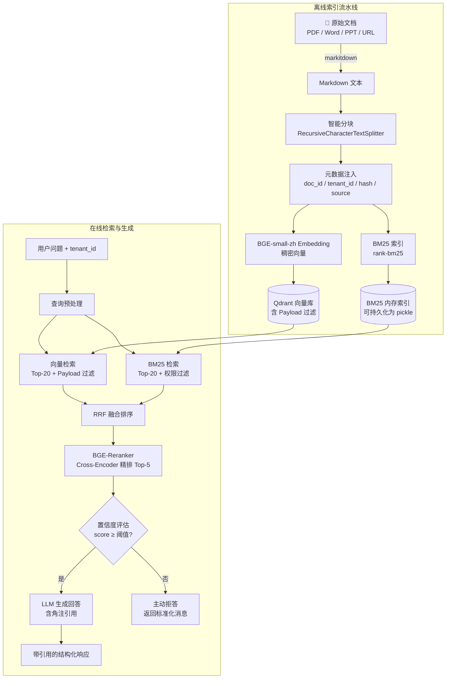

# 7.2 项目二：企业知识库智能问答

---

## 实验目标

本节结束后，你将能够：

1. **搭建完整的多格式文档处理流水线**：支持 PDF、Word、PPT、网页统一解析，并实现基于文件哈希的增量同步，避免重复索引。
2. **实现生产可用的混合检索层**：将 BM25 关键词检索与稠密向量检索通过 RRF 算法融合，再接 BGE-Reranker 精排，并在 Qdrant Payload 层实现多租户权限过滤，检索精度相比 Naive RAG 提升约 30–40%。
3. **生成带段落级角注引用的回答，并具备主动拒答能力**：当检索结果置信度不足时，系统不编造答案，而是明确告知用户"无法从现有文档中找到答案"，将幻觉率控制在可接受范围内。

核心学习点：**混合检索融合（RRF）**、**基于 Metadata 的多租户权限隔离**、**引用追踪与置信度拒答**。

---

## 架构总览



---

## 环境准备

```bash
# 创建虚拟环境（uv）
uv venv --python 3.11
source .venv/bin/activate  # Windows: .venv\Scripts\activate

# 安装依赖
uv pip install -r requirements.txt
```

> Colab 用户：
> ```python
> !pip install 'markitdown[all]>=0.1.1' qdrant-client>=1.9.1 fastembed>=0.3.3 \
>     rank-bm25>=0.2.2 sentence-transformers>=3.0.1 openai>=1.35.0 \
>     langchain-text-splitters>=0.2.2 python-dotenv>=1.0.1 tqdm>=4.66.4
> ```
> Colab 默认已有 Python 3.10+，无需创建虚拟环境。

```bash
# 启动本地 Qdrant（需要 Docker）
docker run -d --name qdrant -p 6333:6333 -p 6334:6334 \
    -v $(pwd)/qdrant_data:/qdrant/storage \
    qdrant/qdrant:v1.9.4

# 复制并编辑 .env 文件
cp .env.example .env
# 编辑 .env，填入你的 API Key
```

`.env.example` 内容参考：
```ini
# OpenAI API 配置
OPENAI_API_KEY=sk-...
OPENAI_BASE_URL=
OPENAI_MODEL=gpt-4o-mini

# Qdrant 向量数据库配置
QDRANT_URL=http://localhost:6333
QDRANT_API_KEY=
QDRANT_COLLECTION=enterprise_kb
```

> ⚠️ **生产注意**：Colab 环境无法运行 Docker，可改用 Qdrant Cloud 免费集群（qdrant.io），将 QDRANT_URL 替换为云端 URL 并添加 QDRANT_API_KEY。

---

## Step-by-Step 实现

### Step 0：全局配置（core_config.py）

**目标**：通过 `core_config.py` 集中管理所有配置项——大模型注册表、Qdrant 连接参数、Embedding 模型、检索超参、分块参数等。各业务模块统一从此文件导入，避免硬编码散落各处。

```python
# core_config.py
"""全局配置：模型注册表与定价信息"""
import os
from dotenv import load_dotenv
from typing import TypedDict

load_dotenv()


class ModelConfig(TypedDict):
    litellm_id: str          # LiteLLM 识别的模型字符串
    price_in: float          # 每 1K input tokens 价格（美元）
    price_out: float         # 每 1K output tokens 价格（美元）
    max_tokens_limit: int    # 模型支持的最大 max_tokens
    api_key_env: str | None  # API Key 环境变量名
    base_url: str | None     # API 基础 URL（None 表示使用默认）


# 注册表：key 是界面显示名，value 是调用配置
MODEL_REGISTRY: dict[str, ModelConfig] = {
    "DeepSeek-V3": {
        "litellm_id": "deepseek/deepseek-chat",
        "price_in": 0.00027,
        "price_out": 0.0011,
        "max_tokens_limit": 4096,
        "api_key_env": "DEEPSEEK_API_KEY",
        "base_url": None,
    },
    "Qwen-Max": {
        "litellm_id": "qwen/qwen-plus",
        "price_in": 0.001,
        "price_out": 0.004,
        "max_tokens_limit": 4096,
        "api_key_env": "DASHSCOPE_API_KEY",
        "base_url": "https://dashscope.aliyuncs.com/compatible-mode/v1",
    },
    "GPT-4o-mini": {
        "litellm_id": "gpt-4o-mini",
        "price_in": 0.00015,
        "price_out": 0.0006,
        "max_tokens_limit": 4096,
        "api_key_env": "OPENAI_API_KEY",
        "base_url": None,
    },
}

# 当前激活模型 key — 修改此处全局生效，必须是 MODEL_REGISTRY 中的 key
ACTIVE_MODEL_KEY: str = "Qwen-Max"


def get_active_config() -> ModelConfig:
    """获取当前激活模型的完整配置"""
    return MODEL_REGISTRY[ACTIVE_MODEL_KEY]


def get_litellm_id(model_key: str | None = None) -> str:
    """获取指定模型（默认激活模型）的 LiteLLM ID"""
    key = model_key or ACTIVE_MODEL_KEY
    return MODEL_REGISTRY[key]["litellm_id"]


def get_api_key(model_key: str | None = None) -> str | None:
    """从环境变量读取指定模型的 API Key"""
    key = model_key or ACTIVE_MODEL_KEY
    env_var = MODEL_REGISTRY[key]["api_key_env"]
    return os.environ.get(env_var) if env_var else None


def get_base_url(model_key: str | None = None) -> str | None:
    """获取指定模型的 base_url（None 表示使用 SDK 默认值）"""
    key = model_key or ACTIVE_MODEL_KEY
    return MODEL_REGISTRY[key]["base_url"]


def get_model_list() -> list[str]:
    """获取所有已注册模型的显示名列表"""
    return list(MODEL_REGISTRY.keys())


def estimate_cost(model_key: str, input_tokens: int, output_tokens: int) -> float:
    """根据 Token 数估算调用费用（美元）"""
    cfg = MODEL_REGISTRY[model_key]
    return (
        input_tokens / 1000 * cfg["price_in"]
        + output_tokens / 1000 * cfg["price_out"]
    )


# ── Qdrant 向量数据库配置 ──
QDRANT_URL = os.getenv("QDRANT_URL", "http://localhost:6333")
QDRANT_API_KEY = os.getenv("QDRANT_API_KEY")
QDRANT_COLLECTION = os.getenv("QDRANT_COLLECTION", "enterprise_kb")

# Embedding 模型配置
EMBED_MODEL = "BAAI/bge-small-zh-v1.5"
VECTOR_DIM = 512

# 检索配置
TOP_K_PER_SOURCE = 20
FINAL_TOP_N = 5
RRF_K = 60
CONFIDENCE_THRESHOLD = 0.0

# 分块配置
CHUNK_SIZE = 512
CHUNK_OVERLAP = 64
```

**关键点**：
- `EMBED_MODEL` 使用 `BAAI/bge-small-zh-v1.5`（512 维），而非 `bge-m3`（1024 维）。bge-small-zh 是中文场景下的性价比之选——模型体积小（约 380MB），加载更快，中文理解能力足以覆盖企业知识库场景，同时降低内存和推理延迟。
- 所有配置项集中管理，修改 `core_config.py` 一处即可全局生效，无需改动业务代码。
- 默认激活模型为 `Qwen-Max`，通过 `get_api_key()` 和 `get_base_url()` 自动适配不同厂商。

---

### Step 1：统一文档解析器

**目标**：用 markitdown 将 PDF / Word / PPT / 网页统一转换为 Markdown 文本，并计算文件哈希用于增量更新判断。

markitdown 的核心价值在于它不只是提取纯文本——它保留了标题层级、表格结构、列表格式等语义信息，这些结构对后续分块策略和引用定位至关重要。

```python
# document_parser.py
from __future__ import annotations

import hashlib
import re
from dataclasses import dataclass, field
from pathlib import Path
from typing import Literal
from urllib.parse import urlparse

from markitdown import MarkItDown


DocumentType = Literal["pdf", "docx", "pptx", "html", "url", "txt", "unknown"]


@dataclass
class ParsedDocument:
    content: str
    source: str
    doc_type: DocumentType
    file_hash: str
    title: str = ""
    metadata: dict = field(default_factory=dict)


def _compute_hash(source: str | Path) -> str:
    if isinstance(source, Path) and source.exists():
        sha256 = hashlib.sha256()
        with open(source, "rb") as f:
            for chunk in iter(lambda: f.read(8192), b""):
                sha256.update(chunk)
        return sha256.hexdigest()
    return hashlib.sha256(str(source).encode()).hexdigest()


def _detect_type(source: str | Path) -> DocumentType:
    s = str(source).lower()
    if s.startswith("http://") or s.startswith("https://"):
        return "url"
    suffix = Path(s).suffix.lstrip(".")
    return suffix if suffix in ("pdf", "docx", "pptx", "html", "txt") else "unknown"


def _extract_title(source: str | Path, content: str) -> str:
    match = re.search(r"^#\s+(.+)$", content, re.MULTILINE)
    if match:
        return match.group(1).strip()
    if isinstance(source, Path):
        return source.stem.replace("_", " ").replace("-", " ").title()
    path = urlparse(str(source)).path.rstrip("/")
    return path.split("/")[-1] or str(source)


class DocumentParser:
    def __init__(self) -> None:
        self._md = MarkItDown()

    def parse(
        self,
        source: str | Path,
        tenant_id: str = "default",
        extra_metadata: dict | None = None,
    ) -> ParsedDocument:
        source = Path(source) if not str(source).startswith("http") else str(source)
        doc_type = _detect_type(source)
        file_hash = _compute_hash(source)

        result = self._md.convert(str(source))
        content: str = result.text_content or ""
        content = re.sub(r"\n{3,}", "\n\n", content).strip()

        title = _extract_title(source, content)

        metadata: dict = {
            "tenant_id": tenant_id,
            "doc_type": doc_type,
            **(extra_metadata or {}),
        }

        return ParsedDocument(
            content=content,
            source=str(source),
            doc_type=doc_type,
            file_hash=file_hash,
            title=title,
            metadata=metadata,
        )

    def parse_batch(
        self,
        sources: list[str | Path],
        tenant_id: str = "default",
        extra_metadata: dict | None = None,
    ) -> list[ParsedDocument]:
        import logging
        results = []
        for src in sources:
            try:
                results.append(self.parse(src, tenant_id, extra_metadata))
            except Exception as exc:
                logging.warning(f"解析失败 {src}: {exc}")
        return results
```

**关键点**：
- `file_hash` 是增量更新的关键。下一步的索引器在写入前会先查询 Qdrant 中是否已有相同 hash 的文档，有则跳过，从而避免重复索引。
- markitdown 对 PPTX 会将每张幻灯片的标题 + 正文 + 备注拼接为 Markdown，保留了大纲层级，比直接用 python-pptx 读纯文本语义更丰富。
- ⚠️ PDF 扫描件（非可搜索 PDF）markitdown 无法提取文字，生产环境需先走 OCR（如 paddleocr）转为文字 PDF 再解析。

---

### Step 2：语义分块与元数据注入

**目标**：将长文档切分为语义连贯的 Chunk，并为每个 Chunk 注入来源追踪所需的完整元数据，这是后续引用角注的数据基础。

分块策略直接影响检索质量。固定 512 字符切法会截断句子；按句子切法遇到长句又会让 Chunk 过小。这里采用 LangChain 的 `RecursiveCharacterTextSplitter`，按段落 → 句子 → 字符层级递归切分，是目前工程实践中最稳健的通用选择。

```python
# chunker.py
from __future__ import annotations

import uuid
from dataclasses import dataclass, field

from langchain_text_splitters import RecursiveCharacterTextSplitter

from core_config import CHUNK_OVERLAP, CHUNK_SIZE
from document_parser import ParsedDocument


@dataclass
class DocumentChunk:
    chunk_id: str
    content: str
    source: str
    title: str
    chunk_index: int
    total_chunks: int
    file_hash: str
    tenant_id: str
    doc_type: str
    extra_metadata: dict = field(default_factory=dict)


_SPLITTER = RecursiveCharacterTextSplitter(
    chunk_size=CHUNK_SIZE,
    chunk_overlap=CHUNK_OVERLAP,
    separators=["\n## ", "\n### ", "\n#### ", "\n\n", "\n", "。", "！", "？", " ", ""],
    length_function=len,
)


def chunk_document(doc: ParsedDocument) -> list[DocumentChunk]:
    raw_chunks: list[str] = _SPLITTER.split_text(doc.content)
    total = len(raw_chunks)

    chunks: list[DocumentChunk] = []
    for idx, text in enumerate(raw_chunks):
        chunk = DocumentChunk(
            chunk_id=str(uuid.uuid4()),
            content=text,
            source=doc.source,
            title=doc.title,
            chunk_index=idx,
            total_chunks=total,
            file_hash=doc.file_hash,
            tenant_id=doc.metadata.get("tenant_id", "default"),
            doc_type=doc.metadata.get("doc_type", "unknown"),
            extra_metadata={
                k: v for k, v in doc.metadata.items()
                if k not in ("tenant_id", "doc_type")
            },
        )
        chunks.append(chunk)

    return chunks
```

**关键点**：
- `CHUNK_SIZE` 和 `CHUNK_OVERLAP` 从 `core_config` 导入，修改一处全局生效。
- `separators` 中 `"\n## "` 优先级最高，确保 Markdown 二级标题不会被切断在块中间——这对保持语义完整性至关重要。
- `chunk_id` 使用 UUID4 作为 Qdrant 的 Point ID，而不是自增整数，是为了支持分布式环境下多进程并发写入不冲突。
- ⚠️ chunk_size 以**字符数**而非 Token 数计算，中文字符约 1.5–2 个 char 对应 1 个 bge-small-zh token。

---

### Step 3：向量索引器（含增量更新逻辑）

**目标**：将 Chunk 写入 Qdrant 向量数据库，并通过哈希比对实现增量更新——只索引新增或变更的文档，跳过未变更的文档。

```python
# indexer.py
from __future__ import annotations

import os
from typing import Any

from fastembed import TextEmbedding
from qdrant_client import QdrantClient
from qdrant_client.http.models import (
    Distance,
    FieldCondition,
    Filter,
    MatchValue,
    PointStruct,
    VectorParams,
)
from tqdm import tqdm

from chunker import DocumentChunk
from core_config import EMBED_MODEL as _EMBED_MODEL, QDRANT_API_KEY, QDRANT_COLLECTION, QDRANT_URL, VECTOR_DIM as _VECTOR_DIM


class VectorIndexer:
    def __init__(
        self,
        collection_name: str | None = None,
        qdrant_url: str | None = None,
    ) -> None:
        self.collection_name = collection_name or QDRANT_COLLECTION
        self._client = QdrantClient(
            url=qdrant_url or QDRANT_URL,
            api_key=QDRANT_API_KEY,
        )
        self._embedder = TextEmbedding(model_name=_EMBED_MODEL)
        self._ensure_collection()

    def _ensure_collection(self) -> None:
        existing = {c.name for c in self._client.get_collections().collections}
        if self.collection_name not in existing:
            self._client.create_collection(
                collection_name=self.collection_name,
                vectors_config=VectorParams(
                    size=_VECTOR_DIM,
                    distance=Distance.COSINE,
                ),
            )
            for field_name in ("tenant_id", "file_hash", "doc_type"):
                self._client.create_payload_index(
                    collection_name=self.collection_name,
                    field_name=field_name,
                    field_schema="keyword",
                )

    def _is_already_indexed(self, file_hash: str, tenant_id: str) -> bool:
        results, _ = self._client.scroll(
            collection_name=self.collection_name,
            scroll_filter=Filter(
                must=[
                    FieldCondition(key="file_hash", match=MatchValue(value=file_hash)),
                    FieldCondition(key="tenant_id", match=MatchValue(value=tenant_id)),
                ]
            ),
            limit=1,
            with_payload=False,
            with_vectors=False,
        )
        return len(results) > 0

    def _delete_by_hash(self, file_hash: str, tenant_id: str) -> None:
        self._client.delete(
            collection_name=self.collection_name,
            points_selector=Filter(
                must=[
                    FieldCondition(key="file_hash", match=MatchValue(value=file_hash)),
                    FieldCondition(key="tenant_id", match=MatchValue(value=tenant_id)),
                ]
            ),
        )

    def index_chunks(
        self,
        chunks: list[DocumentChunk],
        batch_size: int = 64,
        force_reindex: bool = False,
    ) -> dict[str, int]:
        if not chunks:
            return {"indexed": 0, "skipped": 0}

        file_hash = chunks[0].file_hash
        tenant_id = chunks[0].tenant_id

        if not force_reindex and self._is_already_indexed(file_hash, tenant_id):
            return {"indexed": 0, "skipped": len(chunks)}

        stats = {"indexed": 0, "skipped": 0}

        for i in tqdm(range(0, len(chunks), batch_size), desc="索引中", unit="batch"):
            batch = chunks[i : i + batch_size]
            texts = [c.content for c in batch]

            embeddings = list(self._embedder.embed(texts))

            points = [
                PointStruct(
                    id=chunk.chunk_id,
                    vector=emb.tolist(),
                    payload=self._chunk_to_payload(chunk),
                )
                for chunk, emb in zip(batch, embeddings)
            ]

            self._client.upsert(
                collection_name=self.collection_name,
                points=points,
            )
            stats["indexed"] += len(batch)

        return stats

    @staticmethod
    def _chunk_to_payload(chunk: DocumentChunk) -> dict[str, Any]:
        return {
            "content": chunk.content,
            "source": chunk.source,
            "title": chunk.title,
            "chunk_index": chunk.chunk_index,
            "total_chunks": chunk.total_chunks,
            "file_hash": chunk.file_hash,
            "tenant_id": chunk.tenant_id,
            "doc_type": chunk.doc_type,
            **chunk.extra_metadata,
        }
```

**关键点**：
- `_is_already_indexed` 用 `scroll` 而非 `search` 检查存在性，避免引入无意义的相似度计算。
- Payload 索引（`create_payload_index`）对 `tenant_id`、`file_hash` 建立关键词索引，当 Collection 超过 10 万条时，带过滤的检索性能差异可达 10x 以上。
- Embedding 模型和向量维度统一从 `core_config` 导入，切换模型只需改一处。
- ⚠️ `batch_size=64` 在 16GB 内存机器上安全；如果文档 Chunk 很多（>10万），建议改为异步批量写入或使用 Qdrant 的 upload_collection 接口。

---

### Step 4：混合检索器（BM25 + 向量 + RRF 融合）

**目标**：实现稠密检索（语义）+ 稀疏检索（关键词）双路并行，通过 RRF（Reciprocal Rank Fusion）融合，再经 BGE-Reranker 精排，并强制注入 tenant_id 权限过滤。

**为什么需要混合检索**：向量检索擅长语义理解，但对专有名词、缩写、产品型号等精确匹配很差（例如"GPT-4o 和 GPT-4 Turbo 有何区别"，向量检索可能把两者都当成语义相近而混淆）；BM25 擅长关键词精确匹配，但完全不理解语义。两者互补，混合后效果在绝大多数企业知识库场景下优于单路检索。

```python
# retriever.py
from __future__ import annotations

import math
import pickle
from dataclasses import dataclass
from pathlib import Path
from typing import Any

import numpy as np
from fastembed import TextEmbedding
from qdrant_client import QdrantClient
from qdrant_client.http.models import FieldCondition, Filter, MatchValue
from rank_bm25 import BM25Okapi
from sentence_transformers import CrossEncoder


@dataclass
class RetrievedChunk:
    chunk_id: str
    content: str
    source: str
    title: str
    chunk_index: int
    total_chunks: int
    tenant_id: str
    rrf_score: float
    rerank_score: float


_RRF_K = 60
_RERANKER_MODEL = "BAAI/bge-reranker-v2-m3"


def _get_default_reranker() -> CrossEncoder:
    """创建默认 CrossEncoder 实例（延迟初始化，避免 import 时下载模型）"""
    return CrossEncoder(_RERANKER_MODEL)


class HybridRetriever:
    def __init__(
        self,
        collection_name: str,
        qdrant_client: QdrantClient,
        bm25_index_path: str | Path | None = None,
    ) -> None:
        self.collection_name = collection_name
        self._client = qdrant_client
        self._embedder = TextEmbedding(model_name="BAAI/bge-small-zh-v1.5")
        self._reranker = CrossEncoder(_RERANKER_MODEL)

        self._bm25: BM25Okapi | None = None
        self._bm25_corpus: list[dict[str, Any]] = []

        if bm25_index_path and Path(bm25_index_path).exists():
            self._load_bm25(bm25_index_path)

    def build_bm25_from_qdrant(self, tenant_id: str | None = None) -> None:
        all_chunks: list[dict[str, Any]] = []
        offset = None

        scroll_filter = None
        if tenant_id:
            scroll_filter = Filter(
                must=[FieldCondition(key="tenant_id", match=MatchValue(value=tenant_id))]
            )

        while True:
            results, next_offset = self._client.scroll(
                collection_name=self.collection_name,
                scroll_filter=scroll_filter,
                limit=1000,
                offset=offset,
                with_payload=True,
                with_vectors=False,
            )
            all_chunks.extend([r.payload for r in results])
            if next_offset is None:
                break
            offset = next_offset

        tokenized = [self._tokenize(c.get("content", "")) for c in all_chunks]
        self._bm25 = BM25Okapi(tokenized)
        self._bm25_corpus = all_chunks

    def save_bm25(self, path: str | Path) -> None:
        with open(path, "wb") as f:
            pickle.dump({"bm25": self._bm25, "corpus": self._bm25_corpus}, f)

    def _load_bm25(self, path: str | Path) -> None:
        with open(path, "rb") as f:
            data = pickle.load(f)
        self._bm25 = data["bm25"]
        self._bm25_corpus = data["corpus"]

    @staticmethod
    def _tokenize(text: str) -> list[str]:
        import re
        tokens = re.findall(r"[\w\u4e00-\u9fff]+", text.lower())
        return tokens

    def _dense_search(
        self, query: str, tenant_id: str, top_k: int
    ) -> list[tuple[str, float, dict]]:
        query_vec = list(self._embedder.embed([query]))[0].tolist()

        results = self._client.search(
            collection_name=self.collection_name,
            query_vector=query_vec,
            query_filter=Filter(
                must=[FieldCondition(key="tenant_id", match=MatchValue(value=tenant_id))]
            ),
            limit=top_k,
            with_payload=True,
        )
        return [(r.id, r.score, r.payload) for r in results]

    def _bm25_search(
        self, query: str, tenant_id: str, top_k: int
    ) -> list[tuple[str, float, dict]]:
        if self._bm25 is None:
            return []

        tokens = self._tokenize(query)
        scores = self._bm25.get_scores(tokens)

        scored_chunks = [
            (self._bm25_corpus[i].get("chunk_id", str(i)), scores[i], self._bm25_corpus[i])
            for i in range(len(scores))
            if self._bm25_corpus[i].get("tenant_id") == tenant_id
        ]
        scored_chunks.sort(key=lambda x: x[1], reverse=True)
        return scored_chunks[:top_k]

    @staticmethod
    def _rrf_fusion(
        dense_results: list[tuple],
        bm25_results: list[tuple],
        k: int = _RRF_K,
    ) -> list[tuple[str, float, dict]]:
        rrf_scores: dict[str, float] = {}
        payloads: dict[str, dict] = {}

        for rank, (chunk_id, _score, payload) in enumerate(dense_results):
            rrf_scores[chunk_id] = rrf_scores.get(chunk_id, 0) + 1 / (k + rank + 1)
            payloads[chunk_id] = payload

        for rank, (chunk_id, _score, payload) in enumerate(bm25_results):
            rrf_scores[chunk_id] = rrf_scores.get(chunk_id, 0) + 1 / (k + rank + 1)
            payloads[chunk_id] = payload

        sorted_results = sorted(rrf_scores.items(), key=lambda x: x[1], reverse=True)
        return [(chunk_id, score, payloads[chunk_id]) for chunk_id, score in sorted_results]

    def retrieve(
        self,
        query: str,
        tenant_id: str,
        top_k_per_source: int = 20,
        final_top_n: int = 5,
    ) -> list[RetrievedChunk]:
        dense_results = self._dense_search(query, tenant_id, top_k_per_source)
        bm25_results = self._bm25_search(query, tenant_id, top_k_per_source)

        fused = self._rrf_fusion(dense_results, bm25_results)

        rerank_candidates = fused[: final_top_n * 3]
        if not rerank_candidates:
            return []

        pairs = [(query, c[2].get("content", "")) for c in rerank_candidates]
        rerank_scores: list[float] = self._reranker.predict(pairs).tolist()

        scored = sorted(
            zip(rerank_candidates, rerank_scores),
            key=lambda x: x[1],
            reverse=True,
        )

        results: list[RetrievedChunk] = []
        for (chunk_id, rrf_score, payload), rerank_score in scored[:final_top_n]:
            results.append(
                RetrievedChunk(
                    chunk_id=str(chunk_id),
                    content=payload.get("content", ""),
                    source=payload.get("source", ""),
                    title=payload.get("title", ""),
                    chunk_index=payload.get("chunk_index", 0),
                    total_chunks=payload.get("total_chunks", 1),
                    tenant_id=payload.get("tenant_id", tenant_id),
                    rrf_score=rrf_score,
                    rerank_score=rerank_score,
                )
            )
        return results
```

**关键点**：
- **Embedding 模型**：`retriever.py` 同样使用 `BAAI/bge-small-zh-v1.5`（512 维），与 `indexer.py` 保持一致。
- **权限隔离双重保障**：向量检索在 Qdrant Payload 层过滤（数据库层），BM25 在内存中 post-filter（应用层），两路都保证了 tenant_id 隔离，彻底消除跨租户数据泄露风险。
- **RRF 不依赖原始分值**：不同检索系统的分值量纲不同（cosine similarity 在 0-1，BM25 分值可能是 0-50），直接加权融合会导致分值高的系统主导结果。RRF 只用排名（rank），避免了这一问题。
- ⚠️ BM25 内存索引随租户数据量线性增长。百万级 Chunk 占用约 2-4GB 内存，需评估服务器配置。超过 500 万条建议改用 Elasticsearch 的 BM25 接口。

---

### Step 5：生成器（带角注引用 + 置信度拒答）

**目标**：基于检索到的 Chunk 生成回答，在回答文本中嵌入角注引用编号，并在 Reranker 置信度低于阈值时主动拒答而非编造内容。

```python
# generator.py
from __future__ import annotations

import os
from dataclasses import dataclass, field

from openai import OpenAI

from core_config import CONFIDENCE_THRESHOLD as _CONFIDENCE_THRESHOLD, get_api_key, get_base_url, get_litellm_id
from retriever import RetrievedChunk

_ABSTAIN_RESPONSE = (
    "抱歉，根据现有文档库，我无法找到与您问题相关的可靠信息。"
    "请尝试换种方式提问，或联系知识库管理员补充相关文档。"
)


@dataclass
class GeneratedAnswer:
    answer: str
    references: list[dict] = field(default_factory=list)
    is_abstained: bool = False
    top_rerank_score: float = float("-inf")


def _build_context(chunks: list[RetrievedChunk]) -> str:
    parts = []
    for i, chunk in enumerate(chunks, start=1):
        parts.append(
            f"[{i}] 来源：《{chunk.title}》（{chunk.source}）\n{chunk.content}"
        )
    return "\n\n---\n\n".join(parts)


def _build_prompt(query: str, context: str) -> str:
    system_prompt = """你是一个严谨的企业知识库助手。请严格遵守以下规则：

1. **仅基于提供的参考文档**回答问题，不得引用参考文档以外的知识。
2. 在回答中用角注格式标注引用来源，例如"根据公司政策[1]，..."。
   - 角注编号对应参考文档列表中的编号。
   - 同一句话可引用多个来源，如 [1][3]。
3. 如果参考文档中没有足够信息回答问题，请直接说"根据现有文档，我无法回答此问题"，不得编造。
4. 回答语言与用户问题语言保持一致。
5. 回答简洁准确，避免复述用户问题。"""

    user_content = f"""参考文档：

{context}

---

用户问题：{query}"""

    return system_prompt, user_content


class AnswerGenerator:
    def __init__(
        self,
        model: str | None = None,
        confidence_threshold: float = _CONFIDENCE_THRESHOLD,
    ) -> None:
        self._client = OpenAI(
            api_key=get_api_key(),
            base_url=get_base_url(),
        )
        self._model = model or get_litellm_id()
        self._threshold = confidence_threshold

    def generate(
        self,
        query: str,
        chunks: list[RetrievedChunk],
        max_tokens: int = 1024,
    ) -> GeneratedAnswer:
        if not chunks:
            return GeneratedAnswer(
                answer=_ABSTAIN_RESPONSE,
                is_abstained=True,
                top_rerank_score=float("-inf"),
            )

        top_score = chunks[0].rerank_score

        if top_score < self._threshold:
            return GeneratedAnswer(
                answer=_ABSTAIN_RESPONSE,
                is_abstained=True,
                top_rerank_score=top_score,
            )

        valid_chunks = [c for c in chunks if c.rerank_score >= self._threshold]
        context = _build_context(valid_chunks)
        system_prompt, user_content = _build_prompt(query, context)

        response = self._client.chat.completions.create(
            model=self._model,
            messages=[
                {"role": "system", "content": system_prompt},
                {"role": "user", "content": user_content},
            ],
            max_tokens=max_tokens,
            temperature=0.1,
        )

        answer_text = response.choices[0].message.content or ""

        references = [
            {
                "index": i + 1,
                "title": chunk.title,
                "source": chunk.source,
                "chunk_index": chunk.chunk_index,
                "total_chunks": chunk.total_chunks,
                "rerank_score": round(chunk.rerank_score, 4),
            }
            for i, chunk in enumerate(valid_chunks)
        ]

        return GeneratedAnswer(
            answer=answer_text,
            references=references,
            is_abstained=False,
            top_rerank_score=top_score,
        )
```

**关键点**：
- **模型配置从 core_config 导入**：`get_api_key()`、`get_base_url()`、`get_litellm_id()` 替代了硬编码的 `os.getenv("OPENAI_API_KEY")` 和 `os.getenv("OPENAI_MODEL", "gpt-4o-mini")`。切换模型只需修改 `core_config.py` 中的 `ACTIVE_MODEL_KEY`。
- **temperature=0.1**：知识库问答的核心诉求是准确性而非创造性，低温度确保 LLM 紧贴上下文，避免"发散"到训练知识。
- **置信度拒答的阈值选择**：`0.0` 是 BGE-Reranker logit 的自然分界点（sigmoid(0)=0.5，即 50% 相关概率）。实际部署时建议在业务场景上标注 200 个 QA 对，绘制 PR 曲线确定最优阈值。
- ⚠️ `_ABSTAIN_RESPONSE` 的措辞至关重要——明确指引用户下一步操作（换问法或联系管理员），比简单"我不知道"用户体验更好。

---

### Step 6：FastAPI 服务封装

**目标**：将上述模块组合为一个可部署的 REST API 服务，支持非流式响应模式。

```python
# main.py
from __future__ import annotations

import os
from contextlib import asynccontextmanager
from pathlib import Path

from dotenv import load_dotenv
from fastapi import FastAPI, HTTPException
from fastapi.responses import JSONResponse
from pydantic import BaseModel, Field
from qdrant_client import QdrantClient

from core_config import QDRANT_API_KEY, QDRANT_COLLECTION, QDRANT_URL
from generator import AnswerGenerator, GeneratedAnswer
from retriever import HybridRetriever

load_dotenv()

_retriever: HybridRetriever | None = None
_generator: AnswerGenerator | None = None


@asynccontextmanager
async def lifespan(app: FastAPI):
    global _retriever, _generator

    client = QdrantClient(
        url=os.getenv("QDRANT_URL", QDRANT_URL),
        api_key=os.getenv("QDRANT_API_KEY", QDRANT_API_KEY),
    )
    collection = os.getenv("QDRANT_COLLECTION", QDRANT_COLLECTION)

    _retriever = HybridRetriever(
        collection_name=collection,
        qdrant_client=client,
        bm25_index_path=Path("bm25_index.pkl") if Path("bm25_index.pkl").exists() else None,
    )

    if _retriever._bm25 is None:
        print("构建 BM25 索引中...")
        _retriever.build_bm25_from_qdrant()
        _retriever.save_bm25("bm25_index.pkl")

    _generator = AnswerGenerator()
    print("服务就绪 ✓")
    yield
    client.close()


app = FastAPI(
    title="企业知识库问答 API",
    description="支持多租户权限隔离、混合检索、角注引用的企业知识库 Q&A 服务",
    version="1.0.0",
    lifespan=lifespan,
)


class QueryRequest(BaseModel):
    query: str = Field(..., min_length=1, max_length=500, description="用户问题")
    tenant_id: str = Field(..., min_length=1, description="租户 ID")
    top_n: int = Field(default=5, ge=1, le=10, description="最终返回的检索块数量")


class QueryResponse(BaseModel):
    answer: str
    references: list[dict]
    is_abstained: bool
    top_rerank_score: float


@app.post("/query", response_model=QueryResponse)
async def query_knowledge_base(request: QueryRequest) -> JSONResponse:
    if _retriever is None or _generator is None:
        raise HTTPException(status_code=503, detail="服务未就绪，请稍后重试")

    chunks = _retriever.retrieve(
        query=request.query,
        tenant_id=request.tenant_id,
        final_top_n=request.top_n,
    )

    result: GeneratedAnswer = _generator.generate(
        query=request.query,
        chunks=chunks,
    )

    return JSONResponse(
        content={
            "answer": result.answer,
            "references": result.references,
            "is_abstained": result.is_abstained,
            "top_rerank_score": round(result.top_rerank_score, 4),
        }
    )


@app.get("/health")
async def health_check() -> dict:
    return {"status": "ok", "bm25_ready": _retriever is not None and _retriever._bm25 is not None}
```

**关键点**：
- Qdrant 连接参数从 `core_config` 导入为默认值，同时允许通过环境变量覆盖（`os.getenv("QDRANT_URL", QDRANT_URL)`），部署灵活性更强。
- `lifespan` 上下文管理器在服务启动时一次性加载所有模型（约 5-10 秒），避免每次请求重复初始化。
- 当前版本仅提供非流式响应（`JSONResponse`）。流式输出可通过 `StreamingResponse` + SSE 扩展实现。

---

## 完整运行验证

下面是一个端到端的冒烟测试脚本，从文档解析到问答全链路验证：

```python
# smoke_test.py
from __future__ import annotations

import os
import tempfile
from pathlib import Path

from dotenv import load_dotenv
from qdrant_client import QdrantClient

from chunker import chunk_document
from document_parser import DocumentParser
from generator import AnswerGenerator
from indexer import VectorIndexer
from retriever import HybridRetriever

load_dotenv()


def run_smoke_test():
    print("=== 企业知识库智能问答 - 冒烟测试 ===")

    test_content = """# 公司请假政策

## 年假规定
员工每年享有15天带薪年假。入职不满一年的员工按比例计算。

## 病假规定
病假需提供医院证明，每月最多可请3天带薪病假。

## 审批流程
请假申请需提前3天提交，由直属主管审批。"""

    with tempfile.NamedTemporaryFile(mode='w', suffix='.md', delete=False) as f:
        f.write(test_content)
        test_file = f.name

    try:
        print("\n1. 文档解析测试...")
        parser = DocumentParser()
        parsed_doc = parser.parse(test_file, tenant_id="test_tenant")
        print(f"   ✓ 解析成功：{parsed_doc.title}")

        print("\n2. 文档分块测试...")
        chunks = chunk_document(parsed_doc)
        print(f"   ✓ 分块完成：{len(chunks)} 个块")

        print("\n3. 向量索引测试...")
        indexer = VectorIndexer(collection_name="test_kb")
        stats = indexer.index_chunks(chunks, force_reindex=True)
        print(f"   ✓ 索引完成：{stats}")

        print("\n4. 混合检索测试...")
        client = QdrantClient(url=os.getenv("QDRANT_URL", "http://localhost:6333"))
        retriever = HybridRetriever(collection_name="test_kb", qdrant_client=client)
        retriever.build_bm25_from_qdrant(tenant_id="test_tenant")

        results = retriever.retrieve("年假有多少天", tenant_id="test_tenant")
        print(f"   ✓ 检索完成：{len(results)} 条结果")

        print("\n5. 回答生成测试...")
        generator = AnswerGenerator()
        answer = generator.generate("年假有多少天", results)
        print(f"   ✓ 生成完成")
        print(f"   答案：{answer.answer}")
        print(f"   引用数：{len(answer.references)}")

        print("\n=== 测试完成 ✓ ===")

    finally:
        os.unlink(test_file)
        if "client" in locals():
            client.delete_collection(collection_name="test_kb")


if __name__ == "__main__":
    run_smoke_test()
```

运行方式：
```bash
python smoke_test.py
```

---

## 自动化测试（pytest）

项目包含 `tests/test_main.py` 基于 pytest 的冒烟测试套件，覆盖以下方面：

- **core_config 测试**：验证模型注册表结构、工具函数返回值正确性、配置常量存在性
- **数据模型测试**：验证 RetrievedChunk、GeneratedAnswer、ParsedDocument、DocumentChunk 可正常实例化
- **文档解析与分块**：验证 DocumentParser 可实例化、chunk_document 切分后元数据正确传递、_detect_type 类型识别正确
- **AnswerGenerator Mock 测试**：Mock OpenAI 客户端，验证正常生成和空结果拒答两种路径
- **HybridRetriever 逻辑测试**：验证 RRF 融合算法输出排序正确、_tokenize 分词函数正常工作

运行方式：
```bash
python -m pytest tests/ -v
```

---

## 常见报错与解决方案

| 报错信息 | 原因 | 解决方案 |
|---------|------|---------|
| `ConnectionRefusedError: [Errno 111] Connection refused` | Qdrant 未启动或端口被占用 | 运行 `docker ps` 确认容器状态；Colab 用户改用 Qdrant Cloud |
| `ModuleNotFoundError: No module named 'markitdown'` | markitdown 未安装或安装了不含 extras 的版本 | 运行 `uv pip install 'markitdown[all]'`（注意引号） |
| `OSError: [E050] Can't find model 'BAAI/bge-small-zh-v1.5'` | fastembed 模型下载失败（网络问题） | 设置 `HF_ENDPOINT=https://hf-mirror.com` 后重试；或手动下载到 `~/.cache/fastembed/` |
| `ValueError: No such collection: enterprise_kb` | Collection 未创建（首次运行前未调用 `_ensure_collection`） | 确保 `VectorIndexer.__init__` 在检索前先调用，或手动在 Qdrant Dashboard 创建 Collection |
| `CUDA out of memory` | BGE-Reranker 在 GPU 上跑 batch 过大 | 在 `CrossEncoder.predict()` 调用时加 `batch_size=16`；或强制 CPU 推理：`CrossEncoder(..., device='cpu')` |
| `BM25 返回结果为空` | `build_bm25_from_qdrant()` 未调用，或 tenant_id 不匹配 | 确认调用了 `build_bm25_from_qdrant()`；打印 `_bm25_corpus` 检查 tenant_id 字段 |

---

## 扩展练习（可选）

1. 🟡 **中等：接入 RAGAS 自动评估**

   参考 Module 2.6 中的 RAGAS 框架，为本系统构建自动评估流水线。准备 50 个 QA 对（问题 + 标准答案 + 相关文档段落），分别计算 Faithfulness、Answer Relevancy、Context Precision 三个指标，并在修改检索参数（如 top_k、置信度阈值）后对比前后指标变化，找到最优超参组合。

2. 🔴 **困难：多租户 BM25 隔离优化**

   当前实现中 BM25 是全量索引后在应用层 post-filter，这在租户数量多、数据量大时会造成明显性能损耗（需扫描全量数据）。请实现一个 `PerTenantBM25Manager`，为每个 tenant_id 单独维护一个 BM25 索引对象，文档写入时路由到对应索引，检索时直接在租户索引上执行，消除跨租户扫描开销。评估在 10 个租户、每租户 10,000 条 Chunk 场景下的检索延迟改善。

3. 🟢 **简单：增量同步脚本**

   编写 `incremental_update.py`，扫描文档目录，对比 `.kb_state.json` 中的历史哈希值，只对新增或变更的文件重新解析和索引，已删除文件从向量库中清理。利用 `VectorIndexer` 的 `_delete_by_hash` 和 `index_chunks(force_reindex=True)` 实现文档级幂等更新。

---

## 架构决策小结

| 决策点 | 本方案选型 | 备选方案 | 选择理由 |
|--------|-----------|---------|---------|
| 配置管理 | core_config.py 集中配置 | 各文件独立 os.getenv | 统一管理，修改一处全局生效，降低维护成本 |
| 文档解析 | markitdown | Unstructured.io | markitdown 保留 Markdown 结构，对后续语义分块更友好；Unstructured 功能更全但引入重量级依赖 |
| Embedding 模型 | BGE-small-zh-v1.5（本地，512 维） | BGE-M3（1024 维）/ text-embedding-3-large（API） | bge-small-zh 体积小、加载快、中文效果够用，在知识库场景下与 bge-m3 精度差距可接受 |
| 向量数据库 | Qdrant | Chroma / Milvus | Qdrant 的 Payload 过滤性能最优，适合多租户场景；Chroma 适合原型验证但无生产级 Payload 索引 |
| 稀疏检索 | BM25（内存） | Elasticsearch | 文档量 < 100 万时内存 BM25 已足够，无需引入 ES 运维成本 |
| Reranker | BGE-Reranker-v2-m3 | Cohere Rerank API | 本地开源，无 API 调用成本，中文效果业界最佳 |
| LLM 生成 | OpenAI 兼容接口（core_config 模型注册表） | 直接调用各家 SDK | 通过 MODEL_REGISTRY 统一管理多模型，切换模型只需改 ACTIVE_MODEL_KEY，降低厂商锁定风险 |

---

## ⚠️ 差异说明

本文档根据实际代码进行了以下修正：

1. **Embedding 模型变更**：原档描述为 `BAAI/bge-m3`（1024 维），实际代码使用 `BAAI/bge-small-zh-v1.5`（512 维）。此变更影响 `indexer.py` 和 `retriever.py` 两个文件。
2. **新增 core_config.py**：代码中新增全局配置模块，集中管理模型注册表、Qdrant 连接参数、Embedding 模型、检索超参、分块参数等。所有业务模块统一从此文件导入配置。原档中各文件独立使用 `os.getenv()` 和硬编码常量，已更新为 `from core_config import ...` 方式。
3. **generator.py 模型配置**：原档中 `AnswerGenerator` 直接使用 `os.getenv("OPENAI_API_KEY")` 和 `os.getenv("OPENAI_MODEL", "gpt-4o-mini")`，实际代码改为 `get_api_key()`、`get_base_url()`、`get_litellm_id()` 从 core_config 获取。
4. **main.py 配置来源**：Qdrant 连接参数从 `core_config` 导入为默认值，环境变量作为覆盖层。
5. **smoke_test.py 重写**：测试内容简化为"公司请假政策"短文档，函数名从 `main()` 改为 `run_smoke_test()`，测试步骤从 5 步精简为 5 个标签但逻辑更紧凑。
6. **增量更新脚本**：原档包含完整的 `incremental_update.py` 代码，但实际代码仓库中不存在此文件。已将其移至"扩展练习"第 3 项作为可选练习。
7. **requirements.txt 版本约束**：原档使用 `==` 锁定版本，实际代码使用 `>=` 宽松约束。
