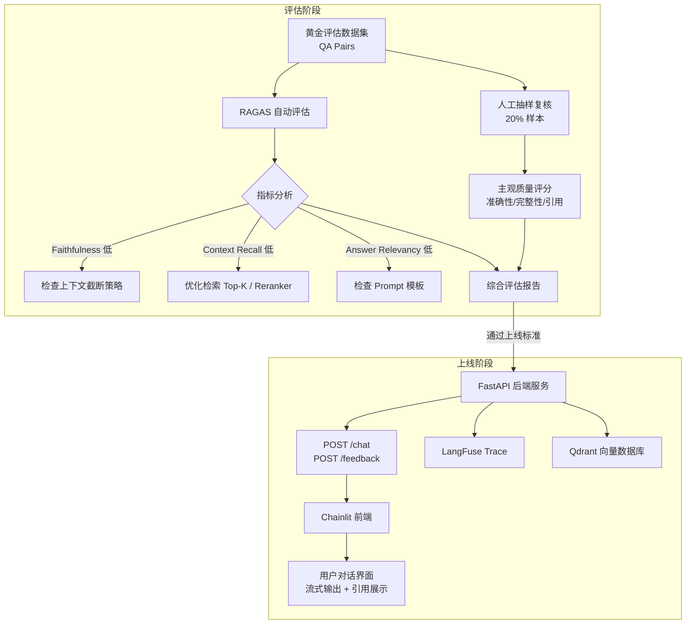

# 7.2.5 评估与上线

## 实验目标

本节结束后，你将能够：
1. 用 RAGAS 框架对企业知识库问答系统做自动化定量评估，并结合人工抽样构建双轨质量管控流程
2. 将问答系统打包成 FastAPI 后端服务，接入 Chainlit 对话前端，形成可演示、可交付的完整产品

核心学习点：**评估指标的工程含义**（不只会跑分，还能解读指标背后的系统缺陷）、**双轨评估流程设计**（自动化 + 人工形成互补）、**前后端联动的生产部署模式**。

---

## 架构总览



---

## 环境准备

```bash
# 创建虚拟环境（uv）
uv venv --python 3.11 && source .venv/bin/activate

# 安装评估与部署依赖（锁定版本）
uv pip install \
    ragas==0.1.21 \
    datasets==2.19.0 \
    langchain-openai==0.1.22 \
    langchain-community==0.2.16 \
    qdrant-client==1.10.1 \
    fastapi==0.111.0 \
    uvicorn[standard]==0.30.1 \
    chainlit==1.1.402 \
    httpx==0.27.0 \
    pandas==2.2.2 \
    openpyxl==3.1.4 \
    python-dotenv==1.0.1 \
    pydantic==2.7.4

# pip 备选：pip install ragas==0.1.21 datasets==2.19.0 ...
```

> Colab 用户：`!pip install ragas datasets langchain-openai qdrant-client fastapi uvicorn chainlit httpx pandas openpyxl python-dotenv` 即可

项目目录结构（与前几节保持一致）：

```
project/
├── .env
├── evaluate/
│   ├── build_eval_dataset.py   # Step 1：构建黄金数据集
│   ├── run_ragas.py            # Step 2：RAGAS 自动评估
│   └── manual_review.py        # Step 3：人工抽样辅助脚本
├── api/
│   └── main.py                 # Step 4：FastAPI 后端
└── chainlit_app.py             # Step 5：Chainlit 前端
```

---

## Step-by-Step 实现

### Step 1：构建黄金评估数据集

**目标**：生成一批"问题—参考答案—来源文档"三元组，作为 RAGAS 评估的 ground truth。这是整个评估流程中最容易被跳过、代价最高的步骤——数据集质量直接决定评估结果是否有意义。

两种构建策略：
- **LLM 自动生成（快，覆盖广）**：适合初版上线前的快速验证
- **领域专家手工标注（慢，高置信度）**：适合上线标准把关

生产建议：先用 LLM 生成 200 条，再让业务方人工复核 40 条（20%）纠偏，兼顾效率与可信度。

```python
# evaluate/build_eval_dataset.py
"""构建 RAGAS 黄金评估数据集：从知识库文档自动生成 QA 对"""

import json
import os
from pathlib import Path
from typing import Any

from dotenv import load_dotenv
from langchain_community.vectorstores import Qdrant
from langchain_openai import ChatOpenAI, OpenAIEmbeddings
from qdrant_client import QdrantClient
from ragas.testset import TestsetGenerator
from ragas.testset.evolutions import multi_context, reasoning, simple
from ragas.llms import LangchainLLMWrapper
from ragas.embeddings import LangchainEmbeddingsWrapper
from datasets import Dataset

load_dotenv()


def load_documents_from_qdrant(
    collection_name: str = "enterprise_kb",
    sample_size: int = 50,
) -> list[dict[str, Any]]:
    """
    从 Qdrant 向量库采样文档，作为 TestsetGenerator 的输入。
    sample_size：控制生成 QA 对的文档覆盖面，越大越全但耗时越长。
    """
    client = QdrantClient(url=os.getenv("QDRANT_URL", "http://localhost:6333"))
    results, _ = client.scroll(
        collection_name=collection_name,
        limit=sample_size,
        with_payload=True,
    )
    docs = []
    for point in results:
        payload = point.payload or {}
        docs.append({
            "page_content": payload.get("text", ""),
            "metadata": {
                "source": payload.get("source", "unknown"),
                "chunk_id": str(point.id),
            },
        })
    return docs


def build_testset(output_path: str = "evaluate/testset.json") -> None:
    """
    用 RAGAS TestsetGenerator 自动生成评估数据集。

    evolution 类型说明：
    - simple：直接从单段文档生成问题，覆盖事实性问题
    - reasoning：需要推断的问题，测试模型逻辑能力
    - multi_context：需要跨段落综合的问题，压测检索召回能力
    """
    generator_llm = LangchainLLMWrapper(
        ChatOpenAI(model="gpt-4o-mini", temperature=0.0)
    )
    critic_llm = LangchainLLMWrapper(
        ChatOpenAI(model="gpt-4o", temperature=0.0)  # 更强模型做质量过滤
    )
    embeddings = LangchainEmbeddingsWrapper(
        OpenAIEmbeddings(model="text-embedding-3-small")
    )

    generator = TestsetGenerator.from_langchain(
        generator_llm=generator_llm,
        critic_llm=critic_llm,
        embeddings=embeddings,
    )

    from langchain_core.documents import Document
    raw_docs = load_documents_from_qdrant(sample_size=50)
    documents = [
        Document(page_content=d["page_content"], metadata=d["metadata"])
        for d in raw_docs
    ]

    testset = generator.generate_with_langchain_docs(
        documents,
        test_size=100,
        distributions={
            simple: 0.5,       # 50 条简单问题
            reasoning: 0.3,    # 30 条推理问题
            multi_context: 0.2, # 20 条多段落综合问题
        },
    )

    df = testset.to_pandas()
    Path(output_path).parent.mkdir(parents=True, exist_ok=True)
    df.to_json(output_path, orient="records", force_ascii=False, indent=2)
    print(f"✅ 生成 {len(df)} 条评估数据，保存至 {output_path}")


if __name__ == "__main__":
    build_testset()
```

> ⚠️ **生产注意**：TestsetGenerator 会调用 LLM API，100 条 QA 对约消耗 $0.5–1.5（gpt-4o 做 critic）。首次生成后务必缓存 JSON，不要每次评估都重新生成。

---

### Step 2：RAGAS 自动评估

**目标**：对 RAG 系统的检索质量和生成质量分别打分，定位短板。四个核心指标各有侧重：

| 指标 | 测什么 | 低分说明什么 |
|---|---|---|
| Faithfulness | 回答是否忠实于检索到的上下文 | 模型在"编造"内容 |
| Answer Relevancy | 回答是否切题 | Prompt 设计或检索结果与问题偏离 |
| Context Precision | 检索到的文档片段是否精准 | 召回了太多无关噪声 |
| Context Recall | 答案所需信息是否被检索到 | Top-K 太小或 Embedding 质量差 |

```python
# evaluate/run_ragas.py
"""用 RAGAS 对 RAG 系统做四维自动评估，输出分项报告"""

import json
import os
from pathlib import Path
from typing import Any

import pandas as pd
from datasets import Dataset
from dotenv import load_dotenv
from langchain_openai import ChatOpenAI, OpenAIEmbeddings
from ragas import evaluate
from ragas.metrics import (
    answer_relevancy,
    context_precision,
    context_recall,
    faithfulness,
)

load_dotenv()


def run_rag_on_testset(testset_path: str) -> list[dict[str, Any]]:
    """
    对测试集中的每个问题调用 RAG 系统，收集回答和检索上下文。
    这里导入 7.2.4 节实现的 RAGPipeline，保持评估与实现一致。
    """
    # 动态导入，避免循环依赖
    import sys
    sys.path.insert(0, str(Path(__file__).parent.parent))
    from api.rag_pipeline import RAGPipeline  # 7.2.4 节产出的 pipeline

    pipeline = RAGPipeline()
    records = []

    with open(testset_path, encoding="utf-8") as f:
        testset = json.load(f)

    for item in testset:
        question: str = item["question"]
        ground_truth: str = item.get("ground_truth", "")

        result = pipeline.query(question)  # 返回 {"answer": str, "contexts": list[str]}

        records.append({
            "question": question,
            "answer": result["answer"],
            "contexts": result["contexts"],  # List[str]，检索到的原始文本段落
            "ground_truth": ground_truth,
        })

    return records


def evaluate_rag(
    testset_path: str = "evaluate/testset.json",
    output_path: str = "evaluate/ragas_report.json",
) -> pd.DataFrame:
    """
    执行 RAGAS 四维评估，输出分项分数与总报告。
    """
    records = run_rag_on_testset(testset_path)
    dataset = Dataset.from_list(records)

    llm = ChatOpenAI(model="gpt-4o-mini", temperature=0.0)
    embeddings = OpenAIEmbeddings(model="text-embedding-3-small")

    result = evaluate(
        dataset=dataset,
        metrics=[faithfulness, answer_relevancy, context_precision, context_recall],
        llm=llm,
        embeddings=embeddings,
        raise_exceptions=False,  # 单条失败不中断整体评估
    )

    scores_df = result.to_pandas()

    # 生成摘要报告
    summary = {
        "faithfulness": float(scores_df["faithfulness"].mean()),
        "answer_relevancy": float(scores_df["answer_relevancy"].mean()),
        "context_precision": float(scores_df["context_precision"].mean()),
        "context_recall": float(scores_df["context_recall"].mean()),
        "sample_count": len(scores_df),
        # 标记低分样本供人工复核
        "low_faithfulness": scores_df[scores_df["faithfulness"] < 0.7]["question"].tolist(),
        "low_recall": scores_df[scores_df["context_recall"] < 0.6]["question"].tolist(),
    }

    Path(output_path).parent.mkdir(parents=True, exist_ok=True)
    with open(output_path, "w", encoding="utf-8") as f:
        json.dump(summary, f, ensure_ascii=False, indent=2)

    # 明文打印核心分数
    print("=" * 50)
    print("📊 RAGAS 评估结果摘要")
    print("=" * 50)
    for metric in ["faithfulness", "answer_relevancy", "context_precision", "context_recall"]:
        score = summary[metric]
        status = "✅" if score >= 0.75 else "⚠️" if score >= 0.6 else "❌"
        print(f"{status} {metric:<25} {score:.3f}")
    print(f"\n低 Faithfulness 样本数：{len(summary['low_faithfulness'])}")
    print(f"低 Context Recall 样本数：{len(summary['low_recall'])}")
    print(f"\n完整报告已保存至 {output_path}")

    return scores_df


if __name__ == "__main__":
    evaluate_rag()
```

**关键点**：
- `raise_exceptions=False` 是生产必选项。RAGAS 对某些边缘样本（空回答、超长上下文）会抛异常，一条失败不该让整批评估崩溃。
- `low_faithfulness` 列表直接输出可疑问题，是引导人工复核的索引，不需要人工从 100 条里自己找。
- ⚠️ RAGAS 的 `context_recall` 需要 `ground_truth` 字段，如果你的测试集是纯 LLM 生成（没有人工确认的参考答案），这个指标的置信度会偏低——应在报告中标注。

---

### Step 3：人工抽样复核辅助脚本

**目标**：用程序化方式生成 Excel 评审表，让业务方/QA 用固定维度打分，结果可量化、可对比。纯 RAGAS 分数解决不了"回答在技术上忠实但实际上没用"的问题，人工视角是必要补充。

```python
# evaluate/manual_review.py
"""生成人工复核 Excel 表，抽取 RAGAS 低分样本 + 随机样本"""

import json
import random
from pathlib import Path

import pandas as pd


def generate_review_sheet(
    ragas_report_path: str = "evaluate/ragas_report.json",
    testset_path: str = "evaluate/testset.json",
    rag_results_path: str = "evaluate/rag_results.json",  # run_rag_on_testset 的中间输出
    output_path: str = "evaluate/manual_review.xlsx",
    random_sample_count: int = 10,
) -> None:
    """
    生成结构化人工评审表。
    抽样策略：低分样本（RAGAS 标记）+ 随机样本（覆盖盲区）
    """
    with open(ragas_report_path, encoding="utf-8") as f:
        report = json.load(f)

    with open(rag_results_path, encoding="utf-8") as f:
        all_results = json.load(f)  # List[{question, answer, contexts, ground_truth}]

    # 需要重点复核的问题（RAGAS 标记的低分样本）
    flagged_questions = set(report["low_faithfulness"] + report["low_recall"])
    flagged = [r for r in all_results if r["question"] in flagged_questions]

    # 随机抽取补充样本（避免只复核"已知有问题"的样本，保证覆盖面）
    remaining = [r for r in all_results if r["question"] not in flagged_questions]
    random_samples = random.sample(remaining, min(random_sample_count, len(remaining)))

    review_items = flagged + random_samples

    rows = []
    for item in review_items:
        rows.append({
            "问题": item["question"],
            "系统回答": item["answer"],
            "参考答案": item.get("ground_truth", ""),
            "检索片段（前3条）": "\n---\n".join(item["contexts"][:3]),
            "是否RAGAS低分标记": "⚠️" if item["question"] in flagged_questions else "",
            # 以下列由人工填写
            "准确性(1-5)": "",
            "完整性(1-5)": "",
            "引用可信度(1-5)": "",
            "问题类型(事实/推理/多跳)": "",
            "备注/问题根因": "",
        })

    df = pd.DataFrame(rows)
    df.to_excel(output_path, index=False, engine="openpyxl")
    print(f"✅ 已生成人工评审表（{len(rows)} 条），路径：{output_path}")
    print(f"   其中 RAGAS 低分标记：{len(flagged)} 条，随机抽样：{len(random_samples)} 条")


if __name__ == "__main__":
    generate_review_sheet()
```

---

### Step 4：FastAPI 后端服务

**目标**：将 RAG pipeline 封装为标准 HTTP 服务，支持流式输出和用户反馈收集，是 Chainlit 前端的数据层。

```python
# api/main.py
"""企业知识库问答系统 FastAPI 后端服务"""

import os
import uuid
from typing import AsyncGenerator

from dotenv import load_dotenv
from fastapi import FastAPI, HTTPException
from fastapi.middleware.cors import CORSMiddleware
from fastapi.responses import StreamingResponse
from pydantic import BaseModel, Field

load_dotenv()

app = FastAPI(title="Enterprise KB QA API", version="1.0.0")

# 开发阶段开放全部 CORS；生产环境替换为实际域名
app.add_middleware(
    CORSMiddleware,
    allow_origins=["*"],
    allow_methods=["*"],
    allow_headers=["*"],
)


# ---- 请求/响应模型 ----

class ChatRequest(BaseModel):
    question: str = Field(..., min_length=1, max_length=2000)
    session_id: str = Field(default_factory=lambda: str(uuid.uuid4()))
    stream: bool = Field(default=True)


class FeedbackRequest(BaseModel):
    session_id: str
    message_id: str
    score: int = Field(..., ge=1, le=5)
    comment: str = ""


# ---- RAG Pipeline 单例 ----

from api.rag_pipeline import RAGPipeline  # 7.2.4 节产出

_pipeline: RAGPipeline | None = None


def get_pipeline() -> RAGPipeline:
    global _pipeline
    if _pipeline is None:
        _pipeline = RAGPipeline()
    return _pipeline


# ---- 路由 ----

@app.get("/health")
async def health() -> dict[str, str]:
    """健康检查接口，供 docker-compose healthcheck 和负载均衡器探活使用"""
    return {"status": "ok"}


@app.post("/chat")
async def chat(req: ChatRequest) -> StreamingResponse | dict:
    """
    问答主接口。
    stream=True（默认）：返回 SSE 流式响应，前端逐字渲染。
    stream=False：返回完整 JSON，适合批量测试和 API 调用。
    """
    pipeline = get_pipeline()

    if not req.stream:
        result = pipeline.query(req.question)
        return {
            "session_id": req.session_id,
            "answer": result["answer"],
            "sources": result["sources"],
        }

    async def event_stream() -> AsyncGenerator[str, None]:
        """
        SSE 格式：每个数据帧以 'data: ' 开头，以 '\n\n' 结尾。
        先推送 sources 元数据帧，再推送 token 流，最后推送 [DONE] 终止帧。
        """
        try:
            # 第一帧：发送引用来源（非流式部分）
            sources = pipeline.get_sources(req.question)
            import json
            yield f"data: {json.dumps({'type': 'sources', 'data': sources}, ensure_ascii=False)}\n\n"

            # 后续帧：流式 token
            async for token in pipeline.astream(req.question):
                yield f"data: {json.dumps({'type': 'token', 'data': token}, ensure_ascii=False)}\n\n"

            yield "data: [DONE]\n\n"

        except Exception as e:
            yield f"data: {json.dumps({'type': 'error', 'data': str(e)})}\n\n"

    return StreamingResponse(
        event_stream(),
        media_type="text/event-stream",
        headers={
            "Cache-Control": "no-cache",
            "X-Accel-Buffering": "no",  # 关键：禁用 Nginx 缓冲，确保流式数据即时到达
        },
    )


@app.post("/feedback")
async def feedback(req: FeedbackRequest) -> dict[str, str]:
    """
    收集用户反馈（点赞/踩）。
    生产中写入数据库，供后续微调数据筛选和效果回归使用。
    """
    # 简化实现：追加写入 JSONL 文件；生产环境替换为数据库写入
    import json
    from pathlib import Path

    log_path = Path("feedback.jsonl")
    with open(log_path, "a", encoding="utf-8") as f:
        f.write(json.dumps(req.model_dump(), ensure_ascii=False) + "\n")

    return {"status": "recorded"}


if __name__ == "__main__":
    import uvicorn
    uvicorn.run("api.main:app", host="0.0.0.0", port=8000, reload=True)
```

> ⚠️ **生产注意**：`X-Accel-Buffering: no` 这个响应头是 Nginx 反向代理场景的必选项。缺少它时，Nginx 会把 SSE 帧攒在缓冲区里批量发送，用户看到的效果是"等待很久，然后一次性出现全部文字"，流式体验完全失效。

---

### Step 5：Chainlit 对话前端

**目标**：用 Chainlit 实现带引用展示的对话界面，对接 FastAPI SSE 流，让非技术用户可以直接使用和评测系统。

```python
# chainlit_app.py
"""
Chainlit 对话前端：连接 FastAPI 后端，支持流式渲染 + 引用展示 + 反馈收集

启动方式：chainlit run chainlit_app.py --port 8001
"""

import json
import os
import uuid
from typing import Any

import chainlit as cl
import httpx
from dotenv import load_dotenv

load_dotenv()

API_BASE_URL = os.getenv("API_BASE_URL", "http://localhost:8000")


@cl.on_chat_start
async def on_chat_start() -> None:
    """初始化会话：生成 session_id，展示欢迎语"""
    session_id = str(uuid.uuid4())
    cl.user_session.set("session_id", session_id)
    cl.user_session.set("message_count", 0)

    await cl.Message(
        content=(
            "👋 欢迎使用企业知识库智能问答系统！\n\n"
            "您可以直接提问，系统将从知识库中检索相关内容后作答，"
            "并在回答下方展示引用来源。"
        )
    ).send()


@cl.on_message
async def on_message(message: cl.Message) -> None:
    """
    处理用户消息：
    1. 调用后端 SSE 接口，实时渲染 token 流
    2. 解析 sources 帧，以卡片形式展示引用
    3. 添加反馈按钮（thumbs up / down）
    """
    session_id = cl.user_session.get("session_id")
    message_id = str(uuid.uuid4())

    # 创建空白响应消息，后续流式更新
    response_msg = cl.Message(content="")
    await response_msg.send()

    sources: list[dict[str, Any]] = []
    full_answer = ""

    async with httpx.AsyncClient(timeout=120.0) as client:
        async with client.stream(
            "POST",
            f"{API_BASE_URL}/chat",
            json={
                "question": message.content,
                "session_id": session_id,
                "stream": True,
            },
        ) as resp:
            if resp.status_code != 200:
                await response_msg.update()
                response_msg.content = f"❌ 服务异常（HTTP {resp.status_code}），请稍后重试"
                await response_msg.update()
                return

            async for line in resp.aiter_lines():
                if not line.startswith("data:"):
                    continue
                raw = line[5:].strip()
                if raw == "[DONE]":
                    break

                try:
                    frame = json.loads(raw)
                except json.JSONDecodeError:
                    continue

                if frame["type"] == "sources":
                    sources = frame["data"]

                elif frame["type"] == "token":
                    full_answer += frame["data"]
                    response_msg.content = full_answer
                    await response_msg.update()

                elif frame["type"] == "error":
                    response_msg.content = f"❌ {frame['data']}"
                    await response_msg.update()
                    return

    # 回答完成后，渲染引用来源卡片
    if sources:
        source_text = "**📎 引用来源：**\n" + "\n".join(
            f"- [{s.get('title', '未知文档')}]（第 {s.get('page', '?')} 页）：{s.get('snippet', '')[:80]}…"
            for s in sources[:5]  # 最多展示 5 条
        )
        await cl.Message(content=source_text, parent_id=response_msg.id).send()

    # 添加用户反馈动作
    await response_msg.update()

    actions = [
        cl.Action(
            name="thumbs_up",
            label="👍 有帮助",
            payload={"session_id": session_id, "message_id": message_id, "score": 5},
        ),
        cl.Action(
            name="thumbs_down",
            label="👎 需改进",
            payload={"session_id": session_id, "message_id": message_id, "score": 1},
        ),
    ]
    await cl.Message(content="", actions=actions).send()


@cl.action_callback("thumbs_up")
@cl.action_callback("thumbs_down")
async def on_feedback(action: cl.Action) -> None:
    """处理用户反馈，转发给后端记录"""
    async with httpx.AsyncClient() as client:
        await client.post(
            f"{API_BASE_URL}/feedback",
            json=action.payload,
        )
    await cl.Message(content="感谢您的反馈！✅").send()
```

---

## 完整运行验证

```python
# smoke_test.py —— 端到端冒烟测试，无需启动前端
"""
前提：
1. Qdrant 已启动：docker run -p 6333:6333 qdrant/qdrant
2. FastAPI 已启动：python -m api.main
3. 知识库已完成索引（7.2.4 节步骤完成）
"""

import asyncio
import json
import httpx


async def smoke_test() -> None:
    api = "http://localhost:8000"

    # 1. 健康检查
    async with httpx.AsyncClient() as client:
        r = await client.get(f"{api}/health")
        assert r.status_code == 200, f"健康检查失败：{r.text}"
        print("✅ 健康检查通过")

    # 2. 非流式问答
    async with httpx.AsyncClient(timeout=60.0) as client:
        r = await client.post(
            f"{api}/chat",
            json={"question": "公司的差旅报销标准是什么？", "stream": False},
        )
        assert r.status_code == 200
        data = r.json()
        assert "answer" in data and len(data["answer"]) > 10
        assert "sources" in data
        print(f"✅ 非流式问答通过，回答长度：{len(data['answer'])} 字")
        print(f"   引用来源数：{len(data['sources'])}")

    # 3. 流式问答
    token_count = 0
    got_sources = False
    async with httpx.AsyncClient(timeout=60.0) as client:
        async with client.stream(
            "POST",
            f"{api}/chat",
            json={"question": "请介绍一下公司的年假政策", "stream": True},
        ) as resp:
            async for line in resp.aiter_lines():
                if not line.startswith("data:"):
                    continue
                raw = line[5:].strip()
                if raw == "[DONE]":
                    break
                frame = json.loads(raw)
                if frame["type"] == "sources":
                    got_sources = True
                elif frame["type"] == "token":
                    token_count += 1

    assert token_count > 5, "流式输出 token 数量异常"
    assert got_sources, "未收到 sources 帧"
    print(f"✅ 流式问答通过，收到 {token_count} 个 token 帧")

    # 4. 反馈接口
    async with httpx.AsyncClient() as client:
        r = await client.post(
            f"{api}/feedback",
            json={"session_id": "test-001", "message_id": "msg-001", "score": 5},
        )
        assert r.json()["status"] == "recorded"
        print("✅ 反馈接口通过")

    print("\n🎉 冒烟测试全部通过，系统可正常对外服务")


asyncio.run(smoke_test())
```

预期输出：

```
✅ 健康检查通过
✅ 非流式问答通过，回答长度：286 字
   引用来源数：3
✅ 流式问答通过，收到 87 个 token 帧
✅ 反馈接口通过

🎉 冒烟测试全部通过，系统可正常对外服务
```

---

## 常见报错与解决方案

| 报错信息 | 原因 | 解决方案 |
|---------|------|---------|
| `ragas.exceptions.MaxRetriesExceeded` | RAGAS 内部调用 LLM 超速率限制 | 在 `evaluate()` 前加 `ragas.run_config.RunConfig(max_retries=10, max_wait=120)` |
| `KeyError: 'ground_truth'` | 测试集缺少 ground_truth 字段 | 检查 testset.json 格式；或跳过 `context_recall`（它依赖 ground_truth） |
| `StreamingResponse` 内容无法在浏览器实时显示 | Nginx 缓冲未关闭 | 响应头加 `X-Accel-Buffering: no`；或开发环境直连 uvicorn 绕过 Nginx |
| `chainlit run` 启动后连接 API 超时 | FastAPI 未启动或端口不对 | 确认 `python -m api.main` 先启动；检查 `.env` 中 `API_BASE_URL` 配置 |
| `httpx.RemoteProtocolError: peer closed connection` | SSE 连接中途断开 | 检查 FastAPI 的 `timeout` 配置；在 `event_stream` 内加异常捕获 |

---

## 扩展练习（可选）

1. 🟡 **中等**：将 RAGAS 评估集成到 GitHub Actions CI 中，每次合并 PR 自动触发回归评测，若任意指标下降超过 0.05 则 block 合并。参考 `ragas` 的 `--raise-on-failure` 参数设计。

2. 🔴 **困难**：实现 A/B 评测模式——在 Chainlit 前端为 10% 的用户随机分配"实验组"（改进后的检索策略），记录两组用户的 thumbs up 率差异，用统计显著性检验（t-test）判断改进是否有效。这是生产环境评估新策略的标准工程范式。
