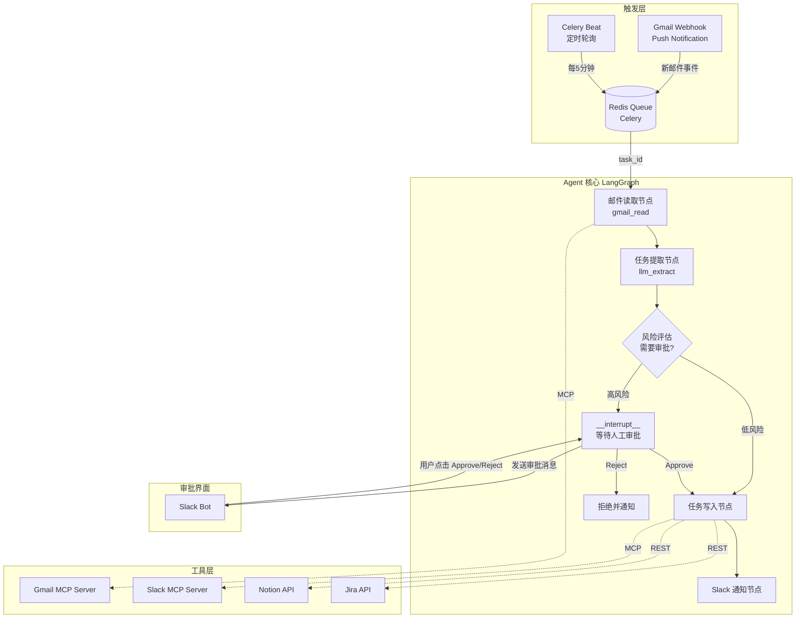

# 7.4 项目四：自动化工作流 Agent

---

## 实验目标

本节结束后，你将能够搭建一个从**邮件解析到任务自动写入再到 Slack 通知**的端到端自动化工作流 Agent，并实现在高风险操作前插入人工审批节点。核心学习点共三个：

1. **MCP 工具链集成**：理解如何将 Gmail、Slack、Notion、Jira 通过 MCP Server 或 REST API 封装为 Agent 可调用的工具，并掌握工具注册与错误处理的生产级范式
2. **两种触发模式的工程选择**：Webhook 事件驱动 vs Celery 定时轮询，以及两者与异步 Agent 调度的结合方式
3. **LangGraph 中断点（Interrupt）机制**：在 Agent 执行链路中插入人工审批节点，实现暂停-等待-恢复的状态持久化流程

---

## 架构总览



整体流程：邮件到达 → Celery 任务入队 → LangGraph Agent 读取邮件并用 LLM 提取任务 → 风险评估后决定是否中断等待审批 → 审批通过后写入 Notion/Jira → Slack 通知相关人员。

---

## 环境准备

```bash
# 创建虚拟环境（uv）
uv venv --python 3.11 && source .venv/bin/activate

# 安装核心依赖
uv pip install -r requirements.txt
```

requirements.txt 内容：

```text
langgraph>=0.2.0
langgraph-checkpoint-redis>=0.3.0
langchain-anthropic>=0.3.0
langchain-core>=0.3.28
celery>=5.4.0
redis>=5.2.0
fastapi>=0.115.6
uvicorn>=0.32.1
httpx>=0.27.2
pydantic>=2.10.3
pydantic-settings>=2.7.0
google-auth>=2.37.0
google-auth-oauthlib>=1.2.1
google-api-python-client>=2.156.0
slack-sdk>=3.33.4
python-dotenv>=1.0.1
litellm>=1.40.0
pytest>=7.0.0
```

Redis 本地启动（Docker 最简单）：

```bash
docker run -d --name redis-workflow -p 6379:6379 redis:7-alpine
```

`.env` 文件配置：

```ini
ANTHROPIC_API_KEY=sk-ant-...

GMAIL_CLIENT_ID=...
GMAIL_CLIENT_SECRET=...
GMAIL_REFRESH_TOKEN=...
GMAIL_USER_EMAIL=your@gmail.com

SLACK_BOT_TOKEN=xoxb-...
SLACK_SIGNING_SECRET=...
SLACK_APPROVAL_CHANNEL=C_CHANNEL_ID
SLACK_NOTIFY_CHANNEL=C_NOTIFY_ID

NOTION_API_KEY=secret_...
NOTION_DATABASE_ID=...

JIRA_BASE_URL=https://yourorg.atlassian.net
JIRA_EMAIL=you@company.com
JIRA_API_TOKEN=...
JIRA_PROJECT_KEY=PROJ

REDIS_URL=redis://localhost:6379/0
```

---

## Step-by-Step 实现

### Step 0：模型配置（core_config.py + main.py）

**目标**：通过 `core_config.py` 中的 `MODEL_REGISTRY` 统一管理大模型配置，支持在 DeepSeek-V3、Qwen-Max、Claude-Max 之间切换。`main.py` 作为 FastAPI 服务的启动入口。

```python
# core_config.py
"""全局配置：模型注册表与定价信息"""
import os
from typing import TypedDict


class ModelConfig(TypedDict, total=False):
    litellm_id: str          # LiteLLM 识别的模型字符串（含 provider 前缀）
    chat_model_id: str       # OpenAI SDK 直连时使用的模型名（无前缀）
    price_in: float          # 每 1K input tokens 价格（美元）
    price_out: float         # 每 1K output tokens 价格（美元）
    max_tokens_limit: int    # 模型支持的最大 max_tokens
    api_key_env: str | None  # API Key 环境变量名
    base_url: str | None     # API 基础 URL（None 表示使用默认）


# 注册表：key 是界面显示名，value 是调用配置
MODEL_REGISTRY: dict[str, ModelConfig] = {
    "DeepSeek-V3": {
        "litellm_id": "deepseek/deepseek-chat",
        "chat_model_id": "deepseek-v4-flash",
        "price_in": 0.00027,
        "price_out": 0.0011,
        "max_tokens_limit": 4096,
        "api_key_env": "DEEPSEEK_API_KEY",
        "base_url": "https://api.deepseek.com/v1",
    },
    "Qwen-Max": {
        "litellm_id": "qwen/qwen-plus",
        "chat_model_id": "qwen-plus",
        "price_in": 0.001,
        "price_out": 0.004,
        "max_tokens_limit": 4096,
        "api_key_env": "DASHSCOPE_API_KEY",
        "base_url": "https://dashscope.aliyuncs.com/compatible-mode/v1",
    },
    "Claude-Max": {
        "litellm_id": "claude-3-5-sonnet-latest",
        "chat_model_id": "claude-3-5-sonnet-latest",
        "price_in": 0.003,
        "price_out": 0.015,
        "max_tokens_limit": 8192,
        "api_key_env": "ANTHROPIC_API_KEY",
        "base_url": None,
    },
}

# ✅ 当前激活模型 key — 修改此处全局生效，必须是 MODEL_REGISTRY 中的 key
ACTIVE_MODEL_KEY: str = "Claude-Max"


def get_litellm_id(model_key: str | None = None) -> str:
    """获取指定模型的 LiteLLM SDK ID（含 provider 前缀）"""
    key = model_key or ACTIVE_MODEL_KEY
    return MODEL_REGISTRY[key]["litellm_id"]


def get_api_key(model_key: str | None = None) -> str | None:
    """从环境变量读取指定模型的 API Key"""
    key = model_key or ACTIVE_MODEL_KEY
    env_var = MODEL_REGISTRY[key]["api_key_env"]
    return os.environ.get(env_var) if env_var else None
```

```python
# main.py
"""主入口：启动 Workflow Agent FastAPI 服务"""
import uvicorn
from api.app import app

if __name__ == "__main__":
    uvicorn.run(app, host="0.0.0.0", port=8000)
```

---

### Step 1：核心数据模型定义

**目标**：用 Pydantic 定义贯穿整个 Agent 的数据结构，统一各工具之间的数据契约，避免字典传递导致的类型混乱。

```python
# models.py
from __future__ import annotations
from enum import Enum
from typing import Optional
from pydantic import BaseModel, Field
from datetime import datetime


class RiskLevel(str, Enum):
    LOW = "low"
    HIGH = "high"


class ExtractedTask(BaseModel):
    title: str = Field(description="任务标题，50字以内")
    description: str = Field(description="任务详细描述")
    assignee: Optional[str] = Field(None, description="被分配人，邮件地址或姓名")
    due_date: Optional[str] = Field(None, description="截止日期，格式 YYYY-MM-DD")
    priority: str = Field(default="medium", description="优先级：low/medium/high/urgent")
    risk_level: RiskLevel = Field(description="操作风险等级")
    risk_reason: str = Field(description="风险等级判断依据")


class EmailMessage(BaseModel):
    message_id: str
    subject: str
    sender: str
    body: str
    received_at: datetime


class WorkflowState(BaseModel):
    email_id: str
    email: Optional[EmailMessage] = None
    extracted_task: Optional[ExtractedTask] = None
    approval_message_ts: Optional[str] = None
    approved: Optional[bool] = None
    rejection_reason: Optional[str] = None
    notion_page_id: Optional[str] = None
    jira_issue_key: Optional[str] = None
    error: Optional[str] = None
```

**关键点**：
- `RiskLevel` 是审批分流的核心判断依据，由 LLM 在任务提取时同步输出，避免二次调用
- `approval_message_ts` 保存 Slack 消息时间戳，用于审批后更新原消息状态（而非发新消息），减少频道噪音

---

### Step 2：Gmail 工具封装

**目标**：封装 Gmail API 为 LangChain Tool，实现读取未处理邮件和标记已读两个核心操作。Gmail 使用 OAuth2，需提前获取 Refresh Token。

> ⚠️ 生产注意：OAuth2 Refresh Token 获取步骤：进入 Google Cloud Console → 创建 OAuth2 凭证（类型选"桌面应用"）→ 使用 `google-auth-oauthlib` 完成首次授权流程获取 Refresh Token。Token 存入 `.env`，后续代码自动刷新 Access Token，无需手动维护。

```python
# tools/gmail_tool.py
from __future__ import annotations
import base64
from datetime import datetime
from typing import Optional
import json

from google.auth.transport.requests import Request
from google.oauth2.credentials import Credentials
from googleapiclient.discovery import build
from langchain_core.tools import tool

from models import EmailMessage
from config import settings


def _get_gmail_service():
    creds = Credentials(
        token=None,
        refresh_token=settings.gmail_refresh_token,
        client_id=settings.gmail_client_id,
        client_secret=settings.gmail_client_secret,
        token_uri="https://oauth2.googleapis.com/token",
        scopes=["https://www.googleapis.com/auth/gmail.modify"],
    )
    creds.refresh(Request())
    return build("gmail", "v1", credentials=creds)


def _decode_body(payload: dict) -> str:
    if payload.get("body", {}).get("data"):
        return base64.urlsafe_b64decode(payload["body"]["data"]).decode("utf-8", errors="replace")
    for part in payload.get("parts", []):
        if part.get("mimeType") == "text/plain":
            data = part.get("body", {}).get("data", "")
            if data:
                return base64.urlsafe_b64decode(data).decode("utf-8", errors="replace")
    return ""


@tool
def gmail_read_email(message_id: str) -> str:
    """读取指定邮件的内容并返回 JSON 格式的 EmailMessage"""
    service = _get_gmail_service()
    msg = service.users().messages().get(
        userId="me",
        id=message_id,
        format="full"
    ).execute()

    headers = {h["name"]: h["value"] for h in msg["payload"]["headers"]}
    body = _decode_body(msg["payload"])
    received_at = datetime.fromtimestamp(int(msg["internalDate"]) / 1000).isoformat()

    email = EmailMessage(
        message_id=message_id,
        subject=headers.get("Subject", "(无主题)"),
        sender=headers.get("From", "未知发件人"),
        body=body[:4000],
        received_at=received_at,
    )
    return email.model_dump_json()


@tool
def gmail_mark_processed(message_id: str) -> str:
    """将指定邮件标记为已处理（添加 WORKFLOW_PROCESSED 标签并移除 UNREAD）"""
    service = _get_gmail_service()
    labels = service.users().labels().list(userId="me").execute().get("labels", [])
    label_id = next(
        (l["id"] for l in labels if l["name"] == "WORKFLOW_PROCESSED"),
        None
    )
    if not label_id:
        new_label = service.users().labels().create(
            userId="me",
            body={"name": "WORKFLOW_PROCESSED", "labelListVisibility": "labelHide"}
        ).execute()
        label_id = new_label["id"]

    service.users().messages().modify(
        userId="me",
        id=message_id,
        body={
            "addLabelIds": [label_id],
            "removeLabelIds": ["UNREAD"],
        }
    ).execute()
    return f"邮件 {message_id} 已标记为已处理"
```

---

### Step 3：Slack 工具封装（通知 + 审批消息）

**目标**：封装两类 Slack 操作——普通通知和带交互按钮的审批消息。审批消息使用 Slack Block Kit 的 `actions` 组件，而非纯文本，这样用户可以直接点击按钮而无需手动回复。

```python
# tools/slack_tool.py
from __future__ import annotations
import json
from typing import Optional
from slack_sdk import WebClient
from slack_sdk.errors import SlackApiError
from langchain_core.tools import tool

from config import settings

_client = WebClient(token=settings.slack_bot_token)


@tool
def slack_send_notification(message: str, channel: Optional[str] = None) -> str:
    """向指定 Slack 频道发送通知消息"""
    target = channel or settings.slack_notify_channel
    try:
        response = _client.chat_postMessage(channel=target, text=message)
        return response["ts"]
    except SlackApiError as e:
        raise RuntimeError(f"Slack 通知失败: {e.response['error']}") from e


def send_approval_request(
    task_title: str,
    task_description: str,
    risk_reason: str,
    email_sender: str,
    workflow_run_id: str,
) -> str:
    blocks = [
        {
            "type": "header",
            "text": {"type": "plain_text", "text": "🔔 需要您的审批"},
        },
        {
            "type": "section",
            "fields": [
                {"type": "mrkdwn", "text": f"*任务标题*\n{task_title}"},
                {"type": "mrkdwn", "text": f"*发件人*\n{email_sender}"},
            ],
        },
        {
            "type": "section",
            "text": {"type": "mrkdwn", "text": f"*任务描述*\n{task_description}"},
        },
        {
            "type": "section",
            "text": {
                "type": "mrkdwn",
                "text": f"⚠️ *高风险原因*：{risk_reason}",
            },
        },
        {
            "type": "actions",
            "elements": [
                {
                    "type": "button",
                    "text": {"type": "plain_text", "text": "✅ Approve"},
                    "style": "primary",
                    "action_id": f"approve_{workflow_run_id}",
                    "value": workflow_run_id,
                },
                {
                    "type": "button",
                    "text": {"type": "plain_text", "text": "❌ Reject"},
                    "style": "danger",
                    "action_id": f"reject_{workflow_run_id}",
                    "value": workflow_run_id,
                },
            ],
        },
    ]

    response = _client.chat_postMessage(
        channel=settings.slack_approval_channel,
        text=f"审批请求：{task_title}",
        blocks=blocks,
    )
    return response["ts"]


def update_approval_message(ts: str, approved: bool, operator: str) -> None:
    result_text = f"✅ 已批准（操作人：{operator}）" if approved else f"❌ 已拒绝（操作人：{operator}）"
    _client.chat_update(
        channel=settings.slack_approval_channel,
        ts=ts,
        text=result_text,
        blocks=[
            {
                "type": "section",
                "text": {"type": "mrkdwn", "text": result_text},
            }
        ],
    )
```

---

### Step 4：Notion / Jira 写入工具封装

**目标**：封装两个任务管理平台的写入接口，供 Agent 根据用户配置选择调用。两者都用 `@tool` 注册，LLM 根据工具描述和当前上下文决定调用哪个。

```python
# tools/task_tool.py
from __future__ import annotations
import json
import httpx
from langchain_core.tools import tool

from config import settings


@tool
def notion_create_task(
    title: str,
    description: str,
    assignee: str = "",
    due_date: str = "",
    priority: str = "medium",
) -> str:
    """在 Notion 数据库中创建一个新任务页面"""
    properties: dict = {
        "Name": {"title": [{"text": {"content": title}}]},
        "Description": {"rich_text": [{"text": {"content": description}}]},
        "Priority": {"select": {"name": priority.capitalize()}},
        "Status": {"select": {"name": "To Do"}},
    }
    if due_date:
        properties["Due Date"] = {"date": {"start": due_date}}
    if assignee:
        properties["Assignee"] = {"rich_text": [{"text": {"content": assignee}}]}

    with httpx.Client() as client:
        response = client.post(
            "https://api.notion.com/v1/pages",
            headers={
                "Authorization": f"Bearer {settings.notion_api_key}",
                "Notion-Version": "2022-06-28",
                "Content-Type": "application/json",
            },
            json={
                "parent": {"database_id": settings.notion_database_id},
                "properties": properties,
            },
            timeout=15,
        )
        response.raise_for_status()
        page_id = response.json()["id"]
        return page_id


@tool
def jira_create_issue(
    title: str,
    description: str,
    assignee: str = "",
    due_date: str = "",
    priority: str = "Medium",
) -> str:
    """在 Jira 项目中创建一个新 Issue"""
    fields: dict = {
        "project": {"key": settings.jira_project_key},
        "summary": title,
        "description": {
            "type": "doc",
            "version": 1,
            "content": [
                {
                    "type": "paragraph",
                    "content": [{"type": "text", "text": description}],
                }
            ],
        },
        "issuetype": {"name": "Task"},
        "priority": {"name": priority.capitalize()},
    }
    if due_date:
        fields["duedate"] = due_date

    with httpx.Client() as client:
        response = client.post(
            f"{settings.jira_base_url}/rest/api/3/issue",
            auth=(settings.jira_email, settings.jira_api_token),
            json={"fields": fields},
            timeout=15,
        )
        response.raise_for_status()
        return response.json()["key"]
```

**关键点**：
- Notion People 属性需要 Notion User ID 而非邮件地址，这是**生产中最常踩的坑**。如果组织规模小，可以维护一个 `email → notion_user_id` 的映射字典；规模大时应通过 Notion User Search API 动态查询
- Jira description 使用 Atlassian Document Format（ADF），不能直接传字符串，否则 API 返回 400

---

### Step 5：LangGraph Agent 主流程

**目标**：用 LangGraph 把上述工具串联成有状态的执行图，核心是 `interrupt` 实现人工审批暂停点。模型配置通过 `core_config` 统一管理，支持切换。

```python
# agent/workflow_graph.py
from __future__ import annotations
import json
from typing import Annotated, Literal

from langchain_anthropic import ChatAnthropic
from langchain_core.messages import HumanMessage, SystemMessage
from langgraph.graph import StateGraph, END
from langgraph.checkpoint.redis import RedisSaver
from langgraph.types import interrupt
from langgraph.config import RunnableConfig

from models import WorkflowState, ExtractedTask, RiskLevel, EmailMessage
from tools.gmail_tool import gmail_read_email, gmail_mark_processed
from tools.slack_tool import slack_send_notification, send_approval_request, update_approval_message
from tools.task_tool import notion_create_task, jira_create_issue
from config import settings
from core_config import get_litellm_id, get_api_key

_api_key = get_api_key() or (settings.anthropic_api_key or "")
# 注意：本项目 Agent 主流程设计为搭配 Claude 使用；若在 core_config 中
# 切换 ACTIVE_MODEL_KEY 为 DeepSeek/Qwen，需同步将 ChatAnthropic 更换为
# ChatOpenAI / LiteLLM 客户端，并相应调整 model 参数。
_llm = ChatAnthropic(
    model=get_litellm_id(),
    api_key=_api_key,
    temperature=0,
)

_extractor = _llm.with_structured_output(ExtractedTask)


def node_read_email(state: WorkflowState) -> dict:
    result = gmail_read_email.invoke({"message_id": state.email_id})
    email_data = json.loads(result)
    return {"email": EmailMessage(**email_data)}


def node_extract_task(state: WorkflowState) -> dict:
    assert state.email is not None

    messages = [
        SystemMessage(content="""你是一个工作流自动化助手。
从邮件中提取任务信息，并判断风险等级：
- HIGH 风险：涉及删除、批量变更、对外发送大量通知、金额超过 10000 元
- LOW 风险：其他常规任务创建、提醒、记录
"""),
        HumanMessage(content=f"""
发件人：{state.email.sender}
主题：{state.email.subject}
内容：
{state.email.body}

请提取任务信息。
"""),
    ]

    task = _extractor.invoke(messages)
    return {"extracted_task": task}


def node_request_approval(state: WorkflowState, config: RunnableConfig) -> dict:
    assert state.extracted_task is not None and state.email is not None

    run_id = config["configurable"]["thread_id"]

    ts = send_approval_request(
        task_title=state.extracted_task.title,
        task_description=state.extracted_task.description,
        risk_reason=state.extracted_task.risk_reason,
        email_sender=state.email.sender,
        workflow_run_id=run_id,
    )

    approval_result: dict = interrupt({"message": "等待人工审批", "ts": ts})

    approved: bool = approval_result.get("approved", False)
    operator: str = approval_result.get("operator", "unknown")

    update_approval_message(ts=ts, approved=approved, operator=operator)

    return {
        "approval_message_ts": ts,
        "approved": approved,
    }


def node_write_task(state: WorkflowState) -> dict:
    assert state.extracted_task is not None

    task = state.extracted_task
    result = {}

    if settings.notion_api_key and settings.notion_database_id:
        page_id = notion_create_task.invoke({
            "title": task.title,
            "description": task.description,
            "assignee": task.assignee or "",
            "due_date": task.due_date or "",
            "priority": task.priority,
        })
        result["notion_page_id"] = page_id

    elif settings.jira_base_url and settings.jira_api_token:
        issue_key = jira_create_issue.invoke({
            "title": task.title,
            "description": task.description,
            "assignee": task.assignee or "",
            "due_date": task.due_date or "",
            "priority": task.priority,
        })
        result["jira_issue_key"] = issue_key

    else:
        raise RuntimeError("未配置 Notion 或 Jira，至少需要一个任务管理工具")

    return result


def node_send_notification(state: WorkflowState) -> dict:
    assert state.extracted_task is not None

    task_ref = state.notion_page_id or state.jira_issue_key or "未知"
    priority_emoji = {"low": "🟢", "medium": "🟡", "high": "🟠", "urgent": "🔴"}.get(
        state.extracted_task.priority, "⚪"
    )

    msg = (
        f"{priority_emoji} *新任务已创建*\n"
        f"*标题*：{state.extracted_task.title}\n"
        f"*来源*：{state.email.sender if state.email else '未知'}\n"
        f"*任务 ID*：{task_ref}\n"
        f"*截止*：{state.extracted_task.due_date or '未设置'}"
    )
    slack_send_notification.invoke({"message": msg})

    gmail_mark_processed.invoke({"message_id": state.email_id})

    return {}


def node_reject_and_notify(state: WorkflowState) -> dict:
    slack_send_notification.invoke({
        "message": f"⛔ 任务「{state.extracted_task.title if state.extracted_task else '未知'}」已被拒绝审批"
    })
    gmail_mark_processed.invoke({"message_id": state.email_id})
    return {}


def route_by_risk(state: WorkflowState) -> Literal["request_approval", "write_task"]:
    if state.extracted_task and state.extracted_task.risk_level == RiskLevel.HIGH:
        return "request_approval"
    return "write_task"


def route_by_approval(state: WorkflowState) -> Literal["write_task", "reject_and_notify"]:
    if state.approved:
        return "write_task"
    return "reject_and_notify"


def build_workflow_graph(redis_url: str) -> "CompiledGraph":
    builder = StateGraph(WorkflowState)

    builder.add_node("read_email", node_read_email)
    builder.add_node("extract_task", node_extract_task)
    builder.add_node("request_approval", node_request_approval)
    builder.add_node("write_task", node_write_task)
    builder.add_node("send_notification", node_send_notification)
    builder.add_node("reject_and_notify", node_reject_and_notify)

    builder.set_entry_point("read_email")
    builder.add_edge("read_email", "extract_task")
    builder.add_conditional_edges("extract_task", route_by_risk)
    builder.add_conditional_edges("request_approval", route_by_approval)
    builder.add_edge("write_task", "send_notification")
    builder.add_edge("send_notification", END)
    builder.add_edge("reject_and_notify", END)

    checkpointer = RedisSaver.from_conn_string(redis_url)

    return builder.compile(checkpointer=checkpointer)
```

**关键点**：
- `interrupt()` 不是普通函数调用——它抛出 `GraphInterrupt` 异常，LangGraph 捕获后将当前 state 序列化到 Redis。外部通过 `graph.invoke(Command(resume=data), config={"thread_id": run_id})` 恢复
- `with_structured_output(ExtractedTask)` 比 Function Calling 更适合信息提取场景，它强制模型按 Pydantic schema 输出，失败时自动重试解析
- `temperature=0` 对任务提取至关重要，否则同一封邮件多次运行可能得到不同风险等级判断
- `node_request_approval` 的参数 `config` 使用 LangGraph 的 `RunnableConfig` 类型，从中提取 `thread_id`
- 模型 ID 和 API Key 通过 `core_config` 获取，支持从 `MODEL_REGISTRY` 中切换模型（如 `"Claude-Max"`、`"DeepSeek-V3"`、`"Qwen-Max"`），API Key 优先从 `core_config.get_api_key()`（读环境变量）获取，回退到 `settings.anthropic_api_key`

> ⚠️ 生产注意：`RedisSaver` 需要 `langgraph-checkpoint-redis` 包。本地开发可用 `MemorySaver`（`from langgraph.checkpoint.memory import MemorySaver`），但不支持跨进程恢复，不适用于生产。

---

### Step 6：触发与调度——Webhook + Celery

**目标**：实现两种邮件触发方式。Webhook 是事件驱动（Gmail Push Notification），延迟低但需要公网 HTTPS 端点；定时轮询是 Celery Beat 每隔几分钟主动拉取，部署简单但有延迟。生产中两者互为补充。

```python
# scheduler/tasks.py
import json
import logging
from celery import Celery
from celery.schedules import crontab
from googleapiclient.discovery import build
from google.oauth2.credentials import Credentials
from google.auth.transport.requests import Request

from agent.workflow_graph import build_workflow_graph
from models import WorkflowState
from config import settings

logger = logging.getLogger(__name__)

app = Celery(
    "workflow",
    broker=settings.redis_url,
    backend=settings.redis_url,
)

app.conf.update(
    task_serializer="json",
    result_serializer="json",
    accept_content=["json"],
    timezone="Asia/Shanghai",
    enable_utc=True,
    task_soft_time_limit=600,
    task_time_limit=660,
)

app.conf.beat_schedule = {
    "poll-gmail-every-5min": {
        "task": "scheduler.tasks.poll_gmail_and_dispatch",
        "schedule": crontab(minute="*/5"),
    }
}


def _fetch_unprocessed_emails() -> list[str]:
    creds = Credentials(
        token=None,
        refresh_token=settings.gmail_refresh_token,
        client_id=settings.gmail_client_id,
        client_secret=settings.gmail_client_secret,
        token_uri="https://oauth2.googleapis.com/token",
        scopes=["https://www.googleapis.com/auth/gmail.readonly"],
    )
    creds.refresh(Request())
    service = build("gmail", "v1", credentials=creds)

    result = service.users().messages().list(
        userId="me",
        q="is:unread -label:WORKFLOW_PROCESSED",
        maxResults=10,
    ).execute()

    return [m["id"] for m in result.get("messages", [])]


@app.task(
    name="scheduler.tasks.process_single_email",
    bind=True,
    max_retries=3,
    default_retry_delay=60,
)
def process_single_email(self, email_id: str) -> dict:
    try:
        graph = build_workflow_graph(settings.redis_url)
        initial_state = WorkflowState(email_id=email_id)

        config = {"configurable": {"thread_id": email_id}}

        result = graph.invoke(initial_state, config=config)
        logger.info("邮件 %s 处理完成: %s", email_id, result)
        return {"status": "done", "email_id": email_id}

    except Exception as exc:
        logger.error("邮件 %s 处理失败: %s", email_id, exc, exc_info=True)
        raise self.retry(exc=exc)


@app.task(name="scheduler.tasks.poll_gmail_and_dispatch")
def poll_gmail_and_dispatch() -> dict:
    email_ids = _fetch_unprocessed_emails()
    for email_id in email_ids:
        process_single_email.delay(email_id)
    logger.info("本次轮询共分发 %d 封邮件", len(email_ids))
    return {"dispatched": len(email_ids)}
```

**Gmail Push Notification（Webhook 模式）实现**：

```python
# api/webhook.py
from fastapi import FastAPI, Request, HTTPException
import base64
import json

app = FastAPI()


@app.post("/webhook/gmail")
async def gmail_push_webhook(request: Request):
    body = await request.json()

    pubsub_data = body.get("message", {}).get("data", "")
    if not pubsub_data:
        raise HTTPException(status_code=400, detail="No Pub/Sub data")

    notification = json.loads(base64.urlsafe_b64decode(pubsub_data + "=="))
    history_id = notification.get("historyId")

    from scheduler.tasks import poll_gmail_and_dispatch
    poll_gmail_and_dispatch.delay()

    return {"status": "ok"}
```

---

### Step 7：Slack 审批回调——恢复 Agent 执行

**目标**：处理用户在 Slack 点击 Approve/Reject 后的回调，用 LangGraph `Command(resume=...)` 注入审批结果，唤醒暂停的 Agent 继续执行。

```python
# api/slack_callback.py
from __future__ import annotations
import hashlib
import hmac
import json
import time
from fastapi import Request, HTTPException
from langgraph.types import Command

from agent.workflow_graph import build_workflow_graph
from config import settings


async def slack_interactions_handler(request: Request):
    await _verify_slack_signature(request)

    form_data = await request.form()
    payload = json.loads(form_data.get("payload", "{}"))

    if payload.get("type") != "block_actions":
        return {"ok": True}

    action = payload["actions"][0]
    action_id: str = action["action_id"]
    operator = payload["user"]["name"]

    if action_id.startswith("approve_"):
        run_id = action_id[len("approve_"):]
        approved = True
    elif action_id.startswith("reject_"):
        run_id = action_id[len("reject_"):]
        approved = False
    else:
        return {"ok": True}

    graph = build_workflow_graph(settings.redis_url)
    config = {"configurable": {"thread_id": run_id}}

    graph.invoke(
        Command(resume={"approved": approved, "operator": operator}),
        config=config,
    )

    return {"ok": True}


async def _verify_slack_signature(request: Request) -> None:
    timestamp = request.headers.get("X-Slack-Request-Timestamp", "")
    signature = request.headers.get("X-Slack-Signature", "")
    body = await request.body()

    if abs(time.time() - int(timestamp)) > 300:
        raise HTTPException(status_code=403, detail="Request too old")

    sig_basestring = f"v0:{timestamp}:{body.decode()}"
    expected_sig = "v0=" + hmac.new(
        settings.slack_signing_secret.encode(),
        sig_basestring.encode(),
        hashlib.sha256,
    ).hexdigest()

    if not hmac.compare_digest(expected_sig, signature):
        raise HTTPException(status_code=403, detail="Invalid signature")
```

**完整 FastAPI 入口**：

```python
# api/app.py
from fastapi import FastAPI, Request
from api.webhook import gmail_push_webhook
from api.slack_callback import slack_interactions_handler

app = FastAPI(title="Workflow Agent API")

app.post("/webhook/gmail")(gmail_push_webhook)
app.post("/slack/interactions")(slack_interactions_handler)


@app.get("/health")
async def health():
    return {"status": "ok"}
```

---

### Step 8：配置管理

```python
# config.py
from pydantic_settings import BaseSettings, SettingsConfigDict


class Settings(BaseSettings):
    model_config = SettingsConfigDict(env_file=".env", env_file_encoding="utf-8")

    anthropic_api_key: str = ""

    gmail_client_id: str = ""
    gmail_client_secret: str = ""
    gmail_refresh_token: str = ""
    gmail_user_email: str = ""

    slack_bot_token: str = ""
    slack_signing_secret: str = ""
    slack_approval_channel: str = ""
    slack_notify_channel: str = ""

    notion_api_key: str = ""
    notion_database_id: str = ""

    jira_base_url: str = ""
    jira_email: str = ""
    jira_api_token: str = ""
    jira_project_key: str = ""

    redis_url: str = "redis://localhost:6379/0"


settings = Settings()
```

---

## 完整运行验证

### 启动服务

```bash
# 终端 1：启动 FastAPI
python main.py
# 或
uvicorn api.app:app --reload --port 8000

# 终端 2：启动 Celery Worker
celery -A scheduler.tasks worker --loglevel=info --concurrency=4

# 终端 3：启动 Celery Beat（定时任务）
celery -A scheduler.tasks beat --loglevel=info
```

### 端到端冒烟测试（无需真实 Gmail）

```python
# smoke_test.py
"""
端到端冒烟测试：模拟一封高风险邮件的完整处理流程。
运行：python smoke_test.py
前置条件：Redis 已启动，.env 已配置（至少 ANTHROPIC_API_KEY 和 SLACK_BOT_TOKEN）
"""
import json
import time
from unittest.mock import patch, MagicMock
from langgraph.checkpoint.memory import MemorySaver
from langgraph.types import Command

from models import WorkflowState, EmailMessage, ExtractedTask, RiskLevel


def run_smoke_test():
    fake_email = EmailMessage(
        message_id="test_msg_001",
        subject="紧急：请删除全部测试用户数据",
        sender="cto@example.com",
        body="Hi，请立即删除 staging 数据库中的所有用户数据，我们要做一次全量重置。谢谢。",
        received_at="2025-01-01T10:00:00",
    )

    fake_task = ExtractedTask(
        title="删除 staging 数据库全部用户数据",
        description="CTO 要求对 staging 环境执行全量用户数据清理",
        assignee="ops@example.com",
        due_date="2025-01-01",
        priority="urgent",
        risk_level=RiskLevel.HIGH,
        risk_reason="涉及批量删除操作，数据不可恢复",
    )

    # 注意：LangChain @tool 装饰的对象需要用 MagicMock 整体替换，
    # 而不能 mock 其 .invoke() 方法（Pydantic 的 __setattr__ 会阻止）。
    # - _extractor 是 RunnableSequence，同样不能用 patch 替换其方法。
    # - send_approval_request / update_approval_message 是普通函数，可用 patch 替换。
    mock_gmail_read = MagicMock()
    mock_gmail_read.invoke.return_value = fake_email.model_dump_json()
    mock_extractor = MagicMock()
    mock_extractor.invoke.return_value = fake_task
    mock_notion = MagicMock()
    mock_notion.invoke.return_value = "notion-page-abc"
    mock_slack_notify = MagicMock()
    mock_slack_notify.invoke.return_value = "ts-notify"
    mock_gmail_mark = MagicMock()
    mock_gmail_mark.invoke.return_value = "done"

    with (
        patch("agent.workflow_graph.gmail_read_email", mock_gmail_read),
        patch("agent.workflow_graph._extractor", mock_extractor),
        patch("agent.workflow_graph.send_approval_request", return_value="1234567890.123456"),
        patch("agent.workflow_graph.update_approval_message"),
        patch("agent.workflow_graph.notion_create_task", mock_notion),
        patch("agent.workflow_graph.slack_send_notification", mock_slack_notify),
        patch("agent.workflow_graph.gmail_mark_processed", mock_gmail_mark),
        patch("agent.workflow_graph.settings", MagicMock(
            notion_api_key="fake-notion-key",
            notion_database_id="fake-db-id",
        )),
    ):
        import agent.workflow_graph as wg

        def patched_build(redis_url):
            from langgraph.graph import StateGraph, END
            builder = StateGraph(WorkflowState)
            builder.add_node("read_email", wg.node_read_email)
            builder.add_node("extract_task", wg.node_extract_task)
            builder.add_node("request_approval", wg.node_request_approval)
            builder.add_node("write_task", wg.node_write_task)
            builder.add_node("send_notification", wg.node_send_notification)
            builder.add_node("reject_and_notify", wg.node_reject_and_notify)
            builder.set_entry_point("read_email")
            builder.add_edge("read_email", "extract_task")
            builder.add_conditional_edges("extract_task", wg.route_by_risk)
            builder.add_conditional_edges("request_approval", wg.route_by_approval)
            builder.add_edge("write_task", "send_notification")
            builder.add_edge("send_notification", END)
            builder.add_edge("reject_and_notify", END)
            return builder.compile(checkpointer=MemorySaver())

        wg.build_workflow_graph = patched_build

        graph = wg.build_workflow_graph("redis://localhost")
        config = {"configurable": {"thread_id": "test_msg_001"}}

        print("▶ Step 1: 首次执行（预期在审批节点暂停）...")
        try:
            graph.invoke(WorkflowState(email_id="test_msg_001"), config=config)
        except Exception as e:
            print(f"  图执行状态：中断等待审批（符合预期）")

        snapshot = graph.get_state(config)
        print(f"  当前节点：{snapshot.next}")

        print("\n▶ Step 2: 模拟审批通过...")
        graph.invoke(
            Command(resume={"approved": True, "operator": "admin"}),
            config=config,
        )

        final_state = graph.get_state(config)
        print(f"  最终状态：{final_state.next}")
        print(f"  Notion Page ID: {final_state.values.get('notion_page_id')}")

    print("\n=== 测试完成 ✓ ===")


if __name__ == "__main__":
    run_smoke_test()
```

预期输出：

```
▶ Step 1: 首次执行（预期在审批节点暂停）...
  图执行状态：中断等待审批（符合预期）
  当前节点：('request_approval',)

▶ Step 2: 模拟审批通过...
  最终状态：()
  Notion Page ID: notion-page-abc

=== 测试完成 ✓ ===
```

---

## 常见报错与解决方案

| 报错信息 | 原因 | 解决方案 |
|---------|------|---------|
| `google.auth.exceptions.RefreshError: invalid_grant` | Gmail Refresh Token 失效（超过 6 个月未使用或账号安全设置变更） | 重新走 OAuth2 授权流程获取新 Refresh Token；生产中建议用 Service Account + Domain-Wide Delegation 替代个人 OAuth |
| `slack_sdk.errors.SlackApiError: not_in_channel` | Bot 未被加入目标频道 | 在 Slack 频道中 @机器人 或通过 conversations.join API 加入；确认 Bot Token Scopes 包含 `chat:write` |
| `langgraph.errors.InvalidUpdateError: ...` | `interrupt()` 恢复时 `Command(resume=...)` 的数据类型与节点预期不符 | 检查 `resume` 字典的 key 是否与 `interrupt()` 返回值的使用一致；`interrupt()` 返回值是 `resume` 的内容 |
| `celery.exceptions.SoftTimeLimitExceeded` | Agent 执行超过 10 分钟软超时（通常是 LLM 调用超时） | 将 LLM 调用加 `timeout` 参数；或将任务拆分，LLM 提取和写入分为两个 Celery 任务 |
| `RedisSaver` 导入失败：`ModuleNotFoundError` | 缺少 `langgraph-checkpoint-redis` 包 | `uv pip install langgraph-checkpoint-redis`；本地测试可改用 `MemorySaver` |
| `httpx.HTTPStatusError: 400 Bad Request`（Notion） | Description 字段传了纯字符串而非 ADF 格式 | 按 Step 4 中的 ADF 结构封装，或改用 `rich_text` 类型属性存储描述 |
| Slack 回调总是返回 403 `Invalid signature` | 签名验证时 Body 被中间件提前 consume | 在 FastAPI 中用 `await request.body()` 读取原始 body，注意 `request.form()` 和 `request.body()` 不能混用，需确保先读 body 再 parse form |

---

## 扩展练习（可选）

1. **中等：支持多种任务目标系统的动态路由**  
   当前代码根据配置文件决定写 Notion 还是 Jira。改造为：LLM 在提取任务时同时输出 `target_system`（如 `"notion"` / `"jira"` / `"linear"`），Agent 根据此字段动态选择工具。提示：可以在 `ExtractedTask` 中新增 `target_system` 字段，并在 `node_write_task` 中用 `if-elif` 分发，或将三个写入工具同时绑定给 LLM 让其自主选择。

2. **困难：实现多级审批链**  
   高价值任务（如预算超过 10 万）需要两级审批：直属 Leader 先审，CFO 后审。设计扩展方案：
   - 在 `WorkflowState` 中增加 `approval_chain: list[str]`（审批人列表）和 `current_approver_index: int`
   - 修改 `node_request_approval` 支持串行多次 `interrupt()`，每次等待不同审批人
   - 思考：如果第一级拒绝，如何短路后续审批链？如何在 Slack 消息中显示审批进度？

3. **困难：接入真实 Gmail Webhook 并用 ngrok 本地调试**  
   将 Webhook 模式从轮询升级为实时推送：
   - 用 `ngrok http 8000` 获取公网 HTTPS URL
   - 在 Google Cloud Console 创建 Pub/Sub Topic 和 Push 订阅
   - 调用 Gmail API `watch()` 方法订阅收件箱变更
   - 验证：发一封邮件到配置的 Gmail 账户，观察 Agent 在 5 秒内自动触发处理
   - 注意：`watch()` 的订阅每 7 天过期，生产中需要定时任务自动续订

---
