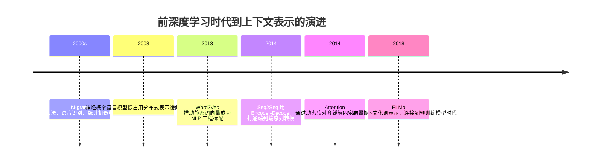

## 8.1.1 前深度学习时代（2000-2017）

**时间范围**：2000-2017  
**本节在整体演进史中的位置**：上一阶段，NLP 主要依赖规则、词典和统计方法；本阶段的核心转变，是从“数词频、调特征”走向“学习表示、端到端建模”；下一阶段则会由 Transformer 把这种表示学习推进到大规模预训练范式。

> 说明：ELMo 论文发表于 2018 年，严格说已越过本节时间边界，但它是 Transformer 全面接管 NLP 之前“上下文表示路线”的收束点，因此放在本节末尾作为过渡更合理。([arXiv](https://arxiv.org/abs/1802.05365))

### 时代背景

2000 年前后，NLP 的核心瓶颈不是“没有模型”，而是模型缺乏真正的语义表示能力。工程上大量系统依赖规则、词典、N-gram、CRF、最大熵模型和手工特征，能做搜索、分词、拼写纠错、机器翻译，但迁移性差、长距离依赖弱、语义泛化能力有限。突破出现的条件来自三方面：互联网文本数据爆炸，GPU 和分布式训练逐步可用，以及神经网络重新证明自己能从海量文本中学习可复用表示。

### 关键突破

#### N-gram 语言模型与统计 NLP 工程体系（2000s）

**一句话定位**：N-gram 是大模型出现前最重要的工业级语言建模基座，它把“语言是否自然”转化成了可计算的条件概率问题。

**核心贡献**：

N-gram 解决的是早期 NLP 最朴素但关键的问题：给定前面若干个词，如何预测下一个词。它不理解“语义”，但能通过大规模语料统计出“更常见、更像人话”的序列。这让搜索纠错、输入法候选排序、语音识别解码、统计机器翻译都可以落到统一的概率框架里。

它的核心技术创新不是复杂模型，而是工程可用性：用马尔可夫假设把无限长历史截断为固定窗口，用平滑方法解决未见过词组的零概率问题，用语言模型分数参与候选排序。对当时的工程师来说，这非常重要，因为它能在 CPU 集群上稳定运行、可解释、可调参、可上线。

但 N-gram 的上限也很清楚：它只能记住局部共现，无法知道“汽车”和“车辆”语义相近，也很难处理长距离依赖。Bengio 等人在神经概率语言模型中指出，传统 N-gram 依靠短片段拼接来泛化，而语言序列天然面临维度灾难，这也解释了为什么后来必须走向分布式表示。([机器学习研究期刊](https://www.jmlr.org/papers/volume3/bengio03a/bengio03a.pdf))

**工程师视角**：

如果你是当时的搜索或输入法工程师，日常工作会围绕“语料清洗、分词、计数、平滑、剪枝、压缩、线上打分延迟”展开。模型效果的提升，往往不是换一个更深的网络，而是拿到更干净、更大规模的语料，设计更好的特征组合，并把语言模型压到线上能承受的内存和延迟范围内。

> 📄 代表性参考：Bengio et al., 2003, *A Neural Probabilistic Language Model*。

#### Word2Vec 词向量（2013）

**一句话定位**：Word2Vec 把 NLP 从“离散符号工程”推进到“连续向量空间”，为后来的 Embedding、RAG、语义检索和大模型表示学习打下了工程基础。

**核心贡献**：

Word2Vec 解决了 N-gram 无法表达语义相似性的问题。过去，“北京”和“上海”只是两个不同 ID；Word2Vec 之后，它们可以变成向量空间中距离较近的点。模型不再只看词是否完全匹配，而是能利用上下文共现关系学习词的语义和句法规律。

它的关键创新在于训练目标足够简单、训练速度足够快。CBOW 用上下文预测中心词，Skip-gram 用中心词预测上下文；负采样和高频词下采样让模型可以在十亿级词语料上高效训练。Mikolov 等人在 2013 年的论文中提出 CBOW 和 Skip-gram，并报告了低计算成本下学习高质量词向量的结果；后续论文进一步用 negative sampling 和短语建模提升质量与速度。([arXiv](https://arxiv.org/abs/1301.3781))

它对后续发展的影响非常深。今天工程师熟悉的 Embedding 检索、向量数据库、语义相似度、召回重排，本质上都继承了这个思想：把离散对象映射到连续空间，再用距离表达语义关系。对中国 NLP 场景来说，Word2Vec 也极大推动了中文分词、短文本分类、推荐召回、搜索相关性优化等任务的工程升级。

**工程师视角**：

如果你是 2013 年后的 NLP 工程师，工作流会发生明显变化：不再为每个任务手写大量稀疏特征，而是先在大语料上训练通用词向量，再把这些向量接到分类器、序列标注、召回模型里。常见实践也随之出现：业务语料要不要单独训练 Embedding？通用词向量和领域词向量如何融合？中文到底按字、词还是 phrase 建模？这些问题一直延续到今天的 Embedding 选型。

> 📄 原始论文：Mikolov et al., 2013, arXiv:1301.3781；Mikolov et al., 2013, arXiv:1310.4546。

#### Seq2Seq + Attention 机制（2014-2015）

**一句话定位**：Seq2Seq 把 NLP 从“多个模块拼装”推向“输入序列到输出序列的端到端建模”，Attention 则解决了固定长度向量瓶颈，是 Transformer 的直接前奏。

**核心贡献**：

在统计机器翻译时代，一个系统通常包含分词、对齐、短语表、语言模型、重排序等多个模块。Seq2Seq 的突破在于：用一个 Encoder 读入源句子，把它压成向量，再由 Decoder 生成目标句子。Sutskever 等人在 2014 年用多层 LSTM 做端到端序列学习，并在英法翻译任务上展示了接近或超过传统 phrase-based SMT 的效果。([arXiv](https://arxiv.org/abs/1409.3215))

但早期 Seq2Seq 有一个严重问题：不管输入句子多长，都要压进一个固定长度向量。句子越长，信息瓶颈越明显。Bahdanau Attention 的核心贡献，就是让 Decoder 在生成每个词时，动态“回看”输入序列中最相关的位置，而不是完全依赖一个固定句向量。论文明确指出固定长度向量是基础 Encoder-Decoder 架构的瓶颈，并提出软对齐机制来改善翻译效果。([arXiv](https://arxiv.org/abs/1409.0473))

这件事的历史意义很大：Attention 一开始并不是为了造大模型，而是为了解决机器翻译里的对齐和长句信息丢失问题。但它给出了一个更通用的思想：模型在生成当前输出时，应该动态选择输入中的相关信息。Transformer 后来只是把这个思想推到极致：不再把 Attention 当 RNN 的辅助模块，而是让 Attention 成为主干架构。

**工程师视角**：

如果你是当时做机器翻译、摘要或对话系统的工程师，Seq2Seq + Attention 改变的是整个系统设计方式。过去需要维护复杂 pipeline，每个模块单独调；现在可以收集平行语料，训练一个端到端模型。代价是可解释性下降、训练成本上升、线上推理更重，但收益是系统更统一、迁移更容易，也更适合随着数据规模增长持续提升。

> 📄 原始论文：Sutskever et al., 2014, arXiv:1409.3215；Bahdanau et al., 2014/2015, arXiv:1409.0473。

#### ELMo 动态词向量（2018，作为本阶段尾声）

**一句话定位**：ELMo 让词向量从“一个词一个固定向量”升级为“同一个词在不同上下文中有不同表示”，正式迈向上下文感知表示。

**核心贡献**：

Word2Vec 的一个根本问题是多义词。比如“苹果”在“苹果手机”和“吃苹果”中语义不同，但静态词向量只能给它一个固定表示。ELMo 的核心贡献，就是用双向语言模型生成上下文相关的词表示，让词的向量随句子变化。Peters 等人在论文中明确提出，表示应该同时建模复杂词用法以及这些用法如何随语言上下文变化，并展示 ELMo 可接入多种下游任务。([arXiv](https://arxiv.org/abs/1802.05365))

从技术路线上看，ELMo 仍然使用 LSTM，而不是 Transformer；但从思想路线上看，它已经非常接近后来的预训练语言模型：先在大规模文本上预训练一个通用语言模型，再把内部表示迁移到问答、文本蕴含、情感分析等任务。也就是说，ELMo 不是大模型时代的终点，而是 BERT/GPT 时代的门口。

**工程师视角**：

如果你在 2018 年前后做 NLP，下游任务的 baseline 会发生变化：不再只是“分词 + Word2Vec + BiLSTM/CRF”，而是开始尝试“预训练上下文表示 + 轻量任务模型”。这带来一个重要工程启发：很多任务缺的不是更复杂的特征，而是一个足够强的通用表示层。这个启发会在 BERT 和 GPT 出现后被彻底放大。

> 📄 原始论文：Peters et al., 2018, arXiv:1802.05365。

### 阶段总结

**本阶段核心主题**：这一阶段的主线不是“模型越来越大”，而是“语言表示越来越可学习”。N-gram 让语言概率可计算，Word2Vec 让词义进入连续空间，Seq2Seq + Attention 让序列转换端到端化，ELMo 则证明通用预训练表示可以服务多个任务。真正的转折点在于：NLP 工程从手写规则和特征，逐步转向用数据学习表示。

### 历史意义与遗留问题

这个阶段解决了三个写进教科书的问题：第一，语言可以被概率化建模；第二，词语可以被表示成可计算的向量；第三，翻译、摘要、对话这类任务可以统一为序列到序列建模。对工程界来说，这让 NLP 系统从“规则密集型工程”走向“数据密集型工程”。

但它也留下了新的问题。静态词向量无法彻底解决多义词和上下文变化；RNN 训练慢、难并行，长距离依赖仍然不稳定；Attention 虽然有效，但在这一阶段还只是 RNN 的外挂组件。下一阶段 Transformer 的出现，本质上就是对这些遗留问题的一次集中回答：去掉 RNN，把 Attention 提升为主架构，并用大规模预训练把表示学习推向平台化。

---

**Sources:**

- [Deep contextualized word representations](https://arxiv.org/abs/1802.05365)
- [A Neural Probabilistic Language Model](https://www.jmlr.org/papers/volume3/bengio03a/bengio03a.pdf)

