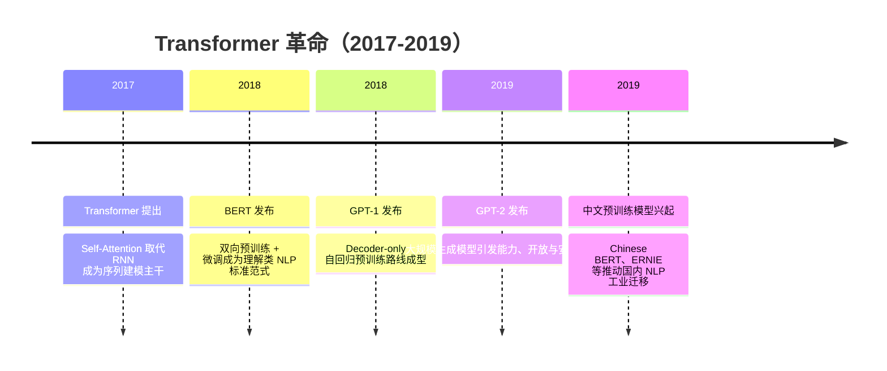

## 8.1.2 Transformer 革命（2017-2019）

**时间范围**：2017-2019  
**本节在整体演进史中的位置**：上一阶段的 Seq2Seq、Attention、ELMo 已经证明“上下文表示”很重要，但模型训练仍受 RNN 串行计算和任务专用架构限制；本阶段的核心转变，是 Transformer 将 NLP 从“手工设计任务模型”推进到“预训练大模型 + 少量适配”的范式；这也直接引出下一阶段的 Scaling Laws、GPT-3 与大模型涌现能力。

### 时代背景

2017 年前后，NLP 已经从统计特征工程进入深度学习时代，但工程实践仍有两个硬瓶颈：第一，主流 Seq2Seq / LSTM / GRU 依赖时间步递归，长序列训练难并行，GPU 算力利用率不高；第二，不同任务往往需要不同模型结构，比如翻译、分类、问答、自然语言推理各做一套 pipeline，迁移成本很高。Attention 机制已经证明模型可以动态关注输入中相关位置，但在多数系统里它仍只是 RNN 编码器-解码器上的“增强模块”。

突破出现的条件也在同时成熟：GPU 集群让大规模矩阵运算变得可行，互联网文本提供了海量无标注语料，BPE / WordPiece 等子词切分方法缓解了开放词表问题。更关键的是，研究者开始意识到：如果模型能先从无标注文本中学到通用语言表示，再用少量标注数据适配任务，那么 NLP 工程就可能从“为每个任务造模型”变成“复用一个预训练底座”。Transformer、BERT、GPT 正是在这个窗口期连续出现的三次范式跃迁。

---

### 关键突破

#### Attention Is All You Need（2017）

**一句话定位**：Transformer 是现代大语言模型的基础架构，它把 Attention 从辅助模块提升为序列建模的主干结构。

**核心贡献**：

Vaswani 等人在 2017 年提出 Transformer，明确“dispensing with recurrence and convolutions entirely”，也就是完全去掉 RNN 和 CNN，只用 Self-Attention 建模序列内部依赖。论文在 WMT 2014 英德翻译任务上达到 28.4 BLEU，在英法翻译任务上达到 41.8 BLEU，并强调该结构更易并行、训练时间更短。([arXiv](https://arxiv.org/abs/1706.03762))

它解决的核心痛点是 RNN 的串行瓶颈。RNN 必须从第 1 个 token 读到第 n 个 token，中间状态一步步传递；Transformer 则把序列中每个 token 两两计算相关性，用矩阵乘法一次性完成。对工程师来说，这意味着训练速度、显存利用、分布式扩展方式都变了：模型不再被时间步依赖卡住，而是变成更适合 GPU / TPU 的大规模矩阵计算问题。

Transformer 的关键设计包括 Multi-Head Attention、Position Encoding、Residual Connection、LayerNorm 和 Feed Forward Network。Multi-Head Attention 的价值不是“多个注意力头更复杂”，而是让模型在不同表示子空间里同时学习不同关系：有的头关注语法依赖，有的头关注实体指代，有的头关注局部短语搭配。Position Encoding 则补上了 Self-Attention 本身不感知顺序的问题。

**工程师视角**：

如果你是 2017 年做机器翻译或文本分类的工程师，Transformer 改变的不是一个小模块，而是整个建模习惯。以前你要调 LSTM 层数、隐藏状态、双向编码器、Attention 接法；现在核心变成了堆叠 Transformer Block，扩大 hidden size、head 数、层数，然后把训练吞吐跑满。后来几乎所有主流 LLM 的工程问题--KV Cache、长上下文、推理加速、显存优化--都可以追溯到 Transformer 这套计算图。

> 📄 原始论文：Vaswani et al., 2017, arXiv:1706.03762

---

#### BERT（2018）

**一句话定位**：BERT 让“预训练 + 微调”成为 NLP 标准工业范式，尤其适合理解类任务。

**核心贡献**：

BERT，全称 Bidirectional Encoder Representations from Transformers，由 Devlin 等人在 2018 年提出。它的核心思想是用 Transformer Encoder 做深度双向预训练，让每一层都能同时利用左侧和右侧上下文。BERT 只需要在预训练模型顶部增加一个很小的任务层，就能在问答、自然语言推理、分类等多类任务上达到当时的 SOTA。论文报告其在 11 个 NLP 任务上刷新结果，包括 GLUE、MultiNLI、SQuAD v1.1 / v2.0 等基准。([arXiv](https://arxiv.org/abs/1810.04805))

BERT 承接的是 ELMo 的痛点。ELMo 已经证明上下文相关词向量很有价值，但它更像一个特征生成器，通常还要接任务专用模型；BERT 则更进一步，把预训练模型本身变成可微调的主体。它通过 Masked Language Modeling 随机遮住部分 token，让模型根据双向上下文预测被遮住的词；再通过 Next Sentence Prediction 学习句间关系。虽然 NSP 后来被 RoBERTa 等工作弱化甚至移除，但在当时它推动了“一个模型覆盖多任务”的工程落地。

BERT 对中文 NLP 的影响尤其直接。Google Research 在 2018 年 11 月开放了 Multilingual BERT 和 Chinese BERT，其中 Chinese BERT 覆盖简体与繁体中文，采用 12 层、768 hidden、12 heads 的 BERT-Base 配置。([GitHub](https://github.com/google-research/bert)) 这使得国内大量搜索、推荐、客服、舆情、金融文本系统快速从 BiLSTM-CRF / TextCNN 迁移到 BERT fine-tuning。2019 年百度 ERNIE 又在 BERT masking 思路上引入 entity-level 和 phrase-level 知识增强，并在多个中文任务上报告更强表现。([arXiv](https://arxiv.org/abs/1904.09223))

**工程师视角**：

BERT 改变了 NLP 团队的日常工作流。过去做一个分类器，常见流程是清洗数据、训练词向量、设计模型结构、调特征、再为每个任务单独维护代码。BERT 之后，工作流变成：选择预训练 checkpoint → 按任务格式构造输入 → fine-tune → 评估。模型结构设计的重要性下降，数据质量、标注规范、训练稳定性、部署延迟变得更重要。

但 BERT 也留下了工程约束：它是 Encoder-only，不适合长文本生成；推理延迟比传统小模型高；最大长度通常受 512 token 限制；中文场景还会遇到 WordPiece 切分与词边界不一致的问题。因此在生产中，BERT 更适合分类、匹配、抽取、排序、Embedding / reranker 等理解类链路，而不是开放式生成。

> 📄 原始论文：Devlin et al., 2018, arXiv:1810.04805

---

#### GPT-1 / GPT-2（2018-2019）

**一句话定位**：GPT 系列确立了 Decoder-only 自回归生成路线，并首次让业界看到“扩大语言模型本身”可能带来通用任务能力。

**核心贡献**：

GPT-1 的完整名称是 *Improving Language Understanding by Generative Pre-Training*。OpenAI 在 2018 年发布该工作，核心路线是先在大规模无标注文本上做自回归语言模型预训练，再在下游任务上 supervised fine-tuning。OpenAI 当时总结称，无监督预训练与监督学习结合，可以很好地提升语言理解任务效果。([OpenAI](https://openai.com/index/language-unsupervised/))

GPT-1 与 BERT 的差异，决定了后来两条路线的分野：BERT 是 Encoder-only，天然适合理解；GPT 是 Decoder-only，天然适合生成。GPT 的训练目标非常简单：给定前文，预测下一个 token。这个目标与真实文本生成过程一致，不需要人为构造 mask，也不需要任务专用输出结构。它的工程美感在于统一：分类、问答、摘要、翻译，都可以被转写成“给一段上下文，让模型继续生成答案”。

GPT-2 在 2019 年把这条路线推向公众视野。OpenAI 发布 *Better Language Models and Their Implications*，展示 GPT-2 可以根据任意 prompt 生成连贯文本，并形容其像“chameleon-like”一样适应输入文本的风格与内容。([OpenAI](https://openai.com/index/better-language-models/)) GPT-2 最大版本为 1.5B 参数，OpenAI 最初采用 staged release，没有立即开放完整模型；到 2019 年 11 月，OpenAI 才发布完整 1.5B 参数版本及代码和权重。([OpenAI](https://openai.com/index/gpt-2-1-5b-release/))

“太危险不发布”风波的历史意义不只是安全争议，而是它第一次让很多工程师意识到：语言模型不再只是 benchmark 工具，而可能成为内容生产、搜索、客服、舆情操控、代码辅助等真实系统中的能力组件。也就是说，GPT-2 把问题从“模型能不能生成流畅文本”推进到“当生成能力足够低成本、足够规模化时，产品和社会如何管理风险”。

**工程师视角**：

GPT-1 / GPT-2 改变的是接口想象力。BERT 时代，工程师通常把模型看作一个 encoder，输入文本，输出分类标签、span 或向量；GPT 路线则把模型看作一个通用文本接口：你给 prompt，它续写结果。今天的 Prompt Engineering、Few-shot Learning、Instruction Following、Chat API，本质上都继承了 GPT 路线的接口哲学。

但在 2019 年，GPT 路线还没有真正完成产品闭环。它能生成，但不够可控；能少样本泛化，但稳定性不足；能写长段落，但事实性和安全性难保证。这些问题后来会在 GPT-3、InstructGPT、RLHF 和 ChatGPT 阶段继续被放大并逐步工程化解决。

> 📄 原始论文 / 技术报告：Radford et al., 2018, *Improving Language Understanding by Generative Pre-Training*；Radford et al., 2019, *Language Models are Unsupervised Multitask Learners*

---

### 阶段总结

**本阶段核心主题**：2017-2019 年的主线不是“又多了几个模型”，而是 NLP 的生产范式被重写了。Transformer 解决了可并行扩展问题，BERT 证明了预训练表示可以迁移到大量理解任务，GPT 则证明了统一生成目标有可能承载通用语言能力。

从工程角度看，这一阶段的最大洞见是：模型能力的关键不再只是任务结构设计，而是“架构可扩展性 × 预训练语料 × 统一训练目标”。谁能把这三者结合起来，谁就能把 NLP 从项目制手工调参推进到平台化模型复用。

---

### 历史意义与遗留问题

**这个阶段解决了什么**：

- Transformer 解决了 RNN 难并行、长依赖建模弱的问题，为后续百亿、千亿参数模型提供了可扩展架构基础。
- BERT 解决了大量理解类任务从零训练成本高、任务模型割裂的问题，让 fine-tuning 成为工业标准动作。
- GPT-1 / GPT-2 证明了 Decoder-only 语言模型可以通过简单自回归目标学习广泛语言能力，为后来的 GPT-3、ChatGPT 和现代 LLM API 铺路。

**留下了什么新问题**：

- 模型越来越大，训练和推理成本开始成为门槛，后续必须研究 Scaling Laws、模型压缩、分布式训练和推理加速。
- BERT 擅长理解但不擅长生成，GPT 擅长生成但事实性、可控性、安全性不足，两条路线都没有彻底解决“可靠输出”问题。
- 预训练模型降低了建模门槛，却提高了数据治理、评估、部署和安全门槛。工程师从“设计模型结构”转向“管理模型能力”，这也是下一阶段大模型平台化与对齐技术兴起的根本原因。

---

**Sources:**

- [Attention Is All You Need](https://arxiv.org/abs/1706.03762)
- [google-research/bert: TensorFlow code and pre-trained ...](https://github.com/google-research/bert)
- [Improving language understanding with unsupervised ...](https://openai.com/index/language-unsupervised/)

