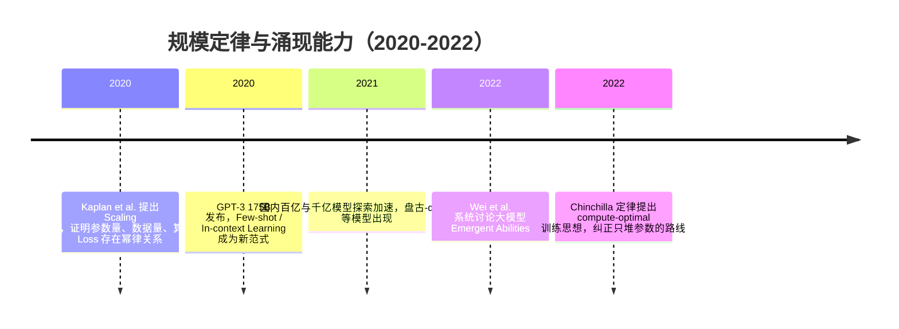

## 8.1.3 规模定律与涌现能力（2020-2022）

**时间范围**：2020-2022  
**本节在整体演进史中的位置**：上一阶段，Transformer、BERT、GPT-2 已经证明“预训练 + 下游适配”是可行路线；本阶段的核心转变，是行业开始相信“规模本身就是一种算法改进”；下一阶段则会转向“如何让大模型听话、可控、可用”，也就是指令对齐与 RLHF 时代。

### 时代背景

2019 年前后，NLP 的主流范式仍然是“先预训练，再针对具体任务 Fine-tuning”。BERT 让工程师相信预训练表征很强，GPT-2 让大家看到生成式模型的潜力，但当时还有一个关键问题没有被回答：模型继续变大，到底是线性收益、边际递减，还是会出现质变？

这一阶段的突破不是单点算法灵感，而是算力、数据、工程系统共同成熟后的结果。GPU/TPU 集群规模扩大，分布式训练、混合精度、模型并行逐渐稳定；互联网文本提供了海量训练语料；Transformer 架构又足够通用，能在大规模训练中稳定吃下数据。于是研究者开始把语言模型当成一种“可扩展系统”来研究：不再只问某个结构是不是更 clever，而是问参数量、数据量、训练计算量之间是否存在可预测规律。

---

### 关键突破

#### Scaling Laws for Neural Language Models（2020）

**一句话定位**：Scaling Laws 把“大模型为什么有效”从经验主义推进到工程可规划的阶段。

**核心贡献**：

Kaplan et al. 的核心发现是：语言模型的交叉熵 Loss 会随着模型参数量、训练数据量和计算量呈现稳定的幂律下降关系，而且这种趋势横跨多个数量级依然成立。换句话说，在当时的实验范围内，模型变大、数据变多、算力变强，不是“玄学调参”，而是可以被相对简单的曲线预测。([arXiv](https://arxiv.org/abs/2001.08361))

这解决了上一阶段的一个关键痛点：工程团队很难判断“继续堆算力是否值得”。在 BERT / GPT-2 时代，扩大模型规模更像是豪赌；Scaling Laws 出现后，训练大模型变成了一项可以做预算、做预测、做 ROI 评估的工程决策。

它的另一个重要结论是：在固定计算预算下，更大的模型往往具有更好的样本效率，最佳策略倾向于训练更大的模型，并在尚未完全收敛时停止。这个结论后来被 Chinchilla 修正，但在 2020 年，它极大推动了行业进入“参数规模竞赛”。

**工程师视角**：

如果你是当时的大模型训练工程师，这篇论文会直接改变你的立项方式。过去你可能先设计模型结构，再跑实验比较效果；现在你会先估算 compute budget，然后用 scaling curve 反推“该训练多大的模型、用多少数据、预期 Loss 到什么水平”。模型训练从“炼丹”变成了“容量规划”。

但它也埋下了一个误区：很多团队开始把“参数量”当成第一目标，而忽略训练 token 是否足够、数据质量是否匹配、推理成本是否可承受。这也是后面 Chinchilla 定律要纠偏的地方。

> 📄 原始论文：Kaplan et al., 2020, arXiv:2001.08361。([arXiv](https://arxiv.org/abs/2001.08361))

---

#### GPT-3：Language Models are Few-Shot Learners（2020）

**一句话定位**：GPT-3 让业界第一次系统性看到，大模型可以不通过梯度更新，仅靠上下文示例完成新任务。

**核心贡献**：

GPT-3 是一个 175B 参数的自回归语言模型，相比此前的非稀疏语言模型大约提升一个数量级。Brown et al. 的关键实验不是单纯证明模型更大效果更好，而是证明了一个新的交互范式：把任务说明和少量示例写进 Prompt，模型就能在不 Fine-tuning 的情况下完成翻译、问答、完形填空、简单算术、词语变换等任务。([arXiv](https://arxiv.org/abs/2005.14165))

这就是后来被称为 **In-Context Learning** 的能力。它把“模型适配任务”的成本从“收集数据 + 训练模型 + 部署新权重”，降低为“写 Prompt + 放几个示例”。这对应用开发的影响非常大：AI 能力开始从算法团队独占，转向普通工程师也能通过 API 和 Prompt 直接调用。

GPT-3 的另一个历史意义在于，它让 Prompt Engineering 成为独立工程实践。过去的 NLP 工程更像“数据集工程 + Fine-tuning 工程”；GPT-3 之后，工程师开始关心示例顺序、任务描述、输出格式、上下文长度、采样参数等应用层细节。

**工程师视角**：

如果你在 2020 年做一个客服分类、文本摘要或信息抽取系统，GPT-3 会改变你的默认工作流。你不一定先标注几千条数据再训练模型，而是先写 5-10 个高质量 few-shot examples，快速验证任务是否可行。MVP 周期从数周压缩到数小时。

但 GPT-3 也暴露了大模型应用的第一批工程问题：输出不稳定、成本高、延迟高、上下文长度有限、事实性不可控。这些问题后来直接催生了 Prompt 管理、RAG、缓存、模型路由和可观测性等生产化技术栈。

对中国读者来说，GPT-3 之后国内也迅速进入百亿、千亿参数模型探索阶段。例如华为盘古-α 在 2021 年提出最高 200B 参数的中文自回归预训练模型，并强调在 MindSpore 和昇腾集群上的自动并行训练实践；清华 CPM-2 则探索了 11B 双语模型和 198B MoE 版本，并把重点放在成本效率、Prompt Tuning 和推理工具上。([arXiv](https://arxiv.org/abs/2104.12369))

> 📄 原始论文：Brown et al., 2020, arXiv:2005.14165。([arXiv](https://arxiv.org/abs/2005.14165))

---

#### Emergent Abilities of Large Language Models（2022）

**一句话定位**：涌现能力把“大模型变强”这个连续问题，变成了“模型是否会在某个规模后突然获得新能力”的争论。

**核心贡献**：

Wei et al. 将“涌现能力”定义为：小模型中不存在、但大模型中出现，并且不能简单通过小模型性能外推预测的能力。论文讨论了多种在大规模模型上突然显著改善的任务现象，包括多步推理、复杂指令遵循、某些符号操作和少样本泛化能力。([arXiv](https://arxiv.org/abs/2206.07682))

这篇工作的影响不只在学术层面，更在于它改变了行业对 scale 的想象。Scaling Laws 说的是 Loss 可以预测下降；Emergent Abilities 说的是某些能力可能要到足够规模才“看得见”。这让很多公司愿意继续投入更大模型，因为能力提升可能不是平滑加分，而是跨过阈值后打开新的产品空间。

但涌现能力也一直存在争议。后续研究指出，一些看似突然出现的能力可能与评估指标选择有关：如果使用非连续、阈值型指标，模型行为的平滑改善可能被观察成“突然跃迁”。Schaeffer et al. 2023 年就提出，部分涌现现象可能是度量方式造成的“海市蜃楼”。([arXiv](https://arxiv.org/abs/2304.15004))

**工程师视角**：

对工程师来说，涌现能力最重要的启发不是“盲目相信神秘质变”，而是：评估大模型时不能只看平均 Loss 或传统 benchmark。一个模型在通用指标上只提升几个点，却可能在某类复杂任务上从不可用变成可用。

但这也要求工程团队建立更细的评估集。例如做 Agent，你不能只评估单轮问答准确率，还要评估工具调用成功率、多步任务完成率、失败恢复能力和长上下文一致性。否则你可能既看不到真正的能力提升，也可能被某个漂亮 benchmark 误导。

> 📄 原始论文：Wei et al., 2022, arXiv:2206.07682。([arXiv](https://arxiv.org/abs/2206.07682))

---

#### Chinchilla：Training Compute-Optimal Large Language Models（2022）

**一句话定位**：Chinchilla 定律纠正了“只堆参数”的路线，指出大模型训练的核心不是最大参数量，而是参数量与训练 token 的最优配比。

**核心贡献**：

Hoffmann et al. 重新研究固定计算预算下模型参数量与训练数据量的关系。他们发现，当时很多大模型其实是 **undertrained**：参数很多，但训练 token 不够。论文提出，在 compute-optimal 设置下，模型规模和训练 token 数应该大致同步增长；也就是说，模型参数翻倍，训练 token 也应该相应翻倍。([arXiv](https://arxiv.org/abs/2203.15556))

Chinchilla 本身只有 70B 参数，但使用了比 Gopher 更多的训练数据，并在相同计算预算下显著超过 Gopher、GPT-3、Jurassic-1、Megatron-Turing NLG 等更大模型。这个结果非常关键：它告诉行业，175B、280B、530B 并不天然代表更优；如果训练数据不足，参数量可能只是昂贵的闲置容量。([arXiv](https://arxiv.org/abs/2203.15556))

**工程师视角**：

Chinchilla 之后，训练大模型的工程决策发生了明显变化。团队不再只问“我们能训练多少参数”，而是会同时问：

- 我们有多少高质量 token？
- 数据去重、清洗和混合比例是否合理？
- 在同样预算下，是训练更大模型，还是训练较小但更充分的模型？
- 推理成本是否会因为参数过大而压垮产品毛利？

这对国内团队尤其重要。并不是所有公司都有 OpenAI/Google 级别的算力预算。Chinchilla 的意义在于，它给资源受限团队提供了一条更现实的路线：与其追逐最大参数量，不如优化数据质量、训练 token 配比和推理效率。

> 📄 原始论文：Hoffmann et al., 2022, arXiv:2203.15556。([arXiv](https://arxiv.org/abs/2203.15556))

---

### 阶段总结

**本阶段核心主题**：  
2020-2022 年的大模型发展，本质上是一次从“模型结构创新”到“规模工程学”的范式迁移。Scaling Laws 让训练大模型变得可预测，GPT-3 让大模型变成可直接交互的通用任务接口，Chinchilla 则提醒行业：真正有效的 scale 不是盲目堆参数，而是参数、数据和计算的系统性匹配。

---

### 历史意义与遗留问题

这个阶段解决了三个写进教科书的问题。

第一，它证明了语言模型能力可以通过规模化训练持续提升。Scaling Laws 让研究者和工程团队第一次有信心把数千万美元级训练任务视为可规划投资，而不是不可控实验。

第二，它证明了 Prompt 可以成为模型适配任务的接口。GPT-3 的 Few-shot Learning 让“一个通用模型 + 文本提示”成为新应用范式，为后来的 ChatGPT、Agent、RAG 应用层生态打下基础。

第三，它纠正了早期规模竞赛的粗放倾向。Chinchilla 定律让行业意识到，数据质量、训练 token 数和 compute-optimal 配比，与参数量同等重要。

但这个阶段也留下了新的问题。

首先，模型会做任务，不代表它理解用户意图。GPT-3 可以 few-shot，但输出仍然不可控、不稳定，容易编造事实。这直接引出下一阶段的核心问题：如何通过指令微调、RLHF、Constitutional AI 等方法，让模型更符合人类偏好。

其次，涌现能力虽然令人兴奋，但评估方法仍不成熟。到底哪些能力是真正的结构性跃迁，哪些只是指标选择造成的错觉，直到今天仍是争论点。对工程实践来说，这意味着不能只依赖公开 benchmark，而必须建立面向业务任务的系统评估。

最后，规模化带来了新的成本与门槛。训练大模型变成巨头游戏，中小团队很难从零训练基础模型。于是 2022 年之后，行业会自然转向两条路线：一是通过 API 使用闭源大模型，二是基于开源模型做指令微调、RAG 和 Agent 应用。这也正是后续大模型应用开发生态爆发的前奏。

---

**Sources:**

- [Scaling Laws for Neural Language Models](https://arxiv.org/abs/2001.08361)

