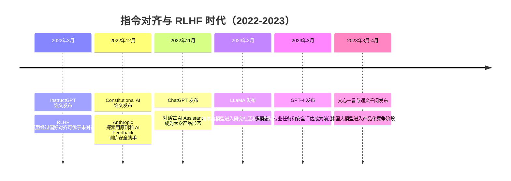

## 8.1.4 指令对齐与 RLHF 时代（2022-2023）

**时间范围**：2022-2023  
**本节在整体演进史中的位置**：上一阶段的核心结论是“规模本身能带来少样本学习和涌现能力”，但模型仍然不够听话、不够安全、也不够像产品；本阶段的核心转变，是从“训练一个会续写文本的模型”转向“训练一个能遵循人类意图的 AI 助手”；下一阶段则会沿着两个方向展开：闭源模型继续冲击多模态与长上下文，开源生态开始大规模复刻、蒸馏和本地化部署。

### 时代背景

到 2022 年初，GPT-3 已经证明“大模型 + 大数据 + 大算力”可以带来惊人的少样本能力，但它本质上仍是一个 next-token predictor：给它一段文本，它会预测后续文本，而不是天然理解“用户想要我完成什么任务”。这导致一个很现实的工程瓶颈：同样的模型，在论文 benchmark 上很强，放进产品里却经常不听指令、答非所问、胡编事实，甚至输出有害内容。对工程团队来说，问题不再只是“模型参数够不够大”，而是“如何把模型变成可靠的交互式助手”。

这个阶段突破的条件有三点：第一，GPT-3 级别的基座模型已经具备足够的语言与泛化能力；第二，OpenAI、Anthropic 等团队开始积累真实用户 prompt、人工偏好标注和安全评估数据；第三，RLHF、SFT、Preference Model 等训练流程逐渐工程化，使“人类偏好”可以变成可优化的训练信号。换句话说，2022-2023 年真正改变行业的不是单一算法，而是一个新范式：**预训练负责能力，对齐负责可用性，产品形态负责分发。**

---

### 关键突破

#### InstructGPT（2022）

**一句话定位**：InstructGPT 是把 GPT-3 从“会续写文本的语言模型”推向“会遵循用户指令的助手模型”的里程碑。

**核心贡献**：

InstructGPT 解决的是 GPT-3 最大的产品化痛点：模型并不总是按照用户意图行动。GPT-3 在训练时学习的是互联网文本分布，因此它擅长补全文本，却不一定擅长回答问题、拒绝危险请求、遵循格式约束或承认不确定性。OpenAI 在 InstructGPT 中采用了三步流程：先用人工示范数据做 Supervised Fine-Tuning，再让模型生成多个回答并由标注员排序，最后训练 Reward Model，并用 PPO 做强化学习优化。论文显示，1.3B 参数的 InstructGPT 在人工偏好中甚至优于 175B 的 GPT-3，这个结果非常关键：它说明“更符合人类意图”不完全依赖参数规模，而依赖训练目标是否正确。([arXiv](https://arxiv.org/abs/2203.02155))

从技术上看，RLHF 的本质不是让模型“更聪明”，而是改变模型输出分布：少说用户不想要的，多说用户偏好的。对工程师来说，这意味着大模型应用的优化目标从“prompt 能不能诱导出答案”升级为“模型是否经过面向指令的对齐训练”。后来的 ChatGPT、Claude、Gemini、Qwen-Chat、ChatGLM 等对话模型，本质上都沿用了类似的“基座模型 + 指令微调 + 偏好对齐”路线。

**工程师视角**：

如果你是 2022 年的应用工程师，InstructGPT 改变的是默认工作流。以前接 GPT-3，经常要写很长的 few-shot prompt，让模型“假装自己是助手”；InstructGPT 之后，你可以直接写任务指令，并期待模型按格式、按角色、按约束完成任务。这也是 Prompt Engineering 能成为一门工程技能的前提：模型先被训练成“愿意听指令”，prompt 才有稳定发挥空间。

> 📄 原始论文：Ouyang et al., 2022, arXiv:2203.02155

---

#### ChatGPT（2022）

**一句话定位**：ChatGPT 把指令对齐模型包装成大众可用的聊天产品，定义了后续 AI Assistant 的交互标准。

**核心贡献**：

ChatGPT 发布于 2022 年 11 月 30 日，OpenAI 在官方介绍中明确指出它与 InstructGPT 属于同一技术脉络，并强调对话格式使模型可以回答追问、承认错误、质疑错误前提和拒绝不当请求。([OpenAI](https://openai.com/index/chatgpt/)) 这件事的历史意义不只是“模型变强了”，而是产品形态被重新定义：用户不再通过 API、Playground 或模板化 prompt 使用模型，而是通过自然对话把任务逐步澄清、分解和修正。

ChatGPT 的爆发证明了一个判断：LLM 最先成熟的产品形态不是搜索框，也不是传统 SaaS 表单，而是“可多轮交互的通用助手”。这个形态极大降低了使用门槛，也让模型能力通过用户反馈快速暴露出来。它带来的行业冲击直接传导到中国市场：百度在 2023 年 3 月发布文心一言，阿里云在 2023 年 4 月发布通义千问，国内团队开始集中投入中文指令对齐、企业知识库、办公助手和代码助手。([Reuters](https://www.reuters.com/technology/chinas-baidu-cancels-chatgpt-like-ernie-bots-livestreamed-product-launch-2023-03-27/))

**工程师视角**：

ChatGPT 之后，工程师做 AI 应用的方式发生了根本变化。过去做 NLP 产品，要拆成分类、抽取、摘要、翻译等多个模型；现在很多任务可以先用一个对话模型作为通用推理层，再通过 Prompt、RAG、Function Calling 和业务规则补强。产品设计也从“用户填写参数 → 系统返回结果”变成“用户表达目标 → AI 澄清需求 → 调工具完成任务”。这正是后续 Agent 架构的用户心智基础。

---

#### GPT-4 Technical Report（2023）

**一句话定位**：GPT-4 标志着对齐后的大模型开始进入专业任务、多模态输入和系统化安全评估阶段。

**核心贡献**：

GPT-4 于 2023 年 3 月发布。OpenAI 在官方页面和技术报告中将其描述为可接受图像与文本输入、输出文本的大规模多模态模型，并展示了其在专业和学术 benchmark 上接近人类水平的表现，例如模拟律师资格考试成绩达到考生前 10% 左右。([OpenAI](https://openai.com/index/gpt-4-research/))

GPT-4 的重要性不只在能力提升，而在工程范式变化。它让开发者意识到：大模型不只是聊天机器人，还可以成为复杂任务的推理核心。它能处理更长、更复杂的上下文，能在代码、法律、教育、数据分析等任务中表现出较强迁移能力，也开始让“LLM 作为应用操作系统的中枢”变得可信。

同时，GPT-4 Technical Report 把安全评估、红队测试、对齐训练和风险缓解放到了与模型能力同等重要的位置。对行业来说，这意味着大模型竞争开始从单纯 benchmark 竞争，转向“能力、安全、可控性、产品集成”的综合竞争。

**工程师视角**：

GPT-4 之后，工程团队开始愿意把 LLM 放进更关键的业务链路：代码生成、合同审查、复杂客服、数据分析、智能办公等。但它也带来新的工程问题：高成本、高延迟、幻觉风险、不可解释性和数据安全。于是，企业级 LLM 应用不再只是“调一个 API”，而需要配套 RAG、权限控制、日志审计、输出校验、Human-in-the-Loop 和成本路由。这些问题直接引出了后续生产级 LLMOps 和 AgentOps。

> 📄 原始论文：OpenAI, 2023, arXiv:2303.08774

---

#### Claude 与 Constitutional AI（2022-2023）

**一句话定位**：Claude 系列代表了另一条对齐路线：用显式原则和 AI Feedback 减少对人工偏好标注的依赖。

**核心贡献**：

Anthropic 在 2022 年提出 Constitutional AI，目标是训练一个有帮助、诚实、无害的 AI Assistant。与传统 RLHF 依赖大量人工比较标注不同，Constitutional AI 使用一组人类编写的原则作为“宪法”，让模型先对自己的回答进行批评和改写，再用 AI Feedback 训练偏好模型，形成 RLAIF 流程。论文强调，这种方法可以在更少人工有害内容标注的情况下训练更安全的助手。([arXiv](https://arxiv.org/abs/2212.08073))

Claude 则是这一路线的产品化体现。Anthropic 在 2023 年推出 Claude，定位为基于 helpful、honest、harmless 研究训练的下一代 AI Assistant，可通过聊天界面和 API 使用。([Anthropic](https://www.anthropic.com/news/introducing-claude)) 后续 Claude 2 又强调更长上下文、更强文本处理能力和更稳定的对话体验。([Anthropic](https://www.anthropic.com/news/claude-2))

这一路线的价值在于，它把“安全”从事后过滤变成训练过程的一部分。相比简单的关键词拦截或输出审核，Constitutional AI 更像是给模型内化一套行为原则，让它在生成阶段就倾向于做出更安全的选择。

**工程师视角**：

Claude 给工程师的启发是：对齐不是只有“人工标注 + PPO”一种做法。对于企业应用，很多安全要求本身就是原则型的，比如“不得泄露客户隐私”“不得提供法律定论”“不得绕过权限系统”。这些原则可以进入 system prompt、评估集、红队用例，甚至进入模型微调数据。今天做企业级 Agent，不能只看模型能力，还要设计一套可审计、可解释、可迭代的行为规范。

> 📄 原始论文：Bai et al., 2022, arXiv:2212.08073

---

#### LLaMA（2023）

**一句话定位**：LLaMA 是开源大模型生态爆发的起点之一，让“本地可运行的强力基座模型”成为现实。

**核心贡献**：

Meta 在 2023 年发布 LLaMA，模型规模覆盖 7B 到 65B，并强调使用公开数据训练。论文称 LLaMA-13B 在多数 benchmark 上超过 GPT-3 175B，LLaMA-65B 则可与 Chinchilla-70B、PaLM-540B 等强模型竞争。([arXiv](https://arxiv.org/abs/2302.13971)) Meta 官方发布中也将 LLaMA 定位为帮助研究者推进大语言模型研究的 foundation model。([AI.Meta](https://ai.meta.com/blog/large-language-model-llama-meta-ai/))

LLaMA 本身不是 ChatGPT 式产品，但它的历史意义极大：它把强基座模型带到了研究者和独立开发者手里。随后社区基于 LLaMA 做了大量指令微调、蒸馏、量化和本地部署实验，推动 Alpaca、Vicuna、llama.cpp、QLoRA 等项目快速出现。对中国开发者而言，这个阶段也推动了 ChatGLM-6B、Qwen、Baichuan 等中文和双语模型的快速发展，使“私有化部署 + 中文优化 + 行业微调”成为现实路径。ChatGLM-130B 在 2023 年 3 月上线，ChatGLM-6B 随后开源；Qwen 系列也在 2023 年进入开源与商用生态。([arXiv](https://arxiv.org/html/2406.12793v1))

**工程师视角**：

LLaMA 改变的是部署想象力。ChatGPT/GPT-4 代表闭源 API 路线，适合快速构建高质量应用；LLaMA 代表开放权重路线，适合私有化、低成本、可控微调和边缘部署。对于企业工程师来说，选型开始变成两条路线的权衡：闭源模型能力强、维护成本低，但数据和成本受制于供应商；开源模型能力略弱但可控性高，适合金融、政务、医疗、制造等对数据边界敏感的场景。

> 📄 原始论文：Touvron et al., 2023, arXiv:2302.13971

---

### 阶段总结

**本阶段核心主题**：  
这一阶段最重要的技术洞见是：**预训练解决“会不会”，对齐解决“好不好用”。** GPT-3 证明了规模的力量，但 InstructGPT、ChatGPT、Claude 和 GPT-4 证明，真正能改变产业的不是裸模型，而是经过指令微调、安全对齐和产品封装后的 AI Assistant。

同时，LLaMA 的出现让行业形成“双轨格局”：闭源模型继续冲击能力上限，开源模型承担生态扩散、私有化部署和低成本创新。后续所有 RAG、Agent、Function Calling、LLMOps 的爆发，几乎都建立在这个阶段形成的模型与产品基础上。

---

### 历史意义与遗留问题

- **这个阶段解决了什么**  
  2022-2023 年解决的是大模型从“研究 demo”到“通用产品”的关键跃迁。RLHF 和指令微调让模型更听话，ChatGPT 让普通用户理解了 AI Assistant 的交互方式，GPT-4 让企业相信 LLM 可以进入专业工作流，Claude 把安全对齐推向方法论层面，LLaMA 则让开源社区获得了可持续迭代的底座。

- **留下了什么新问题**  
  第一，RLHF 并没有根治幻觉，只是让模型更符合人类偏好；在事实密集场景里，仍然需要 RAG、引用溯源和输出校验。第二，对齐本身存在价值选择问题：谁定义“好回答”？不同文化、行业和监管环境下答案并不一致。第三，闭源 API 与开源部署形成长期张力：前者能力强，后者可控性高。第四，ChatGPT 式助手虽然好用，但还主要停留在“回答问题”，真正能稳定执行复杂任务的 Agent 还没有成熟。这些遗留问题，正好引出下一阶段：开源生态爆发、长上下文竞争、多模态融合，以及 AI Agent 从工具调用走向自主任务执行。

---

**Sources:**

- [Training language models to follow instructions with human feedback](https://arxiv.org/abs/2203.02155)
- [Introducing ChatGPT](https://openai.com/index/chatgpt/)
- [China's Baidu reveals more capabilities of AI-powered ...](https://www.reuters.com/technology/chinas-baidu-cancels-chatgpt-like-ernie-bots-livestreamed-product-launch-2023-03-27/)
- [Introducing Claude](https://www.anthropic.com/news/introducing-claude)
- [Introducing LLaMA: A foundational, 65-billion-parameter large ...](https://ai.meta.com/blog/large-language-model-llama-meta-ai/)

