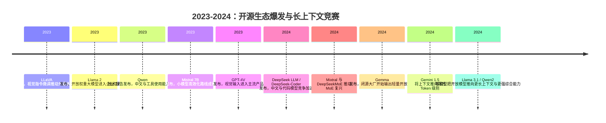

## 8.1.5 开源生态爆发与长上下文竞赛（2023-2024）

### 时代背景

2023 年初，LLM 行业的核心矛盾已经从“模型能不能生成像样文本”转向“谁能以可控成本把能力交到工程师手里”。GPT-3.5 / GPT-4 证明了大模型的产品价值，但闭源 API 也带来三个瓶颈：企业数据不能轻易出域、模型行为难以深度定制、推理成本和供应商锁定不可控。与此同时，前一阶段积累的 Scaling Laws、RLHF、Instruction Tuning、Tokenizer / 数据清洗工程、GPU 集群训练经验开始下沉到更多团队；Hugging Face、vLLM、llama.cpp、LoRA / QLoRA 等工具链降低了使用和微调门槛。于是 2023-2024 年的核心转变出现了：大模型不再只是少数闭源厂商的远程能力，而变成可下载、可微调、可私有部署、可嵌入业务系统的工程组件。本节位于“指令对齐与 RLHF 时代”之后：上一阶段解决了“模型如何听话”，本阶段解决“模型如何开放、变长、变便宜、变多模态”，并为下一阶段的推理模型和 Agentic AI 铺路。

### 关键突破

#### Llama 2 与开源基座模型标准化（2023）

**一句话定位**：Llama 2 是开源/开放权重大模型进入企业工程视野的分水岭，让“本地可运行的 Chat 模型”成为现实选项。

**核心贡献**：Llama 2 发布了 7B、13B、70B 三档预训练和对话模型，重点不只是参数量，而是把预训练、SFT、RLHF、安全评估、红队测试等闭源模型流程以论文形式公开。它承接了 GPT-3 / InstructGPT 之后的痛点：大家知道大模型有用，但缺少一个足够强、可研究、可部署的基础底座。Llama 2-Chat 在多数公开开源聊天模型上取得优势，并被定位为在一定场景下可替代闭源模型的候选项。([arXiv](https://arxiv.org/abs/2307.09288?utm_source=chatgpt.com))

**工程师视角**：Llama 2 改变的是开发工作流。过去做 LLM 应用几乎默认调 API；Llama 2 之后，团队可以开始评估“私有化部署 + LoRA 微调 + 本地向量库”的组合。工程师第一次需要认真处理 GPU 显存、量化格式、推理吞吐、模型许可证、对话模板这些问题。它也让面试和系统设计题从“如何调用 OpenAI API”升级为“如何选择闭源 API、开源模型、自托管推理服务之间的边界”。

> 📄 原始论文：Touvron et al., 2023, arXiv:2307.09288

#### Mistral / Qwen / DeepSeek / Gemma：小模型高效化与区域生态崛起（2023-2024）

**一句话定位**：这一批模型证明，开源生态追赶闭源不只靠“堆大”，更靠数据质量、架构效率、许可证友好和工具链适配。

**核心贡献**：Mistral 7B 的关键价值在于“7B 也能打”。它使用 GQA 降低 KV Cache 成本，用 Sliding Window Attention 支持更高效的长序列处理，并在多个评测中超过更大的 Llama 2 13B。更重要的是 Apache 2.0 许可证降低了商业使用顾虑。([arXiv](https://arxiv.org/abs/2310.06825?utm_source=chatgpt.com)) Qwen 则代表中文和多语言生态的快速补位：2023 年 Qwen 技术报告强调 base、chat、code、math 等系列化模型，并展示工具使用和规划能力；2024 年 Qwen2 进一步扩展到 0.5B-72B、dense + MoE、多语言和长上下文能力。([arXiv](https://arxiv.org/abs/2309.16609?utm_source=chatgpt.com)) DeepSeek 的重要性在于把“低成本高性能训练”变成中国开源生态的核心叙事，DeepSeek LLM 67B 在代码、数学、推理等任务上对 Llama 2 70B 形成压力；DeepSeek-Coder 又用 2T tokens 代码数据和 16K 窗口推动代码模型走向工程可用。([arXiv](https://arxiv.org/abs/2401.02954)) Gemma 则是 Google 把 Gemini 研究能力部分开放给开发者的信号，发布 2B / 7B 轻量模型，并强调安全评估与负责任发布。([arXiv](https://arxiv.org/abs/2403.08295?utm_source=chatgpt.com))

**工程师视角**：模型选型从“最大参数量优先”变成“任务-成本-许可证-部署形态”四维权衡。客服、内容生成、内部知识库可以优先试 7B/14B/32B；代码补全、数学推理、中文业务需要看专用模型；生产环境还要关心 tokenizer、chat template、function calling 适配、量化后精度损失。国内工程师尤其要关注 Qwen / DeepSeek，因为它们在中文、代码、本地部署、国产云适配上更容易进入真实业务链路。

> 📄 原始论文：Jiang et al., 2023, arXiv:2310.06825  
> 📄 原始论文：Bai et al., 2023, arXiv:2309.16609  
> 📄 原始论文：DeepSeek-AI et al., 2024, arXiv:2401.02954  
> 📄 原始论文：Gemma Team et al., 2024, arXiv:2403.08295

#### 长上下文竞赛：从 8K、32K 到 1M Token（2023-2024）

**一句话定位**：长上下文把 LLM 从“聊天模型”推向“文档、代码仓库、视频、会议记录级别的信息处理器”。

**核心贡献**：早期 Transformer 的上下文长度受两类限制：第一是注意力复杂度随序列长度近似二次增长，第二是位置编码无法稳定外推到训练长度之外。RoPE 的贡献是用旋转方式把位置信息融入 Q/K，使 attention 同时感知绝对位置和相对距离，后来成为 Llama、Qwen、DeepSeek 等模型的常见选择。([arXiv](https://arxiv.org/abs/2104.09864?utm_source=chatgpt.com)) ALiBi 则更激进：不显式加位置 embedding，而是在 attention score 上加入随距离增加的线性偏置，让模型“训练短、测试长”。([arXiv](https://arxiv.org/abs/2108.12409?utm_source=chatgpt.com)) YaRN 解决的是 RoPE 模型外推时的工程成本问题，用更少 tokens 和训练步数扩展上下文窗口，推动开源模型从 4K/8K 走向 32K/128K。([arXiv](https://arxiv.org/abs/2309.00071?utm_source=chatgpt.com)) 到 2024 年，Gemini 1.5 把长上下文推到百万 token 级别，并展示了跨长文档、音频、视频的细粒度回忆和推理能力。([arXiv](https://arxiv.org/abs/2403.05530?utm_source=chatgpt.com))

**工程师视角**：长上下文不是简单把 RAG 干掉。它改变的是架构分工：短文档和强一致性任务可以直接塞上下文；海量知识库、权限隔离、可追溯引用仍然需要 RAG；代码仓库分析、合同审阅、会议纪要总结则适合“长上下文 + 检索过滤 + 分段摘要”混合方案。常见坑是只看窗口大小，不看有效利用率、延迟、价格和 Lost in the Middle 问题。窗口越长，Prompt 设计越要结构化，否则模型会“看得到但用不好”。

> 📄 原始论文：Su et al., 2021, arXiv:2104.09864  
> 📄 原始论文：Press et al., 2021, arXiv:2108.12409  
> 📄 原始论文：Peng et al., 2023, arXiv:2309.00071  
> 📄 原始论文：Gemini Team et al., 2024, arXiv:2403.05530

#### MoE 架构复兴：Mixtral 与 DeepSeek-MoE（2024）

**一句话定位**：MoE 让模型“总参数很大，但每个 token 只激活一小部分参数”，成为降低推理成本的重要路线。

**核心贡献**：Mixtral 8x7B 使用 Sparse Mixture of Experts，每层有 8 个 FFN 专家，每个 token 只路由到其中 2 个；因此它拥有 47B 可访问参数，但推理时只激活约 13B 参数，并支持 32K 上下文，在多项评测中匹配或超过 Llama 2 70B 与 GPT-3.5。([arXiv](https://arxiv.org/abs/2401.04088?utm_source=chatgpt.com)) DeepSeekMoE 的贡献在于更细粒度专家划分和 shared experts：前者提升专家组合灵活性，后者承载通用知识、减少 routed experts 冗余，使 16B MoE 以约 40% 计算量达到接近 LLaMA2 7B 的效果。([arXiv](https://arxiv.org/abs/2401.06066?utm_source=chatgpt.com))

**工程师视角**：MoE 的好处是吞吐/成本更优，坏处是服务复杂度上升。部署 MoE 时要关注 expert routing 带来的显存布局、batching 效率、跨卡通信和延迟抖动。对于 API 使用者，MoE 通常体现为“同等价格下更强”或“同等能力下更便宜”；对于自托管团队，则意味着推理引擎、并行策略和容量规划更重要。

> 📄 原始论文：Jiang et al., 2024, arXiv:2401.04088  
> 📄 原始论文：Dai et al., 2024, arXiv:2401.06066

#### 多模态融合：GPT-4V、Gemini 与 LLaVA（2023-2024）

**一句话定位**：多模态让 LLM 从“读文字”扩展到“看图、读图表、理解界面和视频”，为后续 GUI Agent 与 Computer Use 打基础。

**核心贡献**：GPT-4V 在 2023 年把图像输入带入 GPT-4 产品能力，让用户可以让模型分析图片、截图、图表和视觉场景。([OpenAI](https://cdn.openai.com/papers/GPTV_System_Card.pdf?utm_source=chatgpt.com)) Gemini 1.0 从设计上强调原生多模态，覆盖文本、图像、音频、视频等输入，并推出 Ultra / Pro / Nano 多尺寸策略。([blog.google](https://blog.google/innovation-and-ai/technology/ai/google-gemini-ai/?utm_source=chatgpt.com)) 开源侧，LLaVA 通过 visual instruction tuning 把视觉编码器和 LLM 连接起来，并用 GPT-4 生成多模态指令数据，提供了可复现的视觉语言助手路线。([arXiv](https://arxiv.org/abs/2304.08485?utm_source=chatgpt.com))

**工程师视角**：多模态改变了应用入口。以前文档解析要靠 OCR、版面分析、规则抽取多段流水线；多模态模型出现后，截图问答、发票理解、图表解释、UI 自动化测试可以直接变成 VLM 调用。但生产中不能盲信端到端：票据、医疗影像、金融图表仍要配合 OCR、结构化校验和人工审核。多模态是能力扩展，不是可靠性豁免。

### 阶段总结

**本阶段核心主题**：第一，开源模型从“研究玩具”变成“生产候选项”，工程师开始真正拥有模型选型权。第二，长上下文、MoE、多模态不是孤立技术，而是共同服务于一个目标：让模型在更大输入、更低成本、更多感知通道下完成真实任务。第三，中文生态不再只是追随者，Qwen 与 DeepSeek 在多语言、代码、成本效率和开放权重方面开始形成独立技术路线。

### 历史意义与遗留问题

这个阶段写进教科书的成就是：大模型能力开始从闭源 API 外溢到开放生态，模型部署从“调用服务”变成“构建基础设施”；长上下文把模型应用边界从单轮对话扩展到文档、代码库和多媒体资料；MoE 重新证明“扩大总参数”不必等于“线性增加推理成本”；多模态则为 GUI Agent、视觉问答、自动化办公打开入口。

但新问题也随之出现。开源模型多数仍是开放权重而非完整开源，训练数据、对齐流程和安全策略并不完全透明；长上下文成本高、有效利用率不稳定，并没有消灭 RAG；MoE 部署复杂，推理服务需要更强基础设施能力；多模态在 OCR、空间推理、细粒度视觉判断上仍容易出错。这些遗留问题直接引出下一阶段：模型不再只比“会不会回答”，而要比“能不能推理、能不能调用工具、能不能长时间稳定完成任务”。这就是 2024-2025 年推理模型与 Agentic AI 兴起的背景。

---

**Sources:**

- [Llama 2: Open Foundation and Fine-Tuned Chat Models](https://arxiv.org/abs/2307.09288?utm_source=chatgpt.com)
- [GPT-4V(ision) System Card](https://cdn.openai.com/papers/GPTV_System_Card.pdf?utm_source=chatgpt.com)
- [Introducing Gemini: our largest and most capable AI model](https://blog.google/innovation-and-ai/technology/ai/google-gemini-ai/?utm_source=chatgpt.com)

