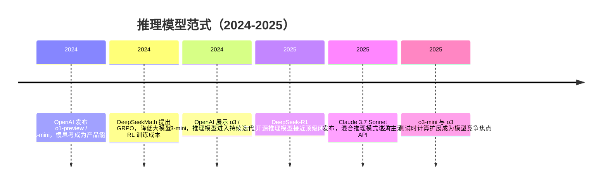

## 8.1.6 推理模型范式（2024-2025）

### 时代背景

到 2024 年，LLM 行业已经走过了“预训练规模扩张 + 指令对齐 + RLHF 产品化”的第一轮高峰。GPT-4、Claude、Gemini 等模型已经能完成写作、问答、代码生成和多模态理解，但在更硬的任务上仍然暴露出明显瓶颈：数学证明容易跳步，复杂代码修改缺乏全局规划，长链路 Agent 任务经常中途偏航，模型看似流畅但推理过程不可控。上一阶段的核心结论是：单纯扩大参数和数据并不能线性带来可靠推理能力，尤其是在需要多步验证、反思和纠错的任务中，模型需要的不只是“更会说”，而是“更会想”。

推理模型范式的出现，正是对这一瓶颈的回应。它的核心转变是：把推理能力从 Prompt 技巧和外部工具编排，部分前移到模型训练与推理机制本身。OpenAI 将“花更多时间思考”产品化，DeepSeek 用强化学习证明开源模型也能涌现强推理行为，Anthropic 则把快思考与慢思考合并到一个可控模型里。这一阶段之所以能发生，离不开三个条件：一是高质量数学、代码、逻辑数据积累；二是强化学习与自动验证器结合，使模型可以从结果反馈中自我改进；三是推理侧算力成本下降，让 Test-Time Compute Scaling 成为可接受的工程选项。下一阶段的 Agentic AI，正是在“模型本身能规划和反思”的基础上，进一步走向长任务执行与自主工具使用。

### 关键突破

#### OpenAI o1：慢思考成为产品能力（2024）

**一句话定位**：o1 是闭源大模型从“即时回答型指令模型”转向“推理优先型模型”的标志性节点。

**核心贡献**：

o1 解决的是 GPT-4 时代一个非常典型的问题：模型知道很多，但在复杂题目上经常缺少稳定的中间推理过程。OpenAI 在 2024 年 9 月发布 o1-preview 和 o1-mini，明确将其定义为“会在回答前花更多时间思考”的模型系列，主打科学、代码和数学等复杂任务。OpenAI 后续文章也指出，o1 的表现会随着训练阶段强化学习规模和推理阶段思考时间增加而提升，这就是推理模型范式中最关键的思想：**推理能力不仅来自预训练参数，也来自测试时计算投入**。([OpenAI](https://openai.com/index/introducing-openai-o1-preview/))

工程上，这相当于把过去开发者手写的“请一步步思考”“先分析再回答”“自我检查”等 Prompt 模板，部分内化为模型能力。传统指令模型更像一个快速补全器，而 o1 更像一个会先在内部草稿纸上尝试、回滚、再作答的求解器。OpenAI 的 o1 System Card 也强调，该模型通过强化学习训练复杂推理能力，并能在回答前生成较长的推理过程；这使安全评估、红队测试和 Preparedness Framework 也变得更重要。([arXiv](https://arxiv.org/abs/2412.16720))

**工程师视角**：

如果你在 2024 年做 AI 应用，o1 改变的不是“所有接口都换成新模型”，而是任务路由策略。以前很多复杂任务会靠 Prompt Engineering、Self-Consistency、多轮反问、工具链校验来堆效果；o1 出现后，可以把数学推导、复杂 Bug 定位、算法题、代码重构方案、科研问题分析等高难任务路由给 reasoning model，把普通 FAQ、摘要、改写继续交给便宜的指令模型。

但代价也很明显：慢思考意味着更高延迟和更高成本。工程上不能简单把 o1 当作 GPT-4 的升级版，而要把它看成“昂贵专家模型”。合理做法是设计 Router：简单任务走低成本模型，复杂任务才升级到 reasoning model；同时在产品 UI 中明确展示“正在深度分析”，否则用户会把延迟误认为服务卡顿。

> 📄 原始论文 / 报告：Jaech et al., 2024, arXiv:2412.16720（OpenAI o1 System Card）

#### OpenAI o3：测试时计算扩展继续推高上限（2024-2025）

**一句话定位**：o3 将 o1 开启的推理路线进一步推向更强的编码、数学、科学和视觉推理能力。

**核心贡献**：

OpenAI 在 2024 年 12 月对外展示 o3 和 o3-mini，并在 2025 年陆续发布 o3-mini 与 o3 / o4-mini。o3-mini 被定位为 reasoning 系列中更具成本效率的模型，重点提升 STEM 任务，尤其是科学、数学和代码；o3 则被 OpenAI 称为其当时最强 reasoning model，强调在 coding、math、science、visual perception 等任务上推进前沿。([Reuters](https://www.reuters.com/technology/artificial-intelligence/openai-unveils-o3-reasoning-ai-models-test-phase-2024-12-20/))

o3 的历史意义在于，它让行业进一步确认：推理模型不是一次性的产品命名，而是一条独立技术路线。传统 Scaling Law 主要讨论训练前参数、数据和算力的关系；o 系列把问题扩展到“测试时是否也能 scaling”。换句话说，模型回答前多想一会儿、多采样几条路径、多验证几轮，能否稳定换来更高准确率？o1 给出了第一版答案，o3 则把这条路线推向更强的 benchmark 和更广任务类型。

**工程师视角**：

o3 让工程团队开始认真设计“计算预算”这个产品参数。过去 API 调用的核心参数是 temperature、top_p、max_tokens；到了 reasoning model 阶段，真正影响效果和成本的还有“思考深度”。在代码 Agent、数据分析 Agent、自动化运维 Agent 中，开发者需要决定：什么时候让模型快速给出建议，什么时候允许它花更多 token 做计划、验证和修正。

一个典型实践是分层执行：先用便宜模型做任务分类和上下文压缩；再让 o3 处理核心推理；最后用规则、单元测试或工具执行结果做外部验证。这样既能利用 o3 的强推理能力，又不会让所有请求都承担高成本。

#### DeepSeek-R1：开源推理模型的突破与 GRPO 路线（2025）

**一句话定位**：DeepSeek-R1 证明了强推理能力不只属于闭源模型，开源社区也可以通过强化学习训练出接近顶级闭源模型的 reasoning model。

**核心贡献**：

DeepSeek-R1 的关键贡献有两层。第一层是模型效果：论文介绍了 DeepSeek-R1-Zero 和 DeepSeek-R1，其中 R1-Zero 直接通过大规模强化学习训练，在没有 SFT 冷启动的情况下涌现出推理行为；但它也出现了可读性差、语言混杂等问题。为了解决这些工程问题，DeepSeek-R1 引入冷启动数据和多阶段训练流程，并报告在推理任务上达到可与 OpenAI-o1-1217 相比的表现，同时开源 R1、R1-Zero 以及基于 Qwen / Llama 蒸馏出的多个 dense 模型。([arXiv](https://arxiv.org/abs/2501.12948))

第二层是训练范式：DeepSeek-R1 采用 GRPO（Group Relative Policy Optimization）。GRPO 最早在 DeepSeekMath 中提出，是 PPO 的一种变体，核心是去掉通常与 policy model 同等规模的 critic model，改用同一问题下多条输出的 group scores 来估计 baseline，从而降低 RL 训练成本。([arXiv](https://arxiv.org/abs/2402.03300))

为什么这很重要？因为 PPO 在大模型 RL 中成本很高，critic model 会带来额外显存和训练复杂度。GRPO 的工程价值不是“数学公式更优雅”，而是让 reasoning RL 更容易扩展到开源训练体系。对中国开发者尤其重要的是，DeepSeek-R1 把推理模型能力、训练论文、模型权重和蒸馏模型一起释放出来，直接推动了国内外社区围绕本地部署、私有化推理、低成本微调和 Agent 集成的二次创新。

**工程师视角**：

DeepSeek-R1 改变了很多团队的模型选型逻辑。此前，如果你要做复杂推理，往往默认调用闭源模型；R1 之后，私有化场景有了更现实的替代方案。例如金融研报分析、企业代码库问答、内部数据分析 Agent 等场景，原本受限于数据不能出域，现在可以用 R1 或蒸馏版本做本地推理，再配合 RAG、工具调用和权限控制搭建完整系统。

但 R1 也带来新的工程挑战：推理过程 token 很长，吞吐压力大；模型可能在简单任务上“过度思考”；输出格式稳定性未必天然适合生产 API。因此上线时不能只看 benchmark，要压测真实业务链路，包括平均延迟、P99、上下文占用、JSON 输出稳定性和单位请求成本。

> 📄 原始论文：DeepSeek-AI et al., 2025, arXiv:2501.12948  
> 📄 相关方法：Shao et al., 2024, arXiv:2402.03300（DeepSeekMath / GRPO）

#### Claude 3.7 Sonnet：混合推理模式进入工程主流（2025）

**一句话定位**：Claude 3.7 Sonnet 把“快思 / 慢想”合并到同一个模型接口中，使 reasoning 不再必须依赖单独模型路由。

**核心贡献**：

Anthropic 在 2025 年 2 月发布 Claude 3.7 Sonnet，并称其为市场上首个 hybrid reasoning model。它既可以快速回答，也可以进入 extended thinking 模式，执行更长的逐步思考；API 用户还能细粒度控制模型思考多久。([Anthropic](https://www.anthropic.com/news/claude-3-7-sonnet))

这一点和 OpenAI o 系列的产品哲学有所不同。o 系列更像“专门的推理模型家族”，而 Claude 3.7 Sonnet 更强调一个模型同时承担普通对话和复杂推理。Anthropic 的 API 文档也给出了具体工程接口：通过 `thinking` 对象开启 extended thinking，并用 `budget_tokens` 设置思考 token 预算。([Claude](https://platform.claude.com/docs/en/build-with-claude/extended-thinking))

这背后的关键判断是：真实业务里，任务复杂度不是离散的。一个用户请求可能前半段只是摘要，后半段突然要求进行法律风险判断；一个代码任务可能先是简单解释，接着变成跨文件重构。混合推理模型的优势在于，开发者不必在多个模型之间频繁切换，而是可以在同一模型内调节 reasoning budget。

**工程师视角**：

Claude 3.7 Sonnet 给应用开发带来的最大变化，是“思考预算”变成可配置资源。你可以为不同功能设置不同预算：普通聊天不开启 extended thinking；代码审查给中等预算；架构设计、复杂排障、法律合同分析给高预算。这样比简单模型路由更细粒度，也更适合企业应用中的 SLA 管理。

不过它也要求工程师更重视成本护栏。思考 token 不是免费的，尤其在高并发服务中，如果所有请求都默认开启 extended thinking，很快会造成账单和延迟失控。正确做法是结合任务分类器、用户等级、请求复杂度和失败重试策略动态分配预算。

### 阶段总结

**本阶段核心主题**：2024-2025 年的关键洞见是，智能不再只靠“训练时把模型做大”，还可以通过“推理时让模型多想”获得显著提升。推理模型把算力从预训练阶段部分转移到 inference 阶段，使开发者第一次可以在“延迟 / 成本 / 准确率”之间进行更连续的权衡。

另一个重要变化是，推理能力从闭源模型扩散到开源生态。DeepSeek-R1 证明了强化学习、可验证任务和高质量蒸馏结合后，可以让开源模型具备强推理能力；Claude 3.7 Sonnet 则说明 reasoning 不一定要做成单独模型，也可以成为统一模型中的可控模式。

### 历史意义与遗留问题

这个阶段解决了三个写进教科书的问题。第一，它证明了复杂推理不是纯 Prompt Engineering 能完全解决的，模型训练目标本身必须鼓励反思、验证和多步求解。第二，它把 Test-Time Compute Scaling 从研究概念变成工程实践，开发者可以用更多推理 token 换更高准确率。第三，它让开源推理模型成为现实，打破了“强推理只能依赖闭源 API”的默认假设。

但新问题也随之出现。首先是成本问题：推理模型的 token 消耗和延迟天然更高，如何做动态预算、缓存、任务路由和提前停止，成为生产系统必须解决的问题。其次是可控性问题：模型想得更久不等于一定更正确，过度思考、错误自洽和格式漂移仍然存在。最后是安全问题：更强推理能力也意味着更强的规避、规划和工具使用能力，传统内容安全过滤不足以覆盖 Agent 时代的风险。

因此，推理模型范式并不是终点，而是下一阶段 Agentic AI 的基础设施。只有当模型具备稳定规划、反思和自我修正能力，长任务 Agent、自动代码工程师、企业工作流 Agent 才有可能从 Demo 走向生产。

---

**Sources:**

- [Introducing OpenAI o1-preview](https://openai.com/index/introducing-openai-o1-preview/)
- [[2412.16720] OpenAI o1 System Card](https://arxiv.org/abs/2412.16720)
- [OpenAI unveils 'o3' reasoning AI models in test phase](https://www.reuters.com/technology/artificial-intelligence/openai-unveils-o3-reasoning-ai-models-test-phase-2024-12-20/)
- [Claude 3.7 Sonnet and Claude Code](https://www.anthropic.com/news/claude-3-7-sonnet)
- [Building with extended thinking - Claude API Docs](https://platform.claude.com/docs/en/build-with-claude/extended-thinking)

