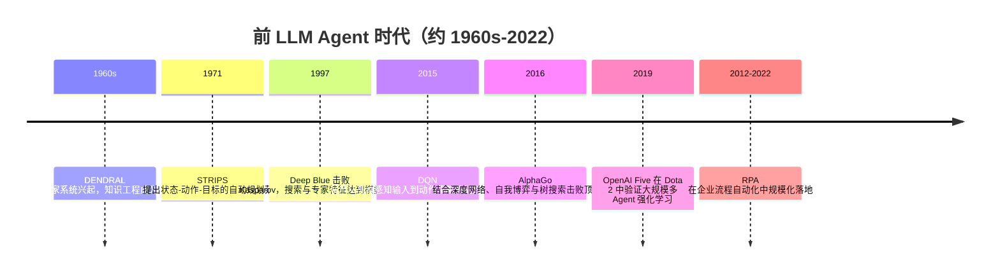

## 8.2.1 前 LLM Agent 时代（约 1960s-2022）

**本节在整体演进史中的位置**：上一节 8.1 讲的是大模型能力如何从语言建模走向通用智能接口；本节切换到 Agent 视角：在 LLM 出现之前，业界已经长期尝试让机器“感知环境、制定计划、执行动作”。本阶段的核心结论是：**前 LLM Agent 并不缺执行能力，缺的是开放世界中的语言理解、泛化推理与自我纠错能力**，这正好引出 2022-2023 年 ReAct、Toolformer、AutoGPT 等 LLM Agent 的萌芽。`粘贴的 markdown (1)。md`

### 时代背景

在 LLM Agent 之前，AI Agent 的主战场不是聊天窗口，而是三个相对封闭的环境：实验室机器人、棋类/游戏环境、企业软件流程。它们共同面对的问题是：**如何让机器在明确目标下选择动作**。早期算力弱、数据少、感知能力有限，因此最自然的方案是把专家知识写成规则，把环境抽象成符号状态，再用搜索或规划算法求解。后来 GPU、深度学习和大规模仿真环境成熟，强化学习开始把“手写规则”替换为“从交互中学习策略”。企业侧则走向另一条路线：RPA 不追求智能推理，而是把人类在 ERP、CRM、Excel、网页后台里的重复点击和录入固化为可审计脚本。这个阶段的底层逻辑很清楚：**只要环境足够封闭，Agent 可以很强；一旦进入开放语言、开放网页、开放业务流程，脆弱性就会暴露。**

### 关键突破

#### 符号 AI 与专家系统（1960s-1980s）

**一句话定位**：专家系统是第一代可落地的“知识驱动 Agent”，把专家经验从人脑搬进规则库。

**核心贡献**：DENDRAL 被广泛视为早期专家系统代表，它把有机化学家的质谱分析经验编码成启发式规则，用于辅助推断未知分子结构；MYCIN 则把感染病诊疗知识写成约 350 条生产规则，并引入 certainty factor 处理不确定性。它们解决的是早期 AI 的一个核心痛点：通用推理太难，不如先把问题限定在一个专业领域，用高质量领域知识换取可靠输出。([Massachusetts Institute of Technology](https://web.mit.edu/6.034/www/6.s966/dendral-history.pdf?utm_source=chatgpt.com))

**工程师视角**：如果你是当时的工程师，日常工作会从“写通用智能程序”变成“和专家一起做知识工程”：访谈专家、抽取规则、维护规则冲突、补充异常 case。这很像今天做企业知识库或工作流自动化时的 SOP 建模，只不过当时没有 Embedding、没有 LLM，所有知识都要人工结构化。

> 📄 代表文献：Lindsay, Buchanan, Feigenbaum & Lederberg, 1993, *Artificial Intelligence 61*, “DENDRAL: a case study of the first expert system for scientific hypothesis formation”。

#### Shakey 与 STRIPS（1966-1972 / 1971）

**一句话定位**：Shakey 是早期“感知-规划-行动”Agent 的原型，STRIPS 则奠定了经典自动规划的工程表达方式。

**核心贡献**：Shakey 由 SRI 在 1966-1972 年开发，被 Computer History Museum 描述为第一台能对自身行动进行推理的移动机器人；它能在房间、箱子、斜坡等简化环境中感知、规划并移动。STRIPS 的关键价值是把世界状态表示为谓词，把动作表示为前置条件和效果，然后搜索一组动作序列使目标成立。([CHM](https://www.computerhistory.org/revolution/artificial-intelligence-robotics/13/289?utm_source=chatgpt.com))

**工程师视角**：这改变了“机器人编程”的抽象层级。你不再只写 `move_forward()`、`turn_left()` 这种底层指令，而是描述“当前状态、目标状态、动作约束”，由规划器生成执行序列。今天 LangGraph、工作流编排、Agent planning 中的 State / Action / Transition，其实都能看到这条思想脉络。

> 📄 原始论文：Fikes & Nilsson, 1971, *Artificial Intelligence*, “STRIPS: A New Approach to the Application of Theorem Proving to Problem Solving”。

#### Deep Blue 到深度强化学习 Agent（1997-2015）

**一句话定位**：游戏成为 Agent 研究的理想沙盒，因为状态、动作、奖励都足够清晰。

**核心贡献**：Deep Blue 在 1997 年击败 Garry Kasparov，代表搜索、评估函数、专家调参在棋类封闭环境中的巅峰；但它仍然严重依赖手工特征和领域工程。2015 年 DeepMind 的 DQN 进一步推进到“从像素输入直接学习动作策略”，在 Atari 游戏上展示了端到端强化学习 Agent 的可行性。([ibm.com](https://www.ibm.com/history/deep-blue?utm_source=chatgpt.com))

**工程师视角**：这时工程重点从“写规则”转向“搭训练环境”：定义 observation、action space、reward、episode reset、并行采样和模型评估。Agent 不再只是执行器，而变成一个可以通过 trial-and-error 优化策略的系统。但代价也很明显：奖励设计稍有偏差，Agent 就会学到投机行为；环境一变，泛化能力急剧下降。

#### AlphaGo / AlphaZero / OpenAI Five（2016-2019）

**一句话定位**：强化学习 Agent 在封闭复杂环境中达到超人水平，但也暴露出对仿真、算力和明确奖励的强依赖。

**核心贡献**：AlphaGo 将深度神经网络、监督学习、人类棋谱、自我博弈强化学习和 Monte Carlo Tree Search 结合，解决了围棋巨大搜索空间下传统暴力搜索难以奏效的问题。AlphaZero 进一步弱化人类先验，仅依赖规则和自我博弈，在国际象棋、日本将棋、围棋中达到超人水平。OpenAI Five 则把多智能体强化学习推到 Dota 2 这种长时序、不完全信息、连续动作空间的复杂环境中，并在 2019 年击败世界冠军队伍 OG。([Nature](https://www.nature.com/articles/nature16961?utm_source=chatgpt.com))

**工程师视角**：这类系统让大家看到 Agent 可以通过大规模自我博弈形成策略，但它并不适合直接迁移到企业应用。原因很现实：企业流程没有无限可重置的仿真环境，奖励函数也不像“赢棋/输棋”那样清晰。你很难让一个采购 Agent 试错一百万次，因为每次错误都可能造成真实损失。

> 📄 原始论文：Silver et al., 2017, arXiv:1712.01815。  
> 📄 原始论文：OpenAI et al., 2019, arXiv:1912.06680。

#### RPA：企业软件里的“低智能 Agent”（2012-2022）

**一句话定位**：RPA 是前 LLM 时代企业侧最成功的自动化 Agent 形态，核心不是推理，而是稳定复现人类操作。

**核心贡献**：Blue Prism 称其在 2012 年提出 Robotic Process Automation 这一术语；Gartner 对 RPA 的描述也很典型：通过编排 UI 交互来模拟人类完成交易步骤。它解决的是企业系统割裂、API 不完善、人工重复录入成本高的问题。RPA 不要求系统理解业务语义，只要流程稳定、页面结构稳定、异常分支少，就能快速产生 ROI。([SS&C Blue Prism](https://www.blueprism.com/about/history/?utm_source=chatgpt.com))

**工程师视角**：RPA 把自动化从研发团队下放到业务团队：财务对账、发票录入、报表下载、HR 信息同步，都可以由“软件机器人”执行。但它的坑也很典型：页面按钮位置变了、验证码出现了、字段含义变了，Bot 就会失效。因此中国企业在 2018 年后推动 RPA+AI，常把 OCR、IDP、NLP 与 RPA 结合，用来处理票据、合同、客服工单等半结构化场景；来也、弘玑 Cyclone 等国产厂商也在 2021-2022 年进入 Gartner RPA 相关评价体系。([Laiye](https://laiye.com/news/post/581.html?utm_source=chatgpt.com))

### 阶段总结

**本阶段核心主题**：前 LLM Agent 的成功都建立在“封闭世界假设”上：规则清晰、状态可枚举、奖励可定义、异常可穷举。符号 AI 证明了知识可以驱动行动，强化学习证明了策略可以从交互中学习，RPA 证明了自动化可以在企业流程中产生商业价值。但三者共同的短板是：面对开放语言、模糊目标、跨系统协作和动态异常时，系统缺少真正的语义理解与泛化能力。

### 历史意义与遗留问题

这个阶段解决了三个写进教科书的问题：第一，Agent 不只是模型输出，而是目标、状态、动作和反馈组成的闭环；第二，在封闭环境中，搜索、规划、规则和强化学习都能达到极高可靠性；第三，企业自动化不必等待 AGI，RPA 证明“低智能、高确定性”的自动化也能创造巨大价值。

但它也留下了下一阶段必须解决的问题：规则系统维护成本高，强化学习依赖昂贵仿真和清晰奖励，RPA 缺少语义理解与异常恢复能力。2022 年之后，LLM 的出现提供了新的接口层：用自然语言理解任务，用工具调用连接外部系统，用 ReAct 把推理和行动串起来。也正是这些能力，使 Agent 从“封闭环境里的策略机器”开始走向“开放任务中的协作执行者”。

---

**Sources:**

- [DENDRAL: a case study of the first expert system for ...](https://web.mit.edu/6.034/www/6.s966/dendral-history.pdf?utm_source=chatgpt.com)
- [Shakey - CHM Revolution - Computer History Museum](https://www.computerhistory.org/revolution/artificial-intelligence-robotics/13/289?utm_source=chatgpt.com)
- [Deep Blue](https://www.ibm.com/history/deep-blue?utm_source=chatgpt.com)
- [Mastering the game of Go with deep neural networks and ...](https://www.nature.com/articles/nature16961?utm_source=chatgpt.com)
- [History](https://www.blueprism.com/about/history/?utm_source=chatgpt.com)
- [Gartner Hype Cycle 报告发布，来也科技RPA、NLT 双入选 ...](https://laiye.com/news/post/581.html?utm_source=chatgpt.com)

