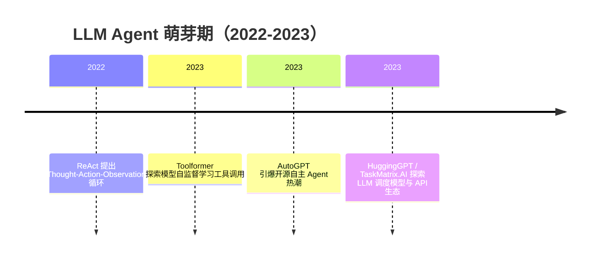

## 8.2.2 LLM Agent 萌芽期（2022-2023）

### 时代背景

2022 年以前，AI 自动化主要有两条路线：一条是 RPA / 规则引擎，稳定但只能处理流程固定的任务；另一条是强化学习 Agent，在游戏、机器人仿真等封闭环境中表现突出，但迁移到真实业务系统成本极高。ChatGPT 在 2022 年 11 月发布后，开发者第一次看到一个通用语言模型可以稳定理解自然语言任务、补全步骤、解释错误，并以对话方式持续迭代；GPT-4 在 2023 年 3 月发布后，模型在复杂指令理解、代码生成和多步骤推理上的可用性进一步提高。这个阶段的核心瓶颈不再是“模型能不能回答问题”，而是“模型能不能把回答变成行动”：访问网页、调用 API、读写文件、选择工具、观察结果并继续修正。LLM Agent 的萌芽，本质上就是把 LLM 从 Chatbot 推向 Controller：它不再只是生成文本，而是成为调度外部工具和执行环境的中枢。([OpenAI](https://openai.com/index/chatgpt/))

---

### 关键突破

#### ReAct（2022）

**一句话定位**：ReAct 是 LLM Agent 范式的开山之作，它把 Chain-of-Thought 的“思考”与工具/环境交互的“行动”合并成一个循环。

**核心贡献**：

ReAct 解决的是早期 CoT 的一个关键痛点：模型可以写出看似合理的推理链，但如果中间事实错了，后续推理会沿着错误一路扩散。ReAct 的做法不是让模型一次性想完，而是让它交替生成 Thought、Action、Observation：先推理当前该做什么，再调用外部环境获取证据，然后根据观察结果继续更新计划。论文在 HotpotQA、FEVER、ALFWorld、WebShop 等任务上验证了这种范式，并指出 ReAct 可以通过 Wikipedia API 等外部信息源缓解幻觉和错误传播问题。([arXiv](https://arxiv.org/abs/2210.03629))

技术上，ReAct 的创新并不复杂，但工程意义极大：它把 Agent 的执行轨迹显式化了。过去 Prompt 只是输入输出；ReAct 之后，开发者开始关心中间过程：模型为什么调用这个工具？参数是什么？工具返回后模型如何调整？这直接影响了后来 LangChain Agent、LangGraph、AutoGen 等框架的基本抽象。

**工程师视角**：

如果你是 2022 年的工程师，ReAct 改变的是调试方式。你不再只看最终答案，而是看完整轨迹：哪一步 Thought 偏了、哪个 Action 参数错了、Observation 有没有被正确吸收。它也让“工具调用”从 Prompt Hack 变成可设计的工作流。常见实践是给模型少量示例，让它学习“遇到不确定事实先查工具，而不是硬编”；这也是后来生产级 Agent 可观测性、Trace、Step Replay 的源头。

> 📄 原始论文：Yao et al., 2022, arXiv:2210.03629。([arXiv](https://arxiv.org/abs/2210.03629))

---

#### Toolformer（2023）

**一句话定位**：Toolformer 证明了模型不仅可以被提示去调用工具，还可以通过自监督数据学习“何时调用、调用什么、如何使用结果”。

**核心贡献**：

ReAct 更偏 Prompting 范式：人通过示例教模型怎么思考和行动。Toolformer 进一步提出一个训练问题：能否让语言模型自己学会插入 API 调用？它关注的是 LLM 的结构性短板，例如算术、事实查询、翻译、日历查询等任务，传统小工具往往比大模型更可靠。Toolformer 用少量工具调用示例引导模型在大规模文本中自动标注潜在 API 调用位置，再通过筛选保留能降低语言建模损失的调用样本，最终训练模型学会调用 calculator、search engine、QA system、translation system、calendar 等工具。([arXiv](https://arxiv.org/abs/2302.04761))

这项工作的历史意义在于，它把“工具使用”从手写规则推进到模型能力的一部分。它隐含了一个重要判断：未来的强模型不一定要把所有能力都压进参数里，而应学会在合适时机调用外部系统。这个判断后来影响了 Function Calling、Tool Use、MCP 等协议化方向。

**工程师视角**：

Toolformer 给工程师的启发是：工具调用质量不只取决于工具本身，还取决于模型是否理解工具边界。生产中最常见的问题不是“有没有搜索工具”，而是模型在不该搜时乱搜、该搜时不搜、参数拼错、拿到结果后不会用。Toolformer 提醒我们，工具描述、调用样例、返回格式、失败反馈都应该被当成训练数据或高质量 Prompt 资产管理，而不是随手写在系统提示词里。

> 📄 原始论文：Schick et al., 2023, arXiv:2302.04761。([arXiv](https://arxiv.org/abs/2302.04761))

---

#### AutoGPT（2023.03）

**一句话定位**：AutoGPT 是第一个让大众和开发者同时感受到“自主 Agent”想象力的开源项目。

**核心贡献**：

AutoGPT 于 2023 年 3 月 30 日发布，它的核心思路很直接：用户给一个高层目标，系统让 GPT-4 自己拆解任务、生成子目标、调用工具、保存记忆，并循环推进。与 ReAct 和 Toolformer 主要停留在论文实验不同，AutoGPT 把 Agent 做成了一个能跑的开源应用：Web 搜索、文件读写、代码执行、长期记忆、任务队列，这些能力被包装成“给它一个目标，它自己干活”的体验。IBM 对 AutoGPT 的介绍也指出，它区别于需要用户连续提示的 ChatGPT，目标是自动化原本需要多轮人工提示的项目。([ibm.com](https://www.ibm.com/think/topics/autogpt))

但 AutoGPT 的真正价值不在于它当时有多可靠，而在于它暴露了 Agent 的核心工程难题：循环失控、目标漂移、工具误用、成本不可控、上下文不断膨胀、缺少人工审批。它一边把 GitHub 社区热情推到高点，一边也让工程界意识到：只靠一个 while loop 加 GPT-4，并不能得到可靠的生产系统。关于其迅速获得超过 10 万 GitHub stars 的说法，公开资料多用“数周到数月内”描述，具体天数不同来源表述不一，应避免写成严格事实。([Rentelligence](https://rentelligence.ai/blog/history-of-ai-agents/))

**工程师视角**：

AutoGPT 改变的是产品原型方式。以前做 AI 应用，多数是“用户问、模型答”；AutoGPT 之后，很多团队开始尝试“用户给目标、系统执行任务”。但它也给工程师上了一课：Agent 必须有边界。生产环境不能让模型无限循环调用付费 API，也不能让它未经确认写文件、发邮件、下单或改数据库。因此，后来的 Human-in-the-Loop、权限系统、执行预算、最大步数、工具白名单，本质上都是对 AutoGPT 式自主性的工程约束。

---

#### HuggingGPT / TaskMatrix.AI（2023）

**一句话定位**：HuggingGPT 和 TaskMatrix.AI 把 LLM Agent 从“自己执行任务”推进到“调度一组专用模型/API 共同完成任务”。

**核心贡献**：

HuggingGPT 的问题意识是：单个 LLM 即使很强，也不可能擅长所有模态和专业任务；但 Hugging Face 社区已经有大量视觉、语音、文本、生成类模型。它让 ChatGPT 扮演控制器：理解用户请求，规划子任务，根据模型描述选择 Hugging Face 上的专用模型，执行后汇总结果。这是早期“LLM as Controller”的典型方案，也预示了后来的多模态 Agent 和模型路由系统。需要注意，HuggingGPT 的准确 arXiv 编号是 2303.17580。([arXiv](https://arxiv.org/abs/2303.17580))

TaskMatrix.AI 则更像一篇生态蓝图论文。它提出用 foundation model 作为“大脑”，连接大量 API、模型和系统作为“工具层”，完成数字世界甚至物理世界中的复杂任务。与 HuggingGPT 偏模型社区调度不同，TaskMatrix.AI 更强调 API 生态、任务规划、接口匹配和执行反馈。它指出基础模型能生成高层方案，但专业任务仍需要外部系统补足，这正是后来 MCP、插件系统、企业工具连接器的思想源头之一。([arXiv](https://arxiv.org/abs/2303.16434))

**工程师视角**：

这两项工作改变的是系统架构想象。工程师开始把 LLM 放在“编排层”，而不是“能力层”的唯一来源。一个企业 Agent 不必让模型自己会 OCR、SQL、图片生成、代码执行、权限判断；更合理的方式是让 LLM 做任务拆解和工具选择，把确定性、专业性、可审计性要求高的部分交给专用服务。对中国开发者尤其相关的是，这种架构天然适合国内多模型、多云、多 API 的环境：可以用 Qwen、DeepSeek、Kimi 等模型做不同任务路由，也可以把企业内部系统、钉钉/飞书、知识库、数据库封装成工具接入。

> 📄 原始论文：Shen et al., 2023, arXiv:2303.17580；Liang et al., 2023, arXiv:2303.16434。([arXiv](https://arxiv.org/abs/2303.17580))

---

### 阶段总结

**本阶段核心主题**：LLM Agent 的关键转变，是把大模型从“生成答案的模型”变成“驱动行动的控制器”。ReAct 解决了推理与行动如何交替，Toolformer 讨论工具调用能否内化为模型能力，AutoGPT 证明了自主循环的产品想象力，而 HuggingGPT / TaskMatrix.AI 则把 Agent 推向工具生态和多模型编排。

---

### 历史意义与遗留问题

这个阶段解决了三个写进教科书的问题。第一，Agent 的最小闭环被定义出来：理解目标、规划步骤、调用工具、观察结果、继续迭代。第二，工具不再是外围脚本，而成为 LLM 能力边界的一部分。第三，LLM 在系统架构中的角色发生变化：它可以是 Controller、Planner、Router，而不只是 Chatbot。

但它也留下了下一阶段必须解决的新问题：Agent 执行过程不稳定，容易循环、幻觉和越权；工具接口缺少统一协议，不同框架各自定义格式；多 Agent 和多工具系统缺少可靠的状态管理、权限控制与可观测性。因此，2023-2024 年的主线自然转向框架化和协议化：LangChain、OpenAI Function Calling、LangGraph、AutoGen、CrewAI、MCP 等开始出现，目标不是再证明 Agent “能动起来”，而是让它“可控、可测、可上线”。

---

**Sources:**

- [Introducing ChatGPT](https://openai.com/index/chatgpt/)
- [ReAct: Synergizing Reasoning and Acting in Language Models](https://arxiv.org/abs/2210.03629)
- [What is AutoGPT?](https://www.ibm.com/think/topics/autogpt)
- [History & Evolution of AI Agents: Timeline & Key Milestones](https://rentelligence.ai/blog/history-of-ai-agents/)

