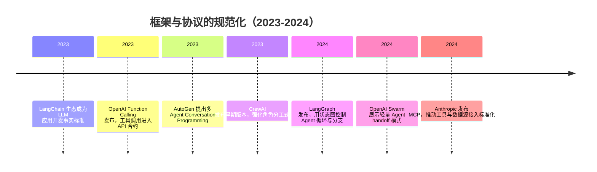

## 8.2.3 框架与协议的规范化（2023-2024）

**时间范围**：2023-2024  
**本节在整体演进史中的位置**：上一阶段的 ReAct、Toolformer、AutoGPT 证明了”LLM 可以调用工具、拆解任务、执行行动”，但工程上仍然脆弱；本阶段的核心转变，是把 Agent 从 Prompt Hack 推向框架化、协议化、可调试的工程系统；这也为下一阶段的 Computer Use、GUI Agent 与生产级 Agent 平台埋下基础。

### 时代背景

2023 年初，LLM Agent 最大的问题不是“想象力不够”，而是“工程边界不清”。AutoGPT 类项目让开发者第一次看到模型可以自我规划、调用工具、写文件、访问网络，但很快也暴露出死循环、工具参数不稳定、上下文爆炸、状态不可恢复、调试困难等问题。彼时的 Agent 更像一组复杂 Prompt 加 Python glue code：能演示，但难上线。突破发生在 2023-2024 年，是因为三个条件同时成熟：第一，GPT-4、Claude、Gemini 等模型的指令跟随和 JSON 输出能力明显增强；第二，API 厂商开始把工具调用能力产品化，而不是让开发者靠自然语言约定格式；第三，RAG、向量数据库、可观测性和云原生部署工具已经形成基础设施，使 Agent 可以被嵌入真实业务流。于是行业的关注点从“让模型自己想办法”转向“给模型一个受控运行时”。

### 关键突破

#### LangChain 生态崛起（2023）

**一句话定位**：LangChain 是 LLM 应用工程化的第一代事实标准，把“模型调用 + 工具 + 记忆 + 检索”包装成可复用组件。

**核心贡献**：它解决的是早期 LLM 应用大量重复造轮子的问题。没有框架时，开发者需要自己封装模型 API、Prompt 模板、工具调用、文档加载、向量库连接和多轮记忆。LangChain 用 Chain、Agent、Memory、Retriever 等抽象，把这些能力拆成可组合模块。官方仓库也将其定位为构建 Agent 和 LLM-powered applications 的框架，并强调可连接第三方组件与集成生态。([GitHub](https://github.com/langchain-ai/langchain))

**工程师视角**：当时的工程实践从“写一个脚本调 OpenAI API”变成“搭一条 LLM pipeline”。你可以快速接入 PDF、数据库、搜索、向量库和模型供应商，做 RAG、客服 Bot、SQL Agent。它的代价是抽象层较厚，复杂 Agent 调试时容易出现“框架帮你做了什么看不清”的问题，这也是后来 LangGraph 出现的重要原因。

#### OpenAI Function Calling（2023）

**一句话定位**：Function Calling 把工具调用从 Prompt 约定升级为 API 原生能力，是 Agent 协议化的关键节点。

**核心贡献**：OpenAI 在 2023 年 6 月 13 日发布 Function Calling，允许开发者向 `gpt-4-0613` 和 `gpt-3.5-turbo-0613` 描述函数，由模型选择是否输出符合函数签名的 JSON 参数。([OpenAI](https://openai.com/index/function-calling-and-other-api-updates/)) 这解决了 ReAct 时代常见的格式脆弱问题：过去模型可能输出“我想调用天气工具”，也可能输出一段无法解析的伪 JSON；Function Calling 则把工具名、参数 schema、调用意图放进 API 合约。

**工程师视角**：日常开发从“解析模型文本”变成“校验结构化参数”。这极大降低了工具接入的工程成本，也让重试、参数验证、权限控制变得可设计。但它没有解决所有问题：模型仍可能选错工具、传错参数，工具执行后的下一步决策仍需要外部 runtime 管理。

#### AutoGen（2023）

**一句话定位**：AutoGen 是多 Agent 对话框架的代表作，把 Agent 协作建模为可编程的多方 conversation。

**核心贡献**：Microsoft Research 的 AutoGen 论文提交于 2023 年 8 月，标题为 *AutoGen: Enabling Next-Gen LLM Applications via Multi-Agent Conversation*，arXiv 编号为 2308.08155。论文将 AutoGen 定义为一个开源框架，支持多个可定制、可对话的 Agent 协作，并可组合 LLM、人类输入和工具。([arXiv](https://arxiv.org/abs/2308.08155)) 它的重要性在于不再把 Agent 看成单体智能，而是看成一组角色之间的消息传递系统。

> 📄 原始论文：Wu et al., 2023, arXiv:2308.08155

**工程师视角**：AutoGen 改变了代码生成、数据分析、研究助理等场景的实现方式。你可以定义 Coder、Reviewer、Executor、UserProxy，让它们通过对话推进任务，而不是把所有职责塞进一个超长 Prompt。常见坑是多 Agent 并不天然更可靠：角色越多，Token 成本越高，状态分叉越复杂，终止条件越难设计。

#### LangGraph（2024）

**一句话定位**：LangGraph 把 Agent runtime 从“隐式循环”改造成“显式状态图”，是 Agent 走向生产控制面的关键一步。

**核心贡献**：LangChain 在 2024 年 1 月 22 日发布 LangGraph，官方说明其用于自定义 Agent Runtime，支持逻辑循环并跟踪应用状态。([LangChain Changelog](https://changelog.langchain.com/announcements/week-of-1-22-24-langchain-release-notes)) 这解决了 LangChain Agent 早期的核心痛点：执行路径不透明、循环难控制、人工审批难插入、失败后难恢复。LangGraph 用 Node、Edge、State、Conditional Edge 表达控制流，让 ReAct、Plan-and-Execute、Multi-Agent 都可以落到图结构上。

**工程师视角**：这让 Agent 开发接近工作流工程。你可以把“检索-分析-调用工具-人工审批-写入系统”拆成节点，并在每个节点记录状态、做重试、加日志、插入 Human-in-the-loop。对生产系统而言，显式图比“模型自由发挥”更重要，因为业务系统要的是可回放、可审计、可中断恢复。

#### CrewAI / Swarm（2023-2024）

**一句话定位**：CrewAI 和 Swarm 代表了角色分工范式的工程化：前者偏“团队协作建模”，后者偏“轻量 handoff 模式”。

**核心贡献**：CrewAI 0.1.0 于 2023 年 11 月发布，定位为编排可角色扮演、可协作的自治 Agent 框架，早期就提供 Agent、Task、Crew、Process 等抽象。([CrewAI 文档](https://docs.crewai.com/en/changelog)) 它把“研究员、写作者、审查者、经理”这类组织结构映射成 Agent 结构，适合内容生成、报告分析、市场研究等任务。OpenAI Swarm 则在 2024 年作为实验性多 Agent 编排框架出现，强调 lightweight、controllable、testable，通过 `Agent` 和 handoffs 两个原语表达任务转交。([GitHub](https://github.com/openai/swarm))

**工程师视角**：这类框架让团队更容易向非技术同事解释 Agent 设计：每个 Agent 有角色、目标、工具和交付物。但工程师要警惕“组织结构幻觉”：不是每个任务都需要多 Agent。简单分类、抽取、问答，用单 Agent 或普通 Chain 更稳定；多 Agent 适合职责边界清晰、需要互相审查或并行探索的任务。

#### MCP 协议（2024）

**一句话定位**：MCP 是工具接入层的标准化尝试，目标是让 Agent 不再为每个数据源重复写一套连接器。

**核心贡献**：Anthropic 在 2024 年 11 月 25 日开源 Model Context Protocol，称其为连接 AI assistant 与内容仓库、业务工具、开发环境等数据所在系统的新标准。([Anthropic](https://www.anthropic.com/news/model-context-protocol)) MCP 的核心判断是：模型能力提升很快，但模型被困在数据孤岛里；如果每个模型、每个工具、每个数据源都要定制集成，生态无法规模化。MCP 通过 MCP Server / Client 的方式，把工具、资源、Prompt 暴露为统一接口。

**工程师视角**：对企业应用尤其关键。过去接 Gmail、Slack、GitHub、Postgres、内部知识库，需要分别适配不同 SDK；MCP 的价值是把“工具接入”从应用代码中剥离出来。对中国开发者来说，这一点同样重要：国内企业常同时使用钉钉、飞书、企微、阿里云、腾讯云、私有数据库，统一协议能显著降低 Agent 接入内部系统的复杂度。

### 阶段总结

**本阶段核心主题**：Agent 工程从“Prompt 驱动的自发行为”转向“框架约束下的可控执行”。Function Calling 规范了模型与工具之间的参数边界，LangGraph 规范了 Agent 内部控制流，MCP 则试图规范 Agent 与外部系统的连接方式。真正的进步不是 Agent 变得更“自由”，而是它开始被放进可测试、可审计、可部署的工程框架中。

### 历史意义与遗留问题

这个阶段解决了三个写进教科书的问题：第一，LLM 应用有了组件化开发范式；第二，工具调用从文本解析进入结构化协议；第三，多 Agent 和有状态 Agent 有了可复用 runtime。它把 Agent 从 demo 推向了工程项目。

但新问题也随之出现：框架抽象越多，调试和迁移成本越高；多 Agent 越复杂，稳定性和成本越难控；工具接入越开放，权限、安全和 Prompt Injection 风险越高。也正因为这些问题，下一阶段的重点会转向更真实的执行环境：Computer Use、GUI Agent、长任务持久化、可观测性、安全沙箱，以及面向企业生产的 Agent 平台。

---

**Sources:**

- [GitHub - langchain-ai/langchain: The agent engineering platform · GitHub](https://github.com/langchain-ai/langchain)
- [Function calling and other API updates | OpenAI](https://openai.com/index/function-calling-and-other-api-updates/)
- [[2308.08155] AutoGen: Enabling Next-Gen LLM Applications via Multi-Agent Conversation](https://arxiv.org/abs/2308.08155)
- [LangChain - Changelog |  Introducing LangGraph](https://changelog.langchain.com/announcements/week-of-1-22-24-langchain-release-notes)
- [Changelog - CrewAI](https://docs.crewai.com/en/changelog)
- [Introducing the Model Context Protocol \ Anthropic](https://www.anthropic.com/news/model-context-protocol)

