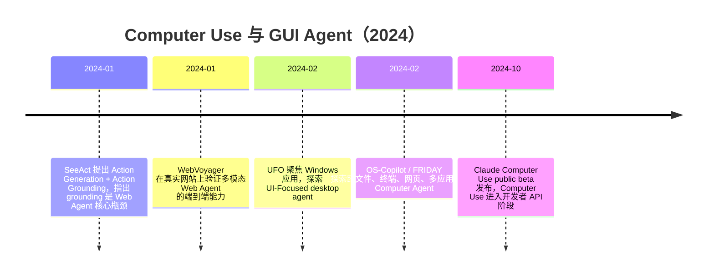

### 8.2.4 Computer Use 与 GUI Agent（2024）

**时间范围**：2024.01-2024.10，重点是从 Web Agent、OS Agent 到通用 Computer Use API 的成型过程。  
**本节位置**：上一阶段的核心是 Function Calling、LangGraph、AutoGen、MCP 等框架与协议，把 Agent 的”工具调用”标准化；本阶段的核心转变，是 Agent 不再只调用结构化 API，而是开始像人一样看屏幕、点按钮、敲键盘；下一阶段则进入 OpenAI Operator、企业级 Agent Builder、长任务执行与可靠性评估的生产化竞争。

---

### 时代背景

2024 年初，LLM Agent 已经能写代码、调用搜索、访问数据库，但它仍然被困在“有 API 才能行动”的世界里。现实企业系统恰恰相反：大量流程存在于网页后台、Windows 客户端、OA、财务软件、CRM、ERP、低代码平台中，很多没有稳定 API，或者 API 权限申请成本很高。传统 RPA 能点按钮，但依赖坐标、XPath、录制脚本，页面稍微变化就失效；LLM Agent 能理解任务，却缺少可靠的视觉感知和动作落地能力。GUI Agent 正是在这两者之间出现：用多模态模型理解屏幕，用 Agent 循环规划步骤，再用鼠标、键盘、浏览器或操作系统接口执行动作。

这个阶段能突破，主要因为三个条件同时成熟：第一，GPT-4V、Claude 3.5 Sonnet 等多模态模型开始具备可用的界面理解能力；第二，Playwright、浏览器自动化、Accessibility Tree、截图标注等工程工具已经足够成熟；第三，Agent 框架从 ReAct 走向有状态执行，能够记录观察、动作、失败重试和中间状态。GUI Agent 的意义不只是“让模型点网页”，而是把数字世界中原本无法 API 化的长尾软件，第一次纳入了 LLM Agent 的可操作范围。

---

### 关键突破

#### WebVoyager（2024）

**一句话定位**：WebVoyager 是 2024 年 Web Agent 从“网页文本解析”走向“真实网站多模态交互”的代表性工作。

**核心贡献**：

WebVoyager 承接的是早期 Web Agent 的核心痛点：过去很多系统只在静态网页快照或简化模拟环境中评估，输入也往往只依赖 HTML 或文本，这和真实网站差距很大。真实网站有弹窗、懒加载、复杂布局、广告、登录态和动态组件，光看 DOM 很容易被噪声淹没。

它的关键思路是把网页当成“人看到的界面”，让 Large Multimodal Model 同时利用截图和文本信息，在真实网站上完成端到端任务。论文构建了覆盖 15 个常用网站的真实任务 benchmark，并用 GPT-4V 的多模态能力评估开放式 Web Agent 结果。WebVoyager 在其 benchmark 上达到 59.1% 任务成功率，明显高于 text-only 设置，也说明“视觉输入”不是装饰，而是 Web Agent 能否进入真实场景的关键变量。([arXiv](https://arxiv.org/abs/2401.13919))

**工程师视角**：

如果你在 2024 年做网页自动化，这个工作会改变你的默认设计。过去你可能优先写爬虫、解析 DOM、找 XPath；WebVoyager 之后，合理的工程架构变成“截图 + DOM 摘要 + Action Space + 执行器”。也就是说，不再假设模型必须读完整 HTML，而是把页面压缩成模型可理解的观察：当前截图、候选元素、历史动作、任务目标。常见坑也很清晰：视觉模型能判断“下一步应该点登录按钮”，但未必能稳定映射到准确坐标，所以动作空间要尽量离散化，比如 CLICK(selector)、TYPE(selector, text)、SCROLL，而不是直接让模型输出任意像素点。

> 📄 原始论文：He et al., 2024, arXiv:2401.13919。([arXiv](https://arxiv.org/abs/2401.13919))

#### SeeAct（2024）

**一句话定位**：SeeAct 把 GUI Agent 的核心矛盾讲清楚了：多模态模型会“想”，但难在把想法精确落到页面元素上。

**核心贡献**：

SeeAct 的洞见非常工程化：Web Agent 可以拆成两个阶段。第一阶段是 **Action Generation**，模型根据任务、网页截图和历史步骤生成“下一步该做什么”的自然语言计划；第二阶段是 **Action Grounding**，把这个计划映射到具体 HTML 元素和操作类型，例如 CLICK、TYPE、SELECT。SeeAct 在在线网站评估中展示了 GPT-4V 作为通用 Web Agent 的潜力，但也指出 grounding 仍然是主要瓶颈：如果人工提供理想 grounding，任务完成率可以显著提高；现实中自动 grounding 仍有明显差距。([arXiv](https://arxiv.org/abs/2401.01614))

**工程师视角**：

SeeAct 对工程实践最大的影响，是让大家不再把 GUI Agent 简单写成一个 Prompt：“看图，然后告诉我点击哪里”。更稳的做法是拆层：Planner 负责语义决策，Grounder 负责元素定位，Executor 负责调用浏览器或系统 API，Verifier 负责检查执行后状态。这个拆分在生产里很重要，因为失败原因不同，修复策略也不同：如果 Planner 错了，要改任务提示和上下文；如果 Grounder 错了，要改元素候选生成、视觉标注或坐标映射；如果 Executor 错了，要处理页面加载、权限、超时和重试。

> 📄 原始论文：Zheng et al., 2024, arXiv:2401.01614。([arXiv](https://arxiv.org/abs/2401.01614))

#### OS-Copilot / UFO（2024）

**一句话定位**：OS-Copilot 和 UFO 把 Agent 的活动边界从浏览器扩展到操作系统和桌面软件。

**核心贡献**：

OS-Copilot 解决的是“Agent 只能在单一网站或单一工具内行动”的问题。它提出构建 generalist computer agent，让 Agent 能接口化地使用操作系统中的网页、终端、文件、多媒体和第三方应用，并用 FRIDAY 展示自我积累技能的能力。论文报告 FRIDAY 在 GAIA benchmark 上相较此前方法有 35% 提升，并展示了在 Excel、PowerPoint 等软件中的自改进能力。([arXiv](https://arxiv.org/abs/2402.07456))

UFO 则更聚焦 Windows OS。它利用 GPT-Vision 观察 Windows 应用的 GUI 和控件信息，采用 dual-agent framework 分析界面与任务，并通过 control interaction module 把动作自动落到具体控件上。论文在 9 个常用 Windows 应用上测试，强调这是面向 Windows OS 任务完成的 UI Agent。需要注意，OS-Copilot 的 arXiv 编号是 2402.07456；UFO 才是 Zhang et al., 2024, arXiv:2402.07939。([arXiv](https://arxiv.org/abs/2402.07456))

**工程师视角**：

这类工作对企业场景非常关键。很多国内政企、金融、财税、制造业系统不是现代 SaaS，而是历史悠久的 Windows 客户端、浏览器控件、远程桌面和混合内网系统。过去要自动化这些流程，只能写 RPA 脚本；OS-Copilot / UFO 提供了新的架构想象：用 LLM 负责理解需求和异常分支，用视觉与控件树负责定位，用可审计的执行器完成操作。选型建议是：读写财务、审批、交易类系统时，不能直接让 Agent 全自动执行，必须加入 sandbox、权限隔离、操作日志和 Human-in-the-Loop；但在测试、数据录入、报表生成、内部知识检索这类低风险流程中，GUI Agent 已经具备较高探索价值。

> 📄 原始论文：Wu et al., 2024, arXiv:2402.07456。([arXiv](https://arxiv.org/abs/2402.07456))  
> 📄 原始论文：Zhang et al., 2024, arXiv:2402.07939。([arXiv](https://arxiv.org/abs/2402.07939))

#### Claude Computer Use（2024.10）

**一句话定位**：Claude Computer Use 是 GUI Agent 从论文原型走向开发者 API 的标志性事件。

**核心贡献**：

2024 年 10 月 22 日，Anthropic 发布 upgraded Claude 3.5 Sonnet，并把 **computer use** 作为 public beta 开放给开发者。官方描述很直接：开发者可以让 Claude 像人一样看屏幕、移动光标、点击按钮、输入文本；Anthropic 也明确承认该能力仍处在实验阶段，可能笨拙且容易出错。([Anthropic](https://www.anthropic.com/news/3-5-models-and-computer-use))

从工程形态看，Claude Computer Use 不只是“多模态输入”，而是把模型输出变成可执行的电脑动作。AWS Bedrock 的说明把它拆成三类工具：Computer tool 负责截图、鼠标和键盘动作；Text editor tool 负责查看、创建、替换文件；Bash tool 负责执行终端命令。这意味着 Agent 不再需要每个软件都有专门插件，而是可以通过通用桌面交互层进入浏览器、编辑器、终端和业务系统。([Amazon Web Services, Inc.](https://aws.amazon.com/blogs/aws/upgraded-claude-3-5-sonnet-from-anthropic-available-now-computer-use-public-beta-and-claude-3-5-haiku-coming-soon-in-amazon-bedrock/))

**工程师视角**：

Claude Computer Use 改变的是应用开发边界。过去你做 Agent 产品，第一步是问：“目标系统有没有 API？”现在可以多问一句：“能不能在受控桌面里让 Agent 操作？”这让软件测试、后台运营、低频管理任务、跨系统录入有了新的自动化路径。但生产约束也更强：必须运行在隔离虚拟机或容器桌面中，所有点击和输入都要记录，可逆操作优先，涉及支付、删除、审批、发信等动作必须人工确认。对工程团队来说，Computer Use 不是替代 API，而是补齐 API 不存在、API 太贵、API 覆盖不足时的最后一公里。

---

### 阶段总结

**本阶段核心主题**：2024 年的关键不是 Agent “更会聊天”，而是 Agent 开始获得数字世界中的身体。WebVoyager 和 SeeAct 证明视觉对真实网页自动化不可或缺；OS-Copilot 和 UFO 把范围扩展到操作系统；Claude Computer Use 则把这些研究方向包装成可调用 API，推动 GUI Agent 从 demo 走向产品原型。

---

### 历史意义与遗留问题

**这个阶段解决了什么**：

第一，GUI Agent 打破了“只能调用 API 才能行动”的限制，让 LLM Agent 可以进入真实软件界面。第二，它把 RPA 的脆弱脚本升级成“理解任务 + 观察界面 + 动态决策”的闭环系统。第三，它确立了后续 GUI Agent 的基本工程分层：Observation、Planning、Grounding、Execution、Verification。

**留下了什么新问题**：

最大遗留问题是可靠性。模型看得懂页面，不代表点得准；能完成一次 demo，不代表能在 1000 个用户环境中稳定运行。Grounding、状态验证、权限控制、异常恢复、审计日志，成为下一阶段的核心工程问题。更深层的问题是安全：GUI Agent 操作的是用户真实账号、真实文件和真实业务系统，一旦被 Prompt Injection、恶意网页或错误目标诱导，风险远高于普通聊天机器人。因此，2024 年的 Computer Use 是 Agent 生产化的入口，但不是终点；它把行业带入了下一阶段：如何让能操作电脑的 Agent 变得可信、可控、可回滚。

---

**Sources:**

- [[2401.13919] WebVoyager: Building an End-to-End Web Agent with Large Multimodal Models](https://arxiv.org/abs/2401.13919)
- [Introducing computer use, a new Claude 3.5 Sonnet, and Claude 3.5 Haiku \ Anthropic](https://www.anthropic.com/news/3-5-models-and-computer-use)
- [Announcing three new capabilities for the Claude 3.5 model family in Amazon Bedrock | AWS News Blog](https://aws.amazon.com/blogs/aws/upgraded-claude-3-5-sonnet-from-anthropic-available-now-computer-use-public-beta-and-claude-3-5-haiku-coming-soon-in-amazon-bedrock/)

